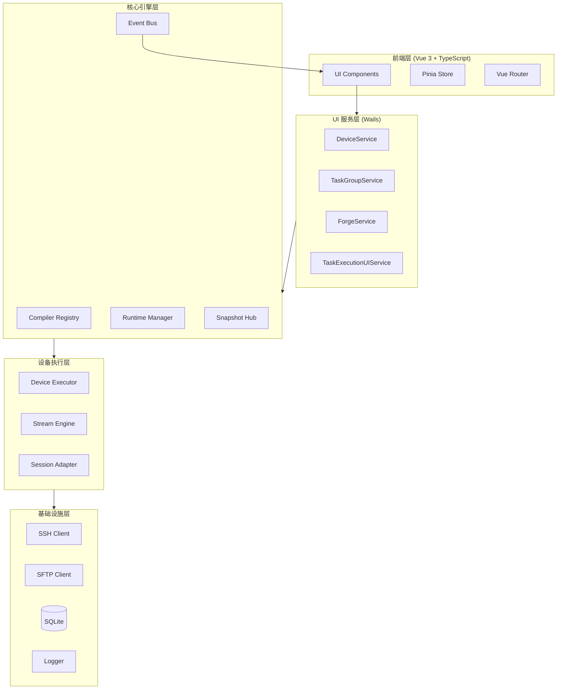
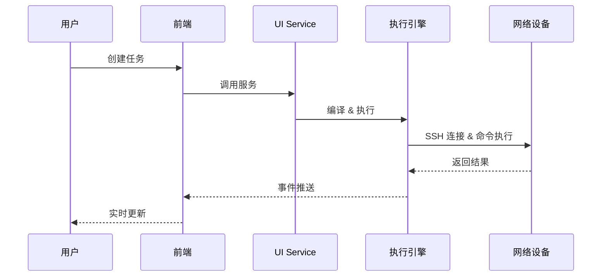

<div align="center">

# 🕸️ NetWeaverGo

**面向网络工程师的桌面级网络自动化编排工具**

[](https://go.dev/)
[](https://vuejs.org/)
[](https://www.typescriptlang.org/)
[](https://wails.io/)
[](https://tailwindcss.com/)
[](https://www.sqlite.org/)
[](#许可证)

[功能特性](#核心特性) • [快速开始](#快速开始) • [架构概览](#架构概览) • [开发指南](#开发指南) • [贡献指南](#贡献指南)

</div>

---

## 📖 项目简介

**NetWeaverGo** 是一款基于 Go 语言开发的高性能网络自动化编排与配置集散工具。专为网络工程师设计，支持批量管理网络设备（交换机、路由器），提供大规模并发命令执行、配置备份、配置生成、拓扑发现以及智能异常干预功能。

### 🎯 目标用户

- 网络工程师 - 日常设备管理与配置
- 网络运维团队 - 批量设备维护与巡检
- 网络架构师 - 网络拓扑发现与规划

### 💡 核心价值

- **高效并发** - Worker Pool 模型 + 令牌桶限流，轻松管理数百台设备
- **智能交互** - 全自动终端交互、智能翻页检测、提示符识别
- **可视化拓扑** - 基于 LLDP/接口信息的网络拓扑自动构建与展示
- **跨平台** - 基于 Wails v3 的现代化桌面应用，支持 Windows/macOS/Linux

---

## ✨ 核心特性

<table>
<tr>
<td width="50%">

### 🖥️ 设备管理
- 设备资产 CRUD 操作
- 设备分组管理
- 设备画像配置（厂商定制）
- 批量导入/导出

</td>
<td width="50%">

### ⚡ 并发执行
- Worker Pool 并发模型
- 令牌桶限流控制
- 可配置并发数（默认 10）
- 连接抖动控制

</td>
</tr>
<tr>
<td>

### 📝 命令编排
- 命令组定义与管理
- 标签分类系统
- 命令序列配置
- 任务组灵活绑定

</td>
<td>

### 🔌 智能终端
- 自动翻页检测
- 提示符智能识别
- ANSI 转义序列处理
- 多厂商适配

</td>
</tr>
<tr>
<td>

### 🗺️ 拓扑发现
- 基于 LLDP 自动发现
- 接口信息解析
- 拓扑图可视化（Cytoscape.js）
- 离线重放模式

</td>
<td>

### 📋 配置生成
- ConfigForge 模板引擎
- 变量展开与语法糖
- 范围展开（1-10 → 1,2,3,...,10）
- 批量配置生成

</td>
</tr>
<tr>
<td>

### 📊 规划比对
- 差异报告生成
- HTML/Excel 导出
- 配置变更追踪
- 历史记录对比

</td>
<td>

### 📁 文件服务器
- 内置 SFTP 服务器
- 内置 FTP 服务器
- 内置 TFTP 服务器
- 内置 HTTP 服务器

</td>
</tr>
<tr>
<td>

### 🔧 网络工具
- 批量 Ping 探测
- 网络计算器
- 协议参考手册
- 执行历史追溯

</td>
<td>

### 🛡️ 异常处理
- 单设备级挂起机制
- 用户决策（Continue/Abort）
- 超时自动处理
- 完整错误日志

</td>
</tr>
</table>

---

## 🚀 快速开始

### 环境要求

| 依赖 | 版本要求 | 说明 |
|------|----------|------|
| **Go** | >= 1.26 | 后端运行环境 |
| **Node.js** | >= 18 | 前端构建环境 |
| **npm** | >= 9 | 前端包管理 |
| **Wails CLI** | >= v3 | 桌面应用框架 |

### 安装步骤

1. **克隆仓库**

```bash
git clone https://github.com/your-username/NetWeaverGo.git
cd NetWeaverGo
```

2. **安装 Wails CLI**（如未安装）

```bash
go install github.com/wailsapp/wails/v3/cmd/wails@latest
```

3. **安装前端依赖**

```bash
cd frontend
npm install
cd ..
```

4. **构建项目**

```bash
# Windows
build.bat

# 或手动构建
cd frontend && npm run build && cd ..
wails build
```

### 运行方法

```bash
# 开发模式（热重载）
wails dev

# 生产模式
./build/bin/netWeaverGo.exe
```

---

## 📸 项目截图

> 🚧 截图即将添加...

<div align="center">

| 仪表盘 | 设备管理 |
|:------:|:--------:|
|  |  |

| 任务执行 | 拓扑发现 |
|:--------:|:--------:|
|  |  |

</div>

---

## 🏗️ 架构概览

### 整体架构



### 数据流向



### 模块说明

| 模块 | 路径 | 职责 |
|------|------|------|
| **入口模块** | `cmd/netweaver/` | 应用程序入口，初始化子系统 |
| **UI 服务层** | `internal/ui/` | Wails 服务，处理前端请求 |
| **任务执行** | `internal/taskexec/` | 统一任务编排与执行引擎 |
| **设备执行** | `internal/executor/` | SSH 会话管理与命令执行 |
| **通信模块** | `internal/sshutil/` | SSH/SFTP 连接管理 |
| **流匹配器** | `internal/matcher/` | 提示符/分页符检测 |
| **终端处理** | `internal/terminal/` | ANSI 解析与终端重放 |
| **解析服务** | `internal/parser/` | 命令输出解析（正则/聚合） |
| **配置生成** | `internal/forge/` | ConfigForge 模板引擎 |
| **数据模型** | `internal/models/` | 领域模型定义 |
| **数据访问** | `internal/repository/` | 数据库操作层 |
| **配置管理** | `internal/config/` | 应用配置与数据库 |
| **前端应用** | `frontend/` | Vue 3 单页应用 |

---

## 🛠️ 技术栈

### 后端

| 技术 | 版本 | 用途 |
|------|------|------|
| [Go](https://go.dev/) | 1.26 | 主要编程语言 |
| [Wails](https://wails.io/) | v3 | 桌面应用框架 |
| [GORM](https://gorm.io/) | v1.31 | ORM 框架 |
| [SQLite](https://www.sqlite.org/) | - | 嵌入式数据库 |
| [golang.org/x/crypto](https://pkg.go.dev/golang.org/x/crypto) | v0.50 | SSH/SFTP 实现 |
| [excelize](https://xuri.me/excelize/) | v2.9 | Excel 文件生成 |

### 前端

| 技术 | 版本 | 用途 |
|------|------|------|
| [Vue.js](https://vuejs.org/) | 3.5 | 前端框架 |
| [TypeScript](https://www.typescriptlang.org/) | 5.9 | 类型安全 |
| [Vite](https://vitejs.dev/) | 7.3 | 构建工具 |
| [Tailwind CSS](https://tailwindcss.com/) | 4.2 | 样式框架 |
| [Pinia](https://pinia.vuejs.org/) | 3.0 | 状态管理 |
| [Vue Router](https://router.vuejs.org/) | 4.6 | 路由管理 |
| [Cytoscape.js](https://js.cytoscape.org/) | 3.33 | 拓扑图渲染 |

---

## 📡 支持的设备

### 厂商支持

| 厂商 | 品牌 | 支持状态 |
|------|------|----------|
| **华为** | Huawei | ✅ 完全支持 |
| **华三** | H3C | ✅ 完全支持 |
| **思科** | Cisco | ✅ 完全支持 |

### 支持的命令解析

| 命令 | Huawei | H3C | Cisco |
|------|:------:|:---:|:-----:|
| `display version` | ✅ | ✅ | ✅ |
| `display interface brief` | ✅ | ✅ | ✅ |
| `display interface` | ✅ | ❌ | ✅ |
| `display lldp neighbor` | ✅ | ✅ | ✅ |
| `display mac-address` | ✅ | ✅ | ✅ |
| `display eth-trunk` | ✅ | ✅ | ✅ |
| `display arp` | ✅ | ✅ | ✅ |
| `display esn` | ✅ | ❌ | ❌ |
| `display device info` | ✅ | ❌ | ❌ |

---

## 👨‍💻 开发指南

### 项目结构

```
NetWeaverGo/
├── cmd/
│   └── netweaver/
│       └── main.go              # 应用入口
├── internal/
│   ├── config/                  # 配置管理
│   ├── executor/                # 设备执行器
│   ├── fileserver/              # 文件服务器
│   ├── forge/                   # 配置生成
│   ├── icmp/                    # ICMP 探测
│   ├── logger/                  # 日志系统
│   ├── matcher/                 # 流匹配器
│   ├── models/                  # 数据模型
│   ├── normalize/               # 数据规范化
│   ├── repository/              # 数据访问层
│   ├── terminal/                # 终端处理
│   ├── ui/                      # UI 服务层
│   └── utils/                   # 工具函数
├── frontend/
│   ├── src/
│   │   ├── components/          # Vue 组件
│   │   ├── composables/         # 组合式函数
│   │   ├── router/              # 路由配置
│   │   ├── services/            # API 服务
│   │   ├── styles/              # 样式文件
│   │   ├── types/               # TypeScript 类型
│   │   ├── utils/               # 工具函数
│   │   └── views/               # 页面视图
│   ├── package.json
│   └── vite.config.ts
├── testdata/                    # 测试数据
├── build.bat                    # 构建脚本
├── go.mod
└── README.md
```

### 构建命令

```bash
# 完整构建（推荐）
build.bat

# 仅构建前端
cd frontend && npm run build

# 仅构建后端
wails build

# 开发模式
wails dev

# 运行测试
go test ./...
```

### 开发规范

#### Go 代码规范

- **包名**: 全小写，简短有意义
- **接口名**: 动词+名词，如 `StageExecutor`
- **结构体**: 名词，首字母大写
- **方法名**: 动词开头，如 `ExecutePlan`
- **错误处理**: 使用自定义错误类型，包含上下文信息

#### 前端代码规范

- **组件**: PascalCase 命名，如 `TopologyGraph.vue`
- **Composables**: `use` 前缀，如 `useDeviceForm.ts`
- **类型定义**: 集中在 `types/` 目录
- **样式**: 使用 Tailwind CSS，遵循设计系统

#### Git 提交规范

```
<type>(<scope>): <subject>

# 示例
feat(device): 添加设备批量导入功能
fix(executor): 修复 SSH 连接超时问题
docs(readme): 更新项目文档
```

---

## 🤝 贡献指南

欢迎贡献代码、报告问题或提出改进建议！

### 贡献流程

1. **Fork** 本仓库
2. 创建特性分支 (`git checkout -b feature/amazing-feature`)
3. 提交更改 (`git commit -m 'feat: 添加某项功能'`)
4. 推送到分支 (`git push origin feature/amazing-feature`)
5. 创建 **Pull Request**

### 开发环境设置

```bash
# 1. Fork 并克隆仓库
git clone https://github.com/your-username/NetWeaverGo.git

# 2. 安装依赖
cd NetWeaverGo/frontend && npm install

# 3. 启动开发服务器
cd .. && wails dev

# 4. 运行测试
go test ./...
```

### 问题反馈

- 使用 [GitHub Issues](https://github.com/your-username/NetWeaverGo/issues) 报告问题
- 提供详细的复现步骤和环境信息
- 包含相关的日志和截图

---

## 📄 许可证

本项目采用 [MIT License](LICENSE) 许可证。

---

## 📝 版本历史

| 版本 | 日期 | 主要变更 |
|------|------|----------|
| **v1.0** | 2026-03 | 🎉 初始版本发布 |
| | | - 基础命令执行功能 |
| | | - 拓扑发现与可视化 |
| | | - 设备管理与分组 |
| | | - 任务编排与执行 |
| | | - ConfigForge 配置生成 |
| | | - 内置文件服务器 |

---

## 🙏 致谢

- [Wails](https://wails.io/) - 优秀的 Go 桌面应用框架
- [Vue.js](https://vuejs.org/) - 渐进式 JavaScript 框架
- [Cytoscape.js](https://js.cytoscape.org/) - 强大的图形可视化库
- [Tailwind CSS](https://tailwindcss.com/) - 实用优先的 CSS 框架

---

<div align="center">

**[⬆ 回到顶部](#-netweavergo)**

Made with ❤️ by NetWeaverGo Team

</div>
