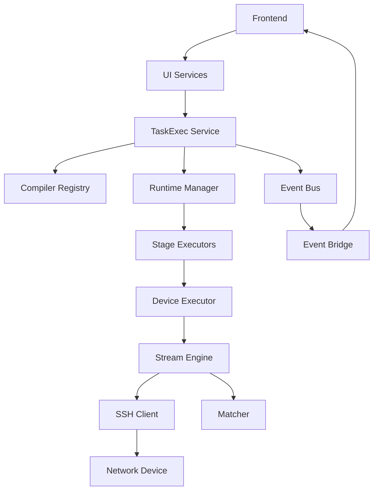
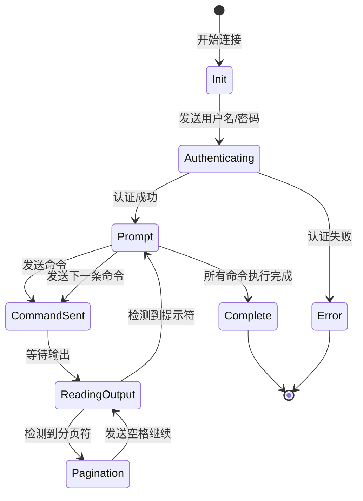
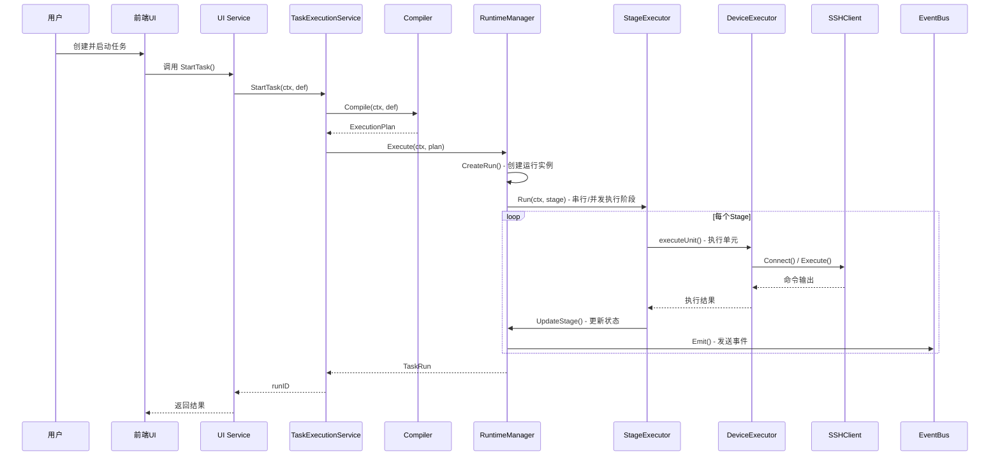

# NetWeaverGo 项目架构说明书

## 1. 项目概述

**NetWeaverGo** 是一款基于 Go 语言开发的并发网络自动化编排与配置集散工具。专为网络工程师设计，支持批量管理网络设备（交换机、路由器），提供大规模并发命令执行、配置备份、配置生成以及智能异常干预功能。

### 1.1 核心特性

| 特性           | 描述                                                     |
| -------------- | -------------------------------------------------------- |
| **GUI 模式**   | 基于 Wails v3 的现代化桌面应用，支持 Windows/macOS/Linux |
| **智能自动化** | 全自动终端交互、智能翻页检测、提示符识别                 |
| **高并发控制** | Worker Pool 模型 + 令牌桶限流，可配置并发数（默认10）    |
| **异常干预**   | 单设备级挂起、用户决策（Continue/Abort）                 |
| **配置备份**   | 自动解析 startup 配置、SFTP 安全下载                     |
| **配置生成**   | ConfigForge 配置模板引擎，支持变量展开与语法糖           |
| **任务管理**   | 支持命令组与设备组的灵活绑定，两种任务模式               |
| **执行历史**   | 完整的执行记录与日志追溯                                 |
| **拓扑发现**   | 基于 LLDP/接口信息的网络拓扑自动构建                     |

### 1.2 技术栈

| 层级         | 技术                                     |
| ------------ | ---------------------------------------- |
| **后端**     | Go 1.25+ / Wails v3                      |
| **前端**     | Vue 3 + TypeScript + Vite + Tailwind CSS |
| **状态管理** | Pinia                                    |
| **数据库**   | SQLite (GORM)                            |
| **通信协议** | SSH/SFTP (golang.org/x/crypto/ssh)       |
| **构建工具** | Wails v3 (桌面应用打包)                  |

---

## 2. 系统架构

### 2.1 整体架构图

```
┌─────────────────────────────────────────────────────────────────────────────┐
│                          NetWeaverGo 应用                                    │
├─────────────────────────────────────────────────────────────────────────────┤
│  ┌───────────────────────────────────────────────────────────────────────┐  │
│  │                      前端层 (Frontend - Vue 3)                         │  │
│  │  ┌──────────┐ ┌──────────┐ ┌──────────┐ ┌──────────┐ ┌──────────┐     │  │
│  │  │ Dashboard│ │ Devices  │ │ Commands │ │  Tasks   │ │Execution │     │  │
│  │  │   .vue   │ │   .vue   │ │   .vue   │ │   .vue   │ │   .vue   │     │  │
│  │  └──────────┘ └──────────┘ └──────────┘ └──────────┘ └──────────┘     │  │
│  │  ┌──────────┐ ┌──────────┐ ┌──────────┐ ┌──────────┐ ┌──────────┐     │  │
│  │  │ Settings │ │ NetCalc  │ │Protocol  │ │ConfigForge│ │ Topology│     │  │
│  │  │   .vue   │ │   .vue   │ │  Ref.vue │ │   .vue   │ │  .vue   │     │  │
│  │  └──────────┘ └──────────┘ └──────────┘ └──────────┘ └──────────┘     │  │
│  │                     ↓ Wails Events (Events/Call) ↓                   │  │
│  └───────────────────────────────────────────────────────────────────────┘  │
│                                    ↕                                         │
│  ┌───────────────────────────────────────────────────────────────────────┐  │
│  │                    服务层 (UI Services - Wails)                        │  │
│  │  ┌────────────────────────────────────────────────────────────────┐   │  │
│  │  │ DeviceService │ TaskGroupService │ ForgeService │ ...          │   │  │
│  │  │ (设备管理)     │ (任务组管理)      │ (配置生成)    │              │   │  │
│  │  └────────────────────────────────────────────────────────────────┘   │  │
│  │                              ↓                                        │  │
│  │           TaskExecutionUIService (统一任务执行UI服务)                  │  │
│  └───────────────────────────────────────────────────────────────────────┘  │
│                                    ↕                                         │
│  ┌───────────────────────────────────────────────────────────────────────┐  │
│  │                统一任务执行层 (TaskExec - 核心引擎)                      │  │
│  │  ┌──────────────┐  ┌──────────────┐  ┌─────────────────────────┐      │  │
│  │  │   Compiler   │  │   Runtime    │  │      EventBus           │      │  │
│  │  │ (任务编译器)  │  │ (运行管理器)  │  │   (事件总线)             │      │  │
│  │  └──────────────┘  └──────────────┘  └─────────────────────────┘      │  │
│  │  ┌──────────────┐  ┌──────────────┐  ┌─────────────────────────┐      │  │
│  │  │ StageExecutor│  │   Snapshot   │  │   Repository            │      │  │
│  │  │ (阶段执行器)  │  │   (快照中心)  │  │   (数据持久化)           │      │  │
│  └───────────────────────────────────────────────────────────────────────┘  │
│                                    ↕                                         │
│  ┌───────────────────────────────────────────────────────────────────────┐  │
│  │                    设备执行层 (Device Executor)                        │  │
│  │  ┌──────────────┐  ┌──────────────┐  ┌─────────────────────────┐      │  │
│  │  │ DeviceExecutor│  │ StreamEngine │  │   SessionAdapter        │      │  │
│  │  │ (设备执行器)  │  │ (流处理引擎)  │  │   (会话适配器)           │      │  │
│  │  └──────────────┘  └──────────────┘  └─────────────────────────┘      │  │
│  └───────────────────────────────────────────────────────────────────────┘  │
│                                    ↕                                         │
│  ┌───────────────────────────────────────────────────────────────────────┐  │
│  │                    通信层 (Communication)                              │  │
│  │  ┌──────────────┐  ┌──────────────┐  ┌─────────────────────────┐      │  │
│  │  │  SSHClient   │  │  SFTPClient  │  │   StreamMatcher         │      │  │
│  │  │ (SSH连接)    │  │ (文件传输)   │  │   (智能匹配器)           │      │  │
│  │  └──────────────┘  └──────────────┘  └─────────────────────────┘      │  │
│  │  ┌──────────────┐  ┌──────────────┐                                    │  │
│  │  │   Replayer   │  │  ANSIParser  │                                    │  │
│  │  │ (终端重放)   │  │ (ANSI解析)   │                                    │  │
│  │  └──────────────┘  └──────────────┘                                    │  │
│  └───────────────────────────────────────────────────────────────────────┘  │
│                                    ↕                                         │
│  ┌───────────────────────────────────────────────────────────────────────┐  │
│  │                    基础设施层 (Infrastructure)                          │  │
│  │  ┌──────────────┐  ┌──────────────┐  ┌─────────────────────────┐      │  │
│  │  │    Config    │  │    Logger    │  │      Report             │      │  │
│  │  │ (SQLite/ORM) │  │ (日志系统)   │  │   (报告收集)             │      │  │
│  │  └──────────────┘  └──────────────┘  └─────────────────────────┘      │  │
│  │  ┌──────────────┐  ┌──────────────┐  ┌─────────────────────────┐      │  │
│  │  │   Parser     │  │   TextFSM    │  │   Normalize             │      │  │
│  │  │ (解析服务)   │  │ (模板引擎)   │  │   (数据规范化)           │      │  │
│  │  └──────────────┘  └──────────────┘  └─────────────────────────┘      │  │
│  └───────────────────────────────────────────────────────────────────────┘  │
└─────────────────────────────────────────────────────────────────────────────┘
```

### 2.2 数据流向

```
用户操作 → Vue组件 → Wails Services → TaskExecutionService → Compiler
                                                                  ↓
RuntimeManager → StageExecutor → DeviceExecutor → StreamEngine → SSHClient → 网络设备
       ↓
  EventBus
       ↓
SnapshotHub → TaskExecutionEventBridge → Wails Events → 前端实时更新
```

### 2.3 模块依赖关系



---

## 3. 核心模块详解

### 3.1 入口模块 (`cmd/netweaver/main.go`)

**职责**: 应用程序入口，负责初始化所有子系统并启动GUI

**初始化流程**:

```
main()
├── config.GetPathManager()           // 获取路径管理器
├── pm.EnsureDirectories()            // 确保存储目录存在
├── logger.InitGlobalLogger()         // 初始化日志系统
├── config.InitDB()                   // 初始化SQLite数据库
├── taskexec.AutoMigrate()            // 运行时数据表迁移
├── config.InitRuntimeManager()       // 初始化运行时配置
└── runGUI()                          // 启动Wails GUI
    ├── NewTaskExecutionService()     // 创建统一任务执行服务
    ├── 创建各服务实例 (9个Service)
    ├── 配置 Wails Application
    ├── 挂载前端资源 (嵌入FS)
    └── 启动窗口
```

**注册的服务**:
| 服务 | 功能 | 文件路径 |
|------|------|----------|
| `DeviceService` | 设备资产管理 | `internal/ui/device_service.go` |
| `CommandGroupService` | 命令组管理 | `internal/ui/command_group_service.go` |
| `SettingsService` | 全局设置管理 | `internal/ui/settings_service.go` |
| `TaskGroupService` | 任务组管理 | `internal/ui/task_group_service_v2.go` |
| `QueryService` | 查询服务 | `internal/ui/query_service.go` |
| `ForgeService` | 配置模板构建 | `internal/ui/forge_service.go` |
| `ExecutionHistoryService` | 执行历史记录 | `internal/ui/execution_history_service.go` |
| `PlanCompareService` | 规划比对服务 | `internal/ui/plan_compare_service.go` |
| `TaskExecutionUIService` | 统一任务执行UI服务 | `internal/ui/taskexec_ui_service.go` |

---

### 3.2 统一任务执行模块 (`internal/taskexec/`)

#### 3.2.1 核心组件

| 组件                   | 文件             | 职责                                               |
| ---------------------- | ---------------- | -------------------------------------------------- |
| `TaskExecutionService` | `service.go`     | 统一任务执行服务入口，整合编译器、运行时、快照中心 |
| `CompilerRegistry`     | `compiler.go`    | 任务编译器注册表，支持多种任务类型                 |
| `RuntimeManager`       | `runtime.go`     | 运行时管理器，管理任务生命周期和执行               |
| `EventBus`             | `eventbus.go`    | 事件总线，支持订阅/发布模式                        |
| `SnapshotHub`          | `snapshot.go`    | 快照中心，聚合运行状态供前端展示                   |
| `Repository`           | `persistence.go` | 数据持久化层，使用 GORM 操作 SQLite                |

#### 3.2.2 执行流程

```
┌─────────────────┐     ┌─────────────────┐     ┌─────────────────┐
│  TaskDefinition │────▶│     Compiler    │────▶│ ExecutionPlan   │
│  (任务定义)      │     │   (编译器)       │     │  (执行计划)      │
└─────────────────┘     └─────────────────┘     └─────────────────┘
                                                        │
                                                        ▼
┌─────────────────┐     ┌─────────────────┐     ┌─────────────────┐
│   TaskEvent     │◀────│    Runtime      │◀────│   StageExecutor │
│   (事件流)       │     │   (运行时)       │     │  (阶段执行器)    │
└─────────────────┘     └─────────────────┘     └─────────────────┘
        │
        ▼
┌─────────────────┐     ┌─────────────────┐
│  SnapshotHub    │────▶│   Frontend      │
│  (快照中心)      │     │   (前端展示)     │
└─────────────────┘     └─────────────────┘
```

#### 3.2.3 任务类型支持

| 任务类型   | 编译器                 | 执行阶段                         | 用途         |
| ---------- | ---------------------- | -------------------------------- | ------------ |
| `normal`   | `NormalTaskCompiler`   | device_command                   | 普通命令执行 |
| `topology` | `TopologyTaskCompiler` | collect → parse → topology_build | 拓扑发现     |

#### 3.2.4 Stage 执行器类型

| 执行器                  | 类型标识         | 职责                        |
| ----------------------- | ---------------- | --------------------------- |
| `DeviceCommandExecutor` | `device_command` | 在设备上执行命令序列        |
| `DeviceCollectExecutor` | `device_collect` | 采集设备信息（LLDP/接口等） |
| `ParseExecutor`         | `parse`          | 解析原始输出为结构化数据    |
| `TopologyBuildExecutor` | `topology_build` | 构建网络拓扑图              |

---

### 3.3 设备执行模块 (`internal/executor/`)

#### 3.3.1 核心组件

| 组件              | 文件                  | 职责                            |
| ----------------- | --------------------- | ------------------------------- |
| `DeviceExecutor`  | `executor.go`         | 单设备SSH会话生命周期管理       |
| `StreamEngine`    | `stream_engine.go`    | 统一流处理引擎，处理SSH输入输出 |
| `SessionAdapter`  | `session_adapter.go`  | 会话适配器，管理会话状态        |
| `SessionDetector` | `session_detector.go` | 会话状态检测器                  |
| `SessionReducer`  | `session_reducer.go`  | 状态归约器，驱动状态流转        |
| `ExecutionPlan`   | `execution_plan.go`   | 执行计划定义                    |

#### 3.3.2 会话状态机



---

### 3.4 通信模块 (`internal/sshutil/`)

#### 3.4.1 SSHClient

**文件**: `internal/sshutil/client.go`

**核心功能**:

- SSH 连接建立与认证
- PTY 终端配置
- 双向数据流管理 (Stdin/Stdout/Stderr)
- 主机密钥验证策略 (strict/accept_new/insecure)

**SSH 算法配置**:

- Ciphers (加密算法)
- KeyExchanges (密钥交换)
- MACs (消息认证码)
- HostKeyAlgorithms (主机密钥算法)

#### 3.4.2 流匹配器 (`internal/matcher/`)

**文件**: `internal/matcher/matcher.go`

**功能**:

- 提示符检测 (`>`、`#`、`)`)
- 分页符检测 (`--More--`、`---- More ----`)
- 错误规则匹配 (Invalid command、Unknown command 等)
- ANSI 转义序列处理

---

### 3.5 解析模块 (`internal/parser/`)

#### 3.5.1 TextFSM 解析器

**文件**: `internal/parser/textfsm.go`

**支持的厂商模板**:

| 厂商   | 支持的命令                                                                                                            |
| ------ | --------------------------------------------------------------------------------------------------------------------- |
| Huawei | version、sysname、esn、device_info、interface_brief、interface_detail、lldp_neighbor、mac_address、eth_trunk、arp_all |
| H3C    | version、interface_brief、lldp_neighbor、mac_address、eth_trunk、arp_all                                              |
| Cisco  | version、interface_brief、interface_detail、lldp_neighbor、mac_address、eth_trunk、arp_all                            |

#### 3.5.2 模板位置

```
internal/parser/templates/
├── huawei/
│   ├── version.textfsm
│   ├── lldp_neighbor.textfsm
│   └── ...
├── h3c/
│   └── ...
└── cisco/
    └── ...
```

---

### 3.6 终端处理模块 (`internal/terminal/`)

#### 3.6.1 组件

| 组件         | 文件             | 职责                                    |
| ------------ | ---------------- | --------------------------------------- |
| `Replayer`   | `replayer.go`    | 终端重放器，将SSH字节流转换为规范化文本 |
| `ANSIParser` | `ansi.go`        | ANSI 转义序列解析器                     |
| `LineBuffer` | `line_buffer.go` | 行缓冲区管理                            |

#### 3.6.2 处理流程

```
SSH 字节流
    ↓
ANSIParser 解析为 Token 流
    ↓
Replayer 处理控制字符
    ↓
产生 LineEvent (行提交/行更新)
    ↓
提取逻辑行用于匹配和展示
```

---

### 3.7 配置生成模块 (`internal/forge/`)

#### 3.7.1 ConfigBuilder

**文件**: `internal/forge/config_builder.go`

**功能**:

- 模板变量替换
- 语法糖展开 (1-10 → 1,2,3,...,10)
- 等差数列推断补全

#### 3.7.2 语法糖支持

| 语法     | 示例          | 展开结果           |
| -------- | ------------- | ------------------ |
| 范围展开 | `1-5`         | `1,2,3,4,5`        |
| 逗号分隔 | `1,3,5`       | `1,3,5`            |
| 混合使用 | `1-3,7,10-12` | `1,2,3,7,10,11,12` |

---

### 3.8 数据层 (`internal/config/`, `internal/models/`)

#### 3.8.1 数据库模型

| 模型             | 表名               | 说明                |
| ---------------- | ------------------ | ------------------- |
| `DeviceAsset`    | `device_assets`    | 设备资产信息        |
| `CommandGroup`   | `command_groups`   | 命令组              |
| `TaskGroup`      | `task_groups`      | 任务组              |
| `GlobalSettings` | `global_settings`  | 全局设置            |
| `RuntimeSetting` | `runtime_settings` | 运行时配置          |
| `TaskDefinition` | `task_definitions` | 任务定义 (taskexec) |
| `TaskRun`        | `task_runs`        | 任务运行实例        |
| `TaskRunStage`   | `task_run_stages`  | 阶段运行状态        |
| `TaskRunUnit`    | `task_run_units`   | 调度单元状态        |
| `TaskRunEvent`   | `task_run_events`  | 事件流水            |
| `TaskArtifact`   | `task_artifacts`   | 产物索引            |

#### 3.8.2 SQLite 配置

```go
DSN: "db.sqlite?_journal=WAL&_busy_timeout=5000&_cache_size=10000&_foreign_keys=1&_synchronous=NORMAL"
```

---

### 3.9 前端架构 (`frontend/`)

#### 3.9.1 目录结构

```
frontend/src/
├── components/           # 组件
│   ├── common/          # 通用组件
│   ├── topology/        # 拓扑图组件
│   └── ...
├── views/               # 页面视图
│   ├── Dashboard.vue
│   ├── Devices.vue
│   ├── Tasks.vue
│   ├── TaskExecution.vue
│   ├── Topology.vue
│   └── ...
├── composables/         # 组合式函数
│   ├── useTaskExecution.ts
│   ├── useDeviceForm.ts
│   └── ...
├── stores/              # Pinia 状态管理
│   └── taskexecStore.ts
├── utils/               # 工具函数
└── types/               # TypeScript 类型定义
```

#### 3.9.2 前端事件处理

**文件**: `frontend/src/composables/useTaskExecution.ts`

监听的事件:

- `execution:snapshot` - 执行快照更新
- `engine:finished` - 执行完成
- `task:event` - 任务事件流
- `task:started` / `task:finished` - 任务开始/结束
- `task:stage_updated` - 阶段更新
- `task:unit_updated` - 单元更新

---

## 4. 关键流程详解

### 4.1 任务执行完整流程



### 4.2 拓扑发现流程

```
1. 用户创建拓扑任务
   ├── 选择设备/设备组
   └── 设置厂商类型 (huawei/h3c/cisco)

2. 任务编译 (TopologyTaskCompiler)
   ├── Stage 1: 设备信息采集 (device_collect)
   │   ├── 执行 LLDP 邻居采集命令
   │   ├── 执行接口信息采集命令
   │   └── 保存原始输出
   ├── Stage 2: 信息解析 (parse)
   │   ├── 使用 TextFSM 模板解析 LLDP 输出
   │   ├── 解析接口信息
   │   └── 生成结构化数据
   └── Stage 3: 拓扑构建 (topology_build)
       ├── 合并所有设备的解析结果
       ├── 分析连接关系
       └── 生成拓扑图数据

3. 前端展示拓扑图
   └── 使用 D3.js / ECharts 渲染
```

### 4.3 SSH 连接与命令执行流程

```
DeviceExecutor.Connect()
    │
    ├── 获取设备画像配置
    ├── 创建 SSH 配置 (含算法设置)
    ├── sshutil.NewSSHClient()
    │       ├── 建立 TCP 连接
    │       ├── SSH 握手
    │       ├── 认证 (密码/密钥)
    │       └── 创建 Session
    └── 连接成功

DeviceExecutor.ExecutePlaybook()
    │
    ├── 创建 StreamEngine
    ├── engine.Run(ModePlaybook)
    │       ├── 初始化 SessionAdapter
    │       ├── 循环读取输出流
    │       ├── 检测分页符 → 发送空格
    │       ├── 检测提示符 → 发送下一条命令
    │       └── 收集命令结果
    └── 返回执行报告
```

---

## 5. 并发控制

### 5.1 多级并发控制

```
┌─────────────────────────────────────────────────────────┐
│                    任务级别并发                          │
│              (RuntimeManager 管理)                       │
│                    默认: 不限制                          │
└─────────────────────────────────────────────────────────┘
                           ↓
┌─────────────────────────────────────────────────────────┐
│                    Stage 级别并发                        │
│              (StagePlan.Concurrency)                     │
│              默认: 10 (拓扑采集) / 不限 (解析)            │
└─────────────────────────────────────────────────────────┘
                           ↓
┌─────────────────────────────────────────────────────────┐
│                    Unit 级别并发                         │
│              (Go Goroutine + Semaphore)                  │
│              受 Stage.Concurrency 限制                   │
└─────────────────────────────────────────────────────────┘
```

### 5.2 连接抖动控制

```go
// 设备间连接添加随机抖动，避免并发冲击
jitter := time.Duration(rand.Intn(500)) * time.Millisecond
time.Sleep(jitter)
```

---

## 6. 错误处理机制

### 6.1 错误分类

| 类别                  | 说明         | 处理策略          |
| --------------------- | ------------ | ----------------- |
| `ConnectionError`     | 连接错误     | 重试/跳过         |
| `AuthenticationError` | 认证失败     | 记录/跳过         |
| `CommandError`        | 命令错误     | 根据设置继续/中止 |
| `TimeoutError`        | 超时错误     | 挂起等待用户决策  |
| `PaginationError`     | 分页处理错误 | 自动处理          |

### 6.2 SuspendHandler 机制

```go
// 当执行遇到错误时，挂起并等待用户决策
type SuspendHandler func(ctx context.Context, ip string, deviceLog string, failedCmd string) ErrorAction

const (
    ActionContinue     // 忽略错误，继续执行
    ActionAbort        // 中止该设备的后续命令
    ActionAbortTimeout // 超时后自动中止
)
```

---

## 7. 配置管理

### 7.1 设备画像 (`internal/config/device_profile.go`)

支持按厂商自定义:

- 提示符后缀
- 提示符正则模式
- 分页符模式
- PTY 终端配置

### 7.2 SSH 算法预设

| 预设         | 说明           |
| ------------ | -------------- |
| `secure`     | 仅使用安全算法 |
| `compatible` | 兼容旧设备     |
| `custom`     | 自定义算法列表 |

---

## 8. 开发规范

### 8.1 目录结构规范

```
internal/
├── taskexec/          # 统一任务执行 (核心业务)
├── executor/          # 设备执行器
├── sshutil/           # SSH/SFTP 工具
├── matcher/           # 流匹配器
├── terminal/          # 终端处理
├── parser/            # 解析服务
├── forge/             # 配置生成
├── config/            # 配置管理
├── models/            # 数据模型
├── repository/        # 数据访问层
├── ui/                # UI 服务层
├── report/            # 报告收集
├── logger/            # 日志系统
└── utils/             # 通用工具
```

### 8.2 命名规范

- **包名**: 全小写，简短有意义
- **接口名**: 动词+名词，如 `StageExecutor`
- **结构体**: 名词，首字母大写
- **方法名**: 动词开头，如 `ExecutePlan`

---

## 9. 构建与部署

### 9.1 构建命令

```bash
# Windows
cd d:/Document/Code/NetWeaverGo
build.bat

# 或使用 wails
cd frontend && npm install && npm run build
cd .. && wails build
```

### 9.2 输出目录

```
build/
└── bin/
    └── NetWeaverGo.exe    # Windows 可执行文件
```

---

## 10. 版本历史

| 版本 | 日期    | 主要变更                             |
| ---- | ------- | ------------------------------------ |
| v1.0 | 2026-03 | 初始版本，支持基础命令执行、拓扑发现 |

---

## 附录

### A. 数据库 ER 图

```
┌─────────────────┐       ┌─────────────────┐       ┌─────────────────┐
│  DeviceAsset    │       │   TaskGroup     │       │  CommandGroup   │
├─────────────────┤       ├─────────────────┤       ├─────────────────┤
│ ID (PK)         │       │ ID (PK)         │       │ ID (PK)         │
│ IP (Unique)     │       │ Name (Unique)   │       │ Name (Unique)   │
│ Username        │       │ DeviceGroup     │       │ Commands (JSON) │
│ Password        │       │ CommandGroup    │       │ Tags (JSON)     │
│ Vendor          │       │ TaskType        │       └─────────────────┘
│ Group           │       │ Mode            │
└─────────────────┘       │ Items (JSON)    │
                          └─────────────────┘

┌─────────────────┐       ┌─────────────────┐       ┌─────────────────┐
│  TaskDefinition │◀─────▶│    TaskRun      │◀─────▶│ TaskRunStage    │
├─────────────────┤       ├─────────────────┤       ├─────────────────┤
│ ID (PK)         │       │ ID (PK)         │       │ ID (PK)         │
│ Name            │       │ TaskDefID (FK)  │       │ TaskRunID (FK)  │
│ Kind            │       │ RunKind         │       │ StageKind       │
│ Config (JSON)   │       │ Status          │       │ Status          │
└─────────────────┘       │ Progress        │       │ Progress        │
                          └─────────────────┘       └─────────────────┘
                                                          │
                                                          ▼
                                                  ┌─────────────────┐
                                                  │  TaskRunUnit    │
                                                  ├─────────────────┤
                                                  │ ID (PK)         │
                                                  │ TaskRunID (FK)  │
                                                  │ StageID (FK)    │
                                                  │ TargetKey       │
                                                  │ Status          │
                                                  └─────────────────┘
```

### B. 事件类型定义

| 事件类型         | 说明         |
| ---------------- | ------------ |
| `run_started`    | 运行开始     |
| `run_finished`   | 运行结束     |
| `stage_started`  | 阶段开始     |
| `stage_finished` | 阶段结束     |
| `stage_progress` | 阶段进度更新 |
| `unit_started`   | 单元开始     |
| `unit_finished`  | 单元结束     |
| `step_finished`  | 步骤完成     |
| `error`          | 错误事件     |

### C. 状态枚举

**Run Status**: `pending` → `running` → `completed`/`partial`/`failed`/`cancelled`

**Stage/Unit Status**: `pending` → `running` → `completed`/`partial`/`failed`/`cancelled`
