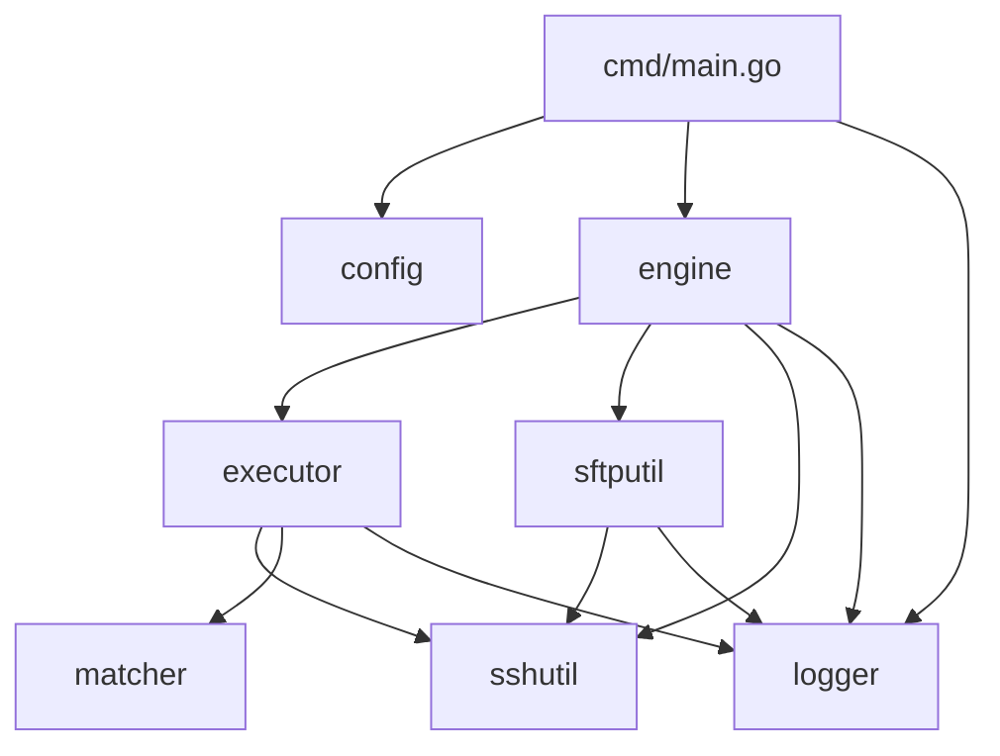
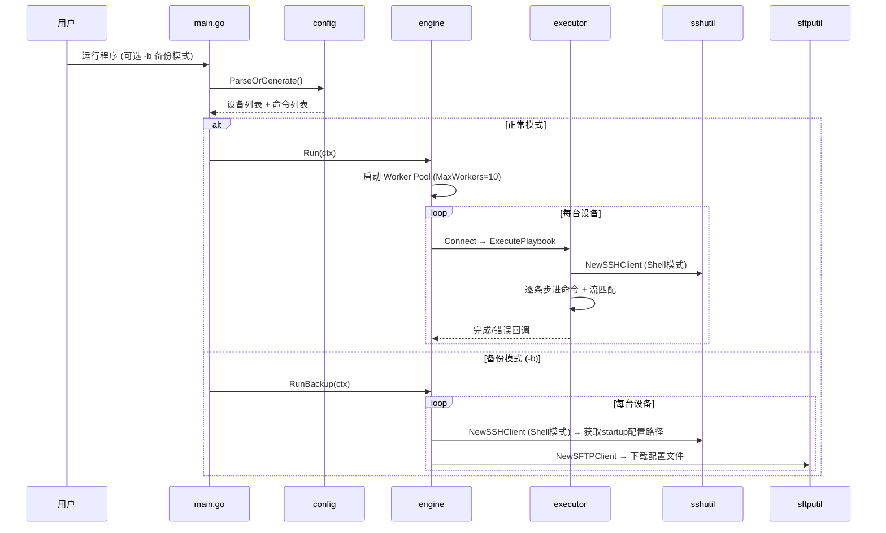
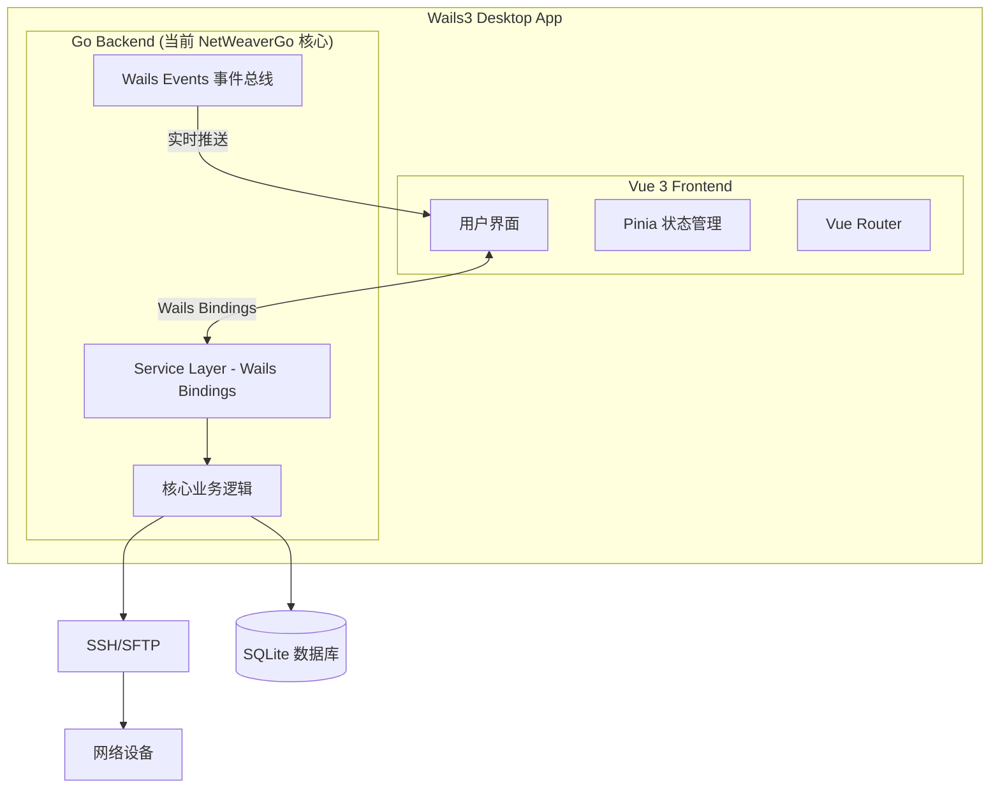

# NetWeaverGo 项目架构分析与演进规划

## 一、项目定位

**NetWeaverGo** — Go 并发网络自动化编排/配置集散部署工具，面向网络工程师，提供批量 SSH 连接、命令下发、配置备份等便捷操作能力。

---

## 二、当前架构总览

### 2.1 目录结构

```
NetWeaverGo/
├── cmd/netweaver/main.go          # 程序入口，CLI 解析
├── internal/
│   ├── config/config.go           # 配置解析（CSV资产 + TXT命令）
│   ├── engine/engine.go           # 中央调度器（Worker Pool 并发控制）
│   ├── executor/executor.go       # 设备命令执行器（SSH 流步进下发）
│   ├── matcher/matcher.go         # 流匹配器（提示符 / 错误检测）
│   ├── sshutil/client.go          # SSH 连接封装（Shell + Raw 两种模式）
│   ├── sftputil/client.go         # SFTP 文件传输客户端
│   └── logger/logger.go           # 日志系统（全局日志 + 设备回显落盘）
├── logs/                          # 运行日志输出
├── dist/                          # 编译产物
├── go.mod
└── go.sum
```

### 2.2 模块依赖关系



### 2.3 核心模块职责

| 模块       | 职责                                                       | 代码量 |
| ---------- | ---------------------------------------------------------- | ------ |
| `config`   | 读取 `inventory.csv` 和 `config.txt`，不存在时自动生成模板 | 166 行 |
| `engine`   | Worker Pool 并发调度，管理所有设备的 goroutine 生命周期    | 269 行 |
| `executor` | 封装单设备 SSH 流，步进下发命令队列，支持错误暂停回调      | 355 行 |
| `matcher`  | 正则匹配设备返回的错误关键字、检测命令提示符结束           | 54 行  |
| `sshutil`  | SSH 连接建立，支持 Shell 交互模式和 Raw 纯连接模式         | 265 行 |
| `sftputil` | 基于 Raw SSH 的 SFTP 文件下载                              | 80 行  |
| `logger`   | 全局日志（终端 + 文件双写）+ 设备级回显落盘                | 130 行 |

### 2.4 执行流程



### 2.5 架构优点

- ✅ **关注点分离清晰**：SSH 连接、命令执行、流匹配、日志各自独立
- ✅ **并发模型成熟**：Worker Pool + Context 取消 + 信号捕获优雅退出
- ✅ **错误交互设计巧妙**：`SuspendHandler` 回调允许运行时人工介入决策
- ✅ **兼容性强**：支持多种 SSH 加密套件，适配各厂商网络设备
- ✅ **双连接模式**：Shell 连接和 Raw 连接分离，解决华为等设备 SFTP 通道冲突

### 2.6 当前不足

- ⚠️ **配置耦合文件系统**：只支持当前目录的 CSV/TXT，无法适配更复杂场景
- ⚠️ **缺少接口抽象**：各模块直接依赖具体实现，不利于测试和扩展
- ⚠️ **Error Matcher 未启用**：[NewStreamMatcher()](file:///d:/Document/Code/NetWeaverGo/internal/matcher/matcher.go#19-29) 中错误模式为空（TODO 标注）
- ⚠️ **无单元测试**：整个项目没有测试代码
- ⚠️ **仅 CLI 交互**：不支持 API 调用，无法作为服务端运行

---

## 三、后续功能演进方向

### 3.1 近期改进（v1.x）

#### 🔧 配置系统增强

- 支持 YAML/JSON 配置文件格式替代 CSV + TXT
- 支持设备分组（按机房/区域/厂商）和变量模板
- 支持命令模板中的变量替换 (如 `{{hostname}}`, `{{interface}}`)

#### 🔧 Error Matcher 完善

- 内置各厂商（华为/华三/锐捷/Cisco）常见错误模式正则库
- 支持用户自定义错误关键字和动作规则
- 错误分级：Warning vs Critical

#### 🔧 执行增强

- 命令执行超时控制（单条命令级别）
- 执行进度可视化（进度条/百分比）
- 支持条件命令：根据上一条命令返回结果决定是否执行下一条
- 干运行模式（Dry Run）：预览命令但不实际下发

#### 🔧 报告与输出

- 执行结果汇总报告（成功/失败/跳过统计）
- 输出结果结构化解析（如将 `display interface brief` 解析为表格数据）
- 支持导出 Excel/CSV 报告

### 3.2 中期功能（v2.x）

#### 🚀 设备管理能力

- **Telnet 协议支持**：兼容不支持 SSH 的老旧设备
- **SNMP 支持**：基础设备信息采集 (sysName, sysDescr, 接口状态)
- **设备自动发现**：基于 LLDP/CDP/ARP 自动发现网络拓扑
- **凭据管理**：加密存储设备凭据，支持凭据轮转

#### 🚀 任务编排

- **Playbook 文件**：类 Ansible 的声明式任务编排（YAML格式）
- **任务调度**：定时巡检、周期性配置备份
- **配置比对**：历史配置 diff 对比，变更追踪
- **回滚机制**：配置变更前自动快照，支持一键回滚

#### 🚀 可观测性

- 设备连接状态实时监控
- 命令执行耗时统计
- 结构化日志（JSON 格式 + 日志级别过滤）

### 3.3 远期愿景（v3.x）

- **插件系统**：允许社区/用户编写自定义命令解析器、设备驱动
- **多租户**：支持多用户、权限管理、操作审计
- **网络拓扑可视化**：自动绘制网络拓扑图
- **AI 辅助**：接入 LLM 分析设备日志、智能排障建议

---

## 四、Wails3 + Vue 前后端分离架构规划

### 4.1 整体架构



### 4.2 后端重构方向

当前 `internal/` 需要重构为「**可被 Wails Binding 调用的 Service 层**」：

```
NetWeaverGo/
├── main.go                          # Wails3 应用入口
├── app.go                           # Wails App 生命周期管理
│
├── internal/                        # 核心业务逻辑（保持不变）
│   ├── config/
│   ├── engine/
│   ├── executor/
│   ├── matcher/
│   ├── sshutil/
│   ├── sftputil/
│   └── logger/
│
├── service/                         # [新增] Service 层 - Wails Bindings
│   ├── device_service.go            # 设备管理服务（CRUD + 连接测试）
│   ├── task_service.go              # 任务管理服务（创建/执行/监控）
│   ├── config_service.go            # 配置管理服务（备份/比对/回滚）
│   ├── log_service.go               # 日志查询服务
│   └── system_service.go            # 系统设置服务
│
├── model/                           # [新增] 数据模型
│   ├── device.go                    # 设备实体
│   ├── task.go                      # 任务实体
│   ├── credential.go                # 凭据实体
│   └── result.go                    # 执行结果实体
│
├── store/                           # [新增] 数据持久化（SQLite）
│   ├── db.go                        # 数据库连接管理
│   ├── device_store.go
│   ├── task_store.go
│   └── migration/                   # 数据库迁移脚本
│
├── frontend/                        # Vue 3 前端
│   ├── src/
│   │   ├── views/                   # 页面视图
│   │   │   ├── Dashboard.vue        # 仪表盘首页
│   │   │   ├── Devices.vue          # 设备管理
│   │   │   ├── Tasks.vue            # 任务中心
│   │   │   ├── Terminal.vue         # Web终端（实时回显）
│   │   │   ├── Backups.vue          # 配置备份管理
│   │   │   └── Settings.vue         # 系统设置
│   │   ├── components/              # 可复用组件
│   │   ├── stores/                  # Pinia 状态管理
│   │   ├── router/                  # 路由配置
│   │   └── composables/             # 组合式函数
│   ├── index.html
│   └── package.json
│
└── wails.json                       # Wails3 项目配置
```

### 4.3 Wails3 Binding 设计示例

Wails3 通过 struct 方法自动暴露给前端调用：

```go
// service/device_service.go
type DeviceService struct {
    store  *store.DeviceStore
    engine *engine.Engine
}

// 前端可直接调用: DeviceService.ListDevices()
func (s *DeviceService) ListDevices(group string) ([]model.Device, error) { ... }

// 前端可直接调用: DeviceService.TestConnection(id)
func (s *DeviceService) TestConnection(deviceID int64) (*model.ConnResult, error) { ... }

// 前端可直接调用: DeviceService.ImportFromCSV(path)
func (s *DeviceService) ImportFromCSV(csvPath string) (int, error) { ... }
```

```go
// service/task_service.go
type TaskService struct {
    store  *store.TaskStore
    engine *engine.Engine
    ctx    context.Context  // Wails App Context
}

// 异步执行 + 事件推送进度
func (s *TaskService) ExecuteTask(taskID int64) error {
    // 通过 Wails Events 实时推送执行进度到前端
    runtime.EventsEmit(s.ctx, "task:progress", progressData)
    return nil
}
```

### 4.4 前端核心页面规划

| 页面          | 功能                                              |
| ------------- | ------------------------------------------------- |
| **Dashboard** | 设备总数、在线状态、最近任务、快捷操作入口        |
| **设备管理**  | 设备 CRUD、批量导入、分组管理、连接测试、凭据管理 |
| **任务中心**  | 创建任务（选设备+编写命令）、执行历史、进度监控   |
| **Web 终端**  | 实时 SSH 终端回显、多设备 Tab 切换、命令输出流    |
| **配置备份**  | 备份列表、版本对比 Diff、手动/定时备份            |
| **系统设置**  | 全局参数、错误匹配规则、并发数配置、日志查看      |

### 4.5 关键技术决策

| 决策项     | 推荐方案                              | 理由                             |
| ---------- | ------------------------------------- | -------------------------------- |
| 桌面框架   | **Wails3**                            | 原生性能、Go 原生集成、包体积小  |
| 前端框架   | **Vue 3 + TypeScript**                | 生态成熟、与 Wails 官方深度集成  |
| UI 组件库  | **Naive UI** 或 **Element Plus**      | 组件丰富、暗色主题支持好         |
| 数据持久化 | **SQLite** (via `modernc.org/sqlite`) | 纯 Go 实现、免安装、桌面应用首选 |
| 状态管理   | **Pinia**                             | Vue 3 官方推荐                   |
| 实时通信   | **Wails Events**                      | 原生支持，用于任务进度推送       |
| 终端组件   | **xterm.js**                          | Web 终端事实标准                 |

### 4.6 迁移路径（渐进式）


| 阶段       | 内容        | 详情                                                            |
| ---------- | ----------- | --------------------------------------------------------------- |
| **阶段 1** | 接口抽象    | 为 `sshutil`、`executor`、`engine` 提取 interface，增加单元测试 |
| **阶段 2** | Service 层  | 在 `internal` 之上封装 `service/` 层，屏蔽底层实现细节          |
| **阶段 3** | 数据持久化  | 引入 SQLite，将设备清单、任务记录、配置备份等数据入库           |
| **阶段 4** | Wails3 集成 | 初始化 Wails3 项目，将 Service 注册为 Binding，CLI 入口保留兼容 |
| **阶段 5** | Vue 前端    | 逐页面开发 Dashboard → 设备管理 → 任务中心 → Web终端            |

> [!IMPORTANT]
> **CLI 兼容性**：建议保留 [cmd/netweaver/main.go](file:///d:/Document/Code/NetWeaverGo/cmd/netweaver/main.go) 作为 CLI 入口，与 Wails 桌面应用共享同一套 `service/` + `internal/` 代码，确保命令行和 GUI 两种使用方式并存。

---

## 五、总结

NetWeaverGo 当前已经具备了一个扎实的核心引擎，并发模型和设备交互逻辑设计良好。后续演进的**关键路径**是：

1. **先做接口抽象和测试覆盖**（稳固基础）
2. **再构建 Service 层**（解耦业务 vs 交互）
3. **最后叠加 Wails3 + Vue GUI**（赋予可视化能力）

这种渐进式架构允许在任何阶段独立交付价值，CLI 用户不受影响，GUI 只是锦上添花。
