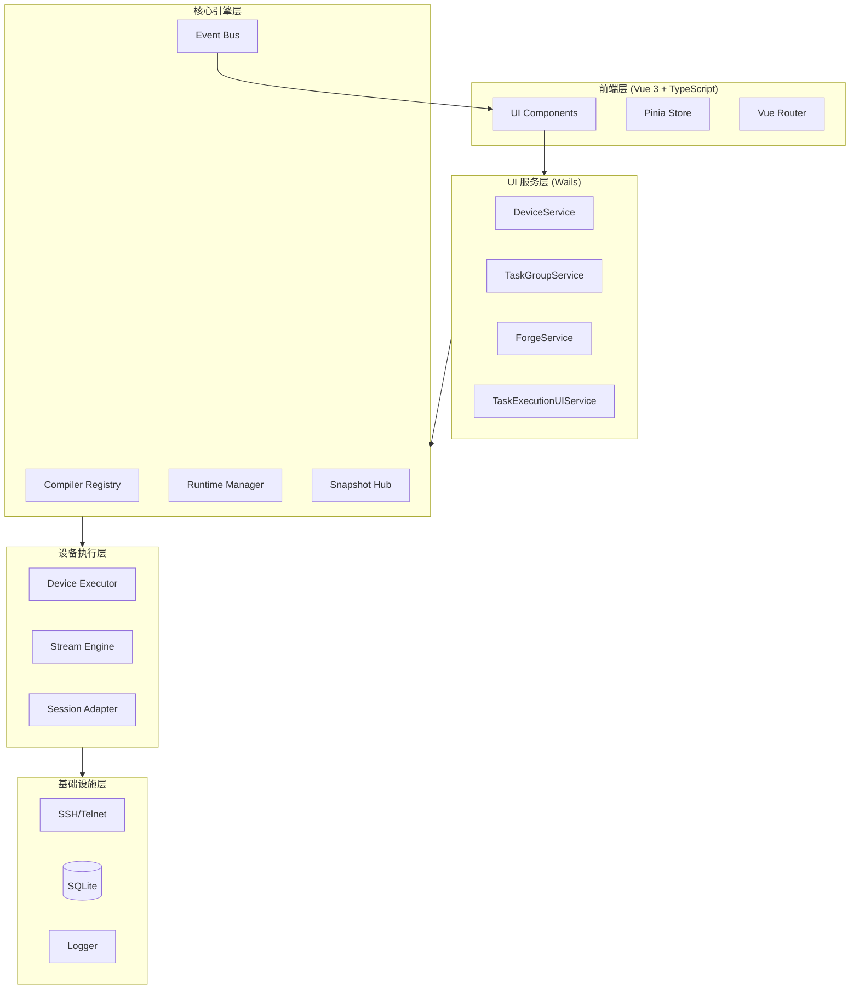

<div align="center">

# 🕸️ NetWeaverGo

**面向网络工程师的桌面级网络自动化编排与配置集散引擎**

基于 Go + Vue 3 + Wails v3 构建，支持批量管理网络设备（交换机/路由器），提供大规模并发命令执行、配置备份、配置生成、拓扑发现、SNMP 监控以及智能异常干预功能。

[](https://go.dev/)
[](https://vuejs.org/)
[](https://www.typescriptlang.org/)
[](https://wails.io/)
[](https://tailwindcss.com/)
[](https://www.sqlite.org/)
[](#许可证)

[核心特性](#核心特性) • [快速开始](#快速开始) • [架构概览](#架构概览) • [项目结构](#项目结构) • [文档](#文档) • [贡献指南](#贡献指南)

</div>

---

## 📖 项目简介

**NetWeaverGo** 是一款基于 Go + Vue 3 开发的桌面级网络自动化编排与配置集散引擎，专为网络工程师设计。采用 Wails v3 框架实现前后端一体化桌面应用，支持批量管理网络设备（交换机/路由器），提供大规模并发命令执行、配置备份、配置生成、拓扑发现、SNMP 监控以及智能异常干预功能。

### 🎯 目标用户

- **网络工程师** — 日常设备管理与配置
- **网络运维团队** — 批量设备维护与巡检
- **网络架构师** — 网络拓扑发现与规划

### 💡 核心价值

- **高效并发** — Worker Pool 模型 + 令牌桶限流，轻松管理数百台设备
- **智能交互** — 全自动终端交互、智能翻页检测、提示符识别
- **可视化拓扑** — 基于 LLDP/ARP/FDB 多源融合的网络拓扑自动构建与展示
- **SNMP 监控** — 完整的 MIB 管理、轮询引擎、Trap 监听功能
- **跨平台** — 基于 Wails v3 的现代化桌面应用

---

## ✨ 核心特性

<table>
<tr>
<td width="50%">

### 🖥️ 设备管理
- 设备资产 CRUD（支持批量导入/导出）
- 设备画像系统（厂商级 PTY 配置、提示符模式、分页模式、初始化命令）
- 支持 SSH 和 Telnet 双协议连接

</td>
<td width="50%">

### ⚡ 任务编排与执行（核心引擎）
- 五层架构：任务定义 → 计划编译 → 统一运行时 → 阶段执行器 → 数据持久化
- 三种编译器：Normal（常规命令执行）、Topology（拓扑发现）、Backup（配置备份）
- 并发设备执行、状态机管理（pending→running→completed/failed/cancelled）
- EventBus 事件系统 + SnapshotHub 实时快照

</td>
</tr>
<tr>
<td>

### 📝 命令组管理
- 命令模板的创建、编辑、组织
- 支持多行命令、分隔符配置

</td>
<td>

### 🗺️ 网络拓扑发现与可视化
- 多源融合：LLDP 邻居 → ARP 表 → FDB 表 → 接口信息
- 融合策略：确认边 → 半确认边 → 推断边 → 冲突边
- Cytoscape.js 可视化引擎

</td>
</tr>
<tr>
<td>

### 📋 配置生成器 (ConfigForge)
- 模板引擎：模板 + 变量 → 范围展开 → 等差数列推断 → 精确变量替换
- 批量配置块生成

</td>
<td>

### 📊 配置比对 (Plan Compare)
- 导入 CSV 规划文件 → 解析规划链路 → 与实际拓扑匹配
- 差异报告：missing_link / unexpected_link / interface_mismatch

</td>
</tr>
<tr>
<td>

### 📡 SNMP 功能栈
- MIB 管理：导入/删除/LRU 缓存/OID 树构建（嵌入 12 个核心 MIB 文件）
- 轮询引擎：v1/v2c/v3 GET/WALK，指数退避重试，Cron 调度
- Trap 监听：UDP v1/v2c/v3，过滤引擎（OID 前缀/CIDR/正则匹配）
- 凭据加密：AES-256-GCM

</td>
<td>

### 📁 文件服务器
- 统一管理 4 种协议：SFTP、FTP、TFTP、HTTP（Web 文件浏览）
- 实时日志事件推送

</td>
</tr>
<tr>
<td>

### 🔧 网络工具
- 批量 Ping 探测（可配置并发数、超时、数据包大小）
- 路由追踪 (Tracert) + GeoIP 地理解析
- IPv4/IPv6 网络地址计算器
- 协议参考手册

</td>
<td>

### 🛡️ 安全与异常处理
- SSH 主机密钥校验（strict/accept_new/insecure）
- SNMP 凭据 AES-256-GCM 加密
- 日志脱敏 + 多级日志系统
- 单设备级挂起机制与用户决策

</td>
</tr>
</table>

---

## 🛠️ 技术栈

### 后端

| 技术 | 版本 | 用途 |
|------|------|------|
| [Go](https://go.dev/) | 1.26 | 主要编程语言 |
| [Wails](https://wails.io/) | v3 (alpha.95) | 桌面应用框架（Go ↔ WebView 桥接） |
| [GORM](https://gorm.io/) | v1.31.1 | ORM 框架 |
| [SQLite (glebarez/sqlite)](https://www.sqlite.org/) | v1.11.0 | 嵌入式数据库（主库 + SNMP 独立库） |
| [golang.org/x/crypto](https://pkg.go.dev/golang.org/x/crypto) | v0.52.0 | SSH/SFTP 客户端实现 |
| [github.com/pkg/sftp](https://github.com/pkg/sftp) | v1.13.10 | SFTP 文件传输 |
| [github.com/gosnmp/gosnmp](https://github.com/gosnmp/gosnmp) | v1.43.2 | SNMP v1/v2c/v3 协议 |
| [github.com/golangsnmp/gomib](https://github.com/golangsnmp/gomib) | v0.11.0 | MIB 文件解析 |
| [github.com/hashicorp/golang-lru/v2](https://github.com/hashicorp/golang-lru) | v2.0.7 | LRU 缓存 |
| [github.com/robfig/cron/v3](https://github.com/robfig/cron) | v3.0.1 | Cron 调度器（SNMP 轮询） |
| [github.com/fclairamb/ftpserverlib](https://github.com/fclairamb/ftpserverlib) | v0.30.0 | FTP 服务器 |
| [github.com/pin/tftp/v3](https://github.com/pin/tftp) | v3.2.0 | TFTP 服务器 |
| [github.com/spf13/afero](https://github.com/spf13/afero) | v1.15.0 | 文件系统抽象 |
| [golang.org/x/sync](https://pkg.go.dev/golang.org/x/sync) | v0.20.0 | 并发控制 |
| [golang.org/x/time](https://pkg.go.dev/golang.org/x/time) | v0.15.0 | 令牌桶限流 |

### 前端

| 技术 | 版本 | 用途 |
|------|------|------|
| [Vue.js](https://vuejs.org/) | 3.5 | 前端框架（Composition API） |
| [TypeScript](https://www.typescriptlang.org/) | 5.9 | 类型安全 |
| [Vite](https://vitejs.dev/) | 7.3 | 构建工具 |
| [Tailwind CSS](https://tailwindcss.com/) | 4.2 | 原子化 CSS 框架 |
| [Pinia](https://pinia.vuejs.org/) | 3.0 | 状态管理 |
| [Vue Router](https://router.vuejs.org/) | 4.6 | 路由管理 |
| [Cytoscape.js](https://js.cytoscape.org/) | 3.33 | 拓扑图可视化引擎 |

---

## 📡 厂商支持

| 厂商 | 设备画像 | CLI 解析模板 | 支持的解析命令 |
|------|----------|-------------|---------------|
| **华为 (Huawei)** | ✅ | `huawei.json` | version, interface, lldp, mac, arp, eth-trunk, esn, device info |
| **华三 (H3C)** | ✅ | `h3c.json` | version, interface, lldp, mac, arp, eth-trunk |
| **思科 (Cisco)** | ✅ | `cisco.json` | version, interface, lldp, mac, arp, eth-trunk |

---

## 🚀 快速开始

### 环境要求

| 依赖 | 版本要求 | 说明 |
|------|----------|------|
| **Go** | >= 1.26 | 后端运行环境 |
| **Node.js** | >= 18 | 前端构建环境 |
| **npm** | >= 9 | 前端包管理 |
| **Wails CLI** | >= v3 | 桌面应用框架 |

### 安装步骤

1. **克隆仓库**

```bash
git clone https://github.com/your-username/NetWeaverGo.git
cd NetWeaverGo
```

2. **安装 Wails CLI**（如未安装）

```bash
go install github.com/wailsapp/wails/v3/cmd/wails@latest
```

3. **安装前端依赖**

```bash
cd frontend && npm install && cd ..
```

4. **构建与运行**

```bash
# 开发模式（热重载）
task dev

# 生产构建
task build

# 打包
task package

# 运行
task run
```

### 其他构建命令

```bash
# 开发模式调试（Delve）
task dev:debug

# 清理开发产物
task dev:clean

# 完整重置开发环境
task dev:reset

# Server 模式构建（无 GUI，HTTP 服务）
task build:server

# Docker 构建与运行
task build:docker
task run:docker
```

### 运行时数据目录

应用运行后会在项目目录下生成 `netWeaverGoData/` 数据目录：

```
netWeaverGoData/
├── db/                     # 数据库（netweaver.db + snmp.db）
├── logs/                   # 日志（app.log + frontend.log）
├── execution/              # 执行报告和实时日志
├── backup/configs/         # 配置备份
├── ssh/known_hosts         # SSH 主机密钥
├── topology/               # 拓扑数据（原始/导出/规划导入）
└── snmp/mibs/              # MIB 文件存储
```

---

## 📂 项目结构

```
NetWeaverGo/
├── cmd/netweaver/          # 应用入口
├── internal/
│   ├── config/             # 配置管理、路径管理、数据库初始化、设备画像
│   ├── connutil/           # 连接抽象层（SSH/Telnet 统一接口）
│   ├── executor/           # 设备级命令执行引擎（StreamEngine + SessionReducer）
│   ├── fileserver/         # 文件服务器（SFTP/FTP/TFTP/HTTP）
│   ├── forge/              # 配置生成器（ConfigForge 模板引擎）
│   ├── icmp/               # ICMP 引擎（批量 Ping + Traceroute）
│   ├── logger/             # 日志系统（多级 + 脱敏 + 前端写入）
│   ├── matcher/            # 流匹配器（提示符检测、分页检测、错误检测）
│   ├── models/             # 数据模型（GORM 实体定义）
│   ├── normalize/          # 数据规范化（接口名标准化）
│   ├── parser/             # CLI 输出解析引擎（模板驱动，支持华为/华三/思科）
│   ├── plancompare/        # 配置比对服务
│   ├── report/             # 执行报告系统（摘要/详细/原始/流水日志）
│   ├── repository/         # 数据访问层（Repository 模式）
│   ├── snmp/               # SNMP 功能栈（MIB/轮询/Trap/加密）
│   ├── sshutil/            # SSH 客户端封装
│   ├── sftputil/           # SFTP 文件传输
│   ├── taskexec/           # 统一任务执行运行时（核心引擎）
│   ├── telnetutil/         # Telnet 协议客户端
│   ├── terminal/           # 终端仿真（ANSI 解析、行缓冲、重放器）
│   ├── ui/                 # UI 服务层（22+ Wails 服务）
│   └── utils/              # 工具函数
├── frontend/               # Vue 3 前端
│   └── src/
│       ├── components/     # 组件（common/device/task/topology/forge/snmp）
│       ├── composables/    # 组合式函数（12 个）
│       ├── views/          # 页面视图（16 个路由）
│       ├── stores/         # Pinia 状态管理
│       ├── router/         # Vue Router 路由
│       ├── styles/         # 分层 CSS（tokens/themes/utilities）
│       └── bindings/       # Wails 自动生成的 TypeScript 绑定
├── docs/                   # 项目文档
│   ├── 项目架构说明书.md
│   ├── 未来功能扩展路线图.md
│   └── 功能模块说明书/     # 16 份功能模块文档
├── build/                  # 构建配置
├── testdata/               # 测试数据
├── config.yml              # Wails 应用配置
├── Taskfile.yml            # 任务运行器配置
├── go.mod                  # Go 模块定义
└── README.md
```

---

## 🏗️ 架构概览

### 整体架构



### 关键架构设计

| 设计要点 | 说明 |
|----------|------|
| **前后端通信** | Wails 桥接，前端通过自动生成的 TypeScript 绑定直接调用 Go 方法；Go 通过 Wails Events 向前端推送实时事件 |
| **双事件系统** | TaskEvent EventBus（任务执行事件）+ SNMP EventNotifier（SNMP 事件） |
| **双数据库** | 主库（任务、设备、设置等）+ SNMP 独立数据库 |
| **连接协议抽象** | `connutil.DeviceConnection` 统一接口抽象 SSH/Telnet |
| **日志系统** | 多级日志（Error/Warn/Info/Debug/Verbose）+ 日志脱敏 + 前端日志写入 |
| **安全设计** | SSH 主机密钥校验、SNMP 凭据 AES-256-GCM 加密、日志脱敏 |

---

## 📚 文档

项目提供详细的文档体系：

- [`docs/项目架构说明书.md`](docs/项目架构说明书.md) — 整体架构设计说明
- [`docs/未来功能扩展路线图.md`](docs/未来功能扩展路线图.md) — 功能路线图
- [`docs/功能模块说明书/`](docs/功能模块说明书/) — 16 份功能模块详细文档，涵盖设备管理、任务执行、拓扑发现、SNMP、配置生成等所有模块

---

## 🧪 测试

项目采用多层次测试策略：

| 测试类型 | 覆盖范围 |
|----------|----------|
| **单元测试** | `*_test.go` 分布在 executor, parser, forge, terminal, telnetutil, taskexec, ui, config 等模块 |
| **Golden 测试** | `testdata/regression/vendor_golden/` 覆盖 h3c/huawei 厂商解析输出 |
| **回归测试** | `testdata/regression/bug_fixes/` 记录特定 bug 修复验证 |
| **集成测试** | `taskexec/integration_test.go` 验证完整任务执行流程 |

```bash
# 运行所有测试
go test ./...
```

---

## 🤝 贡献指南

欢迎贡献代码、报告问题或提出改进建议！

### 贡献流程

1. **Fork** 本仓库
2. 创建特性分支 (`git checkout -b feature/amazing-feature`)
3. 提交更改 (`git commit -m 'feat: 添加某项功能'`)
4. 推送到分支 (`git push origin feature/amazing-feature`)
5. 创建 **Pull Request**

### 开发环境设置

```bash
# 1. Fork 并克隆仓库
git clone https://github.com/your-username/NetWeaverGo.git

# 2. 安装依赖
cd NetWeaverGo/frontend && npm install && cd ..

# 3. 启动开发服务器
task dev

# 4. 运行测试
go test ./...
```

### 问题反馈

- 使用 [GitHub Issues](https://github.com/your-username/NetWeaverGo/issues) 报告问题
- 提供详细的复现步骤和环境信息
- 包含相关的日志信息

---

## 📄 许可证

本项目采用 [MIT License](LICENSE) 许可证。

---

## 🙏 致谢

- [Wails](https://wails.io/) — 优秀的 Go 桌面应用框架
- [Vue.js](https://vuejs.org/) — 渐进式 JavaScript 框架
- [Cytoscape.js](https://js.cytoscape.org/) — 强大的图形可视化库
- [Tailwind CSS](https://tailwindcss.com/) — 实用优先的 CSS 框架
- [gosnmp](https://github.com/gosnmp/gosnmp) — Go 语言 SNMP 协议库

---

<div align="center">

**[⬆ 回到顶部](#-netweavergo)**

Made with ❤️ by NetWeaverGo Team

</div>
