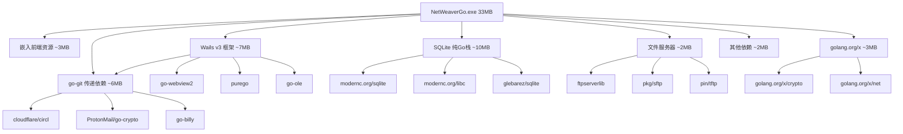

# NetWeaverGo 编译体积分析报告

## 概述

当前编译产物约 **33MB**，以下按依赖类别分析各部分的预估体积贡献。

---

## 体积构成分析

### 1. 🔴 modernc.org 纯 Go SQLite 栈（预估 ~8-12MB）

**依赖链：**
```
glebarez/sqlite → glebarez/go-sqlite → modernc.org/sqlite → modernc.org/libc
```

**涉及包：**
- `modernc.org/sqlite v1.44.3` — 纯 Go 实现的 SQLite 引擎
- `modernc.org/libc v1.67.6` — 纯 Go 重写的 libc（**体积最大的单一间接依赖**）
- `modernc.org/mathutil v1.7.1` — 数学工具库
- `modernc.org/memory v1.11.0` — 内存管理库
- `github.com/glebarez/go-sqlite v1.21.2` — CGO-free SQLite 驱动
- `github.com/glebarez/sqlite v1.11.0` — GORM SQLite 驱动适配器
- `github.com/ncruces/go-strftime v1.0.0` — 时间格式化
- `github.com/remyoudompheng/bigfft v0.0.0-20230129092748` — 大数 FFT（SQLite 大整数运算）

**分析：** 这是项目中**体积贡献最大的依赖组**。`modernc.org/libc` 是对 C 标准库的纯 Go 重写，包含了大量底层实现代码。选择 `glebarez/sqlite` 是为了避免 CGO 依赖（跨平台编译友好），但代价是二进制体积显著增大。

**使用位置：** [`internal/config/db.go`](internal/config/db.go) — 数据库初始化

---

### 2. 🔴 Wails v3 GUI 框架（预估 ~5-8MB）

**依赖链：**
```
wailsapp/wails/v3 → wailsapp/go-webview2 → ebitengine/purego, go-ole
```

**涉及包：**
- `github.com/wailsapp/wails/v3 v3.0.0-alpha.78` — Wails 框架核心
- `github.com/wailsapp/go-webview2 v1.0.23` — Windows WebView2 绑定
- `github.com/ebitengine/purego v0.10.0` — 纯 Go FFI（无 CGO 调用 C 库）
- `github.com/go-ole/go-ole v1.3.0` — Windows COM/OLE 绑定
- `github.com/jchv/go-winloader v0.0.0-20250406163304` — Windows DLL 加载器
- `github.com/Microsoft/go-winio v0.6.2` — Windows I/O 原语
- `github.com/coder/websocket v1.8.14` — WebSocket 实现
- `github.com/bep/debounce v1.2.1` — 防抖工具
- `github.com/leaanthony/go-ansi-parser v1.6.1` — ANSI 解析
- `github.com/leaanthony/u v1.1.1` — 通用工具
- `github.com/lmittmann/tint v1.1.3` — 日志着色
- `github.com/pkg/browser v0.0.0-20240102092130` — 浏览器打开
- `github.com/adrg/xdg v0.5.3` — XDG 路径规范
- `github.com/godbus/dbus/v5 v5.2.2` — D-Bus（Linux 桌面集成，Windows 下仍被编译）

**分析：** Wails v3 是桌面 GUI 框架的核心，不可移除。其中 `go-webview2` 和 `purego` 包含了大量平台特定的底层代码。

**使用位置：** [`cmd/netweaver/main.go`](cmd/netweaver/main.go:14) — 应用入口

---

### 3. 🟡 go-git 全量 Git 实现（预估 ~5-8MB）

**依赖链：**
```
wailsapp/wails/v3 → go-git/go-git/v5 → ProtonMail/go-crypto, cloudflare/circl
```

**涉及包：**
- `github.com/go-git/go-git/v5 v5.18.0` — 纯 Go Git 实现
- `github.com/go-git/go-billy/v5 v5.8.0` — 文件系统抽象层
- `github.com/go-git/gcfg v1.5.1-0.20230307220236` — Git 配置解析
- `github.com/ProtonMail/go-crypto v1.4.1` — 加密库（OpenPGP 等）
- `github.com/cloudflare/circl v1.6.3` — **Cloudflare 密码学库**（含后量子密码学算法，体积巨大）
- `github.com/emirpasic/gods v1.18.1` — 数据结构库
- `github.com/kevinburke/ssh_config v1.6.0` — SSH 配置解析
- `github.com/sergi/go-diff v1.4.0` — 文本差异比较
- `github.com/pjbgf/sha1cd v0.5.0` — SHA1 碰撞检测
- `github.com/xanzy/ssh-agent v0.3.3` — SSH Agent 支持
- `github.com/skeema/knownhosts v1.3.2` — 已知主机管理
- `github.com/jbenet/go-context v0.0.0-20150711004518` — 上下文工具
- `github.com/golang/groupcache v0.0.0-20241129210726` — 缓存库

**分析：** `go-git` 是 Wails v3 的**传递依赖**，项目代码中**完全没有直接使用**。`cloudflare/circl` 包含了椭圆曲线、后量子密码学等大量算法实现，是体积贡献的重要因素。这是一个**优化重点**。

---

### 4. 🟡 嵌入的前端资源（预估 ~2-4MB）

**涉及文件：**
- [`ui.go`](ui.go) 中的 `//go:embed all:frontend/dist` — 嵌入整个前端构建产物
- [`ui.go`](ui.go) 中的 `//go:embed frontend/public/logo.ico` — 嵌入应用图标

**前端依赖（package.json）：**
- `vue ^3.5.25` — Vue.js 框架
- `vue-router ^4.6.4` — 路由
- `pinia ^3.0.4` — 状态管理
- `cytoscape ^3.33.1` — **拓扑图可视化库**（较大的图形库）
- `cytoscape-dagre ^2.5.0` — 有向图布局插件
- `tailwindcss ^4.2.1` — CSS 框架
- `@wailsio/runtime ^3.0.0-alpha.79` — Wails 前端运行时

**分析：** 前端资源通过 `embed.FS` 编译进二进制。`cytoscape` 是一个功能丰富的图形可视化库，可能是前端最大的单项依赖。构建产物包含约 27 个文件（JS/CSS/HTML）。

---

### 5. 🟢 golang.org/x 标准扩展库（预估 ~2-3MB）

**涉及包：**
- `golang.org/x/crypto v0.50.0` — SSH 客户端、加密算法
- `golang.org/x/net v0.53.0` — 网络工具
- `golang.org/x/text v0.36.0` — 文本处理（Unicode 等）
- `golang.org/x/sys v0.43.0` — 系统调用
- `golang.org/x/exp v0.0.0-20260112195511` — 实验性包

**分析：** `golang.org/x/crypto` 是 SSH 连接的核心依赖，不可移除。

**使用位置：** [`internal/sshutil/client.go`](internal/sshutil/client.go), [`internal/ui/settings_service.go`](internal/ui/settings_service.go:11)

---

### 6. 🟢 文件服务器套件（预估 ~1-2MB）

**涉及包：**
- `github.com/fclairamb/ftpserverlib v0.30.0` — FTP 服务器库
- `github.com/pkg/sftp v1.13.10` — SFTP 客户端/服务器
- `github.com/pin/tftp/v3 v3.2.0` — TFTP 实现
- `github.com/spf13/afero v1.15.0` — 虚拟文件系统（FTP 服务器使用）
- `github.com/dustin/go-humanize v1.0.1` — 人类可读格式化

**分析：** 三个文件服务器协议的实现，功能明确且必要。

**使用位置：** [`internal/fileserver/ftp_server.go`](internal/fileserver/ftp_server.go), [`internal/fileserver/sftp_server.go`](internal/fileserver/sftp_server.go), [`internal/fileserver/tftp_server.go`](internal/fileserver/tftp_server.go)

---

### 7. 🟢 其他依赖（预估 ~1MB）

- `github.com/google/uuid v1.6.0` — UUID 生成
- `github.com/stretchr/testify v1.11.1` — 测试框架（仅测试时使用，但编译时仍计入）
- `github.com/rivo/uniseg v0.4.7` — Unicode 文本分段
- `github.com/mattn/go-colorable v0.1.14` / `go-isatty v0.0.21` — 终端颜色
- `github.com/klauspost/cpuid/v2 v2.3.0` — CPU 特性检测
- `github.com/davecgh/go-spew v1.1.1` — 调试输出
- `github.com/cyphar/filepath-securejoin v0.6.1` — 安全路径拼接
- `dario.cat/mergo v1.0.2` — 结构体合并
- `gopkg.in/warnings.v0 v0.1.2` — 警告处理
- `gopkg.in/yaml.v3 v3.0.1` — YAML 解析

---

## 体积分布饼图（预估）

```
modernc.org SQLite 纯 Go 栈     ████████████████░░░░░░░░░░░░░░  ~30% (~10MB)
Wails v3 GUI 框架               ████████████░░░░░░░░░░░░░░░░░░  ~21% (~7MB)
go-git + circl (传递依赖)        ██████████░░░░░░░░░░░░░░░░░░░░  ~18% (~6MB)
嵌入前端资源                      ██████░░░░░░░░░░░░░░░░░░░░░░░░  ~10% (~3MB)
golang.org/x 标准扩展            █████░░░░░░░░░░░░░░░░░░░░░░░░░  ~9%  (~3MB)
文件服务器套件                    ███░░░░░░░░░░░░░░░░░░░░░░░░░░░  ~6%  (~2MB)
其他依赖 + Go 运行时             ███░░░░░░░░░░░░░░░░░░░░░░░░░░░  ~6%  (~2MB)
```

---

## 优化建议

### 高优先级

| # | 优化项 | 预估节省 | 难度 | 说明 |
|---|--------|----------|------|------|
| 1 | **裁剪 go-git 传递依赖** | ~5-8MB | 中 | 项目未直接使用 go-git，但被 Wails v3 拉入。可通过 `go mod graph` 确认依赖链，考虑使用 `replace` 指令或等待 Wails 移除该依赖 |
| 2 | **编译时 strip 调试信息** | ~3-5MB | 低 | 在 `build.bat` 中添加 `-ldflags="-s -w"` 参数，去除调试符号和 DWARF 信息 |
| 3 | **UPX 压缩** | ~50% 压缩 | 低 | 使用 UPX 对最终二进制进行压缩（运行时解压，不影响功能） |

### 中优先级

| # | 优化项 | 预估节省 | 难度 | 说明 |
|---|--------|----------|------|------|
| 4 | **评估 SQLite 驱动替代方案** | ~5-8MB | 高 | 考虑使用 CGO 版 SQLite（`gorm.io/driver/sqlite`），体积更小但需要 CGO 工具链 |
| 5 | **前端 Tree-shaking 优化** | ~0.5-1MB | 低 | 检查 cytoscape 是否支持按需加载，优化 Vite 构建配置 |

### 低优先级

| # | 优化项 | 预估节省 | 难度 | 说明 |
|---|--------|----------|------|------|
| 6 | **前端资源外置** | ~2-4MB | 中 | 将前端资源从 embed 改为运行时从文件系统加载，减小二进制体积但增加部署复杂度 |

---

## 快速优化：编译参数优化

在 [`build.bat`](build.bat:153) 中修改编译命令：

```batch
:: 当前命令
go build -o "dist\netWeaverGo.exe" ./cmd/netweaver

:: 优化后命令（去除调试符号和DWARF信息）
go build -ldflags="-s -w" -o "dist\netWeaverGo.exe" ./cmd/netweaver
```

**预估效果：** 33MB → ~28-29MB（节省约 12-15%）

---

## 依赖关系图


