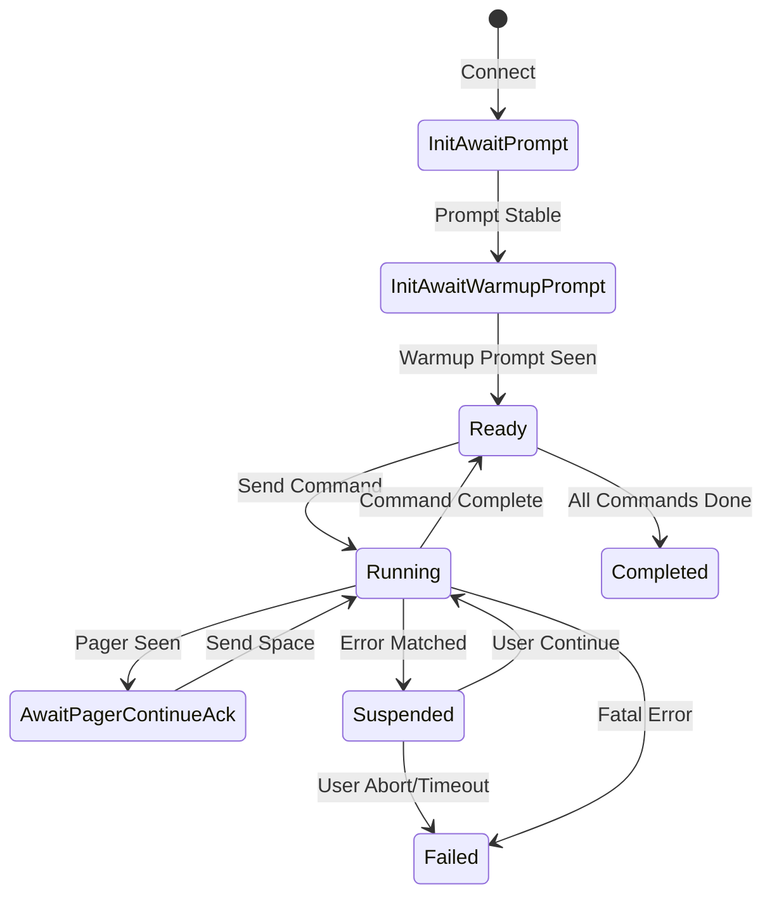
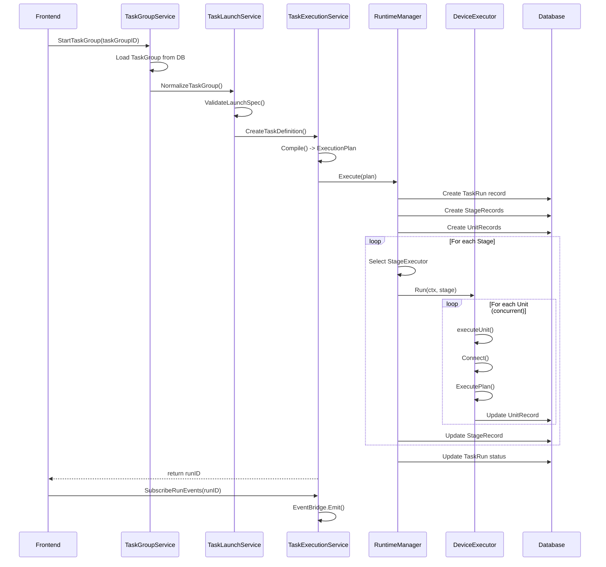
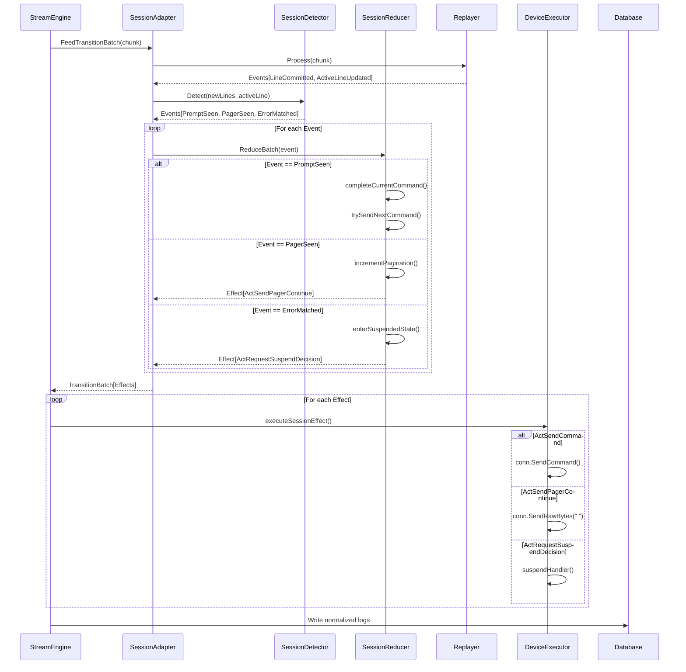
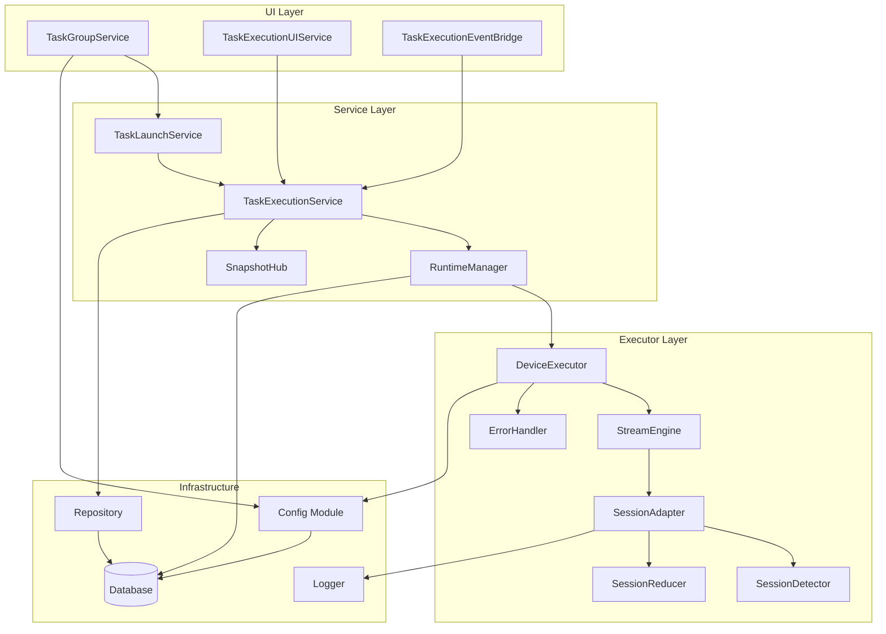

# 任务执行模块功能和逻辑分析报告

## 1. 模块概述

### 1.1 整体架构

任务执行模块采用分层架构设计，主要包含以下三个层次：

```
┌─────────────────────────────────────────────────────────────────┐
│                      UI Layer (internal/ui)                      │
│  ┌─────────────────────┐  ┌─────────────────────────────────┐  │
│  │ TaskGroupService     │  │ TaskExecutionUIService          │  │
│  │ (任务模板CRUD)        │  │ (运行时查询/取消/订阅)           │  │
│  └─────────────────────┘  └─────────────────────────────────┘  │
│                                  │                               │
│                                  ▼                               │
│                  ┌───────────────────────────────┐              │
│                  │ TaskExecutionEventBridge       │              │
│                  │ (事件桥接到Wails前端)           │              │
│                  └───────────────────────────────┘              │
└─────────────────────────────────────────────────────────────────┘
                                   │
                                   ▼
┌─────────────────────────────────────────────────────────────────┐
│                 Service Layer (internal/taskexec)               │
│  ┌─────────────────────────────────────────────────────────┐   │
│  │ TaskExecutionService                                     │   │
│  │ - 任务定义管理                                            │   │
│  │ - 运行时生命周期管理                                       │   │
│  │ - 快照查询/增量推送                                        │   │
│  │ - 离线重放支持                                             │   │
│  └─────────────────────────────────────────────────────────┘   │
│                                  │                               │
│                                  ▼                               │
│  ┌──────────────────┐  ┌─────────────────┐  ┌───────────────┐  │
│  │ TaskLaunchService │  │ RuntimeManager  │  │ SnapshotHub   │  │
│  │ (启动编排)        │  │ (执行调度)       │  │ (状态快照)    │  │
│  └──────────────────┘  └─────────────────┘  └───────────────┘  │
└─────────────────────────────────────────────────────────────────┘
                                   │
                                   ▼
┌─────────────────────────────────────────────────────────────────┐
│                 Executor Layer (internal/executor)               │
│  ┌─────────────────────────────────────────────────────────┐   │
│  │ DeviceExecutor                                           │   │
│  │ - 设备连接管理 (SSH/Telnet)                               │   │
│  │ - 命令执行引擎                                            │   │
│  │ - 会话状态机                                              │   │
│  └─────────────────────────────────────────────────────────┘   │
│                                  │                               │
│          ┌───────────────────────┼───────────────────────┐      │
│          ▼                       ▼                       ▼      │
│  ┌─────────────┐  ┌──────────────────┐  ┌───────────────────┐  │
│  │ StreamEngine│  │ SessionAdapter    │  │ ErrorHandler     │  │
│  │ (流处理)    │  │ (会话适配)        │  │ (错误处理)        │  │
│  └─────────────┘  └──────────────────┘  └───────────────────┘  │
└─────────────────────────────────────────────────────────────────┘
```

### 1.2 模块职责划分

| 模块 | 路径 | 主要职责 |
|------|------|----------|
| **Executor** | `internal/executor/` | 底层设备连接、命令执行、会话状态管理 |
| **TaskExec** | `internal/taskexec/` | 任务编排、运行时管理、进度追踪、持久化 |
| **UI Service** | `internal/ui/` | 前端API暴露、事件桥接、视图模型转换 |
| **Config** | `internal/config/` | 任务模板配置管理、数据库持久化 |

---

## 2. 核心数据结构

### 2.1 Executor 模块数据结构

#### 2.1.1 DeviceExecutor - 设备执行器

```go
// 文件: internal/executor/executor.go
type DeviceExecutor struct {
    IP       string
    Port     int
    Username string
    Password string
    Protocol string // 连接协议: "ssh"（默认）或 "telnet"

    Matcher *matcher.StreamMatcher
    Client  *sshutil.SSHClient // SSH 客户端（仅 SSH 协议时非 nil）

    // conn 统一的设备连接接口（通过连接工厂创建）
    conn connutil.DeviceConnection

    // connectionFactory 连接工厂，用于创建设备连接
    connectionFactory connutil.ConnectionFactory

    EventBus  chan report.ExecutorEvent
    OnSuspend SuspendHandler

    // 构造阶段注入的连接与日志配置。
    algorithms    *models.SSHAlgorithmSettings
    logSession    *report.DeviceLogSession
    deviceProfile *config.DeviceProfile

    // Terminal Replayer - 实验性集成
    // 用于将 SSH 字节流正确转换为规范化逻辑文本
    replayer *terminal.Replayer
}
```

**设计要点**：
- 支持SSH和Telnet双协议，通过 `connutil.DeviceConnection` 接口统一抽象
- 内置 `terminal.Replayer` 实现ANSI转义序列处理，输出规范化逻辑行
- 通过 `SuspendHandler` 回调实现错误/超时时的用户交互决策

#### 2.1.2 ExecutionPlan - 执行计划

```go
// 文件: internal/executor/execution_plan.go
type ExecutionPlan struct {
    Name                  string             // 计划名称
    Commands              []PlannedCommand   // 命令列表
    AbortOnTransportErr   bool               // 传输错误时中止
    AbortOnCommandTimeout bool               // 命令超时时中止
    ContinueOnCmdError    bool               // 命令错误时继续
    Mode                  PlanExecutionMode  // 执行模式
}

type PlannedCommand struct {
    Key             string        // 命令标识 (如: version, lldp_neighbor)
    Command         string        // 实际命令文本
    Timeout         time.Duration // 命令级超时
    ContinueOnError bool          // 错误时是否继续
}
```

**执行模式**：
- `PlanModeDiscovery`: 拓扑发现模式，支持分页处理
- `PlanModePlaybook`: 剧本执行模式，顺序执行命令队列

#### 2.1.3 CommandContext - 命令上下文

```go
// 文件: internal/executor/command_context.go
type CommandContext struct {
    Index           int           // 命令在队列中的索引
    Command         string        // 实际发送的命令（不含内联注释）
    RawCommand      string        // 原始命令（可能包含内联注释）
    StartedAt       time.Time     // 命令开始时间
    CompletedAt     time.Time     // 命令完成时间
    RawBuffer       []byte        // 当前命令范围内的原始数据
    NormalizedLines []string      // 规范化逻辑行
    EchoConsumed    bool          // 是否已消费echo行
    PaginationCount int           // 分页次数
    PromptMatched   bool          // 是否匹配到提示符
    ErrorMessage    string        // 错误信息
    ResultRecorded  bool          // 结果是否已写入
    CustomTimeout    time.Duration // 自定义超时
}
```

**关键方法**：
- `ToResult() *CommandResult`: 转换为可序列化的命令结果
- `NormalizedText() string`: 返回规范化输出文本
- `Duration() time.Duration`: 计算执行时长

#### 2.1.4 会话状态机

```go
// 文件: internal/executor/session_types.go
type NewSessionState int

const (
    NewStateInitAwaitPrompt       // 等待初始提示符
    NewStateInitAwaitWarmupPrompt // 等待预热后提示符
    NewStateReady                 // 就绪状态
    NewStateRunning               // 命令执行中
    NewStateAwaitPagerContinueAck // 等待分页续页确认
    NewStateSuspended             // 挂起状态（等待用户决策）
    NewStateCompleted             // 完成状态
    NewStateFailed                // 失败状态
)
```

**状态转换图**：



### 2.2 TaskExec 模块数据结构

#### 2.2.1 TaskRun - 任务运行实例

```go
// 文件: internal/taskexec/models.go
type TaskRun struct {
    ID               string         `gorm:"primaryKey" json:"id"`
    TaskDefinitionID string         `json:"taskDefinitionId"`
    TaskGroupID      uint           `gorm:"index" json:"taskGroupId"`
    TaskNameSnapshot string         `json:"taskNameSnapshot"`
    LaunchSpecJSON   string         `gorm:"type:text" json:"launchSpecJson"`
    Name             string         `json:"name"`
    RunKind          string         `json:"runKind"` // normal / topology
    Status           string         `json:"status"`  // pending / running / completed / partial / failed / cancelled / aborted
    CurrentStage     string         `json:"currentStage"`
    Progress         int            `json:"progress"` // 0-100
    LastRunSeq       uint64         `gorm:"default:0" json:"lastRunSeq"`
    StartedAt        *time.Time     `json:"startedAt"`
    FinishedAt       *time.Time     `json:"finishedAt"`
    CreatedAt        time.Time      `json:"createdAt"`
    UpdatedAt        time.Time      `json:"updatedAt"`
    DeletedAt        gorm.DeletedAt `gorm:"index" json:"-"`
}
```

#### 2.2.2 TaskRunStage - 阶段运行状态

```go
// 文件: internal/taskexec/models.go
type TaskRunStage struct {
    ID             string     `gorm:"primaryKey" json:"id"`
    TaskRunID      string     `gorm:"index" json:"taskRunId"`
    StageKind      string     `json:"stageKind"` // device_command / device_collect / parse / topology_build
    StageName      string     `json:"stageName"`
    StageOrder     int        `json:"stageOrder"`
    Status         string     `json:"status"`   // pending / running / completed / partial / failed / cancelled
    Progress       int        `json:"progress"` // 0-100
    TotalUnits     int        `json:"totalUnits"`
    CompletedUnits int        `json:"completedUnits"`
    SuccessUnits   int        `json:"successUnits"`
    FailedUnits    int        `json:"failedUnits"`
    CancelledUnits int        `json:"cancelledUnits"`
    PartialUnits   int        `json:"partialUnits"`
    StartedAt      *time.Time `json:"startedAt"`
    FinishedAt     *time.Time `json:"finishedAt"`
    CreatedAt      time.Time  `json:"createdAt"`
    UpdatedAt      time.Time  `json:"updatedAt"`
}
```

#### 2.2.3 TaskRunUnit - 调度单元状态

```go
// 文件: internal/taskexec/models.go
type TaskRunUnit struct {
    ID             string `gorm:"primaryKey" json:"id"`
    TaskRunID      string `gorm:"index" json:"taskRunId"`
    TaskRunStageID string `gorm:"index" json:"taskRunStageId"`
    UnitKind       string `json:"unitKind"`   // device / run / dataset
    TargetType     string `json:"targetType"` // device_ip / task_run / dataset_key
    TargetKey      string `json:"targetKey"`  // 目标标识
    Status         string `json:"status"`     // pending / running / completed / partial / failed / cancelled
    TotalSteps     int    `json:"totalSteps"`
    DoneSteps      int    `json:"doneSteps"`
    ErrorMessage   string `json:"errorMessage"`
    // 日志路径字段
    SummaryLogPath string     `json:"summaryLogPath,omitempty"`
    DetailLogPath  string     `json:"detailLogPath,omitempty"`
    RawLogPath     string     `json:"rawLogPath,omitempty"`
    JournalLogPath string     `json:"journalLogPath,omitempty"`
    StartedAt      *time.Time `json:"startedAt"`
    FinishedAt     *time.Time `json:"finishedAt"`
    CreatedAt      time.Time  `json:"createdAt"`
    UpdatedAt      time.Time  `json:"updatedAt"`
}
```

### 2.3 Config 模块数据结构

#### 2.3.1 TaskGroup - 任务模板

```go
// 文件: internal/models/models.go
type TaskGroup struct {
    ID                     uint                        `json:"id" gorm:"primaryKey;autoIncrement"`
    Name                   string                      `json:"name" gorm:"uniqueIndex;not null"`
    Description            string                      `json:"description"`
    DeviceGroup            string                      `json:"deviceGroup"`
    CommandGroup           string                      `json:"commandGroup"`
    MaxWorkers             int                         `json:"maxWorkers"`
    Timeout                int                         `json:"timeout"`
    TaskType               string                      `json:"taskType"`       // "normal" | "topology" | "backup"
    TopologyVendor         string                      `json:"topologyVendor"` // 拓扑采集厂商（可选，空=自动）
    TopologyFieldOverrides []TopologyTaskFieldOverride `json:"topologyFieldOverrides" gorm:"serializer:json"`
    AutoBuildTopology      bool                        `json:"autoBuildTopology"`            // 拓扑采集完成后自动构建拓扑
    Mode                   string                      `json:"mode"`                         // "group" 模式A | "binding" 模式B
    Items                  []TaskItem                  `json:"items" gorm:"serializer:json"` // 任务项列表
    Status                 string                      `json:"status"`                       // "pending" | "running" | "completed" | "failed"
    Tags                   []string                    `json:"tags" gorm:"serializer:json"`
    EnableRawLog           bool                        `json:"enableRawLog"`
    BackupSaveRootPath     string                      `json:"backupSaveRootPath"`
    BackupDirNamePattern   string                      `json:"backupDirNamePattern"`
    BackupFileNamePattern  string                      `json:"backupFileNamePattern"`
    BackupStartupCommand   string                      `json:"backupStartupCommand"`
    BackupSftpTimeoutSec   int                         `json:"backupSftpTimeoutSec"` // SFTP下载独立超时(秒)，0时使用命令超时的2倍
    CreatedAt              time.Time                   `json:"createdAt"`
    UpdatedAt              time.Time                   `json:"updatedAt"`
}
```

---

## 3. 工作流程

### 3.1 任务执行完整生命周期



### 3.2 命令执行流程（StreamEngine）



### 3.3 会话状态机归约逻辑

**核心归约函数** ([`SessionReducer.ReduceBatch()`](internal/executor/session_reducer.go:53))：

```go
func (r *SessionReducer) ReduceBatch(event SessionEvent) *TransitionBatch {
    batch := NewTransitionBatch()

    // 终态不处理任何事件
    if r.state.IsTerminal() {
        return batch
    }

    var effects []SessionEffect
    switch e := event.(type) {
    case EvInitPromptStable:
        effects = r.handleInitPromptStable(e)

    case EvWarmupPromptSeen:
        effects = r.handleWarmupPromptSeen(e)

    case EvCommittedLine:
        effects = r.handleCommittedLine(e)

    case EvPagerSeen:
        effects = r.handlePagerSeen(e)

    case EvActivePromptSeen:
        effects = r.handleActivePromptSeen(e)

    case EvErrorMatched:
        effects = r.handleErrorMatched(e)

    case EvTimeout:
        effects = r.handleTimeout(e)

    case EvUserContinue:
        effects = r.handleUserContinue(e)

    case EvUserAbort:
        effects = r.handleUserAbort(e)

    case EvSuspendTimeout:
        effects = r.handleSuspendTimeout(e)

    case EvStreamClosed:
        effects = r.handleStreamClosed(e)
    }

    batch.AppendEffects(effects...)
    return batch
}
```

**关键状态转换处理**：

| 当前状态 | 事件 | 新状态 | 副作用 |
|---------|------|--------|--------|
| `InitAwaitPrompt` | `EvInitPromptStable` | `InitAwaitWarmupPrompt` | `ActSendWarmup` |
| `InitAwaitWarmupPrompt` | `EvWarmupPromptSeen` | `Ready` | `ActSendCommand` |
| `Ready` | `EvCommittedLine` | `Ready` | 无 |
| `Running` | `EvActivePromptSeen` | `Ready` | `ActEmitCommandDone`, `ActSendCommand` |
| `Running` | `EvPagerSeen` | `AwaitPagerContinueAck` | `ActSendPagerContinue` |
| `Running` | `EvErrorMatched` | `Suspended` | `ActRequestSuspendDecision` |
| `Suspended` | `EvUserContinue` | `Running` | `ActResetReadTimeout` |
| `Suspended` | `EvUserAbort` | `Failed` | `ActAbortSession` |

---

## 4. 模块间交互关系

### 4.1 依赖关系图



### 4.2 调用链分析

#### 4.2.1 任务启动调用链

```
Frontend.StartTaskGroup(taskGroupID)
    └── TaskGroupService.StartTaskGroup(id)
        └── TaskLaunchService.StartTaskGroup(ctx, id)
            ├── config.GetTaskGroup(id)
            ├── LaunchNormalizer.NormalizeTaskGroup(taskGroup)
            ├── LaunchValidator.ValidateLaunchSpec(ctx, spec)
            ├── TaskExecutionService.CreateTaskDefinitionFromLaunchSpec(spec)
            │   └── NewTopologyCommandResolver().Resolve(vendor, device, overrides)
            └── TaskExecutionService.StartTaskWithMetadata(ctx, def, metadata)
                ├── CompilerRegistry.Compile(ctx, def)
                │   └── TopologyTaskCompiler.Compile(ctx, def)
                │       └── return ExecutionPlan
                └── RuntimeManager.Execute(ctx, plan, def, metadata)
                    ├── Repository.CreateRun(...)
                    ├── Repository.CreateStages(...)
                    ├── Repository.CreateUnits(...)
                    └── goroutine: executeStages(ctx, plan)
                        └── StageExecutor.Run(ctx, stage)
                            └── DeviceCollectExecutor.executeCollect(ctx, stageID, unit)
                                └── DeviceExecutor.ExecutePlanWithEvents(ctx, plan, callback)
                                    └── StreamEngine.Run(ctx, mode, timeout)
```

#### 4.2.2 事件推送调用链

```
DeviceExecutor (goroutine)
    └── StreamEngine.Run()
        └── processChunkBatch(chunk)
            └── SessionAdapter.FeedTransitionBatch(chunk)
                └── SessionReducer.ReduceBatch(event)
                    └── return TransitionBatch[ActEmitCommandDone]
                        └── StreamEngine.executeSessionEffect(effect)
                            └── emitExecutionEvent(event)
                                └── eventCallback(ExecutionEvent)
                                    └── TaskEventProjector.Project(event)
                                        └── Repository.UpdateUnit(...)
                                        └── SnapshotHub.Notify(runID, delta)
                                            └── EventBus.Publish(TaskEvent)
                                                └── TaskExecutionEventBridge.handleEvent(event)
                                                    └── WailsApp.Event.Emit("task:event", data)
                                                        └── Frontend receives event
```

### 4.3 接口定义

#### 4.3.1 StageExecutor 接口

```go
// 文件: internal/taskexec/runtime.go
type StageExecutor interface {
    Kind() string
    Run(ctx RuntimeContext, stage *StagePlan) error
}
```

**已注册的执行器**：
- `DeviceCommandExecutor`: 普通命令执行
- `DeviceCollectExecutor`: 拓扑数据采集
- `ParseExecutor`: 解析采集数据
- `TopologyBuildExecutor`: 构建拓扑图
- `BackupExecutor`: 配置备份

#### 4.3.2 Repository 接口

```go
// 文件: internal/taskexec/persistence.go
type Repository interface {
    // Run operations
    CreateRun(ctx context.Context, run *TaskRun) error
    GetRun(ctx context.Context, runID string) (*TaskRun, error)
    UpdateRun(ctx context.Context, runID string, patch *RunPatch) error
    ListRuns(ctx context.Context, limit int) ([]TaskRun, error)
    ListRunsFiltered(ctx context.Context, limit int, taskGroupID uint, runKind, status string) ([]TaskRun, error)
    ListRunningRuns(ctx context.Context) ([]TaskRun, error)

    // Stage operations
    CreateStage(ctx context.Context, stage *TaskRunStage) error
    GetStage(ctx context.Context, stageID string) (*TaskRunStage, error)
    UpdateStage(ctx context.Context, stageID string, patch *StagePatch) error
    GetStagesByRun(ctx context.Context, runID string) ([]TaskRunStage, error)

    // Unit operations
    CreateUnit(ctx context.Context, unit *TaskRunUnit) error
    GetUnit(ctx context.Context, unitID string) (*TaskRunUnit, error)
    UpdateUnit(ctx context.Context, unitID string, patch *UnitPatch) error
    GetUnitsByStage(ctx context.Context, stageID string) ([]TaskRunUnit, error)
    GetUnitsByRun(ctx context.Context, runID string) ([]TaskRunUnit, error)

    // Event operations
    CreateEvent(ctx context.Context, event *TaskRunEvent) error
    GetEventsByRun(ctx context.Context, runID string, limit int) ([]TaskRunEvent, error)

    // Artifact operations
    CreateArtifact(ctx context.Context, artifact *TaskArtifact) error
    GetArtifactsByRun(ctx context.Context, runID string) ([]TaskArtifact, error)
    GetArtifactsByStage(ctx context.Context, stageID string) ([]TaskArtifact, error)
    GetArtifactsByUnit(ctx context.Context, unitID string) ([]TaskArtifact, error)

    // Delete operations
    DeleteRun(ctx context.Context, runID string) error
    DeleteAllRuns(ctx context.Context) error
    DeleteAllRunsBatch(ctx context.Context) error
    DeleteRunsByKind(ctx context.Context, runKind string) error
    DeleteRunsByTaskGroup(ctx context.Context, taskGroupID uint) error
}
```

---

## 5. 关键算法实现

### 5.1 会话检测算法

**文件**: [`internal/executor/session_detector.go`](internal/executor/session_detector.go)

**核心逻辑**：从规范化输出中提取协议事件

```go
func (d *SessionDetector) Detect(lines []string, activeLine string) []SessionEvent {
    events := make([]SessionEvent, 0)
    
    // 1. 处理已提交的行
    for _, line := range lines {
        // 检测分页符（优先级最高）
        if d.matcher.IsPaginationPrompt(line) {
            events = append(events, EvPagerSeen{Line: line})
            continue
        }
        
        // 检测错误规则
        if matched, rule := d.matcher.MatchErrorRule(line); matched {
            events = append(events, EvErrorMatched{
                Line: line,
                Rule: rule,
            })
            continue
        }
        
        // 检测提示符
        if d.matcher.IsPromptStrict(line) {
            events = append(events, EvCommittedLine{Line: line})
            continue
        }
        
        // 普通行
        events = append(events, EvCommittedLine{Line: line})
    }
    
    // 2. 处理活动行
    if activeLine != "" {
        if d.matcher.IsPaginationPrompt(activeLine) {
            events = append(events, EvPagerSeen{Line: activeLine})
        } else if d.matcher.IsPromptStrict(activeLine) {
            events = append(events, EvActivePromptSeen{Prompt: activeLine})
        }
    }
    
    return events
}
```

**检测优先级**：
1. 分页符 (`-- More --`, `More`)
2. 错误规则 (用户自定义错误模式)
3. 提示符 (严格模式匹配)
4. 普通文本行

### 5.2 错误分类算法

**文件**: [`internal/executor/errors.go`](internal/executor/errors.go:162)

```go
func ClassifyError(err error) ErrorType {
    if err == nil {
        return ErrorTypeNone
    }

    // 检查 connutil.ConnectionError（Telnet/SSH 连接错误）
    var connErr *connutil.ConnectionError
    if errors.As(err, &connErr) {
        switch connErr.Stage {
        case "negotiate":
            return ErrorTypeCritical // 协商失败不可重试
        case "authenticate":
            return ErrorTypeCritical // 认证失败不可重试
        case "connect":
            return ErrorTypeWarning // 连接失败可重试
        default:
            return ErrorTypeWarning
        }
    }

    // 检查 Telnet 哨兵错误
    if errors.Is(err, connutil.ErrTelnetNegotiationFailed) ||
        errors.Is(err, connutil.ErrTelnetLoginFailed) {
        return ErrorTypeCritical
    }
    if errors.Is(err, connutil.ErrTelnetAuthPromptTimeout) {
        return ErrorTypeWarning
    }

    errStr := strings.ToLower(err.Error())

    // 致命错误
    if strings.Contains(errStr, "out of memory") ||
        strings.Contains(errStr, "fatal") ||
        strings.Contains(errStr, "panic") {
        return ErrorTypeFatal
    }

    // 连接错误 - 严重
    if strings.Contains(errStr, "connection refused") ||
        strings.Contains(errStr, "no route to host") ||
        strings.Contains(errStr, "network is unreachable") ||
        strings.Contains(errStr, "i/o timeout") {
        return ErrorTypeCritical
    }

    // 认证错误 - 严重
    if strings.Contains(errStr, "authentication failed") ||
        strings.Contains(errStr, "permission denied") ||
        strings.Contains(errStr, "unable to authenticate") {
        return ErrorTypeCritical
    }

    // 超时错误 - 警告（可重试）
    if strings.Contains(errStr, "timeout") ||
        strings.Contains(errStr, "deadline exceeded") {
        return ErrorTypeWarning
    }

    // EOF 或连接重置 - 警告（可能临时问题）
    if strings.Contains(errStr, "eof") ||
        strings.Contains(errStr, "connection reset") ||
        strings.Contains(errStr, "broken pipe") {
        return ErrorTypeWarning
    }

    // 命令执行错误 - 警告（命令本身问题）
    if strings.Contains(errStr, "command not found") ||
        strings.Contains(errStr, "syntax error") {
        return ErrorTypeWarning
    }

    // 默认视为警告
    return ErrorTypeWarning
}
```

**错误类型层级**：

| 类型 | 级别 | 处理策略 |
|------|------|----------|
| `ErrorTypeNone` | 无错误 | 继续执行 |
| `ErrorTypeWarning` | 警告 | 记录日志，继续执行 |
| `ErrorTypeCritical` | 严重 | 中断当前设备，继续其他设备 |
| `ErrorTypeFatal` | 致命 | 中断整个任务 |

### 5.3 分页处理算法

**文件**: [`internal/executor/session_reducer.go`](internal/executor/session_reducer.go:154)

```go
func (r *SessionReducer) handlePagerSeen(e EvPagerSeen) []SessionEffect {
    switch r.state {
    case NewStateRunning, NewStateReady:
        if r.ctx.Current != nil {
            r.ctx.Current.IncrementPagination()
            if actions := r.checkPaginationLimit(); actions != nil {
                return actions
            }
        }
        r.state = NewStateAwaitPagerContinueAck
        logger.Debug("SessionReducer", "-", "检测到分页符，进入等待续页确认")
        return []SessionEffect{ActSendPagerContinue{}}

    case NewStateAwaitPagerContinueAck:
        // 已经在等待续页确认，记录新的分页符
        if r.ctx.Current != nil {
            r.ctx.Current.IncrementPagination()
            if actions := r.checkPaginationLimit(); actions != nil {
                return actions
            }
        }
        return []SessionEffect{ActSendPagerContinue{}}
    }

    return nil
}

func (r *SessionReducer) checkPaginationLimit() []SessionEffect {
    if r.ctx == nil || r.ctx.Current == nil {
        return nil
    }

    limit := r.ctx.MaxPaginationCount
    if limit <= 0 {
        return nil
    }

    if r.ctx.Current.PaginationCount <= limit {
        return nil
    }

    reason := "pagination_limit_exceeded"
    effects := r.failCurrentCommand("分页次数超限")
    r.state = NewStateFailed

    logger.Warn("SessionReducer", "-", "分页次数超限: current=%d limit=%d", r.ctx.Current.PaginationCount, limit)
    effects = append(effects, ActAbortSession{Reason: reason})
    return effects
}
```

**分页处理流程**：
1. 检测到分页符 (`-- More --`)
2. 增加当前命令的分页计数
3. 检查是否超过限制（默认100次）
4. 发送空格字符继续输出
5. 等待下一批数据

### 5.4 拓扑命令解析算法

**文件**: [`internal/taskexec/topology_command_resolver.go`](internal/taskexec/topology_command_resolver.go:107)

```go
func (r *TopologyCommandResolver) Resolve(taskVendor string, device *models.DeviceAsset, overrides []models.TopologyTaskFieldOverride) (*TopologyCommandResolution, error) {
    if err := EnsureTopologyCommandSeeds(); err != nil {
        return nil, err
    }

    resolvedVendor, vendorSource := r.resolveVendor(taskVendor, device)
    profile, ok := config.GetDeviceProfileByVendor(resolvedVendor)
    if !ok || profile == nil {
        profile = config.GetDeviceProfile(defaultTopologyVendor)
    }
    if profile == nil {
        return nil, fmt.Errorf("拓扑命令解析失败: 无法加载厂商画像 %s", resolvedVendor)
    }

    vendorCommands, err := config.GetTopologyVendorFieldCommands(profile.Vendor)
    useBuiltinSeed := false
    if err != nil {
        logger.Warn("TaskExec", "-", "读取拓扑厂商命令配置失败，回退内置种子: vendor=%s, err=%v", profile.Vendor, err)
        vendorCommands = nil
        useBuiltinSeed = true
    }
    vendorCommandMap := make(map[string]models.TopologyVendorFieldCommand, len(vendorCommands))
    for _, item := range vendorCommands {
        vendorCommandMap[strings.TrimSpace(item.FieldKey)] = item
    }

    profileCommandMap := make(map[string]config.CommandSpec, len(profile.Commands))
    for _, item := range profile.Commands {
        profileCommandMap[strings.TrimSpace(item.CommandKey)] = item
    }

    overrideMap := normalizeTopologyOverrides(overrides)
    resolved := make([]ResolvedTopologyCommand, 0, len(topologyFieldCatalog))
    for _, spec := range topologyFieldCatalog {
        item := ResolvedTopologyCommand{
            FieldKey:       spec.FieldKey,
            DisplayName:    spec.Name,
            TimeoutSec:     0,
            Enabled:        spec.DefaultEnabled,
            CommandSource:  TopologyCommandSourceDisabled,
            ParserBinding:  spec.ParserBinding,
            ResolvedVendor: profile.Vendor,
            VendorSource:   vendorSource,
            Required:       spec.Required,
            Description:    spec.Description,
        }

        if vendorItem, ok := vendorCommandMap[spec.FieldKey]; ok {
            item.Command = strings.TrimSpace(vendorItem.Command)
            item.TimeoutSec = vendorItem.TimeoutSec
            item.Enabled = vendorItem.Enabled
            item.CommandSource = TopologyCommandSourceVendorConfig
        } else if profileItem, ok := profileCommandMap[spec.FieldKey]; ok {
            item.Command = strings.TrimSpace(profileItem.Command)
            item.TimeoutSec = profileItem.TimeoutSec
            item.Enabled = spec.DefaultEnabled && item.Command != ""
            if useBuiltinSeed {
                item.CommandSource = TopologyCommandSourceBuiltinSeed
            } else {
                item.CommandSource = TopologyCommandSourceProfileSeed
            }
        }

        if override, ok := overrideMap[spec.FieldKey]; ok {
            if override.Command != "" {
                item.Command = override.Command
            }
            if override.TimeoutSec > 0 {
                item.TimeoutSec = override.TimeoutSec
            }
            if override.Enabled != nil {
                item.Enabled = *override.Enabled
            }
            item.CommandSource = TopologyCommandSourceTaskOverride
        }

        if strings.TrimSpace(item.Command) == "" {
            item.Enabled = false
            if item.CommandSource == "" {
                item.CommandSource = TopologyCommandSourceDisabled
            }
        }

        resolved = append(resolved, item)
    }

    return &TopologyCommandResolution{
        ResolvedVendor: profile.Vendor,
        VendorSource:   vendorSource,
        ProfileVendor:  profile.Vendor,
        Commands:       resolved,
    }, nil
}
```

**命令解析优先级**：
1. 任务配置覆盖 (`TopologyFieldOverrides`)
2. 厂商默认命令
3. 全局默认命令

---

## 6. 错误处理机制

### 6.1 错误处理架构

```go
// 文件: internal/executor/error_handler.go
type ErrorHandler struct {
    // 可扩展：添加事件总线等
}

func (h *ErrorHandler) Handle(ctx context.Context, err *ExecutionError) bool {
    if err == nil {
        return true
    }
    
    // 1. 记录日志
    h.logError(err)
    
    // 2. 根据策略决定处理方式
    if err.ShouldContinue() {
        return true  // 警告级别，继续执行
    }
    return false  // 严重级别，中断
}
```

### 6.2 错误传播路径

```
DeviceExecutor.ExecutePlan()
    └── StreamEngine.Run()
        └── SessionAdapter.FeedTransitionBatch()
            └── SessionReducer.ReduceBatch()
                └── handleErrorMatched()
                    └── return ActRequestSuspendDecision
                        └── StreamEngine.executeSessionEffect()
                            └── SuspendHandler(ctx, ip, log, failedCmd)
                                └── 用户决策
                                    ├── ActionContinue -> ResolveErrorBatch(true)
                                    │   └── return ActResetReadTimeout
                                    └── ActionAbort -> ResolveErrorBatch(false)
                                        └── return ActAbortSession
```

### 6.3 挂起决策机制

**文件**: [`internal/executor/executor.go`](internal/executor/executor.go:29)

```go
type SuspendHandler func(ctx context.Context, ip string, deviceLog string, failedCmd string) ErrorAction

// 使用示例
suspendHandler := func(ctx context.Context, ip string, deviceLog string, failedCmd string) ErrorAction {
    // 弹出UI对话框询问用户
    result := showSuspendDialog(ip, deviceLog, failedCmd)
    
    switch result {
    case UserChoiceContinue:
        return ActionContinue
    case UserChoiceAbort:
        return ActionAbort
    default:
        // 5分钟超时后自动中止
        return ActionAbortTimeout
    }
}
```

---

## 7. 性能优化要点

### 7.1 并发控制

**文件**: [`internal/taskexec/executor_impl.go`](internal/taskexec/executor_impl.go:43)

```go
func (e *DeviceCommandExecutor) Run(ctx RuntimeContext, stage *StagePlan) error {
    concurrency := stage.Concurrency
    if concurrency <= 0 {
        concurrency = 10  // 默认并发数
    }
    
    semaphore := make(chan struct{}, concurrency)
    var wg sync.WaitGroup
    
    for _, unit := range stage.Units {
        if ctx.IsCancelled() {
            break
        }
        
        wg.Add(1)
        // 使用 select 同时监听信号量和取消通道
        select {
        case semaphore <- struct{}{}:
            // 获取到信号量，继续启动 goroutine
        case <-ctx.Context().Done():
            // 上下文已取消，退出调度循环
            wg.Done()
            break loop
        }
        
        go func(u UnitPlan) {
            defer wg.Done()
            defer func() { <-semaphore }()
            
            // 执行单元...
        }(unit)
    }
    
    wg.Wait()
}
```

**优化点**：
- 使用信号量控制最大并发数
- 通过 `select` 实现取消时的快速退出
- 避免取消时阻塞在信号量获取上

### 7.2 数据拷贝优化

**文件**: [`internal/executor/stream_engine.go`](internal/executor/stream_engine.go:133)

```go
// 关键修复：readResult 携带数据副本，避免共享缓冲区竞态条件
type readResult struct {
    data []byte // 存储读取数据的副本
    err  error
}

go func() {
    defer close(readCh)
    
    for {
        n, err := outReader.Read(buf)
        // 关键修复：立即复制数据，避免竞态条件
        var data []byte
        if n > 0 {
            data = make([]byte, n)
            copy(data, buf[:n])
        }
        select {
        case readCh <- readResult{data: data, err: err}:
        case <-ctx.Done():
            return
        }
        if err != nil {
            return
        }
    }
}()
```

**问题背景**：
- 原实现直接传递 `buf[:n]` 切片
- 主线程稍后取数据时，`buf` 可能已被下一次读取覆盖
- 导致数据错乱和竞态条件

### 7.3 批量数据库更新

**文件**: [`internal/taskexec/error_handler.go`](internal/taskexec/error_handler.go)

```go
func (h *ErrorHandler) UpdateUnitBestEffort(ctx RuntimeContext, unitID string, patch *UnitPatch, operation string) {
    // 尝试更新，失败时仅记录日志，不中断流程
    if err := h.updateUnit(ctx, unitID, patch); err != nil {
        logger.Warn("TaskExec", ctx.RunID(), "%s失败: unitID=%s, err=%v", operation, unitID, err)
    }
}

func (h *ErrorHandler) DBBestEffort(operation string, fn func() error) {
    // 数据库操作最佳实践：失败时记录日志，不阻塞主流程
    if err := fn(); err != nil {
        logger.Warn("TaskExec", h.runID, "%s失败: err=%v", operation, err)
    }
}
```

---

## 8. 扩展点设计

### 8.1 新增任务类型

**步骤**：

1. 定义配置结构（实现 `TaskConfig` 接口）
2. 实现编译器（实现 `TaskCompiler` 接口）
3. 注册编译器到 `CompilerRegistry`
4. 实现执行器（实现 `StageExecutor` 接口）
5. 注册执行器到 `RuntimeManager`

**示例**：添加"配置合规检查"任务类型

```go
// 1. 配置结构
type ComplianceTaskConfig struct {
    DeviceIDs    []uint `json:"deviceIds"`
    DeviceIPs    []string `json:"deviceIps"`
    RuleGroupID  string `json:"ruleGroupId"`
    Concurrency  int    `json:"concurrency"`
    TimeoutSec   int    `json:"timeoutSec"`
}

// 2. 编译器
type ComplianceTaskCompiler struct{}

func (c *ComplianceTaskCompiler) Compile(ctx context.Context, def *TaskDefinition) (*ExecutionPlan, error) {
    var config ComplianceTaskConfig
    if err := json.Unmarshal(def.Config, &config); err != nil {
        return nil, err
    }
    
    // 构建执行计划...
    return &ExecutionPlan{
        Name: def.Name,
        Stages: []StagePlan{
            {
                Name: "config_collect",
                Kind: "device_command",
                Units: units,
            },
            {
                Name: "compliance_check",
                Kind: "compliance_check",
                Units: checkUnits,
            },
        },
    }, nil
}

// 3. 注册编译器
compilerReg.Register(string(RunKindCompliance), NewComplianceTaskCompiler(nil))

// 4. 执行器
type ComplianceCheckExecutor struct{}

func (e *ComplianceCheckExecutor) Kind() string {
    return "compliance_check"
}

func (e *ComplianceCheckExecutor) Run(ctx RuntimeContext, stage *StagePlan) error {
    // 实现合规检查逻辑...
}

// 5. 注册执行器
runtime.RegisterExecutor(NewComplianceCheckExecutor())
```

### 8.2 新增设备协议

**步骤**：

1. 实现 `connutil.DeviceConnection` 接口
2. 实现 `connutil.ConnectionFactory`
3. 注册到连接工厂

**示例**：添加 SNMP 协议支持

```go
// 1. 实现 DeviceConnection
type SNMPConnection struct {
    target *snmp.GoSNMP
}

func (c *SNMPConnection) SendCommand(cmd string) (string, error) {
    // SNMP SET/GET 实现
}

func (c *SNMPConnection) Read(p []byte) (n int, err error) {
    // SNMP GET 实现
}

// 2. 实现 ConnectionFactory
type SNMPConnectionFactory struct{}

func (f *SNMPConnectionFactory) Connect(ctx context.Context, cfg connutil.ConnectionConfig) (connutil.DeviceConnection, error) {
    // 建立 SNMP 连接
}

// 3. 注册工厂
connutil.RegisterConnectionFactory("snmp", &SNMPConnectionFactory{})
```

---

## 9. 总结

### 9.1 架构优势

1. **分层清晰**：UI层、服务层、执行层职责明确，依赖单向
2. **可扩展性强**：通过接口和注册机制，支持新增任务类型、设备协议
3. **状态机驱动**：会话状态机设计保证命令执行的正确性和可恢复性
4. **事件驱动**：实时事件推送机制，前端可实时监控执行进度

### 9.2 潜在改进点

| 问题 | 建议 |
|------|------|
| 错误分类依赖字符串匹配 | 使用哨兵错误和错误类型断言 |
| 数据库更新频繁 | 引入批量写入缓冲区 |
| 日志路径硬编码 | 使用 PathManager 统一管理 |
| 状态机状态较多 | 考虑使用状态表驱动替代 switch-case |

### 9.3 关键文件索引

| 功能 | 文件路径 |
|------|----------|
| 设备执行器 | [`internal/executor/executor.go`](internal/executor/executor.go) |
| 流处理引擎 | [`internal/executor/stream_engine.go`](internal/executor/stream_engine.go) |
| 会话状态机 | [`internal/executor/session_reducer.go`](internal/executor/session_reducer.go) |
| 任务执行服务 | [`internal/taskexec/service.go`](internal/taskexec/service.go) |
| 运行时管理 | [`internal/taskexec/runtime.go`](internal/taskexec/runtime.go) |
| 任务启动服务 | [`internal/taskexec/launch_service.go`](internal/taskexec/launch_service.go) |
| UI事件桥接 | [`internal/ui/taskexec_event_bridge.go`](internal/ui/taskexec_event_bridge.go) |
| 任务模板配置 | [`internal/config/task_group.go`](internal/config/task_group.go) |
