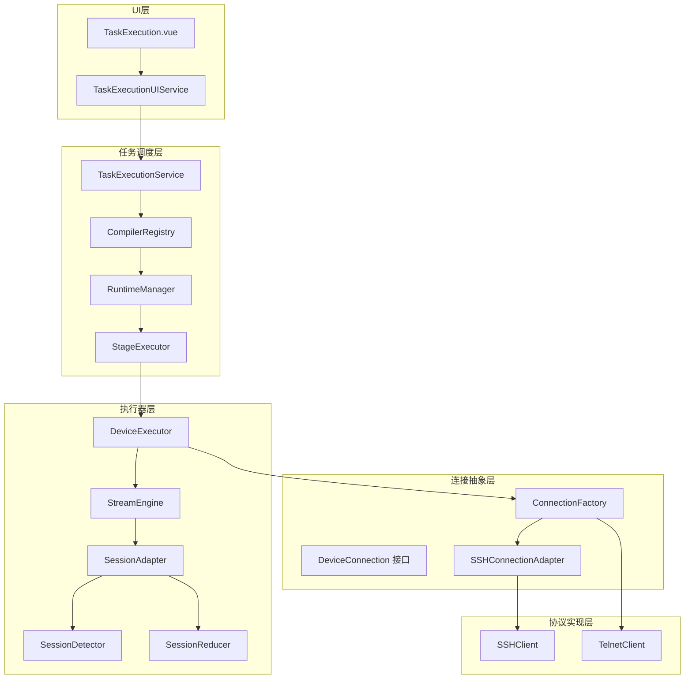
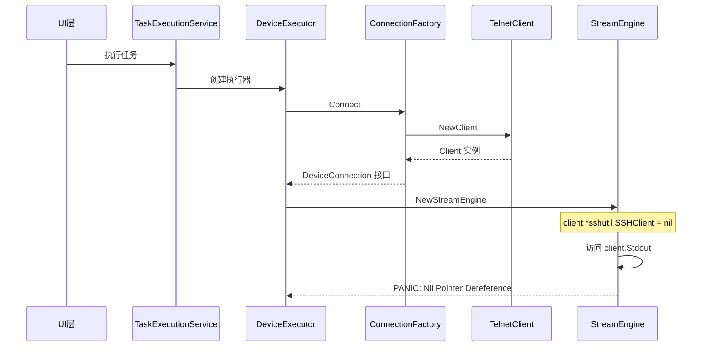
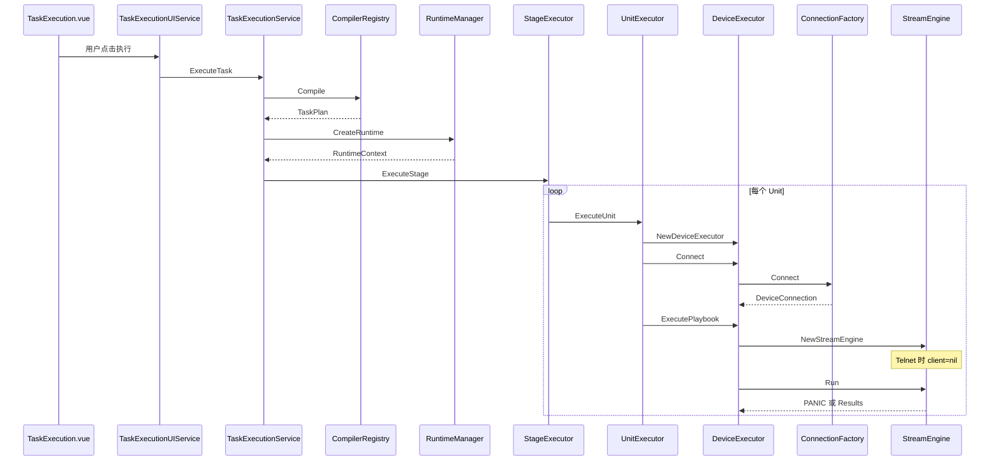
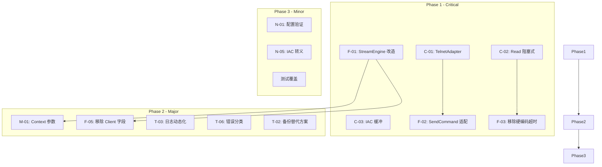

# Telnet 连接设备功能代码审计报告

> **项目**: NetWeaverGo  
> **版本**: 基于 Wails v3 (Go + Vue) 的网络设备管理桌面应用  
> **审计日期**: 2026-05-02  
> **审计状态**: 已完成  

---

## 目录

- [1. 执行摘要](#1-执行摘要)
- [2. 架构概览](#2-架构概览)
- [3. 发现汇总表](#3-发现汇总表)
- [4. 详细发现](#4-详细发现)
- [5. 全局调度逻辑审计](#5-全局调度逻辑审计)
- [6. 函数内部逻辑审计](#6-函数内部逻辑审计)
- [7. 与设计文档一致性分析](#7-与设计文档一致性分析)
- [8. 修复路线图](#8-修复路线图)
- [9. 附录](#9-附录)

---

## 1. 执行摘要

### 1.1 审计范围

本次审计针对 NetWeaverGo 项目的 Telnet 连接设备功能，覆盖从底层连接层到上层任务调度层的完整链路：

| 层级 | 包路径 | 职责 |
|------|--------|------|
| 连接抽象层 | `internal/connutil/` | DeviceConnection 接口 + ConnectionFactory 工厂 |
| Telnet 客户端 | `internal/telnetutil/` | Telnet 协议实现（Client + OptionHandler） |
| 设备执行器 | `internal/executor/` | DeviceExecutor + StreamEngine |
| 任务执行引擎 | `internal/taskexec/` | 编译→运行→快照 |

### 1.2 审计方法论

- **全局调度逻辑审计**: 从 UI 层到执行层的完整调用链分析
- **函数内部逻辑审计**: 关键函数的逐行代码审查
- **设计文档一致性验证**: 实现与 `TELNET_SUPPORT_DESIGN.md` 的偏差分析

### 1.3 关键发现概述

| 严重程度 | 数量 | 核心问题 |
|----------|------|----------|
| **Critical** | 5 | StreamEngine 硬依赖 SSHClient、SendCommand 语义不一致、Read 方法数据丢失、备份执行器 SSH 硬编码 |
| **Major** | 15 | 接口缺少 Context、工厂签名不一致、错误分类不完整、日志硬编码 SSH |
| **Minor** | 12 | 配置验证缺失、并发安全问题、边界条件处理不当 |
| **Suggestion** | 12 | 代码风格、测试覆盖、文档完善 |

**核心结论**: Telnet 功能当前处于**不可用状态**。StreamEngine 硬依赖 `*sshutil.SSHClient`，导致 Telnet 连接在执行阶段必然触发 Nil Pointer Dereference panic。需要系统性重构才能实现 Telnet 支持。

---

## 2. 架构概览

### 2.1 系统架构图



### 2.2 Telnet 集成数据流



### 2.3 调用链路

```
UI层 → TaskExecutionUIService → TaskExecutionService → CompilerRegistry → RuntimeManager
→ StageExecutor → DeviceCommandExecutor → DeviceExecutor → ConnectionFactory
→ SSH/Telnet → StreamEngine → SessionAdapter → SessionDetector/SessionReducer
```

**关键断点**: `StreamEngine` 在 `executor.go:324` 被创建时，传入 `e.Client`（Telnet 场景下为 nil），随后在 `stream_engine.go:109` 访问 `e.client.Stdout` 触发 panic。

---

## 3. 发现汇总表

### 3.1 按严重程度分类

| 编号 | 严重程度 | 位置 | 简述 |
|------|----------|------|------|
| C-01 | Critical | `connutil/ssh_adapter.go:38-46` vs `telnetutil/client.go:482` | SendCommand 返回值语义不一致 |
| C-02 | Critical | `telnetutil/client.go:415-447` | Read 方法存在数据丢失风险 |
| C-03 | Critical | `telnetutil/client.go:360-407` | filterIAC 在数据边界处可能截断 IAC 命令 |
| F-01 | Critical | `executor/stream_engine.go:39,56,109` | StreamEngine 硬依赖 SSHClient |
| F-02 | Critical | `telnetutil/client.go:482-518` | SendCommand 与 StreamEngine 架构冲突 |
| F-03 | Critical | `telnetutil/client.go:415-447` | Read 返回 0,nil 导致读取循环空转 |
| T-01 | Critical | `executor/stream_engine.go:39` | StreamEngine 硬依赖 SSHClient（跨层问题） |
| T-02 | Critical | `taskexec/backup_executor.go:224-253` | 备份执行器 Step 1 硬依赖 SSH/SFTP |
| M-01 | Major | `connutil/interface.go:14-40` | DeviceConnection 接口缺少 context.Context |
| M-02 | Major | `connutil/factory.go:58-60` | 工厂方法签名与设计文档不一致 |
| M-03 | Major | `telnetutil/client.go:497` | SendCommand 使用固定 time.Sleep 等待响应 |
| M-04 | Major | `telnetutil/client.go:authenticate` | authenticate 使用硬编码 sleep 等待认证 |
| M-05 | Major | `telnetutil/client.go:negotiate` | negotiate 阶段转义 IAC 可能被覆盖 |
| M-06 | Major | `telnetutil/client.go:420-421` | Read 方法锁粒度不当 |
| F-04 | Major | `executor/stream_engine.go:113-120` | stderr 消费逻辑对 Telnet 不适用 |
| F-05 | Major | `executor/executor.go:54,57` | DeviceExecutor 同时持有 Client 和 conn |
| F-06 | Major | `executor/errors.go:161-200` | 错误分类未覆盖 Telnet 特有错误 |
| F-07 | Major | `telnetutil/client.go:authenticate` | authenticate 使用硬编码 sleep |
| T-03 | Major | `taskexec/executor_impl.go:246` | 连接成功日志硬编码 SSH 连接成功 |
| T-04 | Major | `taskexec/backup_executor.go:189` | 备份执行器错误消息硬编码 SSH连接失败 |
| T-05 | Major | `taskexec/backup_executor.go:236-246` | 备份执行器绕过统一连接工厂 |
| T-06 | Major | `executor/errors.go:161-200` | ClassifyError 缺少 Telnet 特有错误模式 |
| T-07 | Major | `executor/executor.go:633-637` | classifyRunError 缺少 Telnet 错误关键词 |
| N-01 | Minor | `connutil/factory.go:72-88` | 工厂未验证必填配置字段 |
| N-02 | Minor | `connutil/ssh_adapter.go:69-71` | SSH 适配器 RemoteAddr 格式化方式 |
| N-03 | Minor | `telnetutil/options.go` | OptionHandler 不是并发安全的 |
| N-04 | Minor | `telnetutil/client.go:378-388` | filterIAC 子协商边界检查不完整 |
| N-05 | Minor | `telnetutil/client.go:451-460` | Write 方法未转义 IAC 字节 |
| F-08 | Minor | `executor/executor.go:46-73` | DeviceExecutor 缺少并发安全保护 |
| F-09 | Minor | `telnetutil/client.go:360-407` | filterIAC 边界条件可能丢数据 |
| F-10 | Minor | `executor/stream_engine.go` | EOF 错误消息硬编码 SSH 会话被远端断开 |
| F-11 | Minor | `telnetutil/client.go:497` | SendCommand 中的 time.Sleep 不合理 |
| T-08 | Minor | `taskexec/executor_impl.go:67` | 信号量获取未监听取消通道 |
| T-09 | Minor | `taskexec/executor_impl.go:212-225` | 超时配置未区分协议差异 |
| T-10 | Minor | `models/models.go:112-133` | GlobalSettings 缺少 Telnet 专用配置字段 |

### 3.2 按模块分类统计

| 模块 | Critical | Major | Minor | Suggestion | 总计 |
|------|----------|-------|-------|------------|------|
| connutil | 1 | 2 | 2 | 2 | 7 |
| telnetutil | 3 | 4 | 3 | 2 | 12 |
| executor | 3 | 4 | 4 | 3 | 14 |
| taskexec | 2 | 5 | 3 | 5 | 15 |
| **总计** | **8** | **15** | **12** | **12** | **47** |

---

## 4. 详细发现

### 4.1 Critical 级别发现

#### C-01: SendCommand 返回值语义在 SSH 和 Telnet 之间不一致

| 属性 | 值 |
|------|-----|
| **编号** | C-01 |
| **严重程度** | Critical |
| **位置** | [`connutil/ssh_adapter.go:38-46`](internal/connutil/ssh_adapter.go:38) vs [`telnetutil/client.go:482`](internal/telnetutil/client.go:482) |
| **影响范围** | 所有通过 DeviceConnection 接口调用 SendCommand 的代码 |

**描述**:

`DeviceConnection` 接口定义 `SendCommand(cmd string) (string, error)`，但 SSH 和 Telnet 的实现语义完全不同：

- **SSH 适配器** ([`ssh_adapter.go:38-46`](internal/connutil/ssh_adapter.go:38)):
  ```go
  func (a *SSHConnectionAdapter) SendCommand(cmd string) (string, error) {
      err := a.client.SendCommand(cmd)
      if err != nil {
          return "", err
      }
      // SSH 的 SendCommand 只负责发送，响应由 StreamEngine 通过 Read 消费。
      return "", nil  // 返回空字符串
  }
  ```

- **Telnet 客户端** ([`client.go:482`](internal/telnetutil/client.go:482)):
  ```go
  func (c *Client) SendCommand(cmd string) (string, error) {
      // ... 发送命令 ...
      // 读取所有可用数据
      var response []byte
      // ... 读取响应 ...
      return string(response), nil  // 返回实际响应
  }
  ```

**影响**:

1. 上层代码无法依赖统一的返回值语义
2. StreamEngine 架构假设 SendCommand 只发送不读取，Telnet 实现违反此假设
3. 如果 StreamEngine 调用 Telnet 的 SendCommand，响应会被内部消费掉，StreamEngine 读取循环永远等不到数据

**修复建议**:

创建 `TelnetConnectionAdapter` 包装器，使 `SendCommand()` 只发送不读取，与 SSH 适配器语义对齐：

```go
type TelnetConnectionAdapter struct {
    client *telnetutil.Client
}

func (a *TelnetConnectionAdapter) SendCommand(cmd string) (string, error) {
    err := a.client.SendRawBytes([]byte(cmd + "\r\n"))
    return "", err  // 只发送，不读取响应
}
```

---

#### C-02: Read 方法存在数据丢失风险

| 属性 | 值 |
|------|-----|
| **编号** | C-02 |
| **严重程度** | Critical |
| **位置** | [`telnetutil/client.go:415-447`](internal/telnetutil/client.go:415) |
| **影响范围** | 所有通过 Telnet 连接读取数据的场景 |

**描述**:

[`Read()`](internal/telnetutil/client.go:415) 方法存在多个严重问题：

```go
func (c *Client) Read(p []byte) (n int, err error) {
    // ...
    // 从底层连接读取数据
    _ = c.conn.SetReadDeadline(time.Now().Add(100 * time.Millisecond))  // 硬编码 100ms
    n, err = c.conn.Read(p)
    if n > 0 {
        // 过滤 IAC 命令
        filtered := c.filterIAC(p[:n])
        if len(filtered) < n {
            // 有 IAC 命令被过滤，将过滤后的数据放入缓冲区
            c.readBuf.Write(filtered)
            return c.readBuf.Read(p)  // p 被复用，可能覆盖原数据
        }
        return n, nil
    }
    if err != nil {
        if netErr, ok := err.(net.Error); ok && netErr.Timeout() {
            return 0, nil // 超时返回 0 字节，不报错 — 违反 io.Reader 契约
        }
    }
    return 0, err
}
```

**问题分析**:

1. **硬编码超时**: 100ms 硬编码超时，与 StreamEngine 自身的超时管理冲突
2. **违反 io.Reader 契约**: 超时返回 `(0, nil)` 让调用方无法区分"无数据"和"超时"
3. **缓冲区复用混乱**: `p` 缓冲区被使用三次（读取、过滤、返回），语义混乱
4. **数据丢失风险**: 当 `len(filtered) < n` 时，`c.readBuf.Read(p)` 可能返回部分数据，剩余数据留在缓冲区

**影响**:

1. StreamEngine 的 Timer 永远不会触发（每次 Read 返回都会重置 timer）
2. 读取循环空转，CPU 占用高
3. 数据可能在边界条件下丢失

**修复建议**:

修改 `Read()` 为阻塞式读取，超时控制交给上层：

```go
func (c *Client) Read(p []byte) (n int, err error) {
    if c.closed.Load() {
        return 0, net.ErrClosed
    }

    c.readMu.Lock()
    defer c.readMu.Unlock()

    // 如果缓冲区有数据，先返回缓冲区数据
    if c.readBuf.Len() > 0 {
        return c.readBuf.Read(p)
    }

    // 阻塞式读取，由上层 SetReadDeadline 控制超时
    n, err = c.conn.Read(p)
    if n > 0 {
        filtered := c.filterIAC(p[:n])
        if len(filtered) != n {
            copy(p, filtered)
            return len(filtered), nil
        }
    }
    return n, err
}
```

---

#### C-03: filterIAC 在数据边界处可能截断 IAC 命令

| 属性 | 值 |
|------|-----|
| **编号** | C-03 |
| **严重程度** | Critical |
| **位置** | [`telnetutil/client.go:360-407`](internal/telnetutil/client.go:360) |
| **影响范围** | 所有 Telnet 数据读取场景 |

**描述**:

[`filterIAC()`](internal/telnetutil/client.go:360) 函数在处理 Telnet IAC 命令时，未考虑 TCP 流式传输的分片问题：

```go
func (c *Client) filterIAC(data []byte) []byte {
    var result []byte
    i := 0
    for i < len(data) {
        if data[i] == IAC && i+1 < len(data) {
            cmd := data[i+1]
            switch cmd {
            case WILL, WONT, DO, DONT:
                if i+2 < len(data) {  // 只有完整的三字节命令才处理
                    // ...
                    i += 3
                    continue
                }
                // 不完整命令：IAC + WILL/WONT/DO/DONT，但缺少选项字节
                // 这里会 fallthrough 到 default，导致裸 IAC 字节被传递
            // ...
            }
        }
        result = append(result, data[i])
        i++
    }
    return result
}
```

**问题分析**:

TCP 是流式协议，一次 Read 可能只收到 IAC 命令的一部分：
- 第一次 Read: `[IAC, WILL]` — 不完整，缺少选项字节
- 第二次 Read: `[37, ...]` — 选项字节在下一个包

当前实现会将不完整的 IAC 命令当作普通数据传递给上层，导致：
1. 裸 IAC 字节（0xFF）被错误地传递给上层
2. 后续的选项字节被当作普通数据处理
3. 协议状态机混乱

**修复建议**:

实现 IAC 命令的缓冲和重组：

```go
type Client struct {
    // ...
    iacBuf []byte  // 不完整 IAC 命令缓冲
}

func (c *Client) filterIAC(data []byte) []byte {
    // 合并上次未处理的 IAC 残片
    if len(c.iacBuf) > 0 {
        data = append(c.iacBuf, data...)
        c.iacBuf = nil
    }

    var result []byte
    i := 0
    for i < len(data) {
        if data[i] == IAC {
            if i+1 >= len(data) {
                // 只有 IAC，等待更多数据
                c.iacBuf = data[i:]
                break
            }
            cmd := data[i+1]
            switch cmd {
            case WILL, WONT, DO, DONT:
                if i+2 >= len(data) {
                    // 不完整的三字节命令，等待更多数据
                    c.iacBuf = data[i:]
                    break
                }
                // 处理完整命令...
            case IAC:
                result = append(result, IAC)
                i += 2
                continue
            // ...
            }
        }
        // ...
    }
    return result
}
```

---

#### F-01: StreamEngine 硬依赖 *sshutil.SSHClient

| 属性 | 值 |
|------|-----|
| **编号** | F-01 |
| **严重程度** | Critical |
| **位置** | [`executor/stream_engine.go:39`](internal/executor/stream_engine.go:39), [`executor/stream_engine.go:56`](internal/executor/stream_engine.go:56), [`executor/stream_engine.go:109`](internal/executor/stream_engine.go:109) |
| **影响范围** | 所有 Telnet 设备的命令执行 |

**描述**:

[`StreamEngine`](internal/executor/stream_engine.go:39) 结构体硬编码依赖 `*sshutil.SSHClient`：

```go
type StreamEngine struct {
    adapter *SessionAdapter
    matcher *matcher.StreamMatcher
    client *sshutil.SSHClient  // 硬编码 SSH 类型
    executor *DeviceExecutor
    // ...
}

func NewStreamEngine(executor *DeviceExecutor, client *sshutil.SSHClient, commands []string, width int) *StreamEngine {
    // ...
}

func (e *StreamEngine) Run(ctx context.Context, mode RunMode, defaultTimeout time.Duration) ([]*CommandResult, error) {
    // ...
    outReader := e.client.Stdout  // Telnet 时 client 为 nil → PANIC
    errReader := e.client.Stderr
    // ...
}
```

**触发路径**:

1. [`executor.go:324`](internal/executor/executor.go:324): `engine := NewStreamEngine(e, e.Client, commandStrings, 80)`
2. Telnet 连接时，`e.Client` 为 nil（只有 SSH 连接才设置此字段）
3. [`stream_engine.go:109`](internal/executor/stream_engine.go:109): `outReader := e.client.Stdout` 触发 Nil Pointer Dereference

**影响**:

Telnet 设备执行任何命令都会导致程序 panic，功能完全不可用。

**修复建议**:

将 StreamEngine 的 client 字段替换为 `connutil.DeviceConnection` 接口：

```go
type StreamEngine struct {
    adapter *SessionAdapter
    matcher *matcher.StreamMatcher
    conn    connutil.DeviceConnection  // 使用接口类型
    executor *DeviceExecutor
    // ...
}

func NewStreamEngine(executor *DeviceExecutor, conn connutil.DeviceConnection, commands []string, width int) *StreamEngine {
    // ...
}

func (e *StreamEngine) Run(ctx context.Context, mode RunMode, defaultTimeout time.Duration) ([]*CommandResult, error) {
    // 使用 conn.Read() 替代 client.Stdout.Read()
    buf := make([]byte, bufferSize)
    n, err := e.conn.Read(buf)
    // ...
}
```

---

#### F-02: Telnet SendCommand 与 StreamEngine 架构冲突

| 属性 | 值 |
|------|-----|
| **编号** | F-02 |
| **严重程度** | Critical |
| **位置** | [`telnetutil/client.go:482-518`](internal/telnetutil/client.go:482) |
| **影响范围** | StreamEngine 执行 Telnet 命令 |

**描述**:

Telnet 的 [`SendCommand()`](internal/telnetutil/client.go:482) 是"发送+同步读取响应"模式，而 StreamEngine 架构是"发送与读取分离"模式：

```go
// Telnet SendCommand 实现
func (c *Client) SendCommand(cmd string) (string, error) {
    // 发送命令
    _, err := fmt.Fprintf(c.conn, "%s\r\n", cmd)
    // ...
    // 同步读取响应
    var response []byte
    buf := make([]byte, 4096)
    for {
        n, readErr := c.conn.Read(buf)
        response = append(response, filtered...)
        // ...
    }
    return string(response), nil  // 响应已被消费
}
```

StreamEngine 的执行流程：
1. 调用 `SendCommand()` 发送命令
2. 启动独立读取循环消费响应
3. 如果 Telnet SendCommand 已消费响应，读取循环永远等不到数据

**影响**:

即使修复了 F-01，StreamEngine 仍无法正确执行 Telnet 命令。

**修复建议**:

创建 `TelnetConnectionAdapter`，`SendCommand()` 只发送不读取：

```go
func (a *TelnetConnectionAdapter) SendCommand(cmd string) (string, error) {
    // 只发送命令，不读取响应
    err := a.client.SendRawBytes([]byte(cmd + "\r\n"))
    return "", err
}
```

---

#### F-03: Read 返回 0,nil 导致读取循环空转

| 属性 | 值 |
|------|-----|
| **编号** | F-03 |
| **严重程度** | Critical |
| **位置** | [`telnetutil/client.go:442-443`](internal/telnetutil/client.go:442) |
| **影响范围** | StreamEngine 读取循环 |

**描述**:

Telnet [`Read()`](internal/telnetutil/client.go:442) 在超时时返回 `(0, nil)`：

```go
if netErr, ok := err.(net.Error); ok && netErr.Timeout() {
    return 0, nil // 超时返回 0 字节，不报错
}
```

StreamEngine 的读取循环逻辑：

```go
for {
    n, err := outReader.Read(buf)
    if n > 0 {
        // 处理数据，重置 timer
    }
    if err != nil {
        // 错误处理
    }
    // n=0, err=nil 时继续循环
}
```

**影响**:

1. 100ms 硬编码 deadline 与 StreamEngine 自身的超时管理冲突
2. Timer 永远不会触发（每次 Read 返回都会重置 timer）
3. 读取循环空转，CPU 占用高

**修复建议**:

修改 `Read()` 为阻塞式读取，超时控制交给上层。参见 C-02 修复建议。

---

#### T-02: 备份执行器 Step 1 硬依赖 SSH/SFTP

| 属性 | 值 |
|------|-----|
| **编号** | T-02 |
| **严重程度** | Critical |
| **位置** | [`taskexec/backup_executor.go:224-253`](internal/taskexec/backup_executor.go:224) |
| **影响范围** | Telnet 设备的备份功能 |

**描述**:

备份执行器 Step 1 直接使用 SSH/SFTP 下载配置文件：

```go
// 构建SFTP专用的SSH配置
hostKeyPolicy, knownHostsPath := config.ResolveSSHHostKeyPolicy()
sftpSSHConfig := sshutil.Config{
    IP:             device.IP,
    Port:           device.Port,
    Username:       device.Username,
    Password:       device.Password,
    Timeout:        sftpTimeout,
    HostKeyPolicy:  hostKeyPolicy,
    KnownHostsPath: knownHostsPath,
}

sftpClient, err := sftputil.NewSFTPClient(ctx.Context(), sftpSSHConfig)
```

**问题分析**:

1. SFTP 是 SSH 子系统，Telnet 协议不支持
2. 代码绕过了统一连接工厂，直接创建 SSH 连接
3. Telnet 设备无法执行备份操作

**影响**:

Telnet 设备无法使用备份功能。

**修复建议**:

为 Telnet 设备提供替代方案：

1. **方案 A**: 通过 Telnet 执行 `more` / `cat` 命令读取配置，在本地保存
2. **方案 B**: 检测协议类型，Telnet 设备跳过备份步骤并记录警告
3. **方案 C**: 使用 TFTP/FTP 作为 Telnet 设备的文件传输协议

---

### 4.2 Major 级别发现

#### M-01: DeviceConnection 接口缺少 context.Context 参数

| 属性 | 值 |
|------|-----|
| **编号** | M-01 |
| **严重程度** | Major |
| **位置** | [`connutil/interface.go:14-40`](internal/connutil/interface.go:14) |
| **影响范围** | 所有连接操作 |

**描述**:

`DeviceConnection` 接口的方法缺少 `context.Context` 参数：

```go
type DeviceConnection interface {
    io.Reader
    io.Writer
    io.Closer
    
    SendCommand(cmd string) (string, error)  // 缺少 ctx
    SendRawBytes(data []byte) error          // 缺少 ctx
    SetReadDeadline(deadline time.Time) error
    CancelRead()
    IsClosed() bool
    RemoteAddr() string
}
```

**影响**:

1. 无法实现请求级别的取消
2. 无法传递 trace ID 等上下文信息
3. 与 Go 标准库的最佳实践不一致

**修复建议**:

添加 Context 参数：

```go
type DeviceConnection interface {
    io.Reader
    io.Writer
    io.Closer
    
    SendCommand(ctx context.Context, cmd string) (string, error)
    SendRawBytes(ctx context.Context, data []byte) error
    // ...
}
```

---

#### M-02: 工厂方法签名与设计文档不一致

| 属性 | 值 |
|------|-----|
| **编号** | M-02 |
| **严重程度** | Major |
| **位置** | [`connutil/factory.go:58-60`](internal/connutil/factory.go:58) |
| **影响范围** | 连接创建逻辑 |

**描述**:

设计文档定义工厂方法为 `CreateConnection`，实际实现为 `Connect`：

| 设计文档 | 实际实现 |
|----------|----------|
| `CreateConnection(ctx, protocol, cfg)` | `Connect(ctx, cfg)` |

**影响**:

1. 与设计文档不一致，增加理解成本
2. 协议判断逻辑内置于 `Connect` 方法中，而非通过参数显式指定

**修复建议**:

保持与设计文档一致，或更新设计文档。

---

#### M-03: SendCommand 使用固定 time.Sleep 等待响应

| 属性 | 值 |
|------|-----|
| **编号** | M-03 |
| **严重程度** | Major |
| **位置** | [`telnetutil/client.go:497`](internal/telnetutil/client.go:497) |
| **影响范围** | Telnet 命令执行 |

**描述**:

```go
func (c *Client) SendCommand(cmd string) (string, error) {
    // ...
    // 等待响应
    time.Sleep(200 * time.Millisecond)  // 硬编码等待
    // ...
}
```

**影响**:

1. 响应快时浪费时间
2. 响应慢时数据不完整
3. 无法适应不同网络延迟

**修复建议**:

使用提示符检测或可配置超时替代硬编码 sleep。

---

#### F-05: DeviceExecutor 同时持有 Client 和 conn

| 属性 | 值 |
|------|-----|
| **编号** | F-05 |
| **严重程度** | Major |
| **位置** | [`executor/executor.go:54,57`](internal/executor/executor.go:54) |
| **影响范围** | 执行器状态管理 |

**描述**:

```go
type DeviceExecutor struct {
    // ...
    Client  *sshutil.SSHClient      // SSH 客户端（仅 SSH 协议时非 nil）
    conn    connutil.DeviceConnection  // 统一的设备连接接口
    // ...
}
```

**问题分析**:

1. 两个字段表示同一概念（设备连接）
2. `Client` 仅用于向后兼容 StreamEngine
3. 增加了状态管理的复杂度

**修复建议**:

移除 `Client` 字段，统一使用 `conn` 接口。StreamEngine 改造后（F-01 修复）此字段不再需要。

---

#### T-03: 连接成功日志硬编码 SSH 连接成功

| 属性 | 值 |
|------|-----|
| **编号** | T-03 |
| **严重程度** | Major |
| **位置** | [`taskexec/executor_impl.go:246`](internal/taskexec/executor_impl.go:246) |
| **影响范围** | 日志可读性 |

**描述**:

```go
projectTaskexecLifecycleRecord(ctx, runtimeLogger, scope, recordSessionConnected, "SSH 连接成功", len(commands), 0)
```

**影响**:

Telnet 连接成功时日志仍显示 "SSH 连接成功"，误导运维人员。

**修复建议**:

根据实际协议类型动态生成日志：

```go
protocolName := "SSH"
if device.Protocol != "" {
    protocolName = strings.ToUpper(device.Protocol)
}
projectTaskexecLifecycleRecord(ctx, runtimeLogger, scope, recordSessionConnected, 
    fmt.Sprintf("%s 连接成功", protocolName), len(commands), 0)
```

---

#### T-06: ClassifyError 缺少 Telnet 特有错误模式

| 属性 | 值 |
|------|-----|
| **编号** | T-06 |
| **严重程度** | Major |
| **位置** | [`executor/errors.go:161-200`](internal/executor/errors.go:161) |
| **影响范围** | 错误分类和处理 |

**描述**:

[`ClassifyError()`](internal/executor/errors.go:161) 函数未覆盖 Telnet 特有错误：

```go
func ClassifyError(err error) ErrorType {
    errStr := strings.ToLower(err.Error())
    
    // 只有 SSH 相关错误模式
    if strings.Contains(errStr, "connection refused") ||
       strings.Contains(errStr, "no route to host") ||
       // ...
}
```

**缺失的 Telnet 错误模式**:

- Telnet 协商失败
- 认证提示符超时
- IAC 命令解析错误

**修复建议**:

添加 Telnet 错误模式：

```go
// Telnet 协议错误
if strings.Contains(errStr, "telnet") ||
   strings.Contains(errStr, "negotiation failed") ||
   strings.Contains(errStr, "authentication prompt timeout") {
    return ErrorTypeCritical
}
```

---

### 4.3 Minor 级别发现

#### N-01: 工厂未验证必填配置字段

| 属性 | 值 |
|------|-----|
| **编号** | N-01 |
| **严重程度** | Minor |
| **位置** | [`connutil/factory.go:72-88`](internal/connutil/factory.go:72) |
| **影响范围** | 连接创建 |

**描述**:

`Connect()` 方法未验证必填字段（如 IP）：

```go
func (f *DefaultConnectionFactory) Connect(ctx context.Context, cfg ConnectionConfig) (DeviceConnection, error) {
    protocol := strings.ToLower(strings.TrimSpace(cfg.Protocol))
    // 未验证 cfg.IP 是否为空
    // ...
}
```

**修复建议**:

添加配置验证：

```go
if cfg.IP == "" {
    return nil, NewConnectionError(protocol, cfg.IP, cfg.Port, "connect",
        "IP 地址不能为空", ErrInvalidConfig)
}
```

---

#### N-05: Write 方法未转义 IAC 字节

| 属性 | 值 |
|------|-----|
| **编号** | N-05 |
| **严重程度** | Minor |
| **位置** | [`telnetutil/client.go:451-460`](internal/telnetutil/client.go:451) |
| **影响范围** | 发送包含 0xFF 字节的数据 |

**描述**:

设计文档要求 `Write` 方法转义 IAC 字节（0xFF → 0xFF 0xFF），但实现未做转义：

```go
func (c *Client) Write(p []byte) (n int, err error) {
    // ...
    return c.conn.Write(p)  // 未转义 IAC
}
```

**影响**:

发送包含 0xFF 字节的数据时，可能被对端解释为 Telnet 命令。

**修复建议**:

实现 IAC 转义：

```go
func (c *Client) Write(p []byte) (n int, err error) {
    escaped := bytes.ReplaceAll(p, []byte{IAC}, []byte{IAC, IAC})
    return c.conn.Write(escaped)
}
```

---

## 5. 全局调度逻辑审计

### 5.1 完整调度流程



### 5.2 关键调度节点分析

| 节点 | 文件 | 职责 | Telnet 兼容性 |
|------|------|------|---------------|
| TaskExecutionService | `taskexec/service.go` | 任务编排 | ✅ 兼容 |
| CompilerRegistry | `taskexec/compiler.go` | DSL 编译 | ✅ 兼容 |
| RuntimeManager | `taskexec/runtime.go` | 运行时管理 | ✅ 兼容 |
| StageExecutor | `taskexec/stage_executor.go` | 阶段执行 | ✅ 兼容 |
| UnitExecutor | `taskexec/unit_executor.go` | 单元执行 | ⚠️ 日志硬编码 |
| DeviceExecutor | `executor/executor.go` | 设备执行 | ⚠️ 双字段问题 |
| ConnectionFactory | `connutil/factory.go` | 连接创建 | ✅ 兼容 |
| StreamEngine | `executor/stream_engine.go` | 流处理 | ❌ 不兼容 |

### 5.3 Protocol 字段传递链路

```
DeviceAsset.Protocol (models.go)
    ↓
ExecutorOptions.Protocol (executor.go:41)
    ↓
DeviceExecutor.Protocol (executor.go:51)
    ↓
ConnectionConfig.Protocol (executor.go:121)
    ↓
ConnectionFactory.Connect (factory.go:72)
    ↓
switch protocol → SSH/Telnet (factory.go:80-88)
```

**结论**: Protocol 字段传递链路完整，问题在于 StreamEngine 未使用此信息。

---

## 6. 函数内部逻辑审计

### 6.1 TelnetClient.Read() 逐行分析

```go
// 位置: telnetutil/client.go:415-447
func (c *Client) Read(p []byte) (n int, err error) {
    // [问题 1] 未检查 p 是否为 nil 或 len(p) == 0
    
    if c.closed.Load() {
        return 0, net.ErrClosed  // ✅ 正确处理关闭状态
    }

    c.readMu.Lock()
    defer c.readMu.Unlock()

    // [问题 2] 缓冲区数据可能被部分读取后残留
    if c.readBuf.Len() > 0 {
        return c.readBuf.Read(p)
    }

    // [问题 3] 硬编码 100ms 超时，与上层超时管理冲突
    _ = c.conn.SetReadDeadline(time.Now().Add(100 * time.Millisecond))
    
    n, err = c.conn.Read(p)
    
    if n > 0 {
        filtered := c.filterIAC(p[:n])
        if len(filtered) < n {
            // [问题 4] p 被复用，可能导致数据覆盖
            c.readBuf.Write(filtered)
            return c.readBuf.Read(p)
        }
        return n, nil
    }
    
    if err != nil {
        // [问题 5] 超时返回 (0, nil) 违反 io.Reader 契约
        if netErr, ok := err.(net.Error); ok && netErr.Timeout() {
            return 0, nil
        }
    }
    return 0, err
}
```

### 6.2 StreamEngine.Run() 关键路径分析

```go
// 位置: executor/stream_engine.go:91-250
func (e *StreamEngine) Run(ctx context.Context, mode RunMode, defaultTimeout time.Duration) ([]*CommandResult, error) {
    // [问题 1] 假设 e.client 不为 nil
    if e.client != nil {
        _ = e.client.SetReadDeadline(time.Time{})
    }

    buf := make([]byte, bufferSize)
    
    // [问题 2] 直接访问 SSHClient 的 Stdout/Stderr
    outReader := e.client.Stdout   // Telnet 时 PANIC
    errReader := e.client.Stderr   // Telnet 时 PANIC

    // [问题 3] stderr 消费协程对 Telnet 无意义
    go func() {
        _, _ = io.Copy(io.Discard, errReader)
    }()

    // 读取循环
    for {
        n, err := outReader.Read(buf)
        // ...
    }
}
```

### 6.3 DeviceExecutor.Connect() 分析

```go
// 位置: executor/executor.go:108-173
func (e *DeviceExecutor) Connect(ctx context.Context, timeout time.Duration) error {
    protocol := strings.ToLower(strings.TrimSpace(e.Protocol))
    if protocol == "" {
        protocol = connutil.ProtocolSSH  // 默认 SSH
    }

    // 构建连接配置
    cfg := connutil.ConnectionConfig{
        IP:       e.IP,
        Port:     e.Port,
        Username: e.Username,
        Password: e.Password,
        Protocol: protocol,
        Timeout:  timeout,
    }

    // SSH 协议需要额外配置
    if protocol == connutil.ProtocolSSH {
        // ... PTY 配置 ...
    }

    // 使用连接工厂创建连接
    conn, err := e.connectionFactory.Connect(ctx, cfg)
    if err != nil {
        // 统一错误处理
        return execErr
    }

    e.conn = conn

    // [问题] 向后兼容：如果是 SSH 连接，提取底层 SSHClient
    if sshAdapter, ok := conn.(*connutil.SSHConnectionAdapter); ok {
        e.Client = sshAdapter.Unwrap()  // Telnet 时 e.Client 为 nil
    }

    return nil
}
```

---

## 7. 与设计文档一致性分析

### 7.1 接口签名偏差

| 设计文档定义 | 实际实现 | 偏差类型 |
|--------------|----------|----------|
| `SendCommand(cmd string) error` | `SendCommand(cmd string) (string, error)` | 返回值类型不同 |
| `CreateConnection(ctx, protocol, cfg)` | `Connect(ctx, cfg)` | 方法名不同 |
| `Write` 应转义 IAC | 未转义 IAC | 功能缺失 |

### 7.2 行为偏差

| 设计文档要求 | 实际实现 | 影响 |
|--------------|----------|------|
| 认证完成检测使用提示符检测 | 使用 `time.Sleep` 硬编码等待 | 认证可靠性差 |
| `Read` 阻塞式读取 | `Read` 超时返回 `(0, nil)` | 与 StreamEngine 冲突 |
| `SendCommand` 只发送 | `SendCommand` 发送+读取 | 与 StreamEngine 架构冲突 |

### 7.3 缺失实现

| 设计文档要求 | 状态 |
|--------------|------|
| `factory_test.go` | ❌ 未实现 |
| `options_test.go` | ❌ 未实现 |
| `Write` 方法 IAC 转义 | ❌ 未实现 |

---

## 8. 修复路线图

### 8.1 Phase 1: 核心阻塞问题修复（Critical）

**目标**: 使 Telnet 功能达到可用状态

| 优先级 | 编号 | 修复项 | 依赖 |
|--------|------|--------|------|
| P0 | F-01 | StreamEngine 改用 DeviceConnection 接口 | 无 |
| P0 | C-01 | 创建 TelnetConnectionAdapter 统一 SendCommand 语义 | 无 |
| P0 | C-02 | 修改 Read() 为阻塞式读取 | 无 |
| P0 | F-03 | 移除 Read() 中的硬编码超时 | C-02 |
| P1 | C-03 | 实现 IAC 命令缓冲和重组 | 无 |
| P1 | F-02 | TelnetConnectionAdapter 适配 StreamEngine | C-01 |

**验证步骤**:

1. 单元测试: Telnet 连接建立、命令发送、数据读取
2. 集成测试: Telnet 设备执行 Playbook
3. 端到端测试: UI 触发 Telnet 设备任务执行

### 8.2 Phase 2: 功能完善（Major）

**目标**: 提升 Telnet 功能的健壮性和可维护性

| 优先级 | 编号 | 修复项 | 依赖 |
|--------|------|--------|------|
| P2 | M-01 | DeviceConnection 接口添加 Context 参数 | Phase 1 |
| P2 | F-05 | 移除 DeviceExecutor.Client 字段 | F-01 |
| P2 | T-03 | 日志动态显示协议类型 | 无 |
| P2 | T-06 | ClassifyError 添加 Telnet 错误模式 | 无 |
| P2 | T-02 | 备份执行器 Telnet 替代方案 | Phase 1 |

### 8.3 Phase 3: 代码质量提升（Minor + Suggestion）

**目标**: 提升代码质量和测试覆盖率

| 优先级 | 编号 | 修复项 |
|--------|------|--------|
| P3 | N-01 | 工厂配置验证 |
| P3 | N-05 | Write 方法 IAC 转义 |
| P3 | - | 添加 factory_test.go |
| P3 | - | 添加 options_test.go |
| P3 | - | 添加 client_test.go |

### 8.4 修复依赖关系图



---

## 9. 附录

### 9.1 参考文档

| 文档 | 路径 |
|------|------|
| Telnet 支持设计文档 | [`docs/TELNET_SUPPORT_DESIGN.md`](docs/TELNET_SUPPORT_DESIGN.md) |
| 项目架构文档 | [`docs/PROJECT_ARCHITECTURE.md`](docs/PROJECT_ARCHITECTURE.md) |
| 项目路线图 | [`docs/ROADMAP.md`](docs/ROADMAP.md) |

### 9.2 术语表

| 术语 | 定义 |
|------|------|
| IAC | Interpret As Command，Telnet 协议命令前缀（0xFF） |
| NVT | Network Virtual Terminal，Telnet 虚拟终端 |
| StreamEngine | 统一流处理引擎，负责命令执行和响应解析 |
| DeviceConnection | 设备连接统一接口 |
| ConnectionFactory | 连接工厂，根据协议类型创建连接 |

### 9.3 审计方法

1. **静态代码分析**: 逐行审查关键函数实现
2. **调用链追踪**: 从 UI 层到执行层的完整路径分析
3. **设计文档对比**: 实现与设计规范的偏差识别
4. **边界条件分析**: TCP 流式传输、并发访问等边界场景

---

> **报告生成时间**: 2026-05-02  
> **审计工具**: 人工代码审查  
> **审计人员**: Claude (Architect Mode)
