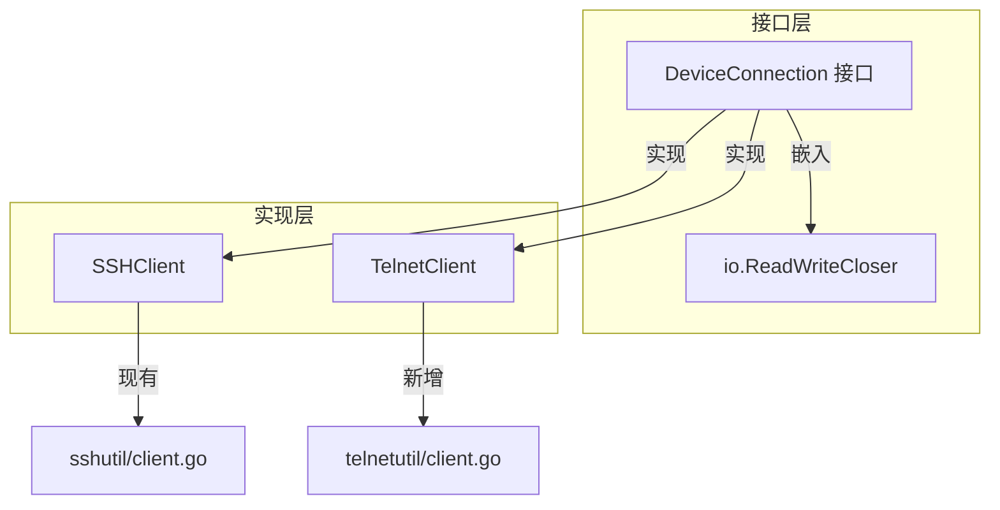
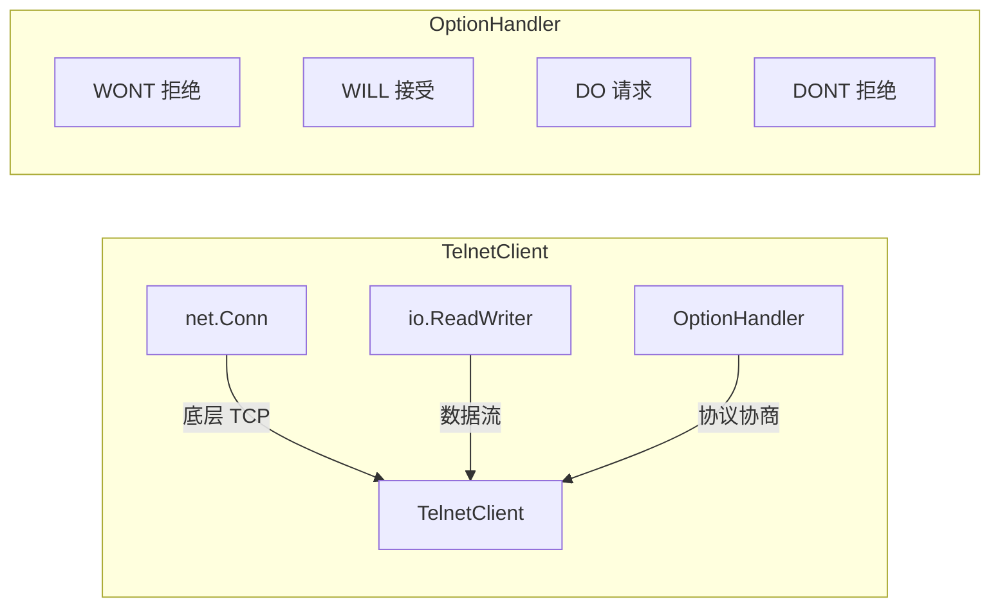
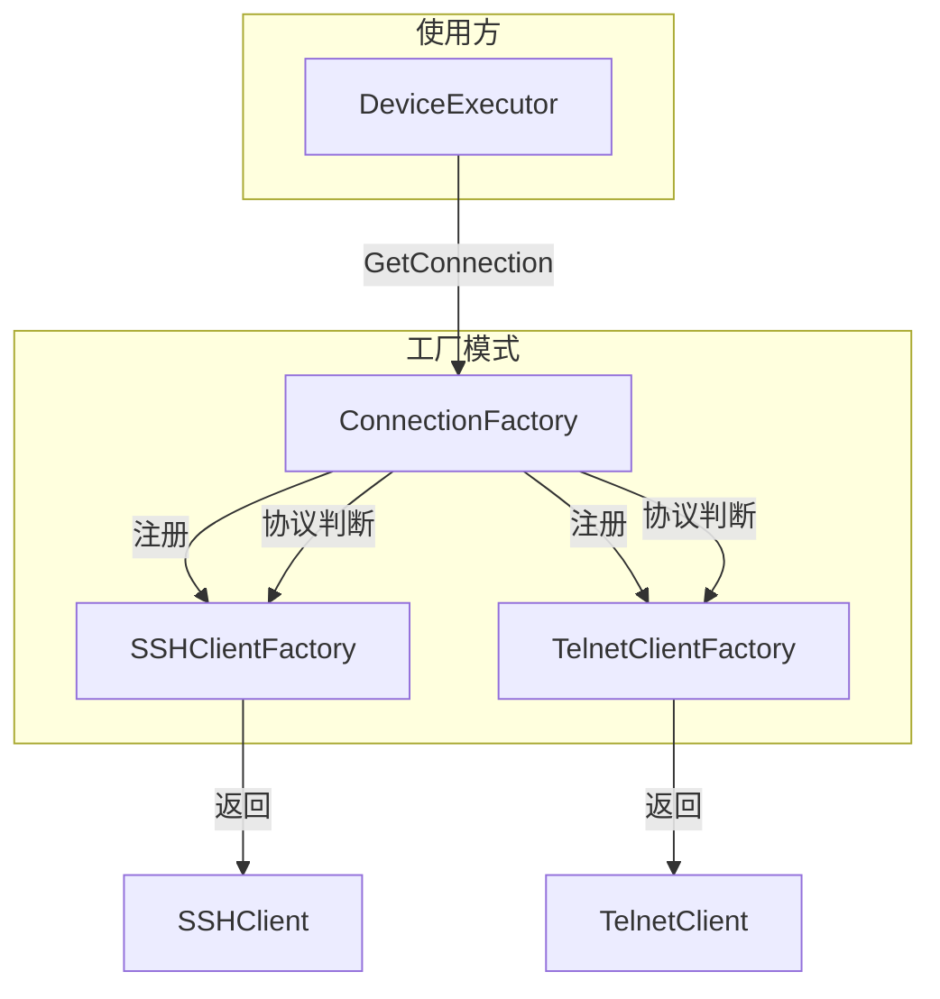

# Telnet 连接支持架构设计文档

> **版本**: v1.0  
> **创建日期**: 2026-05-02  
> **状态**: 设计评审中

---

## 目录

- [1. 概述](#1-概述)
  - [1.1 背景](#11-背景)
  - [1.2 目标](#12-目标)
  - [1.3 范围](#13-范围)
- [2. 现有架构分析](#2-现有架构分析)
  - [2.1 SSH 客户端接口](#21-ssh-客户端接口)
  - [2.2 执行器连接流程](#22-执行器连接流程)
  - [2.3 设备模型](#23-设备模型)
- [3. 架构设计](#3-架构设计)
  - [3.1 设计原则](#31-设计原则)
  - [3.2 统一连接接口](#32-统一连接接口)
  - [3.3 Telnet 客户端设计](#33-telnet-客户端设计)
  - [3.4 连接工厂模式](#34-连接工厂模式)
  - [3.5 执行器改造方案](#35-执行器改造方案)
- [4. 详细设计](#4-详细设计)
  - [4.1 连接接口定义](#41-连接接口定义)
  - [4.2 Telnet 客户端实现](#42-telnet-客户端实现)
  - [4.3 连接工厂实现](#43-连接工厂实现)
  - [4.4 执行器改造](#44-执行器改造)
- [5. 文件结构](#5-文件结构)
- [6. 测试策略](#6-测试策略)
- [7. 风险与缓解措施](#7-风险与缓解措施)
- [8. 实施计划](#8-实施计划)

---

## 1. 概述

### 1.1 背景

NetWeaverGo 当前仅支持 SSH 协议进行设备连接和命令执行。然而，许多老旧网络设备（如传统 Cisco、H3C 交换机）可能仅支持 Telnet 协议，或因安全策略限制无法启用 SSH。为提升产品的设备兼容性，需要增加 Telnet 协议支持。

### 1.2 目标

1. **协议扩展**: 在现有 SSH 连接基础上，增加 Telnet 协议支持
2. **接口统一**: Telnet 客户端与 SSH 客户端实现相同的接口，对上层执行器透明
3. **向后兼容**: 现有 SSH 功能完全保持不变，不影响已有用户
4. **最小侵入**: 通过工厂模式和接口抽象，最小化对现有代码的修改

### 1.3 范围

| 功能 | 是否包含 |
|------|----------|
| Telnet 客户端实现 | ✅ |
| Telnet 协商处理（NVT） | ✅ |
| 密码认证支持 | ✅ |
| 连接工厂模式 | ✅ |
| 执行器改造 | ✅ |
| 前端协议选择 | ✅ 已支持 |
| SSH 功能保持 | ✅ |
| SFTP over Telnet | ❌ 不支持 |
| Telnet 加密（TelnetS） | ❌ 不支持 |

---

## 2. 现有架构分析

### 2.1 SSH 客户端接口

当前 [`internal/sshutil/client.go`](internal/sshutil/client.go:26) 中的 `SSHClient` 结构体：

```go
type SSHClient struct {
    Client  *ssh.Client
    Session *ssh.Session
    IP      string
    Port    int

    Stdin  io.WriteCloser
    Stdout io.Reader
    Stderr io.Reader

    transcriptSink report.RawTranscriptSink
    conn net.Conn
    mu sync.RWMutex
    closed atomic.Bool
    readCancel context.CancelFunc
    readCtx context.Context
}
```

**关键方法**：

| 方法 | 签名 | 用途 |
|------|------|------|
| `Read` | `func(p []byte) (n int, err error)` | 实现 `io.Reader` |
| `Write` | 通过 `Stdin` 实现 | 实现 `io.Writer` |
| `Close` | `func() error` | 实现 `io.Closer` |
| `SendCommand` | `func(cmd string) error` | 发送命令（附加换行） |
| `SendRawBytes` | `func(data []byte) error` | 发送原始字节 |
| `SetReadDeadline` | `func(t time.Time) error` | 设置读取超时 |
| `CancelRead` | `func()` | 强制中断读取 |
| `IsClosed` | `func() bool` | 检查连接状态 |

### 2.2 执行器连接流程

[`internal/executor/executor.go`](internal/executor/executor.go:88) 中的 `Connect` 方法：

```go
func (e *DeviceExecutor) Connect(ctx context.Context, timeout time.Duration) error {
    // ... PTY 配置获取 ...
    
    cfg := sshutil.Config{
        IP:             e.IP,
        Port:           e.Port,
        Username:       e.Username,
        Password:       e.Password,
        Timeout:        timeout,
        Algorithms:     e.algorithms,
        HostKeyPolicy:  hostKeyPolicy,
        KnownHostsPath: knownHostsPath,
        RawSink:        e.rawSink(),
        PTY:            ptyConfig,
    }

    client, err := sshutil.NewSSHClient(ctx, cfg)  // 硬编码 SSH 客户端
    if err != nil {
        // 错误处理 ...
    }
    e.Client = client
    return nil
}
```

**问题**: 硬编码调用 `sshutil.NewSSHClient`，无法支持其他协议。

### 2.3 设备模型

[`internal/models/models.go`](internal/models/models.go:12) 中的 `DeviceAsset` 已包含协议字段：

```go
type DeviceAsset struct {
    ID          uint      `json:"id" gorm:"primaryKey;autoIncrement"`
    IP          string    `json:"ip" gorm:"uniqueIndex;not null"`
    Port        int       `json:"port"`
    Username    string    `json:"username"`
    Password    string    `json:"password" gorm:"column:password"`
    Protocol    string    `json:"protocol"`  // 已有字段
    // ... 其他字段 ...
}
```

[`internal/config/config.go`](internal/config/config.go:14) 已定义协议映射：

```go
var ProtocolDefaultPorts = map[string]int{
    "SSH":    22,
    "SNMP":   161,
    "TELNET": 23,  // 已有
}

var ValidProtocols = []string{"SSH", "SNMP", "TELNET"}  // 已有
```

---

## 3. 架构设计

### 3.1 设计原则

1. **接口隔离**: 定义最小化连接接口，SSH 和 Telnet 客户端分别实现
2. **工厂模式**: 通过连接工厂根据协议类型创建对应客户端
3. **依赖注入**: 执行器依赖接口而非具体实现
4. **开闭原则**: 新增协议只需实现接口并注册工厂，无需修改执行器

### 3.2 统一连接接口

引入 `DeviceConnection` 接口，抽象设备连接的通用操作：



### 3.3 Telnet 客户端设计



**核心功能**：

1. **TCP 连接建立**: 使用 `net.Dial` 建立 TCP 连接
2. **Telnet 协商处理**: 
   - 响应 `DO/DONT` 选项请求
   - 发送 `WILL/WONT` 选项响应
   - 处理终端类型协商（`WILL TERMINAL-TYPE`）
   - 处理窗口大小协商（`WILL NAWS`）
3. **认证流程**:
   - 等待 `login:` / `username:` 提示
   - 发送用户名
   - 等待 `password:` 提示
   - 发送密码
   - 等待命令提示符
4. **数据读写**: 实现 `io.ReadWriteCloser` 接口

### 3.4 连接工厂模式



### 3.5 执行器改造方案

**改造前**:

```go
func (e *DeviceExecutor) Connect(ctx context.Context, timeout time.Duration) error {
    client, err := sshutil.NewSSHClient(ctx, cfg)  // 硬编码
    e.Client = client
    return nil
}
```

**改造后**:

```go
func (e *DeviceExecutor) Connect(ctx context.Context, timeout time.Duration) error {
    client, err := e.connectionFactory.CreateConnection(ctx, e.protocol, cfg)
    e.Client = client
    return nil
}
```

---

## 4. 详细设计

### 4.1 连接接口定义

**文件**: `internal/connutil/interface.go`

```go
// Package connutil 提供设备连接的统一接口和工厂实现
package connutil

import (
    "context"
    "io"
    "time"
)

// DeviceConnection 设备连接接口
// 抽象 SSH 和 Telnet 连接的通用操作
type DeviceConnection interface {
    // io.ReadWriteCloser 基础接口
    io.Reader
    io.Writer
    io.Closer
    
    // SendCommand 发送命令（自动附加换行符）
    SendCommand(cmd string) error
    
    // SendRawBytes 发送原始字节（不附加换行符）
    SendRawBytes(data []byte) error
    
    // SetReadDeadline 设置读取超时时间
    SetReadDeadline(t time.Time) error
    
    // CancelRead 强制中断当前的读取操作
    CancelRead()
    
    // IsClosed 检查连接是否已关闭
    IsClosed() bool
    
    // RemoteAddr 返回远程地址字符串
    RemoteAddr() string
}

// ConnectionConfig 连接配置
type ConnectionConfig struct {
    IP       string
    Port     int
    Username string
    Password string
    Timeout  time.Duration
    
    // PTY 配置（可选）
    TermType string
    TermWidth  int
    TermHeight int
    
    // 原始日志输出（可选）
    RawSink io.Writer
}

// ConnectionFactory 连接工厂接口
type ConnectionFactory interface {
    // CreateConnection 根据协议类型创建连接
    CreateConnection(ctx context.Context, protocol string, cfg ConnectionConfig) (DeviceConnection, error)
}

// Protocol 协议类型常量
const (
    ProtocolSSH    = "SSH"
    ProtocolTelnet = "TELNET"
    ProtocolSNMP   = "SNMP"
)
```

### 4.2 Telnet 客户端实现

**文件**: `internal/telnetutil/client.go`

```go
// Package telnetutil 提供 Telnet 客户端实现
package telnetutil

import (
    "context"
    "errors"
    "fmt"
    "io"
    "net"
    "strings"
    "sync"
    "sync/atomic"
    "time"
    
    "github.com/NetWeaverGo/core/internal/connutil"
    "github.com/NetWeaverGo/core/internal/logger"
)

// TelnetClient Telnet 客户端实现
type TelnetClient struct {
    conn net.Conn
    
    ip   string
    port int
    
    // 读写缓冲
    reader *bufio.Reader
    writer io.Writer
    
    // 协议协商状态
    options *OptionState
    
    // 同步控制
    mu     sync.RWMutex
    closed atomic.Bool
    
    // 读取中断控制
    readCancel context.CancelFunc
    readCtx    context.Context
    
    // 原始日志输出
    rawSink io.Writer
}

// OptionState Telnet 选项协商状态
type OptionState struct {
    // 本地支持的选项
    localEcho      bool
    localSGA      bool  // Suppress Go Ahead
    localTermType  bool
    localNAWS      bool  // Negotiate About Window Size
    
    // 远程请求的选项
    remoteEcho     bool
    
    // 终端配置
    termType string
    termWidth  int
    termHeight int
}

// NewTelnetClient 创建 Telnet 客户端连接
func NewTelnetClient(ctx context.Context, cfg connutil.ConnectionConfig) (*TelnetClient, error) {
    if cfg.Port == 0 {
        cfg.Port = 23
    }
    if cfg.Timeout == 0 {
        cfg.Timeout = 30 * time.Second
    }
    
    address := fmt.Sprintf("%s:%d", cfg.IP, cfg.Port)
    
    // 建立 TCP 连接
    dialer := net.Dialer{Timeout: cfg.Timeout}
    conn, err := dialer.DialContext(ctx, "tcp", address)
    if err != nil {
        return nil, fmt.Errorf("TCP 连接失败: %w", err)
    }
    
    logger.Verbose("Telnet", cfg.IP, "TCP 连接建立成功: %s", address)
    
    // 初始化选项状态
    optState := &OptionState{
        termType:   cfg.TermType,
        termWidth:  cfg.TermWidth,
        termHeight: cfg.TermHeight,
    }
    if optState.termType == "" {
        optState.termType = "vt100"
    }
    if optState.termWidth == 0 {
        optState.termWidth = 80
    }
    if optState.termHeight == 0 {
        optState.termHeight = 24
    }
    
    readCtx, readCancel := context.WithCancel(context.Background())
    
    client := &TelnetClient{
        conn:        conn,
        ip:          cfg.IP,
        port:        cfg.Port,
        reader:      bufio.NewReader(conn),
        writer:      conn,
        options:     optState,
        readCtx:     readCtx,
        readCancel:  readCancel,
        rawSink:     cfg.RawSink,
    }
    
    // 执行 Telnet 协商
    if err := client.negotiate(ctx, cfg.Timeout); err != nil {
        conn.Close()
        return nil, fmt.Errorf("Telnet 协商失败: %w", err)
    }
    
    // 执行认证
    if cfg.Username != "" || cfg.Password != "" {
        if err := client.authenticate(ctx, cfg, cfg.Timeout); err != nil {
            conn.Close()
            return nil, fmt.Errorf("认证失败: %w", err)
        }
    }
    
    logger.Info("Telnet", cfg.IP, "Telnet 连接建立成功")
    return client, nil
}

// negotiate 执行 Telnet 协议协商
func (c *TelnetClient) negotiate(ctx context.Context, timeout time.Duration) error {
    // 设置协商超时
    deadline := time.Now().Add(timeout)
    c.conn.SetDeadline(deadline)
    defer c.conn.SetDeadline(time.Time{})
    
    // 发送初始选项请求
    // WILL TERMINAL-TYPE: 我愿意提供终端类型
    c.sendOption(TelnetWILL, OptTerminalType)
    // WILL NAWS: 我愿意提供窗口大小
    c.sendOption(TelnetWILL, OptNAWS)
    // DO ECHO: 请求服务器回显
    c.sendOption(TelnetDO, OptEcho)
    
    // 等待协商完成或超时
    // 协商会在 Read 中自动处理
    return nil
}

// authenticate 执行用户名/密码认证
func (c *TelnetClient) authenticate(ctx context.Context, cfg connutil.ConnectionConfig, timeout time.Duration) error {
    deadline := time.Now().Add(timeout)
    
    // 等待用户名提示
    prompt, err := c.readUntilPrompt(ctx, []string{"login:", "username:", "Username:", "Login:"}, timeout)
    if err != nil {
        return fmt.Errorf("等待用户名提示超时: %w", err)
    }
    logger.Debug("Telnet", c.ip, "收到用户名提示: %q", prompt)
    
    // 发送用户名
    if err := c.SendCommand(cfg.Username); err != nil {
        return fmt.Errorf("发送用户名失败: %w", err)
    }
    
    // 等待密码提示
    _, err = c.readUntilPrompt(ctx, []string{"password:", "Password:", "Password for"}, timeout)
    if err != nil {
        return fmt.Errorf("等待密码提示超时: %w", err)
    }
    
    // 发送密码
    if err := c.SendCommand(cfg.Password); err != nil {
        return fmt.Errorf("发送密码失败: %w", err)
    }
    
    // 等待登录成功提示符
    // 使用通用提示符匹配：>、#、$ 等
    _, err = c.readUntilPrompt(ctx, []string{">", "#", "$", ">", "#"}, timeout)
    if err != nil {
        return fmt.Errorf("登录失败或等待提示符超时: %w", err)
    }
    
    logger.Info("Telnet", c.ip, "认证成功")
    return nil
}

// Read 读取数据（处理 Telnet 命令）
func (c *TelnetClient) Read(p []byte) (n int, err error) {
    c.mu.RLock()
    defer c.mu.RUnlock()
    
    if c.closed.Load() {
        return 0, net.ErrClosed
    }
    
    // 读取并处理 Telnet 协议字节
    return c.readWithProtocolHandling(p)
}

// readWithProtocolHandling 读取数据并处理 Telnet 协议命令
func (c *TelnetClient) readWithProtocolHandling(p []byte) (n int, err error) {
    // 实现细节：解析 IAC 命令序列
    // IAC (0xFF) + 命令字节 + [选项字节]
    // ...
}

// Write 写入数据
func (c *TelnetClient) Write(p []byte) (n int, err error) {
    c.mu.RLock()
    defer c.mu.RUnlock()
    
    if c.closed.Load() {
        return 0, net.ErrClosed
    }
    
    // 转义 0xFF 字节（Telnet 协议要求）
    escaped := c.escapeIAC(p)
    return c.writer.Write(escaped)
}

// SendCommand 发送命令（附加换行符）
func (c *TelnetClient) SendCommand(cmd string) error {
    c.mu.Lock()
    defer c.mu.Unlock()
    
    if c.closed.Load() {
        return errors.New("连接已关闭")
    }
    
    logger.Verbose("Telnet", c.ip, "发送命令: %q", cmd)
    
    // 追加换行符
    _, err := c.Write([]byte(cmd + "\r\n"))
    return err
}

// SendRawBytes 发送原始字节
func (c *TelnetClient) SendRawBytes(data []byte) error {
    c.mu.Lock()
    defer c.mu.Unlock()
    
    if c.closed.Load() {
        return errors.New("连接已关闭")
    }
    
    _, err := c.Write(data)
    return err
}

// Close 关闭连接
func (c *TelnetClient) Close() error {
    if c.closed.Swap(true) {
        return nil
    }
    
    c.mu.Lock()
    defer c.mu.Unlock()
    
    if c.readCancel != nil {
        c.readCancel()
    }
    
    if c.conn != nil {
        return c.conn.Close()
    }
    return nil
}

// SetReadDeadline 设置读取超时
func (c *TelnetClient) SetReadDeadline(t time.Time) error {
    c.mu.RLock()
    defer c.mu.RUnlock()
    
    if c.closed.Load() {
        return net.ErrClosed
    }
    
    return c.conn.SetReadDeadline(t)
}

// CancelRead 强制中断读取
func (c *TelnetClient) CancelRead() {
    c.mu.RLock()
    defer c.mu.RUnlock()
    
    if c.readCancel != nil {
        c.readCancel()
    }
    c.conn.SetReadDeadline(time.Now().Add(-1 * time.Second))
}

// IsClosed 检查连接是否已关闭
func (c *TelnetClient) IsClosed() bool {
    return c.closed.Load()
}

// RemoteAddr 返回远程地址
func (c *TelnetClient) RemoteAddr() string {
    return fmt.Sprintf("%s:%d", c.ip, c.port)
}

// Telnet 协议常量
const (
    TelnetIAC   = 255  // Interpret As Command
    TelnetWILL  = 251  // 愿意执行
    TelnetWONT  = 252  // 不愿意执行
    TelnetDO    = 253  // 要求对方执行
    TelnetDONT  = 254  // 要求对方不执行
    TelnetSB    = 250  // 子协商开始
    TelnetSE    = 240  // 子协商结束
)

// Telnet 选项常量
const (
    OptEcho         = 1   // 回显
    OptSGA          = 3   // Suppress Go Ahead
    OptTerminalType = 24  // 终端类型
    OptNAWS         = 31  // 窗口大小
    OptLineMode     = 34  // 行模式
)
```

### 4.3 连接工厂实现

**文件**: `internal/connutil/factory.go`

```go
package connutil

import (
    "context"
    "fmt"
    
    "github.com/NetWeaverGo/core/internal/sshutil"
    "github.com/NetWeaverGo/core/internal/telnetutil"
)

// DefaultConnectionFactory 默认连接工厂实现
type DefaultConnectionFactory struct {
    // SSH 算法配置（可选）
    sshAlgorithms *models.SSHAlgorithmSettings
    sshHostKeyPolicy string
    sshKnownHostsPath string
}

// NewConnectionFactory 创建连接工厂
func NewConnectionFactory(opts ...FactoryOption) *DefaultConnectionFactory {
    factory := &DefaultConnectionFactory{}
    for _, opt := range opts {
        opt(factory)
    }
    return factory
}

// FactoryOption 工厂配置选项
type FactoryOption func(*DefaultConnectionFactory)

// WithSSHAlgorithms 设置 SSH 算法配置
func WithSSHAlgorithms(algorithms *models.SSHAlgorithmSettings) FactoryOption {
    return func(f *DefaultConnectionFactory) {
        f.sshAlgorithms = algorithms
    }
}

// WithSSHHostKeyPolicy 设置 SSH 主机密钥策略
func WithSSHHostKeyPolicy(policy, knownHostsPath string) FactoryOption {
    return func(f *DefaultConnectionFactory) {
        f.sshHostKeyPolicy = policy
        f.sshKnownHostsPath = knownHostsPath
    }
}

// CreateConnection 根据协议创建连接
func (f *DefaultConnectionFactory) CreateConnection(
    ctx context.Context,
    protocol string,
    cfg ConnectionConfig,
) (DeviceConnection, error) {
    switch strings.ToUpper(protocol) {
    case ProtocolSSH:
        return f.createSSHConnection(ctx, cfg)
    case ProtocolTelnet:
        return f.createTelnetConnection(ctx, cfg)
    case ProtocolSNMP:
        return nil, fmt.Errorf("SNMP 协议不支持命令执行")
    default:
        return nil, fmt.Errorf("不支持的协议类型: %s", protocol)
    }
}

// createSSHConnection 创建 SSH 连接
func (f *DefaultConnectionFactory) createSSHConnection(
    ctx context.Context,
    cfg ConnectionConfig,
) (DeviceConnection, error) {
    sshCfg := sshutil.Config{
        IP:             cfg.IP,
        Port:           cfg.Port,
        Username:       cfg.Username,
        Password:       cfg.Password,
        Timeout:        cfg.Timeout,
        Algorithms:     f.sshAlgorithms,
        HostKeyPolicy:  f.sshHostKeyPolicy,
        KnownHostsPath: f.sshKnownHostsPath,
        RawSink:        cfg.RawSink,
    }
    
    // 设置 PTY 配置
    if cfg.TermType != "" {
        sshCfg.PTY = &sshutil.PTYConfig{
            TermType: cfg.TermType,
            Width:    cfg.TermWidth,
            Height:   cfg.TermHeight,
        }
    }
    
    return sshutil.NewSSHClient(ctx, sshCfg)
}

// createTelnetConnection 创建 Telnet 连接
func (f *DefaultConnectionFactory) createTelnetConnection(
    ctx context.Context,
    cfg ConnectionConfig,
) (DeviceConnection, error) {
    return telnetutil.NewTelnetClient(ctx, cfg)
}
```

### 4.4 执行器改造

**文件**: `internal/executor/executor.go`

```go
// DeviceExecutor 设备执行器
type DeviceExecutor struct {
    IP       string
    Port     int
    Username string
    Password string
    Protocol string  // 新增：协议类型

    Matcher *matcher.StreamMatcher
    Client  connutil.DeviceConnection  // 改为接口类型

    EventBus  chan report.ExecutorEvent
    OnSuspend SuspendHandler

    // 连接工厂
    connectionFactory connutil.ConnectionFactory
    
    // 其他字段保持不变...
    algorithms    *models.SSHAlgorithmSettings
    logSession    *report.DeviceLogSession
    deviceProfile *config.DeviceProfile
    replayer      *terminal.Replayer
}

// NewDeviceExecutor 初始化执行器
func NewDeviceExecutor(ip string, port int, user, pass, protocol string, opts ExecutorOptions) *DeviceExecutor {
    // ... 现有初始化逻辑 ...
    
    // 创建连接工厂
    factory := connutil.NewConnectionFactory(
        connutil.WithSSHAlgorithms(opts.Algorithms),
        connutil.WithSSHHostKeyPolicy(hostKeyPolicy, knownHostsPath),
    )
    
    return &DeviceExecutor{
        IP:                ip,
        Port:              port,
        Username:          user,
        Password:          pass,
        Protocol:          protocol,
        connectionFactory: factory,
        // ... 其他字段 ...
    }
}

// Connect 建立设备连接
func (e *DeviceExecutor) Connect(ctx context.Context, timeout time.Duration) error {
    logger.Debug("Executor", e.IP, "准备建立连接 (Protocol: %s, Timeout: %v)", e.Protocol, timeout)
    
    // 构建连接配置
    cfg := connutil.ConnectionConfig{
        IP:       e.IP,
        Port:     e.Port,
        Username: e.Username,
        Password: e.Password,
        Timeout:  timeout,
        RawSink:  e.rawSink(),
    }
    
    // 从设备画像获取终端配置
    if e.deviceProfile != nil {
        cfg.TermType = e.deviceProfile.PTY.TermType
        cfg.TermWidth = e.deviceProfile.PTY.Width
        cfg.TermHeight = e.deviceProfile.PTY.Height
    }
    
    // 使用工厂创建连接
    client, err := e.connectionFactory.CreateConnection(ctx, e.Protocol, cfg)
    if err != nil {
        execErr := NewError(e.IP).
            WithStage(StageConnect).
            WithType(ClassifyError(err)).
            WithError(err).
            Build()
        handler := NewErrorHandler()
        handler.Handle(ctx, execErr)
        return execErr
    }
    
    e.Client = client
    logger.Debug("Executor", e.IP, "连接建立成功 (Protocol: %s)", e.Protocol)
    return nil
}
```

---

## 5. 文件结构

新增和修改的文件：

```
internal/
├── connutil/                    # 新增：连接接口和工厂
│   ├── interface.go             # 连接接口定义
│   ├── factory.go               # 连接工厂实现
│   └── factory_test.go          # 工厂单元测试
│
├── telnetutil/                  # 新增：Telnet 客户端
│   ├── client.go                # Telnet 客户端实现
│   ├── options.go               # Telnet 选项协商处理
│   ├── client_test.go           # 客户端单元测试
│   └── options_test.go          # 选项协商测试
│
├── sshutil/
│   └── client.go                # 修改：实现 DeviceConnection 接口
│
├── executor/
│   └── executor.go              # 修改：使用连接工厂
│
└── taskexec/
    └── executor_impl.go        # 修改：传递协议参数
```

---

## 6. 测试策略

### 6.1 单元测试

| 测试文件 | 测试内容 |
|----------|----------|
| `connutil/factory_test.go` | 工厂创建 SSH/Telnet 连接 |
| `telnetutil/client_test.go` | Telnet 客户端读写、关闭 |
| `telnetutil/options_test.go` | Telnet 选项协商逻辑 |

### 6.2 集成测试

使用 Mock 服务器测试完整流程：

```go
func TestTelnetClientAuthentication(t *testing.T) {
    // 启动 Mock Telnet 服务器
    server := NewMockTelnetServer(t)
    defer server.Close()
    
    // 创建客户端连接
    cfg := connutil.ConnectionConfig{
        IP:       server.IP(),
        Port:     server.Port(),
        Username: "testuser",
        Password: "testpass",
        Timeout:  5 * time.Second,
    }
    
    client, err := telnetutil.NewTelnetClient(context.Background(), cfg)
    require.NoError(t, err)
    defer client.Close()
    
    // 验证连接状态
    assert.False(t, client.IsClosed())
    
    // 发送命令测试
    err = client.SendCommand("show version")
    require.NoError(t, err)
}
```

### 6.3 端到端测试

1. 使用真实设备或 GNS3/ENSP 模拟器
2. 测试 SSH 和 Telnet 两种协议的命令执行
3. 验证执行结果一致性

---

## 7. 风险与缓解措施

| 风险 | 影响 | 缓解措施 |
|------|------|----------|
| Telnet 明文传输密码 | 安全风险 | 文档明确警告，建议仅在内网使用 |
| 不同设备认证流程差异 | 兼容性问题 | 支持可配置的认证提示符匹配 |
| Telnet 协商复杂 | 实现难度 | 使用最小协商集，仅处理必要选项 |
| 网络延迟导致认证超时 | 连接失败 | 可配置超时时间，支持重试 |
| 现有代码回归 | 功能损坏 | 完整的单元测试覆盖，SSH 功能保持不变 |

---

## 8. 实施计划

### 阶段一：基础设施（接口和工厂）

1. 创建 `internal/connutil` 包
2. 定义 `DeviceConnection` 接口
3. 实现 `DefaultConnectionFactory`
4. 为 `SSHClient` 添加接口实现

### 阶段二：Telnet 客户端

1. 创建 `internal/telnetutil` 包
2. 实现 TCP 连接建立
3. 实现 Telnet 选项协商
4. 实现用户名/密码认证
5. 实现 `DeviceConnection` 接口

### 阶段三：执行器改造

1. 修改 `DeviceExecutor` 结构体
2. 修改 `NewDeviceExecutor` 构造函数
3. 修改 `Connect` 方法使用工厂
4. 修改 `taskexec` 传递协议参数

### 阶段四：测试和文档

1. 编写单元测试
2. 编写集成测试
3. 更新用户文档
4. 添加安全警告说明

---

## 附录 A：Telnet 协议参考

### A.1 Telnet 命令

| 命令 | 代码 | 说明 |
|------|------|------|
| IAC | 255 | Interpret As Command |
| WILL | 251 | 发送方愿意执行某选项 |
| WONT | 252 | 发送方拒绝执行某选项 |
| DO | 253 | 发送方要求对方执行某选项 |
| DONT | 254 | 发送方要求对方不执行某选项 |
| SB | 250 | 子协商开始 |
| SE | 240 | 子协商结束 |

### A.2 常用选项

| 选项 | 代码 | 说明 |
|------|------|------|
| ECHO | 1 | 回显 |
| SGA | 3 | Suppress Go Ahead |
| TERMINAL-TYPE | 24 | 终端类型 |
| NAWS | 31 | 窗口大小协商 |
| LINEMODE | 34 | 行模式 |

### A.3 协商示例

```
服务器: IAC DO TERMINAL-TYPE    (请求客户端提供终端类型)
客户端: IAC WILL TERMINAL-TYPE  (同意提供)
服务器: IAC SB TERMINAL-TYPE SEND IAC SE  (请求发送终端类型)
客户端: IAC SB TERMINAL-TYPE IS VT100 IAC SE  (发送终端类型)
```

---

## 附录 B：错误处理

### B.1 连接错误分类

| 错误类型 | SSH 错误 | Telnet 错误 | 处理方式 |
|----------|----------|-------------|----------|
| 网络不可达 | TCP 连接失败 | TCP 连接失败 | 返回错误，记录日志 |
| 认证失败 | 认证被拒绝 | 密码错误提示 | 返回错误，建议检查凭证 |
| 超时 | 连接/命令超时 | 连接/认证超时 | 返回错误，建议增加超时 |
| 协议错误 | SSH 握手失败 | Telnet 协商失败 | 返回错误，记录详细信息 |

### B.2 日志记录

所有连接操作都应记录详细日志：

- 连接开始：IP、端口、协议、超时时间
- 连接成功：协议协商结果
- 连接失败：错误类型、错误详情、建议操作
- 认证过程：用户名提示、密码提示（不记录密码值）
- 命令执行：命令内容、执行结果摘要

---

## 附录 C：向后兼容性

### C.1 API 兼容性

- `DeviceExecutor` 的公共方法签名保持不变
- 新增 `Protocol` 字段有默认值 "SSH"
- 现有调用代码无需修改即可继续使用 SSH

### C.2 数据兼容性

- `DeviceAsset.Protocol` 字段已存在
- 现有设备数据默认为空，运行时默认使用 SSH
- 数据库无需迁移

### C.3 配置兼容性

- 全局设置无需修改
- SSH 算法配置继续生效
- Telnet 使用系统默认超时设置
