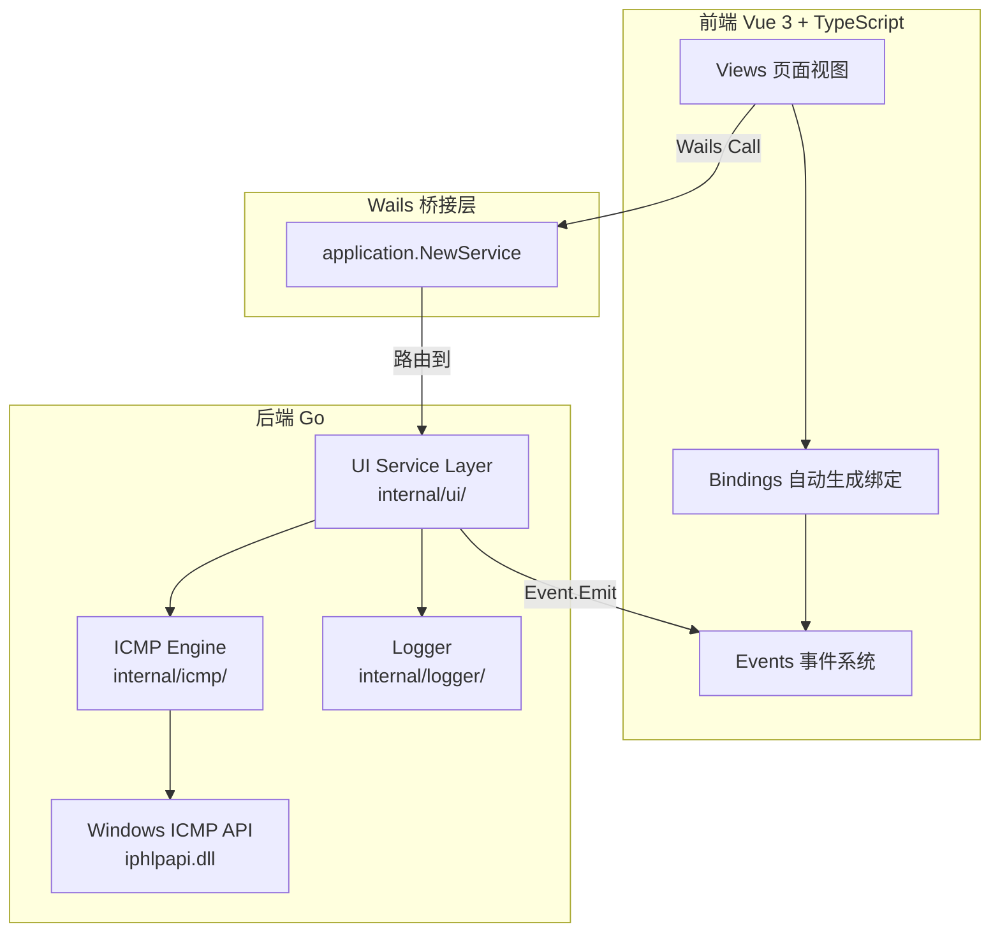
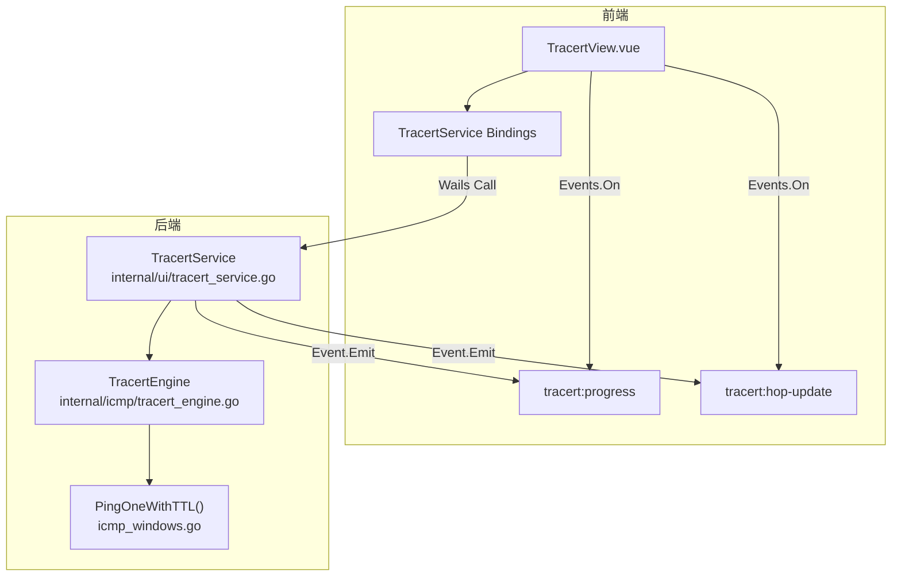
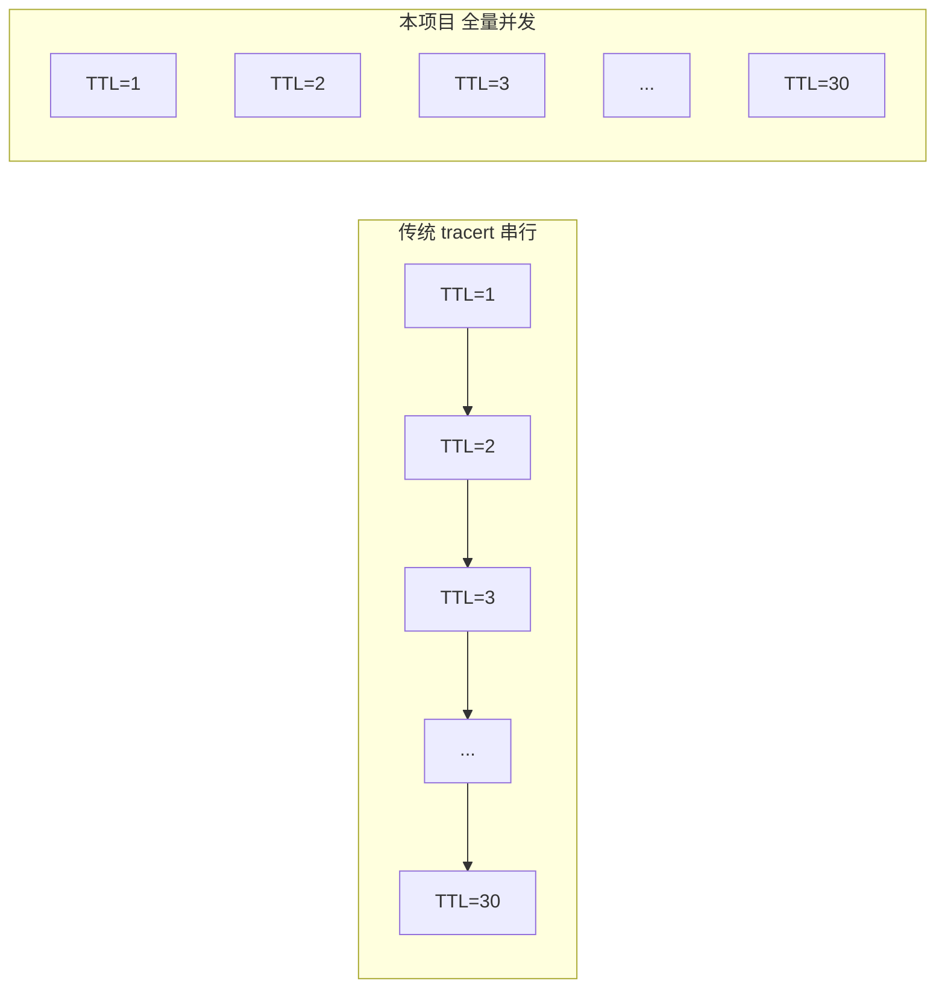
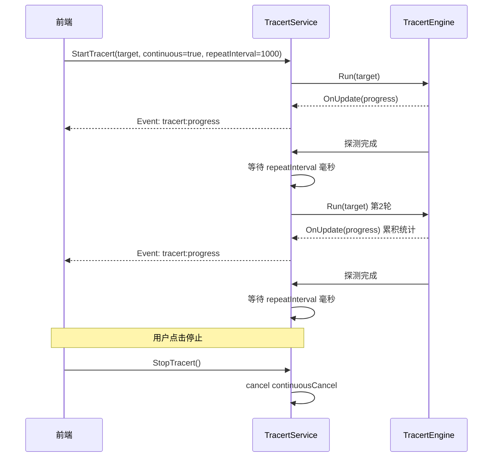
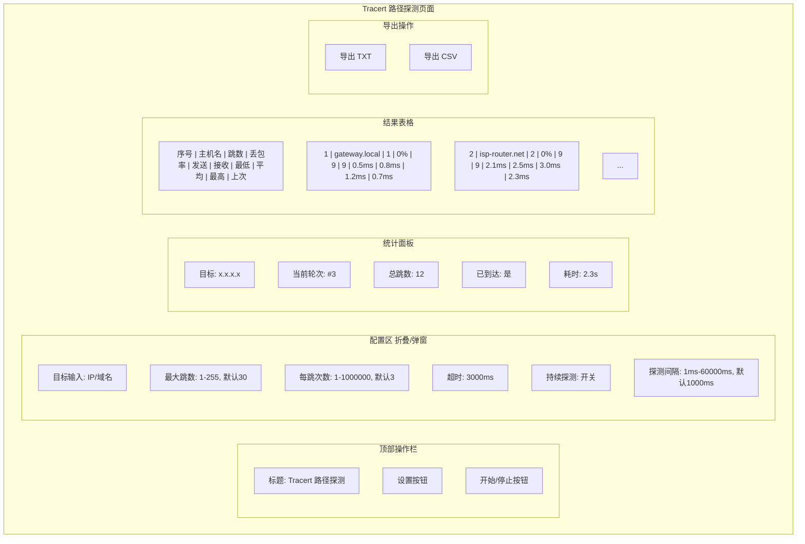

# Tracert 路径探测功能 — 详细规划设计书

> **版本**: v1.0  
> **日期**: 2026-05-02  
> **状态**: 设计阶段

---

## 一、现有项目架构分析

### 1.1 整体架构概览

NetWeaverGo 采用 **Wails v3** 桌面应用框架，后端 Go + 前端 Vue 3 + TypeScript。核心分层如下：



### 1.2 现有批量 Ping 功能架构详解

#### 1.2.1 后端 ICMP 引擎层 (internal/icmp/)

| 文件 | 职责 |
|------|------|
| `types.go` | 数据类型定义：PingResult、PingConfig、PingHostResult、BatchPingProgress、HostPingUpdate、PartialStats、RunOptions |
| `icmp_windows.go` | Windows ICMP API 封装：IcmpCreateFile、IcmpSendEcho、IcmpCloseHandle、PingOne、**PingOneWithTTL** |
| `engine.go` | 批量 Ping 引擎：BatchPingEngine，并发控制（信号量 + WaitGroup），context 取消机制 |

**关键发现**：`PingOneWithTTL()` 已存在，支持自定义 TTL 发送 ICMP Echo，这正是 tracert 的核心底层能力。

#### 1.2.2 UI 服务层 (internal/ui/ping_service.go)

`PingService` 结构体提供：
- `StartBatchPing()` — 启动批量 Ping
- `StopBatchPing()` — 停止批量 Ping
- `GetPingProgress()` — 获取进度（深拷贝）
- `ExportPingResultCSV()` — CSV 导出
- `ExpandPingTargets()` — 目标语法糖展开
- DNS 预解析 + 缓存机制
- 自适应节流（根据 IP 数量调整回调频率）

**事件通信模式**：
- `ping:progress` — 整体进度更新
- `ping:host-update` — 单主机中间状态更新

#### 1.2.3 前端页面 (frontend/src/views/Tools/BatchPing.vue)

- 使用 Wails 自动生成的 TypeScript bindings 调用后端
- 通过 `Events.On()` 订阅实时事件
- 轮询兜底机制（2秒间隔）
- 列配置持久化（localStorage）
- 实时覆盖层（overlay）跟踪 ping 状态
- `requestAnimationFrame` 批处理事件更新

#### 1.2.4 服务注册 (cmd/netweaver/main.go)

```go
pingService := ui.NewPingService()
// ...
application.NewService(pingService)
```

#### 1.2.5 前端路由 (frontend/src/router/index.ts)

```typescript
{ path: '/tools/ping', name: 'BatchPing', component: BatchPing }
```

#### 1.2.6 侧边栏导航 (frontend/src/App.vue)

Tools 分组下包含：子网计算器、配置生成、端口速查、**批量 Ping**、文件服务器。

---

## 二、Tracert 功能需求分析

### 2.1 功能概述

新增 **Tracert 路径探测** 工具，支持对单个 IP 或域名进行路由路径探测，采用**全量 TTL 并发探测**策略加速路径发现，并支持**持续周期性探测**直到手动停止。

### 2.2 核心需求

| 需求项 | 描述 |
|--------|------|
| **目标输入** | 单个 IP 地址或域名（不支持批量） |
| **并发策略** | 全量 TTL 并发探测（所有 TTL 同时发送，而非传统逐跳串行） |
| **持续探测** | 探测完成后间隔 N 毫秒（默认1000ms，可配置，范围1ms-60000ms）自动重新探测，直到手动停止 |
| **实时显示** | 前端实时显示每次探测结果 |
| **结果字段** | 主机名、第几跳、丢包率、发送报文数、接收报文数、最低延迟、平均延迟、最高延迟、上次探测延迟 |
| **导出** | 支持导出为 TXT 和 CSV 格式 |

### 2.3 与批量 Ping 的差异对比

| 维度 | 批量 Ping | Tracert |
|------|-----------|---------|
| 目标数量 | 多个（最多 10000） | 单个 |
| 探测维度 | 目标维度（每个 IP 独立） | TTL 维度（每跳独立） |
| 并发对象 | 多 IP 并发 | 多 TTL 并发 |
| 持续模式 | 一次性 | 周期性持续探测 |
| 结果结构 | []PingHostResult | []TracertHopResult |
| 统计模型 | 每目标统计 | 每跳统计（跨多轮累积） |

---

## 三、详细功能设计

### 3.1 整体架构



### 3.2 后端设计

#### 3.2.1 数据类型定义 (internal/icmp/types.go 新增)

```go
// TracertConfig tracert 探测配置
type TracertConfig struct {
    MaxHops     int    `json:"maxHops"`     // 最大跳数 (1-255, 默认 30)
    Timeout     uint32 `json:"timeout"`     // 每跳超时(ms) (默认 3000)
    DataSize    uint16 `json:"dataSize"`    // 数据包大小 (默认 32)
    Count       int    `json:"count"`       // 每跳探测次数 (1-1000000, 默认 3)
    Interval    uint32 `json:"interval"`    // 每跳探测间隔(ms) (1ms-60000ms, 默认 1000)
    Concurrency int    `json:"concurrency"` // TTL 并发数 (默认 0=全量并发)
}

// TracertHopResult 单跳探测结果
type TracertHopResult struct {
    TTL          int     `json:"ttl"`          // 第几跳
    IP           string  `json:"ip"`           // 响应 IP
    HostName     string  `json:"hostName"`     // 主机名 (反向DNS)
    Status       string  `json:"status"`       // "success" / "timeout" / "error"
    SentCount    int     `json:"sentCount"`    // 发送报文数量
    RecvCount    int     `json:"recvCount"`    // 接收报文数量
    LossRate     float64 `json:"lossRate"`     // 丢包率 (0-100)
    MinRtt       float64 `json:"minRtt"`       // 最低延迟(ms)
    MaxRtt       float64 `json:"maxRtt"`       // 最高延迟(ms)
    AvgRtt       float64 `json:"avgRtt"`       // 平均延迟(ms)
    LastRtt      float64 `json:"lastRtt"`      // 上次探测延迟(ms)
    Reached      bool    `json:"reached"`      // 是否到达目标
    ErrorMsg     string  `json:"errorMsg"`     // 错误信息
}

// TracertProgress tracert 探测进度
type TracertProgress struct {
    Target        string             `json:"target"`        // 目标地址
    ResolvedIP    string             `json:"resolvedIP"`    // 解析后的 IP
    Round         int                `json:"round"`         // 当前第几轮探测
    TotalHops     int                `json:"totalHops"`     // 总跳数
    CompletedHops int                `json:"completedHops"` // 已完成跳数
    IsRunning     bool               `json:"isRunning"`     // 是否运行中
    IsContinuous  bool               `json:"isContinuous"`  // 是否持续模式
    StartTime     time.Time          `json:"startTime"`     // 开始时间
    ElapsedMs     int64              `json:"elapsedMs"`     // 已用时间(ms)
    Hops          []TracertHopResult `json:"hops"`          // 各跳结果
    ReachedDest   bool               `json:"reachedDest"`   // 是否到达目的地
}

// TracertHopUpdate 单跳中间状态更新（实时推送用）
type TracertHopUpdate struct {
    TTL        int     `json:"ttl"`
    IP         string  `json:"ip"`
    CurrentSeq int     `json:"currentSeq"`
    Success    bool    `json:"success"`
    RTT        float64 `json:"rtt"`
    IsComplete bool    `json:"isComplete"`
    Timestamp  int64   `json:"timestamp"`
}
```

#### 3.2.2 Tracert 引擎 (internal/icmp/tracert_engine.go 新增)

```go
//go:build windows

package icmp

// TracertEngine tracert 路径探测引擎
type TracertEngine struct {
    config    TracertConfig
    cancel    context.CancelFunc
    running   bool
    runningMu sync.RWMutex
}

func NewTracertEngine(config TracertConfig) *TracertEngine
func (e *TracertEngine) Run(ctx context.Context, target string, opts TracertRunOptions) *TracertProgress
func (e *TracertEngine) Stop()
func (e *TracertEngine) IsRunning() bool

// TracertRunOptions 探测回调选项
type TracertRunOptions struct {
    OnUpdate    func(*TracertProgress)    // 整体进度回调
    OnHopUpdate func(TracertHopUpdate)    // 单跳中间状态回调
}
```

**核心并发策略**：



**引擎核心逻辑**：

1. **DNS 解析**：将域名解析为 IP（支持 IPv4）
2. **全量 TTL 并发**：为每个 TTL（1 ~ MaxHops）启动一个 goroutine
3. **每跳多次探测**：每个 TTL 发送 Count 个 ICMP 包（默认3个），统计丢包率和延迟
4. **提前终止**：当某跳到达目标 IP 时，标记 ReachedDest=true，但仍等待其余 TTL 完成（因为并发已发出）
5. **信号量控制**：可选的并发数限制（默认全量并发，即 MaxHops 个 goroutine）
6. **Context 取消**：支持通过 context 取消探测

**每跳探测逻辑**（伪代码）：

```
for each ttl in [1, MaxHops] (并发):
    for seq in [1, Count]:
        result = PingOneWithTTL(ip, timeout, dataSize, ttl)
        if result.Success:
            记录 RTT, 更新统计
            if reply.Address == destAddr:
                标记 Reached = true
        else if result.Status == "TTL Expired in Transit":
            记录中间路由 IP
        else:
            记录超时/错误
        等待 Interval
    汇总该跳统计结果
```

#### 3.2.3 UI 服务层 (internal/ui/tracert_service.go 新增)

```go
//go:build windows

package ui

// TracertService tracert 路径探测 UI 服务
type TracertService struct {
    wailsApp   *application.App
    engine     *icmp.TracertEngine
    progress   *icmp.TracertProgress
    progressMu sync.RWMutex
    engineMu   sync.Mutex
    
    // 持续探测控制
    continuousCancel context.CancelFunc
    
    // DNS 缓存（复用 PingService 的模式）
    dnsCache   map[string]dnsCacheEntry
    dnsCacheMu sync.RWMutex
}

func NewTracertService() *TracertService

// Wails 生命周期
func (s *TracertService) ServiceStartup(ctx context.Context, options application.ServiceOptions) error
func (s *TracertService) ServiceShutdown() error

// === Wails 暴露方法 ===

// StartTracert 启动 tracert 探测
func (s *TracertService) StartTracert(req TracertRequest) (*icmp.TracertProgress, error)

// StopTracert 停止 tracert 探测
func (s *TracertService) StopTracert() error

// GetTracertProgress 获取当前进度（深拷贝）
func (s *TracertService) GetTracertProgress() *icmp.TracertProgress

// IsRunning 是否正在运行
func (s *TracertService) IsRunning() bool

// GetTracertDefaultConfig 获取默认配置
func (s *TracertService) GetTracertDefaultConfig() icmp.TracertConfig

// ExportTracertResultCSV 导出 CSV
func (s *TracertService) ExportTracertResultCSV() (*TracertExportResult, error)

// ExportTracertResultTXT 导出 TXT
func (s *TracertService) ExportTracertResultTXT() (*TracertExportResult, error)

// ResolveTarget 解析目标（域名到IP）
func (s *TracertService) ResolveTarget(target string) (*TracertResolveResult, error)
```

**TracertRequest 请求结构**：

```go
type TracertRequest struct {
    Target         string             `json:"target"`         // IP 或域名
    Config         icmp.TracertConfig `json:"config"`         // 探测配置
    Continuous     bool               `json:"continuous"`     // 是否持续探测
    RepeatInterval int                `json:"repeatInterval"` // 持续探测间隔(ms)，默认1000，最小1ms，最大60000ms
}
```

**持续探测机制**：



**关键设计决策**：

1. **累积统计**：持续模式下，每轮探测结果**累积**到 TracertHopResult 中（SentCount/RecvCount/MinRtt/MaxRtt/AvgRtt 跨轮累积），而非每轮重置
2. **Round 计数**：TracertProgress.Round 记录当前是第几轮探测
3. **事件命名**：使用 `tracert:progress` 和 `tracert:hop-update` 前缀，与 ping 事件隔离

#### 3.2.4 服务注册 (cmd/netweaver/main.go 修改)

```go
tracertService := ui.NewTracertService()
// ...
application.NewService(tracertService)
```

### 3.3 前端设计

#### 3.3.1 路由配置 (frontend/src/router/index.ts 新增)

```typescript
const Tracert = () => import('../views/Tools/Tracert.vue')

// routes 数组新增：
{
    path: '/tools/tracert',
    name: 'Tracert',
    component: Tracert
}
```

#### 3.3.2 侧边栏导航 (frontend/src/App.vue 修改)

在 Tools 分组的 BatchPing 之后新增：

```typescript
{
    key: "Tracert",
    label: "路径探测",
    icon: `<svg>...</svg>` // 路由/路径相关图标
}
```

titleMap 新增：`Tracert: "Tracert 路径探测"`

#### 3.3.3 页面视图 (frontend/src/views/Tools/Tracert.vue 新增)

**页面布局**：



**结果表格列定义**：

| 列名 | 字段 | 宽度 | 默认可见 |
|------|------|------|----------|
| # | index | 50 | 是 |
| 主机名 | hostName | 180 | 是 |
| 第几跳 | ttl | 60 | 是 |
| 丢包率 | lossRate | 80 | 是 |
| 发送报文 | sentCount | 80 | 是 |
| 接收报文 | recvCount | 80 | 是 |
| 最低延迟 | minRtt | 90 | 是 |
| 平均延迟 | avgRtt | 90 | 是 |
| 最高延迟 | maxRtt | 90 | 是 |
| 上次延迟 | lastRtt | 90 | 是 |
| 响应 IP | ip | 140 | 是 |
| 状态 | status | 80 | 是 |
| 错误信息 | errorMsg | 200 | 否 |

**前端核心逻辑**：

```typescript
// 状态管理
const target = ref('')
const config = ref<TracertConfig>({...})
const continuous = ref(false)
const repeatInterval = ref(1000) // ms, 默认1秒
const progress = ref<TracertProgress | null>(null)

// 事件监听
onMounted(() => {
    unlistenProgress = Events.On('tracert:progress', handleProgressEvent)
    unlistenHopUpdate = Events.On('tracert:hop-update', handleHopUpdateEvent)
})

// 启动探测
const startTracert = async () => {
    const result = await TracertService.StartTracert({
        target: target.value,
        config: config.value,
        continuous: continuous.value,
        repeatInterval: repeatInterval.value
    })
    progress.value = result
}

// 停止探测
const stopTracert = async () => {
    await TracertService.StopTracert()
}

// 导出 TXT
const exportTXT = async () => {
    const result = await TracertService.ExportTracertResultTXT()
    downloadFile(result.content, result.fileName)
}

// 导出 CSV
const exportCSV = async () => {
    const result = await TracertService.ExportTracertResultCSV()
    downloadFile(result.content, result.fileName)
}
```

#### 3.3.4 设置弹窗 (frontend/src/components/tools/TracertSettingsModal.vue 新增)

包含：
- 目标输入框（支持域名和 IP）
- 最大跳数滑块/输入（1-255，默认30）
- 每跳探测次数（1-1000000，默认3）
- 超时时间（500-10000ms，默认3000ms）
- 持续探测开关
- 探测间隔（1ms-60000ms，默认1000ms）

### 3.4 导出格式设计

#### 3.4.1 TXT 格式

```
Tracert 路径探测报告
====================
目标: www.example.com (93.184.216.34)
探测时间: 2026-05-02 16:10:30
总轮次: 5
总跳数: 12

跳数  主机名                响应IP           丢包率  发送  接收  最低延迟  平均延迟  最高延迟  上次延迟
----  --------------------  ---------------  ------  ----  ----  --------  --------  --------  --------
 1    gateway.local         192.168.1.1       0.0%     15    15    0.5ms    0.8ms     1.2ms     0.7ms
 2    isp-router.net        10.0.0.1          0.0%     15    15    2.1ms    2.5ms     3.0ms     2.3ms
 3    *                     *               100.0%     15     0      -        -         -        -
 4    edge-router.net       203.0.113.1       6.7%     15    14    5.2ms    5.8ms     6.5ms     5.4ms
...
12    www.example.com       93.184.216.34     0.0%     15    15   15.2ms   16.1ms    17.3ms    15.8ms
```

#### 3.4.2 CSV 格式

```csv
跳数,主机名,响应IP,丢包率(%),发送报文,接收报文,最低延迟(ms),平均延迟(ms),最高延迟(ms),上次延迟(ms),状态
1,gateway.local,192.168.1.1,0.00,15,15,0.500,0.800,1.200,0.700,success
2,isp-router.net,10.0.0.1,0.00,15,15,2.100,2.500,3.000,2.300,success
3,,*,100.00,15,0,-,-,-,-,timeout
```

### 3.5 Wails Bindings 自动生成

Wails v3 会自动为 TracertService 生成 TypeScript bindings：

```
frontend/src/bindings/github.com/NetWeaverGo/core/internal/ui/tracertservice.ts
```

新增的类型也会自动出现在：
```
frontend/src/bindings/github.com/NetWeaverGo/core/internal/icmp/models.ts
frontend/src/bindings/github.com/NetWeaverGo/core/internal/ui/models.ts
```

### 3.6 文件变更清单

| 操作 | 文件路径 | 说明 |
|------|----------|------|
| **新增** | `internal/icmp/tracert_engine.go` | Tracert 引擎核心 |
| **新增** | `internal/ui/tracert_service.go` | Tracert UI 服务层 |
| **新增** | `frontend/src/views/Tools/Tracert.vue` | Tracert 页面视图 |
| **新增** | `frontend/src/components/tools/TracertSettingsModal.vue` | 设置弹窗 |
| **修改** | `internal/icmp/types.go` | 新增 Tracert 相关类型定义 |
| **修改** | `cmd/netweaver/main.go` | 注册 TracertService |
| **修改** | `frontend/src/router/index.ts` | 新增路由 |
| **修改** | `frontend/src/App.vue` | 新增侧边栏导航项 + titleMap |
| **自动生成** | `frontend/src/bindings/.../tracertservice.ts` | Wails 自动生成 |
| **自动生成** | `frontend/src/bindings/.../icmp/models.ts` | Wails 自动追加类型 |
| **自动生成** | `frontend/src/bindings/.../ui/models.ts` | Wails 自动追加类型 |

---

## 四、关键技术细节

### 4.1 全量 TTL 并发探测的实现

```go
func (e *TracertEngine) runRound(ctx context.Context, target net.IP, opts TracertRunOptions) []TracertHopResult {
    maxHops := e.config.MaxHops
    hops := make([]TracertHopResult, maxHops)
    
    // 初始化每跳结果
    for i := range hops {
        hops[i] = TracertHopResult{
            TTL:    i + 1,
            Status: "pending",
            MinRtt: -1,
        }
    }
    
    var wg sync.WaitGroup
    var mu sync.Mutex
    reachedDest := false
    
    // 全量 TTL 并发
    for ttl := 1; ttl <= maxHops; ttl++ {
        select {
        case <-ctx.Done():
            return hops
        default:
        }
        
        wg.Add(1)
        go func(t int) {
            defer wg.Done()
            
            hopResult := e.probeHop(ctx, target, t)
            
            mu.Lock()
            hops[t-1] = hopResult
            if hopResult.Reached {
                reachedDest = true
            }
            mu.Unlock()
            
            // 发送单跳更新
            opts.OnHopUpdate(...)
        }(ttl)
    }
    
    wg.Wait()
    return hops
}
```

### 4.2 持续探测的累积统计

```go
// 持续探测循环
func (s *TracertService) runContinuous(ctx context.Context, target string, interval time.Duration) {
    round := 0
    for {
        select {
        case <-ctx.Done():
            return
        default:
        }
        
        round++
        // 执行单轮探测
        roundResult := s.engine.Run(ctx, target, opts)
        
        // 累积统计：将本轮结果合并到总进度中
        s.mergeRoundResult(round, roundResult)
        
        // 等待间隔
        select {
        case <-ctx.Done():
            return
        case <-time.After(interval):
        }
    }
}

// mergeRoundResult 累积合并每轮结果
func (s *TracertService) mergeRoundResult(round int, roundResult *TracertProgress) {
    s.progressMu.Lock()
    defer s.progressMu.Unlock()
    
    s.progress.Round = round
    
    for i, newHop := range roundResult.Hops {
        if i >= len(s.progress.Hops) {
            s.progress.Hops = append(s.progress.Hops, newHop)
            continue
        }
        
        existing := &s.progress.Hops[i]
        existing.SentCount += newHop.SentCount
        existing.RecvCount += newHop.RecvCount
        
        if existing.SentCount > 0 {
            existing.LossRate = float64(existing.SentCount-existing.RecvCount) / float64(existing.SentCount) * 100
        }
        
        if newHop.RecvCount > 0 {
            // 更新 RTT 统计
            if existing.MinRtt < 0 || newHop.MinRtt < existing.MinRtt {
                existing.MinRtt = newHop.MinRtt
            }
            if newHop.MaxRtt > existing.MaxRtt {
                existing.MaxRtt = newHop.MaxRtt
            }
            // 重算平均延迟（加权平均）
            totalRtt := existing.AvgRtt * float64(existing.RecvCount-newHop.RecvCount) + 
                        newHop.AvgRtt * float64(newHop.RecvCount)
            existing.AvgRtt = totalRtt / float64(existing.RecvCount)
            existing.LastRtt = newHop.LastRtt
        }
        
        // 更新主机名和 IP（取最新非空值）
        if newHop.IP != "" && newHop.IP != "*" {
            existing.IP = newHop.IP
        }
        if newHop.HostName != "" {
            existing.HostName = newHop.HostName
        }
        if newHop.Reached {
            existing.Reached = true
        }
    }
}
```

### 4.3 域名解析

复用 PingService 中已有的 DNS 解析模式，支持：
- 直接 IP 输入
- 域名输入（自动 DNS 解析）
- 反向 DNS 查找（可选，用于显示主机名）

### 4.4 Windows ICMP API 的 TTL 探测

已有 `PingOneWithTTL()` 函数，核心逻辑：

```go
func PingOneWithTTL(ip net.IP, timeout uint32, dataSize uint16, ttl uint8) (*PingResult, error) {
    // ... 创建 ICMP handle
    // ... 准备发送数据
    options := IP_OPTION_INFORMATION32{ TTL: ttl }
    reply, _, err := IcmpSendEcho(handle, destAddr, sendData, timeout, ttl)
    // ... 解析结果
}
```

**状态码判断**：
- `IP_SUCCESS` (0) — 到达目标
- `IP_TTL_EXPIRED_TRANSIT` (11013) — TTL 过期，中间路由响应
- `IP_REQ_TIMED_OUT` (11010) — 超时（该跳无响应）

---

## 五、设计审计

### 5.1 完整性检查

| 检查项 | 状态 | 说明 |
|--------|------|------|
| 后端引擎层 | 完成 | 新增 tracert_engine.go，复用 PingOneWithTTL |
| 后端服务层 | 完成 | 新增 tracert_service.go，完整 CRUD + 导出 |
| 类型定义 | 完成 | 在 types.go 新增，保持与 Ping 类型同文件 |
| 服务注册 | 完成 | main.go 注册新服务 |
| 前端路由 | 完成 | 新增 /tools/tracert 路由 |
| 前端导航 | 完成 | 侧边栏新增入口 |
| 前端页面 | 完成 | 新增 Tracert.vue |
| 设置弹窗 | 完成 | 新增 TracertSettingsModal.vue |
| 事件通信 | 完成 | tracert:progress + tracert:hop-update |
| 实时更新 | 完成 | 复用 Ping 的事件批处理模式 |
| CSV 导出 | 完成 | 后端生成，前端下载 |
| TXT 导出 | 完成 | 后端生成，前端下载 |
| 持续探测 | 完成 | 后端循环 + context 取消 |
| 累积统计 | 完成 | 跨轮次合并统计 |
| 域名支持 | 完成 | DNS 解析 + 反向 DNS |
| 取消/停止 | 完成 | context 取消机制 |
| Wails Bindings | 完成 | 自动生成 |

### 5.2 潜在问题与风险

| 风险 | 等级 | 描述 | 缓解措施 |
|------|------|------|----------|
| **全量并发 TTL 的网络影响** | 中 | 30个TTL同时发送可能触发某些网络设备的ICMP限速 | 提供并发数配置选项，默认全量但可限制 |
| **Windows ICMP API 并发安全** | 高 | IcmpCreateFile/IcmpSendEcho 的并发安全性 | 每个 goroutine 独立创建 handle（与 PingOneWithTTL 现有模式一致） |
| **持续探测的资源泄漏** | 中 | 长时间运行可能导致 goroutine 或 handle 泄漏 | context 取消 + defer 清理 + 超时保护 |
| **累积统计的精度** | 低 | 加权平均在极端情况下可能有精度问题 | 使用 float64 足够，或改用总 RTT 求和/总数 |
| **中间路由 IP 重复** | 低 | 不同 TTL 可能经过同一路由器（负载均衡场景） | 正常现象，不做去重处理 |
| **IPv6 支持** | - | 当前仅支持 IPv4 | 与 PingOneWithTTL 一致，后续可扩展 |

### 5.3 遗漏项补充

| 遗漏项 | 处理方案 |
|--------|----------|
| **PingSettingsModal 复用** | Tracert 设置弹窗独立创建，不复用 PingSettingsModal（配置项差异大） |
| **列配置持久化** | 复用 localStorage 模式，key 使用 tracertColumns |
| **轮询兜底** | 复用 Ping 的轮询模式，间隔 2 秒 |
| **DNS 缓存** | 可考虑与 PingService 共享 DNS 缓存，但为了解耦建议独立实现 |
| **日志规范** | 遵循项目日志规范：logger.Info("Tracert", target, "消息") |
| **错误处理** | 统一错误码，前端 toast 提示 |
| **空结果处理** | 探测未开始时显示引导提示（与 BatchPing 一致） |

### 5.4 架构兼容性

- 完全遵循现有分层架构（ICMP 引擎 -> UI 服务 -> Wails 桥接 -> 前端）
- 复用已有的 PingOneWithTTL 底层能力
- 遵循事件驱动的实时通信模式
- 遵循 Wails Service 注册规范
- 前端遵循 Vue 3 Composition API + TypeScript 规范
- 样式遵循 Tailwind CSS 原子化 + 项目主题变量体系
- 不影响现有 Ping 功能（独立 Service、独立事件命名空间）

---

## 六、实施步骤概要

1. **后端类型定义**：在 `internal/icmp/types.go` 新增 TracertConfig、TracertHopResult、TracertProgress、TracertHopUpdate 类型
2. **后端引擎实现**：新建 `internal/icmp/tracert_engine.go`，实现 TracertEngine
3. **后端服务实现**：新建 `internal/ui/tracert_service.go`，实现 TracertService
4. **服务注册**：修改 `cmd/netweaver/main.go`，注册 TracertService
5. **构建生成 Bindings**：运行 build.bat 生成 Wails TypeScript bindings
6. **前端路由配置**：修改 `frontend/src/router/index.ts`
7. **前端导航配置**：修改 `frontend/src/App.vue`
8. **前端设置弹窗**：新建 `frontend/src/components/tools/TracertSettingsModal.vue`
9. **前端页面实现**：新建 `frontend/src/views/Tools/Tracert.vue`
10. **测试验证**：功能测试、并发安全测试、持续探测稳定性测试
