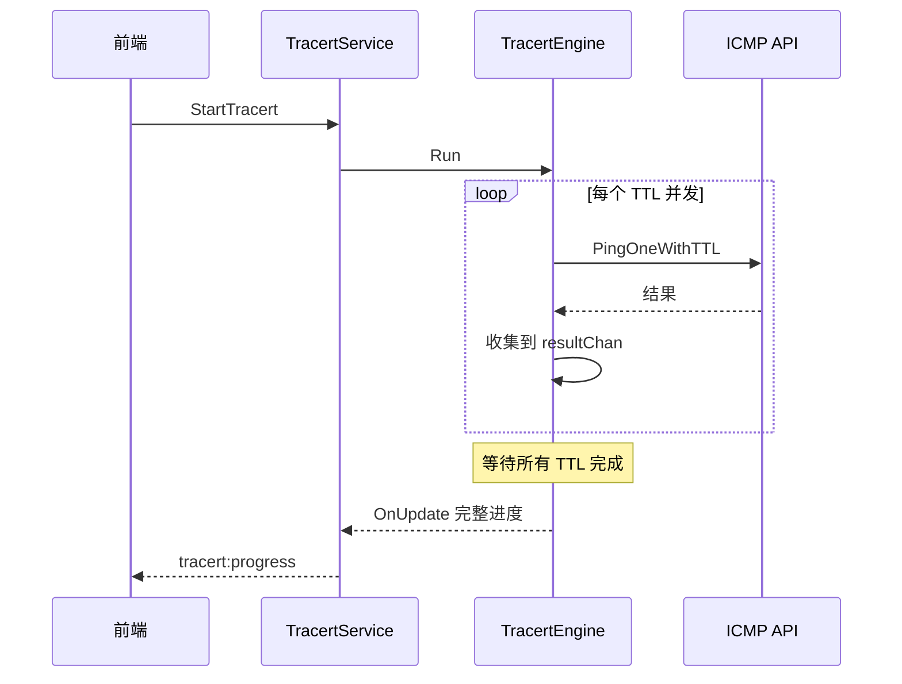
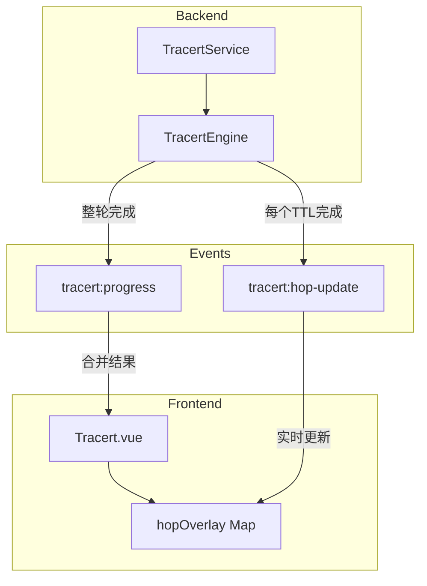
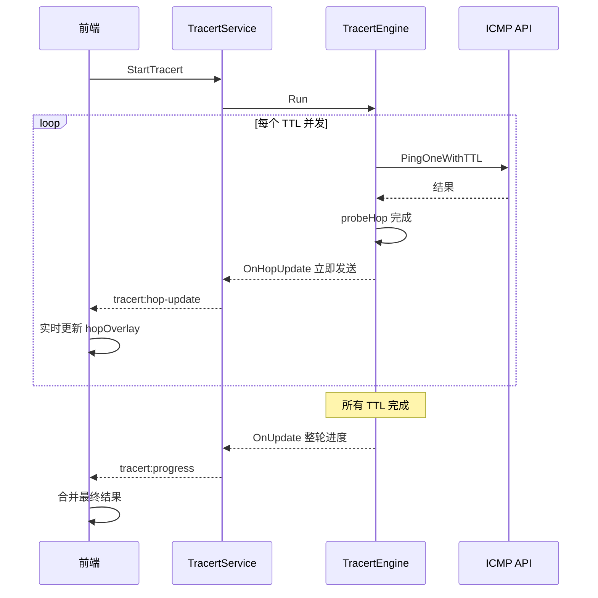
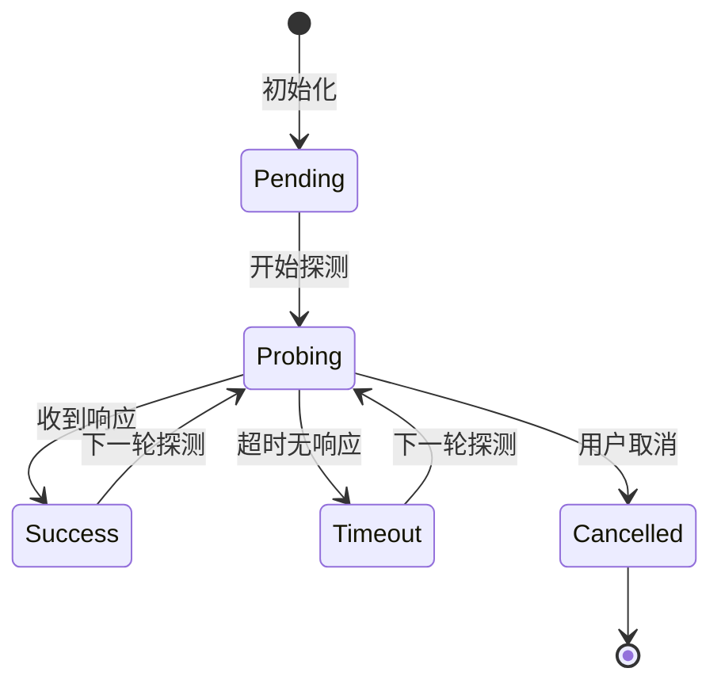
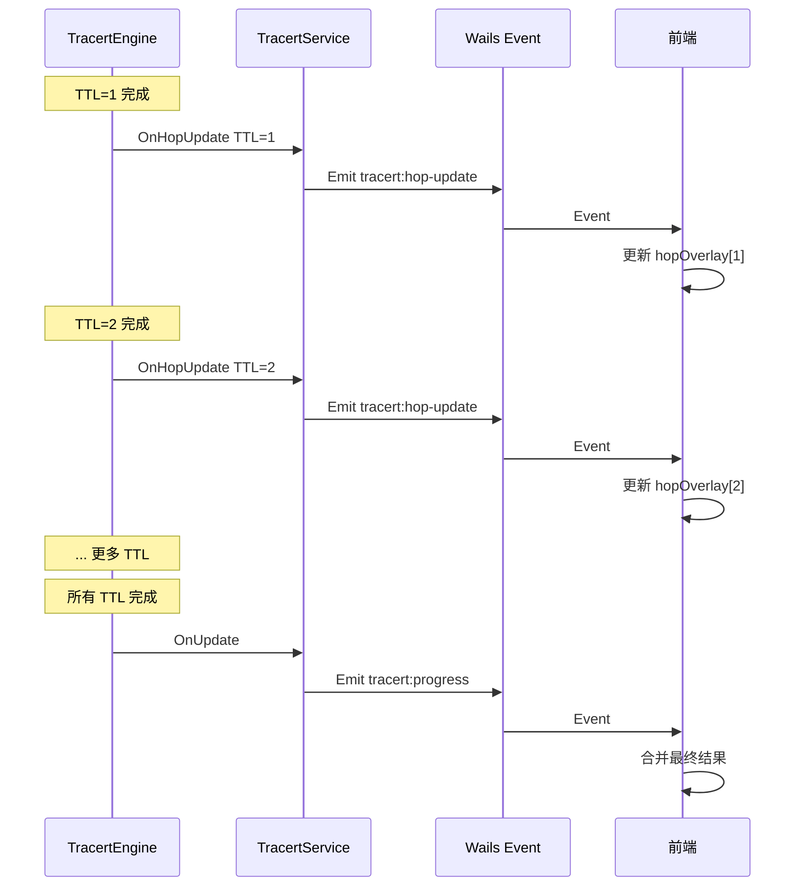
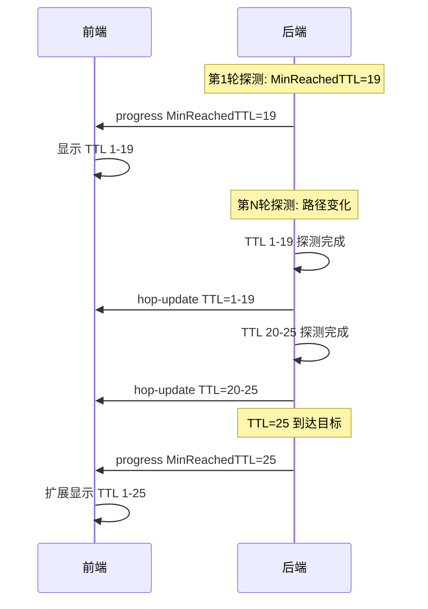
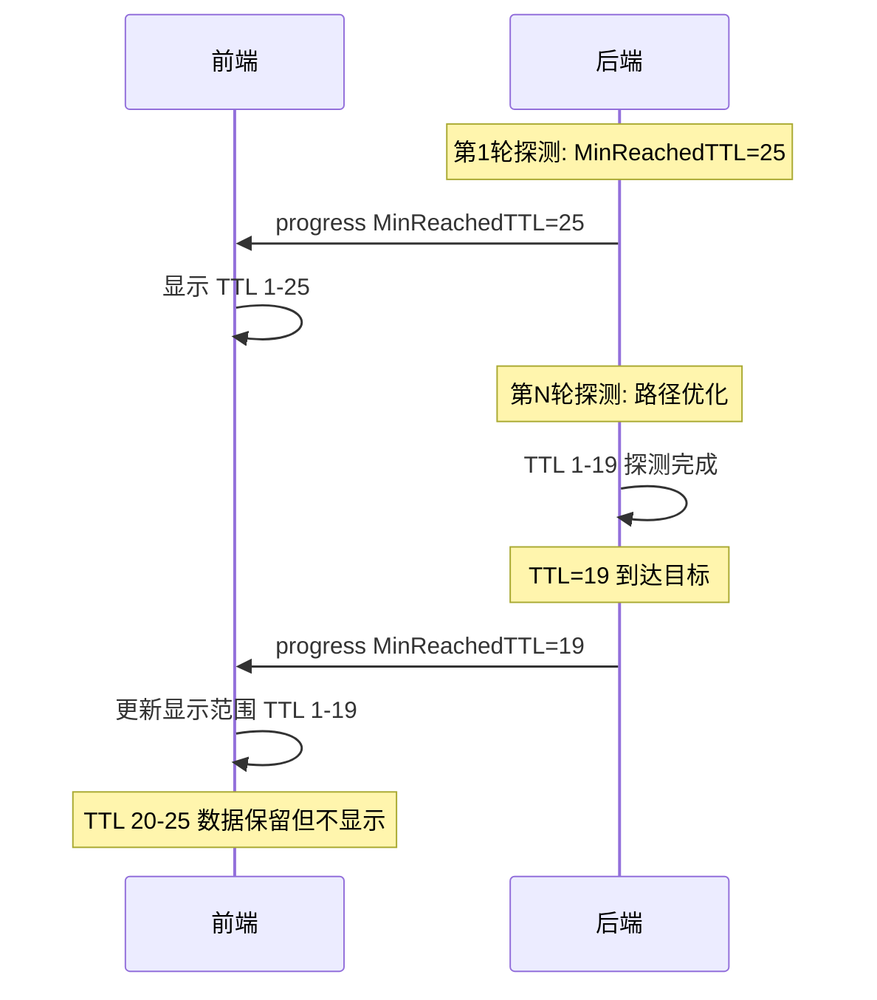
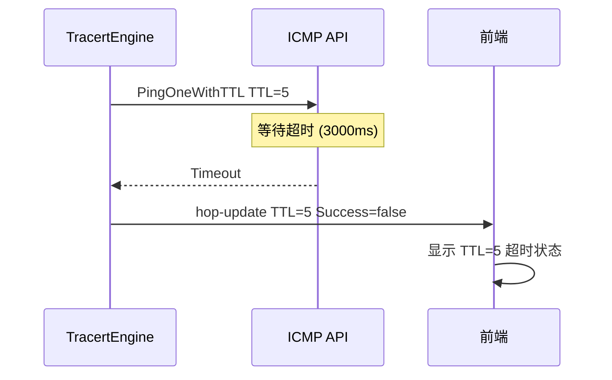
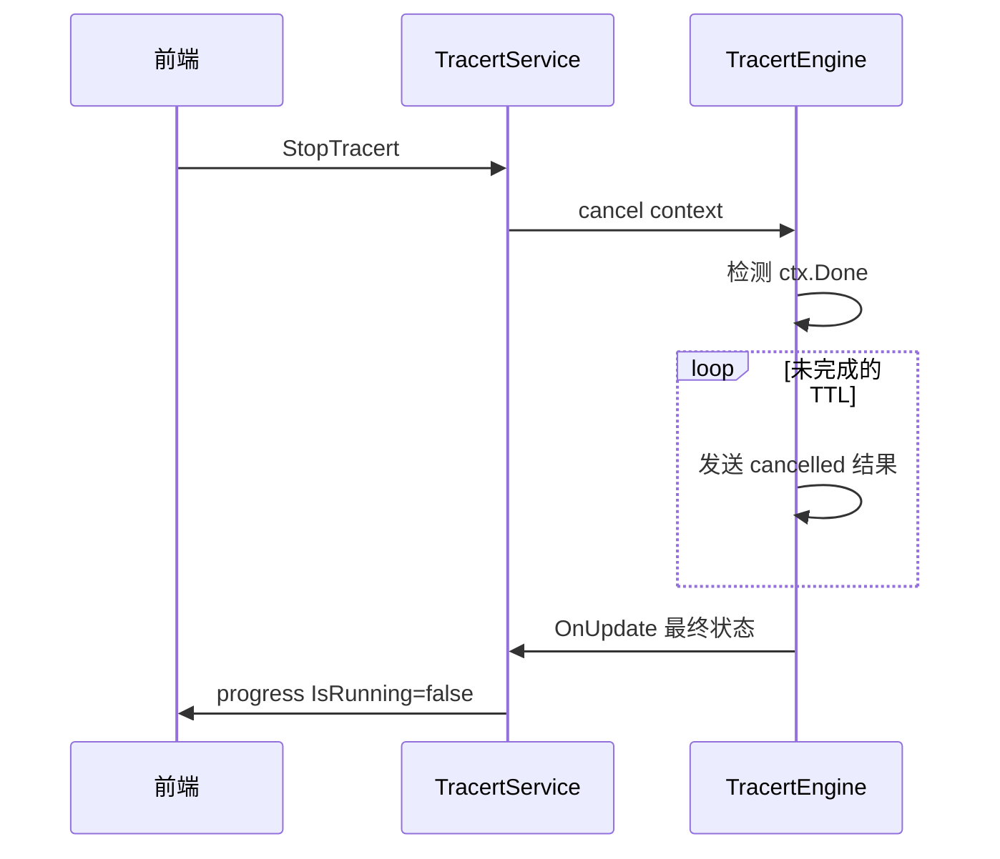

# Tracert 实时逐跳显示架构设计

> **版本**: v1.0  
> **日期**: 2026-05-02  
> **状态**: 设计阶段

---

## 一、问题分析

### 1.1 当前问题

当前 tracert 实现存在以下延迟问题：

| 问题 | 原因 | 影响 |
|------|------|------|
| 前端显示延迟约2秒 | 等待所有 TTL (1-30) 探测完成才发送更新 | 用户无法实时看到探测进度 |
| 无响应 TTL 等待时间长 | 需等待完整超时时间（默认3000ms） | 每轮探测最坏情况需 30×3s = 90s |
| 缺乏中间状态反馈 | 只在整轮完成后发送 `tracert:progress` | 用户无法感知探测进行中 |

### 1.2 当前架构分析



**关键发现**：

1. **事件发送时机**：当前只在 `runRound()` 完成后调用 `opts.OnUpdate`（第327-332行）
2. **已有回调机制**：`TracertRunOptions` 已定义 `OnHopUpdate` 回调，但未被充分利用
3. **前端已支持**：`Tracert.vue` 已订阅 `tracert:hop-update` 事件（第124行）

---

## 二、设计目标

### 2.1 核心目标

1. **实时逐跳显示**：每个 TTL 探测完成后立即发送更新到前端
2. **动态路径适应**：自动适应路径变化，支持跳数增减
3. **状态一致性**：后端维护完整状态，前端实时显示当前已知结果

### 2.2 性能指标

| 指标 | 当前 | 目标 |
|------|------|------|
| 首次显示延迟 | ~2s | <100ms（第一个 TTL 完成） |
| 单跳显示延迟 | 等待整轮 | TTL 完成即显示 |
| 超时跳显示 | 等待3000ms | 超时即显示 |

---

## 三、架构设计

### 3.1 整体架构



### 3.2 数据流设计



---

## 四、详细设计

### 4.1 后端修改

#### 4.1.1 TracertEngine 修改

**文件**: `internal/icmp/tracert_engine.go`

**修改点 1**: 在 `probeHop()` 中，每个 TTL 完成后立即调用 `OnHopUpdate`

当前代码（第437-446行）已实现，但需要确认调用时机正确：

```go
// 发送单跳更新
safeHopUpdateCallback(opts.OnHopUpdate, TracertHopUpdate{
    TTL:        ttl,
    IP:         "*",
    CurrentSeq: 1,
    Success:    false,
    RTT:        0,
    IsComplete: true,
    Timestamp:  time.Now().UnixMilli(),
})
```

**问题**：当前 `OnHopUpdate` 在 `probeHop()` 内部调用，但 `runRound()` 收集结果时没有实时发送到前端。

**修改点 2**: 在 `runRound()` 中，每收到一个 TTL 结果立即发送更新

修改位置：第295-301行

```go
// 当前代码：收集结果后不发送实时更新
for hopResult := range resultChan {
    if hopResult.TTL-1 < len(progress.Hops) {
        existing := &progress.Hops[hopResult.TTL-1]
        e.mergeHopResult(existing, hopResult)
    }
}

// 修改为：每收到一个结果立即发送 hop-update
for hopResult := range resultChan {
    if hopResult.TTL-1 < len(progress.Hops) {
        existing := &progress.Hops[hopResult.TTL-1]
        e.mergeHopResult(existing, hopResult)
        
        // 立即发送单跳更新
        if opts.OnHopUpdate != nil {
            safeHopUpdateCallback(opts.OnHopUpdate, TracertHopUpdate{
                TTL:        hopResult.TTL,
                IP:         existing.IP,
                CurrentSeq: progress.Round,
                Success:    existing.Status == "success",
                RTT:        existing.LastRtt,
                IsComplete: true,
                Timestamp:  time.Now().UnixMilli(),
            })
        }
    }
}
```

#### 4.1.2 TracertService 修改

**文件**: `internal/ui/tracert_service.go`

**修改点**: 确保 `emitHopUpdate` 正确发送事件

当前代码（第839-844行）已正确实现：

```go
func (s *TracertService) emitHopUpdate(update icmp.TracertHopUpdate) {
    if s.wailsApp != nil && s.wailsApp.Event != nil {
        s.wailsApp.Event.Emit("tracert:hop-update", update)
    }
}
```

**需要确认**：`runSingle()` 和 `runContinuous()` 中正确传递 `OnHopUpdate` 回调。

当前代码（第299-301行）已正确传递：

```go
OnHopUpdate: func(hu icmp.TracertHopUpdate) {
    s.emitHopUpdate(hu)
},
```

### 4.2 前端修改

#### 4.2.1 Tracert.vue 修改

**文件**: `frontend/src/views/Tools/Tracert.vue`

**修改点 1**: 优化 `applyHopUpdate()` 函数，支持新增跳数

当前代码（第142-180行）需要修改：

```typescript
const applyHopUpdate = (update: TracertHopUpdate) => {
  if (!progress.value) {
    // 初始化 progress 如果不存在
    progress.value = {
      target: '',
      resolvedIP: '',
      round: 0,
      totalHops: 30,
      completedHops: 0,
      isRunning: true,
      isContinuous: false,
      startTime: new Date().toISOString(),
      elapsedMs: 0,
      hops: [],
      reachedDest: false,
      minReachedTtl: 0
    }
  }

  // 确保 hops 数组足够大
  while (progress.value.hops.length < update.ttl) {
    progress.value.hops.push({
      ttl: progress.value.hops.length + 1,
      ip: '',
      hostName: '',
      status: 'pending',
      sentCount: 0,
      recvCount: 0,
      lossRate: 0,
      minRtt: -1,
      maxRtt: 0,
      avgRtt: 0,
      lastRtt: 0,
      reached: false,
      errorMsg: ''
    })
  }

  const hop = progress.value.hops[update.ttl - 1]
  if (!hop) return

  // 防乱序检查
  const overlay = hopOverlay.value.get(update.ttl)
  if (overlay && update.timestamp < overlay.lastUpdateTimestamp) {
    return
  }

  // 更新跳数状态
  if (update.success && update.rtt > 0) {
    if (hop.minRtt < 0 || update.rtt < hop.minRtt) {
      hop.minRtt = update.rtt
    }
    if (update.rtt > hop.maxRtt) {
      hop.maxRtt = update.rtt
    }
    hop.lastRtt = update.rtt
    hop.avgRtt = update.rtt // 单次探测时直接使用
  }

  if (update.ip && update.ip !== '*') {
    hop.ip = update.ip
  }

  // 标记状态
  hop.status = update.success ? 'success' : 'timeout'
  hop.sentCount = 1
  hop.recvCount = update.success ? 1 : 0
  hop.lossRate = update.success ? 0 : 100

  // 更新 overlay
  hopOverlay.value.set(update.ttl, {
    lastUpdateTimestamp: update.timestamp,
    status: update.isComplete ? 'completed' : 'probing',
  })

  // 触发响应式更新
  progress.value = { ...progress.value }
}
```

**修改点 2**: 添加动态路径适应逻辑

在 `handleProgressEvent()` 中处理路径变化：

```typescript
const handleProgressEvent = (ev: { name: string; data: TracertProgress }) => {
  lastProgressTime = Date.now()
  const incoming = ev.data

  if (!progress.value) {
    progress.value = incoming
    return
  }

  const current = progress.value

  // 更新顶层字段
  current.target = incoming.target
  current.resolvedIP = incoming.resolvedIP
  current.round = incoming.round
  current.totalHops = incoming.totalHops
  current.completedHops = incoming.completedHops
  current.isRunning = incoming.isRunning
  current.isContinuous = incoming.isContinuous
  current.elapsedMs = incoming.elapsedMs

  // 动态路径适应：处理 MinReachedTTL 变化
  const oldMinReachedTTL = current.minReachedTtl
  const newMinReachedTTL = incoming.minReachedTtl

  // 路径变长：MinReachedTTL 增大
  if (newMinReachedTTL > oldMinReachedTTL) {
    console.log(`[TRACERT] 路径变长: ${oldMinReachedTTL} -> ${newMinReachedTTL}`)
    // 确保 hops 数组足够大
    while (current.hops.length < incoming.hops.length) {
      current.hops.push({
        ttl: current.hops.length + 1,
        ip: '',
        hostName: '',
        status: 'pending',
        sentCount: 0,
        recvCount: 0,
        lossRate: 0,
        minRtt: -1,
        maxRtt: 0,
        avgRtt: 0,
        lastRtt: 0,
        reached: false,
        errorMsg: ''
      })
    }
  }

  // 路径变短：MinReachedTTL 减小
  if (newMinReachedTTL > 0 && newMinReachedTTL < oldMinReachedTTL) {
    console.log(`[TRACERT] 路径变短: ${oldMinReachedTTL} -> ${newMinReachedTTL}`)
    // 不删除历史数据，只更新显示范围
  }

  current.minReachedTtl = newMinReachedTTL
  current.reachedDest = incoming.reachedDest

  // 合并跳数数据
  if (incoming.hops) {
    for (let i = 0; i < incoming.hops.length; i++) {
      const incomingHop = incoming.hops[i]
      if (!incomingHop || incomingHop.status === 'pending') continue

      // 确保 hops 数组足够大
      while (current.hops.length <= i) {
        current.hops.push({
          ttl: current.hops.length + 1,
          ip: '',
          hostName: '',
          status: 'pending',
          sentCount: 0,
          recvCount: 0,
          lossRate: 0,
          minRtt: -1,
          maxRtt: 0,
          avgRtt: 0,
          lastRtt: 0,
          reached: false,
          errorMsg: ''
        })
      }

      // 检查 overlay，避免覆盖实时数据
      const overlay = hopOverlay.value.get(incomingHop.ttl)
      if (overlay && overlay.status === 'probing') {
        const currentHop = current.hops[i]
        if (currentHop) {
          currentHop.ip = incomingHop.ip || currentHop.ip
          currentHop.hostName = incomingHop.hostName || currentHop.hostName
          currentHop.reached = incomingHop.reached || currentHop.reached
        }
        continue
      }

      current.hops[i] = incomingHop
      hopOverlay.value.set(incomingHop.ttl, {
        lastUpdateTimestamp: Date.now(),
        status: 'completed',
      })
    }
  }

  progress.value = { ...current }
}
```

---

## 五、动态路径适应机制

### 5.1 场景分析

| 场景 | 描述 | 处理策略 |
|------|------|----------|
| 路径变长 | 从 19 跳变成 25 跳 | 扩展 hops 数组，新增 TTL 20-25 |
| 路径变短 | 从 25 跳变成 19 跳 | 保留历史数据，更新 MinReachedTTL |
| 路径波动 | 某些跳间歇性超时 | 累积统计，不删除历史数据 |
| 探测取消 | 用户中途取消 | 标记未完成 TTL 为 cancelled |

### 5.2 状态管理



### 5.3 MinReachedTTL 动态更新逻辑

```go
// 后端：TracertProgress.MinReachedTTL 更新逻辑
// 位置：internal/icmp/tracert_engine.go runRound()

// 每轮探测完成后更新 MinReachedTTL
if finalReachedTTL <= int32(maxHops) {
    progress.ReachedDest = true
    // 使用 CAS 原子操作更新最小 TTL
    for {
        oldMin := atomic.LoadInt32(&progress.MinReachedTTL)
        if oldMin > 0 && oldMin <= finalReachedTTL {
            break // 已有更小或相等的 TTL 记录
        }
        if atomic.CompareAndSwapInt32(&progress.MinReachedTTL, oldMin, finalReachedTTL) {
            break
        }
    }
}
```

### 5.4 前端显示逻辑

```typescript
// 前端：根据 MinReachedTTL 过滤显示
const displayResults = computed(() => {
  if (!progress.value?.hops) return []
  
  const minReachedTTL = progress.value.minReachedTtl
  
  return progress.value.hops
    .filter((hop) => {
      // 过滤 pending 状态
      if (hop.status === 'pending') return false
      
      // 如果已到达目标，只显示 TTL <= minReachedTTL
      if (minReachedTTL > 0 && hop.ttl > minReachedTTL) {
        return hop.status !== 'cancelled'
      }
      
      return true
    })
    .map((hop) => {
      const overlay = hopOverlay.value.get(hop.ttl)
      const isProbing = overlay && overlay.status === 'probing'
      return { ...hop, isProbing }
    })
})
```

---

## 六、事件设计

### 6.1 事件类型

| 事件名 | 触发时机 | 数据结构 | 用途 |
|--------|----------|----------|------|
| `tracert:hop-update` | 每个 TTL 完成时 | `TracertHopUpdate` | 实时更新单跳状态 |
| `tracert:progress` | 整轮探测完成时 | `TracertProgress` | 合并完整结果 |

### 6.2 TracertHopUpdate 结构

```go
type TracertHopUpdate struct {
    TTL        int     `json:"ttl"`        // 第几跳
    IP         string  `json:"ip"`         // 响应 IP
    CurrentSeq int     `json:"currentSeq"` // 当前探测序号 (1-based)
    Success    bool    `json:"success"`    // 本次是否成功
    RTT        float64 `json:"rtt"`        // 本次 RTT (ms)
    IsComplete bool    `json:"isComplete"` // 该跳是否全部完成
    Timestamp  int64   `json:"timestamp"`  // 更新时间戳 (Unix ms)
}
```

### 6.3 事件流图



---

## 七、边界情况处理

### 7.1 路径变长（19跳 → 25跳）

**场景**：网络路径变化，目标从 19 跳可达变成 25 跳可达

**处理流程**：



**关键代码**：

```typescript
// 前端：动态扩展 hops 数组
while (current.hops.length < incoming.hops.length) {
  current.hops.push({
    ttl: current.hops.length + 1,
    status: 'pending',
    // ... 其他初始值
  })
}
```

### 7.2 路径变短（25跳 → 19跳）

**场景**：网络路径优化，目标从 25 跳可达变成 19 跳可达

**处理流程**：



**关键代码**：

```typescript
// 前端：根据 MinReachedTTL 过滤显示
.filter((hop) => {
  if (minReachedTTL > 0 && hop.ttl > minReachedTTL) {
    return false // 不显示超过 MinReachedTTL 的跳数
  }
  return hop.status !== 'pending'
})
```

### 7.3 超时跳处理

**场景**：某个 TTL 无响应

**处理流程**：



**关键代码**：

```go
// 后端：超时处理
if result == nil {
    hop.Status = "timeout"
    hop.IP = "*"
    safeHopUpdateCallback(opts.OnHopUpdate, TracertHopUpdate{
        TTL:        ttl,
        IP:         "*",
        Success:    false,
        IsComplete: true,
        Timestamp:  time.Now().UnixMilli(),
    })
}
```

### 7.4 探测取消

**场景**：用户中途取消探测

**处理流程**：



**关键代码**：

```go
// 后端：取消处理
select {
case <-ctx.Done():
    resultChan <- TracertHopResult{
        TTL:    ttlVal,
        Status: "cancelled",
        MinRtt: -1,
    }
    return
}
```

### 7.5 事件乱序处理

**场景**：由于网络延迟，事件可能乱序到达

**处理策略**：使用时间戳防乱序

```typescript
// 前端：防乱序检查
const overlay = hopOverlay.value.get(update.ttl)
if (overlay && update.timestamp < overlay.lastUpdateTimestamp) {
    return // 丢弃过时的事件
}
```

---

## 八、测试要点

### 8.1 单元测试

| 测试项 | 测试内容 | 预期结果 |
|--------|----------|----------|
| `TestHopUpdateCallback` | 验证每个 TTL 完成后调用 OnHopUpdate | 回调被正确调用 |
| `TestMinReachedTTLUpdate` | 验证 MinReachedTTL 动态更新 | CAS 原子操作正确 |
| `TestPathLengthChange` | 验证路径变长/变短场景 | hops 数组正确扩展/过滤 |

### 8.2 集成测试

| 测试项 | 测试内容 | 预期结果 |
|--------|----------|----------|
| `TestRealtimeDisplay` | 验证前端实时显示 | hop-update 事件正确触发 UI 更新 |
| `TestEventOrdering` | 验证事件顺序 | 时间戳防乱序机制有效 |
| `TestCancellation` | 验证取消操作 | 未完成 TTL 正确标记为 cancelled |

### 8.3 性能测试

| 测试项 | 测试内容 | 预期结果 |
|--------|----------|----------|
| `TestEventThroughput` | 30个 TTL 并发发送事件 | 无事件丢失 |
| `TestMemoryUsage` | 长时间持续探测 | 内存不泄漏 |
| `TestUIResponsiveness` | 高频事件更新 | UI 不卡顿 |

### 8.4 边界测试

| 测试项 | 测试内容 | 预期结果 |
|--------|----------|----------|
| `TestAllTimeouts` | 所有 TTL 都超时 | 正确显示全部超时状态 |
| `TestImmediateReach` | TTL=1 即到达目标 | 正确处理短路径 |
| `TestMaxHops` | TTL 达到 MaxHops | 正确处理边界值 |

---

## 九、实施计划

### 9.1 修改清单

| 序号 | 文件 | 修改内容 | 优先级 |
|------|------|----------|--------|
| 1 | `internal/icmp/tracert_engine.go` | 在 `runRound()` 中添加实时 hop-update 发送 | P0 |
| 2 | `frontend/src/views/Tools/Tracert.vue` | 优化 `applyHopUpdate()` 支持动态扩展 | P0 |
| 3 | `frontend/src/views/Tools/Tracert.vue` | 添加路径变化处理逻辑 | P1 |
| 4 | `internal/icmp/tracert_engine.go` | 添加单元测试 | P1 |
| 5 | `frontend/src/views/Tools/Tracert.vue` | 添加集成测试 | P2 |

### 9.2 验证步骤

1. **功能验证**：
   - 启动 tracert 探测
   - 观察前端是否实时显示每个 TTL 结果
   - 验证路径变化时显示是否正确更新

2. **性能验证**：
   - 使用 Chrome DevTools 监控事件频率
   - 验证无事件丢失
   - 验证 UI 响应流畅

3. **边界验证**：
   - 测试取消操作
   - 测试全部超时场景
   - 测试路径剧烈变化

---

## 十、风险评估

| 风险 | 影响 | 缓解措施 |
|------|------|----------|
| 高频事件导致 UI 卡顿 | 用户体验下降 | 使用 requestAnimationFrame 批处理 |
| 事件乱序导致状态错误 | 显示数据不准确 | 使用时间戳防乱序 |
| 内存泄漏 | 长时间运行崩溃 | 定期清理 hopOverlay |
| 并发竞争 | 数据不一致 | 使用原子操作和互斥锁 |

---

## 十一、总结

本设计通过以下关键改进实现实时逐跳显示：

1. **事件驱动**：每个 TTL 完成后立即发送 `tracert:hop-update` 事件
2. **动态适应**：前端根据 `MinReachedTTL` 动态调整显示范围
3. **状态累积**：保留历史数据，支持多轮探测结果累积
4. **防乱序**：使用时间戳确保事件顺序正确

实施后，用户将能够在探测过程中实时看到每个跳数的结果，无需等待整轮探测完成。
