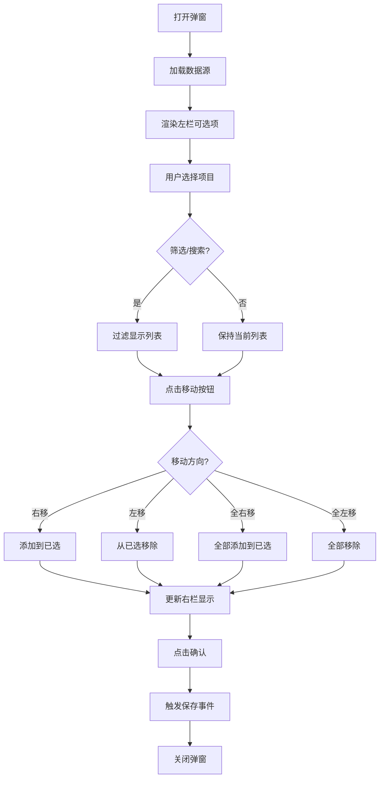
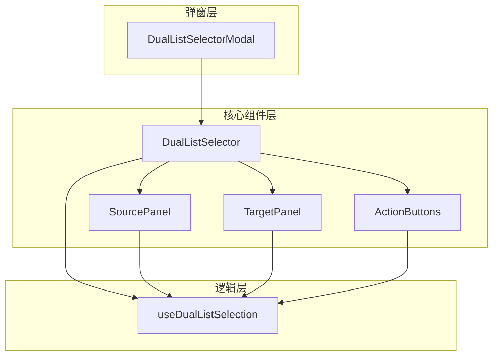

# 双列表选择器组件设计文档

## 1. 项目背景与需求分析

### 1.1 项目架构概述

- **技术栈**: Vue 3 + TypeScript + Tailwind CSS v4 + Pinia
- **UI风格**: 暗色/亮色双主题，现代化玻璃拟态设计
- **组件库**: 自定义组件体系，无第三方UI库依赖

### 1.2 功能需求

| 功能模块 | 需求描述                   | 优先级 |
| -------- | -------------------------- | ------ |
| 基础结构 | 左右双栏布局，中间操作按钮 | P0     |
| 数据展示 | 左栏可选项，右栏已选项     | P0     |
| 移动操作 | 单选移动、全选移动         | P0     |
| 筛选功能 | 分组筛选、标签筛选         | P1     |
| 搜索功能 | 模糊搜索支持               | P1     |
| 确认操作 | 保存选择结果               | P0     |

### 1.3 核心交互流程



---

## 2. 组件架构设计

### 2.1 组件结构

```
DualListSelector
├── DualListSelectorModal.vue    # 弹窗容器
├── DualListSelector.vue          # 核心选择器组件
│   ├── SourcePanel.vue           # 左栏-源数据面板
│   ├── TargetPanel.vue           # 右栏-目标数据面板
│   └── ActionButtons.vue         # 中间操作按钮组
├── composables
│   └── useDualListSelection.ts   # 选择逻辑组合式函数
└── types
    └── dualListSelector.ts       # 类型定义
```

### 2.2 组件关系图



---

## 3. 类型定义设计

### 3.1 基础类型

```typescript
// types/dualListSelector.ts

/** 列表项唯一标识类型 */
export type ItemKey = string | number;

/** 列表项基础接口 */
export interface ListItem {
  key: ItemKey;
  label: string;
  disabled?: boolean;
  [key: string]: any;
}

/** 分组数据接口 */
export interface GroupData {
  key: string;
  label: string;
  items: ListItem[];
}

/** 筛选配置 */
export interface FilterConfig {
  type: "group" | "tag" | "all";
  label: string;
  options?: { label: string; value: string; count?: number }[];
}

/** 选择器配置 */
export interface SelectorConfig {
  /** 是否支持分组显示 */
  enableGrouping: boolean;
  /** 是否支持标签筛选 */
  enableTagFilter: boolean;
  /** 是否启用搜索 */
  enableSearch: boolean;
  /** 搜索字段 */
  searchFields: string[];
  /** 左栏标题 */
  sourceTitle: string;
  /** 右栏标题 */
  targetTitle: string;
  /** 是否显示计数 */
  showCount: boolean;
  /** 最大选择数量 */
  maxSelection?: number;
  /** 弹窗标题 */
  modalTitle: string;
  /** 确认按钮文本 */
  confirmText: string;
  /** 取消按钮文本 */
  cancelText: string;
}

/** 选择器状态 */
export interface SelectorState {
  /** 当前筛选类型 */
  currentFilter: string;
  /** 当前筛选值 */
  filterValue: string;
  /** 搜索关键词 */
  searchKeyword: string;
  /** 左栏选中项 */
  sourceSelected: Set<ItemKey>;
  /** 右栏选中项 */
  targetSelected: Set<ItemKey>;
  /** 已选项目列表 */
  selectedItems: ListItem[];
}
```

### 3.2 Props接口

```typescript
// DualListSelector.vue Props
interface DualListSelectorProps {
  /** 是否显示弹窗 */
  visible: boolean;
  /** 源数据列表 */
  sourceData: ListItem[];
  /** 初始已选数据 */
  targetData?: ListItem[];
  /** 分组数据（可选） */
  groupData?: GroupData[];
  /** 标签数据（可选） */
  tagData?: { key: string; label: string }[];
  /** 组件配置 */
  config?: Partial<SelectorConfig>;
  /** 加载状态 */
  loading?: boolean;
}

// 默认配置
const defaultConfig: SelectorConfig = {
  enableGrouping: true,
  enableTagFilter: true,
  enableSearch: true,
  searchFields: ["label", "key"],
  sourceTitle: "可选项",
  targetTitle: "已选项",
  showCount: true,
  modalTitle: "选择项目",
  confirmText: "确认",
  cancelText: "取消",
};
```

### 3.3 Events接口

```typescript
// DualListSelector.vue Emits
interface DualListSelectorEmits {
  /** 更新显示状态 */
  (e: "update:visible", value: boolean): void;
  /** 确认选择 */
  (e: "confirm", items: ListItem[]): void;
  /** 取消选择 */
  (e: "cancel"): void;
  /** 选择变化 */
  (e: "change", items: ListItem[]): void;
}
```

---

## 4. 状态管理设计

### 4.1 Composable设计

```typescript
// composables/useDualListSelection.ts

import { ref, computed, type Ref } from "vue";
import type {
  ListItem,
  ItemKey,
  SelectorState,
  SelectorConfig,
} from "../types/dualListSelector";

export function useDualListSelection(
  sourceData: Ref<ListItem[]>,
  targetData: Ref<ListItem[]>,
  config: Ref<SelectorConfig>,
) {
  // ==================== State ====================

  /** 当前筛选类型 */
  const currentFilter = ref<string>("all");

  /** 当前筛选值 */
  const filterValue = ref<string>("");

  /** 搜索关键词 */
  const searchKeyword = ref<string>("");

  /** 左栏选中项 */
  const sourceSelected = ref<Set<ItemKey>>(new Set());

  /** 右栏选中项 */
  const targetSelected = ref<Set<ItemKey>>(new Set());

  // ==================== Computed ====================

  /** 过滤后的源数据 */
  const filteredSourceData = computed(() => {
    let result = sourceData.value;

    // 应用筛选
    if (currentFilter.value !== "all" && filterValue.value) {
      result = result.filter(
        (item) => item[currentFilter.value] === filterValue.value,
      );
    }

    // 应用搜索
    if (searchKeyword.value && config.value.enableSearch) {
      const keyword = searchKeyword.value.toLowerCase();
      result = result.filter((item) =>
        config.value.searchFields.some((field) =>
          String(item[field]).toLowerCase().includes(keyword),
        ),
      );
    }

    return result;
  });

  /** 已选项目（去重） */
  const selectedItems = computed(() => {
    const targetKeys = new Set(targetData.value.map((item) => item.key));
    return targetData.value.filter((item) => targetKeys.has(item.key));
  });

  /** 源数据统计 */
  const sourceStats = computed(() => ({
    total: sourceData.value.length,
    filtered: filteredSourceData.value.length,
    selected: sourceSelected.value.size,
  }));

  /** 目标数据统计 */
  const targetStats = computed(() => ({
    total: targetData.value.length,
    selected: targetSelected.value.size,
  }));

  /** 是否可右移 */
  const canMoveRight = computed(() => sourceSelected.value.size > 0);

  /** 是否可左移 */
  const canMoveLeft = computed(() => targetSelected.value.size > 0);

  /** 是否可全右移 */
  const canMoveAllRight = computed(() => filteredSourceData.value.length > 0);

  /** 是否可全左移 */
  const canMoveAllLeft = computed(() => targetData.value.length > 0);

  // ==================== Actions ====================

  /** 切换左栏选择 */
  const toggleSourceSelection = (key: ItemKey) => {
    if (sourceSelected.value.has(key)) {
      sourceSelected.value.delete(key);
    } else {
      sourceSelected.value.add(key);
    }
  };

  /** 切换右栏选择 */
  const toggleTargetSelection = (key: ItemKey) => {
    if (targetSelected.value.has(key)) {
      targetSelected.value.delete(key);
    } else {
      targetSelected.value.add(key);
    }
  };

  /** 右移选中项 */
  const moveRight = (): ListItem[] => {
    const itemsToMove = sourceData.value.filter((item) =>
      sourceSelected.value.has(item.key),
    );
    sourceSelected.value.clear();
    return itemsToMove;
  };

  /** 左移选中项 */
  const moveLeft = (): ItemKey[] => {
    const keysToRemove = Array.from(targetSelected.value);
    targetSelected.value.clear();
    return keysToRemove;
  };

  /** 全右移 */
  const moveAllRight = (): ListItem[] => {
    return filteredSourceData.value;
  };

  /** 全左移 */
  const moveAllLeft = (): ItemKey[] => {
    return targetData.value.map((item) => item.key);
  };

  /** 重置状态 */
  const resetState = () => {
    currentFilter.value = "all";
    filterValue.value = "";
    searchKeyword.value = "";
    sourceSelected.value.clear();
    targetSelected.value.clear();
  };

  /** 应用筛选 */
  const applyFilter = (type: string, value: string = "") => {
    currentFilter.value = type;
    filterValue.value = value;
    sourceSelected.value.clear();
  };

  return {
    // State
    currentFilter,
    filterValue,
    searchKeyword,
    sourceSelected,
    targetSelected,
    // Computed
    filteredSourceData,
    selectedItems,
    sourceStats,
    targetStats,
    canMoveRight,
    canMoveLeft,
    canMoveAllRight,
    canMoveAllLeft,
    // Actions
    toggleSourceSelection,
    toggleTargetSelection,
    moveRight,
    moveLeft,
    moveAllRight,
    moveAllLeft,
    resetState,
    applyFilter,
  };
}
```

---

## 5. UI布局与样式设计

### 5.1 整体布局

```
┌─────────────────────────────────────────────────────────────────┐
│  [标题]                                    [X] 关闭              │
├─────────────────────────────────────────────────────────────────┤
│                                                                 │
│  ┌──────────┐  ┌──────────┐  ┌──────────┐                      │
│  │ 筛选方式 │  │ 分组选择 │  │ 标签选择 │   [搜索框 🔍]         │
│  └──────────┘  └──────────┘  └──────────┘                      │
│                                                                 │
│  ┌─────────────────────┐    ┌──────────┐    ┌─────────────────┐│
│  │                     │    │  ▸ 右移  │    │                 ││
│  │   可选项 (42)       │    │  ◂ 左移  │    │   已选项 (8)    ││
│  │                     │    │ ⋙ 全右移 │    │                 ││
│  │ ┌───────────────┐   │    │ ⋘ 全左移 │    │ ┌─────────────┐ ││
│  │ │ ☑ Item 1      │   │    └──────────┘    │ │ ☑ Item A    │ ││
│  │ │ ☐ Item 2      │   │                      │ │ ☐ Item B    │ ││
│  │ │ ☐ Item 3      │   │                      │ └─────────────┘ ││
│  │ │ ...           │   │                      │                 ││
│  │ └───────────────┘   │                      │                 ││
│  │                     │                      │                 ││
│  └─────────────────────┘                      └─────────────────┘│
│                                                                 │
│  ┌─────────────────────────────────────────────────────────────┐│
│  │  提示: 已选择 8/42 项                                       ││
│  └─────────────────────────────────────────────────────────────┘│
│                                                                 │
│                                    [取消]  [确认]               │
└─────────────────────────────────────────────────────────────────┘
```

### 5.2 样式规范

基于项目现有设计体系，双列表选择器应遵循以下样式规范：

#### 颜色系统

| 用途     | CSS变量                       | 说明         |
| -------- | ----------------------------- | ------------ |
| 背景色   | `var(--color-bg-card)`        | 弹窗背景     |
| 面板背景 | `var(--color-bg-panel)`       | 列表面板背景 |
| 边框色   | `var(--color-border)`         | 默认边框     |
| 强调色   | `var(--color-accent-primary)` | 按钮、选中项 |
| 文字主色 | `var(--color-text-primary)`   | 主要文字     |
| 文字次色 | `var(--color-text-secondary)` | 次要文字     |
| 文字灰度 | `var(--color-text-muted)`     | 提示文字     |
| 悬停背景 | `var(--color-bg-hover)`       | 列表项悬停   |
| 选中背景 | `var(--color-accent-bg)`      | 选中项背景   |

#### 尺寸规范

| 元素         | 尺寸  | 说明       |
| ------------ | ----- | ---------- |
| 弹窗宽度     | 900px | 固定宽度   |
| 弹窗高度     | 600px | 最大高度   |
| 列表区域高度 | 350px | 固定高度   |
| 列表面板宽度 | 340px | 左右等宽   |
| 按钮区域宽度 | 80px  | 中间操作区 |
| 列表项高度   | 40px  | 单选项目   |
| 列表项间距   | 4px   | 项与项之间 |
| 圆角         | 8px   | 统一圆角   |
| 内边距       | 16px  | 标准内边距 |

### 5.3 组件样式实现

```vue
<!-- DualListSelector.vue 样式部分 -->
<style scoped>
.dual-list-selector {
  @apply flex flex-col h-full;
}

/* 筛选栏 */
.filter-bar {
  @apply flex items-center gap-4 p-4 bg-bg-panel/50 rounded-lg border border-border/50 mb-4;
}

/* 主内容区 */
.selector-content {
  @apply flex items-center justify-center gap-4 flex-1 min-h-0;
}

/* 列表面板 */
.list-panel {
  @apply flex flex-col w-[340px] h-[350px] bg-bg-panel border border-border rounded-lg overflow-hidden;
}

.list-panel-header {
  @apply flex items-center justify-between px-4 py-3 border-b border-border bg-bg-card;
}

.list-panel-title {
  @apply text-sm font-medium text-text-primary;
}

.list-panel-count {
  @apply text-xs text-text-muted bg-bg-secondary px-2 py-0.5 rounded-full;
}

.list-panel-body {
  @apply flex-1 overflow-y-auto scrollbar-custom p-2;
}

/* 列表项 */
.list-item {
  @apply flex items-center gap-3 px-3 py-2.5 rounded-md cursor-pointer transition-all duration-200;
  @apply hover:bg-bg-hover;
}

.list-item.selected {
  @apply bg-accent/5 border-l-2 border-l-accent;
}

.list-item.disabled {
  @apply opacity-50 cursor-not-allowed;
}

/* 操作按钮区域 */
.action-buttons {
  @apply flex flex-col items-center gap-3 w-[80px];
}

.action-btn {
  @apply w-10 h-10 flex items-center justify-center rounded-lg border transition-all duration-200;
  @apply bg-bg-card border-border text-text-secondary hover:text-accent hover:border-accent/50 hover:bg-accent/5;
}

.action-btn:disabled {
  @apply opacity-40 cursor-not-allowed hover:text-text-secondary hover:border-border hover:bg-bg-card;
}

.action-btn.primary {
  @apply bg-accent text-white border-accent hover:bg-accent/90;
}

/* 搜索框 */
.search-input {
  @apply w-48 px-3 py-1.5 text-sm rounded-md bg-bg-card border border-border text-text-primary placeholder:text-text-muted;
  @apply focus:outline-none focus:border-accent/50 transition-all;
}

/* 底部信息栏 */
.footer-info {
  @apply flex items-center justify-between px-4 py-3 mt-4 bg-bg-panel/50 rounded-lg border border-border/50;
}

/* 底部按钮 */
.footer-actions {
  @apply flex items-center justify-end gap-3 mt-4;
}

.btn-cancel {
  @apply px-4 py-2 text-sm font-medium text-text-secondary bg-bg-panel border border-border rounded-lg hover:bg-bg-hover transition-colors;
}

.btn-confirm {
  @apply px-4 py-2 text-sm font-medium text-white bg-accent rounded-lg hover:bg-accent/90 transition-colors;
}
</style>
```

---

## 6. 核心组件实现

### 6.1 主组件模板

```vue
<!-- DualListSelector.vue -->
<template>
  <Teleport to="body">
    <Transition name="modal">
      <div
        v-if="visible"
        class="fixed inset-0 z-50 flex items-center justify-center"
        @keydown.esc="handleCancel"
      >
        <!-- 遮罩层 -->
        <div
          class="absolute inset-0 bg-black/60 backdrop-blur-sm"
          @click="handleCancel"
        ></div>

        <!-- 弹窗主体 -->
        <div
          class="relative w-[900px] max-h-[90vh] bg-bg-card border border-border rounded-2xl shadow-2xl flex flex-col overflow-hidden"
        >
          <!-- 头部 -->
          <div
            class="flex items-center justify-between px-6 py-4 border-b border-border bg-bg-panel"
          >
            <h3 class="text-base font-semibold text-text-primary">
              {{ config.modalTitle }}
            </h3>
            <button
              @click="handleCancel"
              class="p-2 rounded-lg text-text-muted hover:text-text-primary hover:bg-bg-secondary transition-colors"
            >
              <svg
                class="w-5 h-5"
                viewBox="0 0 24 24"
                fill="none"
                stroke="currentColor"
                stroke-width="2"
              >
                <path d="M18 6L6 18M6 6l12 12" />
              </svg>
            </button>
          </div>

          <!-- 内容区 -->
          <div class="flex-1 p-6 overflow-hidden">
            <!-- 筛选栏 -->
            <div class="filter-bar">
              <div class="flex items-center gap-3">
                <span
                  class="text-xs font-medium text-text-muted uppercase tracking-wider"
                  >筛选方式:</span
                >
                <div class="flex gap-1.5">
                  <button
                    v-for="filter in filterOptions"
                    :key="filter.value"
                    @click="applyFilter(filter.value)"
                    :class="[
                      'px-2.5 py-1.5 text-xs font-medium rounded-md border transition-all duration-200',
                      currentFilter === filter.value
                        ? 'bg-accent border-accent text-white shadow-sm'
                        : 'bg-bg-card border-border text-text-muted hover:text-text-primary hover:border-accent/30',
                    ]"
                  >
                    {{ filter.label }}
                  </button>
                </div>
              </div>

              <!-- 分组/标签选择 -->
              <div
                v-if="showSubFilter"
                class="flex items-center gap-3 pl-4 border-l border-border/50"
              >
                <span class="text-xs font-medium text-text-muted"
                  >{{ subFilterLabel }}:</span
                >
                <select
                  v-model="filterValue"
                  class="px-3 py-1.5 rounded-md bg-bg-card border border-border text-xs text-text-primary focus:outline-none focus:border-accent/50 min-w-[120px]"
                >
                  <option value="">全部</option>
                  <option
                    v-for="opt in subFilterOptions"
                    :key="opt.value"
                    :value="opt.value"
                  >
                    {{ opt.label }} ({{ opt.count }})
                  </option>
                </select>
              </div>

              <!-- 搜索框 -->
              <div class="flex-1 flex justify-end">
                <div class="relative">
                  <input
                    v-model="searchKeyword"
                    type="text"
                    placeholder="搜索..."
                    class="search-input pl-9"
                  />
                  <svg
                    class="absolute left-3 top-1/2 -translate-y-1/2 w-4 h-4 text-text-muted"
                    viewBox="0 0 24 24"
                    fill="none"
                    stroke="currentColor"
                    stroke-width="2"
                  >
                    <circle cx="11" cy="11" r="8" />
                    <path d="m21 21-4.35-4.35" />
                  </svg>
                </div>
              </div>
            </div>

            <!-- 主选择区 -->
            <div class="selector-content">
              <!-- 左栏 -->
              <SourcePanel
                :title="config.sourceTitle"
                :items="filteredSourceData"
                :selected="sourceSelected"
                :stats="sourceStats"
                @toggle="toggleSourceSelection"
              />

              <!-- 操作按钮 -->
              <ActionButtons
                :can-move-right="canMoveRight"
                :can-move-left="canMoveLeft"
                :can-move-all-right="canMoveAllRight"
                :can-move-all-left="canMoveAllLeft"
                @move-right="handleMoveRight"
                @move-left="handleMoveLeft"
                @move-all-right="handleMoveAllRight"
                @move-all-left="handleMoveAllLeft"
              />

              <!-- 右栏 -->
              <TargetPanel
                :title="config.targetTitle"
                :items="targetData"
                :selected="targetSelected"
                :stats="targetStats"
                @toggle="toggleTargetSelection"
              />
            </div>

            <!-- 底部信息 -->
            <div class="footer-info">
              <span class="text-sm text-text-secondary">
                已选择
                <span class="font-semibold text-accent">{{
                  targetData.length
                }}</span>
                / {{ sourceData.length }} 项
              </span>
              <span v-if="config.maxSelection" class="text-xs text-text-muted">
                最多可选择 {{ config.maxSelection }} 项
              </span>
            </div>
          </div>

          <!-- 底部按钮 -->
          <div
            class="footer-actions px-6 py-4 border-t border-border bg-bg-panel"
          >
            <button class="btn-cancel" @click="handleCancel">
              {{ config.cancelText }}
            </button>
            <button class="btn-confirm" @click="handleConfirm">
              {{ config.confirmText }}
            </button>
          </div>
        </div>
      </div>
    </Transition>
  </Teleport>
</template>
```

### 6.2 子组件设计

#### SourcePanel.vue / TargetPanel.vue

```vue
<template>
  <div class="list-panel">
    <!-- 头部 -->
    <div class="list-panel-header">
      <span class="list-panel-title">{{ title }}</span>
      <span class="list-panel-count">{{ items.length }}</span>
    </div>

    <!-- 列表 -->
    <div class="list-panel-body scrollbar-custom">
      <div
        v-for="item in items"
        :key="item.key"
        @click="!item.disabled && $emit('toggle', item.key)"
        :class="[
          'list-item',
          {
            selected: selected.has(item.key),
            disabled: item.disabled,
          },
        ]"
      >
        <!-- 复选框 -->
        <div
          :class="[
            'w-4 h-4 rounded border flex items-center justify-center transition-colors',
            selected.has(item.key)
              ? 'bg-accent border-accent'
              : 'border-border',
          ]"
        >
          <svg
            v-if="selected.has(item.key)"
            class="w-3 h-3 text-white"
            viewBox="0 0 24 24"
            fill="none"
            stroke="currentColor"
            stroke-width="3"
          >
            <polyline points="20 6 9 17 4 12" />
          </svg>
        </div>

        <!-- 内容 -->
        <div class="flex-1 min-w-0">
          <div class="text-sm text-text-primary truncate">{{ item.label }}</div>
          <div v-if="item.description" class="text-xs text-text-muted truncate">
            {{ item.description }}
          </div>
        </div>

        <!-- 标签 -->
        <div v-if="item.tags?.length" class="flex gap-1">
          <span
            v-for="tag in item.tags"
            :key="tag"
            class="text-[10px] px-1.5 py-0.5 rounded bg-accent/10 text-accent"
          >
            {{ tag }}
          </span>
        </div>
      </div>

      <!-- 空状态 -->
      <div
        v-if="items.length === 0"
        class="flex flex-col items-center justify-center h-full text-text-muted"
      >
        <svg
          class="w-12 h-12 mb-2 opacity-30"
          viewBox="0 0 24 24"
          fill="none"
          stroke="currentColor"
          stroke-width="1"
        >
          <rect x="3" y="3" width="18" height="18" rx="2" />
          <path d="M9 12l2 2 4-4" />
        </svg>
        <span class="text-sm">暂无数据</span>
      </div>
    </div>
  </div>
</template>
```

#### ActionButtons.vue

```vue
<template>
  <div class="action-buttons">
    <button
      class="action-btn primary"
      :disabled="!canMoveRight"
      @click="$emit('move-right')"
      title="右移"
    >
      <svg
        class="w-5 h-5"
        viewBox="0 0 24 24"
        fill="none"
        stroke="currentColor"
        stroke-width="2"
      >
        <path d="M9 18l6-6-6-6" />
      </svg>
    </button>

    <button
      class="action-btn primary"
      :disabled="!canMoveLeft"
      @click="$emit('move-left')"
      title="左移"
    >
      <svg
        class="w-5 h-5"
        viewBox="0 0 24 24"
        fill="none"
        stroke="currentColor"
        stroke-width="2"
      >
        <path d="M15 18l-6-6 6-6" />
      </svg>
    </button>

    <div class="w-full h-px bg-border my-1"></div>

    <button
      class="action-btn"
      :disabled="!canMoveAllRight"
      @click="$emit('move-all-right')"
      title="全右移"
    >
      <svg
        class="w-5 h-5"
        viewBox="0 0 24 24"
        fill="none"
        stroke="currentColor"
        stroke-width="2"
      >
        <path d="M13 5l7 7-7 7M5 5l7 7-7 7" />
      </svg>
    </button>

    <button
      class="action-btn"
      :disabled="!canMoveAllLeft"
      @click="$emit('move-all-left')"
      title="全左移"
    >
      <svg
        class="w-5 h-5"
        viewBox="0 0 24 24"
        fill="none"
        stroke="currentColor"
        stroke-width="2"
      >
        <path d="M11 19l-7-7 7-7M19 19l-7-7 7-7" />
      </svg>
    </button>
  </div>
</template>
```

---

## 7. 使用示例

### 7.1 基础用法

```vue
<template>
  <div>
    <button @click="showSelector = true">打开选择器</button>

    <DualListSelector
      v-model:visible="showSelector"
      :source-data="deviceList"
      :target-data="selectedDevices"
      :config="selectorConfig"
      @confirm="handleConfirm"
    />
  </div>
</template>

<script setup lang="ts">
import { ref } from "vue";
import { DualListSelector } from "@/components/common/DualListSelector";
import type {
  ListItem,
  SelectorConfig,
} from "@/components/common/DualListSelector/types";

const showSelector = ref(false);

const deviceList: ListItem[] = [
  { key: "1", label: "Router-01", group: "core", tags: ["华为", "核心"] },
  { key: "2", label: "Switch-01", group: "access", tags: ["H3C", "接入"] },
  { key: "3", label: "Firewall-01", group: "security", tags: ["思科", "安全"] },
  // ...
];

const selectedDevices = ref<ListItem[]>([]);

const selectorConfig: Partial<SelectorConfig> = {
  modalTitle: "选择设备",
  sourceTitle: "可用设备",
  targetTitle: "已选设备",
  enableSearch: true,
  enableGrouping: true,
  enableTagFilter: true,
  searchFields: ["label", "key"],
  maxSelection: 50,
};

const handleConfirm = (items: ListItem[]) => {
  selectedDevices.value = items;
  console.log("已选择:", items);
};
</script>
```

### 7.2 带分组数据用法

```vue
<template>
  <DualListSelector
    v-model:visible="showSelector"
    :source-data="allCommands"
    :target-data="selectedCommands"
    :group-data="commandGroups"
    :config="config"
    @confirm="handleConfirm"
  />
</template>

<script setup lang="ts">
const commandGroups = [
  {
    key: "system",
    label: "系统命令",
    items: [
      { key: "sys-1", label: "display version" },
      { key: "sys-2", label: "display clock" },
    ],
  },
  {
    key: "interface",
    label: "接口命令",
    items: [
      { key: "if-1", label: "display interface" },
      { key: "if-2", label: "display ip interface" },
    ],
  },
];

const config = {
  currentFilter: "group", // 默认按分组筛选
};
</script>
```

---

## 8. 文件目录结构

```
frontend/src/components/common/DualListSelector/
├── index.ts                      # 入口导出
├── DualListSelectorModal.vue     # 弹窗容器组件
├── DualListSelector.vue          # 主选择器组件
├── components/
│   ├── SourcePanel.vue           # 源数据面板
│   ├── TargetPanel.vue           # 目标数据面板
│   └── ActionButtons.vue         # 操作按钮组
├── composables/
│   └── useDualListSelection.ts   # 选择逻辑组合式函数
├── types/
│   └── dualListSelector.ts       # 类型定义
└── README.md                     # 组件使用说明
```

---

## 9. 性能优化建议

### 9.1 大数据量处理

| 场景          | 优化策略                            |
| ------------- | ----------------------------------- |
| 数据量 > 1000 | 使用虚拟滚动 (vue-virtual-scroller) |
| 频繁筛选      | 使用 computed + 防抖                |
| 搜索输入      | 300ms 防抖延迟                      |
| 全量移动      | 使用 Set 进行 O(1) 查找             |

### 9.2 渲染优化

```typescript
// 使用 v-memo 优化列表渲染
<div v-for="item in items" :key="item.key" v-memo="[selected.has(item.key)]">
  <!-- 列表项内容 -->
</div>

// 使用 shallowRef 避免深层响应式开销
const sourceData = shallowRef<ListItem[]>([]);
```

---

## 10. 扩展性设计

### 10.1 可扩展点

| 扩展点       | 实现方式                 |
| ------------ | ------------------------ |
| 自定义列表项 | 支持 scoped slot         |
| 自定义筛选   | 支持传入 filter function |
| 拖拽排序     | 右栏支持拖拽排序         |
| 分页加载     | 左栏支持虚拟滚动 + 分页  |

### 10.2 Slot 设计

```vue
<!-- 自定义列表项 -->
<DualListSelector>
  <template #source-item="{ item, selected }">
    <div class="custom-item">
      <DeviceIcon :type="item.type" />
      <span>{{ item.label }}</span>
      <StatusBadge :status="item.status" />
    </div>
  </template>
</DualListSelector>
```

---

## 11. 总结

本文档详细规划了双列表选择器组件的设计方案，包括：

1. **架构设计**: 采用分层架构，逻辑与视图分离
2. **状态管理**: 使用 Composable 封装选择逻辑，便于复用
3. **样式规范**: 严格遵循项目现有设计体系
4. **类型安全**: 完整的 TypeScript 类型定义
5. **扩展性**: 预留 Slot 和配置接口，支持灵活扩展

该组件可广泛应用于设备选择、命令选择、标签选择等多种场景。
