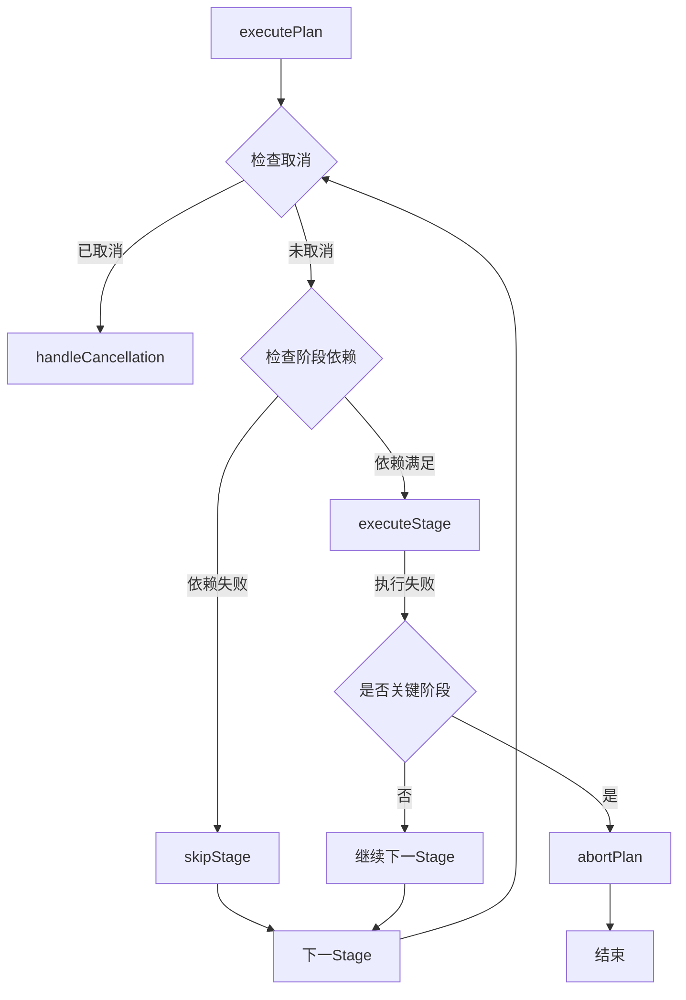

# NetWeaverGo 架构修复方案评估报告

**评估日期**: 2026-03-26  
**评估范围**: `architecture_fix_proposal.md` 中提出的修复方案  
**评估方法**: 源代码走查 + 方案可行性分析

---

## 一、问题真实性验证汇总

| 问题编号 | 问题描述                                      | 核查结果      | 修复方案必要性 |
| -------- | --------------------------------------------- | ------------- | -------------- |
| #1       | EventBus.EmitSync与SnapshotHub.invalidate死锁 | ❌ 问题不存在 | 无需修复       |
| #2       | RuntimeManager.Stop与executePlan竞态          | ❌ 问题不存在 | 无需修复       |
| #3       | 拓扑任务阶段间无依赖检查                      | ✅ 真实存在   | **需要修复**   |
| #4       | Stage错误后继续执行                           | ✅ 真实存在   | **需要修复**   |
| #5       | 取消操作未传播到SSH层                         | ⚠️ 部分存在   | **需要修复**   |
| #6       | goroutine生命周期管理不完整                   | ✅ 真实存在   | **需要修复**   |
| #7       | SSH连接未显式关闭                             | ✅ 真实存在   | **需要修复**   |
| #8       | 错误处理不一致                                | ✅ 真实存在   | **需要修复**   |
| #9       | 拓扑边ID生成可能冲突                          | ✅ 真实存在   | **需要修复**   |

---

## 二、各问题修复方案详细评估

### 问题 #3: 拓扑任务阶段间无依赖检查

#### 源代码验证

查看 [`topology_compiler.go:96-124`](internal/taskexec/topology_compiler.go:96)：

```go
func (c *TopologyTaskCompiler) buildParseStage(config *TopologyTaskConfig) StagePlan {
    units := make([]UnitPlan, 0, len(config.DeviceIPs))
    for _, deviceIP := range config.DeviceIPs {
        units = append(units, UnitPlan{...})  // 为所有设备创建 Unit
    }
    // 不检查采集阶段结果
}
```

#### 方案评估

| 方案                             | 优点                     | 缺点                                  | 建议        |
| -------------------------------- | ------------------------ | ------------------------------------- | ----------- |
| 方案A: 运行时动态过滤            | 编译时声明依赖，架构清晰 | 需修改 ExecutionPlan 结构，影响范围大 | ⚠️ 复杂度高 |
| 方案B: ParseExecutor检查前置条件 | 修改范围小，实现简单     | 运行时检查，有轻微性能开销            | ✅ **推荐** |

#### 改进建议

1. **采用方案B**，在 [`ParseExecutor.executeParse`](internal/taskexec/executor_impl.go) 中添加采集结果检查
2. 新增 `UnitStatusSkipped` 状态到 [`status.go`](internal/taskexec/status.go)
3. 检查逻辑应查询 `TaskRawOutput` 表确认采集成功

#### 代码示例改进

```go
// 建议的检查逻辑
func (e *ParseExecutor) executeParse(ctx RuntimeContext, stageID string, unit *UnitPlan) error {
    deviceIP := unit.Target.Key

    // 检查采集阶段是否成功
    var collectOutput TaskRawOutput
    err := e.db.Where("task_run_id = ? AND device_ip = ? AND status = ?",
        ctx.RunID(), deviceIP, "success").First(&collectOutput).Error
    if err != nil {
        // 采集失败，跳过解析
        skippedStatus := string(UnitStatusSkipped)
        reason := "采集阶段未成功完成"
        finishedAt := time.Now()
        _ = ctx.UpdateUnit(unit.ID, &UnitPatch{
            Status:       &skippedStatus,
            ErrorMessage: &reason,
            FinishedAt:   &finishedAt,
        })
        return nil  // 不中断 Stage 执行
    }
    // 继续正常解析...
}
```

**评估结论**: ✅ 方案合理，建议采用方案B

---

### 问题 #4: Stage 错误后继续执行

#### 源代码验证

查看 [`runtime.go:304-322`](internal/taskexec/runtime.go:304)：

```go
for i, stagePlan := range plan.Stages {
    if runtimeCtx.IsCancelled() {
        m.handleCancellation(runtimeCtx, run.ID)
        return
    }

    // 执行Stage
    if err := m.executeStage(runtimeCtx, run.ID, &stagePlan, i, len(plan.Stages)); err != nil {
        m.handleStageError(runtimeCtx, run.ID, stagePlan.ID, err)
        // ⚠️ 继续执行下一个Stage，没有中止
    }
    m.refreshRunProgress(runtimeCtx, run.ID)
}
```

#### 方案评估

修复方案提出：

1. 添加 `StageDependencies` 声明阶段依赖
2. 添加 `checkStageDependencies` 检查依赖阶段结果
3. 添加 `skipStage` 和 `abortPlan` 方法
4. 新增 `StageStatusSkipped` 和 `RunStatusAborted` 状态

#### 改进建议

1. **ExecutionPlan 结构需要扩展**：当前 [`ExecutionPlan`](internal/taskexec/models.go:14) 没有 `StageDependencies` 字段，需要添加
2. **状态常量需要添加**：在 [`status.go`](internal/taskexec/status.go) 中添加新状态
3. **事件类型需要添加**：在 [`eventbus.go`](internal/taskexec/eventbus.go) 中添加新事件类型

#### 架构影响分析



**评估结论**: ✅ 方案合理，需要完整实现

---

### 问题 #5: 取消操作未传播到 SSH 层

#### 源代码验证

查看 [`executor_impl.go:54-91`](internal/taskexec/executor_impl.go:54)：

```go
for _, unit := range stage.Units {
    if ctx.IsCancelled() {
        break  // 只在循环开始检查
    }
    go func(u UnitPlan) {
        // executeUnit 内部不检查取消
        if err := e.executeUnit(ctx, stage.ID, &u); err != nil {...}
    }(unit)
}
```

查看 [`stream_engine.go:156-159`](internal/executor/stream_engine.go:156)：

```go
case <-ctx.Done():
    e.adapter.MarkFailed("上下文取消")
    return e.adapter.Results(), ctx.Err()
```

StreamEngine 已经支持 context 取消，但上层调用链不完整。

#### 方案评估

修复方案提出三层修复：

1. 在 goroutine 中监听取消状态
2. 在 StreamEngine 中支持可中断的 SSH 操作
3. 在 DeviceExecutor 中支持取消

#### 改进建议

1. **简化方案**：StreamEngine 已支持 context 取消，关键是确保 context 正确传递
2. **interruptSession 方法需谨慎**：发送 `SIGINT` 可能不适用于所有厂商设备
3. **建议优先实现**：在 goroutine 中使用 `select` 监听 `ctx.Done()`

#### 推荐实现

```go
// 简化的取消传播方案
go func(u UnitPlan) {
    defer wg.Done()
    defer func() { <-semaphore }()

    done := make(chan error, 1)
    go func() {
        done <- e.executeUnit(ctx, stage.ID, &u)
    }()

    select {
    case err := <-done:
        // 正常完成
        if err != nil {
            mu.Lock()
            failedCount++
            mu.Unlock()
        } else {
            mu.Lock()
            completedCount++
            mu.Unlock()
        }
    case <-ctx.Context().Done():
        // 被取消，executeUnit 可能仍在运行
        // 但 StreamEngine 会响应 context 取消
        logger.Warn("TaskExec", ctx.RunID(), "Unit %s 被取消", u.ID)
        mu.Lock()
        failedCount++
        mu.Unlock()
    }
}(unit)
```

**评估结论**: ⚠️ 方案过于复杂，建议简化

---

### 问题 #6: goroutine 生命周期管理不完整

#### 源代码验证

查看 [`eventbus.go:169-176`](internal/taskexec/eventbus.go:169)：

```go
func (b *EventBus) Start() {
    go b.dispatchLoop()  // 启动 goroutine
}

func (b *EventBus) Stop() {
    b.cancel()  // 只取消 context，没有等待
}
```

#### 方案评估

修复方案提出：

1. 添加 `sync.WaitGroup` 跟踪 goroutine
2. 在 `Stop()` 中等待 goroutine 退出
3. 添加超时保护

#### 改进建议

方案合理，但需要注意：

1. `dispatchLoop` 中的 handler 调用是异步的（使用 `go func()`），需要考虑这些 handler 是否也需要等待
2. 超时时间 5 秒是否合理，建议可配置

**评估结论**: ✅ 方案合理

---

### 问题 #7: SSH 连接未显式关闭

#### 源代码验证

查看 [`executor_impl.go:172-178`](internal/taskexec/executor_impl.go:172)：

```go
exec := executor.NewDeviceExecutor(
    device.IP, device.Port, device.Username, device.Password, opts,
)
// ⚠️ 没有 defer exec.Close()

if err := exec.Connect(execCtx, connTimeout); err != nil {
    return err  // 连接失败时没有资源泄漏
}
// 执行命令后函数返回，连接未关闭
```

#### 方案评估

修复方案简单直接：添加 `defer exec.Close()`

#### 改进建议

1. **需要在创建 executor 后立即添加 defer**
2. **Close 方法已存在**：查看 [`executor.go`](internal/executor/executor.go) 确认 `Close()` 方法存在
3. **建议同时添加日志**：记录连接关闭事件

```go
exec := executor.NewDeviceExecutor(...)
defer func() {
    if exec != nil {
        exec.Close()
        logger.Debug("TaskExec", ctx.RunID(), "关闭设备 %s 的连接", deviceIP)
    }
}()
```

**评估结论**: ✅ 方案合理，优先级应提升至 P0

---

### 问题 #8: 错误处理不一致

#### 源代码验证

多处使用 `_ =` 忽略错误：

```go
// executor_impl.go:102
_ = ctx.UpdateUnit(unit.ID, &UnitPatch{...})

// executor_impl.go:211
_ = ctx.UpdateUnit(unit.ID, &UnitPatch{...})

// executor_impl.go:263
_ = ctx.UpdateUnit(unit.ID, &UnitPatch{...})
```

#### 方案评估

修复方案提出三种方案：

1. 创建错误处理辅助函数
2. 使用辅助函数改造现有代码
3. 在 Repository 层统一处理

#### 改进建议

1. **推荐方案2**：创建辅助函数，逐步改造
2. **区分错误类型**：
   - 状态更新失败：记录日志，不中断流程
   - 关键操作失败：记录日志并返回错误
3. **建议添加监控指标**：错误发生时增加计数器

**评估结论**: ✅ 方案合理，建议采用方案2

---

### 问题 #9: 拓扑边 ID 生成可能冲突

#### 源代码验证

查看 [`topology_query.go:276-278`](internal/taskexec/topology_query.go:276)：

```go
func makeTaskEdgeID() string {
    return fmt.Sprintf("edge_%d", time.Now().UnixNano())
}
```

#### 方案评估

修复方案提出：

1. 使用 UUID
2. 使用纳秒时间戳 + 原子计数器

#### 改进建议

1. **推荐使用 UUID**：项目已引入 `github.com/google/uuid` 包
2. **简单修改**：

```go
func makeTaskEdgeID() string {
    return fmt.Sprintf("edge_%s", uuid.New().String()[:8])
}
```

**评估结论**: ✅ 方案合理

---

## 三、修复优先级建议调整

### 原方案优先级

| 优先级 | 问题   |
| ------ | ------ |
| P0     | #3, #4 |
| P1     | #5, #7 |
| P2     | #6, #8 |
| P3     | #9     |

### 建议调整后优先级

| 优先级 | 问题                 | 调整原因                       |
| ------ | -------------------- | ------------------------------ |
| **P0** | #7 SSH连接关闭       | 资源泄漏会累积，影响系统稳定性 |
| **P0** | #4 Stage错误处理     | 影响拓扑任务核心功能           |
| **P1** | #3 阶段依赖检查      | 影响拓扑任务执行效率           |
| **P1** | #5 取消传播          | 影响用户体验                   |
| **P2** | #6 goroutine生命周期 | 影响优雅关闭                   |
| **P2** | #8 错误处理          | 代码质量问题                   |
| **P3** | #9 ID生成            | 概率极低                       |

---

## 四、实施建议

### 阶段 1: 立即修复（P0）

1. **#7 SSH 连接关闭**
   - 修改文件：`executor_impl.go`
   - 修改范围：`executeUnit` 和 `executeCollect` 方法
   - 测试要点：验证连接数监控

2. **#4 Stage 错误处理**
   - 修改文件：`runtime.go`, `status.go`, `models.go`
   - 新增状态和事件类型
   - 测试要点：模拟 Stage 失败，验证中止逻辑

### 阶段 2: 短期修复（P1）

3. **#3 阶段依赖检查**
   - 修改文件：`executor_impl.go`, `status.go`
   - 采用方案B
   - 测试要点：模拟采集失败，验证解析跳过

4. **#5 取消传播**
   - 修改文件：`executor_impl.go`
   - 简化方案，确保 context 传递
   - 测试要点：取消任务，验证 SSH 连接中断

### 阶段 3: 长期改进（P2-P3）

5. **#6 goroutine 生命周期**
6. **#8 错误处理**
7. **#9 ID 生成**

---

## 五、风险评估

### 修复风险矩阵

| 问题 | 修改范围 | 测试覆盖 | 回归风险 | 总体风险 |
| ---- | -------- | -------- | -------- | -------- |
| #7   | 小       | 低       | 低       | 🟢 低    |
| #4   | 中       | 中       | 中       | 🟡 中    |
| #3   | 小       | 低       | 低       | 🟢 低    |
| #5   | 大       | 低       | 高       | 🔴 高    |
| #6   | 小       | 低       | 低       | 🟢 低    |
| #8   | 中       | 低       | 低       | 🟢 低    |
| #9   | 小       | 低       | 低       | 🟢 低    |

### 建议

1. **问题 #5 风险较高**，建议分步实施：
   - 第一步：确保 context 正确传递
   - 第二步：添加 goroutine 取消监听
   - 第三步：实现 SSH 会话中断（可选）

2. **添加集成测试**：每个修复都应有对应的测试用例

---

## 六、总体评估结论

### 方案质量评分

| 评估维度       | 评分       | 说明                               |
| -------------- | ---------- | ---------------------------------- |
| 问题诊断准确性 | ⭐⭐⭐⭐⭐ | 问题分析准确，区分了真实问题和误报 |
| 方案完整性     | ⭐⭐⭐⭐   | 大部分方案完整，#5 方案可简化      |
| 架构适配性     | ⭐⭐⭐⭐   | 方案考虑了现有架构，但部分可优化   |
| 实施可行性     | ⭐⭐⭐⭐   | 大部分方案可直接实施               |
| 风险评估       | ⭐⭐⭐     | 缺少详细的回归风险评估             |

### 最终建议

1. **修复方案整体合理**，可以按计划实施
2. **优先级建议调整**：#7 提升至 P0
3. **问题 #5 方案简化**：不需要实现 `interruptSession`，确保 context 传递即可
4. **建议添加测试**：每个修复都应有对应的单元测试或集成测试
5. **文档同步更新**：修复完成后更新架构文档

---

**评估人**: Architect Mode  
**评估日期**: 2026-03-26
