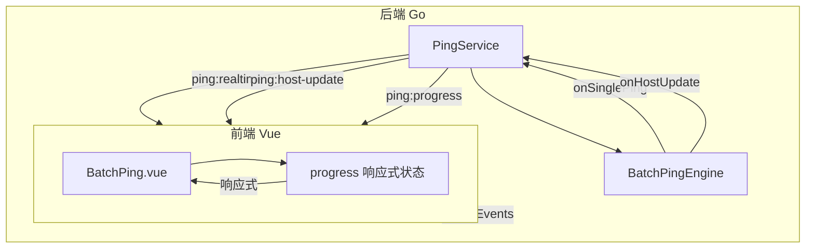

# 批量 Ping 实时刷新功能规划设计

> **版本**: v2.0  
> **更新日期**: 2026-04-17  
> **修订说明**: 根据审计报告修复架构冲突、状态管理、事件命名等问题

## 1. 问题分析

### 1.1 当前实现现状

#### 后端架构

```
┌─────────────────────────────────────────────────────────────────┐
│                        PingService                              │
│  ┌─────────────────┐    ┌──────────────────────────────────┐   │
│  │ StartBatchPing  │───▶│ BatchPingEngine.Run()            │   │
│  └─────────────────┘    │  ├─ goroutine per IP             │   │
│                         │  │   └─ pingHost() x Count       │   │
│                         │  │       ├─ PingOne() #1         │   │
│                         │  │       ├─ PingOne() #2         │   │
│                         │  │       └─ PingOne() #N         │   │
│                         │  └─ onSinglePing callback        │   │
│                         └──────────────────────────────────┘   │
│  ┌─────────────────┐    ┌──────────────────────────────────┐   │
│  │ emitProgress()  │◀───│ onUpdate callback (聚合结果)      │   │
│  │ emitRealtime()  │◀───│ onSinglePing callback (单次)      │   │
│  └─────────────────┘    └──────────────────────────────────┘   │
└─────────────────────────────────────────────────────────────────┘
```

#### 数据流程

| 事件类型 | 触发时机 | 数据内容 | 前端处理 |
|---------|---------|---------|---------|
| `ping:progress` | 每个IP所有ping完成 | `BatchPingProgress` (聚合结果) | 更新整个表格 |
| `ping:realtime` | 每次ping完成 | `SinglePingResult` (单次结果) | **未有效处理** |

#### 关键代码分析

**后端 [`engine.go:173-186`](internal/icmp/engine.go:173)**:
```go
// 每个IP完成后才触发 onUpdate 回调
result := e.pingHost(runCtx, ip, onSinglePing)
progressMu.Lock()
progress.SetResult(index, result)  // 设置聚合结果
safeCallback(onUpdate, progress)   // 触发进度更新
progressMu.Unlock()
```

**后端 [`engine.go:315-317`](internal/icmp/engine.go:315)**:
```go
// 单次ping完成后触发 onSinglePing 回调
if onSinglePing != nil {
    onSinglePing(singleResult)
}
```

**前端 [`BatchPing.vue:384-394`](frontend/src/views/Tools/BatchPing.vue:384)**:
```typescript
const handleRealtimeEvent = (ev: { name: string; data: SinglePingResult }) => {
  const result = ev.data
  if (progress.value) {
    // 仅查找，未实际更新UI
    const exist = progress.value.results?.find((r: PingHostResult) => r.ip === result.ip)
    if (exist) {
        // 注释说明：这里仅为了展示可达性，更全面的更新应依赖 progress 推进
    }
  }
}
```

### 1.2 核心问题

1. **进度更新粒度过粗**
   - `ping:progress` 事件只在每个IP的所有ping尝试完成后才触发
   - 用户看到的是"跳跃式"更新，而非"逐次"更新

2. **实时事件未有效利用**
   - `ping:realtime` 事件已发送，但前端未正确处理
   - 单次ping结果未反映到UI上

3. **UI反馈不够直观**
   - 没有显示"正在ping第X次"的状态
   - 没有实时更新延迟、丢包率等指标

### 1.3 与 PingInfoView 的差距

| 特性 | PingInfoView | 当前实现 |
|-----|-------------|---------|
| 更新模式 | 每次ping实时更新 | 每个IP完成后更新 |
| 单次结果显示 | 显示每次RTT | 只显示聚合统计 |
| 状态指示 | 动态闪烁 | 静态状态 |
| 刷新频率 | 高 (每次ping) | 低 (每IP完成) |

---

## 2. 设计目标

### 2.1 功能目标

1. **逐次实时更新**: 每次ping完成后立即更新UI，显示最新结果
2. **动态状态指示**: ping过程中显示"正在检测..."状态
3. **实时统计更新**: 成功/失败次数、丢包率、延迟等实时计算

### 2.2 性能目标

1. **事件节流**: 避免高频更新导致UI卡顿
2. **增量更新**: 只更新变化的行，避免全表重绘
3. **内存优化**: 控制历史数据存储量

### 2.3 用户体验目标

1. **视觉反馈**: ping中的行有动态效果
2. **状态清晰**: 明确区分"等待中"、"检测中"、"已完成"
3. **响应迅速**: 用户操作后立即反馈

---

## 3. 架构设计

### 3.1 整体架构



### 3.2 事件体系设计

#### 事件类型（保持与现有代码一致）

| 事件名 | 触发时机 | 数据类型 | 用途 |
|-------|---------|---------|-----|
| `ping:realtime` | 每次ping完成 | `SinglePingResult` | 更新单次结果（保持现有命名） |
| `ping:host-update` | 单个IP中间状态更新 | `HostPingUpdate` | 主机中间状态（新增） |
| `ping:progress` | 批量进度更新 | `BatchPingProgress` | 整体进度（保持现有） |

#### 事件数据结构

**SinglePingResult (已存在，增强字段)**:
```typescript
interface SinglePingResult {
  ip: string
  seq: number           // 第几次ping (1-based)
  success: boolean
  roundTripTime: number
  ttl: number
  status: string
  error: string
  timestamp: number
    
  // 新增字段
  totalSeq?: number     // 总ping次数
  hostIndex?: number    // IP在列表中的索引
}
```

**HostPingUpdate (新增，命名区分于 PingHostResult)**:
```typescript
// 主机ping过程中的中间状态更新
interface HostPingUpdate {
  ip: string
  index: number
  currentSeq: number      // 当前进行到的序号
  partialStats: PartialStats  // 部分统计
  isComplete: boolean     // 是否已完成
  timestamp: number       // 更新时间戳（用于防乱序）
}

interface PartialStats {
  sentCount: number
  recvCount: number
  failedCount: number
  lossRate: number
  lastRtt: number
  minRtt: number
  maxRtt: number
  avgRtt: number
}
```

### 3.3 前端状态管理（单一数据源）

> **重要**: 采用单一数据源设计，避免双数据源导致的状态不一致问题。

#### 状态结构

```typescript
// 保持现有的 progress 作为唯一数据源
const progress = ref<BatchPingProgress | null>(null)

// 实时更新覆盖层（轻量级，仅存储临时状态）
const realtimeOverlay = ref<Map<string, {
  currentSeq: number
  lastUpdateTimestamp: number  // 用于防乱序
  status: 'pinging' | 'completed'
}>>(new Map())

// 合并显示数据（计算属性）
const displayResults = computed(() => {
  if (!progress.value?.results) return []
  
  return progress.value.results.map((result, index) => {
    const overlay = realtimeOverlay.value.get(result.ip)
    
    // 如果没有实时覆盖数据，直接返回原结果
    if (!overlay || overlay.status === 'completed') {
      return { ...result, isPinging: false }
    }
    
    // 合并实时状态
    return {
      ...result,
      isPinging: true,
      displaySeq: overlay.currentSeq,
      // 其他实时字段从 result 中获取（已通过实时更新修改）
    }
  })
})
```

---

## 4. 详细设计

### 4.1 后端改造

#### 4.1.1 数据结构定义

**文件**: `internal/icmp/types.go`

```go
// HostPingUpdate 表示主机ping过程中的中间状态更新
// 命名区分于 PingHostResult，避免混淆
type HostPingUpdate struct {
    IP           string       `json:"ip"`
    Index        int          `json:"index"`
    CurrentSeq   int          `json:"currentSeq"`   // 当前进行到的序号
    PartialStats PartialStats `json:"partialStats"` // 部分统计
    IsComplete   bool         `json:"isComplete"`   // 是否已完成
    Timestamp    int64        `json:"timestamp"`    // 更新时间戳（用于防乱序）
}

// PartialStats 部分统计信息
type PartialStats struct {
    SentCount   int     `json:"sentCount"`
    RecvCount   int     `json:"recvCount"`
    FailedCount int     `json:"failedCount"`
    LossRate    float64 `json:"lossRate"`
    LastRtt     float64 `json:"lastRtt"`
    MinRtt      float64 `json:"minRtt"`
    MaxRtt      float64 `json:"maxRtt"`
    AvgRtt      float64 `json:"avgRtt"`
}
```

#### 4.1.2 Engine 改造（使用可选配置模式）

**文件**: `internal/icmp/engine.go`

> **重要**: 使用 `RunOptions` 可选配置模式，保持原有 `Run()` 方法签名不变，确保向后兼容。

```go
// RunOptions 可选配置对象
type RunOptions struct {
    OnUpdate     func(*BatchPingProgress)
    OnSinglePing func(SinglePingResult)
    OnHostUpdate func(HostPingUpdate)  // 新增：主机状态更新回调
}

// RunWithOptions 使用可选配置执行批量ping
func (e *BatchPingEngine) RunWithOptions(ctx context.Context, ips []string, opts RunOptions) *BatchPingProgress {
    return e.runInternal(ctx, ips, opts)
}

// Run 保持原有签名，确保向后兼容
func (e *BatchPingEngine) Run(ctx context.Context, ips []string, 
    onUpdate func(*BatchPingProgress), 
    onSinglePing func(SinglePingResult)) *BatchPingProgress {
    
    return e.RunWithOptions(ctx, ips, RunOptions{
        OnUpdate:     onUpdate,
        OnSinglePing: onSinglePing,
    })
}

// runInternal 内部实现
func (e *BatchPingEngine) runInternal(ctx context.Context, ips []string, opts RunOptions) *BatchPingProgress {
    // ... 现有逻辑 ...
    
    for i, ipStr := range ips {
        // ... goroutine 中 ...
        
        result := e.pingHost(runCtx, ip, opts.OnSinglePing, func(current PingHostResult, currentSeq int) {
            if opts.OnHostUpdate != nil {
                opts.OnHostUpdate(HostPingUpdate{
                    IP:         targetIP,
                    Index:      index,
                    CurrentSeq: currentSeq,
                    PartialStats: PartialStats{
                        SentCount:   current.SentCount,
                        RecvCount:   current.RecvCount,
                        FailedCount: current.FailedCount,
                        LossRate:    current.LossRate,
                        LastRtt:     current.LastRtt,
                        MinRtt:      current.MinRtt,
                        MaxRtt:      current.MaxRtt,
                        AvgRtt:      current.AvgRtt,
                    },
                    IsComplete: false,
                    Timestamp:  time.Now().UnixMilli(),
                })
            }
        })
        
        // 最终完成通知
        if opts.OnHostUpdate != nil {
            opts.OnHostUpdate(HostPingUpdate{
                IP:         targetIP,
                Index:      index,
                CurrentSeq: e.config.Count,
                PartialStats: PartialStats{
                    // ... 最终统计 ...
                },
                IsComplete: true,
                Timestamp:  time.Now().UnixMilli(),
            })
        }
        
        // ... 
    }
}

// pingHost 改造 - 支持中间状态回调
func (e *BatchPingEngine) pingHost(ctx context.Context, ip net.IP, 
    onSinglePing func(SinglePingResult),
    onProgress func(PingHostResult, int),  // 新增：中间状态回调
) PingHostResult {
    
    result := PingHostResult{
        IP:        ip.String(),
        Status:    "pending",
        SentCount: e.config.Count,
        MinRtt:    -1,
    }
    
    var successCount int
    var failedCount int
    var rttSum float64
    var minRtt float64 = -1
    var maxRtt float64
    
    for i := 0; i < e.config.Count; i++ {
        // ... 执行单次ping ...
        
        // 更新统计
        if pingResult.Success {
            successCount++
            rttSum += pingResult.RoundTripTime
            // ... 更新 min/max ...
        } else {
            failedCount++
        }
        
        // 更新中间结果
        result.RecvCount = successCount
        result.FailedCount = failedCount
        result.LossRate = float64(i+1-successCount) / float64(i+1) * 100
        if successCount > 0 {
            result.AvgRtt = rttSum / float64(successCount)
            result.MinRtt = minRtt
            result.MaxRtt = maxRtt
        }
        
        // 触发中间状态回调
        if onProgress != nil {
            onProgress(result, i+1)
        }
        
        // 触发单次ping回调
        if onSinglePing != nil {
            onSinglePing(singleResult)
        }
    }
    
    // 最终状态
    if successCount > 0 {
        result.Alive = true
        result.Status = "online"
    } else {
        result.Status = "offline"
    }
    
    return result
}
```

#### 4.1.3 PingService 改造（集成到现有服务）

**文件**: `internal/ui/ping_service.go`

> **重要**: 不新增独立的 `ping_emitter.go`，将事件发送逻辑整合到现有服务中。

```go
// PingService 新增字段
type PingService struct {
    // ... 现有字段 ...
    
    // 实时更新节流
    throttleMu     sync.Map  // IP -> lastEmitTime
    throttleMs     int64     // 节流间隔(毫秒)
    cleanupTicker  *time.Ticker
    cleanupStopCh  chan struct{}
}

// StartBatchPing 改造
func (s *PingService) StartBatchPing(req PingRequest) (*icmp.BatchPingProgress, error) {
    // ... 现有初始化逻辑 ...
    
    // 初始化节流配置
    s.throttleMs = options.RealtimeThrottle.Milliseconds()
    s.startThrottleCleanup()
    
    go func() {
        progress := s.engine.RunWithOptions(context.Background(), ips, icmp.RunOptions{
            OnUpdate: func(p *icmp.BatchPingProgress) {
                s.setProgress(p)
                s.emitProgress(p)
            },
            OnSinglePing: func(spr icmp.SinglePingResult) {
                // 带节流的事件发送
                if s.shouldEmitRealtime(spr.IP) {
                    s.emitRealtime(spr)
                }
            },
            OnHostUpdate: func(hpu icmp.HostPingUpdate) {
                // 主机状态更新事件
                s.emitHostUpdate(hpu)
            },
        })
        
        s.stopThrottleCleanup()
    }()
    
    return s.GetPingProgress(), nil
}

// shouldEmitRealtime 检查是否应该发送实时事件（节流逻辑）
func (s *PingService) shouldEmitRealtime(ip string) bool {
    now := time.Now().UnixMilli()
    lastEmit, _ := s.throttleMu.LoadOrStore(ip, now)
    if now-lastEmit.(int64) < s.throttleMs {
        return false
    }
    s.throttleMu.Store(ip, now)
    return true
}

// startThrottleCleanup 启动节流记录清理
func (s *PingService) startThrottleCleanup() {
    s.cleanupStopCh = make(chan struct{})
    s.cleanupTicker = time.NewTicker(5 * time.Minute)
    go func() {
        for {
            select {
            case <-s.cleanupTicker.C:
                s.cleanupThrottleRecords()
            case <-s.cleanupStopCh:
                return
            }
        }
    }()
}

// stopThrottleCleanup 停止节流记录清理
func (s *PingService) stopThrottleCleanup() {
    if s.cleanupTicker != nil {
        s.cleanupTicker.Stop()
    }
    if s.cleanupStopCh != nil {
        close(s.cleanupStopCh)
    }
}

// cleanupThrottleRecords 清理过期的节流记录
func (s *PingService) cleanupThrottleRecords() {
    now := time.Now().UnixMilli()
    s.throttleMu.Range(func(key, value interface{}) bool {
        if now-value.(int64) > 10*60*1000 { // 10分钟未更新
            s.throttleMu.Delete(key)
        }
        return true
    })
}

// emitHostUpdate 发送主机状态更新事件
func (s *PingService) emitHostUpdate(hpu icmp.HostPingUpdate) {
    if s.wailsApp != nil && s.wailsApp.Event != nil {
        s.wailsApp.Event.Emit("ping:host-update", hpu)
    }
}
```

### 4.2 前端改造

#### 4.2.1 状态管理（单一数据源）

**文件**: `frontend/src/views/Tools/BatchPing.vue`

```typescript
// 保持现有的 progress 作为唯一数据源
const progress = ref<BatchPingProgress | null>(null)

// 实时更新覆盖层（轻量级）
const realtimeOverlay = ref<Map<string, {
  currentSeq: number
  lastUpdateTimestamp: number
  status: 'pinging' | 'completed'
}>>(new Map())

// 合并显示数据
const displayResults = computed(() => {
  if (!progress.value?.results) return []
  
  return progress.value.results.map((result) => {
    const overlay = realtimeOverlay.value.get(result.ip)
    
    if (!overlay || overlay.status === 'completed') {
      return { ...result, isPinging: false }
    }
    
    return {
      ...result,
      isPinging: true,
      displaySeq: overlay.currentSeq,
    }
  })
})
```

#### 4.2.2 事件处理（防乱序）

```typescript
// 事件监听
onMounted(async () => {
  // 单次ping事件（保持现有事件名）
  unlistenRealtime = Events.On('ping:realtime', handleRealtimeEvent)
  
  // 主机状态更新事件（新增）
  unlistenHostUpdate = Events.On('ping:host-update', handleHostUpdateEvent)
  
  // 批量进度事件（保持现有）
  unlistenProgress = Events.On('ping:progress', handleProgressEvent)
})

// 处理单次ping结果 - 直接更新 progress 数据源
const handleRealtimeEvent = (ev: { name: string; data: SinglePingResult }) => {
  const result = ev.data
  if (!progress.value?.results) return
  
  // 查找对应的主机结果
  const hostIndex = progress.value.results.findIndex(r => r.ip === result.ip)
  if (hostIndex === -1) return
  
  const host = progress.value.results[hostIndex]
  
  // 防乱序：检查时间戳
  const overlay = realtimeOverlay.value.get(result.ip)
  if (overlay && result.timestamp < overlay.lastUpdateTimestamp) {
    return  // 丢弃过期数据
  }
  
  // 直接更新 progress 中的数据
  host.lastRtt = result.roundTripTime
  host.sentCount = result.seq
  if (result.success) {
    host.recvCount = (host.recvCount || 0) + 1
    host.lastSucceedAt = result.timestamp
  } else {
    host.failedCount = (host.failedCount || 0) + 1
    host.lastFailedAt = result.timestamp
    if (result.error) host.errorMsg = result.error
  }
  
  // 计算丢包率
  host.lossRate = (host.failedCount / host.sentCount) * 100
  
  // 更新覆盖层状态
  realtimeOverlay.value.set(result.ip, {
    currentSeq: result.seq,
    lastUpdateTimestamp: result.timestamp,
    status: 'pinging',
  })
  
  // 触发响应式更新
  progress.value = { ...progress.value }
}

// 处理主机状态更新事件
const handleHostUpdateEvent = (ev: { name: string; data: HostPingUpdate }) => {
  const update = ev.data
  if (!progress.value?.results) return
  
  const host = progress.value.results[update.index]
  if (!host || host.ip !== update.ip) return
  
  // 防乱序：检查时间戳
  const overlay = realtimeOverlay.value.get(update.ip)
  if (overlay && update.timestamp < overlay.lastUpdateTimestamp) {
    return
  }
  
  // 更新部分统计
  if (update.partialStats) {
    host.sentCount = update.partialStats.sentCount
    host.recvCount = update.partialStats.recvCount
    host.failedCount = update.partialStats.failedCount
    host.lossRate = update.partialStats.lossRate
    host.lastRtt = update.partialStats.lastRtt
    host.minRtt = update.partialStats.minRtt
    host.maxRtt = update.partialStats.maxRtt
    host.avgRtt = update.partialStats.avgRtt
  }
  
  // 更新覆盖层状态
  realtimeOverlay.value.set(update.ip, {
    currentSeq: update.currentSeq,
    lastUpdateTimestamp: update.timestamp,
    status: update.isComplete ? 'completed' : 'pinging',
  })
  
  // 如果完成，更新最终状态
  if (update.isComplete) {
    host.status = host.recvCount > 0 ? 'online' : 'offline'
    host.alive = host.recvCount > 0
  }
  
  // 触发响应式更新
  progress.value = { ...progress.value }
}

// 处理批量进度事件（作为兜底）
const handleProgressEvent = (ev: { name: string; data: BatchPingProgress }) => {
  // 直接替换整个进度数据
  progress.value = ev.data
  
  // 清理已完成的覆盖层状态
  ev.data.results?.forEach((result) => {
    if (result.status !== 'pending') {
      const overlay = realtimeOverlay.value.get(result.ip)
      if (overlay) {
        overlay.status = 'completed'
      }
    }
  })
}
```

#### 4.2.3 UI 组件改造

**表格行状态指示**:

```vue
<template>
  <tr :class="getRowClass(result)">
    <td>
      <!-- 状态指示器 -->
      <span class="status-indicator" :class="getStatusClass(result)">
        <span v-if="result.isPinging" class="ping-animation">
          🏓
        </span>
        <span v-else>{{ getStatusIcon(result.status) }}</span>
      </span>
    </td>
    <td>
      <!-- 成功/失败 实时更新 -->
      <span class="text-green-400">{{ result.recvCount }}</span>
      <span class="text-text-muted">/</span>
      <span class="text-red-400">{{ result.failedCount }}</span>
      <!-- 进度指示 -->
      <span v-if="result.isPinging" class="text-xs text-text-muted">
        ({{ result.displaySeq }}/{{ result.sentCount }})
      </span>
    </td>
    <td>
      <!-- 延迟 实时更新 -->
      <span v-if="result.lastRtt > 0">{{ formatRtt(result.lastRtt) }}</span>
      <span v-else>-</span>
    </td>
  </tr>
</template>

<script setup lang="ts">
const getStatusClass = (result: PingHostResult & { isPinging?: boolean }) => {
  if (result.isPinging) return 'pinging'
  return result.status
}
</script>

<style scoped>
.status-indicator.pinging {
  animation: pulse 0.5s ease-in-out infinite;
}

@keyframes pulse {
  0%, 100% { opacity: 1; }
  50% { opacity: 0.5; }
}

.ping-animation {
  animation: bounce 0.3s ease-in-out infinite;
}

@keyframes bounce {
  0%, 100% { transform: translateY(0); }
  50% { transform: translateY(-3px); }
}
</style>
```

### 4.3 性能优化

#### 4.3.1 前端事件批处理

```typescript
// 使用 requestAnimationFrame 批量更新
const pendingUpdates = new Map<string, SinglePingResult>()
let flushScheduled = false

const scheduleFlush = () => {
  if (flushScheduled) return
  flushScheduled = true
  requestAnimationFrame(() => {
    pendingUpdates.forEach((result) => {
      applyRealtimeUpdate(result)
    })
    pendingUpdates.clear()
    flushScheduled = false
  })
}

const handleRealtimeEvent = (ev: { name: string; data: SinglePingResult }) => {
  pendingUpdates.set(ev.data.ip, ev.data)
  scheduleFlush()
}
```

#### 4.3.2 自适应节流

```go
// 根据IP数量自适应调整节流间隔
func (s *PingService) calculateThrottle(ipCount int) time.Duration {
    switch {
    case ipCount < 100:
        return 50 * time.Millisecond
    case ipCount < 500:
        return 100 * time.Millisecond
    default:
        return 200 * time.Millisecond
    }
}
```

---

## 5. 实现计划

### 5.1 阶段一: 基础实时更新 (P0)

**目标**: 实现每次ping完成后UI立即更新

**后端改动**:
- [ ] 新增 `HostPingUpdate` 和 `PartialStats` 数据结构 (`internal/icmp/types.go`)
- [ ] 新增 `RunOptions` 可选配置模式 (`internal/icmp/engine.go`)
- [ ] 改造 `pingHost()` 方法，支持中间状态回调
- [ ] 在 `PingService` 中集成节流和事件发送逻辑

**前端改动**:
- [ ] 实现 `handleRealtimeEvent` 处理逻辑
- [ ] 实现 `handleHostUpdateEvent` 处理逻辑
- [ ] 添加 `realtimeOverlay` 覆盖层状态
- [ ] 改造表格组件，支持实时状态显示

### 5.2 阶段二: UI增强 (P1)

**目标**: 提供更好的视觉反馈

**改动点**:
- [ ] 添加"检测中"状态动画效果
- [ ] 添加进度指示器 (第X次/共N次)
- [ ] 优化表格行更新性能 (使用key优化Vue渲染)
- [ ] 添加实时统计面板

### 5.3 阶段三: 性能优化 (P2)

**目标**: 支持大规模IP列表

**改动点**:
- [ ] 实现前端事件批处理
- [ ] 实现自适应节流算法
- [ ] 添加虚拟滚动支持（可选）

---

## 6. 文件改动清单

### 6.1 后端文件

| 文件路径 | 改动类型 | 说明 |
|---------|---------|-----|
| `internal/icmp/types.go` | 修改 | 新增 `HostPingUpdate`、`PartialStats`、`RunOptions` |
| `internal/icmp/engine.go` | 修改 | 新增 `RunWithOptions()`，改造 `pingHost()` |
| `internal/ui/ping_service.go` | 修改 | 集成节流和事件发送逻辑 |

### 6.2 前端文件

| 文件路径 | 改动类型 | 说明 |
|---------|---------|-----|
| `frontend/src/views/Tools/BatchPing.vue` | 修改 | 状态管理和UI改造 |

---

## 7. 风险与注意事项

### 7.1 性能风险

**问题**: 高频事件可能导致UI卡顿

**解决方案**:
1. 后端实现事件节流 (throttle)
2. 前端使用 `requestAnimationFrame` 批量更新
3. 大规模批量ping时自适应降低更新频率

### 7.2 状态一致性

**问题**: 实时更新与最终结果可能不一致

**解决方案**:
1. 使用单一数据源 (`progress`)
2. 使用时间戳确保数据新鲜度，防止乱序
3. `ping:progress` 作为最终状态同步兜底

### 7.3 错误处理

**问题**: 事件发送失败、内存不足等异常情况

**解决方案**:
1. 事件发送失败时记录日志，不中断流程
2. 定期清理节流记录，防止内存泄漏
3. 前端限制历史记录数量

---

## 8. 测试计划

### 8.1 单元测试

- [ ] `RunOptions` 配置模式测试
- [ ] `HostPingUpdate` 数据正确性测试
- [ ] 节流逻辑测试
- [ ] 时间戳防乱序测试

### 8.2 集成测试

- [ ] 小规模批量ping (10个IP) 实时更新验证
- [ ] 大规模批量ping (1000个IP) 性能测试
- [ ] 取消操作时状态正确性测试
- [ ] 事件乱序场景测试

### 8.3 UI测试

- [ ] 动画效果流畅性测试
- [ ] 表格滚动时更新性能测试
- [ ] 不同浏览器兼容性测试

### 8.4 压力测试

- [ ] 10000个IP的实时更新性能
- [ ] 长时间运行稳定性（内存泄漏检测）
- [ ] 并发安全测试

---

## 9. 总结

本设计通过以下核心改进实现类似PingInfoView的实时刷新效果:

1. **事件粒度细化**: 从"每IP完成"改为"每次ping完成"
2. **API向后兼容**: 使用 `RunOptions` 可选配置模式
3. **单一数据源**: 避免双数据源导致的状态不一致
4. **事件命名一致**: 保持现有 `ping:realtime` 事件名
5. **防乱序机制**: 使用时间戳确保数据新鲜度
6. **节流优化**: 自适应节流算法，防止事件风暴

通过这些改进，用户将能够看到每次ping的实时结果，而不是等待所有ping完成后才看到最终结果。
