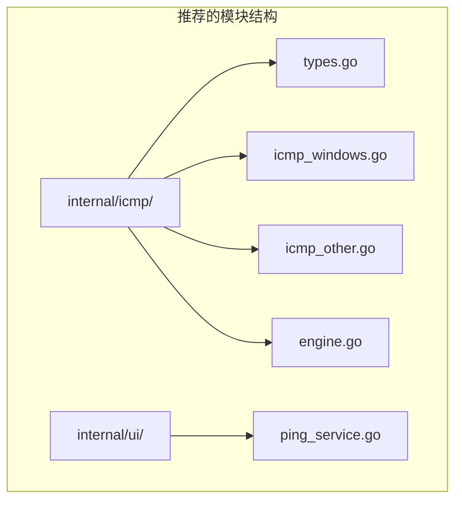

# 批量 Ping 功能设计文档分析报告

> **分析日期**: 2026-04-15  
> **文档版本**: v1.0  
> **分析结论**: ⚠️ 需要修订后实施

---

## 一、总体评价

| 维度 | 评分 | 说明 |
|------|------|------|
| 架构适配性 | ⭐⭐⭐⭐⭐ | 完全符合现有项目架构模式 |
| 技术可行性 | ⭐⭐⭐⭐☆ | 方案可行，但存在若干技术细节需修正 |
| 代码复用 | ⭐⭐⭐⭐☆ | 复用策略正确，但部分函数访问权限需调整 |
| 文档完整性 | ⭐⭐⭐⭐⭐ | 覆盖全面，包含前后端、测试、演进规划 |
| 实施风险 | ⭐⭐⭐☆☆ | 存在若干需要修正的问题 |

---

## 二、发现的问题

### 🔴 严重问题（必须修复）

#### 2.1 ICMP 结构体内存对齐问题

**位置**: `icmp_windows.go` 第 127-135 行

**问题描述**:  
`ICMP_ECHO_REPLY` 结构体直接映射 Windows API 结构，但 Go 编译器会进行内存对齐，导致结构体大小与 Windows API 期望不一致。

```go
// 设计文档中的定义
type ICMP_ECHO_REPLY struct {
    Address       uint32 // 4 bytes
    Status        uint32 // 4 bytes
    RoundTripTime uint32 // 4 bytes
    DataSize      uint16 // 2 bytes
    Reserved      uint16 // 2 bytes
    DataPointer   uintptr // 8 bytes (64位系统)
    Options       IP_OPTION_INFORMATION // 4 bytes
}
```

**问题分析**:  
在 64 位系统上，Go 会在 `DataPointer` 前插入 4 字节填充以对齐到 8 字节边界，导致结构体大小与 Windows API 期望的 32 字节不符。

**修复建议**:
```go
type ICMP_ECHO_REPLY struct {
    Address       uint32
    Status        uint32
    RoundTripTime uint32
    DataSize      uint16
    Reserved      uint16
    DataPointer   uintptr
    Options       [4]byte // 使用固定字节数组替代嵌套结构
}
```

或使用 `unsafe.Offsetof` 验证结构体布局。

---

#### 2.2 Wails v3 API 兼容性问题

**位置**: `ping_service.go` 第 579-583 行、第 639-641 行

**问题描述**:  
设计文档中使用的 Wails v3 API 需要验证是否与当前项目使用的版本兼容。

```go
// 需要验证的 API
func (s *PingService) ServiceStartup(ctx context.Context, options application.ServiceOptions) error {
    s.wailsApp = application.Get()  // 需要验证此方法是否存在
    return nil
}

// Event 发送
s.wailsApp.EmitEvent("ping:progress", progress)  // 需要验证方法签名
```

**修复建议**:  
查阅项目当前使用的 Wails v3 版本文档，确认：
1. `application.Get()` 是否存在或应使用其他方式获取 App 实例
2. `EmitEvent` 的正确方法签名
3. Service 生命周期接口的正确签名

---

#### 2.3 并发数据竞争风险

**位置**: `engine.go` 第 386-408 行

**问题描述**:  
在 `Run` 方法的 goroutine 中，对 `e.progress.Results` 的访问存在潜在的数据竞争。

```go
go func(index int, targetIP string) {
    // ...
    e.mu.Lock()
    e.progress.Results[index] = result
    // 这里遍历整个 Results 切片统计
    for _, r := range e.progress.Results {
        // ...
    }
    e.mu.Unlock()
}()
```

**问题分析**:  
虽然使用了互斥锁保护，但 `Results` 切片在初始化后会被多个 goroutine 并发写入不同索引。Go 的切片在并发写入不同索引时是安全的，但统计循环遍历时可能读到部分写入的状态。

**修复建议**:  
当前实现在锁保护下进行统计，逻辑上是正确的。但建议：
1. 添加 `go run -race` 测试验证
2. 考虑使用 `sync/atomic` 指针交换整个 `BatchPingProgress` 结构

---

### 🟡 中等问题（建议修复）

#### 2.4 IP 范围解析错误处理逻辑

**位置**: `ping_service.go` 第 816-825 行

**问题描述**:  
`parseIPv4LastOctetRange` 函数在不匹配时返回 `nil, nil`，而非 `nil, error`。这导致错误处理逻辑不清晰。

```go
// 设计文档中的代码
rangeResult, rangeErr := parseIPv4LastOctetRange(line)
if rangeErr != nil {
    return nil, fmt.Errorf("IP 范围解析失败 [%s]: %w", line, rangeErr)
}
if rangeResult != nil {
    // 处理范围
    continue
}
```

**问题分析**:  
查看现有 [`parseIPv4LastOctetRange()`](internal/ui/forge_service.go:92) 函数：
- 匹配成功：返回 `*IPRangeResult, nil`
- 格式不匹配：返回 `nil, nil`（不是错误，只是不匹配）
- 解析错误：返回 `nil, error`

设计文档中的错误处理逻辑是正确的，但建议添加注释说明。

---

#### 2.5 CIDR 展开性能问题

**位置**: `ping_service.go` 第 840-879 行

**问题描述**:  
`expandCIDR` 函数在检查 IP 数量限制之前就已经生成了完整的 IP 列表。

```go
func expandCIDR(cidr string) ([]string, error) {
    // ... 解析 CIDR
    hostBits := 32 - bits
    totalHosts := uint32(1) << uint(hostBits)  // 可能非常大
    
    // 直接展开，没有预先检查数量
    for i := start; i < end; i++ {
        // ...
    }
}
```

**问题分析**:  
对于 `/16` 网络，会生成 65534 个 IP，虽然后续在 `StartBatchPing` 中检查了 10000 上限，但内存已经分配。

**修复建议**:
```go
func expandCIDR(cidr string) ([]string, error) {
    // ... 解析 CIDR
    
    hostBits := 32 - bits
    totalHosts := uint32(1) << uint(hostBits)
    
    // 预先检查数量
    expectedCount := totalHosts - 2  // 排除网络地址和广播地址
    if bits >= 31 {
        expectedCount = totalHosts
    }
    if expectedCount > 10000 {
        return nil, fmt.Errorf("CIDR 展开后 IP 数量 (%d) 超过上限 10000", expectedCount)
    }
    
    // 再进行展开
}
```

---

#### 2.6 接收缓冲区大小计算

**位置**: `icmp_windows.go` 第 162-163 行

**问题描述**:  
```go
replySize := unsafe.Sizeof(ICMP_ECHO_REPLY{}) + uintptr(dataSize) + 8
```

**问题分析**:  
额外的 8 字节是经验值，但没有说明来源。根据 Microsoft 文档，`IcmpSendEcho` 的接收缓冲区应至少为 `sizeof(ICMP_ECHO_REPLY) + dataSize`，但建议增加更多余量以处理 ICMP 响应中的选项数据。

**修复建议**:  
添加注释说明 8 字节的用途，或参考 Windows SDK 示例确定正确值。

---

### 🟢 轻微问题（可选修复）

#### 2.7 函数访问权限

**位置**: 设计文档 2.2 节

**问题描述**:  
文档提到复用 `parseIPv4LastOctetRange()` 等函数，这些函数在现有代码中是小写开头的私有函数。

**实际情况**:  
由于 `ping_service.go` 和 `forge_service.go` 都在 `internal/ui` 包内，私有函数可以被同包内的其他文件访问，因此**这不是问题**。

---

#### 2.8 缺少构建标签

**位置**: `icmp_windows.go`

**问题描述**:  
文件名已经是 `icmp_windows.go`，Go 编译器会根据后缀自动选择编译，但建议添加显式的构建标签。

**修复建议**:
```go
//go:build windows

package icmp
// ...
```

---

#### 2.9 缺少非 Windows 平台存根

**问题描述**:  
设计文档只提供了 Windows 实现，缺少其他平台的存根文件。

**修复建议**:  
添加 `icmp_other.go`：
```go
//go:build !windows

package icmp

import (
    "fmt"
    "net"
)

func PingOne(ip net.IP, timeout uint32, dataSize uint16) (*PingResult, error) {
    return nil, fmt.Errorf("批量 Ping 功能仅支持 Windows 平台")
}
```

---

## 三、可行性验证

### 3.1 复用资源验证 ✅

| 文档声明的复用资源 | 实际位置 | 验证结果 |
|-------------------|---------|---------|
| `parseIPv4Addr()` | [`network_calc_service.go:531`](internal/ui/network_calc_service.go:531) | ✅ 存在 |
| `ipv4ToUint32()` | [`network_calc_service.go:608`](internal/ui/network_calc_service.go:608) | ✅ 存在 |
| `uint32ToIPv4()` | [`network_calc_service.go:613`](internal/ui/network_calc_service.go:613) | ✅ 存在 |
| `cidrToMaskUint32()` | [`network_calc_service.go:617`](internal/ui/network_calc_service.go:617) | ✅ 存在 |
| `parseIPv4LastOctetRange()` | [`forge_service.go:92`](internal/ui/forge_service.go:92) | ✅ 存在 |
| `ValidateIP()` | [`forge_service.go:46`](internal/ui/forge_service.go:46) | ✅ 存在 |
| `DeviceRepository` | [`interfaces.go:16`](internal/repository/interfaces.go:16) | ✅ 存在 |

### 3.2 架构模式验证 ✅

设计文档遵循了项目现有的服务架构模式：

```
现有服务模式:
├── NewXxxService() 构造函数
├── ServiceStartup 生命周期钩子（可选）
├── Wails Binding 方法（公开方法，前端可调用）
└── 私有辅助方法

设计文档中的 PingService 遵循相同模式 ✅
```

### 3.3 前端路由验证 ✅

设计文档中的路由 `/tools/ping` 与现有工具路由模式一致：

| 现有工具路由 | 设计文档路由 |
|-------------|-------------|
| `/tools/calc` | `/tools/ping` ✅ |
| `/tools/protocol` | |
| `/tools/config` | |

---

## 四、改进建议

### 4.1 架构层面



### 4.2 代码层面

1. **添加 ICMP 结构体验证测试**
   ```go
   func TestICMPEchoReplySize(t *testing.T) {
       // 验证结构体大小与 Windows API 期望一致
       if unsafe.Sizeof(ICMP_ECHO_REPLY{}) != 32 {
           t.Errorf("ICMP_ECHO_REPLY 大小不正确")
       }
   }
   ```

2. **添加并发安全测试**
   ```go
   func TestBatchPingEngineConcurrent(t *testing.T) {
       // 使用 go test -race 运行
   }
   ```

3. **完善错误码映射**
   - 设计文档中的 `icmpStatusToString` 覆盖了常见状态码
   - 建议补充更多 Windows IP_STATUS 常量

### 4.3 文档层面

1. 补充 Wails v3 版本兼容性说明
2. 添加 Windows ICMP API 参考链接
3. 补充性能基准测试预期值

---

## 五、实施建议

### 5.1 实施顺序

```
Phase 1: 核心引擎
├── internal/icmp/types.go
├── internal/icmp/icmp_windows.go（含结构体验证测试）
├── internal/icmp/icmp_other.go
└── internal/icmp/engine.go（含并发测试）

Phase 2: 服务层
├── internal/ui/ping_service.go
└── cmd/netweaver/main.go（注册服务）

Phase 3: 前端
├── frontend/src/views/Tools/BatchPing.vue
├── frontend/src/router/index.ts
└── 侧边栏菜单更新

Phase 4: 集成测试
├── 端到端测试
└── 性能测试
```

### 5.2 风险缓解

| 风险 | 缓解措施 |
|------|---------|
| Wails API 不兼容 | 先创建最小化 PoC 验证 API |
| ICMP 结构体对齐 | 添加单元测试验证结构体大小 |
| 并发问题 | 使用 go test -race 验证 |
| 大规模 IP 测试 | 添加 10000 IP 压力测试 |

---

## 六、结论

设计文档整体质量较高，架构设计合理，复用策略正确。但存在以下需要修正的问题：

| 优先级 | 问题 | 影响 |
|--------|------|------|
| 🔴 P0 | ICMP 结构体内存对齐 | 可能导致运行时崩溃或数据错误 |
| 🔴 P0 | Wails v3 API 兼容性 | 可能导致编译失败或运行时错误 |
| 🟡 P1 | CIDR 展开性能 | 大网段可能导致内存峰值 |
| 🟡 P1 | 并发数据竞争 | 需要验证测试 |
| 🟢 P2 | 非平台存根文件 | 跨平台编译会失败 |

**建议**: 修复 P0 级别问题后即可进入实施阶段，P1/P2 问题可在实施过程中同步解决。
