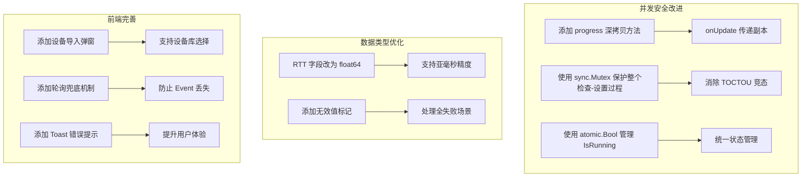

# 批量 Ping 功能 - 最终问题清单

> **审核日期**: 2026-04-15  
> **核对状态**: 已通过代码核对确认  
> **参考文档**: `batch_ping_code_review.md`, `bug.md`

---

## 一、问题汇总表

| 序号 | 问题 | 严重程度 | 文件位置 | 核对状态 |
|------|------|---------|---------|---------|
| **高优先级** |||||
| 1 | StartBatchPing 存在竞态条件 (TOCTOU) | 🔴 高 | `ping_service.go:57-82` | ✅ 确认存在 |
| 2 | 进度传递竞态条件 - onUpdate 传递指针 | 🔴 高 | `engine.go:115-120` | ✅ 确认存在 |
| 3 | IsRunning 竞态条件 | 🔴 高 | `ping_service.go:115-119` | ✅ 确认存在 |
| 4 | CSV 导出 AvgRtt 列重复 | 🔴 高 | `ping_service.go:153-156` | ✅ 确认存在 |
| **中优先级** |||||
| 5 | expandCIDR 对 /31 和 /32 处理逻辑有误 | 🟡 中 | `ping_service.go:296-301` | ✅ 确认存在 |
| 6 | 缺少 Interval 参数上限校验 | 🟡 中 | `ping_service.go:382-412` | ✅ 确认存在 |
| 7 | 取消时未保留已完成进度 | 🟡 中 | `engine.go:72-76` | ✅ 确认存在 |
| 8 | minRtt 初始值问题 | 🟡 中 | `engine.go:138` | ✅ 确认存在 |
| 9 | 结果顺序与输入顺序不一致 | 🟡 中 | `engine.go:81-121` | ✅ 确认存在 |
| 10 | 缺少回调 panic 恢复机制 | 🟡 中 | `engine.go:105-108` | ✅ 确认存在 |
| 11 | IP 范围解析不支持逗号分隔 | 🟡 中 | `ping_service.go:225` | ✅ 确认存在 |
| 12 | 前端缺少设备导入 UI | 🟡 中 | `BatchPing.vue` | ✅ 确认存在 |
| 13 | 前端未处理启动错误提示 | 🟡 中 | `BatchPing.vue:22-34` | ✅ 确认存在 |
| 14 | Events.Off 未传入回调引用 | 🟡 中 | `BatchPing.vue:131` | ✅ 确认存在 |
| **低优先级** |||||
| 15 | RTT 类型使用 uint32 而非 float64 | 🟢 低 | `types.go:43-46` | ✅ 确认存在 |
| 16 | 配置参数范围与设计不一致 | 🟢 低 | `ping_service.go:399-404` | ✅ 确认存在 |
| 17 | 发送数据模式简单 | 🟢 低 | `icmp_windows.go:197-198` | ✅ 确认存在 |
| 18 | 停止后状态更新不完整 | 🟢 低 | `engine.go:205-211` | ✅ 确认存在 |
| 19 | 缺少轮询兜底机制 | 🟢 低 | `BatchPing.vue` | ✅ 确认存在 |

---

## 二、问题详细说明

### 🔴 高优先级问题

#### 1. StartBatchPing 存在竞态条件 (TOCTOU)

**文件**: [`internal/ui/ping_service.go:57-82`](internal/ui/ping_service.go:57)

**问题描述**: `IsRunning()` 检查与设置 engine 非原子操作，存在 Time-of-check to time-of-use 竞态条件。

**当前代码**:
```go
func (s *PingService) StartBatchPing(req PingRequest) (*icmp.BatchPingProgress, error) {
    // Check if already running
    if s.IsRunning() {  // 检查
        return nil, fmt.Errorf("批量 Ping 正在运行中，请先停止当前任务")
    }
    // ... 其他操作
    s.engine = icmp.NewBatchPingEngine(config)  // 使用
    // ...
}
```

**修复建议**: 使用互斥锁保护整个检查-设置过程。

---

#### 2. 进度传递竞态条件

**文件**: [`internal/icmp/engine.go:115-120`](internal/icmp/engine.go:115)

**问题描述**: `onUpdate(progress)` 传递的是 progress 指针，如果前端持有该指针并在后续修改，会导致数据竞争。

**当前代码**:
```go
progressMu.Lock()
progress.AddResult(result)
if onUpdate != nil {
    onUpdate(progress)  // 传递指针
}
progressMu.Unlock()
```

**修复建议**: 传递 progress 的深拷贝副本。

---

#### 3. IsRunning 竞态条件

**文件**: [`internal/ui/ping_service.go:115-119`](internal/ui/ping_service.go:115)

**问题描述**: `s.progress.IsRunning` 可能被 engine 在其他 goroutine 修改，存在竞态条件。

**当前代码**:
```go
func (s *PingService) IsRunning() bool {
    s.progressMu.RLock()
    defer s.progressMu.RUnlock()
    return s.progress != nil && s.progress.IsRunning  // progress.IsRunning 无锁保护
}
```

**修复建议**: 使用原子操作或统一锁保护 `IsRunning` 字段。

---

#### 4. CSV 导出 AvgRtt 列重复

**文件**: [`internal/ui/ping_service.go:153-156`](internal/ui/ping_service.go:153)

**问题描述**: CSV 导出时 `AvgRtt` 列重复出现，导致数据冗余。

**当前代码**:
```go
row := []string{
    // ...
    formatRtt(result.AvgRtt), // 延迟列
    formatRtt(result.MinRtt), // 最小延迟列
    formatRtt(result.MaxRtt), // 最大延迟列
    formatRtt(result.AvgRtt), // ❌ 平均延迟列重复
    // ...
}
```

**修复建议**: 删除重复的 `AvgRtt` 列。

---

### 🟡 中优先级问题

#### 5. expandCIDR 对 /31 和 /32 处理逻辑有误

**文件**: [`internal/ui/ping_service.go:296-301`](internal/ui/ping_service.go:296)

**问题描述**: CIDR 展开时对 /31 和 /32 网络的处理逻辑有误，`!prefix.Contains(addr.Next())` 判断不正确。

**当前代码**:
```go
if prefix.Bits() < 31 {
    if addr == prefix.Addr() || !prefix.Contains(addr.Next()) {
        continue
    }
}
```

**修复建议**: 修正边界条件判断逻辑。

---

#### 6. 缺少 Interval 参数上限校验

**文件**: [`internal/ui/ping_service.go:382-412`](internal/ui/ping_service.go:382)

**问题描述**: `mergeWithDefaultPingConfig` 没有对 `Interval` 参数设置上限，可能导致长时间运行。

**当前代码**: 只对 Timeout、DataSize、Count、Concurrency 设置了上限。

**修复建议**: 添加 `Interval` 上限校验（建议最大 5000ms）。

---

#### 7. 取消时未保留已完成进度

**文件**: [`internal/icmp/engine.go:72-76`](internal/icmp/engine.go:72)

**问题描述**: 取消操作时直接返回 progress，没有调用 `Finish()` 更新最终状态。

**当前代码**:
```go
select {
case <-runCtx.Done():
    return progress  // 未更新状态
default:
}
```

**修复建议**: 取消时也应调用 `progress.Finish()` 并触发回调。

---

#### 8. minRtt 初始值问题

**文件**: [`internal/icmp/engine.go:138`](internal/icmp/engine.go:138)

**问题描述**: `minRtt` 初始值为 `^uint32(0)` (最大值)，当所有 ping 失败时会返回错误值。

**当前代码**:
```go
var minRtt uint32 = ^uint32(0) // Max uint32
```

**修复建议**: 使用指针或特殊值表示无效状态。

---

#### 9. 结果顺序与输入顺序不一致

**文件**: [`internal/icmp/engine.go:81-121`](internal/icmp/engine.go:81)

**问题描述**: 并发执行导致结果按完成顺序添加，而非输入顺序。

**修复建议**: 使用预分配切片按索引存储结果。

---

#### 10. 缺少回调 panic 恢复机制

**文件**: [`internal/icmp/engine.go:105-108`](internal/icmp/engine.go:105)

**问题描述**: `onUpdate(progress)` 没有 recover 机制，回调 panic 会导致主程序崩溃。

**修复建议**: 添加 `defer recover()` 保护。

---

#### 11. IP 范围解析不支持逗号分隔

**文件**: [`internal/ui/ping_service.go:225`](internal/ui/ping_service.go:225)

**问题描述**: 只使用换行符分割目标，不支持逗号分隔的混合输入。

**当前代码**:
```go
lines := strings.Split(targets, "\n")
```

**修复建议**: 使用 `strings.FieldsFunc` 同时处理换行和逗号。

---

#### 12. 前端缺少设备导入 UI

**文件**: [`frontend/src/views/Tools/BatchPing.vue`](frontend/src/views/Tools/BatchPing.vue)

**问题描述**: 实现了 `GetDeviceIPsForPing` API，但前端页面没有提供设备导入的界面，`deviceIds` 参数始终为空数组。

**修复建议**: 添加设备选择弹窗组件。

---

#### 13. 前端未处理启动错误提示

**文件**: [`frontend/src/views/Tools/BatchPing.vue:22-34`](frontend/src/views/Tools/BatchPing.vue:22)

**问题描述**: `startPing` 中 catch 错误只 `console.error`，没有用户提示。

**当前代码**:
```typescript
const startPing = async () => {
  try {
    const result = await PingService.StartBatchPing(request)
    progress.value = result
  } catch (err) {
    console.error('Failed to start ping:', err)  // 缺少用户提示
  }
}
```

**修复建议**: 使用 Toast 组件显示错误信息。

---

#### 14. Events.Off 未传入回调引用

**文件**: [`frontend/src/views/Tools/BatchPing.vue:131`](frontend/src/views/Tools/BatchPing.vue:131)

**问题描述**: `Events.Off('ping:progress')` 没有传入 `handleProgressEvent` 回调引用，可能导致内存泄漏。

**当前代码**:
```typescript
onUnmounted(() => {
  Events.Off('ping:progress')  // 未传入回调引用
})
```

**修复建议**: `Events.Off('ping:progress', handleProgressEvent)`

---

### 🟢 低优先级问题

#### 15. RTT 类型使用 uint32 而非 float64

**文件**: [`internal/icmp/types.go:43-46`](internal/icmp/types.go:43)

**问题描述**: `MinRtt`、`MaxRtt`、`AvgRtt` 使用 `uint32` 类型，无法表示小于 1ms 的延迟，精度丢失。

**当前代码**:
```go
MinRtt uint32 `json:"minRtt"`
MaxRtt uint32 `json:"maxRtt"`
AvgRtt uint32 `json:"avgRtt"`
```

**修复建议**: 改为 `float64` 类型，单位为毫秒。

---

#### 16. 配置参数范围与设计不一致

**文件**: [`internal/ui/ping_service.go:399-404`](internal/ui/ping_service.go:399)

**问题描述**: 
- `Timeout` 最大 10000ms（设计要求 30000ms）
- `DataSize` 最大 65500（设计要求 1024）

**当前代码**:
```go
if config.Timeout > 10000 {
    config.Timeout = 10000
}
if config.DataSize > 65500 {
    config.DataSize = 65500
}
```

**修复建议**: 与设计文档统一参数范围。

---

#### 17. 发送数据模式简单

**文件**: [`internal/icmp/icmp_windows.go:197-198`](internal/icmp/icmp_windows.go:197)

**问题描述**: 发送数据使用简单的递增模式，某些防火墙可能检测并丢弃。

**当前代码**:
```go
for i := range sendData {
    sendData[i] = byte(i % 256)
}
```

**修复建议**: 使用随机数据或固定填充模式。

---

#### 18. 停止后状态更新不完整

**文件**: [`internal/icmp/engine.go:205-211`](internal/icmp/engine.go:205)

**问题描述**: `Stop()` 方法直接设置 `e.running = false`，可能与 engine 内部设置冲突。

**当前代码**:
```go
func (e *BatchPingEngine) Stop() {
    e.runningMu.Lock()
    defer e.runningMu.Unlock()
    if e.cancel != nil {
        e.cancel()
    }
    e.running = false  // 直接设置
}
```

**修复建议**: 依赖 context 取消机制自动更新状态。

---

#### 19. 缺少轮询兜底机制

**文件**: [`frontend/src/views/Tools/BatchPing.vue`](frontend/src/views/Tools/BatchPing.vue)

**问题描述**: 仅依赖 Event 推送进度，Event 丢失时无法恢复。

**修复建议**: 添加定时轮询 `GetPingProgress()` 作为兜底。

---

## 三、修复优先级建议

### 第一阶段（必须修复）
1. 问题 #1: StartBatchPing 竞态条件
2. 问题 #2: 进度传递竞态条件
3. 问题 #3: IsRunning 竞态条件
4. 问题 #4: CSV 导出列重复

### 第二阶段（建议修复）
5. 问题 #5: expandCIDR 边界处理
6. 问题 #6: Interval 上限校验
7. 问题 #7: 取消时进度更新
8. 问题 #13: 前端错误提示

### 第三阶段（优化改进）
9. 问题 #9: 结果顺序保持
10. 问题 #11: 逗号分隔支持
11. 问题 #12: 设备导入 UI
12. 问题 #15: RTT 类型优化

---

## 四、架构改进建议



---

## 五、总结

| 类别 | 数量 | 说明 |
|------|------|------|
| 🔴 高优先级 | 4 | 必须修复，影响数据正确性和稳定性 |
| 🟡 中优先级 | 10 | 建议修复，影响用户体验和功能完整性 |
| 🟢 低优先级 | 5 | 可选优化，提升代码质量 |

**结论**: 所有报告中提到的问题均已通过代码核对确认存在，建议按优先级顺序进行修复。
