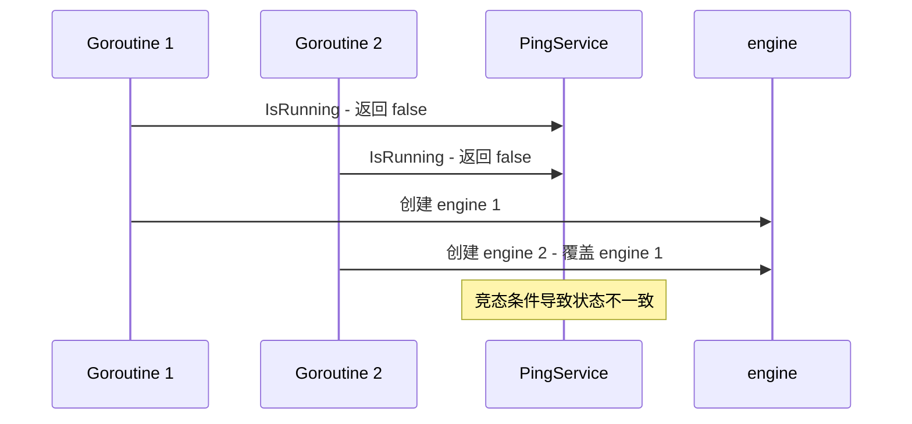
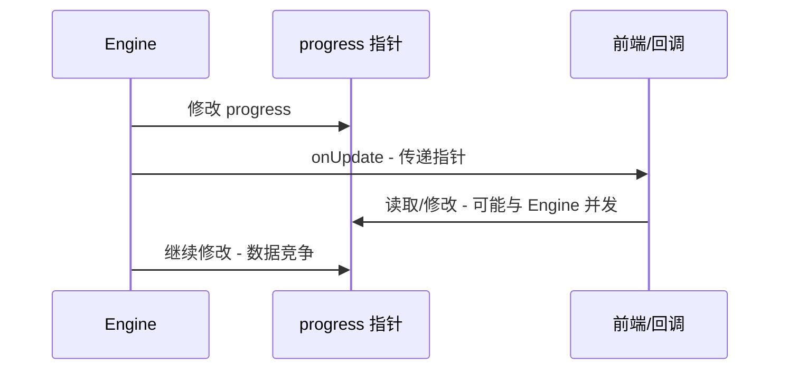
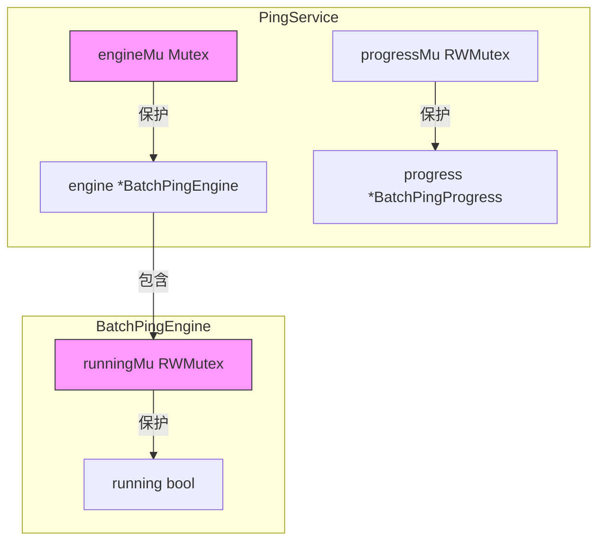
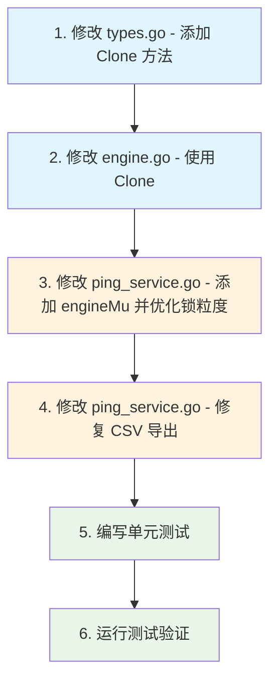

# 批量 Ping 功能 - 高优先级问题修复方案

> **文档版本**: v1.1  
> **更新日期**: 2026-04-15  
> **参考文档**: `batch_ping_final_issues.md`

---

## 一、问题概述

本文档针对 [`batch_ping_final_issues.md`](docs/batch_ping_final_issues.md) 中标识的 4 个高优先级问题提供详细修复方案。

| 序号 | 问题 | 严重程度 | 文件位置 |
|------|------|---------|---------|
| 1 | StartBatchPing 存在竞态条件 (TOCTOU) | 🔴 高 | [`ping_service.go:57-82`](internal/ui/ping_service.go:57) |
| 2 | 进度传递竞态条件 - onUpdate 传递指针 | 🔴 高 | [`engine.go:115-120`](internal/icmp/engine.go:115) |
| 3 | IsRunning 竞态条件 | 🔴 高 | [`ping_service.go:115-119`](internal/ui/ping_service.go:115) |
| 4 | CSV 导出 AvgRtt 列重复 | 🔴 高 | [`ping_service.go:153-156`](internal/ui/ping_service.go:153) |

---

## 二、修复方案详细说明

### 问题 1: StartBatchPing 存在竞态条件 (TOCTOU)

#### 问题分析

**文件**: [`internal/ui/ping_service.go:57-82`](internal/ui/ping_service.go:57)

当前代码中 `IsRunning()` 检查与设置 engine 非原子操作，存在 Time-of-check to time-of-use 竞态条件。



#### 修复策略

使用互斥锁保护关键区域（检查-设置过程），将耗时操作（IP解析、配置合并）移到锁外执行，减少锁持有时间。

#### 代码修改

**文件**: [`internal/ui/ping_service.go`](internal/ui/ping_service.go)

```go
// PingService provides batch ping functionality.
type PingService struct {
	wailsApp   *application.App
	engine     *icmp.BatchPingEngine
	progress   *icmp.BatchPingProgress
	progressMu sync.RWMutex
	engineMu   sync.Mutex      // 新增: 保护 engine 创建和状态检查
	repo       repository.DeviceRepository
}

// StartBatchPing starts a batch ping operation.
func (s *PingService) StartBatchPing(req PingRequest) (*icmp.BatchPingProgress, error) {
	// 1. 前置参数处理（无需锁，减少锁持有时间）
	ips, err := s.resolveTargets(req.Targets, req.DeviceIDs)
	if err != nil {
		return nil, err
	}

	if len(ips) == 0 {
		return nil, fmt.Errorf("未提供有效的 IP 地址")
	}

	// Limit maximum IPs
	if len(ips) > 10000 {
		return nil, fmt.Errorf("IP 数量超过限制 (最大 10000): 当前 %d 个", len(ips))
	}

	// Merge config with defaults
	config := s.mergeWithDefaultPingConfig(req.Config)

	// 2. 关键区域加锁：检查-设置过程
	s.engineMu.Lock()
	if s.isRunningLocked() {
		s.engineMu.Unlock()
		return nil, fmt.Errorf("批量 Ping 正在运行中，请先停止当前任务")
	}

	// Create new engine（在锁保护下创建）
	s.engine = icmp.NewBatchPingEngine(config)

	// 初始化 progress
	initialProgress := icmp.NewBatchPingProgress(len(ips))
	s.setProgress(initialProgress)
	s.engineMu.Unlock()  // 尽早释放锁

	// 3. 后台执行（无需锁）
	go func() {
		progress := s.engine.Run(context.Background(), ips, func(p *icmp.BatchPingProgress) {
			s.setProgress(p)
			s.emitProgress(p)
		})
		s.setProgress(progress)
		s.emitProgress(progress)
	}()

	return s.GetPingProgress(), nil
}

// isRunningLocked 在已持有 engineMu 锁的情况下检查运行状态
// 必须在 engineMu.Lock() 保护下调用
func (s *PingService) isRunningLocked() bool {
	return s.engine != nil && s.engine.IsRunning()
}

// IsRunning returns whether a ping operation is running.
func (s *PingService) IsRunning() bool {
	s.engineMu.Lock()
	defer s.engineMu.Unlock()
	return s.isRunningLocked()
}
```

#### 锁粒度优化说明

| 优化点 | 原方案 | 优化后方案 | 优势 |
|--------|--------|-----------|------|
| IP解析 | 锁内执行 | 锁外执行 | 减少锁持有时间 |
| 配置合并 | 锁内执行 | 锁外执行 | 减少锁持有时间 |
| 锁释放时机 | defer 方法结束 | 创建后立即释放 | 后台执行无锁竞争 |

#### 测试验证

```go
func TestStartBatchPingRaceCondition(t *testing.T) {
	svc := NewPingService()
	
	// 模拟并发启动
	var wg sync.WaitGroup
	var successCount int32
	var mu sync.Mutex
	var errors []string
	
	for i := 0; i < 10; i++ {
		wg.Add(1)
		go func(id int) {
			defer wg.Done()
			_, err := svc.StartBatchPing(PingRequest{
				Targets: "192.168.1.1",
			})
			if err == nil {
				atomic.AddInt32(&successCount, 1)
			} else {
				mu.Lock()
				errors = append(errors, fmt.Sprintf("goroutine %d: %v", id, err))
				mu.Unlock()
			}
		}(i)
	}
	
	wg.Wait()
	
	// 只有一个请求应该成功
	assert.Equal(t, int32(1), successCount)
	// 其他请求应该返回"正在运行中"错误
	for _, err := range errors {
		assert.Contains(t, err, "正在运行中")
	}
}
```

---

### 问题 2: 进度传递竞态条件 - onUpdate 传递指针

#### 问题分析

**文件**: [`internal/icmp/engine.go:115-120`](internal/icmp/engine.go:115)

`onUpdate(progress)` 传递的是 progress 指针，如果前端或其他消费者持有该指针并在后续修改，会导致数据竞争。



#### 修复策略

传递 progress 的深拷贝副本给回调函数，确保消费者持有独立的数据副本。

#### 代码修改

**文件**: [`internal/icmp/types.go`](internal/icmp/types.go)

```go
// Clone creates a deep copy of BatchPingProgress.
func (p *BatchPingProgress) Clone() *BatchPingProgress {
	if p == nil {
		return nil
	}
	
	clone := &BatchPingProgress{
		TotalIPs:     p.TotalIPs,
		CompletedIPs: p.CompletedIPs,
		OnlineCount:  p.OnlineCount,
		OfflineCount: p.OfflineCount,
		ErrorCount:   p.ErrorCount,
		Progress:     p.Progress,
		IsRunning:    p.IsRunning,
		StartTime:    p.StartTime,
		ElapsedMs:    p.ElapsedMs,
		Results:      make([]PingHostResult, len(p.Results)),
	}
	copy(clone.Results, p.Results)
	return clone
}
```

**文件**: [`internal/icmp/engine.go`](internal/icmp/engine.go)

```go
// Run 方法中的回调调用修改
progressMu.Lock()
progress.AddResult(result)
if onUpdate != nil {
	onUpdate(progress.Clone()) // 传递深拷贝副本
}
progressMu.Unlock()
```

完整修改后的 Run 方法关键部分：

```go
for i, ipStr := range ips {
	// Check for cancellation
	select {
	case <-runCtx.Done():
		return progress
	default:
	}

	sem <- struct{}{}
	wg.Add(1)

	go func(index int, targetIP string) {
		defer wg.Done()
		defer func() { <-sem }()

		// Check for cancellation before starting
		select {
		case <-runCtx.Done():
			return
		default:
		}

		// Parse IP
		ip := net.ParseIP(targetIP)
		if ip == nil {
			progressMu.Lock()
			progress.AddResult(PingHostResult{
				IP:        targetIP,
				Alive:     false,
				Status:    "error",
				ErrorMsg:  "Invalid IP address",
				SentCount: 1,
				RecvCount: 0,
				LossRate:  100,
			})
			if onUpdate != nil {
				onUpdate(progress.Clone()) // 深拷贝
			}
			progressMu.Unlock()
			return
		}

		// Perform ping attempts
		result := e.pingHost(runCtx, ip)

		progressMu.Lock()
		progress.AddResult(result)
		if onUpdate != nil {
			onUpdate(progress.Clone()) // 深拷贝
		}
		progressMu.Unlock()
	}(i, ipStr)
}
```

#### 测试验证

```go
func TestProgressClone(t *testing.T) {
	original := &BatchPingProgress{
		TotalIPs:     100,
		CompletedIPs: 50,
		Results: []PingHostResult{
			{IP: "192.168.1.1", Status: "online"},
			{IP: "192.168.1.2", Status: "offline"},
		},
	}

	clone := original.Clone()
	
	// 验证克隆是深拷贝
	assert.NotNil(t, clone)
	assert.NotSame(t, original, clone)
	assert.NotSame(t, original.Results, clone.Results)
	
	// 修改原始对象
	original.CompletedIPs = 75
	original.Results[0].Status = "error"
	original.Results = append(original.Results, PingHostResult{IP: "192.168.1.3"})
	
	// 克隆对象应保持不变
	assert.Equal(t, 50, clone.CompletedIPs)
	assert.Equal(t, "online", clone.Results[0].Status)
	assert.Equal(t, 2, len(clone.Results))
}

func TestProgressCloneNil(t *testing.T) {
	var p *BatchPingProgress
	clone := p.Clone()
	assert.Nil(t, clone)
}
```

---

### 问题 3: IsRunning 竞态条件

#### 问题分析

**文件**: [`internal/ui/ping_service.go:115-119`](internal/ui/ping_service.go:115)

当前代码中 `s.progress.IsRunning` 可能被 engine 在其他 goroutine 修改，存在竞态条件。

```go
func (s *PingService) IsRunning() bool {
    s.progressMu.RLock()
    defer s.progressMu.RUnlock()
    return s.progress != nil && s.progress.IsRunning  // progress.IsRunning 无锁保护
}
```

#### 修复策略

此问题已在问题 1 的修复中一并解决。通过引入 `engineMu` 锁并使用 `engine.IsRunning()` 方法（该方法内部有自己的锁保护），消除了对 `progress.IsRunning` 的直接访问。

#### 代码修改

已在问题 1 的修复中完成，关键变更：

1. 新增 `engineMu sync.Mutex` 保护 engine 创建和状态检查
2. `IsRunning()` 方法改为调用 `s.engine.IsRunning()`，该方法内部有 `runningMu` 保护
3. 移除对 `progress.IsRunning` 的直接访问

#### 架构说明



---

### 问题 4: CSV 导出 AvgRtt 列重复

#### 问题分析

**文件**: [`internal/ui/ping_service.go:153-156`](internal/ui/ping_service.go:153)

CSV 导出时 `AvgRtt` 列重复出现，第 153 行和第 156 行都是 `formatRtt(result.AvgRtt)`。

```go
row := []string{
    strconv.Itoa(i + 1),
    result.IP,
    status,
    formatRtt(result.AvgRtt), // 延迟列 - 实际是 AvgRtt
    formatRtt(result.MinRtt), // 最小延迟列
    formatRtt(result.MaxRtt), // 最大延迟列
    formatRtt(result.AvgRtt), // ❌ 平均延迟列重复
    strconv.Itoa(int(result.TTL)),
    // ...
}
```

#### 修复策略

删除重复的 `AvgRtt` 列，并确保表头与数据列对应正确。

#### 代码修改

**文件**: [`internal/ui/ping_service.go`](internal/ui/ping_service.go)

```go
// ExportPingResultCSV exports the ping results as CSV.
func (s *PingService) ExportPingResultCSV() (*PingCSVResult, error) {
	progress := s.GetPingProgress()
	if progress == nil || len(progress.Results) == 0 {
		return nil, fmt.Errorf("没有可导出的结果")
	}

	// Create CSV content with UTF-8 BOM for Excel compatibility
	var buf strings.Builder
	buf.WriteString("\xEF\xBB\xBF") // UTF-8 BOM

	writer := csv.NewWriter(&buf)

	// Write header - 修正表头
	header := []string{
		"序号",
		"IP 地址",
		"状态",
		"平均延迟 (ms)",
		"最小延迟 (ms)",
		"最大延迟 (ms)",
		"TTL",
		"发送次数",
		"接收次数",
		"丢包率 (%)",
		"错误信息",
	}
	if err := writer.Write(header); err != nil {
		return nil, err
	}

	// Write data rows
	for i, result := range progress.Results {
		status := "离线"
		if result.Status == "online" {
			status = "在线"
		} else if result.Status == "error" {
			status = "错误"
		}

		// 修正数据行 - 删除重复的 AvgRtt
		row := []string{
			strconv.Itoa(i + 1),
			result.IP,
			status,
			formatRtt(result.AvgRtt), // 平均延迟
			formatRtt(result.MinRtt), // 最小延迟
			formatRtt(result.MaxRtt), // 最大延迟
			strconv.Itoa(int(result.TTL)),
			strconv.Itoa(result.SentCount),
			strconv.Itoa(result.RecvCount),
			fmt.Sprintf("%.1f", result.LossRate),
			result.ErrorMsg,
		}
		if err := writer.Write(row); err != nil {
			return nil, err
		}
	}

	writer.Flush()
	if err := writer.Error(); err != nil {
		return nil, err
	}

	// Generate filename with timestamp
	timestamp := time.Now().Format("20060102_150405")
	fileName := fmt.Sprintf("ping_result_%s.csv", timestamp)

	return &PingCSVResult{
		FileName: fileName,
		Content:  buf.String(),
	}, nil
}
```

#### 修复前后对比

| 列序号 | 修复前表头 | 修复前数据 | 修复后表头 | 修复后数据 |
|--------|-----------|-----------|-----------|-----------|
| 1 | 序号 | i + 1 | 序号 | i + 1 |
| 2 | IP 地址 | result.IP | IP 地址 | result.IP |
| 3 | 状态 | status | 状态 | status |
| 4 | 延迟 (ms) | AvgRtt ❌ | 平均延迟 (ms) | AvgRtt ✅ |
| 5 | 最小延迟 (ms) | MinRtt | 最小延迟 (ms) | MinRtt |
| 6 | 最大延迟 (ms) | MaxRtt | 最大延迟 (ms) | MaxRtt |
| 7 | 平均延迟 (ms) | AvgRtt ❌ | TTL | TTL ✅ |
| 8 | TTL | TTL | 发送次数 | SentCount |
| 9 | 发送次数 | SentCount | 接收次数 | RecvCount |
| 10 | 接收次数 | RecvCount | 丢包率 (%) | LossRate |
| 11 | 丢包率 (%) | LossRate | 错误信息 | ErrorMsg |
| 12 | 错误信息 | ErrorMsg | - | - |

---

## 三、实施计划

### 修改文件清单

| 文件 | 修改类型 | 涉及问题 |
|------|---------|---------|
| [`internal/ui/ping_service.go`](internal/ui/ping_service.go) | 修改 | 问题 1, 3, 4 |
| [`internal/icmp/types.go`](internal/icmp/types.go) | 新增方法 | 问题 2 |
| [`internal/icmp/engine.go`](internal/icmp/engine.go) | 修改 | 问题 2 |
| [`internal/ui/ping_service_test.go`](internal/ui/ping_service_test.go) | 新增测试 | 问题 1, 3 |
| [`internal/icmp/types_test.go`](internal/icmp/types_test.go) | 新增文件 | 问题 2 |

### 实施顺序



### 详细实施步骤

#### 步骤 1: 修改 types.go

在 [`internal/icmp/types.go`](internal/icmp/types.go) 中添加 `Clone()` 方法：

```go
// Clone creates a deep copy of BatchPingProgress.
func (p *BatchPingProgress) Clone() *BatchPingProgress {
	if p == nil {
		return nil
	}
	
	clone := &BatchPingProgress{
		TotalIPs:     p.TotalIPs,
		CompletedIPs: p.CompletedIPs,
		OnlineCount:  p.OnlineCount,
		OfflineCount: p.OfflineCount,
		ErrorCount:   p.ErrorCount,
		Progress:     p.Progress,
		IsRunning:    p.IsRunning,
		StartTime:    p.StartTime,
		ElapsedMs:    p.ElapsedMs,
		Results:      make([]PingHostResult, len(p.Results)),
	}
	copy(clone.Results, p.Results)
	return clone
}
```

#### 步骤 2: 修改 engine.go

在 [`internal/icmp/engine.go`](internal/icmp/engine.go) 中修改回调调用：

- 第 106-108 行：`onUpdate(progress)` 改为 `onUpdate(progress.Clone())`
- 第 117-119 行：`onUpdate(progress)` 改为 `onUpdate(progress.Clone())`

#### 步骤 3: 修改 ping_service.go - 添加 engineMu 并优化锁粒度

在 [`internal/ui/ping_service.go`](internal/ui/ping_service.go) 中：

1. 在 `PingService` 结构体中添加 `engineMu sync.Mutex` 字段
2. 修改 `StartBatchPing` 方法，将耗时操作移到锁外
3. 添加 `isRunningLocked()` 私有方法
4. 修改 `IsRunning()` 方法使用 `engineMu` 保护

#### 步骤 4: 修改 ping_service.go - 修复 CSV 导出

在 [`internal/ui/ping_service.go`](internal/ui/ping_service.go) 的 `ExportPingResultCSV` 方法中：

1. 修正表头数组，删除重复列
2. 修正数据行数组，删除重复的 `AvgRtt`

#### 步骤 5: 编写单元测试

创建测试用例验证修复效果：

1. `TestStartBatchPingRaceCondition` - 验证并发启动只有一个成功
2. `TestProgressClone` - 验证 Clone 方法深拷贝正确性
3. `TestProgressCloneNil` - 验证 Clone 对 nil 的处理
4. `TestIsRunningThreadSafe` - 验证 IsRunning 方法线程安全

#### 步骤 6: 运行测试验证

```powershell
# 运行所有测试
go test ./internal/icmp/... ./internal/ui/... -v -race

# 编译验证
.\build.bat
```

---

## 四、风险评估

| 风险项 | 影响程度 | 缓解措施 |
|--------|---------|---------|
| Clone 方法增加内存分配 | 中 | 仅在回调时克隆，频率可控；可考虑对象池优化 |
| 接口变更影响调用方 | 低 | IsRunning 公开接口签名不变 |
| 锁粒度调整后并发行为变化 | 低 | 通过单元测试验证并发安全性 |

---

## 五、验收标准

1. ✅ 并发调用 `StartBatchPing` 只有一个成功启动
2. ✅ 回调函数接收到的 progress 对象可安全修改，不影响 engine 内部状态
3. ✅ `IsRunning()` 方法在并发环境下返回正确状态
4. ✅ CSV 导出列数与表头一致，无重复列
5. ✅ 所有单元测试通过
6. ✅ 使用 `-race` 标志运行测试无数据竞争报告

---

## 六、附录

### A. 相关文件路径

- [`internal/ui/ping_service.go`](internal/ui/ping_service.go) - Ping 服务主文件
- [`internal/icmp/engine.go`](internal/icmp/engine.go) - ICMP 引擎
- [`internal/icmp/types.go`](internal/icmp/types.go) - 类型定义
- [`internal/ui/ping_service_test.go`](internal/ui/ping_service_test.go) - 服务测试

### B. 参考资料

- [Go 并发模式：Context](https://go.dev/blog/context)
- [Go sync.Mutex 源码分析](https://pkg.go.dev/sync)
- [TOCTOU 竞态条件](https://en.wikipedia.org/wiki/Time-of-check_to_time-of-use)
