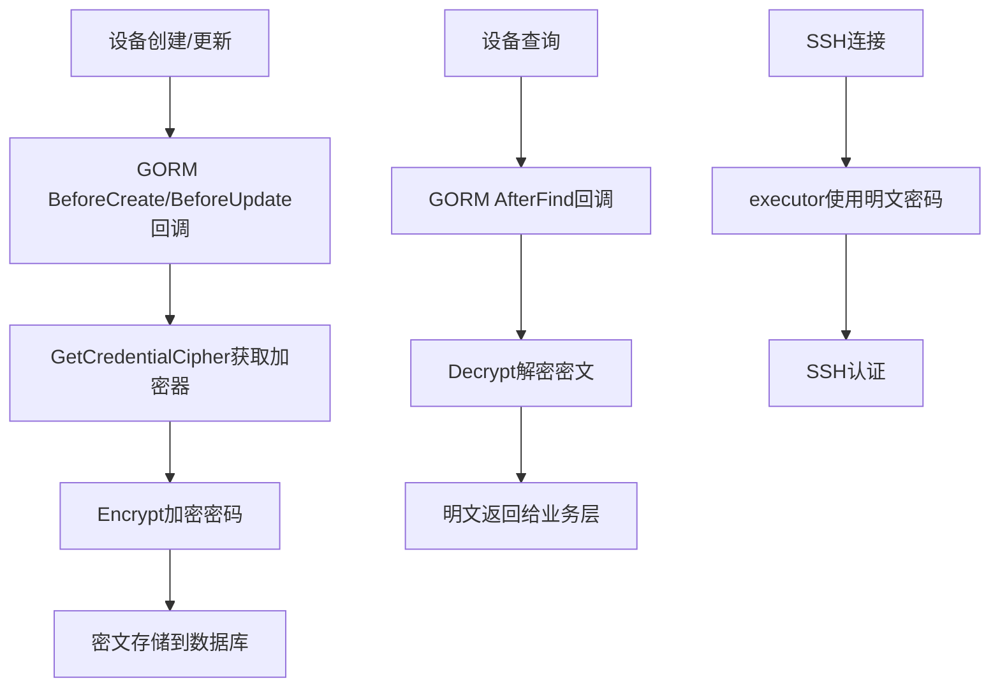
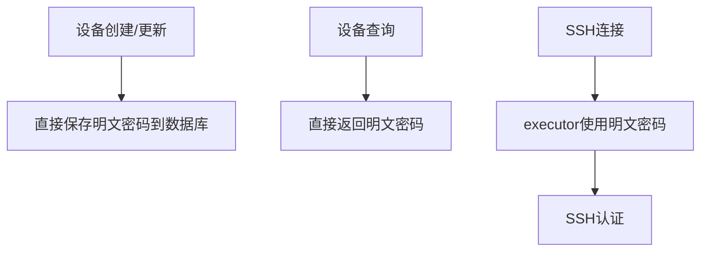

# 设备密码加密功能清除计划

> **说明**: 本计划适用于新建项目场景，无需考虑旧数据兼容和迁移。

---

## 1. 当前加密流程梳理

### 1.1 加密架构概览



### 1.2 核心加密组件

| 组件                            | 文件路径                               | 说明              |
| ------------------------------- | -------------------------------------- | ----------------- |
| `CredentialCipher`              | `internal/config/crypto.go`            | AES-256-GCM加密器 |
| `GetCredentialCipher()`         | `internal/config/crypto.go:41`         | 单例获取加密器    |
| `Encrypt()`                     | `internal/config/crypto.go:105`        | 加密方法          |
| `Decrypt()`                     | `internal/config/crypto.go:142`        | 解密方法          |
| `IsEncrypted()`                 | `internal/config/crypto.go:198`        | 判断是否已加密    |
| `registerCredentialCallbacks()` | `internal/config/db.go:106`            | GORM回调注册      |
| `.credential_key`               | `Dist/netWeaverGoData/.credential_key` | 密钥文件          |

### 1.3 涉及文件清单

#### 必须修改的文件

| 文件                            | 涉及内容     | 操作                                          |
| ------------------------------- | ------------ | --------------------------------------------- |
| `internal/config/crypto.go`     | 完整加密模块 | **删除整个文件**                              |
| `internal/config/db.go`         | GORM回调注册 | 删除`registerCredentialCallbacks()`函数及调用 |
| `internal/ui/device_service.go` | 密码脱敏处理 | 简化逻辑，无需清空密码                        |
| `internal/ui/query_service.go`  | 密码脱敏处理 | 简化逻辑，无需清空密码                        |

#### 无需修改的文件（仅使用Password字段，无加密逻辑）

| 文件                            | 说明                               |
| ------------------------------- | ---------------------------------- |
| `internal/models/models.go`     | `Password`字段保持不变，仍用于存储 |
| `internal/config/config.go`     | 仅trim空格，无加密操作             |
| `internal/executor/executor.go` | 使用明文密码                       |
| `internal/sshutil/client.go`    | 使用明文密码                       |
| `internal/engine/engine.go`     | 使用明文密码                       |
| `internal/discovery/runner.go`  | 使用明文密码                       |

---

## 2. 清除执行步骤

### 步骤1: 删除加密模块文件

**文件**: `internal/config/crypto.go`

**操作**: 直接删除整个文件

**影响**:

- 移除 AES-256-GCM 加密实现
- 移除密钥文件管理逻辑
- 移除 `.credential_key` 文件生成

---

### 步骤2: 移除数据库回调

**文件**: `internal/config/db.go`

**修改内容**:

1. **删除导入** (如不再需要):

   ```go
   // 删除整个文件后，检查db.go中是否有未使用的导入
   ```

2. **删除回调注册函数** (lines 105-175):
   - 删除 `registerCredentialCallbacks()` 函数
   - 删除 `devicePasswordContext` 结构体 (lines 17-20)

3. **移除函数调用** (line 98):
   ```go
   // 删除这行
   registerCredentialCallbacks(db)
   ```

---

### 步骤3: 简化设备服务层

**文件**: `internal/ui/device_service.go`

**修改内容**:

1. **简化 `ListDevices()` 函数** (lines 28-38):

   ```go
   // 修改前
   func (s *DeviceService) ListDevices() ([]models.DeviceAsset, error) {
       devices, err := config.LoadDeviceAssets()
       if err != nil {
           return nil, err
       }
       // 脱敏：清空密码字段
       for i := range devices {
           devices[i].Password = ""
       }
       return devices, nil
   }

   // 修改后 - 直接返回，不清空密码（作为新建项目，无需脱敏）
   func (s *DeviceService) ListDevices() ([]models.DeviceAsset, error) {
       return config.LoadDeviceAssets()
   }
   ```

2. **可选: 简化 `GetDeviceByID()`**:
   ```go
   // 如不需要DeviceAssetResponse包装，可直接返回DeviceAsset
   // 当前实现可保留，因为前端编辑功能需要密码
   ```

---

### 步骤4: 简化查询服务层

**文件**: `internal/ui/query_service.go`

**修改内容** (lines 121-124):

```go
// 修改前
// 脱敏：清空密码字段
for i := range devices {
    devices[i].Password = ""
}

// 修改后 - 直接删除这段循环
// （作为新建项目，查询结果包含密码，由前端决定是否展示）
```

---

## 3. 清理后的架构



---

## 4. 清理检查清单

- [ ] 删除 `internal/config/crypto.go` 文件
- [ ] 删除 `internal/config/db.go` 中的 `registerCredentialCallbacks()` 函数
- [ ] 删除 `internal/config/db.go` 中的 `devicePasswordContext` 结构体
- [ ] 删除 `internal/config/db.go` 第98行的回调注册调用
- [ ] 简化 `internal/ui/device_service.go` 的 `ListDevices()` 函数
- [ ] 简化 `internal/ui/query_service.go` 的密码脱敏循环
- [ ] 检查 `go.mod` 中是否还有未使用的加密依赖（如没有可跳过）
- [ ] 编译验证: `go build ./...`
- [ ] 运行测试: `go test ./...`

---

## 5. 清理后保留的密码处理逻辑

以下逻辑**保留不变**，因为它们仅处理明文密码：

| 文件                                     | 保留的功能                                                    |
| ---------------------------------------- | ------------------------------------------------------------- |
| `internal/config/config.go:135`          | `normalizeDevice()` 中的 `strings.TrimSpace(device.Password)` |
| `internal/config/config.go:270-275`      | `UpdateDevice()` 中的密码非空校验                             |
| `internal/config/config.go:393-399`      | `UpdateDevices()` 中的密码保护逻辑                            |
| `internal/models/models.go:17`           | `DeviceAsset.Password` 字段定义                               |
| `internal/models/models.go:32-42`        | `DeviceAssetResponse` 结构体（如前端需要）                    |
| `internal/executor/executor.go:34,54,79` | 明文密码使用                                                  |
| `internal/sshutil/client.go:57,495-500`  | SSH认证明文密码                                               |

---

## 6. 附录: 密钥文件清理

虽然程序不再生成 `.credential_key` 文件，但建议手动清理：

```bash
# 删除旧的密钥文件（如存在）
rm Dist/netWeaverGoData/.credential_key
```

---

## 7. 影响评估

### 功能影响

- ✅ 设备创建/更新: 正常，存储明文密码
- ✅ 设备查询: 正常，返回明文密码
- ✅ SSH连接: 正常，使用明文密码
- ✅ 前端编辑: 正常，可获取明文密码

### 安全性变更

- ⚠️ 数据库存储的密码为明文（符合新建项目需求）
- ⚠️ 不再需要密钥文件管理
- ✅ 减少了加密相关的复杂度和潜在故障点

---

## 8. 实施建议

1. **按顺序执行** 步骤1-4
2. **每步完成后编译验证**
3. **最后执行完整测试**
4. **提交代码前检查 `go mod tidy`**
