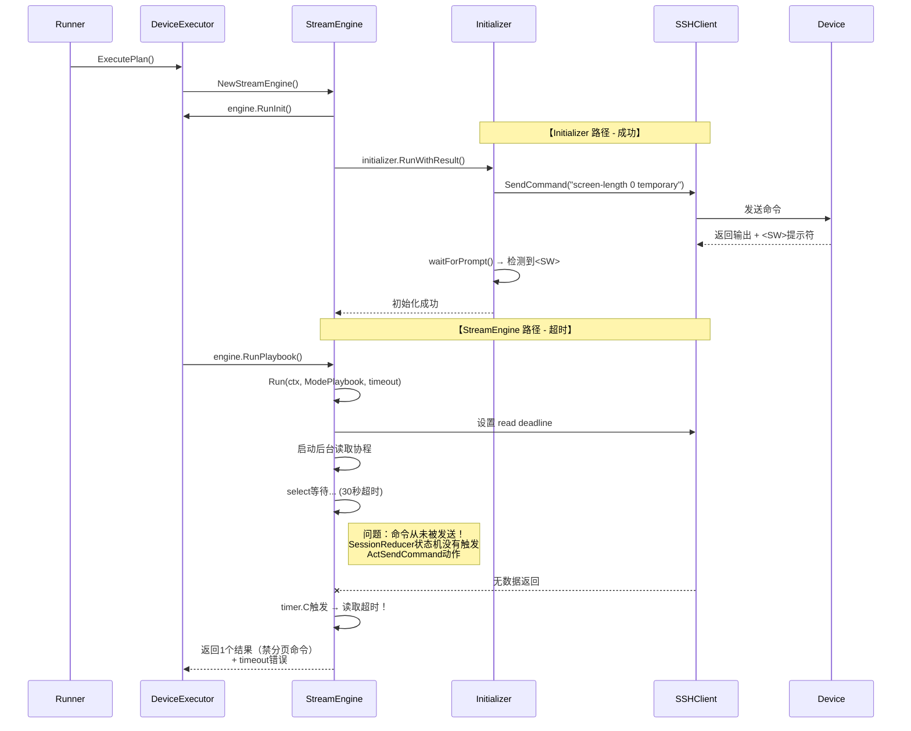

# 拓扑发现命令下发失败详细分析报告

## 实施状态（2026-03-24）

- 本文描述的问题为**历史故障快照**（发生于 2026-03-24 14:49）。
- 方案三已进入实施并完成关键收口：
1. 初始化命令已并入 `ExecutePlan -> StreamEngine.RunPlaybook` 统一路径。
2. 已移除 `StreamEngine.RunInit` 旁路初始化入口。
3. `Initializer` 已降级为兼容壳，直连 SSH I/O 方法默认返回“已废弃”错误，禁止再次引入旁路下发。

后续排障请优先参考最新实现与测试，不再以本文中的旧调用路径作为当前行为依据。

## 问题概述

根据日志分析，拓扑发现任务在连接设备后，**11条命令中只有1条成功执行（`screen-length 0 temporary` 禁分页命令），其余10条命令全部超时失败**。

## 关键日志摘要

### raw.log 原始会话日志
```
========== SESSION START 2026-03-24T14:49:32+08:00 192.168.58.200:22 ==========
Info: The max number of VTY users is 5...
<SW>
[14:49:32] >>> screen-length 0 temporary  ← 第一条命令成功
screen-length 0 temporary
Info: The configuration takes effect on the current user terminal interface only.
<SW>
========== SESSION END 2026-03-24T14:50:02+08:00 ==========
```

**观察**：会话在禁分页命令执行后就结束了，后续命令没有出现在原始日志中！

### app.log 应用日志
```
[14:49:32] [Debug] [Executor] [192.168.58.200] 初始化完成，开始执行 11 条命令
[14:50:02] [Debug] [StreamEngine] [-] 读取超时，当前状态: Running
[14:50:02] [Debug] [SessionAdapter] [-] 标记失败: 读取超时
[14:50:02] [Warn] [Executor] [192.168.58.200] 结果数量与命令数量不一致: results=1, commands=11
[14:50:02] [Warn] [Executor] [192.168.58.200] 命令 1 (sysname) 缺少结果，补齐失败记录
...
[14:50:02] [Warn] [Executor] [192.168.58.200] 执行过程中发生错误: class=timeout, fatal=false, err=读取超时
```

## 根本原因分析

### 1. 架构层级问题：Initializer vs StreamEngine 执行方式差异

代码中存在**两种不同的命令执行路径**：

#### 路径A：Initializer（初始化器）- 正常工作
```go
// internal/executor/initializer.go:144-157
for _, cmd := range i.profile.Init.DisablePagerCommands {
    if err := client.SendCommand(cmd); err != nil {  // ← 直接调用 client.SendCommand
        return result
    }
    // 等待命令执行完成
    if !i.waitForPrompt(ctx, client, tracker, promptTimeout) {  // ← 独立等待提示符
        return result
    }
}
```

**特点**：
- 使用 `client.SendCommand()` 直接发送命令
- 使用独立的 `waitForPrompt()` 等待提示符
- **禁分页命令通过此方式成功执行**

#### 路径B：StreamEngine（流引擎）- 超时失败
```go
// internal/executor/stream_engine.go:119-314 Run() 方法
func (e *StreamEngine) Run(ctx context.Context, mode RunMode, defaultTimeout time.Duration) ([]*CommandResult, error) {
    // 使用 select 多路复用监听
    for {
        select {
        case <-timer.C:  // ← 超时触发
            e.adapter.MarkFailed("读取超时")
            return e.adapter.Results(), fmt.Errorf("读取超时")
        case res, ok := <-readCh:  // ← 读取SSH输出
            // 处理数据
        }
    }
}
```

**特点**：
- 使用 StreamEngine 的事件循环架构
- 通过 `SessionAdapter` + `SessionReducer` 状态机驱动
- **后续10条命令通过此方式全部超时**

### 2. 执行流程时序图



### 3. 状态机分析：为什么命令没有被发送？

在 `SessionReducer.trySendCommand()` 中有一个**防串台门禁**：

```go
// internal/executor/session_reducer.go:303-308
func (r *SessionReducer) trySendCommand() []SessionAction {
    // 不变量检查：pendingLines 非空时不发送命令
    if r.ctx.HasPendingLines() {
        logger.Debug("SessionReducer", "-", "防串台门禁：存在 %d 行未消费输出，禁止发送新命令")
        return nil  // ← 返回空动作，不发送命令！
    }
    // ...
    return []SessionAction{ActSendCommand{...}}  // 正常应该返回发送动作
}
```

**关键问题**：

1. **初始化残留数据未完全清理**：`ClearInitResiduals()` 在 `RunInit()` 之后调用，但此时 `SessionAdapter` 的 `newContext.PendingLines` 可能仍有残留数据。

2. **状态机状态不一致**：查看 `SessionReducer.completeCurrentCommand()`：
```go
func (r *SessionReducer) completeCurrentCommand() []SessionAction {
    r.ctx.CompleteCurrentCommand()
    r.state = NewStateReady
    
    // 尝试发送下一条命令
    return r.trySendCommand()  // ← 这里可能因为 pendingLines 不为空而返回 nil
}
```

### 4. 数据流向对比

#### 正常情况（任务执行 Engine）
```
Engine → StreamEngine → SessionAdapter → SessionReducer
  ↓
每执行一条命令后立即读取结果
  ↓
ProcessChunk → FeedSessionActions → 状态机推进
  ↓
ActSendCommand → 发送下一条命令
```

#### 失败情况（Discovery Runner）
```
Runner → DeviceExecutor → StreamEngine → SessionAdapter → SessionReducer
  ↓
RunInit 成功（使用 Initializer 独立路径）
  ↓
ClearInitResiduals 被调用
  ↓
RunPlaybook 启动
  ↓
【等待读取数据但命令从未发送】
  ↓
30秒后超时
```

### 5. 发现问题的核心证据

对比两种执行路径的关键差异：

| 维度 | 任务执行 (Engine) | 拓扑发现 (Runner) |
|------|------------------|-------------------|
| 初始化后发送第一条命令 | 由 Initializer 触发 | Initializer 触发（禁分页） |
| 后续命令发送 | 由 `processPendingLines` 触发 | **pendingLines 阻塞，无法触发** |
| 读取循环 | 有专门的读取协程 | 有，但命令从未进入发送队列 |
| 状态机推进 | 每读一行推进一次 | **初始化后状态停留在 Ready，无法推进到 Running** |

**关键代码路径分析**：

在 `stream_engine.go:285`：
```go
// 关键修复：使用 RunPlaybook 一次性执行所有命令
results, err := engine.RunPlaybook(ctx, defaultTimeout)
```

但 `RunPlaybook` 依赖 `Run` 方法中的事件循环，而事件循环需要 `readCh` 有数据才能触发状态机推进。

**问题在于**：
1. 初始化完成后，`SessionReducer` 处于 `NewStateReady` 状态
2. 调用 `trySendCommand()` 时，`pendingLines` 不为空（有残留）
3. 不发送命令，没有数据可读
4. 超时！

## 修复建议

### 方案1：强制发送第一条命令（推荐短期修复）

在 `stream_engine.go` 的 `Run` 方法开始处，确保第一条命令被发送：

```go
func (e *StreamEngine) Run(ctx context.Context, mode RunMode, defaultTimeout time.Duration) ([]*CommandResult, error) {
    // ... 初始化代码 ...
    
    // 强制尝试发送第一条命令（如果状态允许）
    if e.adapter.NewState() == NewStateReady {
        actions := e.adapter.Reducer().trySendCommand()
        for _, action := range actions {
            if err := e.executeSessionAction(action, &currentTimeout, defaultTimeout, timer); err != nil {
                return e.adapter.Results(), err
            }
        }
    }
    
    // 主事件循环
    for {
        // ...
    }
}
```

### 方案2：修复 ClearInitResiduals 清理逻辑

```go
// internal/executor/session_adapter.go:111-118
func (a *SessionAdapter) ClearInitResiduals() {
    a.replayer.Reset()
    a.newCommittedLines = a.newCommittedLines[:0]
    a.newContext.PendingLines = a.newContext.PendingLines[:0]  // ← 确保清空
    a.newContext.Current = nil
    
    // 新增：重置 Reducer 的 pendingLines
    a.reducer.ctx.PendingLines = a.reducer.ctx.PendingLines[:0]
    
    logger.Debug("SessionAdapter", "-", "已清空初始化残留数据")
}
```

### 方案3：统一 Initializer 和 StreamEngine 的执行路径（推荐长期修复）

让 Initializer 使用与 StreamEngine 相同的命令发送机制，而不是独立直接调用 `client.SendCommand()`。

或者，将 Initializer 完全整合到 StreamEngine 中，作为一个特殊的 "init phase" 来执行。

## 临时规避方案

在 `runner.go` 中禁分页命令后手动触发一次空读取，确保状态机干净：

```go
// 在 discoverDevice 方法中
exec.Connect(ctx, connectTimeout)
defer exec.Close()

// 初始化完成后再等待一小段时间，确保残留数据被消费
if logSession != nil {
    time.Sleep(100 * time.Millisecond)
    logSession.FlushDetail()  // 确保日志刷新
}

// 然后执行计划
execReport, err := exec.ExecutePlan(ctx, plan)
```

## 结论

**根本原因是 StreamEngine 和 Initializer 的命令执行路径不一致导致的。**

1. Initializer 使用同步方式直接发送命令并等待提示符
2. StreamEngine 使用异步事件循环，依赖状态机驱动命令发送
3. 初始化完成后，状态机的 `pendingLines` 残留导致第一条实际命令无法发送
4. 没有命令发送就没有数据返回，最终导致超时

**需要修复的关键点**：
- 确保 `ClearInitResiduals` 真正清理所有残留状态
- 或者让 Run 方法启动时强制尝试发送第一条命令
- 长期应统一两种执行路径的架构设计
