# 拓扑发现任务崩溃问题分析报告

## 问题现象

执行拓扑发现任务时，程序直接崩溃，app.log 日志中没有任何报错信息。而在任务执行大屏中执行相同任务可以正常运行。

## 日志分析

从 `app.log` 中可以看到最后的日志记录：

```
[2026/03/23 21:57:19] [Debug] [StreamEngine] [-] 读取超时，当前状态: InitAwaitPrompt
[2026/03/23 21:57:19] [Debug] [SessionAdapter] [-] 标记失败: 读取超时
```

程序在此之后直接崩溃，没有任何后续日志。

## 根本原因分析

### 两种执行方式的对比

#### 任务执行大屏（Engine）的执行方式

在 [`internal/engine/engine.go:558-569`](internal/engine/engine.go:558) 中：

```go
exec := executor.NewDeviceExecutor(dev.IP, dev.Port, dev.Username, dev.Password, workerEventBus, suspendHandler)
exec.SetLogSession(logSession)
exec.SetAlgorithms(&e.Settings.SSHAlgorithms)  // ✅ 设置了 SSH 算法配置

// 设置设备画像
if dev.Vendor != "" {
    profile := config.GetDeviceProfile(dev.Vendor)
    if profile != nil {
        exec.DeviceProfile = profile  // ✅ 设置了设备画像
    }
}
```

#### 拓扑发现（Discovery Runner）的执行方式

在 [`internal/discovery/runner.go:443`](internal/discovery/runner.go:443) 中：

```go
exec := executor.NewDeviceExecutor(device.IP, device.Port, device.Username, device.Password, nil, nil)
// ❌ 没有设置 SSH 算法配置 (Algorithms)
// ❌ 没有设置设备画像 (DeviceProfile)
// ❌ EventBus 为 nil
```

### 关键差异

| 配置项         | Engine（任务执行大屏） | Discovery Runner（拓扑发现） |
| -------------- | ---------------------- | ---------------------------- |
| SSH 算法配置   | ✅ 已设置              | ❌ 未设置                    |
| 设备画像       | ✅ 已设置              | ❌ 未设置                    |
| EventBus       | ✅ 非 nil              | ❌ nil                       |
| SuspendHandler | ✅ 已设置              | ❌ nil                       |

### 问题根源

1. **SSH 算法配置缺失**：
   - 在 [`internal/executor/executor.go:108`](internal/executor/executor.go:108) 中，`e.Algorithms` 为 nil
   - SSH 客户端会使用默认算法配置，可能与某些设备的 SSH 服务器不兼容
   - 这可能导致连接建立后，数据流处理异常

2. **设备画像缺失**：
   - 没有设备画像时，`StreamEngine.RunInit()` 会执行"简化初始化"
   - 简化初始化在 [`internal/executor/stream_engine.go:603`](internal/executor/stream_engine.go:603) 的 `waitAndClearInitResidual` 中等待提示符
   - 由于 SSH 算法配置不正确，可能导致数据流异常，无法正确检测提示符

3. **EventBus 为 nil**：
   - 虽然 StreamEngine 中有 `EventBus != nil` 的检查，但不会导致 panic
   - 但这意味着无法追踪执行过程中的事件

### 为什么日志没有报错

1. **崩溃发生在 goroutine 中**：
   - Discovery Runner 在 [`internal/discovery/runner.go:340`](internal/discovery/runner.go:340) 的 goroutine 中执行设备发现
   - 如果 goroutine 中发生 panic 且没有 recover，程序会直接崩溃

2. **缺少 panic recovery**：
   - 在 [`internal/discovery/runner.go:340-344`](internal/discovery/runner.go:340) 的 goroutine 中：

   ```go
   go func(device models.DeviceInfo) {
       defer func() {
           <-sem
           wg.Done()
       }()
       // ❌ 没有 recover() 来捕获 panic
   ```

3. **可能的 panic 来源**：
   - SSH 连接或读取过程中可能发生空指针解引用
   - 状态机处理异常数据时可能发生未预期的错误

## 解决方案

### 方案一：修复 Discovery Runner（推荐）

在 [`internal/discovery/runner.go`](internal/discovery/runner.go) 的 `discoverDevice` 方法中添加缺失的配置：

```go
func (r *Runner) discoverDevice(ctx context.Context, taskID string, device models.DeviceInfo, vendor string, profile *VendorCommandProfile, connectTimeout time.Duration, taskCommandTimeout time.Duration) error {
    // ... 现有代码 ...

    // 创建执行器
    exec := executor.NewDeviceExecutor(device.IP, device.Port, device.Username, device.Password, nil, nil)

    // 【修复】设置 SSH 算法配置
    if settings := config.GetGlobalSettings(); settings != nil {
        exec.SetAlgorithms(&settings.SSHAlgorithms)
    }

    // 【修复】设置设备画像
    if vendor != "" {
        if deviceProfile := config.GetDeviceProfile(vendor); deviceProfile != nil {
            exec.DeviceProfile = deviceProfile
        }
    }

    // ... 后续代码 ...
}
```

### 方案二：添加 panic recovery

在 goroutine 中添加 panic recovery：

```go
go func(device models.DeviceInfo) {
    defer func() {
        if r := recover(); r != nil {
            logger.Error("Discovery", device.IP, "设备发现 panic: %v", r)
            r.updateDeviceError(taskID, device.IP, fmt.Sprintf("内部错误: %v", r))
        }
        <-sem
        wg.Done()
    }()
    // ... 原有代码 ...
}(dev)
```

### 方案三：统一执行器创建逻辑

创建一个统一的执行器工厂方法，确保所有场景都使用相同的配置：

```go
// 在 executor 包中添加
func NewDeviceExecutorWithDefaults(ip string, port int, user, pass string, vendor string, settings *models.GlobalSettings) *DeviceExecutor {
    exec := NewDeviceExecutor(ip, port, user, pass, nil, nil)

    if settings != nil {
        exec.SetAlgorithms(&settings.SSHAlgorithms)
    }

    if vendor != "" {
        if profile := config.GetDeviceProfile(vendor); profile != nil {
            exec.DeviceProfile = profile
        }
    }

    return exec
}
```

## 执行流程对比图

```mermaid
flowchart TB
    subgraph Engine[任务执行大屏 - Engine]
        E1[创建 DeviceExecutor]
        E2[设置 SSH 算法配置]
        E3[设置设备画像]
        E4[设置 EventBus]
        E5[执行命令]
        E6[正常完成]
        E1 --> E2 --> E3 --> E4 --> E5 --> E6
    end

    subgraph Discovery[拓扑发现 - Discovery Runner]
        D1[创建 DeviceExecutor]
        D2[❌ 未设置 SSH 算法配置]
        D3[❌ 未设置设备画像]
        D4[❌ EventBus 为 nil]
        D5[执行命令]
        D6[状态机异常]
        D7[程序崩溃]
        D1 --> D2 --> D3 --> D4 --> D5 --> D6 --> D7
    end
```



## 建议优先级

1. **高优先级**：方案一 - 修复 Discovery Runner 中缺失的配置
2. **中优先级**：方案二 - 添加 panic recovery 防止程序崩溃
3. **低优先级**：方案三 - 统一执行器创建逻辑（重构优化）

## 总结

拓扑发现任务崩溃的根本原因是 Discovery Runner 创建的执行器缺少必要的配置（SSH 算法配置和设备画像），导致 SSH 连接或数据流处理异常。由于 goroutine 中缺少 panic recovery，异常直接导致程序崩溃而没有记录任何错误日志。

修复方案是在 Discovery Runner 中添加与 Engine 相同的配置设置，并添加 panic recovery 机制以提高系统健壮性。
