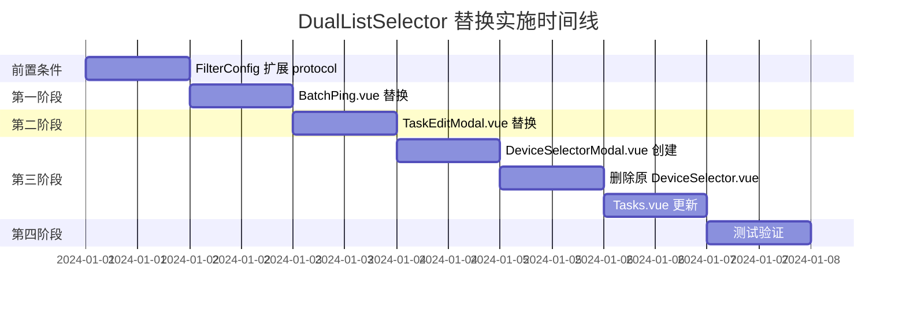

# DualListSelector 组件替换实施方案

## 概述

本文档详细规划了使用 `DualListSelector` 组件替换现有设备选择功能的分阶段实施方案。所有替换均采用**弹窗模式**。

### 前置条件：扩展 DualListSelector 支持 protocol 筛选

> **问题**: 当前 [`FilterConfig`](frontend/src/components/common/DualListSelector/types/dualListSelector.ts:22) 的 `type` 仅支持 `"group" | "tag" | "all"`，而 [`DeviceSelector.vue`](frontend/src/components/task/DeviceSelector.vue:157) 还需要 `"protocol"` 筛选模式。
>
> **方案**: 扩展 `FilterConfig.type` 支持 `"protocol"`，在 [`useDualListSelection.ts`](frontend/src/components/common/DualListSelector/composables/useDualListSelection.ts) 的筛选逻辑中增加 protocol 分支。

**需修改的文件**:

| 文件 | 修改内容 |
|------|----------|
| [`types/dualListSelector.ts`](frontend/src/components/common/DualListSelector/types/dualListSelector.ts) | `FilterConfig.type` 添加 `"protocol"` |
| [`useDualListSelection.ts`](frontend/src/components/common/DualListSelector/composables/useDualListSelection.ts) | `filteredSourceData` 筛选逻辑增加 protocol 分支 |
| [`DualListSelector.vue`](frontend/src/components/common/DualListSelector/DualListSelector.vue) | 筛选按钮区域动态生成时支持 protocol 选项 |

**类型修改**:
```typescript
// types/dualListSelector.ts
export interface FilterConfig {
  type: "group" | "tag" | "protocol" | "all";  // 添加 protocol
  label: string;
  options?: { label: string; value: string; count?: number }[];
}
```

**筛选逻辑修改**:
```typescript
// useDualListSelection.ts - filteredSourceData computed
const filteredSourceData = computed(() => {
  let result = sourceData.value;

  // 应用筛选
  if (currentFilter.value !== "all" && filterValue.value) {
    result = result.filter(
      (item) => item[currentFilter.value] === filterValue.value,
    );
  }
  // ... 搜索逻辑不变
  return result;
});
```

> 注意：现有筛选逻辑 `item[currentFilter.value]` 已是动态属性访问，只要 `ListItem` 中包含对应字段（如 `protocol`），无需额外修改筛选逻辑本身。只需在 `FilterConfig` 中添加 protocol 类型，并在使用方传入 protocol 筛选配置即可。

---

## 第一阶段：BatchPing.vue 设备选择弹窗替换

### 1.1 当前实现分析

**文件**: [`frontend/src/views/Tools/BatchPing.vue`](frontend/src/views/Tools/BatchPing.vue:910-988)

**当前实现**:
- 使用 Teleport + 自定义弹窗
- 简单的 checkbox 列表选择设备
- 支持搜索过滤
- 支持全选

**数据结构**:
```typescript
// 设备数据 - 来自 Wails 自动生成的绑定
// DeviceAssetListItem.id 是 number 类型
import type { DeviceAssetListItem } from '@/bindings/github.com/NetWeaverGo/core/internal/models/models'

// 实际字段: id(number), ip, displayName, vendor, protocol, group, tags 等

// 选择状态 - id 为 number 类型
const selectedDeviceIds = ref<number[]>([])
```

### 1.2 替换方案

**改动点**:
1. 删除现有的设备选择弹窗代码（第910-988行）
2. 引入 `DualListSelector` 组件
3. 添加触发按钮，点击打开弹窗

**数据映射**:
```typescript
// DeviceAssetListItem -> ListItem
// 注意: ListItem 支持 [key: string]: any 索引签名，
// 额外字段(ip, vendor)会被保留，可用于搜索和显示，
// 但确认回调中应通过 key 查找原始设备数据
const sourceData = computed<ListItem[]>(() =>
  devices.value.map(d => ({
    key: d.id,                    // number -> ItemKey(string|number)
    label: d.displayName,
    description: `${d.ip} · ${d.vendor}`,
    ip: d.ip,                     // 保留用于 searchFields 搜索
    vendor: d.vendor,             // 保留用于分组筛选
    group: d.group || '未分组',   // 保留用于分组筛选
    protocol: d.protocol,         // 保留用于协议筛选
    tags: d.tags                  // 保留用于标签筛选
  }))
)

// 初始已选数据（空列表，BatchPing 每次重新选择）
const targetData = ref<ListItem[]>([])
```

**确认回调**:
```typescript
// 关键：通过 key(id) 查找原始设备，调用后端服务获取 IP
const handleDeviceConfirm = async (items: ListItem[]) => {
  // 从确认项中提取设备 ID
  const selectedIds = items.map(item => item.key as number)

  if (selectedIds.length === 0) {
    toast.warning('请选择至少一个设备')
    return
  }

  try {
    // 复用现有的后端服务：通过 ID 获取 IP 列表
    const ips = await PingService.GetDeviceIPsForPing(selectedIds)
    if (ips && ips.length > 0) {
      const existing = targetInput.value.trim()
      const newIps = ips.join('\n')
      targetInput.value = existing ? existing + '\n' + newIps : newIps
      toast.success(`已导入 ${ips.length} 个设备 IP`)
    } else {
      toast.warning('所选设备没有有效的 IP 地址')
    }
  } catch (err) {
    toast.error('导入设备 IP 失败')
    console.error('Failed to import devices:', err)
  }
}
```

### 1.3 实施步骤

| 步骤 | 描述 | 涉及代码行 |
|------|------|-----------|
| 1 | 添加 DualListSelector 导入 | script 部分 |
| 2 | 添加 showDeviceSelector ref | script 部分 |
| 3 | 添加 sourceData/targetData computed | script 部分 |
| 4 | 添加 handleDeviceConfirm 方法 | script 部分 |
| 5 | 替换弹窗模板代码 | template 第910-988行 |
| 6 | 删除原有的设备选择相关代码（selectedDeviceIds, deviceSearchQuery, filteredDevices, importDevices 等） | script 部分 |

### 1.4 预期效果

- 弹窗式设备选择
- 支持分组筛选（按厂商/分组）
- 支持搜索（名称、IP、描述）
- 双栏布局，已选/未选清晰分离

---

## 第二阶段：TaskEditModal.vue 设备选择替换

### 2.1 当前实现分析

**文件**: [`frontend/src/components/task/TaskEditModal.vue`](frontend/src/components/task/TaskEditModal.vue:298-345)

**当前实现**:
- 内嵌式 grid 布局 checkbox
- 无弹窗，直接在表单内选择
- 显示设备 IP、分组、厂商、标签

**数据结构**:
```typescript
// 表单数据
const groupForm = reactive({
  commandGroupId: '',
  deviceIDs: [] as string[]   // 注意: 实际存储的是 device.id 的字符串形式
})

// 设备数据 - DeviceAssetListItem.id 为 number
// 模板中使用 device.id 传入 toggleGroupDevice(device.id)
// groupForm.deviceIDs.includes(device.id) 做匹配
```

### 2.2 替换方案

**改动点**:
1. 将内嵌式选择改为弹窗模式
2. 添加"选择设备"按钮，显示已选数量
3. 点击按钮打开 DualListSelector 弹窗

**数据映射**:
```typescript
// DeviceAssetListItem -> ListItem
const sourceData = computed<ListItem[]>(() =>
  allDevices.value.map(d => ({
    key: d.id,                     // number -> ItemKey
    label: d.ip,                   // 显示 IP 作为主标签
    description: `${d.vendor || '未知'} · ${d.group || '未分组'}`,
    group: d.group || '未分组',    // 用于分组筛选
    vendor: d.vendor,              // 用于显示
    protocol: d.protocol,          // 用于协议筛选
    tags: d.tags                   // 用于标签筛选
  }))
)

// 初始已选数据 - 从 groupForm.deviceIDs 恢复
const targetData = computed<ListItem[]>(() =>
  sourceData.value.filter(item => groupForm.deviceIDs.includes(String(item.key)))
)
```

**确认回调**:
```typescript
// 关键：通过 key(id) 映射回 groupForm.deviceIDs
const handleDeviceConfirm = (items: ListItem[]) => {
  // 将选中的设备 ID 转为字符串存入表单
  groupForm.deviceIDs = items.map(item => String(item.key))
}
```

**分组数据**:
```typescript
const groupData = computed<GroupData[]>(() => {
  const groups = new Map<string, DeviceAssetListItem[]>()
  allDevices.value.forEach(d => {
    const g = d.group || '未分组'
    if (!groups.has(g)) groups.set(g, [])
    groups.get(g)!.push(d)
  })
  return Array.from(groups.entries()).map(([key, items]) => ({
    key,
    label: key,
    items: items.map(d => ({
      key: d.id,
      label: d.ip,
      description: d.vendor || '未知'
    }))
  }))
})
```

### 2.3 实施步骤

| 步骤 | 描述 | 涉及代码行 |
|------|------|-----------|
| 1 | 添加 DualListSelector 导入 | script 部分 |
| 2 | 添加 showDeviceSelector ref | script 部分 |
| 3 | 添加 sourceData/targetData/groupData computed | script 部分 |
| 4 | 添加 handleDeviceConfirm 方法 | script 部分 |
| 5 | 替换设备选择区域为按钮+统计 | template 第298-345行 |
| 6 | 添加 DualListSelector 弹窗组件 | template 末尾 |
| 7 | 删除原有的 toggleGroupDevice 等方法 | script 部分 |

### 2.4 UI 变更示意

**替换前**:
```
┌─────────────────────────────────────┐
│ 选择设备              已选 5 台     │
├─────────────────────────────────────┤
│ ☑ 192.168.1.1    分组: 核心        │
│ ☐ 192.168.1.2    分组: 接入        │
│ ☑ 192.168.1.3    分组: 核心        │
│ ...                                 │
└─────────────────────────────────────┘
```

**替换后**:
```
┌─────────────────────────────────────┐
│ 选择设备              已选 5 台     │
│ [点击选择设备]                      │
│                                     │
│ 已选设备预览:                       │
│ 192.168.1.1, 192.168.1.3, ...      │
└─────────────────────────────────────┘
```

---

## 第三阶段：DeviceSelector.vue 组件重构

### 3.1 当前实现分析

**文件**: [`frontend/src/components/task/DeviceSelector.vue`](frontend/src/components/task/DeviceSelector.vue)

**当前实现**:
- 支持多种筛选模式：全选、按分组、按标签、按协议、手动选择（5 种）
- 内嵌式组件，非弹窗
- 已选设备展示区域
- 手动选择模式的设备列表
- 事件接口：`selectionChange: [devices: DeviceAsset[]]`
- 选择状态：`selectedIPs = ref<Set<string>>(new Set())` — 以 IP 为标识

**数据结构**:
```typescript
// 来自 Wails 绑定
import type { DeviceAsset } from '../../services/api'

// DeviceAsset 完整字段: id(number), ip, port, username, password,
//   protocol, group, displayName, vendor, role, site, description, tags 等

// 选择状态 - 以 IP 为标识
const selectedIPs = ref<Set<string>>(new Set())

// 筛选模式
const currentFilter = ref<'all' | 'group' | 'tag' | 'protocol' | 'manual'>('all')
```

### 3.2 替换方案

**方案选择**: 创建新的弹窗版本组件，**删除原组件**（新建项目无需兼容历史代码）

**新组件**: `DeviceSelectorModal.vue`

**改动点**:
1. 创建新组件 `DeviceSelectorModal.vue`
2. 内部使用 `DualListSelector` 实现
3. 提供与原组件语义一致的事件接口（传出 `DeviceAsset[]` 而非 `ListItem[]`）
4. 支持全部 5 种筛选模式（all, group, tag, protocol, manual）
5. 更新所有使用方引用

**数据映射**:
```typescript
// DeviceAsset -> ListItem
const sourceData = computed<ListItem[]>(() =>
  props.devices.map(d => ({
    key: d.ip,                     // DeviceSelector 以 IP 为标识
    label: d.ip,
    description: d.protocol,
    group: d.group || '默认分组',  // 用于分组筛选
    protocol: d.protocol,          // 用于协议筛选
    tags: d.tags                   // 用于标签筛选
  }))
)

// 分组数据
const groupData = computed<GroupData[]>(() => {
  const groups = new Map<string, DeviceAsset[]>()
  props.devices.forEach(d => {
    const g = d.group || '默认分组'
    if (!groups.has(g)) groups.set(g, [])
    groups.get(g)!.push(d)
  })
  return Array.from(groups.entries()).map(([key, items]) => ({
    key,
    label: key,
    items: items.map(d => ({
      key: d.ip,
      label: d.ip,
      description: d.protocol
    }))
  }))
})

// 标签数据
const tagData = computed(() => {
  const tagMap = new Map<string, number>()
  props.devices.forEach(d => {
    d.tags?.forEach(tag => {
      tagMap.set(tag, (tagMap.get(tag) || 0) + 1)
    })
  })
  return Array.from(tagMap.entries()).map(([key, count]) => ({
    key,
    label: key,
    count
  }))
})

// 协议筛选数据
const protocolFilterConfig: FilterConfig = {
  type: 'protocol',
  label: '按协议',
  options: computed(() => {
    const protocolMap = new Map<string, number>()
    props.devices.forEach(d => {
      protocolMap.set(d.protocol, (protocolMap.get(d.protocol) || 0) + 1)
    })
    return Array.from(protocolMap.entries()).map(([value, count]) => ({
      label: value,
      value,
      count
    }))
  }).value
}
```

**确认回调**:
```typescript
// 关键：通过 key(ip) 查找原始 DeviceAsset，传出完整设备对象
const handleConfirm = (items: ListItem[]) => {
  // 通过 IP 映射回原始设备对象
  const selectedDevices = items
    .map(item => props.devices.find(d => d.ip === item.key))
    .filter((d): d is DeviceAsset => !!d)

  emit('confirm', selectedDevices)
  emit('update:visible', false)
}

const handleChange = (items: ListItem[]) => {
  const selectedDevices = items
    .map(item => props.devices.find(d => d.ip === item.key))
    .filter((d): d is DeviceAsset => !!d)

  emit('change', selectedDevices)
}
```

### 3.3 实施步骤

| 步骤 | 描述 | 文件 |
|------|------|------|
| 1 | 扩展 DualListSelector FilterConfig 支持 protocol | types/dualListSelector.ts |
| 2 | 创建 DeviceSelectorModal.vue | 新文件 |
| 3 | 实现 DualListSelector 集成（含 5 种筛选模式） | 新文件 |
| 4 | 更新 Tasks.vue 使用新组件 | Tasks.vue |
| 5 | 删除原 DeviceSelector.vue | 删除文件 |

### 3.4 新组件接口设计

```typescript
// DeviceSelectorModal.vue

interface Props {
  /** 是否显示弹窗 */
  visible: boolean
  /** 设备列表 */
  devices: DeviceAsset[]
  /** 初始已选设备 IP 列表 */
  selectedIPs?: string[]
  /** 弹窗标题 */
  title?: string
}

const emit = defineEmits<{
  /** 更新显示状态 */
  (e: 'update:visible', value: boolean): void
  /** 确认选择 - 传出完整 DeviceAsset[] 而非 ListItem[] */
  (e: 'confirm', devices: DeviceAsset[]): void
  /** 选择变化 - 传出完整 DeviceAsset[] 而非 ListItem[] */
  (e: 'change', devices: DeviceAsset[]): void
  /** 取消 */
  (e: 'cancel'): void
}>()
```

> **设计决策**: 新组件的 `confirm` 和 `change` 事件传出 `DeviceAsset[]` 而非 `ListItem[]`，内部负责从 `ListItem.key` 映射回原始设备对象。这样调用方无需关心 `ListItem` 类型，保持接口语义与原组件一致。

---

## 第四阶段：使用场景汇总

### 4.1 替换清单

| 文件 | 原实现 | 新实现 | 阶段 |
|------|--------|--------|------|
| BatchPing.vue | 自定义弹窗 + checkbox | DualListSelector 弹窗 | 第一阶段 |
| TaskEditModal.vue | 内嵌 grid checkbox | DualListSelector 弹窗 | 第二阶段 |
| DeviceSelector.vue | 内嵌多模式选择器 | DeviceSelectorModal 弹窗 | 第三阶段 |

### 4.2 影响范围

```
frontend/src/components/common/DualListSelector/types/dualListSelector.ts  (FilterConfig 扩展)
frontend/src/components/common/DualListSelector/composables/useDualListSelection.ts  (筛选逻辑适配)
frontend/src/components/common/DualListSelector/DualListSelector.vue  (筛选按钮适配)
frontend/src/views/Tools/BatchPing.vue  (替换设备选择弹窗)
frontend/src/components/task/TaskEditModal.vue  (替换设备选择区域)
frontend/src/components/task/DeviceSelector.vue  (删除，新建 DeviceSelectorModal.vue)
frontend/src/components/task/DeviceSelectorModal.vue  (新文件)
frontend/src/views/Tasks.vue  (更新引用)
```

### 4.3 数据映射策略汇总

| 组件 | key 字段 | 确认回调映射 | 目标字段 |
|------|----------|-------------|----------|
| BatchPing.vue | `d.id` (number) | `key` → `PingService.GetDeviceIPsForPing(ids)` → IP 列表 | `targetInput` |
| TaskEditModal.vue | `d.id` (number) | `key` → `String(item.key)` | `groupForm.deviceIDs` (string[]) |
| DeviceSelectorModal.vue | `d.ip` (string) | `key` → `devices.find(d => d.ip === key)` → `DeviceAsset[]` | emit 事件 |

---

## 第五阶段：测试验证

### 5.1 测试用例

| 场景 | 测试点 | 预期结果 |
|------|--------|----------|
| BatchPing | 打开设备选择弹窗 | 正常显示设备列表 |
| BatchPing | 搜索设备（名称/IP） | 正确过滤设备 |
| BatchPing | 选择设备并确认 | 正确导入设备 IP 到输入框 |
| BatchPing | 取消选择 | 状态正确恢复，IP 未被导入 |
| TaskEditModal | 打开设备选择弹窗 | 正常显示设备列表，已选设备在右栏 |
| TaskEditModal | 按分组筛选 | 正确过滤设备 |
| TaskEditModal | 按标签筛选 | 正确过滤设备 |
| TaskEditModal | 选择设备并确认 | `groupForm.deviceIDs` 正确更新 |
| TaskEditModal | 编辑已有任务 | 已选设备正确回显到右栏 |
| DeviceSelectorModal | 全选功能 | 正确选择所有设备 |
| DeviceSelectorModal | 分组筛选 | 正确过滤并选择 |
| DeviceSelectorModal | 标签筛选 | 正确过滤并选择 |
| DeviceSelectorModal | **协议筛选** | 正确过滤并选择（新增功能） |
| DeviceSelectorModal | 手动逐个选择 | 双栏穿梭选择正常 |
| DeviceSelectorModal | 确认回调 | 传出 `DeviceAsset[]` 包含完整设备信息 |
| 通用 | 空数据 | 弹窗正常显示空状态 |
| 通用 | 大量数据（1000+设备） | 无明显卡顿 |
| 通用 | 取消操作 | 状态正确恢复到打开前 |

### 5.2 编译验证

每个阶段完成后执行：
```bash
cd frontend && npm run build
```

---

## 实施时间线



---

## 风险与注意事项

1. **数据结构差异**: 不同组件的设备数据结构略有不同，需要正确映射
   - `DeviceAssetListItem.id` 为 `number` 类型，`groupForm.deviceIDs` 为 `string[]`，需注意类型转换
   - `DeviceSelector` 以 `ip` 为标识，`BatchPing/TaskEditModal` 以 `id` 为标识
2. **事件接口兼容**: `DualListSelector` 确认回调传出 `ListItem[]`，各使用方需通过 `key` 映射回原始数据
3. **protocol 筛选扩展**: 需先修改 `DualListSelector` 核心类型和组件，确保向后兼容
4. **样式一致性**: 确保弹窗样式与项目整体风格一致
5. **性能考虑**: 大量设备时注意虚拟滚动优化
6. **取消恢复**: `DualListSelector` 取消时会恢复原始 `targetData`，需确保初始数据正确

---

## 附录：DualListSelector 配置示例

### BatchPing.vue 配置

```typescript
const selectorConfig: Partial<SelectorConfig> = {
  modalTitle: '选择设备',
  sourceTitle: '可用设备',
  targetTitle: '已选设备',
  enableSearch: true,
  enableGrouping: true,
  enableTagFilter: false,
  searchFields: ['label', 'description', 'ip'],  // ip 通过 ListItem 索引签名访问
  confirmText: '导入选中设备',
  cancelText: '取消'
}
```

### TaskEditModal.vue 配置

```typescript
const selectorConfig: Partial<SelectorConfig> = {
  modalTitle: '选择目标设备',
  sourceTitle: '可用设备',
  targetTitle: '已选设备',
  enableSearch: true,
  enableGrouping: true,
  enableTagFilter: true,
  searchFields: ['label', 'description'],
  confirmText: '确认选择',
  cancelText: '取消'
}
```

### DeviceSelectorModal.vue 配置

```typescript
const selectorConfig: Partial<SelectorConfig> = {
  modalTitle: props.title || '选择设备',
  sourceTitle: '可选项',
  targetTitle: '已选项',
  enableSearch: true,
  enableGrouping: true,
  enableTagFilter: true,
  searchFields: ['label', 'description', 'ip'],  // ip 通过 ListItem 索引签名访问
  confirmText: '确认',
  cancelText: '取消'
}

// 筛选配置 - 包含 protocol
const filterConfigs: FilterConfig[] = [
  { type: 'all', label: '全选' },
  { type: 'group', label: '按分组', options: groupOptions.value },
  { type: 'tag', label: '按标签', options: tagOptions.value },
  { type: 'protocol', label: '按协议', options: protocolOptions.value }
]
```
