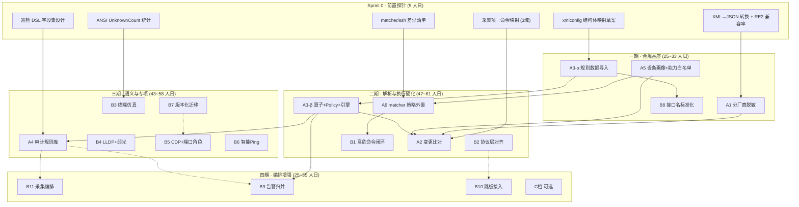
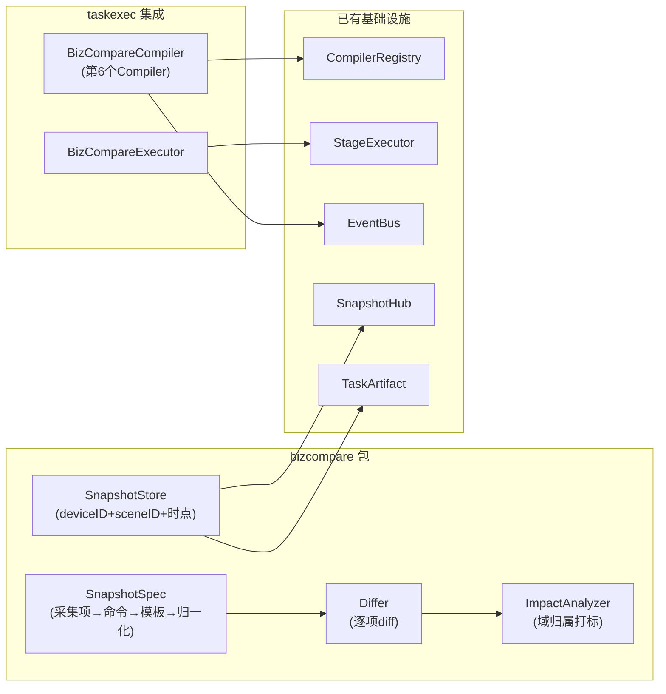

# eDesk Pro → NetWeaverGo 分阶段迁移方案

> **基准文档**：[eDeskPro_模块迁移可行性评估报告.md](file:///d:/Document/GO/NetWeaverGo/docs/eDeskPro_模块迁移可行性评估报告.md)
> **编制日期**：2026-09-16
> **文档定位**：在可行性评估报告（A/B/C/D 四档分级）基础上，制定**可执行的分阶段迁移方案**，细化到文件级变更清单、接口契约、数据流转、依赖拓扑、里程碑与验收标准。

---

## 目录

- [1. 迁移总纲](#1-迁移总纲)
  - [1.1 迁移原则](#11-迁移原则)
  - [1.2 分期总览与依赖拓扑](#12-分期总览与依赖拓扑)
  - [1.3 整体工作量与里程碑](#13-整体工作量与里程碑)
  - [1.4 合规红线](#14-合规红线)
- [2. 一期：合规基座 + 数据底座](#2-一期合规基座--数据底座)
  - [2.1 A1 · 分厂商敏感信息脱敏管线](#21-a1--分厂商敏感信息脱敏管线)
  - [2.2 A5 · 设备画像统一 + 能力白名单](#22-a5--设备画像统一--能力白名单)
  - [2.3 A3-α · 解析规则数据导入 + 结构体映射](#23-a3-α--解析规则数据导入--结构体映射)
  - [2.4 B8 · 接口名标准化补全（搭车）](#24-b8--接口名标准化补全搭车)
  - [2.5 一期里程碑与验收](#25-一期里程碑与验收)
- [3. 二期：解析引擎硬化 + 执行链路强化](#3-二期解析引擎硬化--执行链路强化)
  - [3.1 A3-β · 算子管线 + Policy + XmlConfig 引擎](#31-a3-β--算子管线--policy--xmlconfig-引擎)
  - [3.2 A6 · matcher/executor 策略外置](#32-a6--matcherexecutor-策略外置)
  - [3.3 B2 · 协议层细节对齐](#33-b2--协议层细节对齐)
  - [3.4 B1 · 高危命令治理闭环](#34-b1--高危命令治理闭环)
  - [3.5 A2 · 变更前后业务比对（首期 3 域）](#35-a2--变更前后业务比对首期-3-域)
  - [3.6 二期里程碑与验收](#36-二期里程碑与验收)
- [4. 三期：语义能力 + 专项扩展](#4-三期语义能力--专项扩展)
  - [4.1 A4 · 审计规则库模板化](#41-a4--审计规则库模板化)
  - [4.2 B7 · 数据模型 + 版本化迁移](#42-b7--数据模型--版本化迁移)
  - [4.3 B4 · LLDP 场景包 + 弱光检测](#43-b4--lldp-场景包--弱光检测)
  - [4.4 B5 · 拓扑发现源扩展 + 端口角色](#44-b5--拓扑发现源扩展--端口角色)
  - [4.5 B6 · 智能 Ping 规则](#45-b6--智能-ping-规则)
  - [4.6 B3 · 终端仿真补齐](#46-b3--终端仿真补齐)
  - [4.7 三期里程碑与验收](#47-三期里程碑与验收)
- [5. 四期：编排增强 + 可选能力](#5-四期编排增强--可选能力)
  - [5.1 B11 · 采集编排语义增强](#51-b11--采集编排语义增强)
  - [5.2 B9 · 告警规则与归并引擎](#52-b9--告警规则与归并引擎)
  - [5.3 B10 · 跳板/代理接入](#53-b10--跳板代理接入)
  - [5.4 C 档可选模块](#54-c-档可选模块)
  - [5.5 四期里程碑与验收](#55-四期里程碑与验收)
- [6. 前置探针任务（Sprint 0）](#6-前置探针任务sprint-0)
- [7. 风险登记与应对矩阵](#7-风险登记与应对矩阵)
- [8. 质量保障体系](#8-质量保障体系)
- [9. 附录：全量文件变更速查表](#9-附录全量文件变更速查表)

---

## 1. 迁移总纲

### 1.1 迁移原则

| # | 原则 | 说明 |
|---|------|------|
| P1 | **搬数据，不搬代码** | 只吸收事实型数据资产（正则、阈值、编码表、命令表），不复制 Java/Python 源码 |
| P2 | **借设计，不借实现** | 吸收经过现场验证的设计范式（注册表驱动、场景化规则包），用 Go 惯用法重新实现 |
| P3 | **只增不减** | 新增结构/表/字段/文件，不删除或重命名已有的任何公开接口和数据结构 |
| P4 | **旧行为兜底** | 所有策略加载失败时自动回退到现有硬编码默认值，保证零回归 |
| P5 | **Shadow 先行** | 涉及执行主链路（matcher / executor / sshutil）的改动，必须先 shadow mode 运行一个版本 |
| P6 | **Golden 锁定** | 每个解析/识别模块必须有 Golden 回归测试，数据变更需人工 review 后才允许更新快照 |
| P7 | **知识产权合规** | 只抽取判定逻辑的事实表达，规则标题和建议文案自行重写，不复制原文 |

### 1.2 分期总览与依赖拓扑



### 1.3 整体工作量与里程碑

| 期次 | 时间窗口 | 核心目标 | 估算人日 | 里程碑 |
|------|----------|----------|----------|--------|
| Sprint 0 | W1 | 前置数据探针，消除估算不确定性 | 5 | 6 份探针报告产出 |
| 一期 | W2~W5 | 合规脱敏 + 设备画像统一 + 解析规则数据导入 | 25~33 | 17 族脱敏全量接入；190 款型能力准入；44 份 XML 可加载 |
| 二期 | W6~W12 | 第四解析引擎上线 + 策略外置 + 协议补齐 + 变更比对 | 47~61 | 6 模型 Golden 通过；matcher 零代码接新厂商；gbk 字符集支持；3 域 bizcompare |
| 三期 | W13~W19 | 巡检规则 DSL + 版本化迁移 + LLDP/CDP/弱光/Ping | 43~58 | ≥50 条规则跑通；migration 目录就绪；CDP 发现源上线 |
| 四期 | W20~W24 | 编排语义 + 告警 + 跳板 + 可选项 | 25~35 | PreCollect 复用；告警归并引擎；按需交付 |
| **合计** | | | **145~192** | 按 ×1.3 系数计入管理成本 ≈ **189~250** |

### 1.4 合规红线

> [!CAUTION]
> **以下行为在整个迁移过程中严格禁止：**
> 1. 复制 eDesk Pro 的 Python/Java/Jython 源码文本到 NetWeaverGo 仓库
> 2. 原样搬运规则标题、建议文案（`#title_cn`、`#suggest_cn`）的原文
> 3. 将 eDesk Pro 交付包中的二进制文件、Excel 模板原文纳入版本控制
> 4. 在对外交付物中包含本迁移方案文档或可行性评估报告

**允许的操作**：吸收事实型数据（CLI 命令名、正则模式、阈值数值、ifType 编码、OID）、设计范式（场景化规则包结构、注册表驱动模式）。

---

## 2. 一期：合规基座 + 数据底座

> **目标**：补齐合规刚需（脱敏），建立设备认知统一底座，为后续所有模块提供数据基础。
> **周期**：4 周（W2~W5），25~33 人日

### 2.1 A1 · 分厂商敏感信息脱敏管线

**优先级**：★★★ | **成本**：2~3 人日 | **风险**：低

#### 2.1.1 现状分析

当前脱敏体系由两层组成：
- **实时层**：[sanitizer.go](file:///d:/Document/GO/NetWeaverGo/internal/logger/sanitizer.go) — 17 条全局正则规则（`password cipher/simple/plain`、`secret`、`token`、`credential`、JSON 字段、URL 口令），支持 `AddRule`/`RemoveRule`/`SetRuleEnabled` 动态管理
- **导出阻断层**：[sanitizer_check.go](file:///d:/Document/GO/NetWeaverGo/internal/report/sanitizer_check.go) — `CheckContentSanitized` 检测 4 类未掩码特征，`ValidateExportContent` 在发现漏脱敏时阻断导出

**核心缺口**：无「厂商 × 命令」维度的分级脱敏。华为 `cipher`/`irreversible-cipher`/`pre-shared-key` 等厂商特有密文特征未覆盖。

#### 2.1.2 目标资产

eDesk Pro `config/deviceversion/sensitiveCmd.xml`：17 个 Category（AR router / NE router / Ethernet Switch / DC / Firewall / WLAN / H3C / CISCO / ALU / NOKIA / ZTE / JUNIPER / DPTECH / RUCKUS / SANGFOR / DELL / 通用），每类包含多条 `<Cmd>` 和 `<Filter>` 正则。

#### 2.1.3 文件级变更清单

| 操作 | 文件 | 说明 |
|------|------|------|
| **[NEW]** | `internal/report/vendor_sanitizer.go` | 分厂商脱敏引擎，核心结构 `VendorSanitizer` |
| **[NEW]** | `internal/report/vendor_sanitizer_test.go` | 单测：17 Category 加载、华为回显命中率、性能基线 |
| **[NEW]** | `internal/config/sanitize_rules/sensitive_cmd.json` | 由 XML 一次性转换的规则数据（`//go:embed`） |
| **[NEW]** | `tools/convert_sensitive/main.go` | XML→JSON 一次性转换脚本（Sprint 0 产出） |
| **[MODIFY]** | `internal/logger/sanitizer.go` | 新增 `WithVendor(vendor)`/`WithCommand(cmd)` 上下文方法 |
| **[MODIFY]** | `internal/report/sanitizer_check.go` | 分级阻断：CRITICAL（cipher 类）阻断，WARN（口令提示类）仅告警 |

#### 2.1.4 核心接口设计

```go
// internal/report/vendor_sanitizer.go

// VendorSanitizeRule 单条厂商脱敏规则
type VendorSanitizeRule struct {
    Category    string         `json:"category"`     // "AR router", "Ethernet Switch", ...
    Commands    []string       `json:"commands"`     // 触发命令列表
    FilterName  string         `json:"filterName"`   // 规则名称
    Pattern     *regexp.Regexp `json:"-"`            // 编译后正则
    RawPattern  string         `json:"pattern"`      // 原始正则字符串
    Replacement string         `json:"replacement"`  // 替换模板，默认 "****"
}

// VendorSanitizer 分厂商脱敏引擎
type VendorSanitizer struct {
    mu       sync.RWMutex
    // category -> commandKey -> []rules
    ruleTree map[string]map[string][]VendorSanitizeRule
    // 编译失败的规则记录
    broken   []BrokenRule
}

// NewVendorSanitizer 从嵌入的 JSON 数据加载并预编译规则
// 编译失败的规则跳过并记录到 broken 列表，不阻断启动
func NewVendorSanitizer() (*VendorSanitizer, error)

// Sanitize 对回显文本执行分厂商脱敏
// 先按 category+cmd 命中厂商规则，再追加全局规则
func (vs *VendorSanitizer) Sanitize(category, command, text string) string

// BrokenRules 返回编译失败的规则清单（供启动日志告警）
func (vs *VendorSanitizer) BrokenRules() []BrokenRule
```

#### 2.1.5 数据流转

```
设备回显文本
    │
    ▼
logger.Sanitizer.Sanitize()          ← 17 条全局规则（实时层，已有）
    │
    ▼
report.VendorSanitizer.Sanitize()    ← 厂商×命令维度规则（新增）
    │                                   category = device.Identity.Series 映射
    │                                   command = step.CommandKey
    ▼
report.CheckContentSanitized()       ← 分级检测（改造）
    │                                   CRITICAL → 阻断导出
    │                                   WARN → 记录日志，允许导出
    ▼
导出文件 (CSV / JSON / 原始日志)
```

#### 2.1.6 验收标准

- [ ] 17 个 Category 规则全量加载成功
- [ ] 华为 `display current-configuration` 回显样本中 `cipher`/`irreversible-cipher`/`pre-shared-key` 命中率 100%
- [ ] 脱敏后 `CheckContentSanitized` 无 CRITICAL 级阻断
- [ ] 性能：单条 1MB 回显脱敏 < 50ms
- [ ] 编译失败规则进入 broken 清单并在启动日志中输出 WARN
- [ ] 现有 17 条全局规则行为不变（回归测试全绿）

---

### 2.2 A5 · 设备画像统一 + 能力白名单

**优先级**：★★★ | **成本**：8~10 人日 | **风险**：低~中

#### 2.2.1 现状分析

当前设备画像分散在三处：
- [identity.go](file:///d:/Document/GO/NetWeaverGo/internal/device/identity.go)：`Identity` 结构（Vendor / Model / DetailType / Version / Patch / VRBD / Series）+ `Identify()` 判定函数
- [series.go](file:///d:/Document/GO/NetWeaverGo/internal/device/series.go)：`ConvertSeries()` 归一化（已对齐部分 eDesk Pro 规则）
- [handlers.go](file:///d:/Document/GO/NetWeaverGo/internal/device/handlers.go)：`reg2HandlerList` 款型正则处理器表

**核心缺口**：无 `device_capabilities` 能力表；无法回答"这台设备能否执行某模板"；`DeviceAsset` 缺 `ESN`/`PatchVersion`/`FormFactor` 字段。

#### 2.2.2 目标资产

| 资产 | 来源 | 粒度 |
|------|------|------|
| `productItem.xml` | `config/devicemapping/` | 18 个 `devType`（大类） |
| `domain.json` | `IPOnlineService/.../businesscompare/` | 44 条款型正则→产品域（细粒度，**顺序敏感**） |
| `support_devices.json` | `IPOnlineService/.../businesscompare/` | 190 款型 × 版本矩阵 |
| `device.py::_REG2HANDLER` | `product/Script/getversion/` | 20+ 组有序正则 |
| `convert_series` | `product/Script/getversion/common/` | 归一化映射（`S5735-S→S5700` 等） |

#### 2.2.3 文件级变更清单

| 操作 | 文件 | 说明 |
|------|------|------|
| **[NEW]** | `internal/device/profile_registry.go` | 统一设备画像注册表 |
| **[NEW]** | `internal/device/profile_registry_test.go` | 含 `TestProfileOrderLocked` 顺序锁定 |
| **[NEW]** | `internal/models/device_capability.go` | `DeviceCapability` 模型 + Repository |
| **[NEW]** | `internal/config/device_profiles/product_items.json` | 18 大类数据 |
| **[NEW]** | `internal/config/device_profiles/domains.json` | 44 产品域数据 |
| **[NEW]** | `internal/config/device_profiles/capabilities.json` | 190 款型能力矩阵 |
| **[NEW]** | `internal/taskexec/eligibility.go` | 编译期准入校验 |
| **[NEW]** | `internal/taskexec/eligibility_test.go` | 准入校验单测 |
| **[MODIFY]** | `internal/device/series.go` | 合并 `convert_series` 缺失的映射 |
| **[MODIFY]** | `internal/models/models.go` | `DeviceAsset` 新增 3 字段 |
| **[MODIFY]** | `internal/config/db.go` | AutoMigrate 新增 `DeviceCapability` 表 |

#### 2.2.4 核心接口设计

```go
// internal/device/profile_registry.go

// ProductCategory 产品大类
type ProductCategory struct {
    Index      int    `json:"index"`      // 显式序号，不可改用数组下标
    Name       string `json:"name"`       // 英文标识
    ZhName     string `json:"zhName"`     // 中文名
    IsSoftware bool   `json:"isSoftware"` // 软件形态标记
}

// DomainRule 产品域规则（顺序敏感，首条命中）
type DomainRule struct {
    Order   int    `json:"order"`
    Pattern string `json:"pattern"`  // 款型正则
    Domain  string `json:"domain"`   // 产品域标识
    compiled *regexp.Regexp
}

// ProfileRegistry 三层粒度画像注册表
type ProfileRegistry struct {
    categories []ProductCategory     // 18 大类
    domains    []DomainRule          // 44 域规则（保序）
    mu         sync.RWMutex
}

// MatchDomain 按保序首条命中返回产品域
func (r *ProfileRegistry) MatchDomain(model string) (string, bool)

// internal/models/device_capability.go

// DeviceCapability 设备能力准入记录
type DeviceCapability struct {
    ID            uint   `gorm:"primaryKey;autoIncrement"`
    ModelPattern  string `gorm:"index;size:128;not null"`  // 款型正则
    Versions      string `gorm:"type:text"`                // JSON 版本列表
    CapabilityKey string `gorm:"index;size:128;not null"`  // 能力标识
    Enabled       bool   `gorm:"default:true"`
}

// internal/models/models.go（DeviceAsset 新增字段）

type DeviceAsset struct {
    // ...existing fields...
    ESN          string `gorm:"size:128" json:"esn,omitempty"`
    PatchVersion string `gorm:"size:128" json:"patchVersion,omitempty"`
    FormFactor   string `gorm:"size:32" json:"formFactor,omitempty"` // hardware | software
}
```

#### 2.2.5 关键设计约束

> [!IMPORTANT]
> **顺序敏感**：`domains.json` 中 `^CE12800$` 必须排在 `^CE\d+` 之前。合并多源规则时必须固化顺序，并通过 `TestProfileOrderLocked` 锁定前 20 条的匹配结果。

> [!IMPORTANT]
> **`index` 显式序号**：`productItem.xml` 的 `index` 字段被业务依赖（排序/报表），在 `ProductCategory` 中必须保留，不可改用数组下标。

#### 2.2.6 验收标准

- [ ] 190 款型识别结果与 `support_devices.json` 一致
- [ ] `TestProfileOrderLocked` 锁定前 20 条匹配顺序
- [ ] 能力准入在 `PlanCompiler.Compile()` 阶段生效（不支持的设备标记 `unsupported` 而非失败）
- [ ] `DeviceAsset` 加字段走 AutoMigrate，既有数据不丢失
- [ ] 既有设备识别（`Identify()`）行为不变

---

### 2.3 A3-α · 解析规则数据导入 + 结构体映射

**优先级**：★★★ | **成本**：4~5 人日 | **风险**：中（RE2 兼容性）

#### 2.3.1 本阶段目标

**只做数据导入和结构体映射，不接引擎**。确认 44 份 XML 规则在 Go 侧可加载、正则可编译，产出不兼容清单。

#### 2.3.2 文件级变更清单

| 操作 | 文件 | 说明 |
|------|------|------|
| **[NEW]** | `internal/parser/xmlcfg/` | 新包目录 |
| **[NEW]** | `internal/parser/xmlcfg/models.go` | XML 规则结构体定义（`CommandParseConfig` / `SegmentParse` / `ParseNode` / `FieldParse` / `RegexModel`） |
| **[NEW]** | `internal/parser/xmlcfg/loader.go` | XML 反序列化加载器 + RE2 编译校验 |
| **[NEW]** | `internal/parser/xmlcfg/loader_test.go` | 加载率 + 编译率测试 |
| **[NEW]** | `internal/parser/xmlcfg/compat.go` | RE2 不兼容正则的自动改写尝试（后顾断言→二次提取） |
| **[NEW]** | `internal/parser/templates/parsecfg/` | 44 份 XML 规则文件（`//go:embed`） |
| **[NEW]** | `internal/parser/templates/parsecfg/parseitem/` | 6 份解析项定义 |

#### 2.3.3 核心结构体映射

```go
// internal/parser/xmlcfg/models.go

// CommandParseConfig 对应 XML 根元素 <CommandParseConfig>
type CommandParseConfig struct {
    XMLName  xml.Name       `xml:"CommandParseConfig"`
    Segments []SegmentParse `xml:"SegmentParse"`
}

// SegmentParse 对应 <SegmentParse>，包含分段信息
type SegmentParse struct {
    CmdKeys     string      `xml:"cmdKeys,attr"`      // 命令标识（@@ 分隔互斥）
    IsResultMutex bool      `xml:"isResultMutex,attr"` // 互斥：任一命中即停
    ParseNodes  []ParseNode `xml:"ParseNode"`
}

// ParseNode 解析节点
type ParseNode struct {
    Policy    string       `xml:"policy,attr"` // Config | TableLine | TableColumn | DynamicColumn
    Fields    []FieldParse `xml:"FieldParse"`
    IsBig     bool         `xml:"isBig,attr"`  // 大表标记（ARP/MAC 走流式）
}

// FieldParse 字段解析定义
type FieldParse struct {
    FieldName string     `xml:"fieldName,attr"`
    Regex     RegexModel `xml:"RegexModel"`
    Operators []Operator `xml:"Operator"` // 有序算子链
}

// RegexModel 正则模型
type RegexModel struct {
    Pattern    string `xml:"pattern,attr"`
    Flags      int    `xml:"flags,attr"`      // Java Pattern flags → Go (?im) 前缀
    GroupIndex int    `xml:"groupIndex,attr"` // 捕获组索引
}

// Operator 字段算子
type Operator struct {
    Type   string            `xml:"type,attr"`   // Assign/Filter/MatchAndSet/...
    Params map[string]string `xml:"Param"`       // 算子参数
}
```

#### 2.3.4 RE2 兼容性处理策略

```
加载 44 份 XML
    │
    ├── regexp.Compile(pattern) 成功 → 正常注册
    │
    └── 编译失败
         │
         ├── 自动改写尝试（compat.go）
         │   ├── 后顾断言 (?<=...) → 先捕获整段再二次提取
         │   └── 反向引用 \1 → 展开为具体模式
         │
         ├── 改写后编译成功 → 注册（标记 rewritten）
         │
         └── 仍失败 → 记入 parsecfg_broken.json
              （启动日志 WARN，不阻断）
```

#### 2.3.5 验收标准

- [ ] 44 份 XML 文件全部可加载（反序列化成功率 100%）
- [ ] 正则编译成功率 ≥ 90%（不兼容项列入 `parsecfg_broken.json`）
- [ ] 产出 RE2 不兼容清单及改写建议
- [ ] 现有 `parser` 的 4 份内置模板和三引擎行为不变

---

### 2.4 B8 · 接口名标准化补全（搭车）

**优先级**：★★ | **成本**：3~5 人日 | **风险**：低

#### 2.4.1 文件级变更清单

| 操作 | 文件 | 说明 |
|------|------|------|
| **[NEW]** | `internal/normalize/iftype.go` | ifType 数字编码双向映射 |
| **[NEW]** | `internal/normalize/iftype_test.go` | 编码映射单测 |
| **[NEW]** | `internal/normalize/data/ifname_alias.json` | 厂商别名表（`25GE → Twenty-FiveGigE` 等） |
| **[MODIFY]** | `internal/normalize/normalize.go` | `NormalizeInterfaceName` 增加别名查找 |

#### 2.4.2 核心接口

```go
// internal/normalize/iftype.go

// ifType 编码常量（来自 InterfaceTransition.properties）
const (
    IFTypeEthernet  = 6
    IFTypePos       = 39
    IFTypeVlanif    = 53
    IFTypeTunnel    = 131
    IFTypeTrunk     = 161
    // ...更多编码
)

// NameToIFType 接口名→数字编码
func NameToIFType(ifName string) (int, bool)

// IFTypeToName 数字编码→标准接口名
func IFTypeToName(ifType int) (string, bool)

// NormalizeWithAlias 增强的接口名归一化（含厂商别名查找）
func NormalizeWithAlias(name string) string
```

#### 2.4.3 验收标准

- [ ] `Ethernet=6`、`Vlanif=53`、`Trunk=161` 等核心编码双向映射正确
- [ ] Cisco 别名（`Twenty-FiveGigE → 25GE`）归一化正确
- [ ] 现有 `NormalizeInterfaceName` 行为不变

---

### 2.5 一期里程碑与验收

| 里程碑 | 产出 | 验收方式 |
|--------|------|----------|
| M1.1 脱敏管线上线 | `vendor_sanitizer.go` + 规则数据 | 17 Category 加载 + 华为回显样本测试 |
| M1.2 设备画像统一 | `profile_registry.go` + 能力表 | 190 款型自动化比对 |
| M1.3 规则数据就绪 | `xmlcfg/` + 44 份规则 | 加载率 100% + 编译率 ≥ 90% |
| M1.4 接口名增强 | `iftype.go` + 别名表 | 编码双向映射单测 |
| **一期 Gate** | 全量单测通过 + 零回归 | `go test ./internal/...` 全绿 |

---

## 3. 二期：解析引擎硬化 + 执行链路强化

> **目标**：上线第四解析引擎，实现 matcher/executor 策略外置，补齐协议细节，交付变更比对首版。
> **周期**：7 周（W6~W12），47~61 人日
> **前置依赖**：一期全部完成

### 3.1 A3-β · 算子管线 + Policy + XmlConfig 引擎

**优先级**：★★★ | **成本**：8~10 人日 | **风险**：中

#### 3.1.1 文件级变更清单

| 操作 | 文件 | 说明 |
|------|------|------|
| **[NEW]** | `internal/parser/operators.go` | 13 个字段算子实现 |
| **[NEW]** | `internal/parser/operators_test.go` | 算子单测 |
| **[NEW]** | `internal/parser/policy.go` | 4 种解析策略（先实现 ConfigParsePolicy + TableLineParsePolicy） |
| **[NEW]** | `internal/parser/policy_test.go` | 策略单测 |
| **[NEW]** | `internal/parser/xmlconfig_engine.go` | 第四引擎 XmlConfigEngine |
| **[NEW]** | `internal/parser/xmlconfig_engine_test.go` | 引擎单测 + 6 模型 Golden |
| **[NEW]** | `testdata/regression/vendor_golden/` | 6 模型回归数据（interface / lldp / mac / arp / hardware / transceiver） |
| **[MODIFY]** | `internal/parser/models.go` | 新增 `TemplateEngine` 枚举值 `"xmlconfig"` |
| **[MODIFY]** | `internal/parser/manager.go` | `GetParserForDevice` 路由增加 XmlConfig 优先级 |

#### 3.1.2 算子管线设计

```go
// internal/parser/operators.go

// Operator 字段算子接口
type Operator interface {
    Name() string
    Apply(value string, params map[string]string, ctx *OperatorContext) (string, error)
}

// OperatorContext 算子执行上下文（供跨字段引用）
type OperatorContext struct {
    CurrentRow  map[string]string
    AllRows     []map[string]string
    Variables   map[string]string // 中间变量
}

// 13 个算子实现（按 OPERATOR_ORDER_MAP 固定执行序）
var OperatorOrder = []string{
    "Assign",        // 直接赋值
    "Filter",        // 过滤不满足条件的行
    "MatchAndSet",   // 正则匹配后赋值
    "MergeField",    // 合并多字段
    "RenameField",   // 字段重命名
    "ReplaceAll",    // 全局替换
    "SplitField",    // 按分隔符拆分
    "StrConcat",     // 字符串拼接
    "StrExtract",    // 子串提取
    "ToUpper",       // 转大写
    "ToLower",       // 转小写
    "ValueMapping",  // 值映射（枚举转换）
    "DefaultValue",  // 默认值填充
}

// OperatorPipeline 有序算子管线
type OperatorPipeline struct {
    operators []Operator
}

// Execute 按固定顺序执行算子链
func (p *OperatorPipeline) Execute(value string, ctx *OperatorContext) (string, error)
```

#### 3.1.3 引擎路由优先级

```
GetParserForDevice(vendor, model, version)
    │
    ├── 1. XmlConfig 引擎（新，44 份规则匹配到命令时）
    │     └── 按 vendor + cmdKey 查找 SegmentParse
    │
    ├── 2. 用户自定义模板（UserParseTemplate，DB 存储）
    │
    ├── 3. Aggregate 引擎（内置 huawei.json 等 4 份模板）
    │
    ├── 4. Tree 引擎（备选）
    │
    └── 5. Regex 引擎（兜底）
```

#### 3.1.4 验收标准

- [ ] 13 个算子全部实现并通过单测
- [ ] ConfigParsePolicy + TableLineParsePolicy 实现并通过单测
- [ ] 6 个模型（interface / lldp / mac / arp / hardware / transceiver）Golden 通过
- [ ] 新增厂商解析能力**无需改 Go 代码**（仅加规则文件验证）
- [ ] `parser` 既有测试全绿（不回归）
- [ ] `ParserManager` 路由正确：XmlConfig → Aggregate → Regex

---

### 3.2 A6 · matcher/executor 策略外置

**优先级**：★★★ | **成本**：8~10 人日 | **风险**：**高（执行主链路）**

#### 3.2.1 现状分析

当前 [matcher.go](file:///d:/Document/GO/NetWeaverGo/internal/matcher/matcher.go) 的 `StreamMatcher` 使用硬编码：
- `DefaultRules`：7 条错误规则（generic / huawei_h3c / cisco）
- `DefaultPrompts`：3 个提示符（`>`, `#`, `]`）
- 分页符：5 条硬编码

已有 `ConfigureFromProfile()` 可从画像注入，但无场景维度和厂商字符集。

#### 3.2.2 文件级变更清单

| 操作 | 文件 | 说明 |
|------|------|------|
| **[NEW]** | `internal/matcher/policy.go` | `MatchPolicy` 策略模型 + 加载器 |
| **[NEW]** | `internal/matcher/policy_test.go` | 策略加载与匹配单测 |
| **[NEW]** | `internal/matcher/policies/` | 策略 JSON 数据目录 |
| **[NEW]** | `internal/matcher/policies/huawei.json` | 华为策略（含场景维度） |
| **[NEW]** | `internal/matcher/policies/h3c.json` | H3C 策略 |
| **[NEW]** | `internal/matcher/policies/cisco.json` | Cisco 策略 |
| **[NEW]** | `internal/matcher/policies/default.json` | 默认兜底策略 |
| **[NEW]** | `internal/matcher/shadow.go` | Shadow mode 对比运行器 |
| **[MODIFY]** | `internal/matcher/rules.go` | 改为从策略加载，**保留 `DefaultRules` 作为兜底** |
| **[MODIFY]** | `internal/matcher/matcher.go` | `NewStreamMatcher(policy)` 支持策略注入 |
| **[MODIFY]** | `internal/executor/stream_engine.go` | 增加回显首行命令对齐校验开关 |

#### 3.2.3 核心接口设计

```go
// internal/matcher/policy.go

// MatchPolicy 匹配策略（按 Scene × Vendor × DeviceType 选取）
type MatchPolicy struct {
    Scene                string          `json:"scene"`       // collect | inspect | diagnose | *
    Vendor               string          `json:"vendor"`      // huawei | h3c | cisco | *
    DeviceType           string          `json:"deviceType"`  // router | switch | firewall | *
    PromptPatterns       []string        `json:"promptPatterns"`
    PagerPatterns        []string        `json:"pagerPatterns"`
    ErrorRules           []ErrorRuleDef  `json:"errorRules"`
    ConfirmPatterns      []string        `json:"confirmPatterns"`
    ValidateModel        string          `json:"validateModel"`        // 回显校验模型
    NeedPrompt           bool            `json:"needPrompt"`           // 是否需要提示符匹配
    ReceiveFilterKeys    []string        `json:"receiveFilterKeys"`    // ANSI 残留过滤
    ConnectCommandPolicy int             `json:"connectCommandPolicy"` // 回显拼接策略
}

// PolicyMatcher 策略匹配器（最长前缀匹配 + 首条命中）
type PolicyMatcher struct {
    policies []MatchPolicy  // 按优先级排序
    fallback MatchPolicy    // DefaultRules 兜底
}

// Resolve 按场景、厂商、设备类型三维度解析策略
func (pm *PolicyMatcher) Resolve(scene, vendor, deviceType string) *MatchPolicy
```

#### 3.2.4 Shadow Mode 运行策略

> [!WARNING]
> **A6 改动执行主链路，必须严格执行 Shadow Mode：**
> 1. **Phase 1 - 只记录**（1 个版本）：新旧策略并行运行，只记录命中差异到日志，不改变实际行为
> 2. **Phase 2 - 灰度切换**：差异率 < 1% 后，默认使用新策略，保留旧策略回退开关
> 3. **Phase 3 - 完全切换**：移除 shadow 对比逻辑

#### 3.2.5 验收标准

- [ ] 现有 `matcher` 和 `executor` 测试全绿
- [ ] 新增厂商（如 RUIJIE/ZTE）策略仅靠 JSON 生效，零 Go 改动
- [ ] 场景维度生效（同一设备在 collect/inspect 场景下校验行为不同）
- [ ] Shadow mode 差异率 < 1%
- [ ] 策略加载失败时自动回退到 `DefaultRules`

---

### 3.3 B2 · 协议层细节对齐

**优先级**：★★ | **成本**：5~8 人日 | **风险**：中

#### 3.3.1 文件级变更清单

| 操作 | 文件 | 说明 |
|------|------|------|
| **[NEW]** | `internal/sshutil/charset.go` | 字符集转换（gbk/utf-8 自动探测） |
| **[NEW]** | `internal/sshutil/charset_test.go` | 中文回显转码测试 |
| **[NEW]** | `internal/matcher/error_keywords.json` | 错误关键字表外置 |
| **[MODIFY]** | `internal/sshutil/session.go` | 增加 `Charset` 配置 + `MaxEchoBytes` 逐流上限 |
| **[MODIFY]** | `internal/sshutil/dial.go` | 支持 `ProxyDialer`（SOCKS5） |

#### 3.3.2 关键改动

**字符集转换**（优先级最高，中文设备回显乱码的直接成因）：

```go
// internal/sshutil/charset.go

import "golang.org/x/text/encoding/simplifiedchinese"

// CharsetDecoder 字符集自动探测与转码
type CharsetDecoder struct {
    defaultCharset string // "utf-8" | "gbk"
}

// Decode 尝试 UTF-8 解码，失败时回退到 GBK
func (d *CharsetDecoder) Decode(data []byte) (string, error)

// AutoDetect 基于高字节分布启发式判断字符集
func (d *CharsetDecoder) AutoDetect(data []byte) string
```

**逐流回显上限**（防止单设备大量输出占满内存）：

```go
// session.go 新增配置
type SessionConfig struct {
    // ...existing fields...
    MaxEchoBytes int64  // 默认 10MB (0xA00000)，超限截断并告警
    Charset      string // "utf-8" | "gbk" | "auto"
}
```

**SOCKS5 代理**：

```go
// dial.go 增加代理支持
import "golang.org/x/net/proxy"

func DialWithProxy(addr string, config *ssh.ClientConfig, proxyAddr string) (*ssh.Client, error)
```

#### 3.3.3 新增依赖

```
golang.org/x/text  // 字符集转换（GBK ↔ UTF-8）
golang.org/x/net   // SOCKS5 代理（已在 go.mod 中）
```

#### 3.3.4 验收标准

- [ ] 中文设备回显（GBK 编码）正确解码为 UTF-8
- [ ] 单设备回显超过 10MB 时截断并输出告警日志
- [ ] SOCKS5 代理连接正常（需手动验证环境）
- [ ] 错误关键字表外置后与原硬编码行为一致

---

### 3.4 B1 · 高危命令治理闭环

**优先级**：★★ | **成本**：6~8 人日 | **风险**：中

#### 3.4.1 现状分析

[risk_validator.go](file:///d:/Document/GO/NetWeaverGo/internal/executor/risk_validator.go) 已有：
- `RiskCommand` 模型 + 20 条内置种子
- `RiskValidator` 运行时校验器（block / confirm / warn 三级动作）
- 厂商专属 > 通配符优先级
- 热更新能力

**缺口**：无审批流、无逃生（Bypass）、无留痕（EscapeLog）、默认仅 `warn` 不强制。

#### 3.4.2 文件级变更清单

| 操作 | 文件 | 说明 |
|------|------|------|
| **[NEW]** | `internal/models/risk_command_log.go` | 拦截/放行/逃生留痕模型 |
| **[NEW]** | `internal/models/risk_trust_list.go` | 信任清单模型（用户×命令×时限） |
| **[NEW]** | `internal/executor/bypass_policy.go` | 紧急放行策略（二次确认 + 理由必填） |
| **[NEW]** | `internal/ui/risk_command_service.go` | 前端服务（日志查询、信任清单管理） |
| **[MODIFY]** | `internal/executor/risk_validator.go` | 接入留痕 + 信任清单检查 + 逃生流程 |
| **[MODIFY]** | `internal/models/risk_command.go` | 导入 `riskCmd_product.xml` 扩充种子 |
| **[MODIFY]** | `internal/config/db.go` | AutoMigrate 新增 2 表 |

#### 3.4.3 核心模型

```go
// internal/models/risk_command_log.go

// RiskCommandLog 高危命令操作留痕
type RiskCommandLog struct {
    ID        uint      `gorm:"primaryKey;autoIncrement"`
    RunID     string    `gorm:"index;size:64"`
    DeviceIP  string    `gorm:"size:64"`
    Command   string    `gorm:"type:text"`
    RuleID    uint      `gorm:"index"`
    Action    string    `gorm:"size:32"` // blocked | confirmed | warned | bypassed
    Operator  string    `gorm:"size:128"`
    Reason    string    `gorm:"type:text"`  // bypass 时必填理由
    CreatedAt time.Time `gorm:"autoCreateTime"`
}

// internal/models/risk_trust_list.go

// RiskTrustEntry 信任清单条目
type RiskTrustEntry struct {
    ID        uint      `gorm:"primaryKey;autoIncrement"`
    UserID    string    `gorm:"index;size:128"`
    Pattern   string    `gorm:"type:text;not null"` // 命令正则
    ExpiresAt time.Time                             // 过期时间
    Reason    string    `gorm:"type:text"`
    CreatedAt time.Time `gorm:"autoCreateTime"`
}
```

> [!WARNING]
> **默认行为变更风险**：将 `GlobalSettings.RiskCommandMode` 从 `warn` 改为 `enforce` 会影响存量任务行为。建议分两步：
> 1. 第一版：默认仍 `warn`，但所有拦截事件全量留痕
> 2. 观察一个版本后：根据留痕数据评估，再切换为 `enforce` 默认值

#### 3.4.4 验收标准

- [ ] 拦截/放行/逃生事件全量记录到 `risk_command_logs` 表
- [ ] 信任清单按时限自动过期
- [ ] 逃生流程要求二次确认 + 理由必填
- [ ] 导入 `riskCmd_product.xml` 后种子数量显著增加
- [ ] 现有 `RiskValidator` 行为不变（默认 `warn`）

---

### 3.5 A2 · 变更前后业务比对（首期 3 域）

**优先级**：★★★ | **成本**：15~20 人日 | **风险**：中
**前置依赖**：A3-β（解析）、A5（画像/能力白名单）

#### 3.5.1 文件级变更清单

| 操作 | 文件 | 说明 |
|------|------|------|
| **[NEW]** | `internal/bizcompare/` | 新包目录（5~7 文件） |
| **[NEW]** | `internal/bizcompare/snapshot.go` | `SnapshotSpec` + `SnapshotStore` |
| **[NEW]** | `internal/bizcompare/differ.go` | 逐项 diff 引擎（新增/消失/变更/阈值漂移） |
| **[NEW]** | `internal/bizcompare/impact.go` | `ImpactAnalyzer`（按采集项归属域打标） |
| **[NEW]** | `internal/bizcompare/scene.go` | 场景管理（scene ≠ 模板，多款型共享 sceneTemplate） |
| **[NEW]** | `internal/bizcompare/seeds.go` | 首期 3 域（S / NE-SR / CE）种子数据 |
| **[NEW]** | `internal/taskexec/bizcompare_compiler.go` | 第 6 个 Compiler |
| **[NEW]** | `internal/taskexec/bizcompare_executor.go` | BizCompare 专用 Executor |
| **[NEW]** | `internal/models/bizcompare.go` | `BizSnapshot` / `BizCompareTask` / `BizCompareItem` 模型 |
| **[NEW]** | `internal/ui/bizcompare_service.go` | 前端 Wails 服务 |

#### 3.5.2 核心架构



#### 3.5.3 关键设计约束

> [!IMPORTANT]
> **场景与模板的区分**：`scene` ≠ 模板。多个款型可共享一个 `sceneTemplate`。`itemList` 是按域裁剪后的子集 + 布尔开关（例如 S 系列关掉 `bgpAdvertisedRoutes` 这类重命令）。

> [!IMPORTANT]
> **`domain.json` 顺序敏感、首条命中**：`^CE12800$` 必须排在 `^CE\d+` 前面。此逻辑复用 A5 的 `ProfileRegistry.MatchDomain()`。

#### 3.5.4 验收标准

- [ ] 支持对同一批设备跑两次快照并产出 diff
- [ ] S / NE-SR / CE 三个产品域开箱即用
- [ ] 差异项可按域过滤、可导出 CSV
- [ ] 与 `plancompare` 结果互不干扰
- [ ] 复用 `CompilerRegistry` / `StageExecutor` / `EventBus`，不改框架

---

### 3.6 二期里程碑与验收

| 里程碑 | 产出 | 验收方式 |
|--------|------|----------|
| M2.1 第四引擎上线 | `xmlconfig_engine.go` + 13 算子 | 6 模型 Golden 通过 |
| M2.2 策略外置 | `policy.go` + JSON 策略 | Shadow mode 差异率 < 1% |
| M2.3 协议补齐 | charset + 10MB + SOCKS5 | 中文回显测试 + 代理连接测试 |
| M2.4 高危命令闭环 | 留痕 + 逃生 + 信任清单 | 全量留痕验证 |
| M2.5 变更比对 V1 | `bizcompare/` 全包 | 3 域快照→diff→导出 |
| **二期 Gate** | 全量单测 + 集成测试 | `go test ./internal/...` + 3 台真实设备端到端 |

---

## 4. 三期：语义能力 + 专项扩展

> **目标**：巡检规则 DSL 上线，数据库版本化迁移，LLDP/CDP/弱光/智能 Ping 专项能力。
> **周期**：7 周（W13~W19），43~58 人日

### 4.1 A4 · 审计规则库模板化

**优先级**：★★★ | **成本**：10~15 人日 | **风险**：中

#### 4.1.1 文件级变更清单

| 操作 | 文件 | 说明 |
|------|------|------|
| **[NEW]** | `internal/inspection/dsl.go` | 规则 DSL 解释器 |
| **[NEW]** | `internal/inspection/dsl_test.go` | DSL 单测 + 与 Python 规则对比验证 |
| **[NEW]** | `internal/inspection/rules/builtin/*.json` | 首批 50~100 条规则数据 |
| **[MODIFY]** | `internal/inspection/engine.go` | `EvaluateItem` 支持 DSL 规则输入 |
| **[MODIFY]** | `internal/ui/inspection_service.go` | 支持规则包导入/导出 |

#### 4.1.2 规则 DSL 设计

```go
// internal/inspection/dsl.go

// DSLRule 声明式规则定义
type DSLRule struct {
    CheckNo    string            `json:"checkno"`
    Title      LocaleText        `json:"title"`      // {zh, en}
    Category   string            `json:"category"`    // Health | Reliability | BGP | OSPF | ...
    RiskLevel  string            `json:"riskLevel"`   // critical | major | minor | info
    Commands   []string          `json:"commands"`    // 依赖的命令列表
    Scope      RuleScope         `json:"scope"`       // 适用范围
    Extract    ExtractSpec       `json:"extract"`     // 数据提取规约
    Assert     AssertSpec        `json:"assert"`      // 断言规约
    Advice     LocaleText        `json:"advice"`      // 修复建议
}

// RuleScope 规则适用范围
type RuleScope struct {
    Vendors  []string `json:"vendors,omitempty"`
    Models   []string `json:"models,omitempty"`   // 正则
    Versions []string `json:"versions,omitempty"` // 正则
}

// ExtractSpec 数据提取（复用 parser 能力）
type ExtractSpec struct {
    BlockRegex string   `json:"blockRegex,omitempty"` // 分块正则
    Fields     []FieldExtract `json:"fields"`
}

// AssertSpec 断言（映射到现有 6 种判定类型）
type AssertSpec struct {
    Type string      `json:"type"` // threshold | must_contain | must_not_contain | regex | equals | bound
    Expr interface{} `json:"expr"` // 类型相关的表达式
}

// DSLInterpreter 解释器
type DSLInterpreter struct {
    rules []DSLRule
}

// Evaluate 执行 DSL 规则判定，输出标准 InspectionResult
func (di *DSLInterpreter) Evaluate(rule *DSLRule, input *EvaluateInput) models.InspectionResult
```

#### 4.1.3 状态码映射

| eDesk Pro 状态 | NetWeaverGo 状态 | 说明 |
|----------------|------------------|------|
| `SUCCESS` | `TEST_PASS` | 检查通过 |
| `FAIL` | `TEST_FAIL` | 检查失败 |
| `IGNORE` | `TEST_IGNORE` | 不适用 |
| `EXCEPTION` | `TEST_EXCEPT` | 执行异常 |
| `detail` 行 | `EvidenceJSON` | 证据记录 |
| `suggestion` | `Advice` | 修复建议 |

#### 4.1.4 抽样策略

> [!TIP]
> **首批 50~100 条规则的抽样顺序**：`Health/`（2121 条，优先取 30~40 条高频项）→ `Reliability/`（346 条，取 10~15 条）→ `BASE/`（111 条，取 5~10 条）→ `BGP/OSPF`（各 11~61 条，取 5~10 条）。**不要按 BGP/OSPF 优先**，它们各自条数少，不是投入产出比最高的方向。

#### 4.1.5 验收标准

- [ ] ≥ 50 条规则通过 DSL 跑通
- [ ] 与 Python 原规则在 10 台样本设备上结论一致率 ≥ 90%
- [ ] 规则可导入/导出（JSON 包）
- [ ] 不改动 `inspection` 既有表结构（只增不减）
- [ ] 现有 12 条种子规则行为不变

---

### 4.2 B7 · 数据模型 + 版本化迁移

**优先级**：★★ | **成本**：10~15 人日

#### 4.2.1 文件级变更清单

| 操作 | 文件 | 说明 |
|------|------|------|
| **[NEW]** | `internal/config/migrations/` | 迁移目录 |
| **[NEW]** | `internal/config/migrations/0001_baseline.sql` | 基线 SQL（当前全量表结构快照） |
| **[NEW]** | `internal/config/migrations/runner.go` | 迁移运行器（有序执行 + 版本追踪） |
| **[NEW]** | `internal/config/migrations/runner_test.go` | 迁移运行器单测 |
| **[NEW]** | `internal/models/migration.go` | `SchemaMigration` 版本追踪表 |
| **[MODIFY]** | `internal/config/db.go` | 集成迁移运行器，保留 AutoMigrate 作为兜底 |

#### 4.2.2 分工设计

```
应用启动
    │
    ├── 1. 检查 schema_migrations 表
    │     └── 获取已执行的最高版本号
    │
    ├── 2. 执行未应用的 migration SQL（有序）
    │     └── 记录到 schema_migrations
    │
    └── 3. AutoMigrate（兜底）
          └── 补全新增实体的表（只增不减）

分工明确：
  - migration 管结构演进（改字段类型/加索引/数据迁移）
  - AutoMigrate 只补全新实体（新增表/新增列）
```

#### 4.2.3 验收标准

- [ ] `migrations/` 目录就绪，包含基线 SQL
- [ ] 迁移运行器按时间戳顺序执行
- [ ] 重复运行幂等（已执行的不再执行）
- [ ] AutoMigrate 仍保留作为兜底
- [ ] 现有数据不丢失

---

### 4.3 B4 · LLDP 场景包 + 弱光检测

**优先级**：★★ | **成本**：8~10 人日（可拆分 B4a 3~4 + B4b 5~6）

#### 4.3.1 文件级变更清单

| 操作 | 文件 | 说明 |
|------|------|------|
| **[NEW]** | `internal/optical/` | 弱光检测新包 |
| **[NEW]** | `internal/optical/checker.go` | 弱光阈值检测（percent/absolute 两种模式） |
| **[NEW]** | `internal/optical/checker_test.go` | 弱光检测单测 |
| **[NEW]** | `internal/models/optical_check_rule.go` | `OpticalCheckRule` 模型 |
| **[NEW]** | `internal/models/lld_parse_template.go` | `LldParseTemplate` 场景化模型 |
| **[MODIFY]** | `internal/models/topology_command.go` | `TopologyVendorFieldCommand` 增加 `scene` 维度 |

#### 4.3.2 验收标准

- [ ] LLDP 解析规则支持场景切换（enterprise / service / ipmaster 等）
- [ ] `OpticalCheckRule` 表创建成功，前端可管理
- [ ] percent/absolute 两种弱光阈值模式实现并通过单测
- [ ] 现有拓扑构建行为不变（默认场景 = enterprise）

---

### 4.4 B5 · 拓扑发现源扩展 + 端口角色

**优先级**：★★ | **成本**：8~12 人日

#### 4.4.1 文件级变更清单

| 操作 | 文件 | 说明 |
|------|------|------|
| **[NEW]** | `internal/parser/templates/builtin/cisco_cdp.json` | CDP 解析模板 |
| **[NEW]** | `internal/models/port_role.go` | 端口角色模型（上联/下联/互联/堆叠/带外） |
| **[MODIFY]** | `internal/taskexec/topology_builder.go` | 增加 CDP 发现源 + `DiscoveryMethods` 落库 |
| **[MODIFY]** | `internal/models/topology.go` | `GraphEdge` 增加 `Role` 字段 |
| **[MODIFY]** | `internal/taskexec/topology_compiler.go` | 发现源可选配置（ARP 风险提示） |

#### 4.4.2 验收标准

- [ ] CDP 发现源上线，可解析 Cisco 设备的 CDP 邻居
- [ ] `DiscoveryMethods` 落库，前端可勾选
- [ ] ARP 选中时弹出"可能纳入大量用户终端"提示
- [ ] 拓扑边 `Role` 字段可赋值，前端分色显示

---

### 4.5 B6 · 智能 Ping 规则

**优先级**：★★ | **成本**：5~8 人日

#### 4.5.1 文件级变更清单

| 操作 | 文件 | 说明 |
|------|------|------|
| **[NEW]** | `internal/smartping/` | 新包 |
| **[NEW]** | `internal/smartping/rule.go` | 规则定义（cmd→分块→过滤→取值 → 目标地址集） |
| **[NEW]** | `internal/smartping/engine.go` | 智能 Ping 引擎（与 `icmp.Engine` 对接） |
| **[NEW]** | `internal/smartping/rules/*.json` | 规则数据 |
| **[NEW]** | `internal/smartping/engine_test.go` | 引擎单测 |

> [!IMPORTANT]
> **RE2 兼容性**：智能 Ping 规则中的后顾断言 `(?<=...)` 需改写为「先捕获整段再二次提取」。复用 A3-α 的 `compat.go` 改写逻辑。

#### 4.5.2 验收标准

- [ ] 规则结构与 `RegexTemplate`（Pattern + FieldMapping）高度同构
- [ ] 产出逐接口可通性矩阵
- [ ] RE2 不兼容规则已改写并通过单测

---

### 4.6 B3 · 终端仿真补齐

**优先级**：★★ | **成本**：6~10 人日

#### 4.6.1 文件级变更清单

| 操作 | 文件 | 说明 |
|------|------|------|
| **[NEW]** | `testdata/ansi/` | ANSI 序列 Golden 测试集 |
| **[MODIFY]** | `internal/terminal/ansi.go` | 补齐 DEC 私有序列 + DP-modes + OSC |

> [!TIP]
> **先做"未知序列统计"**：通过 Sprint 0 的 ANSI UnknownCount 统计，按频率排序后决定补齐范围。避免为 1% 场景写 100% 代码。

#### 4.6.2 验收标准

- [ ] DEC 私有序列（`?1049` alt screen、`?25` 光标显隐）处理正确
- [ ] Golden 测试集覆盖 Top 10 高频未知序列
- [ ] 现有 ANSI 处理行为不变

---

### 4.7 三期里程碑与验收

| 里程碑 | 产出 | 验收方式 |
|--------|------|----------|
| M3.1 规则 DSL 上线 | `dsl.go` + 50~100 条规则 | DSL 跑通 + Python 对比 |
| M3.2 版本化迁移 | `migrations/` | 迁移运行器单测 |
| M3.3 LLDP + 弱光 | `optical/` + 场景包 | 场景切换测试 + 弱光单测 |
| M3.4 CDP + 角色 | CDP 模板 + 边 role | Cisco 设备拓扑测试 |
| M3.5 智能 Ping | `smartping/` | 逐接口可通性矩阵 |
| M3.6 终端仿真 | DEC/DP-modes | Golden 测试集 |
| **三期 Gate** | 全量测试 + 5 台设备端到端 | 完整功能回归 |

---

## 5. 四期：编排增强 + 可选能力

> **目标**：增强采集编排语义，交付告警归并引擎，按需落地跳板接入和 C 档模块。
> **周期**：5 周（W20~W24），25~35 人日

### 5.1 B11 · 采集编排语义增强

**优先级**：★★ | **成本**：5~8 人日

#### 5.1.1 文件级变更清单

| 操作 | 文件 | 说明 |
|------|------|------|
| **[MODIFY]** | `internal/inspection/dsl.go` | 支持 `PreCollectItem`（结果进入上下文）+ 嵌套模板 |
| **[MODIFY]** | `internal/taskexec/inspection_pipeline.go` | 大表标记 `isBig` → 流式落盘 |
| **[MODIFY]** | `internal/report/raw_logger.go` | 流式写入支持 |

> [!TIP]
> 与 A4 的 DSL 有重叠，建议合并设计：A4 的规则 DSL 直接支持 `TemplateItem` 嵌套 + `threshold` 结构。

#### 5.1.2 验收标准

- [ ] PreCollect 结果可被后续采集项引用（避免重复下命令）
- [ ] `isBig=true` 的采集项走流式落盘
- [ ] 模板树支持嵌套与继承

---

### 5.2 B9 · 告警规则与归并引擎

**优先级**：★★ | **成本**：10~15 人日
**前置依赖**：A3（44 份规则已含 `display alarm active` 解析）

#### 5.2.1 文件级变更清单

| 操作 | 文件 | 说明 |
|------|------|------|
| **[NEW]** | `internal/alarm/` | 新包 |
| **[NEW]** | `internal/alarm/rules.go` | 告警规则定义（分族：CE / Router / S / USG / VNE） |
| **[NEW]** | `internal/alarm/merger.go` | 归并引擎（原始告警 → 故障现象） |
| **[NEW]** | `internal/alarm/merger_test.go` | 归并单测 |
| **[NEW]** | `internal/models/alarm.go` | `AlarmRule` + `AlarmRecord` 模型 |

#### 5.2.2 验收标准

- [ ] 告警规则按族分类加载
- [ ] 归并引擎可将原始告警聚合为故障现象
- [ ] 结果可接入巡检报告与 `bizcompare` 影响清单

---

### 5.3 B10 · 跳板/代理接入

**优先级**：★ | **成本**：8~12 人日 | **风险**：高

> [!WARNING]
> **B10 无真实客户需求验证，且改动连接主链路（风险高）。建议：**
> - 先只做 SOCKS5 代理（已在 B2 中完成）
> - 跳板机留到有明确需求时再立项

#### 5.3.1 文件级变更清单（仅在有明确需求时执行）

| 操作 | 文件 | 说明 |
|------|------|------|
| **[NEW]** | `internal/connutil/jumphost.go` | 跳板连接器 |
| **[NEW]** | `internal/connutil/connect_commands.json` | 连接命令模板（13 条） |
| **[MODIFY]** | `internal/models/models.go` | `DeviceAsset` 增加 `ConnectMode` + `JumpHostID` |
| **[MODIFY]** | `internal/executor/stream_engine.go` | 支持"登录后前置命令序列" |

---

### 5.4 C 档可选模块

| 模块 | 成本 | 触发条件 |
|------|------|----------|
| **C1** 离线命令模板 | 3~5 人日 | 离线重放功能确有使用 |
| **C2** xlsx 报告导出 | 3~5 人日 | 用户明确需要 xlsx 格式（引入 `excelize` 依赖） |
| **C3** 入参校验种子 | 3~5 人日 | 随 Wails 服务层重构搭车 |
| **C5** 关键命令种子 | 1~2 人日 | 搭 A5 的车，随一期/二期顺带落地 |

---

### 5.5 四期里程碑与验收

| 里程碑 | 产出 | 验收方式 |
|--------|------|----------|
| M4.1 编排增强 | PreCollect + 流式 + 嵌套 | 采集编排单测 |
| M4.2 告警归并 | `alarm/` 全包 | 分族规则加载 + 归并单测 |
| M4.3 按需交付 | C 档模块 | 按需验收 |
| **四期 Gate** | 全量回归 | 端到端验证 |

---

## 6. 前置探针任务（Sprint 0）

> **目标**：用 5 人日消除关键估算不确定性，为一期开发提供 ±20% 精度的重估依据。

| # | 探针任务 | 产出 | 耗时 | 关联模块 |
|---|----------|------|------|----------|
| S0.1 | `sensitiveCmd.xml` → JSON 转换 + RE2 兼容率评估 | `tools/convert_sensitive/main.go` + 兼容率报告 | 0.5 天 | A1 |
| S0.2 | 44 份 `xmlconfig/*.xml` Go 结构体映射草案 + 编译失败清单 | `internal/parser/xmlcfg/` 草案 + `parsecfg_broken.json` | 1 天 | A3 |
| S0.3 | Excel 解析 `businesscompare/cmd.xlsx` + 3 域 scene，产出采集项→命令映射 | `docs/draft/bizcompare_mapping.md` | 1 天 | A2 |
| S0.4 | EMT `Health/` 取 20 条 + `Reliability/` 取 20 条，抽象 DSL 字段集 | `docs/draft/inspection_dsl.md` | 1 天 | A4 |
| S0.5 | `strategy/` 与 `SSHProtocol.java` 差异清单 | `docs/draft/matcher_ssh_gap.md` | 1 天 | A6/B2 |
| S0.6 | 现网采集 ANSI UnknownCount 统计 | 统计报告 | 0.5 天 | B3 |

**Sprint 0 完成标志**：6 份探针报告全部产出，关键风险项（RE2 兼容率、采集项覆盖率）有量化数据。

---

## 7. 风险登记与应对矩阵

| # | 风险 | 等级 | 触发条件 | 影响 | 应对措施 | 责任期次 |
|---|------|------|----------|------|----------|----------|
| R1 | **知识产权合规** | 🔴 高 | 复制源码/原文 | 法律风险 | §1.4 合规红线严格执行；规则标题/建议自行重写 | 全程 |
| R2 | **执行主链路回归** | 🔴 高 | A6/B2 改动引入 bug | 所有任务异常 | Shadow mode + 回退开关 + 集成测试准入 | 二期 |
| R3 | **RE2 兼容性** | 🟡 中 | >10% 规则编译失败 | A3 解析覆盖率不足 | 自动改写 + 人工改写兜底 + broken 清单 | 一期/二期 |
| R4 | **规则顺序敏感** | 🟡 中 | 多源合并时错序 | 设备误识别 | `TestProfileOrderLocked` + 显式 order 字段 | 一期 |
| R5 | **默认行为变更** | 🟡 中 | B1 `warn→enforce` | 存量任务被阻断 | 分两版灰度；先只记录不阻断 | 二期 |
| R6 | **规则体量失控** | 🟡 中 | A4 全量转换 8312 条 | 维护成本爆炸 | 抽样策略（50~100 条起步）；DSL 只覆盖声明式判定 | 三期 |
| R7 | **采集项命令差异** | 🟡 中 | A2 跨域命令不一致 | 比对结果不准 | 首期只做 3 域；建立映射校对表 | 二期 |
| R8 | **升级兼容** | 🟢 低 | 新增表/字段 | 升级失败 | 现有"只增不减 + 启动前自动备份(5份)"策略沿用 | 全程 |

---

## 8. 质量保障体系

### 8.1 测试分层

| 层级 | 覆盖范围 | 触发时机 | 工具 |
|------|----------|----------|------|
| **单元测试** | 每个新增文件 `*_test.go` | 每次提交 | `go test` |
| **Golden 回归** | 解析/识别/脱敏 | 每次规则数据变更 | `testdata/regression/` 快照比对 |
| **集成测试** | taskexec 全链路 | 每期 Gate 前 | 模拟设备 + 真实回显样本 |
| **Shadow 对比** | matcher/executor | A6 上线期间 | 新旧策略并行日志 |
| **端到端验证** | 3~5 台真实设备 | 每期 Gate | 真实设备连接 + 完整任务流 |

### 8.2 代码审查检查清单

- [ ] 新增文件是否有对应 `*_test.go`
- [ ] 是否遵循"只增不减"原则
- [ ] 是否保留了旧行为作为兜底
- [ ] 新增正则是否通过 `regexp.Compile` 预编译
- [ ] 新增数据文件是否通过 `//go:embed` 嵌入
- [ ] 是否涉及执行主链路改动（需 Shadow mode）
- [ ] 是否复制了 eDesk Pro 源码或原文（合规红线）

### 8.3 数据文件管理规范

| 类型 | 存放位置 | 嵌入方式 | 示例 |
|------|----------|----------|------|
| 解析规则 XML | `internal/parser/templates/parsecfg/` | `//go:embed` | 44 份 XML |
| 脱敏规则 JSON | `internal/config/sanitize_rules/` | `//go:embed` | `sensitive_cmd.json` |
| 匹配策略 JSON | `internal/matcher/policies/` | `//go:embed` | `huawei.json` |
| 设备画像 JSON | `internal/config/device_profiles/` | `//go:embed` | `domains.json` |
| 巡检规则 JSON | `internal/inspection/rules/builtin/` | `//go:embed` | DSL 规则包 |
| Golden 数据 | `testdata/regression/` | 测试引用 | 回显样本 + 期望输出 |
| 迁移 SQL | `internal/config/migrations/` | 运行时读取 | 有序补丁 |

---

## 9. 附录：全量文件变更速查表

### 新增文件汇总（按期次）

#### 一期（约 15 个新文件）

| 文件 | 模块 |
|------|------|
| `internal/report/vendor_sanitizer.go` | A1 |
| `internal/report/vendor_sanitizer_test.go` | A1 |
| `internal/config/sanitize_rules/sensitive_cmd.json` | A1 |
| `tools/convert_sensitive/main.go` | A1 |
| `internal/device/profile_registry.go` | A5 |
| `internal/device/profile_registry_test.go` | A5 |
| `internal/models/device_capability.go` | A5 |
| `internal/config/device_profiles/*.json`（3 份） | A5 |
| `internal/taskexec/eligibility.go` | A5 |
| `internal/taskexec/eligibility_test.go` | A5 |
| `internal/parser/xmlcfg/*.go`（3 份） | A3-α |
| `internal/parser/templates/parsecfg/`（50+ 份数据） | A3-α |
| `internal/normalize/iftype.go` | B8 |
| `internal/normalize/iftype_test.go` | B8 |
| `internal/normalize/data/ifname_alias.json` | B8 |

#### 二期（约 25 个新文件）

| 文件 | 模块 |
|------|------|
| `internal/parser/operators.go` | A3-β |
| `internal/parser/operators_test.go` | A3-β |
| `internal/parser/policy.go` | A3-β |
| `internal/parser/policy_test.go` | A3-β |
| `internal/parser/xmlconfig_engine.go` | A3-β |
| `internal/parser/xmlconfig_engine_test.go` | A3-β |
| `testdata/regression/vendor_golden/`（6 组） | A3-β |
| `internal/matcher/policy.go` | A6 |
| `internal/matcher/policy_test.go` | A6 |
| `internal/matcher/policies/*.json`（4 份） | A6 |
| `internal/matcher/shadow.go` | A6 |
| `internal/sshutil/charset.go` | B2 |
| `internal/sshutil/charset_test.go` | B2 |
| `internal/matcher/error_keywords.json` | B2 |
| `internal/models/risk_command_log.go` | B1 |
| `internal/models/risk_trust_list.go` | B1 |
| `internal/executor/bypass_policy.go` | B1 |
| `internal/ui/risk_command_service.go` | B1 |
| `internal/bizcompare/*.go`（5~7 份） | A2 |
| `internal/taskexec/bizcompare_compiler.go` | A2 |
| `internal/taskexec/bizcompare_executor.go` | A2 |
| `internal/models/bizcompare.go` | A2 |
| `internal/ui/bizcompare_service.go` | A2 |

#### 三期（约 20 个新文件）

| 文件 | 模块 |
|------|------|
| `internal/inspection/dsl.go` | A4 |
| `internal/inspection/dsl_test.go` | A4 |
| `internal/inspection/rules/builtin/*.json` | A4 |
| `internal/config/migrations/` 目录 | B7 |
| `internal/config/migrations/runner.go` | B7 |
| `internal/config/migrations/runner_test.go` | B7 |
| `internal/models/migration.go` | B7 |
| `internal/optical/checker.go` | B4 |
| `internal/optical/checker_test.go` | B4 |
| `internal/models/optical_check_rule.go` | B4 |
| `internal/models/lld_parse_template.go` | B4 |
| `internal/parser/templates/builtin/cisco_cdp.json` | B5 |
| `internal/models/port_role.go` | B5 |
| `internal/smartping/*.go`（3~4 份） | B6 |
| `testdata/ansi/` Golden 测试集 | B3 |

#### 四期（约 10 个新文件）

| 文件 | 模块 |
|------|------|
| `internal/alarm/rules.go` | B9 |
| `internal/alarm/merger.go` | B9 |
| `internal/alarm/merger_test.go` | B9 |
| `internal/models/alarm.go` | B9 |
| `internal/connutil/jumphost.go` | B10 |
| `internal/connutil/connect_commands.json` | B10 |

### 修改文件汇总

| 文件 | 涉及模块 | 改动类型 |
|------|----------|----------|
| `internal/logger/sanitizer.go` | A1 | 增加上下文方法 |
| `internal/report/sanitizer_check.go` | A1 | 分级阻断 |
| `internal/device/series.go` | A5 | 合并缺失映射 |
| `internal/models/models.go` | A5/B1/B10 | DeviceAsset 加字段 |
| `internal/config/db.go` | A5/B1/B7 | AutoMigrate + 迁移 |
| `internal/parser/models.go` | A3-β | 枚举值 |
| `internal/parser/manager.go` | A3-β | 路由增强 |
| `internal/matcher/rules.go` | A6 | 策略加载 |
| `internal/matcher/matcher.go` | A6 | 策略注入 |
| `internal/executor/stream_engine.go` | A6/B10 | 回显校验 + 前置命令 |
| `internal/executor/risk_validator.go` | B1 | 留痕 + 信任清单 |
| `internal/models/risk_command.go` | B1 | 种子扩充 |
| `internal/sshutil/session.go` | B2 | 字符集 + 上限 |
| `internal/sshutil/dial.go` | B2 | SOCKS5 |
| `internal/normalize/normalize.go` | B8 | 别名查找 |
| `internal/inspection/engine.go` | A4 | DSL 输入 |
| `internal/ui/inspection_service.go` | A4 | 规则导入导出 |
| `internal/models/topology_command.go` | B4 | scene 维度 |
| `internal/models/topology.go` | B5 | 边 role |
| `internal/taskexec/topology_builder.go` | B5 | CDP + DiscoveryMethods |
| `internal/taskexec/topology_compiler.go` | B5 | 发现源配置 |
| `internal/terminal/ansi.go` | B3 | DEC/DP-modes/OSC |
| `internal/inspection/dsl.go` | B11 | PreCollect + 嵌套 |
| `internal/taskexec/inspection_pipeline.go` | B11 | 大表流式 |

---

*本方案基于 [eDeskPro_模块迁移可行性评估报告](file:///d:/Document/GO/NetWeaverGo/docs/eDeskPro_模块迁移可行性评估报告.md) 及对 `NetWeaverGo/internal/**` 的源码级调研。所有文件路径与接口设计均可通过对应代码位置复核。*
