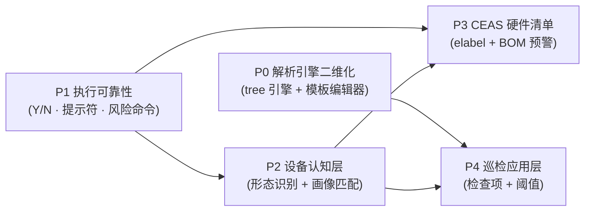

# NetWeaverGo × eDeskPro 能力升级适配规划方案

> **版本**: v1.1（采纳评审意见修订）
> **依据**: [`docs/华为eDeskPro脚本体系分析.md`](华为eDeskPro脚本体系分析.md)
> **协同对象**: [`docs/拓展.md`](拓展.md)（主线 A/B）、[`docs/交付闭环设计方案.md`](交付闭环设计方案.md)（A2 合规 / A5 验收）
> **文档定位**: 将华为 eDesk Pro 脚本体系中**可复用的框架与算法**，按阶段迁移进 NetWeaverGo，补齐"多产品采集、二维解析、硬件清单"三块底座能力
> **前置阅读**: [`docs/项目架构说明书.md`](项目架构说明书.md)

---

## 目录

- [0. 评估结论（先看这个）](#0-评估结论先看这个)
- [1. 差距矩阵与"断头路"清单](#1-差距矩阵与断头路清单)
- [2. 迁移原则（四条取舍红线）](#2-迁移原则四条取舍红线)
- [3. 阶段总览](#3-阶段总览)
- [4. P0 — 解析引擎二维化（规则树）](#4-p0--解析引擎二维化规则树)
- [5. P1 — 执行可靠性加固](#5-p1--执行可靠性加固)
- [6. P2 — 设备认知层](#6-p2--设备认知层)
- [7. P3 — CEAS 硬件清单与批次预警](#7-p3--ceas-硬件清单与批次预警)
- [8. P4 — 巡检应用层（与交付闭环合流）](#8-p4--巡检应用层与交付闭环合流)
- [9. 数据模型与迁移汇总](#9-数据模型与迁移汇总)
- [10. 横切设计（性能 · 可观测性 · 灰度 · 兼容）](#10-横切设计性能--可观测性--灰度--兼容)
- [11. 与既有规划的关系](#11-与既有规划的关系)
- [12. 工作量与依赖排期](#12-工作量与依赖排期)
- [13. 风险与红线](#13-风险与红线)
- [附录 A：文件落点索引](#附录-a文件落点索引)
- [附录 B：不建议迁移的清单及理由](#附录-b不建议迁移的清单及理由)

---

## 0. 评估结论（先看这个）

### 0.1 三条判断

**判断一：值得迁移的是"框架与算法"，不是 4148 个脚本。**
eDesk Pro 的真正价值集中在 `Script/common/`（25 个 py）与 `Script/ceas/Common/`（15 个 py）——它们把"发命令 → 分块 → 取值 → 成树 → 拍平"抽象成了声明式规则。这正是 NetWeaverGo 解析层当前缺的能力。4148 个脚本本身是华为产品矩阵的产物，**照搬即负债**。

**判断二：NetWeaverGo 已有约 60% 的底座，缺口分两类。**
- **真缺口**：二维解析（`parentItem`/`splitRegex`/`isPath`）、设备形态识别、elabel 解析、检查项/阈值模型。
- **断头路**：能力代码已存在但未接线（自定义提示符正则、用户解析模板、内联超时、ParseTemplateService），**修复成本极低、收益立竿见影**，应在 P0/P1 一并处理，内部优先级见 §1.2。

**判断三：按"底座优先、应用后置"推进，5 个阶段。**

| 阶段 | 主题 | 一句话目标 | 对应分析文档优先级 |
|---|---|---|---|
| **P0** | 解析引擎二维化 | 让表格型回显变成纯配置，无需写 Go 代码 | ★★★（原 P0） |
| **P1** | 执行可靠性加固 | 让采集在"怪设备"上也不卡死、不泄密、不误操作 | ★（原未单列，本方案升级） |
| **P2** | 设备认知层 | 知道"对面是什么设备、什么版本"，据此选命令与模板 | ★★（原 P2 前移） |
| **P3** | CEAS 硬件清单 | 电子标签 → 硬件树 → BOM 批次预警 | ★★★（原 P1 后置） |
| **P4** | 巡检应用层 | 检查项 + 阈值外置 + 结果码，与交付闭环合流 | ★★（原 P3） |

> **与原分析文档优先级的差异说明**：分析文档建议 CEAS 放 P1。本方案将其后置到 P3，理由是——CEAS 依赖 P1（elabel 采集需提权、需 `[Y/N]` 应答、需自定义提示符）与 P2（按款型/版本选择 elabel 命令），底座未稳时上 CEAS 会产生大量返工。**P3 不依赖 P0**：elabel 是完全独立的专用解析器（见 §7.3），通用分块语义按需复用即可。P1 虽然单项价值标 ★，但它是 P3 的前置条件，且大部分为"接线修复"，成本最低。

### 0.2 一页纸路线图



**依赖与启动顺序**：
- **P0 与 P1 完全并行**（互不依赖：parser vs executor/matcher，代码域不同）。
- **P2 在 P1 后启动**（画像接线是 P2 的前置）。
- **P3 在 P1 + P2 后启动**（**不依赖 P0**）。
- **P4 在 P0 + P2 后启动**（可与 P3 并行）。

---

## 1. 差距矩阵与"断头路"清单

### 1.1 能力差距矩阵（代码级）

| 能力域 | eDesk Pro 资产 | NetWeaverGo 现状 | 差距性质 | 迁移价值 |
|---|---|---|---|---|
| 声明式解析 | `CmdEchoParser` 规则树 + `ResultTreeTile` 拍平 | `parser.RegexTemplate` 仅单正则；`AggregateEngine` 为线性单层聚合 | **真缺口**：无法表达"块 → 树 → 多行" | ★★★ |
| 分块工具 | 4 种实现（`find_pos_by_pattern` 最完善） | 无独立分块工具（拓扑解析内散落） | 真缺口 | ★★★ |
| 用户模板闭环 | —（XML 注册表） | `UserParseTemplate` 表 + `ParseTemplateService` 已实现，但**未注册、未合入解析器快照** | **断头路** | ★★★ |
| 提示符适配 | `sender.py` 的 `-p <regex>` | `DeviceProfile.Prompt.Patterns` 已定义、`matcher.SetPromptPatterns` 已有，但**生产链路未接线**（`NewInitializer` 为死代码） | 断头路 | ★★★ |
| 交互应答 | `MessagePool.send_command_reliably`（`[Y/N]` 自动应答） | 无 | 真缺口 | ★★ |
| 命令缓存 | `MessagePool._pool[view][cmd]` | `CommandContext.EchoConsumed` 已定义未实现 | 断头路 | ★★ |
| 超时体系 | `-i N` 参数 + 默认补 60/75s | 默认 30s/60s 已有；内联 `// nw-timeout` 解析后被**丢弃** | 断头路 | ★★ |
| 风险命令 | `config/riskCmd_product.xml` | 无 | 真缺口 | ★★ |
| 脱敏 | `cmd_echo_writer.hide_echo_password` | `logger/sanitizer.go` + detail/summary 已用；**raw/journal 未覆盖** | 部分断头路 | ★★ |
| 设备形态识别 | `device/device.py` 20+ 组正则有序表 + `convert_series` | `parser.DeviceIdentity` 只有 model/version 字符串；无款型判定、无系列归一化 | 真缺口 | ★★★ |
| 设备画像匹配 | `CollectItem` XML：款型/版本白名单 → 脚本 | `DeviceProfile` 静态注册，**仅按 vendor 字符串匹配**（且未命中一律回退华为，见 P2-2 缺陷修复） | 真缺口 | ★★ |
| elabel 解析 | `elabel_parser.py` handlers 有序表 + 3 段式 ID | 无 | 真缺口 | ★★★ |
| BOM 白名单/槽位筛选 | `public_utils.get_involved_elabel_slots` | 无 | 真缺口 | ★★ |
| ESN 提取 | `esn_parse.py` 三套策略（CE/AR/WLAN） | 画像有 `esn` 命令，无专用解析器 | 真缺口 | ★★ |
| 检查项/阈值 | `Template/*.xml`：`isPreCollect` + `<threshold>` 外置 | **无任何检查项/阈值概念**（只有系统级算法阈值） | 真缺口 | ★★ |
| 结果码协议 | 9 态结果码 + problem/advice | 无；`TaskRun` 只有执行态 | 真缺口 | ★★ |
| 多语言资源 | `Resource/*.csv`（key, zh, en） | 无 | 低价值 | ★ |
| 大回显治理 | `CMDEchoCsvWriter` 流式写盘 + 分块解析 | 流式写盘已有；**内存中全量保留 RawBuffer/NormalizedLines** | 部分缺口 | ★ |

### 1.2 "断头路"修复清单（含内部优先级）

这些是**已写好但没接上**的能力，修复成本以小时计，但直接影响采集成功率：

| # | 断头路 | 证据 | 影响 | 处理阶段 | 修复优先级 |
|---|---|---|---|---|---|
| 1 | 自定义提示符正则未接线 | `NewInitializer`/`NewInitializerWithMatcher` 无外部调用方；`NewDeviceExecutor` 只创建 `matcher.NewStreamMatcher()` 默认匹配器 | Linux 虚机（CE1800V）、OTT 类设备命令阶段收不到结束信号，必然超时 | P1 | **高**（P1 门面） |
| 2 | 用户解析模板未进快照 | `ParserManager.ReloadVendor` 只读 `templates/builtin/*.json`，不合并 `net_user_parse_templates` | 模板 CRUD 保存后解析行为不变，功能形同虚设 | P0 | **最高**（P0 核心交付） |
| 3 | `ParseTemplateService` 未注册 | `cmd/netweaver/main.go` 的 Services 清单无它，`bindings/` 无生成物 | 用户无法编辑/测试解析模板 | P0 | **最高**（P0 核心交付） |
| 4 | 内联超时被丢弃 | `session_types.go:380`、`session_reducer.go:353,400` 三处丢弃 `parseInlineTimeout` 第二返回值 | `// nw-timeout=10s` 写了不生效，长命令误超时 | P1 | 中 |
| 5 | 分页续页字节硬编码 | `Pager.ContinueBytes` 配置已定义，实际发送 `[]byte(" ")`（`stream_engine.go:417-427`） | 特殊分页设备无法适配 | P1 | 低 |
| 6 | 回显消费未实现 | `CommandContext.EchoConsumed`/`ConsumeEcho()` 定义后无调用 | 命令缓存与"防串台"缺少基础 | P1 | 中（P1-3/P4 前置） |
| 7 | raw/journal 未脱敏 | 仅 logger/detail/summary 走 `Sanitizer`；`raw_logger.go`、`journal_logger.go` 未调用 | 报告原样发出即泄露密文口令 | P1 | **高**（安全红线，尽早修复） |
| 8 | 画像命令超时未生效 | `DeviceProfile.Commands[].TimeoutSec` 在拓扑路径已用，普通任务路径未见使用 | 长命令（如 `display current-configuration`）可能误超时 | P1 | 中 |

**建议修复顺序**：#2 + #3（P0 第一件事，否则 P0 只做了一半）→ #1 → #7 → #4 + #8 → #6 → #5。

---

## 2. 迁移原则（四条取舍红线）

**红线一：搬框架不搬脚本。**
只迁移算法、正则表、判定规则；不迁移任何 `.py` 执行体，不引入 Python/Jython 运行时。保持"零部署单 exe"。

**红线二：声明式配置优先于代码。**
能用模板/规则表达的，不写 Go 代码。eDesk Pro 用 3303 个 inspector 脚本实现的能力，NetWeaverGo 应用"模板 + 规则"表达；配置不够用时才加解析器类型（如 elabel 这种强结构场景——这也是它独立成专用解析器的原因）。

**红线三：不引入 XML 注册表矩阵。**
`CollectItem` 的"款型 × 版本 × 产品 → 脚本路径"矩阵在华为 20 年产品线下成立，对交付工具是维护灾难。NetWeaverGo 用"设备画像匹配表（DB 表 + 内置 JSON 兜底）"表达同样的意图，但**只保留少量档位**（精确 → 系列 → 厂商默认 → 全局 default，共四级，见 §6.2 P2-2），不做笛卡尔矩阵。

**红线四：守住"交付工具"定位。**
不做常驻采集、不做 7×24 轮询、不产出给 IBMS 的 IBMS 专属格式（CSV 输出可选，不是必做）。采集结果首先服务于本项目自己的报告、验收、基线体系。

---

## 3. 阶段总览

| 阶段 | 主题 | 主要交付 | 依赖 | 预估工作量 |
|---|---|---|---|---|
| **P0** | 解析引擎二维化 | `tree` 引擎（规则树 + 分块 + 拍平）、模板编辑器与在线测试、用户模板接入快照 | 无 | ~26 人日 |
| **P1** | 执行可靠性加固 | 提示符接线、`[Y/N]` 应答、命令缓存、风险命令拦截、超时体系、脱敏补齐 | 无（可与 P0 并行） | ~16 人日 |
| **P2** | 设备认知层 | 形态识别（款型/版本/系列）、画像匹配升级（四级回退 + 缺陷修复）、命令/模板按设备条件选配 | P1（画像接线） | ~13 人日 |
| **P3** | CEAS 硬件清单 | elabel 解析器（独立）、ESN 提取、BOM 白名单与槽位筛选、硬件树落库与视图 | P1 + P2（**不依赖 P0**） | ~21 人日 |
| **P4** | 巡检应用层 | 巡检模板、检查项与阈值外置、结果码协议、巡检结果报告 | P0 + P2 | ~15 人日 |
| | | | **小计** | **~91 人日** |
| | | | **联调（单列）** | **~6 人日** |
| | | | **总计** | **~97 人日** |

> 工作量已含 15–25% 缓冲与联调，明细见 §12.1。

---

## 4. P0 — 解析引擎二维化（规则树）

### 4.1 目标与验收

**目标**：引入 `ParseRule` 树模型，把"分块 → 树 → 多行"的解析能力变成纯配置。表格型回显（`display interface`、`display device`、`display transceiver`、`display mac-address`、`display elabel` …）无需写代码即可结构化。

**验收标准**：
1. 用真实回显样本，对 3 类典型命令（表格式 / 多级嵌套 / 分块重复）做 golden 测试，规则全部由 JSON 表达。
2. 用户可在 UI 上新建、编辑、测试模板，保存后**立即**对后续解析生效（打通断头路 #2、#3）。
3. 现有 `regex` / `aggregate` 模板行为零回归（`go test ./internal/parser/...` 全绿）。

**前置任务（0.5 人日）**：RE2 兼容性扫描——写一次性脚本扫描 eDesk Pro 的 `_REG2HANDLER`、`handlers`、`ParseRule` 中所有正则，标记不支持特征（`(?<=`、`(?<!`、`\1`、条件组），产出《不兼容正则迁移清单》，提前暴露改写工作量（同时服务 P0/P2/P3）。

### 4.2 能力来源（eDesk Pro 算法要点）

| 来源 | 要点 | 迁移方式 |
|---|---|---|
| `CmdEchoParser.ParseRule` | 扁平规则列表 + `parentItem` 成树；`isList`/`itemType`/`parseRegex`/`parseFlag`/`groupIndex`/`splitRegex`/`index` | 转为 Go 结构体 + JSON 存储 |
| `getParseRuleTree()` | 扁平 → 树，**子规则继承父级 regex/flag** | `rule_tree.go` |
| `splitCmdEcho()` | 按 `match.start()` 切块，**保留块头** | `block_splitter.go`（同时借鉴 `pre_parse.find_pos_by_pattern` 的"尾块补齐 + keep_matched 开关"，它是最完善的一版） |
| `fillSubResult()` | 递归填充；非叶子节点三种行为（单 dict / `finditer` 每条 / 分块每块一条） | `tree_engine.go` |
| `flatResultMap()` | `level>1` 的字段在 root 平铺一份（跨层引用用） | `tree_engine.go` |
| `fillDefaultValue()` | 未命中字段按 `itemType` 补默认值 | `tree_engine.go`（增强为可配置 `defaultValue`） |
| `ResultTreeTile` | `isPath` 回溯标记 + `maxOutputLevel` + 父字段继承 + 笛卡尔展开 | `result_tile.go` |

### 4.3 设计

#### 4.3.1 规则模型（Go）

```go
// internal/parser/tree_rules.go

// TreeRule 声明式解析规则（对齐 eDesk Pro ParseRule）
type TreeRule struct {
    ParseItem    string `json:"parseItem"`    // 字段名
    ParentItem   string `json:"parentItem"`   // 父字段名；空 = 根
    IsList       bool   `json:"isList"`       // 是否列表节点
    ItemType     string `json:"itemType"`     // string | number
    ParseRegex   string `json:"parseRegex"`   // 取值正则
    ParseFlags   string `json:"parseFlags"`   // "m" / "i" / "mi" → 内联标志 (?mi)
    GroupIndex   int    `json:"groupIndex"`   // 捕获组序号（默认 1）
    SplitRegex   string `json:"splitRegex"`   // 分块正则（列表节点）
    SplitFlags   string `json:"splitFlags"`
    IsOutput     bool   `json:"isOutput"`     // 是否输出到平铺结果
    DefaultValue string `json:"defaultValue"` // 未命中时的默认值（缺省 ""）
    Order        int    `json:"order"`        // 顺序
}

// TreeTemplate 树形模板配置（JSON 存入模板记录）
type TreeTemplate struct {
    // —— 预留：模板包格式（为远期"规则模板导入导出/共享"准备，P0 不实现市场功能）——
    SchemaVersion string `json:"schemaVersion,omitempty"` // 模板格式版本
    Author        string `json:"author,omitempty"`
    Tags          []string `json:"tags,omitempty"`

    Rules          []TreeRule `json:"rules"`
    MaxOutputLevel int        `json:"maxOutputLevel"` // 拍平到第几层（0 = 全部）
}
```

#### 4.3.2 引擎接口与集成点

```go
// internal/parser/tree_engine.go
type TreeEngine struct{}

// Parse 平铺输出（实现 CliParser 契约，兼容下游 mapper 与持久化链路）
func (e *TreeEngine) ParseWithTemplate(tpl *CompiledTemplate, rawText string) ([]map[string]string, error)

// ParseTree 嵌套输出（供嵌套结构消费，如巡检多级结果；非 P3 依赖）
func (e *TreeEngine) ParseTree(tpl *CompiledTemplate, rawText string) ([]*ResultNode, error)
```

**关键决策：对外契约不变。** `CliParser.Parse` 仍返回 `[]map[string]string`（拍平后的多行），树结构只存在于引擎内部与新增的 `ParseTree` 方法。这样 mapper、`TaskRawOutput`、`task_parsed_*` 表全部无需改动。

**集成点**：
1. `parser.TemplateEngine` 新增常量 `EngineTree = "tree"`（`parser/models.go`）。
2. `CompiledTemplate` 新增 `CompiledRules []CompiledTreeRule`（预编译 + 父子关系索引）。
3. `CompositeParser.Parse` 的 switch 增加 `case EngineTree`（1 行）。
4. `ParserManager.compileTemplate` 增加编译分支；`ParseTemplateService.compileTemplate` 同步。

#### 4.3.3 分块工具（独立可测）

```go
// internal/parser/block_splitter.go
type Block struct {
    Match  string // 块头原文（splitRegex 命中的文本）
    Body   string // 块体（含或不含块头，由 keepHeader 决定）
    Start  int
    End    int
}

// SplitBlocks 按正则切块，保留块头，自动补齐尾块（借鉴 find_pos_by_pattern）
func SplitBlocks(echo string, re *regexp.Regexp, keepHeader bool) []Block
```

**必须覆盖的用例**（来自 eDesk Pro 的 4 种实现差异，统一为一套正确语义）：
- 块头保留（`display device` 的 `[Slot_x]` 分块、elabel 的 `[Slot_1]`）；
- 尾块不丢（原 `blocklist` 用 `match.end()+1` 推进会吞掉块头末字符，是已知缺陷，**不要复刻**）；
- 无匹配时的行为（原 `blocklist` 返回 `[-1, "Failed to pasre data!"]`，Go 侧返回空切片 + nil error，由调用方决定）。

#### 4.3.4 拍平算法（`result_tile.go`）

```
markPathNodes(rules, outputItems)    // 从每个输出字段往上回溯 parent 链，标 IsPath
tileResultTree(node, level, inherited, out)
  ├─ result = merge(inherited, 本层 isOutput 字段)
  ├─ 若 level == MaxOutputLevel → append(result)
  └─ 对每个 IsPath 子节点：笛卡尔展开（IsList → 逐元素；否则单元素）
```

**要点**：`isPath` 回溯只让递归走"能到达输出字段"的分支（eDesk Pro 的巧思，直接移植）；缺失字段优先填规则配置的 `defaultValue`，未配置时填 `""`（`map[string]string` 无法表达 null，number 类型仅在"校验 + 格式化"层生效）。

#### 4.3.5 接线修复（断头路 #2、#3）

```go
// internal/parser/manager.go —— ReloadVendor 合并用户模板
type UserTemplateSource interface {
    ListEnabled(vendor string) ([]StoredTemplate, error)
}

func (m *ParserManager) SetUserTemplateSource(src UserTemplateSource)

// ReloadVendor: 内置模板 → 用户模板覆盖（同 commandKey 以用户为准）→ 编译 → 原子替换快照
```

- `UserTemplateSource` 由 `internal/repository` 实现（读 `net_user_parse_templates`，`enabled = true`）。
- `cmd/netweaver/main.go` 注册 `ParseTemplateService` 到 Services 清单。
- `ParseTemplateService` 的 `Engine` 校验白名单增加 `tree`。

#### 4.3.6 前端：解析模板工作台

新增路由 `/parse-templates`，视图 `views/ParseTemplates.vue` + `components/parsetpl/`：

| 组件 | 职责 |
|---|---|
| `TemplateList` | 按 vendor / commandKey 过滤；显示"内置/用户覆盖"徽标 |
| `RuleTableEditor` | 规则表格：字段名 / 父字段（下拉，来自已有规则）/ 类型 / 正则 / 标志 / 组号 / 分块正则 / 是否输出 / 默认值 / 顺序；支持上移下移、拖拽排序 |
| `EchoTestPane` | 粘贴原始回显 → 调 `TestTemplate` → 三视图切换：**树视图**（折叠展开）/ **平铺表**（最终输出行）/ **匹配高亮**（在原文中标出每块命中位置，这是调试体验的关键） |
| `RegexPlayground` | 正则实时校验（前端 `try/catch` + Go 端保存前预编译双保险） |

> `TestTemplate` 后端已实现（`ParseTemplateService.TestTemplate`），只需注册 + 生成绑定 + 加 `tree` 分支。

#### 4.3.7 错误处理与降级语义（明确定义，避免实施时纠结）

| 场景 | 行为 |
|---|---|
| **保存期校验** | `parentItem` 必须存在且无环；所有正则必须可编译（含 RE2 兼容性预检）；`isList` 与 `splitRegex` 的冲突组合直接拒绝保存 |
| 单字段未命中 | 填 `defaultValue`（缺省 `""`），**不算错误**（列表未命中为空数组） |
| 整模板解析失败 | 返回 `error`，`TaskRawOutput.ParseStatus = failed`；**默认不静默切换引擎**（避免"看起来成功、结果错"） |
| 可选的降级 | 模板可配置 `onParseFailure: fail（默认）| fallback_regex`；`fallback_regex` 时把回显交给现有 regex 引擎，报告中显式标记 `fallback=true` |
| 引擎装载失败 | `ReloadVendor` 编译失败时保留上一份健康快照（现有原子替换语义），并向调用方返回错误 |
| 全局回退 | 见 §10.3 灰度开关：可强制 `legacy_only` 应急回退到 regex/aggregate |

### 4.4 规则 DSL 示例

以华为 `display device` 的分块解析为例（示意）：

```json
{
  "engine": "tree",
  "parseRules": {
    "maxOutputLevel": 2,
    "rules": [
      { "parseItem": "slotId",   "parentItem": "",       "isList": true,  "splitRegex": "^Slot\\s+(\\S+):", "groupIndex": 1, "order": 1 },
      { "parseItem": "boardType","parentItem": "slotId",  "isList": false, "parseRegex": "Board Type\\s*:\\s*(\\S+)", "groupIndex": 1, "isOutput": true, "order": 2, "defaultValue": "N/A" },
      { "parseItem": "status",   "parentItem": "slotId",  "isList": false, "parseRegex": "^\\s*(\\S+)\\s+\\S+\\s+(Normal|Abnormal)", "groupIndex": 2, "isOutput": true, "order": 3, "defaultValue": "Unknown" },
      { "parseItem": "portName", "parentItem": "slotId",  "isList": true,  "parseRegex": "^\\s+(\\S+)\\s+\\S+\\s+\\S+", "groupIndex": 1, "isOutput": true, "order": 4 }
    ]
  }
}
```

输出（多行，每行 = 一块 × 一个输出字段组合）：`slotId + boardType + status + portName` 的笛卡尔展开结果。

### 4.5 兼容性风险

| 风险 | 说明 | 缓解 |
|---|---|---|
| **Go RE2 与 Python re 语义差异** | Python 支持 lookbehind / backreference / 条件组；Go RE2 不支持 | **前置扫描脚本**（§4.1）+ 模板保存时预编译校验 + 明确错误提示；建立《不兼容正则迁移清单》 |
| 内联标志差异 | Python `parseFlag="1,1"`（re.M\|re.I）→ Go `(?mi)` 前缀 | 在 `CompileTreeRule` 中统一转换 |
| 未命中字段类型 | `map[string]string` 无法表达 `None` / `[]` | 填 `defaultValue` / `""`；需要区分"空"与"缺失"时，在 `ResultNode.Attrs` 中保留 `Present bool` |
| 歧义规则（子 regex 覆盖父 regex） | eDesk Pro 的"子继承父正则"语义容易误用 | 文档中明确 + 编辑器中对"继承"字段显示占位提示 |

### 4.6 交付物清单

- [ ] **前置**：RE2 兼容性扫描脚本（`tools/re2scan/`）+《不兼容正则迁移清单》
- [ ] `internal/parser/tree_rules.go`、`block_splitter.go`、`tree_engine.go`、`result_tile.go`
- [ ] `internal/parser/manager.go` 用户模板合并；`composite_parser.go` 引擎接入
- [ ] `internal/models/parse_template.go` 增加 `ParseRules string` 列（`TEXT`，JSON）
- [ ] `internal/repository` 增加 `UserTemplateSource` 实现
- [ ] `cmd/netweaver/main.go` 注册 `ParseTemplateService`
- [ ] 前端 `ParseTemplates.vue` + 4 个组件 + `services/parseTemplateApi.ts`
- [ ] `testdata/parser/tree/*.txt` 回显样本 + golden 测试
- [ ] 文档：[`docs/功能模块说明书/解析模板模块功能和逻辑.md`](功能模块说明书/)（新建）

---

## 5. P1 — 执行可靠性加固

### 5.1 目标与验收

**目标**：把"偶尔能采到"变成"稳定采得到"。解决怪设备（Linux 虚机、第三方）、交互确认、长命令、危险命令四类问题。

**验收标准**：
1. 构造一个自定义提示符设备（如 `user@host:~$`），采集成功率 100%（当前必超时）。
2. 构造一条带 `[Y/N]` 确认的命令，全流程无人值守完成（灰度转正后）。
3. 下发 `undo` / `reset` 类高危命令时被拦截或要求确认。
4. raw/journal 日志中不出现明文口令。
5. 单命令回显超过内存上限时被截断并标记，进程内存占用不失控。

### 5.2 工作项

#### P1-1 自定义提示符正则接线（断头路 #1）

- **落点**：`internal/executor/executor.go` 的 `NewDeviceExecutor` → 在创建 `StreamEngine` 时注入 `profile.Prompt.Patterns` / `Suffixes` / `Pager.Patterns`。
- **实现**：`matcher.NewStreamMatcherWithConfig(...)` 已存在，直接替换裸 `NewStreamMatcher()`；或复用 `Initializer`（若保留则补上调用方，否则删除死代码，避免后来者踩坑）。
- **扩展**：`DeviceProfile` 增加 `Prompt.ConfirmPatterns`（见 P1-2）。
- **注意**：默认后缀集合 `> # ]` 不含 `$`，Linux 虚机类设备必须靠 `Patterns` 兜底——这是本项的直接动机。

#### P1-2 `[Y/N]` 自动应答（真缺口）

```go
// internal/matcher/confirm.go
// 触发条件（三重保险，避免误判回显正文中的 "[Y/N]" 字样）：
//   1) 命令已发送、尚未收到提示符（等待窗口内）
//   2) 数据尾部 N=500 字符内命中
//   3) 命中必须位于最后一行（行尾）
var defaultConfirmPatterns = []string{
    `\[[Yy]/[Nn]\]\s*$`, `\([Yy]es/[Nn]o\)\s*$`, `\[[Yy]es/[Nn]o\]\s*$`,
    `[Cc]ontinue\?\s*$`, `[Aa]re you sure.*\?\s*$`,
}
```

- 新事件 `EvConfirmSeen` → `SessionReducer` 产出 `ActAnswerConfirm{Bytes []byte}` → `StreamEngine` 发送。
- 策略配置：`PromptConfig.ConfirmPolicy`：`auto_yes` / `auto_no` / `ask_user` / `off`；`ask_user` 复用现有 `SuspendHandler` 挂起机制（无需新机制）。
- **灰度（必须）**：上线初期默认 `ask_user`（人工确认），完成一轮现场验证后再切 `auto_yes`（见 §10.3）。
- **安全约束**：命中"风险命令清单"（P1-4）的命令强制 `ask_user`，不允许自动应答。

#### P1-3 命令缓存与前置采集（断头路 #6）

- **模型**：任务级（非全局）缓存，**每设备一份**，生命周期 = 一次 Run。
- **并发安全**：Run 内多设备并发执行，各设备持有独立缓存实例（无跨设备共享）；单设备内部命令串行执行，缓存读写仍用 `sync.Mutex` 保护，防止未来引入流水线时出现竞态。
- **容量约束（必须）**：条目数上限 100 条/设备/任务；单条回显 > 512KB 不入缓存；总量超 32MB 时按 LRU 淘汰（见 §10.1）。
- **语义**：
  - 相同命令在**同一设备、同一视图**下只实际下发一次，后续复用回显；
  - 复用命中时，执行报告标记 `cached`，原始/详细日志不重复记录；
  - 缓存可被全局开关或任务定义显式关闭（如命令依赖时间敏感输出）。
- **配套**：`CommandContext.EchoConsumed` 正式实现（消费回显首行，避免命令回显污染解析）。这是 `MessagePool` 的等价物，也是 P4"前置采集项（`isPreCollect`）"的实现基础。

#### P1-4 风险命令拦截（真缺口）

```go
// internal/models/risk_command.go
type RiskCommand struct {
    ID       uint   `gorm:"primaryKey" json:"id"`
    Vendor   string `gorm:"index" json:"vendor"`      // huawei / h3c / cisco / *
    Category string `gorm:"index" json:"category"`    // s / ce / ar / fw / route / wlan / *
    Pattern  string `gorm:"type:text" json:"pattern"` // 命令正则
    Action   string `json:"action"`                   // block / confirm / warn
    Reason   string `json:"reason"`                   // 拦截理由（面向工程师）
    Enabled  bool   `json:"enabled"`
    Builtin  bool   `json:"builtin"`
}
```

- **落点**：`buildUnifiedPlanCommands` / `executeInternal` 发送前逐条校验。
- **行为**：`block` → 命令判失败并记原因（不发送）；`confirm` → 走 `SuspendHandler` 人工确认；`warn` → 记录警告继续。
- **灰度（必须）**：新增设置项 `risk_command_mode: warn | enforce`；上线初期为 `warn`（只记录不阻断），收集一轮真实命中数据并确认误报率后切 `enforce`（见 §10.3）。
- **种子数据**：从 `riskCmd_product.xml` 抽取华为片段（防火墙 `reset ike sa`、`undo ipsec policy`、`packet-capture all-packet`；WLAN `display diagnostic-information` 等）。对"大回显命令"（`display diagnostic-information`）建议分类为 `warn` 并附建议改用定向命令。
- **UI**：设置页新增"风险命令"tab（CRUD + 启停 + 重置内置）。

#### P1-5 超时体系修复（断头路 #4、#8）

1. 修复内联超时：三处 `parseInlineTimeout` 返回值接通，`CommandSpec.TimeoutSec` 优先级 = 内联 > 画像 > 任务级默认。
2. 画像命令超时生效：普通任务路径同样读取 `DeviceProfile.Commands[].TimeoutSec`。
3. 默认值对齐：普通命令 30s（现状）与拓扑命令 60s 的差异在 UI 与文档中显式说明，避免"看起来随机"。

#### P1-6 脱敏补齐（断头路 #7）

- `report/raw_logger.go`、`report/journal_logger.go` 写盘前过 `logger.Sanitizer`。
- **注意**：raw 日志是按字节流写的，脱敏需按"行"处理（`bufio.Scanner` + 逐行 Sanitize），并保持分块不破坏原始字节语义；对超长行保留现有 64KB 上限保护。
- 增加一条"报告导出前脱敏自检"：生成报告/交付包时抽样校验，命中未脱敏口令则阻断导出（呼应 `交付闭环设计方案.md` §4.3 的脱敏约束）。

#### P1-7 大回显内存治理（必做，非可选）

- `CommandContext.RawBuffer` 增加**默认 8MB/命令**的可配置上限；超限时截断内存副本 + 标记 `truncated`，完整回显始终保留在流式落盘文件中（现已有 `RawLogger` Tee 写盘）。
- 截断不影响解析正确性：解析优先基于落盘文件，或对大回显走"分块流式解析"入口。
- `NormalizedLines` 同步设置上限与淘汰策略。
- **后续增强（可延后）**：`TreeEngine` 支持 `io.Reader` 流式解析入口，为超大 `display current-configuration` 场景铺路。

### 5.3 交付物清单

- [ ] `internal/matcher/confirm.go` + `EvConfirmSeen` / `ActAnswerConfirm` 全链路
- [ ] `internal/executor`：提示符注入、命令缓存（含并发安全与 LRU）、风险命令校验、超时接线、RawBuffer 上限
- [ ] `internal/models/risk_command.go` + 种子 `EnsureRiskCommandSeeds()`
- [ ] `internal/report`：raw/journal 脱敏
- [ ] `internal/config/device_profile.go`：`ConfirmPolicy` 字段；设置项 `risk_command_mode` / `command_cache_enabled`
- [ ] 前端：设置页"风险命令"tab
- [ ] 测试：`testdata/executor/` 下确认应答、自定义提示符、缓存命中/淘汰、截断标记的回归用例

---

## 6. P2 — 设备认知层

### 6.1 目标与验收

**目标**：解析出"对面是什么设备（款型/详细款型/版本/补丁/系列）"，并让画像/命令/模板按**款型与版本**自动选配。

**验收标准**：
1. 对 `_REG2HANDLER` 有序表覆盖的 20+ 类款型样本回显，识别结果与 eDesk Pro 一致。
2. `S5735-S → S5700`、`CE6866 → CE6800`、`AR6280 → AR6000` 等系列归一化用例全部通过。
3. 未注册厂商（如锐捷/中兴）不再错误套用华为画像（当前缺陷，见 P2-2）。

### 6.2 工作项

#### P2-1 设备形态识别（含与解析层的桥接设计）

```go
// internal/device/identity.go
type Identity struct {
    Vendor     string   // huawei / h3c / cisco
    Model      string   // DEV_TYPE：款型（S5735）
    DetailType string   // DEV_DETTYPE：详细款型（S5735-L24P4S-A2）
    Version    string   // DEV_VERSION
    Patch      string   // PATCH_VERSION
    VRBD       string   // DEV_VRBD
    Series     string   // 归一化系列（S5700）
    SysName    string   // 主机名
    Evidence   []string // 命中的正则/证据行（可解释、可纠错）
}

// Identify 基于 display version / display patch-information / display device 联合判定
func Identify(vendor string, raws map[string]string) (*Identity, error)
```

**与解析层的桥接（明确设计决策，避免实施时纠结）**：
- `parser.DeviceIdentity` 是**面向拓扑解析**的身份模型（含 `ChassisID`/`MgmtIP`/`RawRefID`），职责是"拓扑事实"，**不直接扩展** Patch/VRBD/Series 字段（避免两种职责混淆）。
- **新建 `internal/device.Identity`** 作为独立的设备认知模型（上表）。
- `parser.DeviceIdentity` 增加**引用字段** `DeviceRef *device.Identity`（`json:"deviceRef,omitempty"`）做桥接：拓扑链路需要形态信息时从此读取。
- **依赖方向保证无循环**：`internal/device` 不引用 `internal/parser`（纯识别：输入原始回显，输出 Identity）；`internal/parser` 单向引用 `internal/device`。

- **判定顺序**（移植 `device.py:1057`）：防火墙优先（`fw_regx`）→ `_REG2HANDLER` 有序表逐条匹配 → `handle_else` 通用兜底 → `handle_final` 归一化（NE5000E 多框统一、`AC6005-8→AC6005`、`CE16804/08/16→CE16800`、FIT/CLOUD 后缀、AirEngine 去空格）。
- **系列归一化**（移植 `collect_ceas.convert_series`）：`^(?:(E6)|(AR|AC|AP|AD|R)|(CE|FM|S|AirEngine *))(\d+)` + 位数规则 + `9700D` 特例。
- **落点**：解析阶段调用（拓扑/巡检/CEAS 共用），结果写入 `internal/device.Identity`，经 `DeviceRef` 桥接至 `parser.DeviceIdentity`，并落 `task_run_devices` 新增的 `model_series` / `patch_version` 列。

#### P2-2 画像匹配升级（四级回退 + 缺陷修复）

```go
// internal/config/device_profile.go
type ProfileSelector struct {
    Vendor   string   `json:"vendor"`
    Models   []string `json:"models"`   // 款型/系列白名单，支持前缀匹配（S57*, CE68*）
    Versions []string `json:"versions"` // 版本白名单（V200R019*）
}

// ResolveProfile 四级回退：精确 → 系列 → 厂商默认 → 全局 default
// 返回匹配路径（用于日志与 UI 展示可解释性）
func ResolveProfile(vendor, model, version string) (profile *DeviceProfile, matchPath string)
```

**四级回退定义**：

| 级别 | 匹配键 | 说明 |
|---|---|---|
| 1 精确 | vendor + model + version | 白名单全命中，最具体 |
| 2 系列 | vendor + series | 用 P2-1 的归一化系列匹配 |
| 3 厂商默认 | vendor | 该厂商的基准画像 |
| 4 **全局 default** | （无） | **新增兜底**：最小命令集 + 最宽松超时 + 不禁用分页（保守策略，绝不猜测厂商行为） |

**多命中仲裁**：同一级别多个画像命中时，取**条件字段数量最多者**（更具体优先）；仍并列时取最近更新者；仲裁过程写入执行日志（`profile_match_path`），结果可在 UI 查看。

**顺带修复既有缺陷（必须）**：当前 `GetDeviceProfile(vendor)` 未命中时**无条件回退华为画像**——锐捷、中兴等未注册厂商会错误套用华为的提示符配置与命令集。P2 改造时一并修复：未注册厂商回退第 4 级"全局 default"，并输出警告日志提示"该厂商无画像，使用保守默认配置"。

- 数据来源：内置 JSON（`internal/config/profiles/*.json`）+ DB 覆盖表 `device_profiles`（同 `vendor+selector` 唯一）。
- **克制原则**（红线三）：只保留四级回退，不做矩阵；白名单条目数上限建议 ≤ 200，超出说明设计跑偏。

#### P2-3 命令与模板按设备条件选配

- `DeviceProfile.Commands` 升级为可带 `AppliesWhen`（款型/版本条件）的列表，如"云杉平台用 `display device elabel`，传统平台用 `display elabel`"（对应 eDeskPro 的"云杉 / Yunshan / V600"分叉）。
- 解析模板同理：`net_user_parse_templates` 增加 `AppliesTo`（JSON：`{models:[], versions:[]}`），`ParserManager` 在 `Parse` 时按设备身份选择最匹配模板（与画像同样的"更具体优先"仲裁）。
- **UI**：模板编辑器增加"适用范围"配置项；拓扑命令配置页展示当前生效档位与匹配路径。

### 6.3 交付物清单

- [ ] `internal/device/`（identity.go / series.go / handlers.go）+ `_REG2HANDLER` 正则表
- [ ] `parser.DeviceIdentity` 增加 `DeviceRef *device.Identity` 桥接字段
- [ ] `internal/config/device_profile.go`：`ProfileSelector` + `ResolveProfile`（四级回退 + 仲裁 + 匹配路径）
- [ ] **缺陷修复**：未注册厂商不再回退华为，改为全局 default + 警告
- [ ] `task_run_devices` / `device_assets` 增加 `model_series`、`patch_version`（AutoMigrate）
- [ ] 解析模板 `AppliesTo` 字段与匹配逻辑
- [ ] 测试：`testdata/device/`（各产品线 version 样本 + 期望身份 + 四级回退用例）
- [ ] 文档：设备画像（含档位与匹配规则）写入 `设置模块` 说明

---

## 7. P3 — CEAS 硬件清单与批次预警

### 7.1 目标与验收

**目标**：采集 `display elabel` 回显 → 解析为硬件树（框/板/子卡/端口）→ 与 BOM 白名单比对 → 输出"批次预警 → 具体槽位"清单。

**验收标准**：
1. 6 大产品族（CE / SW / AR / WLAN / FW / Route）的 `display elabel` 样本全部解析成功，层级结构正确。
2. 给定一个 BOM 白名单集合，能输出"命中设备 × 槽位"矩阵（对应 `get_involved_elabel_slots`）。
3. 硬件树可在 UI 上展开查看（节点含 Item / BarCode / 型号 / 生产日期）。

### 7.2 工作项

#### P3-1 elabel 解析器（`internal/ceas/elabel.go`）——独立专用解析器

**关键决策：elabel 解析器完全独立，不依赖 TreeEngine。** 理由：elabel 的解析语义有强特殊性——块头有序优先表（10 类节点）、`handle_extra_properties`（一个块拆多节点）、`last_slot` 继承、3 段式 ID 生成，用通用规则树表达反而更复杂、更易错。它是"专用解析器"，与 P0 的通用声明式引擎是两个正交能力。

- **块头识别总表**（`handlers` 有序切片，顺序即优先级，共 10 类节点）：
  `frame` / `fanframe` / `power` / `mainboard` / `motherboard` / `daughterboard` / `ofccard` / `port` / `card` / `slot`。
- **三个精巧设计必须保留**：
  1. `handle_extra_properties` 语义：块内多段属性自动拆 daughterboard（一个块产生多个节点）；
  2. `last_slot` 继承（子节点归属上一个 slot）；
  3. `Slot_1/3` 归一化。
- **新一代 3 段式 ID**（`ELabelParserPortBased`）：`Slot_X → X/0`、`Daughter_Board_X/Y → X/Y`、`Port → X/Y/Port`；带 **Item/BarCode 白名单过滤**（分析文档建议跟踪，直接采用新式）。
- **层级 ID 工具独立**：`internal/ceas/hierarchy.go` 自包含实现层级 ID（`0_1_2`）与 3 段式 ID（`1/2/3`）生成，**不引入对 P0 的依赖**。
- 通用分块语义（保留块头 + 尾块不丢）优先复用 P0 的 `block_splitter.go`（若 P0 已交付）；P0 未就绪时 P3 内自带等价实现（约 30 行，语义已在 §4.3.3 定义）。
- **数据结构**：

```go
type Node struct {
    ID       string            // 层级 ID：0_1_2（对齐 CEAS data.csv 语义）
    ParentID string
    Level    int
    Type     string            // frame / slot / card / port ...
    Name     string            // Slot_1 / Fan_1 ...
    Path     string            // 3 段式：1/0、1/2、1/2/3
    Attrs    map[string]string // Item / BarCode / Description / Manufactured / Vendor ...
    Children []*Node
}
```

#### P3-2 ESN 提取（`internal/ceas/esn.go`）

- 三套策略：CE / AR / WLAN（移植 `esn_parse.py`）。
- 与"设备资产"打通：ESN 写入 `device_assets` 扩展列（可选）与 `task_run_devices`，供验收清单（`交付闭环设计方案.md` A5）直接消费。

#### P3-3 BOM 白名单与槽位筛选（`internal/ceas/bom.go`）

- BOM 数据资产：`ar_items`(45) / `s_items`(~290) / `ce_items`(~230) / `ne_items` → 内置 JSON 种子 + DB 表 `bom_watchlist`（可用户追加，支持启停与备注）。
- 槽位筛选：`GetInvolvedSlots(elabelRaw string, watchlist []string) []string`，等价实现 `get_involved_elabel_slots`（按 `[Slot_x]` 分块 + 块内 `Item=` 命中）。
- **批次预警视图**：输入"BOM 集合 + 设备范围"，输出"设备 × 槽位 × BOM"矩阵 + 导出 CSV。

#### P3-4 执行编排

- 新增 `RunKindCEAS = "ceas"` + `StageKindCEASCollect = "ceas_collect"`（对齐 `taskexec` 五层扩展方式，见 `status.go`）。
- 编译器 `CEASTaskCompiler`：单 Stage（`ceas_collect`），每设备 1 个 Unit；执行器内部完成"采集（含提权 `diagnose` 视图）→ elabel 解析 → ESN 提取 → 落库 → 产物登记"。
- **产物**：`TaskArtifact` 增加 `ceas_data` / `ceas_baseinfo` / `ceas_cmdecho` 三种类型（`ArtifactType` 常量区追加）。
- 落库表：`task_ceas_nodes`（run_id / device_ip / node_id / parent_id / level / type / path / slot / item / barcode / attrs JSON）。

#### P3-5 前端

- 视图 `views/HardwareInventory.vue`：设备列表 + 硬件树浏览器（左树右详情，按需懒加载，避免整树传输）+ BOM 预警矩阵 + CSV 导出。
- 设备详情页嵌入"硬件清单"tab（最近一次 CEAS 结果）。

### 7.3 依赖与注意

| 依赖 | 说明 |
|---|---|
| P1-1 自定义提示符 | CE1800V 类设备 elabel 采集必需 |
| P1-2 `[Y/N]` 应答 | 部分型号 elabel 采集需确认 |
| P1-7 内存治理 | `display elabel` 在多框设备（如 NE5000E）回显可达 30KB+，超限截断策略需已就位 |
| P2 设备认知 | 按款型/版本选择 elabel 命令（云杉 `display device elabel` vs 传统 `display elabel`） |
| P1-3 命令缓存 | 次要：巡检 + CEAS 同任务时 `display elabel` 可复用 |
| 权限 | 部分设备需先 `system-view` → `diagnose` 提权（对应 eDeskPro 的 `viewname=diagnose`） |
| **与 P0 的关系** | **无依赖**：elabel 为独立专用解析器；仅"通用分块语义"按需复用（P0 未交付时自带等价实现） |

### 7.4 交付物清单

- [ ] `internal/ceas/`（elabel.go / hierarchy.go / esn.go / bom.go / executor.go / compiler.go / seeds.go）
- [ ] `models`：`task_ceas_nodes`、`bom_watchlist`
- [ ] `taskexec`：`RunKindCEAS`、`StageKindCEASCollect`、`ArtifactType` 常量
- [ ] 前端 `HardwareInventory.vue` + 硬件树组件（懒加载）
- [ ] 测试：`testdata/ceas/`（6 产品族 elabel 样本 + golden 树）
- [ ] 文档：`docs/功能模块说明书/硬件清单模块功能和逻辑.md`

---

## 8. P4 — 巡检应用层（与交付闭环合流）

### 8.1 目标与边界

**目标**：把 eDesk Pro 的三个"模式"引入——**巡检模板（选哪些项）**、**阈值外置（判定标准）**、**结果码协议（结论如何表达）**——形成轻量巡检闭环。

**边界（重要）**：业务编排不重复建设。`交付闭环设计方案.md` 已规划 A2 合规检查、A5 验收清单，本阶段交付它们共用的**统一结论模型与执行器**，两者按各自文档推进。

### 8.2 工作项

#### P4-1 巡检模板与前置采集

```go
// internal/models/inspection.go
type InspectionTemplate struct {
    ID       string `gorm:"primaryKey" json:"id"`
    Name     string `gorm:"uniqueIndex" json:"name"`
    Vendor   string `gorm:"index" json:"vendor"`
    Category string `json:"category"` // 产品族：ce / s / ar / fw / route / wlan
    Groups   []InspectionGroup `gorm:"serializer:json" json:"groups"` // 嵌套分组树（Category 等价物）
}

type InspectionItem struct {
    ID           uint   `gorm:"primaryKey" json:"id"`
    TemplateID   string `gorm:"index" json:"templateId"`
    Code         string `json:"code"`         // PRE_CHECK_CPU_USAGE_AR
    Name         string `json:"name"`
    CommandKey   string `json:"commandKey"`   // 绑定采集命令/解析模板
    IsPreCollect bool   `json:"isPreCollect"` // 前置采集项（结果可被后续项复用 → P1-3 缓存）
    CheckType    string `json:"checkType"`    // threshold / must_contain / must_not_contain / regex / manual
    Thresholds   []Threshold `gorm:"serializer:json" json:"thresholds"`
    Description  string `json:"description"`
}

type Threshold struct {
    Name         string  `json:"name"`         // cpu_usage
    DataType     string  `json:"dataType"`     // float / int / string
    DefaultValue string  `json:"defaultValue"`
    MinValue     string  `json:"minValue"`
    MaxValue     string  `json:"maxValue"`
    RangeType    string  `json:"rangeType"`    // bound（区间内合格）/ outside / equals
}
```

- 与 P1-3 联动：`IsPreCollect=true` 的项先执行，其结果进任务级命令缓存，后续项引用。

#### P4-2 结果码协议与交付闭环对接

```go
// internal/inspection/result.go
type ResultCode string

const (
    ResultPass     ResultCode = "TEST_PASS"
    ResultFail     ResultCode = "TEST_FAIL"
    ResultWarning  ResultCode = "TEST_WARNING"       // 警告但不阻断（合规"建议改进"级别）
    ResultUnaccord ResultCode = "TEST_UNACCORD"      // 不符合
    ResultIgnore   ResultCode = "TEST_IGNORE"        // 忽略
    ResultExcept   ResultCode = "TEST_EXCEPT"        // 异常/无法判定
    ResultManual   ResultCode = "TEST_MANUAL"        // 需人工确认
    ResultUntest   ResultCode = "TEST_UNTEST"        // 未测试（默认）
)

// Severity 严重度（承载 A2/A5 的分级语义）
type Severity string

const (
    SeverityBlocker Severity = "blocker"
    SeverityMajor   Severity = "major"
    SeverityMinor   Severity = "minor"
    SeverityInfo    Severity = "info"
)

type InspectionResult struct {
    RunID        string     `json:"runId"`
    DeviceIP     string     `json:"deviceIp"`
    ItemCode     string     `json:"itemCode"`
    Status       ResultCode `json:"status"`
    Severity     Severity   `json:"severity"`
    Problem      string     `json:"problem"`     // 问题描述
    Advice       string     `json:"advice"`      // 修复建议
    Evidence     []string   `json:"evidence"`    // 证据行（举证要求，沿用拓扑 DecisionTrace 思路）
    ActualValue  string     `json:"actualValue"`
    ThresholdHit string     `json:"thresholdHit"`
}
```

**与交付闭环的对接方式（明确决策）**：

- **`InspectionResult` 是唯一结论载体**：A2 合规检查、A5 验收清单**不另建结论模型**，统一产出 `InspectionResult`（各自保留独立的"规则/模板定义模型"与执行编排，只统一结论层）。
- **级别映射协议**（一致性约定，双方实现共同遵守）：

| 来源级别（A2/A5） | `Status` | `Severity` |
|---|---|---|
| blocker（阻断项不合格） | `ResultFail` | `blocker` |
| major（主要项不合格） | `ResultFail` | `major` |
| minor / 建议改进 | `ResultWarning` | `minor` |
| info | `ResultPass` 或 `ResultIgnore` | `info` |
| 无法判定 / 需人工 | `ResultExcept` / `ResultManual` | 按来源 |

- 若未来 A2/A5 因特殊需求引入独立模型，则必须提供转换函数（`inspection.FromCompliance()` / `FromAcceptance()`）并复用上表映射——**转换协议以本节为准**。
- **落库**：`inspection_results` 表；同时作为 `TaskArtifact{ArtifactType: "inspection_report"}` 登记。
- **导出**：CSV（设备 × 检查项矩阵）+ JSON；供 `交付闭环设计方案.md` 的 A3 报告章节直接消费。

#### P4-3 执行编排

- 新增 `RunKindInspection` + `StageKindInspectionCheck`。
- 三阶段：`device_collect`（采集）→ `parse`（解析，复用 P0/P2）→ `inspection_check`（判定，每设备一个 Unit）。
- 判定引擎独立可单测：`internal/inspection/engine.go`（输入：解析行 + 检查项；输出：`InspectionResult`）。

#### P4-4 多语言资源（可选）

`Resource/*.csv`（`key,zh,en`）导入为检查项名称/描述种子表 `inspection_item_texts`；不追求完整迁移，按需导入。`_DESCRIPTION` 后缀的操作说明（含排查步骤）可作为 `Advice` 的种子来源——这是 eDesk Pro 中最有价值的运维知识库内容。

### 8.3 交付物清单

- [x] `internal/models/inspection.go`、`internal/inspection/`（engine.go / compiler.go / executor.go / seeds.go）
- [x] `taskexec`：`RunKindInspection`、`StageKindInspectionCheck`、`ArtifactTypeInspectionReport`
- [x] `inspection_results` / `inspection_templates` / `inspection_items` 表 + 种子
- [x] 前端 `views/Inspection.vue`：模板编辑、执行入口、结果矩阵、明细抽屉
- [x] 导出：CSV / JSON（HTML 汇总交给 A3 报告体系）
- [x] 文档：`docs/功能模块说明书/巡检模块功能和逻辑.md`

---

## 9. 数据模型与迁移汇总

### 9.1 表变更

| 表 | 变更 | 阶段 |
|---|---|---|
| `net_user_parse_templates` | 新增 `parse_rules TEXT`（JSON）、`applies_to TEXT`（JSON） | P0 / P2 |
| `device_profiles`（新） | 画像选择器覆盖表（vendor + models + versions + profile JSON） | P2 |
| `task_run_devices` / `device_assets` | 新增 `model_series`、`patch_version`（可选 `esn`） | P2 / P3 |
| `risk_commands`（新） | 风险命令清单（含内置种子） | P1 |
| `task_ceas_nodes`（新） | 硬件树节点（run_id / node_id / parent_id / path / item / barcode / attrs） | P3 |
| `bom_watchlist`（新） | BOM 观察清单（内置 4 集合种子 + 用户追加） | P3 |
| `inspection_templates` / `inspection_items` / `inspection_results`（新） | 巡检模板 / 检查项 / 结果（`inspection_results` 含 `severity` 列） | P4 |
| `inspection_item_texts`（新，可选） | 多语言文案 | P4 |

### 9.2 迁移与种子

- 迁移：沿用 `config/db.go` 的 `autoMigrateAll()` + `taskexec.AutoMigrate()`；新增表按阶段追加，不一次性建全（避免 P0 阶段就引入 P3 的空表）。
- 种子：`EnsureRiskCommandSeeds()` / `EnsureBOMWatchlistSeeds()` / `EnsureInspectionSeeds()`，均用 `sync.Once` 幂等（参考 `EnsureTopologyCommandSeeds`）。
- 数据资产（JSON 种子）：
  - `riskCmd_product.xml` 抽取的华为风险命令（手工整理为 JSON，约 50-100 条）；
  - BOM 白名单 4 集合（约 600 条）；
  - `_REG2HANDLER` 正则表（约 20 组）；
  - elabel handlers 正则表（10 类）。

### 9.3 新增 ArtifactType

```go
ArtifactTypeCEASData         ArtifactType = "ceas_data"
ArtifactTypeCEASBaseInfo     ArtifactType = "ceas_baseinfo"
ArtifactTypeCEASCmdEcho      ArtifactType = "ceas_cmdecho"
ArtifactTypeInspectionReport ArtifactType = "inspection_report"
```

---

## 10. 横切设计（性能 · 可观测性 · 灰度 · 兼容）

### 10.1 性能预算与内存天花板

| 对象 | 预算 | 策略 | 阶段 |
|---|---|---|---|
| 单命令 `RawBuffer` | **≤ 8MB**（可配） | 超限截断内存副本 + `truncated` 标记；完整回显保留在流式落盘文件；解析基于落盘文件 | P1 |
| 单设备命令缓存 | **≤ 100 条** 且 **≤ 32MB** | LRU 淘汰；单条 > 512KB 不入缓存 | P1 |
| 单任务内存 | ≈ 并发设备数 × 单设备预算，目标 ≤ 512MB | 并发上限与预算联动（RuntimeConfig 可调） | P1 |
| 解析中间树 | 与单条回显同量级 | 解析完成即释放，不跨命令驻留 | P0 |
| elabel 树驻留 | 单设备 ≤ 5 万节点（落库） | 前端树按需懒加载，不整树传输 | P3 |
| 巡检结果集 | 每 Run ≤ 设备数 × 检查项数（矩阵量级） | 落库 + 分页查询 | P4 |

> 依据：交付现场的高频大回显——`display current-configuration`（大型核心设备 50–100KB+）、`display elabel`（多框设备 30KB+）、`display diagnostic-information`（可达 MB 级，且已被 P1-4 标记为风险命令）。

### 10.2 可观测性

- **新增轻量 `internal/metrics/`**（内存计数器 + `Observe` 直方，无外部依赖）：Run 结束时聚合写入 journal 日志 + `task_runs.metrics_json`（新增列，可空）。
- 指标清单（按阶段启用）：

| 阶段 | 指标 | 用途 |
|---|---|---|
| P0 | 模板命中数 / 未命中数 / 兜底次数（按 commandKey） | 发现"哪些命令还在吃兜底逻辑" |
| P1 | 命令缓存命中率、`[Y/N]` 触发次数、风险命令命中次数（warn/block 分列）、回显截断次数 | 验证灰度、评估容量 |
| P2 | 设备识别 handler 命中分布、画像匹配路径分布（四级各占多少） | 发现画像缺失的厂商/款型 |
| P3 | elabel 解析失败率（按产品族）、单设备节点数分布 | 定位格式漂移 |
| P4 | 各结果码分布、阈值命中 TOP | 巡检质量分析 |

- UI：执行详情页新增"本次运行指标"摘要卡片（复用现有快照机制推送）。

### 10.3 灰度与回退开关

| 能力 | 开关 | 初始态 | 转正条件 |
|---|---|---|---|
| `tree` 引擎 | 设置项 `parser.engine_mode`：`auto`（按模板引擎）/ `tree_only` / `legacy_only`（应急回退） | `auto`（新模板默认 tree） | golden 全绿 + 现场 2 周无回归 |
| `[Y/N]` 应答 | `PromptConfig.ConfirmPolicy` | **`ask_user`** | 一轮现场验证，误触发为 0 后切 `auto_yes` |
| 风险命令 | 设置项 `risk_command_mode`：`warn` / `enforce` | **`warn`**（只记录不阻断） | 收集一轮命中数据、确认误报率可接受后切 `enforce` |
| 命令缓存 | 设置项 `command_cache_enabled`（任务级可覆盖） | `on` | — |
| 回显截断 | 设置项 `raw_buffer_limit_mb` | 8MB | — |

**原则**：所有新增的"自动行为"（自动应答、自动阻断、自动缓存）上线时都走"最保守档"，转正以数据为依据。

### 10.4 版本兼容与文档同步

**版本兼容**：
- 数据库迁移只增不减：`AutoMigrate` 新增列均为可空/带默认值，旧记录读取不受影响。
- **升级方向兼容**：旧版数据库 → 新版程序，直接可用（新表新列自动补齐）。
- **降级不承诺**：新版写入的新表/新列在旧版程序中被忽略（旧版不读新列）；若必须回滚旧版，先备份 `netweaver.db`。
- 建议：P0 起增加"升级前自动备份主库"的一次性钩子（`db/netweaver.db` → `db/backup/netweaver_<version>_<ts>.db`），并写入 README 的升级说明。

**文档更新清单**：
| 文档 | 动作 |
|---|---|
| `docs/项目架构说明书.md` | 更新：解析器章节（tree 引擎）、执行层（确认应答 / 命令缓存 / 内存治理） |
| `docs/功能模块说明书/任务执行模块功能和逻辑.md` | 更新：新 `RunKind` / `StageKind`（CEAS / 巡检） |
| `docs/功能模块说明书/解析模板模块功能和逻辑.md` | 新建（P0） |
| `docs/功能模块说明书/硬件清单模块功能和逻辑.md` | 新建（P3） |
| `docs/功能模块说明书/巡检模块功能和逻辑.md` | 新建（P4） |
| `README.md` | 更新：能力矩阵与厂商支持表 |

---

## 11. 与既有规划的关系

| 既有规划 | 关系 | 协同点 |
|---|---|---|
| `拓展.md` 主线 A（交付闭环） | **互补**：本方案是"采集与解析底座"，主线 A 是"业务闭环" | A2 合规检查的配置解析复用 P0；A5 验收清单复用 P2（型号/版本）+ P3（ESN/硬件树）+ P4（检查项/阈值模型） |
| `交付闭环设计方案.md` A1（配置基线） | **独立**，不冲突 | 快照 diff 的"段落切分"可复用 P0 的分块工具；P1-3 命令缓存对"备份后解析"有加速 |
| `拓展.md` 主线 B（厂商扩展） | **依赖**：本方案 P2 是"新增厂商"的前置 | 形态识别与画像匹配做好后，新增锐捷/中兴 = 增加一组正则表 + 画像 JSON；且修复了"未注册厂商误用华为画像"的既有缺陷 |
| `拓展.md` 主线 B（厂商扩展）中的"用户导入解析模板" | **即 P0** | P0 的模板编辑器与用户模板接线，就是该能力的实现 |
| `交付闭环设计方案.md` A2 / A5 | **结论层统一**：A2/A5 不另建结论模型，统一产出 `InspectionResult`（含 `Severity` 与 `TEST_WARNING`），映射协议见 §8.2 P4-2 | 本方案 P4 交付统一结论载体与执行器，A2/A5 交付各自的规则/模板与业务编排 |
| `交付闭环设计方案.md` A4（变更回滚） | **受益**：P1-4 风险命令拦截是变更安全的第一道闸 | 变更命令命中 `block` 时直接阻断，`confirm` 时进入人工确认 |

**不重复建设声明**：
- 本方案不实现合规规则库、验收模板、交付报告渲染（属 A2/A3/A5）；
- 本方案不实现"用户/权限/项目隔离"（属主线 C）；
- 本方案不迁移 eDesk Pro 的 IBMS 输出格式与多语言体系（按需裁剪）。

---

## 12. 工作量与依赖排期

### 12.1 工作量分解（人日，含缓冲、测试与文档）

| 阶段 | 后端 | 前端 | 测试 | 合计 | 备注（含缓冲理由） |
|---|---|---|---|---|---|
| P0 解析引擎 | 13 | 8 | 5 | **26** | 树引擎 + 分块 + 拍平 + 断头路 + 工作台（含匹配高亮、拖拽排序等交互）+ RE2 扫描 |
| P1 执行可靠性 | 10 | 2 | 4 | **16** | `[Y/N]` 涉状态机改造；raw/journal 按行脱敏；缓存并发与淘汰；内存治理 |
| P2 设备认知 | 8 | 2 | 3 | **13** | 正则有序表 + 系列归一化 + 四级回退 + 缺陷修复 |
| P3 CEAS | 13 | 5 | 4 | **21** | 10 类 handler + 装饰器等价逻辑（Go 无 OrderedDict/装饰器语法糖）+ 6 产品族样本采集 |
| P4 巡检应用 | 8 | 4 | 3 | **15** | 判定引擎 + 统一结论模型 + 与 A2/A5 映射 |
| **小计** | **52** | **21** | **19** | **91** | 相对 v1.0（78）增加 ~17% 缓冲 |
| 联调（跨阶段/跨规划） | — | — | — | **6** | P3×P1/P2 联调 ~3；P4×交付闭环联调 ~3 |
| **总计** | | | | **~97** | |

> 粗估基准：单人单模块、含 golden 测试；范围含新增的横切设计（metrics、灰度开关注入、内存治理）。

### 12.2 建议排期

```
迭代 1-3        迭代 2-4        迭代 4-5        迭代 5-7        迭代 7-8
├─ P0 ──────────┤
├─ P1 ──────────┤
                 ├─ P2 ─────────┤
                                 ├─ P3 ─────────┤
                                                 ├─ P4 ─────────┤
```

- **P0 与 P1 并行**（不同模块，互不阻塞）。
- **P2 在 P1 后启动**（画像接线是 P2 的前置）。
- **P3 在 P1 + P2 后启动**（**不再等待 P0**：elabel 独立解析器）。
- **P4 在 P0 + P2 后启动**（可与 P3 并行）。

### 12.3 每阶段"定义完成"（DoD）

1. `go test ./...` 全绿；新增模块覆盖率 ≥ 70%（golden 测试必须）。
2. 新功能有对应的功能模块说明书；**既有文档按 §10.4 清单同步更新**（架构说明书、任务执行说明书、README）。
3. 前端页面可达、绑定生成、空态/错误态完整。
4. 不破坏既有 golden 测试与回归样本（`testdata/regression/`）。
5. 新增的"自动行为"均已接入灰度开关（§10.3），默认处于最保守档。
6. 对应阶段的 metrics 指标可在执行详情查看。

---

## 13. 风险与红线

| 风险 | 概率 | 影响 | 缓解 |
|---|---|---|---|
| Go RE2 与 Python re 语义差异导致正则迁移失败 | 高 | 中 | **前置扫描脚本**（§4.1）产出《不兼容正则迁移清单》；保存时预编译校验 |
| 规则树模型过度设计，用户不会写 | 中 | 高 | 编辑器以"表格 + 树预览 + 匹配高亮"降低门槛；内置 3-5 个示例模板作为起点 |
| `[Y/N]` 自动应答误判，向设备发送意外输入 | 中 | **高** | 三重条件（等待窗口 + 尾部 500 字符 + 行尾）；风险命令强制人工确认；**灰度默认 `ask_user`**；全局开关 |
| 命令缓存导致结果"看起来没执行" | 中 | 中 | 报告中显式标记 `cached`；全局/任务级可关闭；容量上限与 LRU 淘汰 |
| 设备形态识别误判（多产品共用正则） | 中 | 中 | 有序表 + 全不匹配兜底；`Identity.Evidence` 记录命中证据；UI 可人工纠正并回写 |
| 未注册厂商误用画像（既有缺陷） | 高 | 中 | P2-2 修复：四级回退 + 全局 default 兜底 + 警告日志 + 匹配路径可查 |
| CEAS 解析在不同版本 elabel 格式漂移 | 高 | 中 | 3 段式 ID + 属性白名单过滤；解析失败保留原始块并给出定位；golden 样本持续补充 |
| 巡检阈值配置错误导致误判 | 中 | 中 | 阈值变更留痕；执行前展示"本次生效阈值"；结果附 ActualValue 与 Evidence 供复核 |
| 灰度开关误用导致现场中断 | 中 | 中 | 开关默认最保守档；`legacy_only` 应急回退一键生效；开关变更记录入日志 |
| 大回显导致内存失控 | 中 | 中 | 8MB 单命令上限 + 截断标记（P1-7）；缓存容量约束（§10.1） |
| 阶段铺开过大导致长期无交付 | 中 | 高 | 每阶段独立可交付；P0 上线即可用（模板编辑器），不等待 P3/P4 |

### 13.1 绝对红线

1. **不引入 Python/Jython/Py 运行时**，不搬运 `.py` 脚本。
2. **不建 XML 注册表矩阵**，不做"款型 × 版本 × 产品"的笛卡尔配置。
3. **不做常驻采集/轮询/Trap**（保持交付工具定位）。
4. **自动应答绝不作用于风险命令**；`confidence=low` 的变更永不自动执行（与 A4 一致）。
5. **任何输出到报告的路径必须脱敏**。
6. **自动行为默认最保守档**：新增的自动应答/自动阻断必须先灰度后转正。

---

## 附录 A：文件落点索引

| eDesk Pro 资产 | NetWeaverGo 落点 | 阶段 |
|---|---|---|
| `CmdEchoParser.py` | `internal/parser/tree_engine.go`、`tree_rules.go` | P0 |
| `ResultTreeTile.py` | `internal/parser/result_tile.go` | P0 |
| `pre_parse.find_pos_by_pattern` / `splitCmdEcho` | `internal/parser/block_splitter.go` | P0 |
| `pre_parse.split_config_blocks` | 同上（配置段切分，供 A1 复用） | P0 |
| （正则兼容性）| `tools/re2scan/` 一次性扫描脚本 +《不兼容正则迁移清单》 | P0 前置 |
| `sender.py` 的 `-p` | `internal/executor/executor.go`（matcher 接线） | P1 |
| `MessagePool.send_command_reliably` | `internal/matcher/confirm.go` + `SessionReducer` | P1 |
| `MessagePool._pool` 命令缓存 | `internal/executor`（Run 级、每设备独立、含 LRU） | P1 |
| `checkcmdecho.py` 回显校验 | `internal/matcher`（错误规则扩展：密码/命令不可识别/设备忙） | P1 |
| `config/riskCmd_product.xml` | `internal/models/risk_command.go` + 种子 | P1 |
| `device/device.py` 的 `_REG2HANDLER` | `internal/device/handlers.go` | P2 |
| `collect_ceas.convert_series` | `internal/device/series.go` | P2 |
| `CollectItem/*.xml`（匹配思想） | `device_profiles` 表 + `ResolveProfile`（四级回退） | P2 |
| `elabel_parser.py` | `internal/ceas/elabel.go`（**独立专用解析器，不依赖 TreeEngine**） | P3 |
| `ELabelParserPortBased`（3 段式 ID） | `internal/ceas/hierarchy.go`（自包含层级/ID 工具） | P3 |
| `esn_parse.py` | `internal/ceas/esn.go` | P3 |
| `public_utils.Constants` BOM 集合 | `internal/ceas/bom.go` + `bom_watchlist` 表 | P3 |
| `get_involved_elabel_slots` | `internal/ceas/bom.go` | P3 |
| `Template/*.xml`（isPreCollect + threshold） | `internal/models/inspection.go` | P4 |
| `pre_parse.set_test_result/problem/advice` | `internal/inspection/result.go` | P4 |
| `Resource/*.csv` | `inspection_item_texts`（可选导入） | P4 |
| `cmd_echo_writer.hide_echo_password` | 已有 `logger/sanitizer.go`（补 raw/journal 接线） | P1 |
| （可观测性） | `internal/metrics/`（轻量计数器，P0 引入、后续复用） | P0 |

## 附录 B：不建议迁移的清单及理由

| 资产 | 不迁移理由 |
|---|---|
| `inspector/` 3303 个采集脚本 | 内容与华为产品版本强绑定；NetWeaverGo 用"模板 + 规则"表达同类能力，迁移脚本即负债 |
| `combination/` 737 个任务单脚本 | 上述同理；其"组合多条命令 + 条件分支"的能力由任务引擎 + 模板承载 |
| `ceas/CEAS/` 旧框架（含 s8700 专用） | 分析文档明确结论"不要照它重写"；新框架 `Common/elabel_parser.py` 已取代 |
| `common_util.py`（Tcl 兼容工具） | Python/Tcl 生态特有，Go 有更直接实现（`strings` / `regexp`） |
| `external_function.py`（Java 宿主桥） | 架构特有；NetWeaverGo 的事件/快照体系已覆盖同类职责 |
| `blocklist.py` | 已知缺陷（吞块头末字符）；以 `find_pos_by_pattern` 为蓝本统一实现 |
| `CollectItem` XML 全量矩阵 | 20 年产品线的历史包袱；用四级回退画像替代（红线三） |
| `distributeCollectItemMapping.properties`（3055 行） | 分布式采集映射，NetWeaverGo 是单机并发模型，无对应场景 |
| CEAS `CEAS-SG/data.csv` 22 列格式 | 华为 IBMS 专属；NetWeaverGo 以自有表 + 报告体系表达，CSV 输出按需裁剪 |
| `Resource/*.csv` 全量（29 个） | 多语言与检查项文案体系；仅按需导入 `_DESCRIPTION` 操作说明 |

---

## 变更记录

| 版本 | 日期 | 说明 |
|---|---|---|
| v1.0 | 2026-09-11 | 初稿：基于《华为 eDeskPro 脚本体系分析》与现有代码盘点，规划 P0–P4 五阶段迁移路线 |
| v1.1 | 2026-09-11 | 采纳评审意见：① 修正路线图依赖（删除 `P0 → P1`，P3 解耦 P0，前置改为 P1+P2）；② 明确 elabel 为独立专用解析器（新增 `internal/ceas/hierarchy.go`）；③ 明确 `internal/device.Identity` 与 `parser.DeviceIdentity` 的引用桥接设计；④ 工作量增加缓冲并发掘联调（78 → ~97）；⑤ 新增 §10 横切设计（性能预算 / 可观测性 / 灰度回退 / 版本兼容与文档同步）；⑥ 画像匹配补四级回退、仲裁规则并修复"未注册厂商误用华为画像"缺陷；⑦ 结果码增加 `TEST_WARNING` 并明确与 A2/A5 的统一结论载体与映射协议；⑧ 断头路增加内部优先级；⑨ `TreeRule` 增加 `defaultValue`、`TreeTemplate` 预留模板包字段；⑩ 新增 RE2 兼容性前置扫描任务 |
