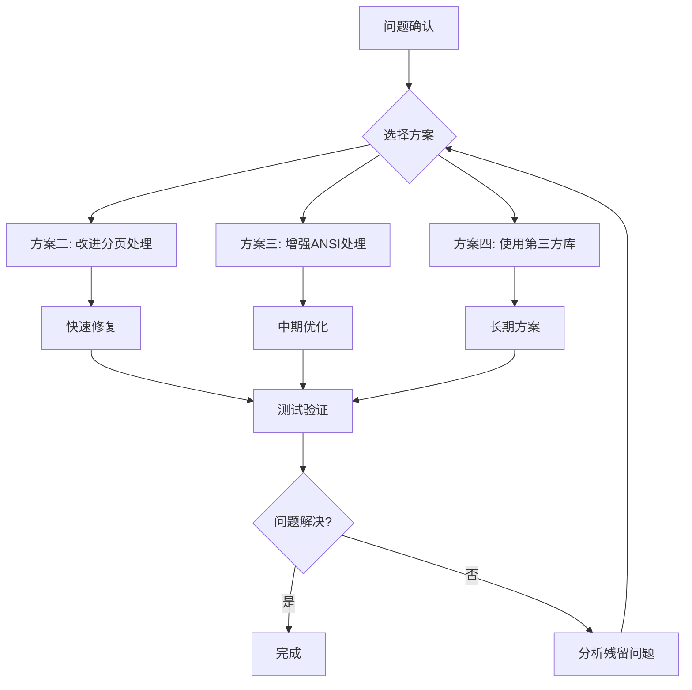

# SSH设备回显截断问题深度分析报告

## 一、问题概述

程序在执行SSH命令时出现设备回显截断问题，表现为命令回显不完整、输出内容被截断、提示符错位等现象。

## 二、日志对比分析

### 2.1 原始日志(raw.log) - 正确的完整回显

```
<CE1>
[10:20:28] >>> disp int b
disp int b
PHY: Physical
*down: administratively down
^down: standby
...
Interface                  PHY      Protocol  InUti OutUti   inErrors  outErrors
GE1/0/1                    up       up        0.01%  0.01%          0          0
GE1/0/2                    down     down         0%     0%          0          0
...
  ---- More ----
[10:20:28] >>> [RAW] " "
GE1/0/8                    down     down         0%     0%          0          0
...
```

### 2.2 详细日志(detail.log) - 截断后的异常输出

```
<CE1>PHY: PhysicaGE1/0/2                    down     down         0%     0%          0          0
GE1/0/3                    down     down         0%     0%          0          0
...
<CE1>*down: administInterface                   IP Address/Mask    Physical Protocol VPN
...
```

### 2.3 关键差异对比

| 对比项     | 原始日志(raw.log)           | 详细日志(detail.log)               | 问题说明       |
| ---------- | --------------------------- | ---------------------------------- | -------------- |
| 命令回显   | `disp int b` 完整显示       | 缺失或被截断                       | 命令回显被吞掉 |
| 表头信息   | `PHY: Physical` 完整        | `PHY: Physica` 被截断              | 表头被截断     |
| 提示符位置 | 独立一行 `<CE1>`            | 与输出混在一起 `<CE1>PHY: Physica` | 提示符错位     |
| 分页处理   | `---- More ----` 后继续输出 | 部分内容丢失                       | 分页后数据丢失 |

## 三、问题根因分析

### 3.1 核心问题：终端控制字符处理不当

通过对比日志，发现问题的根本原因是**终端控制字符（ANSI转义序列）处理不当**。

#### 证据1：原始日志中的控制字符

在 [`raw.log:36`](dist/netWeaverGoData/execution/live-logs/20260321_102027_asd_192.168.58.201_raw.log:36) 中可以看到：

```
[10:20:28] >>> [RAW] " "
[16D                [16DGE1/0/8...
```

`[16D` 是ANSI转义序列，表示**光标向左移动16列**。这是设备在分页后重新绘制屏幕时发送的控制字符。

#### 证据2：详细日志的清洗逻辑

在 [`detail_logger.go:194-202`](internal/report/detail_logger.go:194) 中：

```go
func cleanDetailChunk(chunk string) string {
    cleaned := ansiEscapeRegex.ReplaceAllString(chunk, "")  // 移除ANSI转义序列
    cleaned = strings.ReplaceAll(cleaned, "\r\n", "\n")
    cleaned = strings.ReplaceAll(cleaned, "\r", "\n")
    cleaned = strings.ReplaceAll(cleaned, "\x00", "")
    cleaned = paginationRegex.ReplaceAllString(cleaned, "")  // 移除分页符
    cleaned = strings.ReplaceAll(cleaned, "\b", "")          // 移除退格符
    return collapseBlankLines(cleaned)
}
```

**问题**：虽然移除了ANSI转义序列，但没有**模拟终端的行为**来处理这些控制字符的效果。

### 3.2 问题发生机制

```
时间线 →

T1: 设备输出表格第一页
    "GE1/0/1  up  up  0.01%  0.01%  0  0\n"
    "GE1/0/2  down  down  0%  0%  0  0\n"
    ...
    "  ---- More ----"
    ↓
T2: 程序检测到分页符，发送空格继续
    ↓
T3: 设备发送控制序列重绘屏幕
    "\x1b[16D" + "                " + "\x1b[16D" + "GE1/0/8..."
    含义：光标左移16列 → 清除16个字符 → 光标再左移16列 → 输出新内容
    ↓
T4: 程序清洗逻辑
    1. 移除 "\x1b[16D" → 得到 "                GE1/0/8..."
    2. 但没有执行"光标移动"和"字符覆盖"的语义
    3. 结果：空格和新内容被追加而非覆盖
    ↓
T5: 最终输出
    原本应该被覆盖的内容 + 新内容 = 混乱的输出
```

### 3.3 代码层面的问题定位

#### 问题点1：分页处理时清空缓冲区

在 [`executor.go:340-344`](internal/executor/executor.go:340)：

```go
if e.Matcher.IsPaginationPrompt(streamBuffer) || ... {
    logger.Debug("Executor", e.IP, "[自动翻页] 截获终端分页拦截符(More)，自动下发空格放行...")
    e.Client.SendRawBytes([]byte(" "))
    streamBuffer = ""  // ⚠️ 清空缓冲区，丢失了分页符之前的内容
    _ = e.flushDetailLog()
    continue
}
```

**问题**：清空 `streamBuffer` 导致分页符之前的输出被丢弃。

#### 问题点2：命令回显过滤逻辑的缺陷

在 [`executor.go:248-270`](internal/executor/executor.go:248)：

```go
if waitingForEcho && time.Now().Before(echoFilterDeadline) && lastSentCmd != "" {
    trimmedBuffer := strings.TrimLeft(streamBuffer, " \t\r\n")
    trimmedCmd := strings.TrimSpace(lastSentCmd)

    if strings.HasPrefix(trimmedBuffer, trimmedCmd) {
        streamBuffer = strings.TrimPrefix(trimmedBuffer, trimmedCmd)
        streamBuffer = strings.TrimLeft(streamBuffer, " \t\r\n")
        waitingForEcho = false
    } else if len(trimmedBuffer) >= len(trimmedCmd) {
        waitingForEcho = false
    }
}
```

**问题**：

1. 只检查缓冲区开头是否匹配命令，没有考虑终端控制字符的干扰
2. 如果命令回显中包含控制字符（如光标移动），匹配会失败

#### 问题点3：详细日志的行截断处理

在 [`executor.go:335-336`](internal/executor/executor.go:335)：

```go
// 将没有换行符的最后一部分留到 Buffer 中进行下一轮累积
streamBuffer = lastSegment
```

**问题**：`lastSegment` 是按 `\n` 分割后的最后一行，但如果设备输出中包含控制字符导致行内容混乱，这个截断会加剧问题。

### 3.4 PTY配置分析

在 [`sshutil/client.go:553-562`](internal/sshutil/client.go:553)：

```go
modes := ssh.TerminalModes{
    ssh.ECHO:          0,  // 关闭回显
    ssh.TTY_OP_ISPEED: 14400,
    ssh.TTY_OP_OSPEED: 14400,
}
if err := session.RequestPty("vt100", 256, 100, modes); err != nil {
    ...
}
```

**配置说明**：

- PTY类型：`vt100`
- 宽度：256列
- 高度：100行
- ECHO：0（关闭本地回显）

**问题**：虽然设置了256列宽度，但设备在分页时仍会发送控制字符来重绘屏幕，程序没有正确处理这些控制字符。

## 四、问题影响范围

| 影响类型 | 具体表现                         | 严重程度 |
| -------- | -------------------------------- | -------- |
| 数据丢失 | 分页后的部分输出内容丢失         | 高       |
| 数据错乱 | 表格列对齐错误，内容重叠         | 高       |
| 解析失败 | TextFM模板解析失败，无法提取字段 | 高       |
| 日志污染 | 详细日志与原始日志不一致         | 中       |
| 调试困难 | 问题复现和分析困难               | 中       |

## 五、解决方案

### 方案一：实现终端仿真器（推荐）

在清洗日志前，先模拟终端行为处理控制字符。

```go
// 新增 TerminalEmulator 结构体
type TerminalEmulator struct {
    buffer   []rune   // 屏幕缓冲区
    cursor   int      // 光标位置
    width    int      // 终端宽度
    height   int      // 终端高度
}

func (t *TerminalEmulator) Process(data string) string {
    // 解析并执行ANSI转义序列
    // 模拟光标移动、字符覆盖、清屏等操作
    // 返回最终的屏幕内容
}
```

**优点**：

- 彻底解决控制字符问题
- 输出结果与终端显示一致
- 支持各种复杂的终端操作

**缺点**：

- 实现复杂度较高
- 需要处理多种ANSI转义序列

### 方案二：改进分页处理逻辑

修改分页处理，不清空缓冲区，而是保留已接收的内容。

```go
// 修改 executor.go:340-344
if e.Matcher.IsPaginationPrompt(streamBuffer) || ... {
    logger.Debug("Executor", e.IP, "[自动翻页] 截获终端分页拦截符(More)，自动下发空格放行...")
    e.Client.SendRawBytes([]byte(" "))
    // 不再清空缓冲区，保留分页符之前的内容
    // streamBuffer = ""  // 移除这行
    _ = e.flushDetailLog()
    continue
}
```

**优点**：

- 改动小，风险低
- 保留所有原始数据

**缺点**：

- 可能引入重复内容
- 需要后续去重处理

### 方案三：增强ANSI转义序列处理

扩展 `cleanDetailChunk` 函数，处理更多控制字符。

```go
func cleanDetailChunk(chunk string) string {
    // 1. 处理光标移动序列
    chunk = processCursorMovement(chunk)

    // 2. 处理清除序列
    chunk = processClearSequence(chunk)

    // 3. 移除其他ANSI转义序列
    cleaned := ansiEscapeRegex.ReplaceAllString(chunk, "")

    // 4. 其他处理...
    return collapseBlankLines(cleaned)
}

func processCursorMovement(chunk string) string {
    // 处理 \x1b[nD (光标左移n列)
    // 处理 \x1b[nC (光标右移n列)
    // 处理 \x1b[nA (光标上移n行)
    // 处理 \x1b[nB (光标下移n行)
    // ...
}
```

**优点**：

- 针对性强，解决主要问题
- 改动适中

**缺点**：

- 需要识别和处理多种控制序列
- 可能遗漏某些特殊情况

### 方案四：使用第三方终端仿真库

引入成熟的终端仿真库，如 `terminal` 或 `vt100`。

```go
import "github.com/xxx/vt100"

func cleanDetailChunk(chunk string) string {
    term := vt100.NewVT100(100, 256)
    term.Process(chunk)
    return term.String()
}
```

**优点**：

- 实现简单
- 功能完整
- 维护成本低

**缺点**：

- 引入外部依赖
- 需要评估库的质量和性能

## 六、推荐实施路径



### 实施步骤

1. **短期修复**：实施方案二，修改分页处理逻辑
2. **中期优化**：实施方案三，增强ANSI转义序列处理
3. **长期方案**：评估并引入终端仿真库

## 七、验证方法

修改后执行以下命令验证：

```bash
disp int b          # 检查分页处理是否正确
disp ip int b       # 检查表格对齐
disp arp            # 检查数据完整性
disp mac-address    # 检查长命令输出
```

检查点：

- [ ] 原始日志与详细日志内容一致
- [ ] 命令回显完整显示
- [ ] 提示符位置正确（独立一行）
- [ ] 表格列对齐正确
- [ ] 分页后内容完整

## 八、相关代码文件

| 文件                                                                   | 说明                 | 关键行号                  |
| ---------------------------------------------------------------------- | -------------------- | ------------------------- |
| [`internal/executor/executor.go`](internal/executor/executor.go)       | 命令执行器，核心逻辑 | 340-344, 248-270, 335-336 |
| [`internal/sshutil/client.go`](internal/sshutil/client.go)             | SSH客户端，PTY配置   | 553-562, 618-638          |
| [`internal/report/detail_logger.go`](internal/report/detail_logger.go) | 详细日志清洗         | 194-202                   |
| [`internal/matcher/matcher.go`](internal/matcher/matcher.go)           | 提示符和分页匹配     | 74-86                     |

## 九、总结

本次分析发现，设备回显截断问题的根本原因是**终端控制字符处理不当**，而非之前分析的时序竞争问题。主要问题点包括：

1. **分页处理时清空缓冲区**导致数据丢失
2. **ANSI转义序列只移除不模拟**导致输出错乱
3. **命令回显过滤逻辑**未考虑控制字符干扰

建议采用分阶段实施方案，先快速修复分页处理问题，再逐步完善终端仿真功能。
