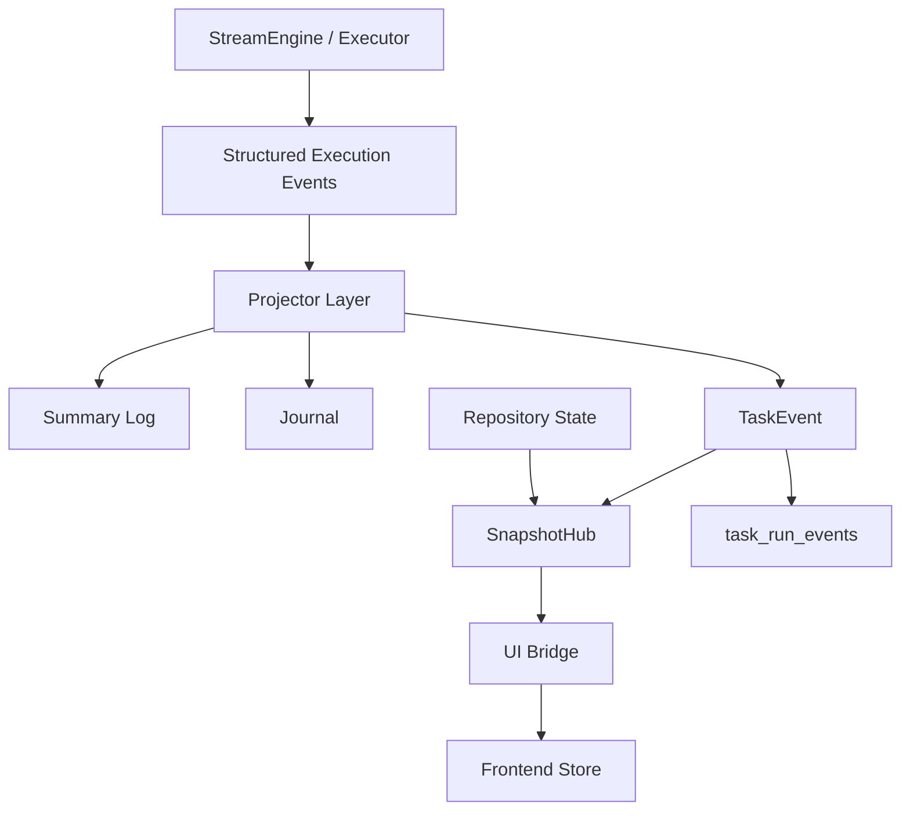

# 任务执行事件链路重构实施状态

## 1. 文档目的

本文档用于说明 [execution-event-pipeline-refactor.md](/D:/Document/GO/NetWeaverGo/docs/execution-event-pipeline-refactor.md) 的当前落地情况。

原方案文档描述的是目标架构和实施方向。  
本文档描述的是当前代码已经做到哪里、还差什么、下一步应该怎么推进。

这两份文档的职责不同：

- `execution-event-pipeline-refactor.md`：目标设计
- `execution-event-pipeline-implementation-status.md`：实施进度

## 2. 当前结论

当前代码已经不再只是修复“日志顺序看起来不对”这个单点问题，而是已经推进到“执行事件链路重构的中间态”。

可以用一句话概括当前状态：

**顺序问题已经从根因上被收紧，日志/快照/事件链路已经开始统一，但系统还没有完全演进到“Journal 是唯一事实源”的终态。**

## 3. 最初问题与当前对应关系

最初用户反馈的问题主要有三类：

1. 任务执行大屏没有日志，一直显示“等待日志输出”
2. `live-logs` 下没有预期日志，但 `app.log` 里显示任务成功
3. `summary.log` 中命令开始/完成顺序看起来交错，像并发执行

当前对应状态如下：

| 问题                     | 当前状态   | 说明                                        |
| ------------------------ | ---------- | ------------------------------------------- |
| 大屏没有日志             | 已解决     | 大屏现在消费后端快照中的日志                |
| 大屏显示过多 detail 日志 | 已解决     | 大屏只显示 `summary.log`                    |
| `live-logs` 未接通       | 已解决     | `summary/detail/raw/journal` 已接入运行链路 |
| 命令顺序看起来交错       | 已解决根因 | 引擎内已保证 `complete(n) < dispatch(n+1)`  |
| 快照强依赖回库重建       | 部分解决   | 已支持增量投影，回库重建仍作为兜底          |
| Journal 成为唯一事实源   | 未完成     | 当前是“Journal + 投影 + 旧仓库模型并存”     |

## 4. 已完成事项

## 4.1 执行大屏与日志链路

已完成：

- 大屏不再把设备日志写死为空
- 大屏只展示 `summary.log`
- `live-logs` 真实接入运行时
- 日志存储支持 `summary/detail/raw/journal`

涉及文件：

- [runtime.go](/D:/Document/GO/NetWeaverGo/internal/taskexec/runtime.go)
- [log_storage.go](/D:/Document/GO/NetWeaverGo/internal/report/log_storage.go)
- [journal_logger.go](/D:/Document/GO/NetWeaverGo/internal/report/journal_logger.go)
- [TaskExecution.vue](/D:/Document/GO/NetWeaverGo/frontend/src/views/TaskExecution.vue)
- [taskexecStore.ts](/D:/Document/GO/NetWeaverGo/frontend/src/stores/taskexecStore.ts)

结果：

- 大屏可以看到设备执行摘要
- `summary.log` 能作为大屏的主要日志来源
- `app.log` 不再是唯一能看出执行成功的地方

## 4.2 执行引擎事件顺序修正

已完成：

- 命令完成事件不再从 `Results()` 末端补发
- 引擎内事件顺序已经收紧为：

```text
CommandDispatched(1)
CommandCompleted(1)
CommandDispatched(2)
CommandCompleted(2)
```

- “命令开始”语义也收紧为“命令已成功写入设备”

涉及文件：

- [stream_engine.go](/D:/Document/GO/NetWeaverGo/internal/executor/stream_engine.go)
- [execution_plan.go](/D:/Document/GO/NetWeaverGo/internal/executor/execution_plan.go)
- [executor.go](/D:/Document/GO/NetWeaverGo/internal/executor/executor.go)
- [stream_engine_test.go](/D:/Document/GO/NetWeaverGo/internal/executor/stream_engine_test.go)

结果：

- 最初那个“上一个命令没完成，下一个命令先开始”的视觉问题，已经从执行链路根因上修正

## 4.3 结构化执行记录与 Projector 初步落地

已完成：

- 引入结构化命令记录
- 引入结构化生命周期记录
- 引入 Journal 落盘
- 引入 projector，开始统一处理：
  - 命令记录
  - 生命周期记录
  - unit/stage/run 进度
  - run/stage/unit 事件

涉及文件：

- [execution_record_projector.go](/D:/Document/GO/NetWeaverGo/internal/taskexec/execution_record_projector.go)
- [executor_impl.go](/D:/Document/GO/NetWeaverGo/internal/taskexec/executor_impl.go)
- [logscope.go](/D:/Document/GO/NetWeaverGo/internal/taskexec/logscope.go)

结果：

- `executor_impl.go` 中大量手工拼 summary / 组装事件的逻辑已经被收缩
- stage/run 进度的表达开始统一进入 projector

## 4.4 SnapshotHub 增量投影化

已完成：

- `SnapshotHub` 不再只是简单缓存
- 已支持：
  - `EnsureRun(...)`
  - `UpsertStage(...)`
  - `UpsertUnit(...)`
  - `ApplyRunPatch(...)`
  - `ApplyStagePatch(...)`
  - `ApplyUnitPatch(...)`
  - `AppendEvent(...)`
  - `BuildDelta(...)`

- 快照中已加入：
  - `revision`
  - `lastRunSeq`
  - `lastSessionSeqByUnit`
  - 事件级 `seq`
- UI Bridge 已开始推送 `task:snapshot_delta`
- 前端 Store 已支持按 `seq` 丢弃旧快照、消费 delta
- `Get()` 返回快照副本，避免外部篡改缓存
- `UpdateRun/Stage/Unit` 现在优先走增量投影，未命中才回退到仓库重建

涉及文件：

- [eventbus.go](/D:/Document/GO/NetWeaverGo/internal/taskexec/eventbus.go)
- [snapshot.go](/D:/Document/GO/NetWeaverGo/internal/taskexec/snapshot.go)
- [runtime.go](/D:/Document/GO/NetWeaverGo/internal/taskexec/runtime.go)
- [snapshot_hub_test.go](/D:/Document/GO/NetWeaverGo/internal/taskexec/snapshot_hub_test.go)

结果：

- 快照主路径已经不再是“每次更新都全量回库重建”
- 回库重建现在更多只是缓存 miss 或补偿路径的兜底
- 前后端之间已经具备“单调序号 + delta 载荷”的第一版协议骨架

## 4.5 TaskEvent 持久化统一入口

已完成：

- `TaskEvent` 现在可以通过统一 projector 落入 `task_run_events`
- 快照内事件和仓库回读事件开始统一来源

涉及文件：

- [task_event_projector.go](/D:/Document/GO/NetWeaverGo/internal/taskexec/task_event_projector.go)
- [runtime.go](/D:/Document/GO/NetWeaverGo/internal/taskexec/runtime.go)
- [taskexec_test.go](/D:/Document/GO/NetWeaverGo/internal/taskexec/taskexec_test.go)

结果：

- 实时内存事件与仓库回建事件不再是完全两套来源

## 4.6 编排策略开始抽离

已完成：

- 阶段依赖跳过策略抽离
- 关键阶段失败中止策略抽离
- 离线运行补偿取消策略抽离
- Run / Stage 终态写法开始统一收口为 helper
- 取消投影已拆出 Stage / Unit 级辅助收口函数

涉及文件：

- [orchestration_policy.go](/D:/Document/GO/NetWeaverGo/internal/taskexec/orchestration_policy.go)
- [orchestration_policy_test.go](/D:/Document/GO/NetWeaverGo/internal/taskexec/orchestration_policy_test.go)
- [runtime.go](/D:/Document/GO/NetWeaverGo/internal/taskexec/runtime.go)

结果：

- `runtime.go` 进一步从“直接写策略判断”收缩成“编排入口”
- 运行终态、Stage 终态、取消补偿的重复补丁写法已开始集中收口

## 5. 当前中间态架构

当前系统大致可以描述为：



说明：

- 事件顺序已经被收紧
- Projector 已经存在
- SnapshotHub 已经支持增量投影
- 但 Repository 仍然是状态来源之一
- Journal 还不是唯一事实源

## 6. 与目标方案的差距

当前最重要的差距如下。

## 6.1 还不是“Journal 唯一事实源”

目标方案要求：

- `summary/detail/snapshot/frontend` 都从 Journal 派生

当前实际情况：

- `summary` 和部分事件已经明显往 Journal/Projector 方向靠
- `snapshot` 仍是“增量投影 + 仓库兜底”混合模型
- run/stage/unit 状态表仍然是主业务状态存储

结论：

- 已经进入迁移态
- 还没有彻底切成“先 Journal，后投影”

## 6.2 还没有完整的 Session Actor 终态

目标方案要求：

- `Session Actor`
- `Reducer -> transition + effect`
- effect 结果回流 actor

当前实际情况：

- 已经把顺序问题在引擎侧修正
- `SessionReducer` 已新增兼容式 `TransitionBatch`
- `SessionAdapter` / `StreamEngine` 已能走 `ReduceBatch -> batch -> 旧动作执行链`
- 但 아직没有完整落成文档中的 `Session Actor + TransitionBatch + EffectExecutor` 结构

结论：

- 顺序问题已修
- reducer 输出对象已经开始成型
- 但执行引擎的架构终态还没完全重塑

## 6.3 runtime 仍不是纯 orchestration shell

目标方案要求：

- runtime 只编排，不判断业务表达、不负责投影细节

当前实际情况：

- 已经比最初干净很多
- `abortPlan`、Run 终态写入、Stage 终态写入、取消投影循环已经开始抽成统一 helper
- 但 `skipStage`、`handleCancellation` 等流程还没有全部继续拆成更统一的 projector/policy 组合

结论：

- 已经进入壳化过程
- 还没完全壳化

## 6.4 前端还没有进入真正的 delta 模型

目标方案要求：

- 页面初始化拉一次快照
- 后续按 seq 增量应用 delta

当前实际情况：

- 前端已改为直接吃 `task:snapshot_data`
- Bridge 已增加 `task:snapshot_delta`
- Store 已支持基于 `lastRunSeq` 的增量接入与旧包丢弃
- 已不再在每个事件上频繁回源刷新
- 当前 delta 仍是“带全量 snapshot 的增量封装”，还不是细粒度 patch 协议

结论：

- 已经从“事件触发全量刷新”进化到“按 seq 增量接入”
- 但不是文档设计中的最终消费模式

## 7. 当前代码最明显的遗留问题

以下是继续重构时最值得关注的几类遗留点。

### 7.1 `runtime.go` 仍然偏大

虽然已经明显收缩，但它仍承担了：

- 任务主循环
- 状态更新入口
- 快照兜底回建
- 部分 stage/run 生命周期收口

建议继续把：

- 高层状态收口
- 取消路径的事件/状态表达
- 更细的 orchestration policy

进一步抽离。

### 7.2 `executor_impl.go` 仍有部分运行时状态逻辑

当前它已经不再像最初那样散乱，但仍保留：

- 一些 unit 级状态切换
- 一些取消路径处理
- 一些阶段进度推进

最新进展：

- 命令执行、采集、解析分支的 unit 生命周期写法已开始统一复用 helper

建议继续把 unit 生命周期表达再往 projector 靠。

### 7.3 SnapshotHub 仍然依赖 Repository 兜底

这本身不是 bug，但说明：

- 当前系统仍然允许“内存投影未命中 -> 仓库重建”

只要这个兜底还在，就意味着：

- Repository 仍然是半事实源

后续如果要完全对齐目标方案，需要考虑：

- 更彻底的 journal-first
- 更清晰的快照重放/重建机制

## 8. 当前建议的后续阶段

如果继续推进，建议按下面顺序走。

### 阶段 A：继续压缩 runtime / executor_impl

目标：

- 让 `runtime.go` 更接近 orchestration shell
- 让 `executor_impl.go` 更接近执行驱动器

优先动作：

- 继续收口 run/stage/unit 生命周期写法
- 继续把取消/终态表达抽到 projector/policy

### 阶段 B：明确 Journal-first 边界

目标：

- 让 Journal 真正成为主事实源

优先动作：

- 定义哪些状态必须先写 Journal，再更新投影
- 评估 run/stage/unit 仓库模型如何转为投影存储

### 阶段 C：演进到更明确的 Actor / Transition / Effect 模型

目标：

- 对齐原方案文档的执行基座终态

优先动作：

- 进一步重构 `StreamEngine`
- 明确 reducer 输出对象
- 建立更纯粹的 effect 回流模型

### 阶段 D：前端增量协议升级

目标：

- 让 UI 不只是“收快照推送”，而是具备更清晰的增量消费能力

## 9. 当前验证状态

截至本文档编写时，已通过的验证包括：

- `go test ./internal/taskexec`
- `go test ./internal/executor ./internal/taskexec`
- 根目录 `build.bat`

说明：

- 当前代码处于“可编译、可测试、可继续演进”的中间态
- 不是只停留在文档设计阶段

## 10. 建议

接下来继续重构时，建议遵守以下原则：

1. 不要再把原方案文档当作实施进度文档使用。
2. 每推进一个阶段，就同步更新本文档中的“已完成 / 部分完成 / 未完成”。
3. 任何新增重构动作，都优先判断它属于：
   - 顺序问题修复
   - 事实源统一
   - 投影层收口
   - runtime 壳化
4. 如果某次改动只是“临时补丁”，应明确标记，不要让中间态伪装成终态。

## 11. 当前状态判定

截至现在，可以把本次重构判定为：

**已完成第一阶段和第二阶段的大部分关键工作，已经进入第三阶段早期，但距离最终目标架构仍有明显距离。**

更直白地说：

- 症状已修
- 根因已开始系统性治理
- 架构已明显转向
- 终态尚未完成
