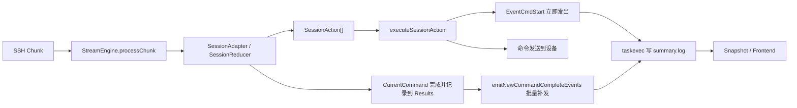
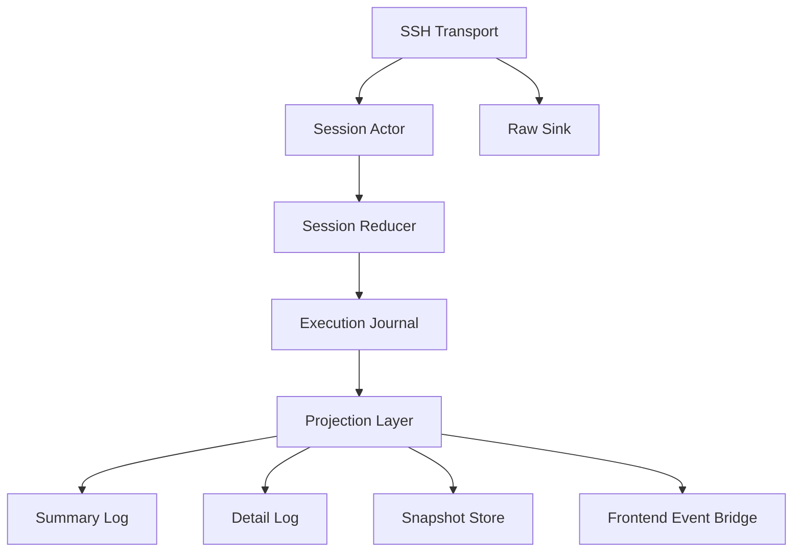

# 任务执行事件顺序与观测链路全局重构方案

## 1. 背景

当前任务执行链路已经具备以下能力：

- 设备 SSH 执行
- 命令级状态机
- `summary/detail/raw` 三类日志
- `taskexec` 运行时快照
- Wails 前端事件桥接
- 任务执行大屏展示

但这条链路的“事实源”并不统一，导致执行是串行的，展示却看起来像半并发。典型现象如下：

```text
[16:32:35] 命令[2/8]开始: disp bgp p v
[16:32:35] 命令[1/8]完成: disp arp
```

从用户角度看，这会被理解为“上一条命令未完成，下一条命令已经开始”。  
从代码角度看，真实原因不是执行乱序，而是：

- `命令开始` 在发送动作执行时立即发出
- `命令完成` 在本轮动作全部执行后，再从 `Results()` 中批量补发

因此，当前系统存在一个根本问题：

**系统展示的是“事件发射时机”，而不是“状态迁移顺序”。**

项目为新建项目，不需要兼容历史实现，因此不建议围绕当前行为打补丁。应该直接把执行、日志、快照、前端统一到一条新的事件流水线上。

## 2. 现状诊断

### 2.1 当前链路

当前主链路大致为：



### 2.2 当前实现的核心缺陷

#### 缺陷 A：事件不是原子事实，而是执行副产物

`EventCmdStart` 是在 `ActSendCommand` 执行时直接发出的。  
`EventCmdComplete` 不是状态机产物，而是后处理阶段从 `adapter.Results()` 增量 diff 出来的。

这意味着：

- “开始”来自动作层
- “完成”来自结果扫描层
- 二者不是同一事务中的两个有序事实

#### 缺陷 B：日志写入点分散

目前业务摘要日志分散在多个层次：

- `executor_impl.go` 写 summary
- `stream_engine.go` 写 detail
- SSH raw sink 写 raw
- `app.log` 也记录部分执行信息

这会造成：

- 不同日志文件来自不同事实源
- 同一时刻的日志在不同文件中顺序不一致
- 排查问题时难以界定“哪份日志才是准的”

#### 缺陷 C：快照与前端没有稳定事件序

当前前端更多依赖：

- 收到事件后刷新快照
- 快照本身再从数据库和日志文件拼装

这里缺少一个明确的、可重放的事件序号机制，导致：

- UI 看到的是近似状态，不是严格事件流
- 如果一个 run 同时包含多 unit，前端只能依赖时间和刷新时机猜测顺序

#### 缺陷 D：结果列表被错误地当作事件源

`Results()` 应该是命令执行的归档结果，而不是事件总线的事实源。  
一旦把 `Results()` 当作事件来源，就会自然出现“结果稍后补发”的问题。

#### 缺陷 E：领域语义不清晰

当前“开始”到底表示什么，并不严格：

- 是命令被状态机选中？
- 是命令被发送到 socket？
- 是设备回显了命令？

“完成”也不严格：

- 是检测到 prompt？
- 是结果已归档？
- 是 summary 已写盘？

这类语义不清晰，会持续污染后续所有观测能力。

## 3. 重构目标

本次重构目标不是“把日志顺序调一下”，而是建立一个新的执行观测基座。

### 3.1 主目标

- 让所有展示都基于“状态迁移顺序”而非“事件到达时机”
- 为每个设备会话建立严格单调递增的事件序
- 让 `summary/detail/raw/snapshot/frontend` 都从同一事实源派生
- 让执行引擎、任务运行时、前端消费对事件语义保持一致

### 3.2 具体目标

- 每个设备会话保证“命令 N 完成”严格早于“命令 N+1 开始”
- `summary.log` 成为命令执行摘要的标准投影，而不是手工拼接文本
- `taskexec` 快照成为事件投影结果，而不是临时拼装结果
- 前端可以按事件序增量更新，而不是频繁全量刷新
- `app.log` 只承担调试职责，不再承载业务真相

### 3.3 非目标

- 不追求保留现有事件格式
- 不追求兼容当前内部回调接口
- 不追求局部平滑迁移

项目是新建项目，优先保证新架构一致性，不为旧结构妥协。

## 4. 设计原则

### 4.1 事件日志是唯一事实源

执行过程中一切可观测状态，必须由一条有序事件流派生。

包括但不限于：

- summary
- snapshot
- run/stage/unit 进度
- 前端执行态
- 执行历史

### 4.2 状态机只产出领域事实，不直接写业务日志

状态机和运行器只能产生结构化领域事件，例如：

- `CommandDispatched`
- `CommandCompleted`
- `CommandFailed`
- `SessionConnected`
- `SessionCompleted`

不应直接拼接“命令[3/8]完成: xxx”这种展示文本。

### 4.3 投影层负责“把事实翻译成人话”

`summary.log`、大屏、任务历史、详情页，都是投影层。  
它们消费结构化事实，并负责：

- 文案模板
- 语言本地化
- 展示截断
- 聚合统计

### 4.4 单设备会话必须是单写者模型

每个设备会话在任意时刻只能有一个协程负责：

- 读取 SSH 输出
- 推进状态机
- 生成事件
- 执行动作

这样才能天然获得会话内强顺序。

### 4.5 时间戳不是排序依据，序号才是

日志时间最多只能显示到毫秒，甚至秒。  
真正的排序依据必须是：

- `session_seq`
- 必要时再加 `run_seq`

## 5. 目标架构

建议围绕“执行事件流水线”重构为 5 层：



### 5.1 层次定义

#### 第一层：SSH Transport

职责：

- 建立连接
- 收发字节流
- 原始字节透传到 raw sink
- 提供 chunk 输入给会话 actor

不负责：

- 业务事件
- summary 文案
- 进度计算

#### 第二层：Session Actor

每个设备一个 actor，串行处理：

- 接收到的 SSH chunk
- 超时事件
- 用户决策事件
- 执行动作后的结果回执

职责：

- 保证同一设备会话内的事件严格有序
- 统一维护 `session_seq`
- 驱动 reducer 与 effect executor

#### 第三层：Session Reducer

纯领域状态机。输入事件，输出：

- 领域迁移事件 `DomainTransition[]`
- 副作用动作 `Effect[]`

不直接做：

- 网络发送
- 写日志
- 更新数据库

#### 第四层：Execution Journal

统一结构化事件日志，是真正的事实源。

它需要具备：

- 追加写
- 会话内顺序号
- 可选 run 级全局顺序号
- 可重放
- 可供投影订阅

#### 第五层：Projection Layer

投影层订阅 journal，把结构化事件转换为：

- `summary.log`
- `detail.log`
- 快照
- UI 增量事件
- 历史统计

## 6. 核心重构：从“回调事件”改为“领域迁移日志”

### 6.1 新的核心对象

建议新增统一事件结构 `ExecutionRecord`：

```go
type ExecutionRecord struct {
    EventID      string
    RunID        string
    StageID      string
    UnitID       string
    SessionID    string
    SessionSeq   uint64
    RunSeq       uint64
    Kind         ExecutionEventKind
    OccurredAt   time.Time

    DeviceIP     string
    CommandIndex int
    CommandKey   string
    CommandText  string

    Level        string
    Payload      map[string]any
}
```

其中：

- `SessionSeq` 是强制字段，作为单设备顺序依据
- `RunSeq` 是可选全局序号，便于跨设备聚合
- `Kind` 是结构化事件类型，而不是展示文案

### 6.2 事件类型设计

建议至少定义以下事件：

#### 会话级

- `SessionCreated`
- `SessionConnecting`
- `SessionConnected`
- `SessionConnectFailed`
- `SessionCancelled`
- `SessionCompleted`
- `SessionFailed`

#### 命令级

- `CommandQueued`
- `CommandDispatching`
- `CommandDispatched`
- `CommandOutputCommitted`
- `CommandPromptMatched`
- `CommandCompleted`
- `CommandFailed`
- `CommandSkipped`

#### 控制级

- `PagerDetected`
- `PagerContinued`
- `SuspendRequested`
- `SuspendResumed`
- `SuspendAborted`
- `ReadTimeoutTriggered`

#### 聚合级

- `UnitProgressAdvanced`
- `StageProgressAdvanced`
- `RunProgressAdvanced`

注意：

- `CommandCompleted` 才是“这条命令对进度有贡献”的标准事件
- `CommandDispatched` 只表示“命令已成功发出”

### 6.3 事件语义规范

这一步必须在项目范围内统一，否则后续又会回到旧问题。

#### `CommandDispatched`

定义：

- 命令已写入 SSH 会话发送通道
- 如果底层发送失败，不得发出本事件

展示语义：

- 可映射为“命令开始”

#### `CommandCompleted`

定义：

- 已检测到该命令的终止 prompt
- 命令输出已归档
- 结果对象已封存

展示语义：

- 可映射为“命令完成”

#### 强制顺序规则

对同一会话，必须保证：

1. `CommandCompleted(n)` 严格早于 `CommandDispatched(n+1)`
2. `CommandFailed(n)` 严格早于 `CommandDispatched(n+1)`，如果配置允许继续
3. `SessionCompleted` 严格晚于最后一条命令的终态事件

## 7. Session Actor 设计

### 7.1 为什么要引入 Actor

当前虽然逻辑上是串行循环，但事件生成分布在：

- reducer
- action executor
- 结果扫描

这仍然会让顺序出现歧义。  
Actor 的价值在于：

- 单入口
- 单调顺序号
- 统一事务边界

### 7.2 Actor 的输入消息

```go
type SessionMessage interface{}

type MsgChunk struct {
    Data []byte
    At   time.Time
}

type MsgTimeout struct {
    At time.Time
}

type MsgUserDecision struct {
    Decision SuspendDecision
    At       time.Time
}

type MsgEffectResult struct {
    EffectID string
    Result   any
    Err      error
    At       time.Time
}
```

### 7.3 Actor 的处理流程

每次处理一个消息时：

1. 调 reducer 得到 `TransitionBatch`
2. 为 batch 内每个 transition 分配连续 `SessionSeq`
3. 先写入 journal
4. 再把这些 transition 投递给投影器
5. 最后执行对应 `Effect[]`
6. effect 执行结果以新消息形式重新进入 actor

这样可以保证：

- 领域事实一定先于外部观测面出现
- 任何 effect 的结果都通过同一条管道回流
- 没有“动作先写日志，结果后补发”这种时序分裂

## 8. Reducer 输出模型

### 8.1 统一返回结构

建议 reducer 不再只返回 `[]SessionAction`，而是返回：

```go
type TransitionBatch struct {
    Transitions []DomainTransition
    Effects     []Effect
}
```

`DomainTransition` 表示已成立的业务事实，`Effect` 表示后续需要执行的副作用。

### 8.2 命令完成与下一条开始的正确顺序

当 reducer 识别到 prompt，且判定当前命令完成时，标准处理应该是：

1. 产生 `CommandPromptMatched`
2. 产生 `CommandCompleted`
3. 如果还有下一条命令，产生 `EffectSendCommand(next)`

然后 actor：

1. 先把 `CommandCompleted` 写入 journal
2. 再执行 `EffectSendCommand(next)`
3. 如果发送成功，再写 `CommandDispatched(next)`

这样从事实序看，一定是：

```text
CommandCompleted(1)
CommandDispatched(2)
```

这是本次重构最关键的顺序保证。

### 8.3 禁止从 `Results()` 派生完成事件

`Results()` 只能作为归档结果容器，不允许再承担：

- 增量完成事件生成
- 进度推进源
- UI 事件源

否则仍会回到“补发完成事件”的旧问题。

## 9. 日志体系重构

### 9.1 日志职责重新划分

建议全局划分为四类日志：

#### 1. Journal

结构化、追加写、机器可读。  
这是唯一事实源。

建议格式：

- JSON Lines
- 每行一个 `ExecutionRecord`

#### 2. Summary Log

面向人读的摘要日志。  
由 journal 投影生成。

#### 3. Detail Log

面向排障的规范化输出日志。  
由以下信息组合生成：

- `CommandDispatched`
- `CommandCompleted / CommandFailed`
- 规范化输出行

#### 4. Raw Log

原始 SSH 字节流，仅用于协议级排查。

### 9.2 Summary 只允许由投影器写

必须禁止在 `executor_impl.go`、`stream_engine.go`、`runtime.go` 中手写 summary 文本。

统一做法：

- actor 写 journal
- `SummaryProjector` 订阅 journal
- 根据事件模板写出人类文本

例如：

| 领域事件 | summary 文案 |
| --- | --- |
| `SessionConnecting` | `开始连接设备，共 8 条命令` |
| `SessionConnected` | `SSH 连接成功` |
| `CommandDispatched(1, "disp arp")` | `命令[1/8]开始: disp arp` |
| `CommandCompleted(1, "disp arp")` | `命令[1/8]完成: disp arp` |
| `SessionCompleted` | `设备执行完成，成功命令数: 8` |

### 9.3 Detail Log 的写法

detail 不应再由引擎层零散刷新，而应形成明确边界：

- `>>> command`
- normalized output lines
- `<<< prompt matched`

这部分可由 `DetailProjector` 写出，必要时接收实时 normalized lines 流。

### 9.4 App Log 重新定位

`app.log` 只记录：

- 框架级调试
- 异常栈
- 性能指标
- 非业务语义日志

禁止再把“命令执行成功”这类业务事实只写到 `app.log` 而不进入 journal。

## 10. 快照与前端链路重构

### 10.1 Snapshot 从“即时拼装”改为“事件投影”

建议新增 `SnapshotProjector`，订阅 journal，实时维护：

- Run 视图
- Stage 视图
- Unit 视图
- 当前命令
- 最近 summary tail

这样 `ExecutionSnapshot` 就不再是：

- 数据库状态 + 日志文件 + 事件表 的临时拼装结果

而是：

- 对 journal 的确定性投影

### 10.2 Snapshot 中加入顺序字段

建议在快照中加入：

- `lastSessionSeqByUnit`
- `lastRunSeq`

前端可据此判断是否丢事件、是否乱序。

### 10.3 前端改为增量消费

前端不应在每个事件后都去拉完整快照。  
推荐模式：

1. 页面打开时，拉一次全量 snapshot
2. 之后通过 bridge 接收 journal delta 或 snapshot delta
3. 前端 store 按 `seq` 增量应用
4. 仅在发现 gap 时回源拉全量快照

### 10.4 大屏只显示 summary 投影

大屏的日志视图应明确定位为：

- 只显示 `summary.log` 的尾部
- 按事件序展示
- 不直接拼装 detail

这样 UI 语义就会稳定很多。

## 11. 任务运行时与仓储重构

### 11.1 taskexec 的职责收缩

`taskexec` 应只负责：

- 任务编排
- 生命周期控制
- 调用 stage executor
- 聚合 unit/stage/run 投影

不应再负责：

- 手工拼 summary
- 推测命令完成事件
- 从日志文件反算运行状态

### 11.2 Repository 的角色

Repository 建议只存投影结果：

- run 状态表
- stage 状态表
- unit 状态表
- event index 或 journal metadata

如果保留数据库中的事件表，也建议它存结构化事件，而不是 UI 文案事件。

### 11.3 进度推进规则统一

进度只能由命令终态事件推进：

- `CommandCompleted`
- `CommandFailed`
- `CommandSkipped`

不得由：

- `CommandDispatched`
- 日志行数
- detail 行数

来推进进度。

## 12. 包结构重构建议

既然项目可重构，建议不要继续把执行引擎和任务编排紧耦合在当前目录结构中。

推荐结构：

```text
internal/
  execution/
    journal/
      record.go
      writer.go
      subscriber.go
    session/
      actor.go
      reducer.go
      state.go
      message.go
      effect.go
    transport/
      ssh_client.go
      stream_reader.go
    projection/
      summary_projector.go
      detail_projector.go
      snapshot_projector.go
      metrics_projector.go
    model/
      event_kind.go
      execution_record.go
      snapshot.go
  taskexec/
    runtime/
      manager.go
      launcher.go
    planner/
    service/
  ui/
    bridge/
      execution_bridge.go
```

重构原则：

- `execution` 是底层统一执行基座
- `taskexec` 是任务编排层
- `ui` 只消费投影和增量事件

## 13. 关键接口调整建议

### 13.1 废弃 `ExecutionEvent` 回调模型

当前 `ExecutePlaybookWithEvents(..., callback)` 的回调模型过于脆弱，容易把领域事实退化为即时 side effect。

建议改为：

```go
type ExecutionObserver interface {
    Append(record ExecutionRecord) error
}
```

或者更明确：

```go
type JournalWriter interface {
    Append(batch []ExecutionRecord) error
}
```

执行器只依赖 journal，不依赖 UI 事件回调。

### 13.2 `DeviceExecutor` 新职责

`DeviceExecutor` 只负责：

- 建连
- 驱动 session actor
- 返回最终 report

不再负责：

- 手工 summary 写入
- 通过 callback 直接驱动上层 UI

### 13.3 `RuntimeContext` 新职责

`RuntimeContext` 应提供：

- 获取 journal writer
- 获取 snapshot projector handle
- 获取 cancellation token

不应提供“任意写日志”的自由接口。

## 14. 调试与可观测性设计

### 14.1 Debug 日志分层

建议把调试日志明确分为三层：

#### Framework Debug

例：

- actor 收到什么消息
- reducer 产出什么 transition/effect
- projector 落盘耗时

#### Domain Debug

例：

- `SessionSeq=17 CommandCompleted index=2`
- `SessionSeq=18 CommandDispatched index=3`

#### Infra Debug

例：

- SSH 重连
- 文件写入失败
- event bridge 堵塞

### 14.2 必须输出的关键 debug 点

建议保留以下 debug 点，便于线上排障：

- actor 输入消息类型与当前 state
- reducer 输出的 transition 数量与 effect 数量
- 每条 journal 记录的 `session_seq/run_seq`
- projector 落盘失败
- snapshot projector 的 last applied seq
- frontend bridge 发送的最后序号

### 14.3 verbose 日志应围绕序号而不是文本

不要继续只打印：

- “命令开始”
- “命令完成”

而应打印：

```text
[verbose] session=10.0.0.1 seq=42 kind=CommandCompleted cmdIndex=3
[verbose] session=10.0.0.1 seq=43 kind=CommandDispatched cmdIndex=4
```

这样一眼就能看出顺序是否正确。

## 15. 实施步骤

由于项目为新建项目，建议采用“基座先立，再整体切换”的方式，而不是与旧链路长期双轨并存。

### 阶段 1：冻结语义与事件模型

输出物：

- `ExecutionRecord` 结构
- `EventKind` 枚举
- 事件语义文档
- 顺序约束文档

验收标准：

- 团队对“开始/完成/失败/取消”的语义达成唯一解释

### 阶段 2：实现 Journal 与 Session Actor

输出物：

- `journal.Writer`
- `session.Actor`
- `TransitionBatch`
- `EffectExecutor`

验收标准：

- 单设备执行过程中能产生连续 `session_seq`
- 不再从 `Results()` 补发完成事件

### 阶段 3：重写 StreamEngine 与 Reducer 协作方式

输出物：

- reducer 只产出 transition + effect
- effect 成功后回流 actor，再生成结构化事件

验收标准：

- 同一会话内稳定满足 `Completed(n) < Dispatched(n+1)`

### 阶段 4：接入 Projection Layer

输出物：

- `SummaryProjector`
- `DetailProjector`
- `SnapshotProjector`

验收标准：

- `summary.log` 完全由 projector 生成
- 快照不再依赖扫描日志文件推断状态

### 阶段 5：改造 taskexec Runtime

输出物：

- runtime 改为使用 projector 输出的快照
- progress 完全来自命令终态事件

验收标准：

- run/stage/unit 进度与 summary 顺序一致

### 阶段 6：改造前端 Store 与 Bridge

输出物：

- bridge 支持序号增量推送
- store 支持按 seq 应用更新

验收标准：

- 前端不需要每个事件都全量 refresh snapshot

### 阶段 7：删除旧接口与旧语义

删除项：

- `emitNewCommandCompleteEvents`
- 直接回调式 `ExecutionEvent`
- 在执行器和 taskexec 中手工拼 summary 文本的逻辑

验收标准：

- 系统中只有一条事件事实源

## 16. 测试策略

### 16.1 单元测试

重点测试：

- reducer 在 prompt 到来时先产出 `CommandCompleted`
- effect 成功后再产出 `CommandDispatched(next)`
- ContinueOnError 场景顺序不乱
- pager 场景不乱
- suspend/resume 场景不乱

### 16.2 属性测试

对任意命令序列，验证不变量：

- `SessionSeq` 严格递增
- 同一 `CommandIndex` 的完成事件只出现一次
- `CommandCompleted(n)` 必须早于 `CommandDispatched(n+1)`

### 16.3 集成测试

构造模拟 SSH 输出流，验证：

- summary 顺序正确
- snapshot 进度正确
- 前端收到的序号无 gap

### 16.4 回放测试

用 journal 回放生成：

- summary.log
- snapshot
- history summary

确认重放结果与实时运行结果一致。

## 17. 验收标准

重构完成后，应满足以下强约束：

### 17.1 顺序一致性

对任意单设备执行日志，不再出现：

```text
命令[N+1]开始
命令[N]完成
```

### 17.2 事实源唯一

以下对象都必须从 journal 派生：

- summary
- snapshot
- progress
- 前端事件

### 17.3 进度语义一致

命令完成、日志展示、unit 进度、stage 进度、run 进度之间不存在语义偏差。

### 17.4 可重放

只要保留 journal，就能重建：

- 任务执行摘要
- 单设备执行过程
- 任务历史快照

## 18. 推荐决策

本项目不建议继续在现有 `StreamEngine -> callback -> summary` 路径上修修补补。  
推荐直接采用以下最终方案：

1. 建立 `Execution Journal` 作为唯一事实源。
2. 引入 `Session Actor`，保证单设备事件严格顺序。
3. 让 reducer 输出 `transition + effect`，彻底拆开领域事实与副作用。
4. 让 `summary/detail/snapshot/frontend` 全部改为 projector。
5. 删除基于 `Results()` 的完成事件补发逻辑。

这是从根上解决“看起来像并发执行”的唯一优雅方案，也是后续继续扩展任务执行、拓扑采集、异常挂起、执行回放时最稳的基座。
