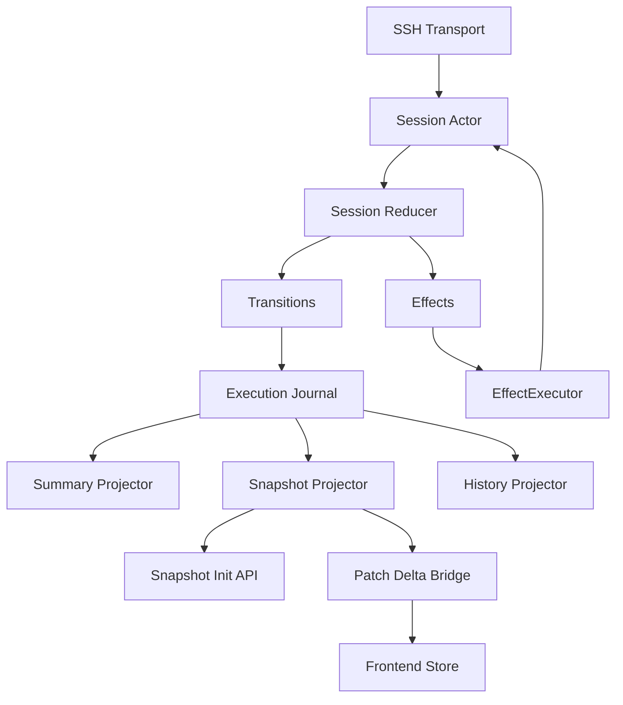

# 执行事件链路硬切换修复实施方案

## 1. 文档定位

本文档是基于审计报告 [`docs/execution-event-pipeline-code-audit-issues.md`](docs/execution-event-pipeline-code-audit-issues.md) 重新整理后的**硬切换实施方案**。

本方案明确采用以下前提：

- 项目处于新建期
- 不需要任何历史兼容
- 不保留旧接口
- 不保留双轨链路
- 不保留临时过渡路径作为长期实现
- 可以直接删除现有中间态兼容代码

本文档的目标不是“平滑迁移”，而是：

**一次性确定最终目标架构，并按阶段硬切换，把当前所有兼容残留、旧路径、伪增量、伪 Transition/Effect 全部删除。**

---

## 2. 核心结论

当前系统最大的问题，不是单点 bug，而是**中间态伪完成**：

- 看起来已经有 `delta`
- 看起来已经有 `TransitionBatch`
- 看起来已经有 `SessionEffect`
- 看起来已经开始 Journal-first

但实际上仍存在：

- `task:snapshot_delta + task:snapshot_data + task:snapshot` 三路并行
- `ReduceBatch -> ToActions -> executeSessionAction` 的旧动作回退链
- `Results()` + `emitNewCommandCompleteEvents()` 的旧完成事件补发链
- `TaskEvent`、Journal、Snapshot、UI Event 混杂并存
- 多处“兼容旧接口”的保留逻辑

因此本轮方案必须明确：

**不是继续过渡，而是删除过渡层。**

---

## 3. 最终目标架构

### 目标架构解释

1. [`internal/executor/stream_engine.go`](internal/executor/stream_engine.go) 只做 transport 和 actor 驱动，不再承担旧动作执行主控职责。
2. [`internal/executor/session_reducer.go`](internal/executor/session_reducer.go) 只输出：
   - `Transitions`
   - `Effects`
3. `Execution Journal` 是唯一事实源。
4. 所有投影：
   - `summary`
   - `snapshot`
   - `history`
   - `ui delta`
     全部从 Journal 派生。
5. 前端只接受：
   - 初始化快照
   - patch delta
6. 不允许再存在：
   - 旧动作数组主路径
   - 运行时双发全量快照
   - 兼容桥接事件
   - 从 `Results()` 派生完成事件

---

## 4. 强制约束

## 4.1 必须删除的东西

以下内容必须被删除，不能保留为兼容层：

### 前后端协议层

- [`task:snapshot_data`](internal/ui/taskexec_event_bridge.go)
- [`task:snapshot`](internal/ui/taskexec_event_bridge.go)
- 前端对 [`task:snapshot_data`](frontend/src/stores/taskexecStore.ts) 的运行时监听
- 前端对 [`task:snapshot`](frontend/src/stores/taskexecStore.ts) 的兼容监听

### 执行基座层

- [`Reduce()`](internal/executor/session_reducer.go)
- [`FeedSessionActions()`](internal/executor/session_adapter.go)
- [`ResolveErrorActions()`](internal/executor/session_adapter.go)
- [`ReduceEvent()`](internal/executor/session_adapter.go)
- [`ResolveError()`](internal/executor/session_adapter.go)
- [`AsAction()`](internal/executor/session_types.go)
- [`ToActions()`](internal/executor/session_types.go)
- [`executeSessionAction()`](internal/executor/stream_engine.go) 作为主执行入口

### 旧完成事件链路

- [`Results()`](internal/executor/session_adapter.go) 作为事实派生来源
- [`emitNewCommandCompleteEvents()`](internal/executor/stream_engine.go)
- 任何“从结果列表补发 completed/failed”的逻辑

### 中间态投影层

- 多 schema Journal 混写
- [`internal/taskexec/execution_record_projector.go`](internal/taskexec/execution_record_projector.go) 的大一统混合职责形态
- 运行时直接拼 summary 文本的路径

---

## 4.2 明确禁止的做法

以下做法在本轮实施中明确禁止：

1. 保留任何“先跑起来再说”的兼容层
2. 保留旧接口以避免改测试
3. 保留双发快照，等待以后再删
4. 保留 `TransitionBatch -> ActionEffect -> SessionAction` 作为中长期结构
5. 保留 `SnapshotHub.revisions` 内存序号系统作为最终设计
6. 保留 `TaskEvent` 作为事实源
7. 保留 `Results()` 参与事件生成

---

## 5. 分阶段实施方案

## 阶段 0：冻结最终契约，先删概念歧义

### 目标

先把最终契约冻结，禁止边改边漂移。

### 要做的事

1. 定义唯一事件模型 `ExecutionRecord`
2. 定义唯一事件枚举 `ExecutionEventKind`
3. 定义唯一 actor 输入消息 `SessionMessage`
4. 定义唯一 reducer 输出：
   - `Transitions []ExecutionRecord`
   - `Effects []Effect`
5. 定义唯一前端协议：
   - `SnapshotInit`
   - `SnapshotPatchDelta`
   - `DeltaOp`

### 直接替换模块

- [`internal/executor/session_types.go`](internal/executor/session_types.go)
- [`internal/taskexec/snapshot.go`](internal/taskexec/snapshot.go)
- [`frontend/src/types/taskexec.ts`](frontend/src/types/taskexec.ts)

### 完成标准

- 所有事件字段有唯一语义
- 不再允许通过 payload 塞临时字段
- 前后端协议统一成一套类型定义

---

## 阶段 1：Journal-first 硬切换

### 目标

把当前“结构化日志集合”硬切换为真正的唯一事实源。

### 当前必须推倒重来之处

- [`projectTaskexecLifecycleRecord()`](internal/taskexec/execution_record_projector.go)
- [`projectExecutorRecord()`](internal/taskexec/execution_record_projector.go)
- 当前混写 `taskexecLifecycleRecord` 和 `executor.ExecutionEvent` 的 Journal

### 要做的事

1. 新建统一 `journal.Writer`
2. 新建统一 `journal.Reader`
3. 新建统一 `journal.IndexStore`
4. 所有执行事件统一写入 `ExecutionRecord`
5. 序号持久化：
   - `record_seq`
   - `run_seq`
   - `session_seq`
6. `SnapshotBuilder`、`HistoryBuilder` 全部从 Journal 回放生成

### 直接删除

- 任何多 schema journal 写法
- `TaskEvent` 直接持久化当事实源的路径

### 涉及模块

- [`internal/taskexec/eventbus.go`](internal/taskexec/eventbus.go)
- [`internal/taskexec/service.go`](internal/taskexec/service.go)
- [`internal/taskexec/execution_record_projector.go`](internal/taskexec/execution_record_projector.go)
- 新增 `internal/execution/journal/*`

### 完成标准

- Journal 成为唯一事实源
- restart 后 seq 可恢复
- repo 回建不再重新编号

---

## 阶段 2：执行基座硬切到 Actor / Transition / Effect

### 目标

彻底删除旧动作接口，完成执行基座硬切换。

### 当前必须删除的兼容代码

- [`AsAction()`](internal/executor/session_types.go)
- [`ToActions()`](internal/executor/session_types.go)
- [`Reduce()`](internal/executor/session_reducer.go)
- [`FeedSessionActions()`](internal/executor/session_adapter.go)
- [`ResolveErrorActions()`](internal/executor/session_adapter.go)
- [`ReduceEvent()`](internal/executor/session_adapter.go)
- [`ResolveError()`](internal/executor/session_adapter.go)
- [`executeSessionAction()`](internal/executor/stream_engine.go) 作为主流程

### 新结构

#### Session Actor

职责：

- 串行处理消息
- 分配 `session_seq`
- 调 reducer
- 先写 journal
- 再执行 effect
- effect 结果回流 actor

#### Reducer

只做：

- 输入 `SessionMessage`
- 输出 `Transitions + Effects`

禁止做：

- SSH send
- log write
- db write
- UI event emit

#### EffectExecutor

只做：

- 发送命令
- 发送分页续页
- 发送 warmup
- 等待超时
- 用户挂起决策

### 涉及模块

- [`internal/executor/session_types.go`](internal/executor/session_types.go)
- [`internal/executor/session_reducer.go`](internal/executor/session_reducer.go)
- [`internal/executor/session_adapter.go`](internal/executor/session_adapter.go)
- [`internal/executor/stream_engine.go`](internal/executor/stream_engine.go)
- 新增 `internal/execution/session/*`

### 完成标准

- 没有任何动作数组兼容回退
- 没有任何 `ToActions()`
- 没有任何 `executeSessionAction()` 主调用链
- `Completed(n) < Dispatched(n+1)` 由 actor 事务保证

---

## 阶段 3：删除 `Results()` 补发链，命令终态直接出自 reducer transition

### 目标

把旧完成事件链连根拔掉。

### 当前必须删除的旧路径

- [`Results()`](internal/executor/session_adapter.go)
- [`emitNewCommandCompleteEvents()`](internal/executor/stream_engine.go)
- 所有从 `Results()` 反推 completed/failed 的代码

### 新机制

1. 当 prompt 命中时，reducer 直接产出：
   - `CommandPromptMatched`
   - `CommandCompleted` 或 `CommandFailed`
2. Actor 写 journal
3. 由 projector 更新进度、summary、snapshot
4. `Results()` 只保留在最终 report 生成，不参与事实流构建

### 涉及模块

- [`internal/executor/session_adapter.go`](internal/executor/session_adapter.go)
- [`internal/executor/stream_engine.go`](internal/executor/stream_engine.go)
- [`internal/executor/execution_plan.go`](internal/executor/execution_plan.go)

### 完成标准

- 删除 `emitNewCommandCompleteEvents()`
- 删除任何由 `Results()` 生成业务事件的逻辑
- completed/failed 全部来自 transition

---

## 阶段 4：拆分投影层，删除大一统 projector

### 目标

把当前混杂投影逻辑拆成单一职责 projector。

### 当前必须拆除的对象

- [`internal/taskexec/execution_record_projector.go`](internal/taskexec/execution_record_projector.go)

### 新 projector 划分

1. `SummaryProjector`
2. `SnapshotProjector`
3. `ProgressProjector`
4. `UIEventProjector`
5. `HistoryProjector`

### 规则

- Summary 只管文案
- Snapshot 只管快照树和 patch
- Progress 只管 run/stage/unit 聚合
- UIEvent 只管轻量展示事件
- History 只管历史记录与索引

### 直接删除

- 在 projector 中混合写 summary + event + state patch 的代码

### 完成标准

- 每类投影单独可测
- progress 只由命令终态事件推进
- UIEvent 不再被误用为事实源

---

## 阶段 5：runtime 与 executor_impl 壳化

### 目标

把 [`runtime`](internal/taskexec/runtime.go) 和 [`executor_impl`](internal/taskexec/executor_impl.go) 从“写状态的大杂烩”变成纯编排与驱动壳。

### runtime 最终职责

只保留：

- run 生命周期启动/结束
- stage 调度
- 取消命令下发
- actor / projector 启停

### runtime 必须删除

- 手工终态 patch 分支
- 手工取消补偿循环
- 手工 snapshot 回建细节
- 手工 run/stage/unit 业务表达

### executor_impl 最终职责

只保留：

- 连接设备
- 拉取输入
- 调执行基座
- 保存产物

### executor_impl 必须删除

- 手工拼 summary
- 手工推进 unit 状态
- 手工混合日志、状态、事件

### 完成标准

- [`internal/taskexec/runtime.go`](internal/taskexec/runtime.go) 成为 orchestration shell
- [`internal/taskexec/executor_impl.go`](internal/taskexec/executor_impl.go) 成为 execution driver
- 所有聚合状态来自 projector

---

## 阶段 6：前端协议硬切换为 init + patch delta

### 目标

删除所有运行时兼容桥接与全量双发。

### 当前必须删除的兼容逻辑

- [`internal/ui/taskexec_event_bridge.go`](internal/ui/taskexec_event_bridge.go) 中 `task:snapshot_data` 双发
- [`internal/ui/taskexec_event_bridge.go`](internal/ui/taskexec_event_bridge.go) 中 `task:snapshot` 兼容事件
- [`frontend/src/stores/taskexecStore.ts`](frontend/src/stores/taskexecStore.ts) 中对 `task:snapshot_data` 的运行时监听
- [`frontend/src/stores/taskexecStore.ts`](frontend/src/stores/taskexecStore.ts) 中对 `task:snapshot` 的兼容监听

### 新前端模式

#### 初始化

页面打开时：

- 调一次 [`GetTaskSnapshot()`](internal/ui/taskexec_ui_service.go)
- 返回 `SnapshotInit`

#### 增量

运行中只收：

- `task:snapshot_delta`

#### Store

Store 只做：

- patch apply
- seq 校验
- gap 检测
- gap 回补

不再允许：

- 事件到来后覆盖整份 snapshot
- 同时吃 full snapshot 与 delta

### 完成标准

- 运行时只有 `task:snapshot_delta`
- 全量快照只用于 init 或 gap 回补
- 页面状态只依赖 snapshot store

---

## 阶段 7：测试体系硬切换

### 目标

测试必须跟着新架构硬切换，不能继续给旧接口背书。

### 必须删除的旧测试依赖

- `FeedSessionActions(...)`
- `Reduce(...)`
- `Results()` 作为事实验证
- `ToActions()` 作为主要断言路径

### 新测试矩阵

#### 执行基座

- actor 顺序测试
- transition 输出测试
- effect 回流测试
- `Completed(n) < Dispatched(n+1)` 不变量测试

#### Journal / Projection

- journal replay -> summary
- journal replay -> snapshot
- journal replay -> history
- restart seq recover

#### 前端协议

- patch apply
- gap detect
- gap recover
- duplicate drop
- out-of-order reject

#### 跨层集成

- Actor -> Journal -> Projector -> Bridge -> Store

### 完成标准

- 测试代码中不再引用旧接口
- 所有新主链路均有回归覆盖

---

## 阶段 8：删除全部兼容与中间态代码

### 目标

确保系统里不存在任何“旧路径还活着”的隐患。

### 必删清单

1. `task:snapshot_data` 运行时桥接
2. `task:snapshot` 兼容桥接
3. `AsAction()`
4. `ToActions()`
5. `Reduce()`
6. `FeedSessionActions()`
7. `ResolveErrorActions()`
8. `ReduceEvent()`
9. `ResolveError()`
10. `emitNewCommandCompleteEvents()`
11. `Results()` 事件派生用途
12. 所有“兼容旧接口”“兼容旧桥接”“兼容旧链路”注释

### 完成标准

- 全项目搜索不到该重构链路的兼容接口与兼容注释
- 系统中只剩一条事件事实主链
- 所有旧路径和双轨逻辑彻底清零

---

## 5.1 方案补强：基于当前代码架构的实施顺序强约束

结合当前项目实际代码结构，以下顺序约束必须写死，否则即使目标架构正确，实施过程也会引入新的问题。

### 强约束 1：不能先删前端双发，再慢慢补 delta 协议

原因：

- 当前 [`frontend/src/stores/taskexecStore.ts`](frontend/src/stores/taskexecStore.ts) 还只是“接入了 delta 外壳”，并没有真正 patch 化
- 当前 [`internal/taskexec/eventbus.go`](internal/taskexec/eventbus.go) 的 [`BuildDelta()`](internal/taskexec/eventbus.go:318) 仍然返回整份 snapshot，而不是 patch 集

所以正确顺序必须是：

1. 先完成真正的 `SnapshotPatchDelta`
2. 再完成前端 gap 检测与 patch apply
3. 最后再删除 [`task:snapshot_data`](internal/ui/taskexec_event_bridge.go) 和 [`task:snapshot`](internal/ui/taskexec_event_bridge.go)

### 强约束 2：不能先删旧动作接口，再慢慢补 actor/effect executor

原因：

- 当前 [`internal/executor/stream_engine.go`](internal/executor/stream_engine.go) 仍大量依赖旧路径：
  - [`Results()`](internal/executor/session_adapter.go)
  - [`emitNewCommandCompleteEvents()`](internal/executor/stream_engine.go)
  - [`executeSessionAction()`](internal/executor/stream_engine.go)
- 当前 `SessionEffect` 仍然只是包装，不是真正可独立执行的 effect 体系

所以正确顺序必须是：

1. 先建立真正的 Actor 和 EffectExecutor
2. 让所有 effect 有独立执行能力
3. 再删除 `AsAction()` / `ToActions()` / `FeedSessionActions()` / `Reduce()`

### 强约束 3：不能先宣称 Journal-first，再继续保留 `TaskEvent` 事实职责

原因：

- 当前 [`internal/taskexec/execution_record_projector.go`](internal/taskexec/execution_record_projector.go) 中仍由 `TaskEvent` 推动 UI 与快照增量投影的一部分语义
- 如果不先统一 `ExecutionRecord`，直接删 `TaskEvent` 路径会造成投影断层

所以正确顺序必须是：

1. 先统一 `ExecutionRecord`
2. 所有 projector 改为只吃 Journal
3. 再削弱并移除 `TaskEvent` 的事实职责

### 强约束 4：删除兼容代码的动作必须和测试切换同步进行

原因：

- 当前大量测试仍绑定旧接口：
  - [`FeedSessionActions()`](internal/executor/session_adapter.go)
  - [`Reduce()`](internal/executor/session_reducer.go)
  - [`ToActions()`](internal/executor/session_types.go)
  - [`Results()`](internal/executor/session_adapter.go)

如果只删代码、不先切测试，实施将被测试体系反向锁死。

所以正确顺序必须是：

1. 先新增新主链路测试
2. 再删旧接口测试
3. 最后删除旧接口代码

### 结论

本方案允许分阶段，但不允许无序删除。

正确执行原则是：

**先建立新主链路的完整闭环，再删除对应旧链路；一旦某阶段的新主链闭环建立完成，就必须立即删除旧路径，禁止长期并存。**

---

## 6. 实施优先级

## P0 立即执行

1. 删除 UI Bridge 双发与兼容事件
2. 删除前端 Store 对旧桥接事件的监听
3. 删除执行基座全部旧接口与回退路径
4. 删除 `Results()` 补发完成事件链
5. 统一 Journal schema 和 seq 持久化

## P1 紧接执行

1. 建立真正的 Actor / Transition / Effect 执行模型
2. 拆分 projector
3. 完成 runtime / executor_impl 壳化
4. 让 UI 拿到完整命令事实流

## P2 收尾执行

1. 完成 patch delta 协议
2. 删除所有兼容注释、兼容测试、兼容文档
3. 补齐跨层集成测试与压测

---

## 7. 阶段验收标准

## 阶段 0 验收

- 契约冻结完成
- 不存在模糊字段与 payload 临时语义

## 阶段 1 验收

- Journal 为唯一事实源
- seq 可恢复

## 阶段 2 验收

- 无旧动作接口
- 无 action 回退
- actor 主链成立

## 阶段 3 验收

- 无 `Results()` 补发链
- completed/failed 全由 transition 产生

## 阶段 4 验收

- projector 职责清晰
- 无大一统混合 projector

## 阶段 5 验收

- runtime / executor_impl 明显壳化
- 无散落状态 patch 写法

## 阶段 6 验收

- 运行时只发 `task:snapshot_delta`
- 前端只靠 delta 维持状态

## 阶段 7 验收

- 测试不再绑定旧接口
- 新架构链路全覆盖

## 阶段 8 验收

- 全项目搜索不到该链路的兼容残留
- 系统只剩最终架构路径

---

## 8. 方案自审：是否仍残留兼容历史思维

本节专门用于审计本方案自身，避免方案文本仍带有“兼容/双轨/过渡保留”的思维残留。

### 自审结论

本方案已经明确做到以下几点：

1. **不保留旧接口**
   - 文档中明确列出所有必须删除的兼容接口
2. **不保留双轨协议**
   - 明确要求删除运行时 `task:snapshot_data` 与 `task:snapshot`
3. **不保留伪 Transition/Effect**
   - 明确要求删除 `AsAction()` / `ToActions()`
4. **不保留 Results 补发链**
   - 明确要求删除 `emitNewCommandCompleteEvents()`
5. **不允许“先留着以后再删”**
   - 所有阶段都以删除旧实现作为结束条件

### 自审中的唯一保留表述

文档中仍出现“阶段”与“实施顺序”，但这只是**组织实施步骤**，不是技术双轨并存。

也就是说：

- 允许分阶段做
- 不允许阶段结束后继续保留旧路径

这与“兼容历史”的思路是不同的。

### 自审最终判定

**本方案不再包含兼容历史、平滑迁移、长期双轨、旧接口保留等设计倾向。**

---

## 9. 方案有效性与风险结论

### 9.1 该方案是否能彻底解决问题

结论：

**能，但前提是必须按本文定义的删除顺序硬切换，不能只执行目标描述，不执行删除动作。**

原因：

1. 方案已经覆盖了所有根因层问题：
   - 事实源不唯一
   - delta 协议伪完成
   - 旧动作回退链残留
   - `Results()` 补发完成事件
   - UI 双轨消费
   - runtime / executor_impl 混杂职责
2. 方案不是局部补丁，而是按：
   - 执行基座
   - Journal
   - Projection
   - Bridge
   - Frontend Store
     做整体替换

因此只要执行到位，它是可以把当前问题从根上消掉的。

### 9.2 会不会引入新的问题

结论：

**会有新的实施风险，但这些风险可控，且远小于继续保留兼容中间态的风险。**

主要新增风险如下：

1. 删除顺序错误，会造成阶段性断链
2. actor/effect executor 若落地不完整，会造成执行中断
3. patch delta 设计不完整，会导致前端状态无法收敛
4. journal index 若设计不稳，会引入重启恢复问题

但这些问题本质上都是“重构实施风险”，不是“架构方向错误”。

### 9.3 最大风险不是方案本身，而是“执行不彻底”

如果发生以下行为，方案会失效：

- 只加新链路，不删旧链路
- 只改文档，不删兼容代码
- 只做 delta 命名，不做 patch 协议
- 只做 batch/effect 包装，不删 action 回退

也就是说，最大的风险不是方案不够强，而是实施时再次滑回中间态。

---

## 10. 最终结论

本项目当前阶段最忌讳的，不是重构幅度大，而是：

- 留兼容
- 留双轨
- 留回退链
- 留伪完成中间态

因此本方案的唯一正确路线是：

**硬切换，删旧链，立新链，不留兼容。**

这份方案已经按该原则重写完成，可直接作为下一轮实施基线。
