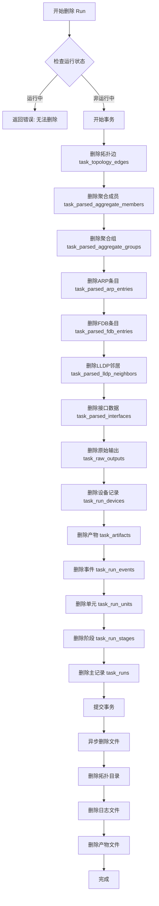

# 任务执行历史删除功能 - 分阶段修复方案

**文档生成时间**: 2026-04-03  
**基于问题清单**: `docs/execution_history_delete_feature_issues.md`  
**原始方案**: `plans/execution_history_delete_feature.md`

---

## 一、修复方案概述

### 1.1 问题统计

| 问题等级 | 数量 | 说明                                                              |
| -------- | ---- | ----------------------------------------------------------------- |
| 🔴 严重  | 3    | 数据表遗漏、文件路径硬编码、架构职责混乱                          |
| 🟡 中等  | 5    | 文件清理缺失、执行日志遗漏、panic保护、Store方法缺失、API绑定缺失 |
| 🟢 轻微  | 3    | 错误处理、事务隔离、接口扩展                                      |

### 1.2 修复阶段划分

```
┌─────────────────────────────────────────────────────────────────────────┐
│                           修复阶段时间线                                  │
├─────────────────────────────────────────────────────────────────────────┤
│                                                                         │
│  第一阶段（核心修复）                                                     │
│  ├── 1.1 扩展 Repository 接口和实现（完整数据表删除）                      │
│  ├── 1.2 重构架构职责（删除逻辑移至 ExecutionHistoryService）              │
│  └── 1.3 使用 PathManager 获取路径                                       │
│                                                                         │
│  第二阶段（功能完善）                                                     │
│  ├── 2.1 补充执行日志文件删除                                             │
│  ├── 2.2 DeleteAllRuns 添加文件清理                                      │
│  ├── 2.3 添加 Panic 保护                                                 │
│  ├── 2.4 前端 Store 添加方法                                             │
│  └── 2.5 API 绑定补充                                                    │
│                                                                         │
│  第三阶段（优化改进）                                                     │
│  ├── 3.1 完善错误日志                                                    │
│  ├── 3.2 优化事务处理                                                    │
│  └── 3.3 添加单元测试                                                    │
│                                                                         │
└─────────────────────────────────────────────────────────────────────────┘
```

---

## 二、第一阶段：核心修复

### 2.1 扩展 Repository 接口和实现

**问题来源**: 问题清单 1.1、3.3

**修改文件**: [`internal/taskexec/persistence.go`](internal/taskexec/persistence.go)

#### 2.1.1 扩展 Repository 接口

在 `Repository` 接口中添加删除方法：

```go
// Repository 运行时仓库接口
type Repository interface {
    // ... 现有方法保持不变 ...

    // ==================== 删除操作 ====================

    // DeleteRun 删除运行记录（含级联删除所有关联数据）
    DeleteRun(ctx context.Context, runID string) error

    // DeleteAllRuns 删除所有运行记录
    DeleteAllRuns(ctx context.Context) error

    // DeleteRunsByKind 按类型删除运行记录
    DeleteRunsByKind(ctx context.Context, runKind string) error

    // GetUnitsByRun 获取运行的所有单元（用于获取日志路径）
    GetUnitsByRun(ctx context.Context, runID string) ([]TaskRunUnit, error)
}
```

#### 2.1.2 实现 DeleteRun 方法（完整级联删除）

**关键点**: 必须删除所有14个关联表的数据

```go
// DeleteRun 删除运行记录（含级联删除所有关联数据）
func (r *GormRepository) DeleteRun(ctx context.Context, runID string) error {
    return r.db.WithContext(ctx).Transaction(func(tx *gorm.DB) error {
        // 1. 删除解析数据表（拓扑采集特有）
        // 1.1 删除拓扑边
        if err := tx.Where("task_run_id = ?", runID).Delete(&TaskTopologyEdge{}).Error; err != nil {
            return fmt.Errorf("删除拓扑边失败: %w", err)
        }

        // 1.2 删除聚合组成员
        if err := tx.Where("task_run_id = ?", runID).Delete(&TaskParsedAggregateMember{}).Error; err != nil {
            return fmt.Errorf("删除聚合组成员失败: %w", err)
        }

        // 1.3 删除聚合组
        if err := tx.Where("task_run_id = ?", runID).Delete(&TaskParsedAggregateGroup{}).Error; err != nil {
            return fmt.Errorf("删除聚合组失败: %w", err)
        }

        // 1.4 删除ARP条目
        if err := tx.Where("task_run_id = ?", runID).Delete(&TaskParsedARPEntry{}).Error; err != nil {
            return fmt.Errorf("删除ARP条目失败: %w", err)
        }

        // 1.5 删除FDB条目
        if err := tx.Where("task_run_id = ?", runID).Delete(&TaskParsedFDBEntry{}).Error; err != nil {
            return fmt.Errorf("删除FDB条目失败: %w", err)
        }

        // 1.6 删除LLDP邻居
        if err := tx.Where("task_run_id = ?", runID).Delete(&TaskParsedLLDPNeighbor{}).Error; err != nil {
            return fmt.Errorf("删除LLDP邻居失败: %w", err)
        }

        // 1.7 删除接口数据
        if err := tx.Where("task_run_id = ?", runID).Delete(&TaskParsedInterface{}).Error; err != nil {
            return fmt.Errorf("删除接口数据失败: %w", err)
        }

        // 1.8 删除原始输出
        if err := tx.Where("task_run_id = ?", runID).Delete(&TaskRawOutput{}).Error; err != nil {
            return fmt.Errorf("删除原始输出失败: %w", err)
        }

        // 1.9 删除设备记录
        if err := tx.Where("task_run_id = ?", runID).Delete(&TaskRunDevice{}).Error; err != nil {
            return fmt.Errorf("删除设备记录失败: %w", err)
        }

        // 2. 删除通用关联数据
        // 2.1 删除产物
        if err := tx.Where("task_run_id = ?", runID).Delete(&TaskArtifact{}).Error; err != nil {
            return fmt.Errorf("删除产物失败: %w", err)
        }

        // 2.2 删除事件
        if err := tx.Where("task_run_id = ?", runID).Delete(&TaskRunEvent{}).Error; err != nil {
            return fmt.Errorf("删除事件失败: %w", err)
        }

        // 2.3 删除单元
        if err := tx.Where("task_run_id = ?", runID).Delete(&TaskRunUnit{}).Error; err != nil {
            return fmt.Errorf("删除单元失败: %w", err)
        }

        // 2.4 删除阶段
        if err := tx.Where("task_run_id = ?", runID).Delete(&TaskRunStage{}).Error; err != nil {
            return fmt.Errorf("删除阶段失败: %w", err)
        }

        // 3. 删除主记录
        if err := tx.Where("id = ?", runID).Delete(&TaskRun{}).Error; err != nil {
            return fmt.Errorf("删除运行记录失败: %w", err)
        }

        return nil
    })
}
```

#### 2.1.3 实现 DeleteAllRuns 和 DeleteRunsByKind

```go
// DeleteAllRuns 删除所有运行记录
func (r *GormRepository) DeleteAllRuns(ctx context.Context) error {
    var runIDs []string
    if err := r.db.WithContext(ctx).Model(&TaskRun{}).Pluck("id", &runIDs).Error; err != nil {
        return fmt.Errorf("获取运行记录列表失败: %w", err)
    }

    for _, runID := range runIDs {
        if err := r.DeleteRun(ctx, runID); err != nil {
            return fmt.Errorf("删除运行记录 %s 失败: %w", runID, err)
        }
    }
    return nil
}

// DeleteRunsByKind 按类型删除运行记录
func (r *GormRepository) DeleteRunsByKind(ctx context.Context, runKind string) error {
    var runIDs []string
    if err := r.db.WithContext(ctx).Model(&TaskRun{}).Where("run_kind = ?", runKind).Pluck("id", &runIDs).Error; err != nil {
        return fmt.Errorf("获取运行记录列表失败: %w", err)
    }

    for _, runID := range runIDs {
        if err := r.DeleteRun(ctx, runID); err != nil {
            return fmt.Errorf("删除运行记录 %s 失败: %w", runID, err)
        }
    }
    return nil
}
```

---

### 2.2 重构架构职责

**问题来源**: 问题清单 1.3

**核心原则**: 删除逻辑应放在 `ExecutionHistoryService`，而非 `TaskExecutionService`

**修改文件**:

- [`internal/ui/execution_history_service.go`](internal/ui/execution_history_service.go) - 添加删除方法
- [`internal/taskexec/service.go`](internal/taskexec/service.go) - 不添加删除方法

#### 2.2.1 ExecutionHistoryService 添加依赖注入

```go
// ExecutionHistoryService 历史执行记录管理服务
type ExecutionHistoryService struct {
    wailsApp             *application.App
    taskExecutionService *taskexec.TaskExecutionService
    repo                 taskexec.Repository  // 新增：直接依赖 Repository
}

// NewExecutionHistoryService 创建历史记录服务实例
func NewExecutionHistoryService() *ExecutionHistoryService {
    return &ExecutionHistoryService{}
}

// SetRepository 设置仓库（由应用启动时注入）
func (s *ExecutionHistoryService) SetRepository(repo taskexec.Repository) {
    s.repo = repo
}

// SetTaskExecutionService 设置任务执行服务
func (s *ExecutionHistoryService) SetTaskExecutionService(service *taskexec.TaskExecutionService) {
    s.taskExecutionService = service
}
```

#### 2.2.2 实现删除方法

```go
// DeleteRunRecordRequest 删除运行记录请求
type DeleteRunRecordRequest struct {
    RunID string `json:"runId"`
}

// DeleteRunRecordResponse 删除运行记录响应
type DeleteRunRecordResponse struct {
    Success bool   `json:"success"`
    Message string `json:"message"`
}

// DeleteRunRecord 删除单条运行记录
func (s *ExecutionHistoryService) DeleteRunRecord(runID string) (*DeleteRunRecordResponse, error) {
    if s.repo == nil {
        return nil, fmt.Errorf("仓库未初始化")
    }

    if strings.TrimSpace(runID) == "" {
        return &DeleteRunRecordResponse{Success: false, Message: "runID 不能为空"}, nil
    }

    // 1. 检查是否正在运行
    run, err := s.repo.GetRun(context.Background(), runID)
    if err != nil {
        return &DeleteRunRecordResponse{Success: false, Message: fmt.Sprintf("获取运行记录失败: %v", err)}, nil
    }

    activeStatuses := taskexec.ActiveRunStatuses()
    for _, status := range activeStatuses {
        if run.Status == string(status) {
            return &DeleteRunRecordResponse{Success: false, Message: "无法删除正在运行的任务"}, nil
        }
    }

    // 2. 获取关联数据用于文件删除
    units, _ := s.repo.GetUnitsByRun(context.Background(), runID)
    artifacts, _ := s.repo.GetArtifactsByRun(context.Background(), runID)

    // 3. 删除数据库记录
    if err := s.repo.DeleteRun(context.Background(), runID); err != nil {
        return &DeleteRunRecordResponse{Success: false, Message: fmt.Sprintf("删除失败: %v", err)}, nil
    }

    // 4. 异步删除关联文件
    go s.deleteRunFiles(runID, run.RunKind, units, artifacts)

    logger.Info("ExecutionHistoryService", "-", "已删除运行记录: %s", runID)
    return &DeleteRunRecordResponse{Success: true, Message: "删除成功"}, nil
}

// DeleteAllRunRecords 删除所有运行记录
func (s *ExecutionHistoryService) DeleteAllRunRecords() (*DeleteRunRecordResponse, error) {
    if s.repo == nil {
        return nil, fmt.Errorf("仓库未初始化")
    }

    // 检查是否有正在运行的任务
    running, err := s.repo.ListRunningRuns(context.Background())
    if err != nil {
        return &DeleteRunRecordResponse{Success: false, Message: fmt.Sprintf("检查运行状态失败: %v", err)}, nil
    }
    if len(running) > 0 {
        return &DeleteRunRecordResponse{Success: false, Message: fmt.Sprintf("存在 %d 个正在运行的任务，无法删除全部", len(running))}, nil
    }

    // 获取所有运行记录用于文件删除
    runs, _ := s.repo.ListRuns(context.Background(), 0)

    // 删除数据库记录
    if err := s.repo.DeleteAllRuns(context.Background()); err != nil {
        return &DeleteRunRecordResponse{Success: false, Message: fmt.Sprintf("删除失败: %v", err)}, nil
    }

    // 异步删除所有关联文件
    go s.deleteAllRunFiles(runs)

    logger.Info("ExecutionHistoryService", "-", "已删除所有运行记录")
    return &DeleteRunRecordResponse{Success: true, Message: "删除成功"}, nil
}
```

---

### 2.3 使用 PathManager 获取路径

**问题来源**: 问题清单 1.2

**修改文件**: [`internal/ui/execution_history_service.go`](internal/ui/execution_history_service.go)

#### 2.3.1 添加文件删除方法

```go
import (
    "github.com/NetWeaverGo/core/internal/config"
    // ... 其他导入
)

// deleteRunFiles 删除运行关联的文件
func (s *ExecutionHistoryService) deleteRunFiles(runID, runKind string, units []taskexec.TaskRunUnit, artifacts []taskexec.TaskArtifact) {
    defer func() {
        if r := recover(); r != nil {
            logger.Error("ExecutionHistoryService", runID, "删除文件时发生panic: %v", r)
        }
    }()

    pm := config.GetPathManager()

    // 1. 删除拓扑采集文件目录
    if runKind == "topology" {
        rawDir := filepath.Join(pm.TopologyRawDir, "run_"+runID)
        normalizedDir := filepath.Join(pm.StorageRoot, "topology", "normalized", "run_"+runID)

        if err := os.RemoveAll(rawDir); err != nil {
            logger.Error("ExecutionHistoryService", runID, "删除原始数据目录失败: %v", err)
        }
        if err := os.RemoveAll(normalizedDir); err != nil {
            logger.Error("ExecutionHistoryService", runID, "删除标准化数据目录失败: %v", err)
        }
    }

    // 2. 删除执行日志文件（从 Unit 的日志路径）
    for _, unit := range units {
        s.deleteLogFile(unit.SummaryLogPath, runID, "summary")
        s.deleteLogFile(unit.DetailLogPath, runID, "detail")
        s.deleteLogFile(unit.RawLogPath, runID, "raw")
        s.deleteLogFile(unit.JournalLogPath, runID, "journal")
    }

    // 3. 删除产物文件
    for _, artifact := range artifacts {
        if artifact.FilePath != "" {
            if err := os.Remove(artifact.FilePath); err != nil && !os.IsNotExist(err) {
                logger.Error("ExecutionHistoryService", runID, "删除产物文件失败 [%s]: %v", artifact.FilePath, err)
            }
        }
    }
}

// deleteLogFile 安全删除日志文件
func (s *ExecutionHistoryService) deleteLogFile(path, runID, logType string) {
    if path == "" {
        return
    }
    if err := os.Remove(path); err != nil && !os.IsNotExist(err) {
        logger.Error("ExecutionHistoryService", runID, "删除%s日志失败 [%s]: %v", logType, path, err)
    }
}

// deleteAllRunFiles 删除所有运行的文件
func (s *ExecutionHistoryService) deleteAllRunFiles(runs []taskexec.TaskRun) {
    defer func() {
        if r := recover(); r != nil {
            logger.Error("ExecutionHistoryService", "-", "批量删除文件时发生panic: %v", r)
        }
    }()

    pm := config.GetPathManager()

    // 删除整个拓扑目录
    if err := os.RemoveAll(pm.TopologyRawDir); err != nil {
        logger.Error("ExecutionHistoryService", "-", "删除原始数据目录失败: %v", err)
    }

    normalizedDir := filepath.Join(pm.StorageRoot, "topology", "normalized")
    if err := os.RemoveAll(normalizedDir); err != nil {
        logger.Error("ExecutionHistoryService", "-", "删除标准化数据目录失败: %v", err)
    }

    // 删除执行日志目录
    if err := os.RemoveAll(pm.ExecutionLiveLogDir); err != nil {
        logger.Error("ExecutionHistoryService", "-", "删除执行日志目录失败: %v", err)
    }

    // 重新创建空目录
    os.MkdirAll(pm.TopologyRawDir, 0755)
    os.MkdirAll(normalizedDir, 0755)
    os.MkdirAll(pm.ExecutionLiveLogDir, 0755)
}
```

---

## 三、第二阶段：功能完善

### 3.1 补充执行日志文件删除

**问题来源**: 问题清单 2.2

**说明**: 已在第一阶段 2.3.1 节的 `deleteRunFiles` 方法中实现，通过 `TaskRunUnit` 的日志路径字段删除：

- `SummaryLogPath`
- `DetailLogPath`
- `RawLogPath`
- `JournalLogPath`

**需要确认**: `TaskRunUnit` 模型是否包含这些字段，如果没有需要添加。

#### 3.1.1 扩展 TaskRunUnit 模型（如需要）

修改 [`internal/taskexec/models.go`](internal/taskexec/models.go):

```go
// TaskRunUnit 调度单元状态
type TaskRunUnit struct {
    ID             string     `gorm:"primaryKey" json:"id"`
    TaskRunID      string     `gorm:"index" json:"taskRunId"`
    TaskRunStageID string     `gorm:"index" json:"taskRunStageId"`
    UnitKind       string     `json:"unitKind"`
    TargetType     string     `json:"targetType"`
    TargetKey      string     `json:"targetKey"`
    Status         string     `json:"status"`
    TotalSteps     int        `json:"totalSteps"`
    DoneSteps      int        `json:"doneSteps"`
    ErrorMessage   string     `json:"errorMessage"`
    // 新增日志路径字段
    SummaryLogPath string     `json:"summaryLogPath,omitempty"`
    DetailLogPath  string     `json:"detailLogPath,omitempty"`
    RawLogPath     string     `json:"rawLogPath,omitempty"`
    JournalLogPath string     `json:"journalLogPath,omitempty"`
    StartedAt      *time.Time `json:"startedAt"`
    FinishedAt     *time.Time `json:"finishedAt"`
    CreatedAt      time.Time  `json:"createdAt"`
    UpdatedAt      time.Time  `json:"updatedAt"`
}
```

---

### 3.2 添加 Panic 保护

**问题来源**: 问题清单 2.3

**说明**: 已在第一阶段 2.3.1 节的 `deleteRunFiles` 和 `deleteAllRunFiles` 方法中实现：

```go
defer func() {
    if r := recover(); r != nil {
        logger.Error("ExecutionHistoryService", runID, "删除文件时发生panic: %v", r)
    }
}()
```

---

### 3.3 前端 Store 添加方法

**问题来源**: 问题清单 2.4

**修改文件**: [`frontend/src/stores/taskexecStore.ts`](frontend/src/stores/taskexecStore.ts)

```typescript
// 在 taskexecStore 中添加以下方法

/**
 * 从历史记录中移除指定运行
 */
function removeRunFromHistory(runId: string) {
  const index = runHistory.value.findIndex((r) => r.runId === runId);
  if (index !== -1) {
    runHistory.value.splice(index, 1);
  }
}

/**
 * 清空所有历史记录
 */
function clearAllHistory() {
  runHistory.value = [];
}

// 在 return 中导出
return {
  // ... 现有导出
  removeRunFromHistory,
  clearAllHistory,
};
```

---

### 3.4 API 绑定补充

**问题来源**: 问题清单 2.5

**修改文件**: [`frontend/src/services/api.ts`](frontend/src/services/api.ts)

```typescript
// ==================== 历史执行记录 API ====================
/**
 * 历史执行记录 API
 * @description 提供历史执行记录的查询和管理
 */
export const ExecutionHistoryAPI = {
  /** 从统一运行时查询历史记录（阶段5） */
  listTaskRunRecords: ExecutionHistoryServiceBinding.ListTaskRunRecords,

  /** 使用系统默认应用打开文件 */
  openFileWithDefaultApp: ExecutionHistoryServiceBinding.OpenFileWithDefaultApp,

  /** 删除单条运行记录 */
  deleteRunRecord: ExecutionHistoryServiceBinding.DeleteRunRecord,

  /** 删除所有运行记录 */
  deleteAllRunRecords: ExecutionHistoryServiceBinding.DeleteAllRunRecords,
} as const;
```

---

### 3.5 前端组件调用

**修改文件**: [`frontend/src/components/task/ExecutionHistoryDrawer.vue`](frontend/src/components/task/ExecutionHistoryDrawer.vue)

```vue
<script setup lang="ts">
import { ExecutionHistoryAPI } from "@/services/api";
import { useTaskexecStore } from "@/stores/taskexecStore";

const taskexecStore = useTaskexecStore();

// 删除单条记录
async function handleDelete(runId: string) {
  try {
    const result = await ExecutionHistoryAPI.deleteRunRecord(runId);
    if (result.success) {
      taskexecStore.removeRunFromHistory(runId);
      // 提示删除成功
    } else {
      // 提示删除失败: result.message
    }
  } catch (error) {
    // 处理异常
  }
}

// 删除全部记录
async function handleDeleteAll() {
  try {
    const result = await ExecutionHistoryAPI.deleteAllRunRecords();
    if (result.success) {
      taskexecStore.clearAllHistory();
      // 提示删除成功
    } else {
      // 提示删除失败: result.message
    }
  } catch (error) {
    // 处理异常
  }
}
</script>
```

---

## 四、第三阶段：优化改进

### 4.1 完善错误日志

**问题来源**: 问题清单 3.1

**说明**: 已在前述实现中添加详细的错误日志记录。

---

### 4.2 优化事务处理

**问题来源**: 问题清单 3.2

**当前问题**: `DeleteAllRuns` 逐个调用 `DeleteRun`，每次是独立事务，中途失败会导致部分删除。

**优化方案**: 添加批量删除方法，使用单一事务

```go
// DeleteAllRunsBatch 批量删除所有运行记录（单事务）
func (r *GormRepository) DeleteAllRunsBatch(ctx context.Context) error {
    return r.db.WithContext(ctx).Transaction(func(tx *gorm.DB) error {
        // 批量删除所有关联表
        tables := []interface{}{
            &TaskTopologyEdge{},
            &TaskParsedAggregateMember{},
            &TaskParsedAggregateGroup{},
            &TaskParsedARPEntry{},
            &TaskParsedFDBEntry{},
            &TaskParsedLLDPNeighbor{},
            &TaskParsedInterface{},
            &TaskRawOutput{},
            &TaskRunDevice{},
            &TaskArtifact{},
            &TaskRunEvent{},
            &TaskRunUnit{},
            &TaskRunStage{},
            &TaskRun{},
        }

        for _, table := range tables {
            if err := tx.Where("1 = 1").Delete(table).Error; err != nil {
                return fmt.Errorf("清空表 %T 失败: %w", table, err)
            }
        }

        return nil
    })
}
```

---

### 4.3 添加单元测试

**测试文件**: `internal/ui/execution_history_service_test.go`

```go
package ui

import (
    "context"
    "testing"

    "github.com/NetWeaverGo/core/internal/taskexec"
    "github.com/stretchr/testify/assert"
)

func TestDeleteRunRecord(t *testing.T) {
    // 测试删除单条记录
}

func TestDeleteAllRunRecords(t *testing.T) {
    // 测试删除全部记录
}

func TestDeleteRunningTask(t *testing.T) {
    // 测试删除正在运行的任务（应失败）
}
```

---

## 五、涉及文件清单

| 文件路径                                                  | 修改类型      | 阶段     | 涉及问题                     |
| --------------------------------------------------------- | ------------- | -------- | ---------------------------- |
| `internal/taskexec/persistence.go`                        | 接口扩展+实现 | 第一阶段 | 1.1, 3.3                     |
| `internal/taskexec/models.go`                             | 模型扩展      | 第二阶段 | 2.2                          |
| `internal/ui/execution_history_service.go`                | 新增方法      | 第一阶段 | 1.2, 1.3, 2.1, 2.2, 2.3, 3.1 |
| `frontend/src/stores/taskexecStore.ts`                    | 新增方法      | 第二阶段 | 2.4                          |
| `frontend/src/services/api.ts`                            | 新增导出      | 第二阶段 | 2.5                          |
| `frontend/src/components/task/ExecutionHistoryDrawer.vue` | 调用修改      | 第二阶段 | -                            |
| `internal/ui/execution_history_service_test.go`           | 新增测试      | 第三阶段 | -                            |

---

## 六、数据表删除顺序图



---

## 七、验证清单

### 7.1 第一阶段验证

- [ ] Repository 接口包含所有删除方法
- [ ] DeleteRun 删除所有14个关联表数据
- [ ] 使用 PathManager 获取路径，无硬编码
- [ ] 删除逻辑在 ExecutionHistoryService 中
- [ ] 编译通过

### 7.2 第二阶段验证

- [ ] 执行日志文件被正确删除
- [ ] DeleteAllRuns 清理所有文件
- [ ] 异步删除有 panic 保护
- [ ] 前端 Store 方法可用
- [ ] API 绑定正确
- [ ] 前端组件调用正常

### 7.3 第三阶段验证

- [ ] 错误日志完整
- [ ] 批量删除事务正确
- [ ] 单元测试通过

---

## 八、风险评估

| 风险项           | 影响 | 缓解措施                        |
| ---------------- | ---- | ------------------------------- |
| 数据库迁移失败   | 高   | 使用 GORM AutoMigrate，自动处理 |
| 文件删除权限问题 | 中   | 记录错误日志，不影响主流程      |
| 前端状态不同步   | 中   | 删除成功后主动更新 Store        |
| 大量数据删除性能 | 低   | 使用异步删除文件                |

---

## 九、实施建议

1. **按阶段实施**: 严格按照第一、二、三阶段顺序实施，每个阶段完成后进行验证
2. **代码审查**: 第一阶段核心修改需要代码审查
3. **测试覆盖**: 第三阶段添加单元测试和集成测试
4. **文档更新**: 完成后更新相关技术文档
