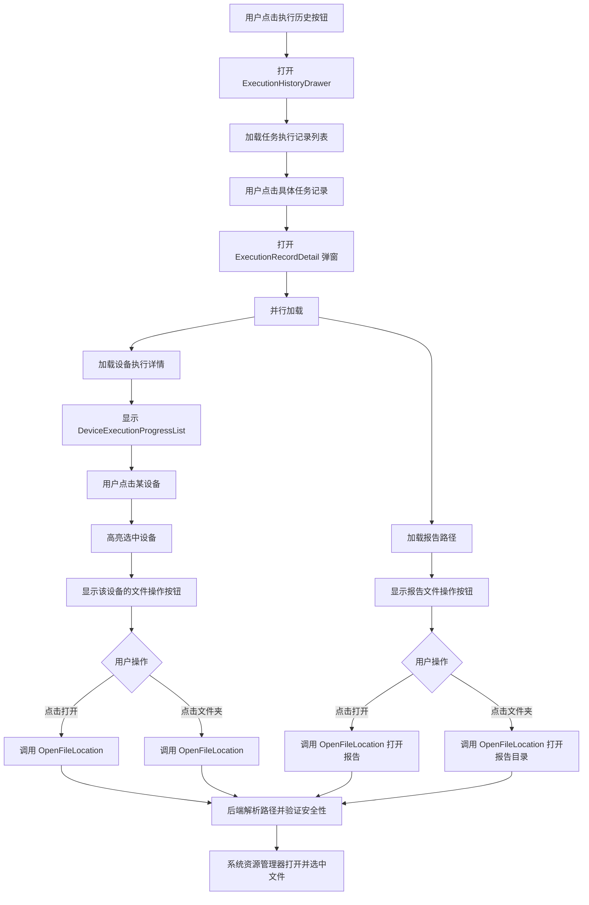
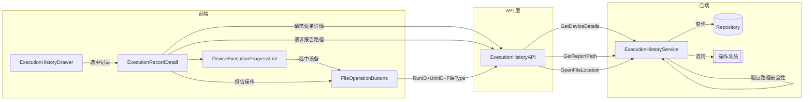

# 执行历史记录功能增强设计方案

## 一、功能需求概述

### 1.1 新增功能点

1. **任务设备执行进度展示**
   - 点击执行历史记录中的具体任务时，显示该任务各个设备的执行进度状态
   - 展示每个设备的执行状态、进度百分比、步骤完成数等信息

2. **文件操作功能增强**
   - 为 detail 详细日志、raw 原始日志、report 报告提供操作按钮
   - **打开按钮**：调用系统默认程序打开文件
   - **打开文件夹按钮**：调用系统资源管理器打开文件所在文件夹，并高亮选中文件

### 1.2 现有架构分析

#### 后端架构

```
internal/ui/execution_history_service.go  - 执行历史服务
internal/taskexec/models.go               - 运行时数据模型
  - TaskRun         : 任务运行实例
  - TaskRunStage    : 阶段运行状态
  - TaskRunUnit     : 调度单元状态（对应设备）
  - TaskArtifact    : 产物索引
```

#### 前端架构

```
frontend/src/components/task/
  - ExecutionHistoryDrawer.vue   : 执行历史侧边抽屉
  - ExecutionRecordDetail.vue    : 执行详情弹窗

frontend/src/types/executionHistory.ts  : 类型定义
frontend/src/services/api.ts            : API 封装
```

---

## 二、后端 API 设计方案

### 2.1 新增 API 方法

#### 2.1.1 获取任务设备执行详情

```go
// DeviceDetailsRequest 获取任务设备执行详情请求
// 注意：命名避免与 Wails 自动生成的 bindings 冲突，使用简短命名
type DeviceDetailsRequest struct {
    RunID string `json:"runId"` // 任务运行ID
}

// DeviceExecutionView 设备执行详情视图
// 注意：移除了 CurrentStep 字段，因为 TaskRunUnit 模型中无此数据来源
type DeviceExecutionView struct {
    UnitID         string `json:"unitId"`         // 调度单元ID
    DeviceIP       string `json:"deviceIp"`       // 设备IP
    Status         string `json:"status"`         // 状态: pending/running/completed/failed/cancelled
    Progress       int    `json:"progress"`       // 进度 0-100（根据 DoneSteps/TotalSteps 计算）
    TotalSteps     int    `json:"totalSteps"`     // 总步骤数
    DoneSteps      int    `json:"doneSteps"`      // 已完成步骤数
    ErrorMessage   string `json:"errorMessage"`   // 错误信息
    StartedAt      string `json:"startedAt"`      // 开始时间
    FinishedAt     string `json:"finishedAt"`     // 结束时间
    DurationMs     int64  `json:"durationMs"`     // 执行时长

    // 日志文件路径
    DetailLogPath  string `json:"detailLogPath"`  // 详细日志路径
    RawLogPath     string `json:"rawLogPath"`     // 原始日志路径
    SummaryLogPath string `json:"summaryLogPath"` // 摘要日志路径
    JournalLogPath string `json:"journalLogPath"` // 流水日志路径
}

// DeviceDetailsResponse 获取任务设备执行详情响应
type DeviceDetailsResponse struct {
    RunID     string                 `json:"runId"`     // 任务运行ID
    RunStatus string                 `json:"runStatus"` // 任务整体状态
    Devices   []DeviceExecutionView  `json:"devices"`   // 设备执行详情列表
}

// GetDeviceDetails 获取任务设备执行详情
func (s *ExecutionHistoryService) GetDeviceDetails(req DeviceDetailsRequest) (*DeviceDetailsResponse, error)
```

#### 2.1.2 打开文件所在文件夹并选中文件（安全增强版）

```go
// FileLocationRequest 打开文件位置请求
// 安全设计：使用 RunID + UnitID + FileType 组合，避免直接暴露文件路径
type FileLocationRequest struct {
    RunID    string `json:"runId"`    // 任务运行ID
    UnitID   string `json:"unitId"`   // 调度单元ID（可选，报告类型时为空）
    FileType string `json:"fileType"` // 文件类型: detail/raw/summary/journal/report
}

// FileLocationResponse 打开文件位置响应
type FileLocationResponse struct {
    Success bool   `json:"success"`
    Message string `json:"message"`
}

// OpenFileLocation 使用系统资源管理器打开文件所在文件夹并选中文件
// 安全设计：通过 RunID + UnitID + FileType 在后端解析真实路径，避免前端传入路径
// 仅支持 Windows 系统，使用 explorer /select,"filepath" 选中文件
func (s *ExecutionHistoryService) OpenFileLocation(req FileLocationRequest) (*FileLocationResponse, error)
```

#### 2.1.3 获取任务报告路径

```go
// ReportPathRequest 获取任务报告路径请求
type ReportPathRequest struct {
    RunID string `json:"runId"` // 任务运行ID
}

// ReportPathResponse 获取任务报告路径响应
type ReportPathResponse struct {
    ReportPath string `json:"reportPath"` // 报告文件路径
    Exists     bool   `json:"exists"`     // 文件是否存在
}

// GetReportPath 获取任务报告文件路径
func (s *ExecutionHistoryService) GetReportPath(req ReportPathRequest) (*ReportPathResponse, error)
```

### 2.2 后端代码变更点

#### 文件: internal/ui/execution_history_service.go

**新增导入:**

```go
import (
    // ... 现有导入
    "github.com/NetWeaverGo/core/internal/taskexec"
    "path/filepath"
)
```

**新增常量定义:**

```go
const (
    FileTypeDetail   = "detail"
    FileTypeRaw      = "raw"
    FileTypeSummary  = "summary"
    FileTypeJournal  = "journal"
    FileTypeReport   = "report"
)
```

**新增辅助方法 - 路径安全验证:**

```go
// validatePathWithinAllowedDir 验证路径是否在允许的目录范围内
// 防止路径遍历攻击
func (s *ExecutionHistoryService) validatePathWithinAllowedDir(filePath string) error {
    // 获取绝对路径
    absPath, err := filepath.Abs(filePath)
    if err != nil {
        return fmt.Errorf("无效的文件路径")
    }

    // 获取允许的基础目录
    pm := config.GetPathManager()
    allowedDirs := []string{
        pm.ExecutionLiveLogDir,
        pm.TopologyRawDir,
        filepath.Join(pm.StorageRoot, "topology", "normalized"),
    }

    for _, allowedDir := range allowedDirs {
        absAllowed, err := filepath.Abs(allowedDir)
        if err != nil {
            continue
        }
        // 检查文件路径是否在允许的目录下
        if strings.HasPrefix(absPath, absAllowed+string(filepath.Separator)) {
            return nil
        }
    }

    return fmt.Errorf("文件路径不在允许的目录范围内")
}

// resolveFilePathFromRequest 根据请求参数解析文件路径
// 安全设计：从数据库获取路径，而非直接使用前端传入的路径
func (s *ExecutionHistoryService) resolveFilePathFromRequest(req FileLocationRequest) (string, error) {
    if s.repo == nil {
        return "", fmt.Errorf("仓库未初始化")
    }

    // 报告类型特殊处理
    if req.FileType == FileTypeReport {
        artifacts, err := s.repo.GetArtifactsByRun(context.Background(), req.RunID)
        if err != nil {
            return "", err
        }
        for _, artifact := range artifacts {
            if artifact.ArtifactType == FileTypeReport && artifact.FilePath != "" {
                return artifact.FilePath, nil
            }
        }
        return "", fmt.Errorf("未找到报告文件")
    }

    // 其他类型从 Unit 获取
    if req.UnitID == "" {
        return "", fmt.Errorf("UnitID 不能为空")
    }

    unit, err := s.repo.GetUnit(context.Background(), req.UnitID)
    if err != nil {
        return "", err
    }

    // 验证 Unit 属于该 Run
    if unit.TaskRunID != req.RunID {
        return "", fmt.Errorf("Unit 不属于该任务运行")
    }

    switch req.FileType {
    case FileTypeDetail:
        return unit.DetailLogPath, nil
    case FileTypeRaw:
        return unit.RawLogPath, nil
    case FileTypeSummary:
        return unit.SummaryLogPath, nil
    case FileTypeJournal:
        return unit.JournalLogPath, nil
    default:
        return "", fmt.Errorf("不支持的文件类型: %s", req.FileType)
    }
}
```

**新增方法实现:**

```go
// GetDeviceDetails 获取任务设备执行详情
func (s *ExecutionHistoryService) GetDeviceDetails(req DeviceDetailsRequest) (*DeviceDetailsResponse, error) {
    logger.Debug("ExecutionHistoryService", req.RunID, "获取任务设备执行详情")

    if s.repo == nil {
        return nil, fmt.Errorf("仓库未初始化")
    }

    // 1. 获取任务运行记录
    run, err := s.repo.GetRun(context.Background(), req.RunID)
    if err != nil {
        logger.Error("ExecutionHistoryService", req.RunID, "获取运行记录失败: %v", err)
        return nil, err
    }

    // 2. 获取所有调度单元
    units, err := s.repo.GetUnitsByRun(context.Background(), req.RunID)
    if err != nil {
        logger.Error("ExecutionHistoryService", req.RunID, "获取调度单元失败: %v", err)
        return nil, err
    }

    // 3. 转换为视图
    devices := make([]DeviceExecutionView, 0, len(units))
    for _, unit := range units {
        device := DeviceExecutionView{
            UnitID:         unit.ID,
            DeviceIP:       unit.TargetKey,
            Status:         unit.Status,
            Progress:       calculateUnitProgress(unit),
            TotalSteps:     unit.TotalSteps,
            DoneSteps:      unit.DoneSteps,
            ErrorMessage:   unit.ErrorMessage,
            DetailLogPath:  unit.DetailLogPath,
            RawLogPath:     unit.RawLogPath,
            SummaryLogPath: unit.SummaryLogPath,
            JournalLogPath: unit.JournalLogPath,
        }

        if unit.StartedAt != nil {
            device.StartedAt = unit.StartedAt.Format("2006-01-02 15:04:05")
        }
        if unit.FinishedAt != nil {
            device.FinishedAt = unit.FinishedAt.Format("2006-01-02 15:04:05")
            device.DurationMs = unit.FinishedAt.Sub(*unit.StartedAt).Milliseconds()
        }

        devices = append(devices, device)
    }

    return &DeviceDetailsResponse{
        RunID:     run.ID,
        RunStatus: run.Status,
        Devices:   devices,
    }, nil
}

// calculateUnitProgress 计算单元进度
func calculateUnitProgress(unit taskexec.TaskRunUnit) int {
    if unit.TotalSteps == 0 {
        return 0
    }
    progress := (unit.DoneSteps * 100) / unit.TotalSteps
    if progress > 100 {
        progress = 100
    }
    return progress
}

// OpenFileLocation 使用系统资源管理器打开文件所在文件夹并选中文件
// 仅支持 Windows 系统
func (s *ExecutionHistoryService) OpenFileLocation(req FileLocationRequest) (*FileLocationResponse, error) {
    logger.Info("ExecutionHistoryService", req.RunID, "打开文件位置: type=%s, unitId=%s", req.FileType, req.UnitID)

    // 1. 从数据库解析文件路径（安全：不直接使用前端传入的路径）
    filePath, err := s.resolveFilePathFromRequest(req)
    if err != nil {
        return &FileLocationResponse{Success: false, Message: err.Error()}, nil
    }

    if filePath == "" {
        return &FileLocationResponse{Success: false, Message: "文件路径为空"}, nil
    }

    // 2. 验证路径安全性
    if err := s.validatePathWithinAllowedDir(filePath); err != nil {
        logger.Error("ExecutionHistoryService", "-", "路径安全验证失败: %v", err)
        return &FileLocationResponse{Success: false, Message: "文件路径不合法"}, nil
    }

    // 3. 检查文件是否存在
    _, err = os.Stat(filePath)
    if err != nil {
        if os.IsNotExist(err) {
            return &FileLocationResponse{Success: false, Message: "文件不存在"}, nil
        }
        return &FileLocationResponse{Success: false, Message: fmt.Sprintf("访问文件失败: %v", err)}, nil
    }

    // 4. Windows: 使用 explorer /select,"filepath" 选中文件
    cmd := exec.Command("explorer", "/select,", filePath)

    if err := cmd.Start(); err != nil {
        logger.Error("ExecutionHistoryService", "-", "打开文件位置失败: %v", err)
        return &FileLocationResponse{Success: false, Message: fmt.Sprintf("打开失败: %v", err)}, nil
    }

    return &FileLocationResponse{Success: true, Message: "已打开文件位置"}, nil
}

// GetReportPath 获取任务报告路径
func (s *ExecutionHistoryService) GetReportPath(req ReportPathRequest) (*ReportPathResponse, error) {
    logger.Debug("ExecutionHistoryService", req.RunID, "获取任务报告路径")

    if s.repo == nil {
        return nil, fmt.Errorf("仓库未初始化")
    }

    // 从产物索引中查找报告文件
    artifacts, err := s.repo.GetArtifactsByRun(context.Background(), req.RunID)
    if err != nil {
        logger.Error("ExecutionHistoryService", req.RunID, "获取产物索引失败: %v", err)
        return nil, err
    }

    for _, artifact := range artifacts {
        if artifact.ArtifactType == FileTypeReport && artifact.FilePath != "" {
            _, err := os.Stat(artifact.FilePath)
            exists := err == nil
            return &ReportPathResponse{
                ReportPath: artifact.FilePath,
                Exists:     exists,
            }, nil
        }
    }

    return &ReportPathResponse{
        ReportPath: "",
        Exists:     false,
    }, nil
}
```

---

## 三、前端组件设计方案

### 3.1 类型定义扩展

#### 文件: frontend/src/types/executionHistory.ts

```typescript
import type { TaskRunRecordView } from "../services/api";

// 设备执行状态
export type DeviceExecutionStatus =
  | "pending" // 等待中
  | "running" // 执行中
  | "completed" // 已完成
  | "failed" // 失败
  | "cancelled" // 已取消
  | "partial"; // 部分完成

// 文件类型
export type FileType = "detail" | "raw" | "summary" | "journal" | "report";

// 设备执行详情（与后端 DeviceExecutionView 对应）
export interface DeviceExecutionView {
  unitId: string;
  deviceIp: string;
  status: DeviceExecutionStatus;
  progress: number; // 0-100
  totalSteps: number;
  doneSteps: number;
  errorMessage?: string;
  startedAt?: string;
  finishedAt?: string;
  durationMs?: number;

  // 日志文件路径
  detailLogPath?: string;
  rawLogPath?: string;
  summaryLogPath?: string;
  journalLogPath?: string;
}

// 设备执行详情响应（与后端 DeviceDetailsResponse 对应）
export interface DeviceDetailsResponse {
  runId: string;
  runStatus: string;
  devices: DeviceExecutionView[];
}

// 文件位置请求（与后端 FileLocationRequest 对应）
export interface FileLocationRequest {
  runId: string;
  unitId?: string;
  fileType: FileType;
}

// 文件位置响应（与后端 FileLocationResponse 对应）
export interface FileLocationResponse {
  success: boolean;
  message: string;
}

// 报告路径请求（与后端 ReportPathRequest 对应）
export interface ReportPathRequest {
  runId: string;
}

// 报告路径响应（与后端 ReportPathResponse 对应）
export interface ReportPathResponse {
  reportPath: string;
  exists: boolean;
}

// 历史记录设备记录（保留向后兼容）
export interface ExecutionHistoryDeviceRecord {
  ip: string;
  status: string;
  errorMsg?: string;
  execCmd?: number;
  totalCmd?: number;
  logCount?: number;
  logTail?: string[];
  detailLogPath?: string;
  logFilePath?: string;
  rawLogPath?: string;
}

// 历史记录（保留向后兼容）
export interface ExecutionHistoryRecord extends TaskRunRecordView {
  runnerId?: string;
  devices?: ExecutionHistoryDeviceRecord[];
  reportPath?: string;
  abortedCount?: number;
  warningCount?: number;
  createdAt?: string;
}
```

### 3.2 API 服务扩展

#### 文件: frontend/src/services/api.ts

```typescript
// ==================== 历史执行记录 API 扩展 ====================
/**
 * 历史执行记录 API 扩展
 * @description 提供设备执行详情查询和文件位置打开功能
 */
export const ExecutionHistoryAPI = {
  /** 从统一运行时查询历史记录 */
  listTaskRunRecords: ExecutionHistoryServiceBinding.ListTaskRunRecords,
  /** 使用系统默认应用打开文件 */
  openFileWithDefaultApp: ExecutionHistoryServiceBinding.OpenFileWithDefaultApp,
  /** 打开文件所在文件夹并选中文件（安全版：通过 RunID+UnitID+FileType 解析路径） */
  openFileLocation: ExecutionHistoryServiceBinding.OpenFileLocation,
  /** 删除单条运行记录 */
  deleteRunRecord: ExecutionHistoryServiceBinding.DeleteRunRecord,
  /** 删除所有运行记录 */
  deleteAllRunRecords: ExecutionHistoryServiceBinding.DeleteAllRunRecords,
  /** 获取任务设备执行详情 */
  getDeviceDetails: ExecutionHistoryServiceBinding.GetDeviceDetails,
  /** 获取任务报告路径 */
  getReportPath: ExecutionHistoryServiceBinding.GetReportPath,
} as const;
```

### 3.3 新增/修改组件

#### 3.3.1 设备执行进度列表组件

**新建文件: frontend/src/components/task/DeviceExecutionProgressList.vue**

```vue
<template>
  <div class="device-progress-list">
    <!-- 加载状态 -->
    <div v-if="loading" class="loading-state">
      <div class="spinner"></div>
      <span>加载设备执行详情...</span>
    </div>

    <!-- 空状态 -->
    <div v-else-if="devices.length === 0" class="empty-state">
      <i class="icon-empty"></i>
      <p>暂无设备执行记录</p>
    </div>

    <!-- 设备列表 -->
    <div v-else class="devices-container">
      <div
        v-for="device in devices"
        :key="device.unitId"
        class="device-card"
        :class="[
          `status-${device.status}`,
          { selected: selectedDevice?.unitId === device.unitId },
        ]"
        @click="selectDevice(device)"
      >
        <!-- 设备头部信息 -->
        <div class="device-header">
          <div class="device-info">
            <span class="device-ip">{{ device.deviceIp }}</span>
            <span
              class="device-status-badge"
              :class="`status-${device.status}`"
            >
              {{ getStatusText(device.status) }}
            </span>
          </div>
          <div class="device-progress-text">
            {{ device.doneSteps }}/{{ device.totalSteps }}
          </div>
        </div>

        <!-- 进度条 -->
        <div class="progress-bar-container">
          <div
            class="progress-bar"
            :style="{ width: `${device.progress}%` }"
            :class="`status-${device.status}`"
          ></div>
        </div>

        <!-- 错误信息 -->
        <div v-if="device.errorMessage" class="device-error">
          <i class="icon-error"></i>
          <span>{{ device.errorMessage }}</span>
        </div>

        <!-- 时间信息 -->
        <div class="device-time-info">
          <span v-if="device.startedAt"
            >开始: {{ formatTime(device.startedAt) }}</span
          >
          <span v-if="device.durationMs"
            >耗时: {{ formatDuration(device.durationMs) }}</span
          >
        </div>
      </div>
    </div>
  </div>
</template>

<script setup lang="ts">
import { ref } from "vue";
import type { DeviceExecutionView } from "../../types/executionHistory";

const props = defineProps<{
  runId: string;
  devices: DeviceExecutionView[];
  loading: boolean;
}>();

const emit = defineEmits<{
  (e: "select", device: DeviceExecutionView): void;
}>();

const selectedDevice = ref<DeviceExecutionView | null>(null);

// 选中设备
const selectDevice = (device: DeviceExecutionView) => {
  selectedDevice.value = device;
  emit("select", device);
};

// 获取状态文本
const getStatusText = (status: string): string => {
  const statusMap: Record<string, string> = {
    pending: "等待中",
    running: "执行中",
    completed: "已完成",
    failed: "失败",
    cancelled: "已取消",
    partial: "部分完成",
  };
  return statusMap[status] || status;
};

// 格式化时间
const formatTime = (timeStr: string): string => {
  if (!timeStr) return "-";
  const date = new Date(timeStr);
  return date.toLocaleString("zh-CN", {
    month: "short",
    day: "numeric",
    hour: "2-digit",
    minute: "2-digit",
  });
};

// 格式化时长
const formatDuration = (ms: number): string => {
  if (!ms || ms < 0) return "-";
  const seconds = Math.floor(ms / 1000);
  const minutes = Math.floor(seconds / 60);
  const hours = Math.floor(minutes / 60);

  if (hours > 0) {
    return `${hours}h ${minutes % 60}m`;
  } else if (minutes > 0) {
    return `${minutes}m ${seconds % 60}s`;
  } else {
    return `${seconds}s`;
  }
};
</script>

<style scoped>
.device-progress-list {
  display: flex;
  flex-direction: column;
  gap: 12px;
}

.loading-state,
.empty-state {
  display: flex;
  flex-direction: column;
  align-items: center;
  justify-content: center;
  padding: 40px;
  color: var(--text-secondary);
}

.spinner {
  width: 32px;
  height: 32px;
  border: 3px solid var(--border-color);
  border-top-color: var(--primary-color);
  border-radius: 50%;
  animation: spin 1s linear infinite;
  margin-bottom: 12px;
}

@keyframes spin {
  to {
    transform: rotate(360deg);
  }
}

.devices-container {
  display: flex;
  flex-direction: column;
  gap: 8px;
  max-height: 400px;
  overflow-y: auto;
}

.device-card {
  padding: 12px;
  background: var(--bg-secondary);
  border: 1px solid var(--border-color);
  border-radius: 8px;
  cursor: pointer;
  transition: all 0.2s ease;
}

.device-card:hover {
  border-color: var(--primary-color);
  background: var(--bg-tertiary);
}

.device-card.selected {
  border-color: var(--primary-color);
  background: var(--primary-color-10);
  box-shadow: 0 0 0 2px var(--primary-color-30);
}

.device-header {
  display: flex;
  justify-content: space-between;
  align-items: center;
  margin-bottom: 8px;
}

.device-info {
  display: flex;
  align-items: center;
  gap: 8px;
}

.device-ip {
  font-weight: 600;
  color: var(--text-primary);
  font-family: monospace;
}

.device-status-badge {
  padding: 2px 8px;
  border-radius: 4px;
  font-size: 11px;
  font-weight: 500;
}

.device-status-badge.status-pending {
  background: var(--status-pending-bg);
  color: var(--status-pending-color);
}

.device-status-badge.status-running {
  background: var(--status-running-bg);
  color: var(--status-running-color);
}

.device-status-badge.status-completed {
  background: var(--status-success-bg);
  color: var(--status-success-color);
}

.device-status-badge.status-failed,
.device-status-badge.status-cancelled {
  background: var(--status-error-bg);
  color: var(--status-error-color);
}

.device-status-badge.status-partial {
  background: var(--status-warning-bg);
  color: var(--status-warning-color);
}

.device-progress-text {
  font-size: 12px;
  color: var(--text-secondary);
  font-family: monospace;
}

.progress-bar-container {
  height: 6px;
  background: var(--bg-tertiary);
  border-radius: 3px;
  overflow: hidden;
  margin-bottom: 8px;
}

.progress-bar {
  height: 100%;
  border-radius: 3px;
  transition: width 0.3s ease;
}

.progress-bar.status-pending {
  background: var(--status-pending-color);
}

.progress-bar.status-running {
  background: var(--status-running-color);
}

.progress-bar.status-completed {
  background: var(--status-success-color);
}

.progress-bar.status-failed,
.progress-bar.status-cancelled {
  background: var(--status-error-color);
}

.progress-bar.status-partial {
  background: var(--status-warning-color);
}

.device-error {
  display: flex;
  align-items: center;
  gap: 6px;
  padding: 8px;
  background: var(--status-error-bg);
  border-radius: 4px;
  margin-top: 8px;
  font-size: 12px;
  color: var(--status-error-color);
}

.device-time-info {
  display: flex;
  gap: 16px;
  margin-top: 8px;
  font-size: 11px;
  color: var(--text-secondary);
}
</style>
```

#### 3.3.2 文件操作组件

**新建文件: frontend/src/components/task/FileOperationButtons.vue**

```vue
<template>
  <div class="file-operation-buttons">
    <template v-if="hasFile">
      <!-- 打开文件按钮 -->
      <button
        class="btn-file-op btn-open"
        :class="{
          'btn-small': size === 'small',
          'btn-large': size === 'large',
        }"
        :title="`打开${fileTypeText}`"
        @click="handleOpenFile"
        :disabled="!exists"
      >
        <svg
          viewBox="0 0 24 24"
          width="14"
          height="14"
          fill="none"
          stroke="currentColor"
          stroke-width="2"
        >
          <path
            d="M18 13v6a2 2 0 0 1-2 2H5a2 2 0 0 1-2-2V8a2 2 0 0 1 2-2h6"
          ></path>
          <polyline points="15 3 21 3 21 9"></polyline>
          <line x1="10" y1="14" x2="21" y2="3"></line>
        </svg>
        <span v-if="showText">打开</span>
      </button>

      <!-- 打开文件夹按钮 -->
      <button
        class="btn-file-op btn-folder"
        :class="{
          'btn-small': size === 'small',
          'btn-large': size === 'large',
        }"
        :title="`打开${fileTypeText}所在文件夹`"
        @click="handleOpenFolder"
        :disabled="!exists"
      >
        <svg
          viewBox="0 0 24 24"
          width="14"
          height="14"
          fill="none"
          stroke="currentColor"
          stroke-width="2"
        >
          <path
            d="M22 19a2 2 0 0 1-2 2H4a2 2 0 0 1-2-2V5a2 2 0 0 1 2-2h5l2 3h9a2 2 0 0 1 2 2z"
          ></path>
          <line x1="12" y1="11" x2="12" y2="17"></line>
          <line x1="9" y1="14" x2="15" y2="14"></line>
        </svg>
        <span v-if="showText">文件夹</span>
      </button>
    </template>

    <!-- 文件不存在提示 -->
    <span v-if="hasFile && !exists" class="file-not-exists"> 文件不存在 </span>

    <!-- 无文件提示 -->
    <span v-else-if="!hasFile" class="no-file"> 无{{ fileTypeText }} </span>
  </div>
</template>

<script setup lang="ts">
import { computed } from "vue";
import { ExecutionHistoryAPI } from "../../services/api";
import { useToast } from "../../utils/useToast";
import type { FileType } from "../../types/executionHistory";

const props = defineProps<{
  runId: string;
  unitId?: string;
  fileType: FileType;
  hasFile?: boolean; // 是否有该类型文件
  exists?: boolean; // 文件是否存在
  size?: "small" | "medium" | "large";
  showText?: boolean;
}>();

const toast = useToast();

const fileTypeText = computed(() => {
  const textMap: Record<string, string> = {
    detail: "详细日志",
    raw: "原始日志",
    report: "报告",
    summary: "摘要日志",
    journal: "流水日志",
  };
  return textMap[props.fileType] || "文件";
});

// 打开文件
const handleOpenFile = async () => {
  try {
    // 通过 RunID + UnitID + FileType 在后端解析路径并打开
    const result = await ExecutionHistoryAPI.openFileLocation({
      runId: props.runId,
      unitId: props.unitId,
      fileType: props.fileType,
    });

    if (!result.success) {
      toast.error(result.message || "打开文件失败");
    }
  } catch (error) {
    toast.error(`打开${fileTypeText.value}失败: ${error}`);
  }
};

// 打开文件夹
const handleOpenFolder = async () => {
  try {
    const result = await ExecutionHistoryAPI.openFileLocation({
      runId: props.runId,
      unitId: props.unitId,
      fileType: props.fileType,
    });

    if (!result.success) {
      toast.error(result.message || "打开文件夹失败");
    }
  } catch (error) {
    toast.error(`打开文件夹失败: ${error}`);
  }
};
</script>

<style scoped>
.file-operation-buttons {
  display: inline-flex;
  align-items: center;
  gap: 6px;
}

.btn-file-op {
  display: inline-flex;
  align-items: center;
  justify-content: center;
  gap: 4px;
  padding: 6px 10px;
  border: 1px solid var(--border-color);
  border-radius: 6px;
  background: var(--bg-secondary);
  color: var(--text-secondary);
  cursor: pointer;
  transition: all 0.2s ease;
  font-size: 12px;
}

.btn-file-op:hover:not(:disabled) {
  background: var(--bg-tertiary);
  border-color: var(--primary-color);
  color: var(--primary-color);
}

.btn-file-op:disabled {
  opacity: 0.5;
  cursor: not-allowed;
}

.btn-file-op.btn-small {
  padding: 4px 6px;
}

.btn-file-op.btn-small svg {
  width: 12px;
  height: 12px;
}

.btn-file-op.btn-large {
  padding: 8px 14px;
  font-size: 13px;
}

.btn-open {
  color: var(--info-color);
}

.btn-open:hover:not(:disabled) {
  background: var(--info-color-10);
  border-color: var(--info-color);
}

.btn-folder {
  color: var(--text-secondary);
}

.btn-folder:hover:not(:disabled) {
  background: var(--bg-tertiary);
  border-color: var(--text-secondary);
}

.file-not-exists,
.no-file {
  font-size: 12px;
  color: var(--text-muted);
  font-style: italic;
}
</style>
```

#### 3.3.3 修改 ExecutionRecordDetail.vue

添加设备执行进度列表和文件操作按钮集成：

```vue
<!-- 在 modal-body 中添加新的分区 -->

<!-- 设备执行进度列表 -->
<div class="section">
  <div class="section-header">
    <h4>设备执行进度</h4>
    <span class="device-count">{{ deviceDetails.length }} 台设备</span>
  </div>
  <DeviceExecutionProgressList
    :run-id="record.id"
    :devices="deviceDetails"
    :loading="loadingDevices"
    @select="handleDeviceSelect"
  />
</div>

<!-- 选中设备的文件操作 -->
<div v-if="selectedDevice" class="section device-files-section">
  <div class="section-header">
    <h4>{{ selectedDevice.deviceIp }} - 文件操作</h4>
  </div>
  <div class="device-files-grid">
    <!-- 详细日志 -->
    <div class="file-item">
      <span class="file-label">详细日志</span>
      <FileOperationButtons
        :run-id="record.id"
        :unit-id="selectedDevice.unitId"
        file-type="detail"
        :has-file="!!selectedDevice.detailLogPath"
        :exists="true"
        size="small"
      />
    </div>

    <!-- 原始日志 -->
    <div v-if="selectedDevice.rawLogPath" class="file-item">
      <span class="file-label">原始日志</span>
      <FileOperationButtons
        :run-id="record.id"
        :unit-id="selectedDevice.unitId"
        file-type="raw"
        :has-file="true"
        :exists="true"
        size="small"
      />
    </div>

    <!-- 摘要日志 -->
    <div v-if="selectedDevice.summaryLogPath" class="file-item">
      <span class="file-label">摘要日志</span>
      <FileOperationButtons
        :run-id="record.id"
        :unit-id="selectedDevice.unitId"
        file-type="summary"
        :has-file="true"
        :exists="true"
        size="small"
      />
    </div>

    <!-- 流水日志 -->
    <div v-if="selectedDevice.journalLogPath" class="file-item">
      <span class="file-label">流水日志</span>
      <FileOperationButtons
        :run-id="record.id"
        :unit-id="selectedDevice.unitId"
        file-type="journal"
        :has-file="true"
        :exists="true"
        size="small"
      />
    </div>
  </div>
</div>

<!-- 报告文件操作 -->
<div v-if="reportPath" class="section">
  <div class="section-header">
    <h4>执行报告</h4>
    <FileOperationButtons
      :run-id="record.id"
      file-type="report"
      :has-file="true"
      :exists="reportExists"
      size="medium"
      show-text
    />
  </div>
</div>
```

**script 部分添加:**

```typescript
import { ref, watch } from "vue";
import DeviceExecutionProgressList from "./DeviceExecutionProgressList.vue";
import FileOperationButtons from "./FileOperationButtons.vue";
import type {
  DeviceExecutionView,
  DeviceDetailsResponse,
} from "../../types/executionHistory";

// 设备详情相关
const deviceDetails = ref<DeviceExecutionView[]>([]);
const loadingDevices = ref(false);
const selectedDevice = ref<DeviceExecutionView | null>(null);
const reportPath = ref("");
const reportExists = ref(false);

// 加载设备详情
const loadDeviceDetails = async () => {
  if (!props.record?.id) return;

  loadingDevices.value = true;
  try {
    const response: DeviceDetailsResponse =
      await ExecutionHistoryAPI.getDeviceDetails({ runId: props.record.id });
    deviceDetails.value = response.devices || [];
  } catch (error) {
    toast.error(`加载设备详情失败: ${error}`);
    deviceDetails.value = [];
  } finally {
    loadingDevices.value = false;
  }
};

// 加载报告路径
const loadReportPath = async () => {
  if (!props.record?.id) return;

  try {
    const response = await ExecutionHistoryAPI.getReportPath({
      runId: props.record.id,
    });
    reportPath.value = response.reportPath || "";
    reportExists.value = response.exists || false;
  } catch (error) {
    console.error("加载报告路径失败:", error);
    reportPath.value = "";
    reportExists.value = false;
  }
};

// 处理设备选择
const handleDeviceSelect = (device: DeviceExecutionView) => {
  selectedDevice.value = device;
};

// 监听记录变化，重新加载数据
watch(
  () => props.record?.id,
  () => {
    if (props.modelValue && props.record) {
      loadDeviceDetails();
      loadReportPath();
      selectedDevice.value = null;
    }
  },
  { immediate: true },
);
```

---

## 四、交互流程设计

### 4.1 用户操作流程



### 4.2 数据流设计



---

## 五、实现步骤

### Phase 1: 后端 API 开发

1. **定义新的 DTO 类型**
   - 在 `internal/ui/execution_history_service.go` 中添加请求/响应结构体
   - 添加 `DeviceExecutionView` 视图模型
   - 注意命名避免与 Wails bindings 冲突

2. **实现安全辅助方法**
   - 实现 `validatePathWithinAllowedDir` 路径安全验证
   - 实现 `resolveFilePathFromRequest` 从请求解析文件路径

3. **实现 API 方法**
   - 实现 `GetDeviceDetails` 方法
   - 实现 `OpenFileLocation` 方法（安全增强版）
   - 实现 `GetReportPath` 方法

4. **测试后端 API**
   - 使用单元测试验证各方法逻辑
   - 测试路径安全验证
   - 手动测试文件打开功能

### Phase 2: 前端类型和 API 封装

1. **扩展类型定义**
   - 更新 `frontend/src/types/executionHistory.ts`
   - 添加新的接口和类型

2. **更新 API 封装**
   - 更新 `frontend/src/services/api.ts`
   - 添加新的 API 方法到 `ExecutionHistoryAPI`

3. **生成绑定代码**
   - 运行 Wails 生成绑定代码

### Phase 3: 前端组件开发

1. **创建设备进度列表组件**
   - 新建 `DeviceExecutionProgressList.vue`
   - 实现设备列表展示、进度条、选中高亮

2. **创建文件操作按钮组件**
   - 新建 `FileOperationButtons.vue`
   - 实现打开文件和打开文件夹功能
   - 使用 RunID+UnitID+FileType 方式调用 API

3. **修改详情弹窗组件**
   - 更新 `ExecutionRecordDetail.vue`
   - 集成设备进度列表和文件操作按钮

### Phase 4: 样式和交互优化

1. **完善样式**
   - 添加选中高亮效果
   - 优化进度条动画
   - 统一按钮样式

2. **交互优化**
   - 添加加载状态
   - 添加错误处理
   - 添加空状态提示

### Phase 5: 测试验证

1. **功能测试**
   - 验证设备进度展示
   - 验证文件打开功能
   - 验证文件夹打开和高亮功能

2. **安全测试**
   - 验证路径遍历攻击防护
   - 验证非法路径拒绝

3. **兼容性测试**
   - Windows 系统测试
   - 测试各种文件类型的打开

---

## 六、技术要点

### 6.1 文件高亮实现（Windows）

```go
cmd = exec.Command("explorer", "/select,", filePath)
```

- 使用 `explorer /select,"filepath"` 参数
- 会打开资源管理器并高亮选中指定文件
- 本程序仅支持 Windows 系统

### 6.2 路径安全验证

```go
// 验证路径是否在允许的目录范围内
func (s *ExecutionHistoryService) validatePathWithinAllowedDir(filePath string) error {
    absPath, err := filepath.Abs(filePath)
    if err != nil {
        return fmt.Errorf("无效的文件路径")
    }

    // 检查文件路径是否在允许的目录下
    for _, allowedDir := range allowedDirs {
        if strings.HasPrefix(absPath, absAllowed+string(filepath.Separator)) {
            return nil
        }
    }

    return fmt.Errorf("文件路径不在允许的目录范围内")
}
```

### 6.3 设备选中高亮

```css
.device-card {
  transition: all 0.2s ease;
}

.device-card.selected {
  border-color: var(--primary-color);
  background: var(--primary-color-10);
  box-shadow: 0 0 0 2px var(--primary-color-30);
}
```

### 6.4 进度计算

```go
func calculateUnitProgress(unit taskexec.TaskRunUnit) int {
    if unit.TotalSteps == 0 {
        return 0
    }
    progress := (unit.DoneSteps * 100) / unit.TotalSteps
    if progress > 100 {
        progress = 100
    }
    return progress
}
```

---

## 七、风险评估与应对措施

| 风险点           | 影响 | 应对措施                              |
| ---------------- | ---- | ------------------------------------- |
| 文件被删除后操作 | 低   | 操作前检查文件存在性，给出友好提示    |
| 大量设备性能问题 | 中   | 使用虚拟列表或分页加载                |
| 路径遍历攻击     | 高   | 后端验证路径在允许目录范围内          |
| DTO 命名冲突     | 低   | 使用简短命名，避免 GetXxxRequest 模式 |

---

## 八、总结

本设计方案为执行历史记录功能增加了以下增强：

1. **设备执行进度可视化**
   - 每个设备的执行状态一目了然
   - 进度条实时展示执行进度
   - 单击选中设备，高亮显示

2. **便捷的文件操作**
   - 支持打开各类日志文件和报告
   - 支持打开文件夹并高亮选中文件
   - 统一的操作按钮组件，易于复用

3. **安全性增强**
   - 使用 RunID+UnitID+FileType 方式解析路径，避免前端传入路径
   - 后端验证路径在允许目录范围内，防止路径遍历攻击
   - 验证 Unit 属于指定 Run，防止越权访问

4. **良好的用户体验**
   - 加载状态提示
   - 错误友好提示
   - 选中高亮效果
   - 响应式交互
