# SNMP 服务器功能 — 架构规划与技术选型（v3）

> 基于 v2 版本，按照[分析报告](分析报告.md)中 P0/P1/P2 共 15 项改进建议修订。

## 项目现状总结

NetWeaverGo 是一个基于 **Wails v3 + Vue 3** 的桌面网络管理平台，核心定位为网络设备自动化巡检与管理引擎。

### 现有技术栈

| 层级 | 技术 | 说明 |
|------|------|------|
| 桌面框架 | Wails v3 | 前后端一体化桌面应用 |
| 后端语言 | Go 1.26 | 业务逻辑层 |
| 数据库 | SQLite + GORM | 嵌入式数据持久化 |
| 前端框架 | Vue 3 + TypeScript + Vite 7 | SPA 应用 |
| UI 库 | Tailwind CSS v4 + 自定义设计令牌 | 明/暗双主题 |
| 通信方式 | Wails Bindings（非 HTTP） | 前端直接调用 Go 函数 |

### 现有架构分层

```
cmd/netweaver/main.go          ← 入口：初始化 + 注册 Wails 服务
internal/ui/                   ← Wails 暴露层（Service 类，前端可直接调用）
internal/config/               ← 配置管理 + DB 初始化 + PathManager
internal/models/               ← GORM 数据模型
internal/repository/           ← 数据访问层接口 + 实现
internal/fileserver/           ← 独立服务模块（SFTP/FTP/TFTP）
internal/taskexec/             ← 任务执行引擎
frontend/src/services/api.ts   ← 统一 API 层（封装 Wails 绑定）
frontend/src/bindings/         ← Wails 自动生成的 Go 绑定
```

---

## 用户需求确认

| 需求项 | 用户决策 |
|--------|----------|
| SNMP 协议库 | ✅ 使用 `gosnmp/gosnmp` |
| 数据库方案 | ✅ **独立 SQLite 数据库文件** (`snmp.db`)，不与主库共用 |
| SNMP 版本 | ✅ 按阶段完成：阶段2 实现 v1/v2c，阶段4 实现 v3 |
| Trap 端口 | ✅ 默认使用 `1162`，支持自定义端口 |
| 内置 MIB | ❌ **不内置任何 MIB**，全部由用户手动创建或导入 |
| 告警整合 | ❌ **完全独立存储**，不与现有告警系统整合 |

---

## 需求拆解

### 功能一：SNMP Trap 告警接收

| 需求项 | 描述 |
|--------|------|
| Trap 监听 | 支持启停 UDP Trap Listener（默认端口 1162，可自定义） |
| 协议版本 | 阶段2: SNMPv1 Trap、SNMPv2c Trap/Inform；阶段4: SNMPv3 |
| 告警解析 | 接收到的 Trap 自动通过用户已导入的 MIB 库翻译 OID 为可读名称 |
| 告警存储 | 独立存储到 `snmp.db`，支持查询/过滤/导出 |
| 实时推送 | 通过 Wails Events 实时推送新告警到前端 |
| 告警规则 | 可配置过滤规则（按来源 IP、OID、严重级别等过滤/分类） |

### 功能二：SNMP 设备纳管（轮询采集）

| 需求项 | 描述 |
|--------|------|
| 独立目标 | SNMP 轮询目标独立管理，通过 IP 逻辑关联设备资产 |
| 指标模板 | 用户自定义 OID 采集模板（支持创建系统/接口/自定义类别） |
| 轮询调度 | 可配置轮询间隔（1-60 分钟），支持独立开关 |
| 数据采集 | 支持 SNMP GET / GET-NEXT / GET-BULK / WALK 操作 |
| 数据展示 | 采集结果以表格/图表形式展示，支持历史趋势 |
| 手动采集 | 支持手动触发单次采集 |

### 功能三：MIB 管理

| 需求项 | 描述 |
|--------|------|
| 手动录入 | 支持手动录入 OID 节点（OID、名称、类型、描述） |
| MIB 导入 | 支持上传并解析标准 MIB 文件（SMIv1/SMIv2） |
| OID 浏览 | 树形结构展示已导入的 MIB OID 树 |
| OID 搜索 | 支持按名称或 OID 字符串搜索节点 |
| 无内置 MIB | 初始状态 MIB 库为空，完全由用户填充 |

---

## 技术选型

### 核心 Go 库

| 库 | 用途 | 选型理由 |
|----|------|----------|
| **[gosnmp/gosnmp](https://github.com/gosnmp/gosnmp)** | SNMP 协议交互 | Go 生态事实标准，活跃维护；内置 TrapListener + 完整的 GET/WALK/BULK 支持；支持 v1/v2c/v3 全版本 |
| **[sleepinggenius2/gosmi](https://github.com/sleepinggenius2/gosmi)** | MIB 文件解析 | 纯 Go 实现无外部依赖，支持 SMIv1/SMIv2，可按 OID 查询节点信息、构建完整 OID 树 |

> ⚠️ **gosmi 风险提示**：该库维护不够活跃，对非标准厂商 MIB（特别是华为/华三私有 MIB）解析失败率偏高。对策：
> 1. 在 `mib_parser.go` 中实现**部分导入**策略——即使部分节点解析失败，已成功的节点仍保留
> 2. 提供**详细的解析错误报告**，告知用户具体哪些节点解析失败及原因
> 3. 阶段5 考虑增加导入前的在线 MIB 预览/验证工具

---

## 独立数据库设计

### 核心设计：SNMP 专用数据库

SNMP 模块使用完全独立的 SQLite 数据库文件 `snmp.db`，与主库 `netweaver.db` 物理隔离。

> ⚠️ **跨库关联限制**：SQLite 不支持跨数据库外键，因此 SNMP 模块与主库设备资产之间**仅通过 IP 地址逻辑关联**，不使用 `DeviceAssetID` 外键引用。这一设计简化了跨库一致性管理，但意味着设备 IP 变更时需在 SNMP 模块中手动同步。

#### PathManager 扩展

在 [paths.go](file:///d:/Document/GO/NetWeaverGo/internal/config/paths.go) 中扩展路径管理器：

```go
// PathManager 新增字段
type PathManager struct {
    // ... 现有字段 ...

    // SNMP 相关路径
    SNMPDBPath      string // SNMP 独立数据库路径
    SNMPMIBStoreDir string // MIB 文件存储目录
}

// rebuildDerivedPathsLocked 中新增
func (pm *PathManager) rebuildDerivedPathsLocked() {
    // ... 现有路径 ...

    // SNMP 相关路径
    pm.SNMPDBPath = filepath.Join(pm.DBDir, "snmp.db")
    pm.SNMPMIBStoreDir = filepath.Join(pm.StorageRoot, "snmp", "mibs")
}

// 新增 Getter
func (pm *PathManager) GetSNMPDBPath() string { ... }
func (pm *PathManager) GetSNMPMIBStoreDir() string { ... }
```

#### 独立数据库初始化

> **变更（v3）**：SNMP 数据库初始化逻辑统一放在 `internal/config/` 包中管理，与现有 `InitDB()` 模式保持一致。

```go
// internal/config/snmp_db.go

package config

import (
    "fmt"
    "github.com/glebarez/sqlite"
    "gorm.io/gorm"
)

var SNMPDB *gorm.DB

// InitSNMPDB 初始化 SNMP 专用数据库
// 与主库完全独立，使用相同的 SQLite 优化参数
func InitSNMPDB(dbPath string) error {
    dsn := dbPath + "?_journal=WAL&_busy_timeout=5000&_cache_size=10000&_foreign_keys=1&_synchronous=NORMAL"

    db, err := gorm.Open(sqlite.Open(dsn), &gorm.Config{
        SkipDefaultTransaction: true,
        PrepareStmt:            true,
    })
    if err != nil {
        return fmt.Errorf("SNMP 数据库连接失败: %v", err)
    }

    sqlDB, _ := db.DB()
    sqlDB.SetMaxOpenConns(10)
    sqlDB.SetMaxIdleConns(5)

    SNMPDB = db
    return nil
}

// CloseSNMPDB 关闭 SNMP 数据库连接
func CloseSNMPDB() error {
    if SNMPDB != nil {
        sqlDB, err := SNMPDB.DB()
        if err != nil {
            return err
        }
        return sqlDB.Close()
    }
    return nil
}
```

#### 数据目录结构

```
netWeaverGoData/
├── db/
│   ├── netweaver.db          # 主数据库（现有）
│   └── snmp.db               # SNMP 独立数据库（新增）
├── snmp/
│   └── mibs/                 # 用户导入的 MIB 文件存储
│       ├── IF-MIB.mib
│       ├── HOST-RESOURCES-MIB.mib
│       └── ...
└── ... (其他现有目录)
```

---

## 数据库模型设计

> 以下所有模型均存储在 `snmp.db` 独立数据库中。
>
> **变更（v3）**：所有模型定义统一放在 `internal/models/snmp.go`，与现有 GORM 模型保持同包。

```go
// internal/models/snmp.go
package models

import "time"

// ============================================================================
// SNMP 服务器配置
// ============================================================================

// SNMPServerConfig SNMP 服务器全局配置（单行记录）
type SNMPServerConfig struct {
    ID               uint      `json:"id" gorm:"primaryKey"`
    // Trap 监听配置
    TrapEnabled      bool      `json:"trapEnabled"`          // Trap 监听开关
    TrapPort         int       `json:"trapPort"`             // Trap 监听端口（默认 1162）
    TrapCommunity    string    `json:"trapCommunity"`        // v1/v2c Community 过滤（空=接受所有）
    // SNMPv3 Trap 认证（阶段4实现）
    V3Enabled        bool      `json:"v3Enabled"`
    V3Username       string    `json:"v3Username"`
    V3AuthProtocol   string    `json:"v3AuthProtocol"`       // MD5/SHA
    V3AuthPassword   string    `json:"v3AuthPassword"`       // 加密存储
    V3PrivProtocol   string    `json:"v3PrivProtocol"`       // DES/AES
    V3PrivPassword   string    `json:"v3PrivPassword"`       // 加密存储
    V3EngineID       string    `json:"v3EngineID"`
    // 数据保留策略
    MaxStorageDays   int       `json:"maxStorageDays"`       // 告警最大保留天数（0=永久）
    // 轮询全局配置
    PollingEnabled   bool      `json:"pollingEnabled"`       // 轮询调度总开关
    MaxPollingWorkers int      `json:"maxPollingWorkers"`    // 最大并发轮询数（默认 10）
    PollingResultRetentionDays int `json:"pollingResultRetentionDays"` // 轮询数据保留天数（默认 7）
    CreatedAt        time.Time `json:"createdAt"`
    UpdatedAt        time.Time `json:"updatedAt"`
}

func (SNMPServerConfig) TableName() string { return "snmp_server_config" }

// ============================================================================
// Trap 告警记录（独立存储，不与现有告警系统整合）
// ============================================================================

// SNMPTrapRecord SNMP Trap 告警记录
type SNMPTrapRecord struct {
    ID             uint       `json:"id" gorm:"primaryKey;autoIncrement"`
    SourceIP       string     `json:"sourceIP" gorm:"index"`
    SourcePort     int        `json:"sourcePort"`
    Version        string     `json:"version"`               // v1/v2c（阶段2）；v3（阶段4）
    Community      string     `json:"community"`
    TrapOID        string     `json:"trapOID" gorm:"index"`
    TrapName       string     `json:"trapName"`              // MIB 解析后名称（依赖用户已导入 MIB）
    Enterprise     string     `json:"enterprise"`            // Enterprise OID（v1）
    GenericTrap    int        `json:"genericTrap"`           // Generic Trap 类型（v1）
    SpecificTrap   int        `json:"specificTrap"`          // Specific Trap 类型（v1）
    Severity       string     `json:"severity" gorm:"index"` // critical/major/minor/info/unknown
    Variables      string     `json:"variables" gorm:"type:text"` // VarBinds JSON 序列化
    RawHex         string     `json:"rawHex" gorm:"type:text"`
    Acknowledged   bool       `json:"acknowledged"`
    AcknowledgedAt *time.Time `json:"acknowledgedAt"`
    ReceivedAt     time.Time  `json:"receivedAt" gorm:"index"`
    CreatedAt      time.Time  `json:"createdAt"`
}

func (SNMPTrapRecord) TableName() string { return "snmp_trap_records" }

// SNMPTrapFilterRule Trap 过滤/分类规则
type SNMPTrapFilterRule struct {
    ID               uint      `json:"id" gorm:"primaryKey;autoIncrement"`
    Name             string    `json:"name" gorm:"uniqueIndex;not null"`
    Enabled          bool      `json:"enabled"`
    Priority         int       `json:"priority"`             // 值越小越先匹配
    Action           string    `json:"action"`               // accept/drop/severity_override
    SourceIPPattern  string    `json:"sourceIPPattern"`      // 来源 IP（支持 CIDR）
    OIDPattern       string    `json:"oidPattern"`           // OID 前缀匹配
    CommunityPattern string    `json:"communityPattern"`
    OverrideSeverity string    `json:"overrideSeverity"`     // 覆盖严重级别
    Description      string    `json:"description"`
    CreatedAt        time.Time `json:"createdAt"`
    UpdatedAt        time.Time `json:"updatedAt"`
}

func (SNMPTrapFilterRule) TableName() string { return "snmp_trap_filter_rules" }

// ============================================================================
// SNMP 凭据管理
// ============================================================================

// SNMPCredential SNMP 凭据（v1/v2c 阶段2实现，v3 阶段4实现）
// 所有敏感字段（Community、AuthPassword、PrivPassword）均使用 AES-256 加密存储
type SNMPCredential struct {
    ID             uint      `json:"id" gorm:"primaryKey;autoIncrement"`
    Name           string    `json:"name" gorm:"uniqueIndex;not null"`
    Version        string    `json:"version"`               // v1/v2c（阶段2）；v3（阶段4）
    Community      string    `json:"community"`             // v1/v2c community string（AES-256 加密存储）
    // v3 参数（阶段4）
    SecurityLevel  string    `json:"securityLevel"`         // noAuthNoPriv/authNoPriv/authPriv
    Username       string    `json:"username"`
    AuthProtocol   string    `json:"authProtocol"`          // MD5/SHA/SHA224/SHA256/SHA384/SHA512
    AuthPassword   string    `json:"authPassword"`          // AES-256 加密存储
    PrivProtocol   string    `json:"privProtocol"`          // DES/AES/AES192/AES256
    PrivPassword   string    `json:"privPassword"`          // AES-256 加密存储
    ContextName    string    `json:"contextName"`
    CreatedAt      time.Time `json:"createdAt"`
    UpdatedAt      time.Time `json:"updatedAt"`
}

func (SNMPCredential) TableName() string { return "snmp_credentials" }

// ============================================================================
// SNMP 轮询
// ============================================================================

// SNMPPollingTemplate SNMP 采集模板
type SNMPPollingTemplate struct {
    ID          uint          `json:"id" gorm:"primaryKey;autoIncrement"`
    Name        string        `json:"name" gorm:"uniqueIndex;not null"`
    Description string        `json:"description"`
    Category    string        `json:"category"`              // system/interface/cpu/memory/storage/custom
    OIDItems    []SNMPOIDItem `json:"oidItems" gorm:"serializer:json"`
    CreatedAt   time.Time     `json:"createdAt"`
    UpdatedAt   time.Time     `json:"updatedAt"`
}

func (SNMPPollingTemplate) TableName() string { return "snmp_polling_templates" }

// SNMPOIDItem 采集模板中的单个 OID 项
type SNMPOIDItem struct {
    OID         string `json:"oid"`          // 如 1.3.6.1.2.1.1.1.0
    Name        string `json:"name"`         // 如 sysDescr
    Type        string `json:"type"`         // string/integer/gauge/counter/timeticks
    Operation   string `json:"operation"`    // get/walk/bulk
    Description string `json:"description"`
}

// SNMPPollingTarget SNMP 轮询目标
// 变更（v3）：移除 DeviceAssetID 外键，改为通过 TargetIP 逻辑关联主库设备资产
type SNMPPollingTarget struct {
    ID             uint       `json:"id" gorm:"primaryKey;autoIncrement"`
    TargetIP       string     `json:"targetIP" gorm:"index;not null"`
    TargetPort     int        `json:"targetPort"`                  // 默认 161
    DisplayName    string     `json:"displayName"`
    CredentialID   uint       `json:"credentialId" gorm:"index;constraint:OnDelete:SET NULL"`
    TemplateID     uint       `json:"templateId" gorm:"index;constraint:OnDelete:SET NULL"`
    PollInterval   int        `json:"pollInterval"`                // 轮询间隔（秒）
    Enabled        bool       `json:"enabled"`
    LastPollAt     *time.Time `json:"lastPollAt"`
    LastPollStatus string     `json:"lastPollStatus"`              // success/error/timeout
    LastPollError  string     `json:"lastPollError"`
    CreatedAt      time.Time  `json:"createdAt"`
    UpdatedAt      time.Time  `json:"updatedAt"`
}

func (SNMPPollingTarget) TableName() string { return "snmp_polling_targets" }

// SNMPPollingResult SNMP 轮询结果
// 变更（v3）：增加 BatchID 字段，支持按批次聚合查询
type SNMPPollingResult struct {
    ID        uint      `json:"id" gorm:"primaryKey;autoIncrement"`
    TargetID  uint      `json:"targetId" gorm:"index"`
    TargetIP  string    `json:"targetIP" gorm:"index"`
    BatchID   string    `json:"batchId" gorm:"index"`       // 同次轮询的所有结果共享同一 BatchID
    OID       string    `json:"oid"`
    OIDName   string    `json:"oidName"`
    Value     string    `json:"value"`
    ValueType string    `json:"valueType"`
    PollTime  time.Time `json:"pollTime" gorm:"index"`
    CreatedAt time.Time `json:"createdAt"`
}

func (SNMPPollingResult) TableName() string { return "snmp_polling_results" }

// ============================================================================
// MIB 管理（无内置 MIB，全部由用户创建或导入）
// ============================================================================

// MIBModule 已导入的 MIB 模块
type MIBModule struct {
    ID          uint      `json:"id" gorm:"primaryKey;autoIncrement"`
    Name        string    `json:"name" gorm:"uniqueIndex;not null"` // 模块名（如 IF-MIB）
    FileName    string    `json:"fileName"`                         // 原始文件名
    Description string    `json:"description"`
    Source      string    `json:"source"`                           // import/manual
    NodeCount   int       `json:"nodeCount"`
    FilePath    string    `json:"filePath"`                         // MIB 文件存储路径
    CreatedAt   time.Time `json:"createdAt"`
    UpdatedAt   time.Time `json:"updatedAt"`
}

func (MIBModule) TableName() string { return "mib_modules" }

// MIBNode MIB 节点
type MIBNode struct {
    ID          uint      `json:"id" gorm:"primaryKey;autoIncrement"`
    ModuleID    *uint     `json:"moduleId" gorm:"index"`
    OID         string    `json:"oid" gorm:"uniqueIndex;not null"`
    Name        string    `json:"name" gorm:"index"`
    ParentOID   string    `json:"parentOid" gorm:"index"`
    NodeType    string    `json:"nodeType"`                        // scalar/table/row/column/notification
    Syntax      string    `json:"syntax"`                          // INTEGER/OCTET STRING 等
    Access      string    `json:"access"`                          // read-only/read-write/not-accessible
    Status      string    `json:"status"`                          // current/deprecated/obsolete
    Description string    `json:"description" gorm:"type:text"`
    Source      string    `json:"source"`                          // import/manual
    CreatedAt   time.Time `json:"createdAt"`
    UpdatedAt   time.Time `json:"updatedAt"`
}

func (MIBNode) TableName() string { return "mib_nodes" }
```

### 凭据加密存储设计

> **新增（v3 — P0）**：SNMP 凭据中的敏感字段必须加密存储。

```go
// internal/snmp/crypto.go

package snmp

import (
    "crypto/aes"
    "crypto/cipher"
    "crypto/rand"
    "encoding/base64"
    "io"
)

// CredentialCrypto SNMP 凭据加密管理器
// 使用 AES-256-GCM 对 Community String、AuthPassword、PrivPassword 等敏感字段加密
type CredentialCrypto struct {
    key []byte // 32 bytes AES-256 key
}

func NewCredentialCrypto(key []byte) *CredentialCrypto { ... }

// Encrypt 加密明文字符串，返回 base64 编码的密文
func (c *CredentialCrypto) Encrypt(plaintext string) (string, error) { ... }

// Decrypt 解密 base64 编码的密文，返回明文
func (c *CredentialCrypto) Decrypt(ciphertext string) (string, error) { ... }
```

> 加密密钥从应用数据目录下的 `.snmp_key` 文件读取，首次启动时自动生成随机密钥。

### 数据库索引

```go
func createSNMPIndexes(db *gorm.DB) {
    indexes := []string{
        // Trap 记录索引
        "CREATE INDEX IF NOT EXISTS idx_trap_source_ip ON snmp_trap_records(source_ip)",
        "CREATE INDEX IF NOT EXISTS idx_trap_oid ON snmp_trap_records(trap_oid)",
        "CREATE INDEX IF NOT EXISTS idx_trap_severity ON snmp_trap_records(severity)",
        "CREATE INDEX IF NOT EXISTS idx_trap_received_at ON snmp_trap_records(received_at)",
        "CREATE INDEX IF NOT EXISTS idx_trap_acknowledged ON snmp_trap_records(acknowledged)",
        // 轮询结果索引
        "CREATE INDEX IF NOT EXISTS idx_poll_result_target ON snmp_polling_results(target_id)",
        "CREATE INDEX IF NOT EXISTS idx_poll_result_time ON snmp_polling_results(poll_time)",
        "CREATE INDEX IF NOT EXISTS idx_poll_result_ip_time ON snmp_polling_results(target_ip, poll_time)",
        "CREATE INDEX IF NOT EXISTS idx_poll_result_batch ON snmp_polling_results(batch_id)",
        // MIB 节点索引
        "CREATE INDEX IF NOT EXISTS idx_mib_node_oid ON mib_nodes(oid)",
        "CREATE INDEX IF NOT EXISTS idx_mib_node_name ON mib_nodes(name)",
        "CREATE INDEX IF NOT EXISTS idx_mib_node_parent ON mib_nodes(parent_oid)",
        "CREATE INDEX IF NOT EXISTS idx_mib_node_module ON mib_nodes(module_id)",
    }
    for _, sql := range indexes {
        db.Exec(sql)
    }
}
```

---

## 后端架构设计

### 模块结构

> **变更（v3）**：
> - SNMP 模型移至 `internal/models/snmp.go`（与现有模型同包）
> - SNMP 数据库初始化移至 `internal/config/snmp_db.go`（与现有 DB 初始化同包）
> - 新增 `internal/repository/snmp_repository.go`（Repository 层接口）
> - 新增 `internal/snmp/crypto.go`（凭据加密）
> - 新增事件通知接口，解耦 Wails 依赖

```
internal/
├── models/
│   └── snmp.go                    ← 新增：SNMP 数据模型（与现有模型同包）
│
├── config/
│   ├── paths.go                   ← 修改：追加 SNMPDBPath + SNMPMIBStoreDir
│   └── snmp_db.go                 ← 新增：SNMP 独立数据库初始化（与 db.go 同包）
│
├── repository/
│   ├── interfaces.go              ← 修改：追加 SNMP Repository 接口
│   ├── snmp_repository.go         ← 新增：SNMP Repository GORM 实现
│   └── mock_snmp_repository.go    ← 新增：SNMP Repository Mock 实现（测试用）
│
├── snmp/                          ← 新增：SNMP 核心业务模块
│   ├── event_notifier.go          ← 新增：事件通知接口定义（解耦 Wails）
│   ├── trap_listener.go           ← Trap 监听器（启停 + 回调处理）
│   ├── trap_handler.go            ← Trap 处理逻辑（解析 + 存储 + 推送）
│   ├── trap_filter.go             ← Trap 过滤规则引擎
│   ├── poller.go                  ← SNMP 轮询器（GET/WALK/BULK）
│   ├── poller_scheduler.go        ← 轮询调度器（定时调度 + 并发控制）
│   ├── mib_manager.go             ← MIB 管理器（加载/解析/查询）
│   ├── mib_parser.go              ← MIB 文件解析器（封装 gosmi）
│   ├── oid_resolver.go            ← OID 名称解析服务
│   ├── crypto.go                  ← 凭据加密/解密工具
│   └── types.go                   ← SNMP 相关内部类型
│
├── ui/
│   ├── snmp_trap_service.go       ← 新增：Trap 管理 Wails 暴露层
│   ├── snmp_polling_service.go    ← 新增：轮询管理 Wails 暴露层
│   └── snmp_mib_service.go        ← 新增：MIB 管理 Wails 暴露层
```

### Repository 层设计（新增 — P0）

> 遵循现有 [interfaces.go](file:///d:/Document/GO/NetWeaverGo/internal/repository/interfaces.go) 中 `DeviceRepository` 的接口设计模式。

```go
// internal/repository/interfaces.go 追加

// SNMPTrapRepository Trap 记录数据访问接口
type SNMPTrapRepository interface {
    CreateTrap(trap *models.SNMPTrapRecord) error
    GetTrapByID(id uint) (*models.SNMPTrapRecord, error)
    QueryTraps(opts TrapQueryOptions) ([]models.SNMPTrapRecord, int64, error)
    AcknowledgeTraps(ids []uint) error
    DeleteTraps(ids []uint) error
    DeleteExpiredTraps(beforeDays int) (int64, error)
    GetTrapStats() (*TrapStats, error)
}

// SNMPTrapFilterRepository Trap 过滤规则数据访问接口
type SNMPTrapFilterRepository interface {
    GetAllRules() ([]models.SNMPTrapFilterRule, error)
    GetEnabledRulesSorted() ([]models.SNMPTrapFilterRule, error)
    SaveRule(rule *models.SNMPTrapFilterRule) error
    DeleteRule(id uint) error
}

// SNMPCredentialRepository SNMP 凭据数据访问接口
type SNMPCredentialRepository interface {
    GetAll() ([]models.SNMPCredential, error)
    GetByID(id uint) (*models.SNMPCredential, error)
    Save(cred *models.SNMPCredential) error
    Delete(id uint) error
}

// SNMPPollingRepository 轮询相关数据访问接口
type SNMPPollingRepository interface {
    // 轮询目标
    GetAllTargets() ([]models.SNMPPollingTarget, error)
    GetTargetByID(id uint) (*models.SNMPPollingTarget, error)
    GetEnabledTargets() ([]models.SNMPPollingTarget, error)
    SaveTarget(target *models.SNMPPollingTarget) error
    DeleteTarget(id uint) error
    UpdateTargetStatus(id uint, status string, pollErr string, pollTime time.Time) error

    // 采集模板
    GetAllTemplates() ([]models.SNMPPollingTemplate, error)
    GetTemplateByID(id uint) (*models.SNMPPollingTemplate, error)
    SaveTemplate(tpl *models.SNMPPollingTemplate) error
    DeleteTemplate(id uint) error

    // 轮询结果
    SaveResults(results []models.SNMPPollingResult) error
    QueryResults(opts PollingResultQueryOpts) ([]models.SNMPPollingResult, int64, error)
    GetLatestResults(targetID uint) ([]models.SNMPPollingResult, error)
    GetHistory(targetID uint, oid string, hours int) ([]models.SNMPPollingResult, error)
    DeleteExpiredResults(beforeDays int) (int64, error)
}

// MIBRepository MIB 数据访问接口
type MIBRepository interface {
    // 模块管理
    GetAllModules() ([]models.MIBModule, error)
    GetModuleByID(id uint) (*models.MIBModule, error)
    GetModuleByName(name string) (*models.MIBModule, error)
    SaveModule(module *models.MIBModule) error
    DeleteModule(id uint) error

    // 节点管理
    GetNodeByOID(oid string) (*models.MIBNode, error)
    GetNodesByModule(moduleID uint) ([]models.MIBNode, error)
    GetChildNodes(parentOID string) ([]models.MIBNode, error)
    SaveNode(node *models.MIBNode) error
    SaveNodes(nodes []models.MIBNode) error
    DeleteNode(id uint) error
    DeleteNodesByModule(moduleID uint) error
    SearchNodes(query string) ([]models.MIBNode, error)
    GetAllNodes() ([]models.MIBNode, error)
}

// SNMPConfigRepository SNMP 服务器配置数据访问接口
type SNMPConfigRepository interface {
    GetConfig() (*models.SNMPServerConfig, error)
    SaveConfig(cfg *models.SNMPServerConfig) error
}
```

```go
// internal/repository/snmp_repository.go — GORM 实现

package repository

import "gorm.io/gorm"

// GormSNMPTrapRepository SNMP Trap Repository 的 GORM 实现
type GormSNMPTrapRepository struct {
    db *gorm.DB  // 使用 config.SNMPDB（SNMP 独立数据库）
}

func NewGormSNMPTrapRepository(db *gorm.DB) SNMPTrapRepository { ... }

// GormSNMPPollingRepository 轮询 Repository 的 GORM 实现
type GormSNMPPollingRepository struct {
    db *gorm.DB
}

func NewGormSNMPPollingRepository(db *gorm.DB) SNMPPollingRepository { ... }

// GormMIBRepository MIB Repository 的 GORM 实现
type GormMIBRepository struct {
    db *gorm.DB
}

func NewGormMIBRepository(db *gorm.DB) MIBRepository { ... }

// ... 其他 Repository 实现类似
```

### 事件通知接口设计（新增 — P0）

> 解耦 SNMP 核心业务模块对 Wails `*application.App` 的直接依赖。

```go
// internal/snmp/event_notifier.go

package snmp

import "github.com/nicholasweaver/netweaver/internal/models"

// EventNotifier 事件通知接口
// SNMP 核心模块通过此接口推送事件，不直接依赖 Wails 框架
type EventNotifier interface {
    // Trap 事件
    NotifyNewTrap(trap *models.SNMPTrapRecord)
    NotifyTrapStats(stats *TrapStats)
    NotifyListenerStatus(running bool)

    // 轮询事件
    NotifyPollResult(targetID uint, results []models.SNMPPollingResult)
    NotifyPollError(targetID uint, err error)
    NotifySchedulerStatus(running bool)
}
```

```go
// internal/ui/snmp_event_notifier.go — Wails 实现

package ui

import (
    "github.com/wailsapp/wails/v3/pkg/application"
)

// WailsEventNotifier EventNotifier 的 Wails 实现
// 将 SNMP 事件通过 Wails Events 推送到前端
type WailsEventNotifier struct {
    app *application.App
}

func NewWailsEventNotifier(app *application.App) *WailsEventNotifier { ... }

func (n *WailsEventNotifier) NotifyNewTrap(trap *models.SNMPTrapRecord) {
    n.app.EmitEvent("snmp:trap:new", trap)
}

func (n *WailsEventNotifier) NotifyTrapStats(stats *TrapStats) {
    n.app.EmitEvent("snmp:trap:stats", stats)
}

// ... 其他事件推送方法类似
```

### 各模块职责详细设计

#### 1. `internal/snmp/trap_listener.go` — Trap 监听器

> **变更（v3）**：移除 `wailsApp *application.App` 字段，改为注入 `EventNotifier` 接口。增加 `context.Context` 支持优雅关闭。

```go
type TrapListener struct {
    listener   *gosnmp.TrapListener
    handler    *TrapHandler
    config     *models.SNMPServerConfig
    running    bool
    mu         sync.RWMutex
    ctx        context.Context       // 用于优雅关闭
    cancelFunc context.CancelFunc    // 取消函数
}

func NewTrapListener(handler *TrapHandler) *TrapListener
func (tl *TrapListener) Start(config *models.SNMPServerConfig) error  // 启动监听
func (tl *TrapListener) Stop() error                                  // 优雅停止：等待当前处理完成
func (tl *TrapListener) IsRunning() bool                              // 查询状态
```

#### 2. `internal/snmp/trap_handler.go` — Trap 处理器

> **变更（v3）**：依赖注入 `SNMPTrapRepository` + `EventNotifier`，不直接操作 `gorm.DB`。

```go
type TrapHandler struct {
    trapRepo    repository.SNMPTrapRepository
    filterRepo  repository.SNMPTrapFilterRepository
    oidResolver *OIDResolver
    filter      *TrapFilter
    notifier    EventNotifier
}

func NewTrapHandler(
    trapRepo repository.SNMPTrapRepository,
    filterRepo repository.SNMPTrapFilterRepository,
    oidResolver *OIDResolver,
    notifier EventNotifier,
) *TrapHandler

// OnTrap 处理接收到的 Trap 报文
// 流程: 接收报文 → 过滤规则匹配 → OID 翻译（依赖用户 MIB）→ 存入 snmp.db → 事件推送
func (h *TrapHandler) OnTrap(packet *gosnmp.SnmpPacket, addr *net.UDPAddr)
```

> 如果用户未导入相关 MIB，OID 翻译将返回原始 OID 字符串（不会报错），并在 TrapName 中标记"未知 OID"。

#### 3. `internal/snmp/poller.go` — SNMP 轮询器

> **变更（v3）**：增加错误重试机制（指数退避），预留 `ConnectionProvider` 适配点。

```go
type Poller struct {
    oidResolver *OIDResolver
    crypto      *CredentialCrypto     // 用于解密凭据
    maxRetries  int                   // 最大重试次数（默认 3）
    baseDelay   time.Duration         // 基础延迟（默认 1s）
}

// 阶段2: v1/v2c 轮询
func (p *Poller) Get(target models.SNMPPollingTarget, cred *models.SNMPCredential, oids []string) ([]SNMPResult, error)
func (p *Poller) Walk(target models.SNMPPollingTarget, cred *models.SNMPCredential, rootOID string) ([]SNMPResult, error)
func (p *Poller) BulkWalk(target models.SNMPPollingTarget, cred *models.SNMPCredential, rootOID string) ([]SNMPResult, error)

// 阶段4: 追加 v3 支持
func (p *Poller) newSNMPClient(target models.SNMPPollingTarget, cred *models.SNMPCredential) (*gosnmp.GoSNMP, error)

// pollWithRetry 带指数退避重试的轮询封装
func (p *Poller) pollWithRetry(fn func() error) error
```

> **未来集成说明**：当 ROADMAP 阶段二的 `ConnectionProvider` 接口实现后，`Poller` 可通过实现 `snmp_provider.go`（实现 `Connect()`/`Execute()`/`Disconnect()`/`Capabilities()` 接口）适配为统一协议层的一部分。当前设计已预留此适配路径。

#### 4. `internal/snmp/poller_scheduler.go` — 轮询调度器

> **变更（v3）**：依赖注入 `SNMPPollingRepository` + `EventNotifier`，增加 `context.Context` 支持优雅关闭。

```go
type PollerScheduler struct {
    poller     *Poller
    pollRepo   repository.SNMPPollingRepository
    credRepo   repository.SNMPCredentialRepository
    notifier   EventNotifier
    running    bool
    ctx        context.Context
    cancelFunc context.CancelFunc
    maxWorkers int
}

func NewPollerScheduler(
    poller *Poller,
    pollRepo repository.SNMPPollingRepository,
    credRepo repository.SNMPCredentialRepository,
    notifier EventNotifier,
    maxWorkers int,
) *PollerScheduler

func (s *PollerScheduler) Start() error                                          // 启动调度循环
func (s *PollerScheduler) Stop()                                                  // 优雅停止：等待所有当前轮询完成
func (s *PollerScheduler) PollNow(targetID uint) ([]models.SNMPPollingResult, error)  // 手动触发
func (s *PollerScheduler) IsRunning() bool
```

#### 5. `internal/snmp/mib_manager.go` — MIB 管理器

> **变更（v3）**：依赖注入 `MIBRepository`，增加 LRU 缓存容量控制。

```go
type MIBManager struct {
    mibRepo      repository.MIBRepository
    mibStoreDir  string
    nodeCache    *LRUCache[string, *models.MIBNode]  // OID → Node LRU 缓存（容量上限）
    maxCacheSize int                                  // 缓存容量上限（默认 10000）
    mu           sync.RWMutex
}

func NewMIBManager(mibRepo repository.MIBRepository, mibStoreDir string) *MIBManager

// 初始状态 MIB 库为空，以下方法仅操作用户数据
func (m *MIBManager) ImportMIBFile(filePath string) (*models.MIBModule, error)  // 导入 MIB 文件（部分导入策略）
func (m *MIBManager) AddManualNode(node *models.MIBNode) error                  // 手动添加节点
func (m *MIBManager) UpdateManualNode(id uint, node *models.MIBNode) error      // 编辑节点
func (m *MIBManager) DeleteNode(id uint) error                                   // 删除节点
func (m *MIBManager) DeleteModule(id uint) error                                 // 删除整个模块

func (m *MIBManager) ResolveOID(oid string) (string, error)                      // OID → 名称
func (m *MIBManager) SearchNodes(query string) ([]models.MIBNode, error)         // 搜索
func (m *MIBManager) GetOIDTree(parentOID string) ([]MIBTreeNode, error)         // 树形结构
func (m *MIBManager) GetModules() ([]models.MIBModule, error)                    // 获取模块列表
func (m *MIBManager) RebuildCache() error                                        // 重建内存缓存
```

#### 6. `internal/snmp/oid_resolver.go` — OID 解析服务

```go
type OIDResolver struct {
    mibManager *MIBManager
}

// Resolve 解析 OID 为可读名称
// 如果用户未导入对应 MIB，返回原始 OID 字符串（优雅降级，不报错）
func (r *OIDResolver) Resolve(oid string) string

// ResolveBatch 批量解析
func (r *OIDResolver) ResolveBatch(oids []string) map[string]string
```

---

## UI Service 层 — Wails 暴露

### `ui/snmp_trap_service.go`

```go
type SNMPTrapService struct {
    wailsApp     *application.App
    trapListener *snmp.TrapListener
    trapRepo     repository.SNMPTrapRepository
    filterRepo   repository.SNMPTrapFilterRepository
    configRepo   repository.SNMPConfigRepository
}

func NewSNMPTrapService(
    trapRepo repository.SNMPTrapRepository,
    filterRepo repository.SNMPTrapFilterRepository,
    configRepo repository.SNMPConfigRepository,
) *SNMPTrapService

func (s *SNMPTrapService) ServiceStartup(ctx context.Context, opts application.ServiceOptions) error

// 配置管理
func (s *SNMPTrapService) GetTrapConfig() (*models.SNMPServerConfig, error)
func (s *SNMPTrapService) SaveTrapConfig(cfg models.SNMPServerConfig) error

// 监听控制
func (s *SNMPTrapService) ToggleTrapListener(start bool) error
func (s *SNMPTrapService) GetTrapListenerStatus() bool

// 告警查询（独立存储在 snmp.db）
func (s *SNMPTrapService) QueryTraps(opts TrapQueryOptions) (*TrapQueryResult, error)
func (s *SNMPTrapService) GetTrapDetail(id uint) (*models.SNMPTrapRecord, error)
func (s *SNMPTrapService) AcknowledgeTraps(ids []uint) error
func (s *SNMPTrapService) DeleteTraps(ids []uint) error
func (s *SNMPTrapService) ClearExpiredTraps(beforeDays int) error
func (s *SNMPTrapService) ExportTraps(opts ExportOptions) (string, error)
func (s *SNMPTrapService) GetTrapStats() (*TrapStats, error)

// 过滤规则
func (s *SNMPTrapService) GetTrapFilterRules() ([]models.SNMPTrapFilterRule, error)
func (s *SNMPTrapService) SaveTrapFilterRule(rule models.SNMPTrapFilterRule) error
func (s *SNMPTrapService) DeleteTrapFilterRule(id uint) error
```

### `ui/snmp_polling_service.go`

```go
type SNMPPollingService struct {
    wailsApp        *application.App
    pollerScheduler *snmp.PollerScheduler
    pollRepo        repository.SNMPPollingRepository
    credRepo        repository.SNMPCredentialRepository
    configRepo      repository.SNMPConfigRepository
    crypto          *snmp.CredentialCrypto
}

func NewSNMPPollingService(
    pollRepo repository.SNMPPollingRepository,
    credRepo repository.SNMPCredentialRepository,
    configRepo repository.SNMPConfigRepository,
    crypto *snmp.CredentialCrypto,
) *SNMPPollingService

func (s *SNMPPollingService) ServiceStartup(ctx context.Context, opts application.ServiceOptions) error

// 凭据管理（敏感字段加密存储/读取解密）
func (s *SNMPPollingService) GetCredentials() ([]models.SNMPCredential, error)
func (s *SNMPPollingService) SaveCredential(cred models.SNMPCredential) error
func (s *SNMPPollingService) DeleteCredential(id uint) error

// 采集模板
func (s *SNMPPollingService) GetPollingTemplates() ([]models.SNMPPollingTemplate, error)
func (s *SNMPPollingService) SavePollingTemplate(tpl models.SNMPPollingTemplate) error
func (s *SNMPPollingService) DeletePollingTemplate(id uint) error

// 轮询目标
func (s *SNMPPollingService) GetPollingTargets() ([]models.SNMPPollingTarget, error)
func (s *SNMPPollingService) SavePollingTarget(target models.SNMPPollingTarget) error
func (s *SNMPPollingService) DeletePollingTarget(id uint) error
func (s *SNMPPollingService) TogglePolling(targetID uint, enabled bool) error

// 采集操作
func (s *SNMPPollingService) PollNow(targetID uint) ([]models.SNMPPollingResult, error)
func (s *SNMPPollingService) TestSNMPConnection(req TestConnectionReq) (*TestConnectionResp, error)

// 采集结果
func (s *SNMPPollingService) QueryPollingResults(opts PollingResultQueryOpts) (*PollingResultQueryResult, error)
func (s *SNMPPollingService) GetLatestResults(targetID uint) ([]models.SNMPPollingResult, error)
func (s *SNMPPollingService) GetPollingHistory(targetID uint, oid string, hours int) ([]models.SNMPPollingResult, error)
func (s *SNMPPollingService) GetPollingStatus() (map[uint]PollingStatus, error)

// 全局控制
func (s *SNMPPollingService) TogglePollingScheduler(start bool) error
func (s *SNMPPollingService) GetPollingSchedulerStatus() bool
```

### `ui/snmp_mib_service.go`

```go
type SNMPMIBService struct {
    wailsApp   *application.App
    mibManager *snmp.MIBManager
}

func NewSNMPMIBService(mibManager *snmp.MIBManager) *SNMPMIBService
func (s *SNMPMIBService) ServiceStartup(ctx context.Context, opts application.ServiceOptions) error

// 模块管理
func (s *SNMPMIBService) GetMIBModules() ([]models.MIBModule, error)
func (s *SNMPMIBService) ImportMIBFile() (*models.MIBModule, error)    // 弹出文件选择 + 导入
func (s *SNMPMIBService) DeleteMIBModule(id uint) error

// 节点管理
func (s *SNMPMIBService) GetMIBNodes(opts NodeQueryOptions) ([]models.MIBNode, error)
func (s *SNMPMIBService) AddMIBNode(node models.MIBNode) error
func (s *SNMPMIBService) UpdateMIBNode(id uint, node models.MIBNode) error
func (s *SNMPMIBService) DeleteMIBNode(id uint) error

// OID 树和搜索
func (s *SNMPMIBService) GetOIDTree(parentOID string) ([]snmp.MIBTreeNode, error)
func (s *SNMPMIBService) ResolveOID(oid string) (string, error)
func (s *SNMPMIBService) SearchMIB(query string) ([]models.MIBNode, error)
```

---

## 应用启动与优雅关闭流程

> **变更（v3）**：
> 1. SNMP DB 初始化使用 `config.InitSNMPDB()`（统一到 config 包）
> 2. 新增 defer 清理和优雅关闭逻辑
> 3. 使用依赖注入构建 SNMP 模块

在 [main.go](file:///d:/Document/GO/NetWeaverGo/cmd/netweaver/main.go) 中新增：

```go
func main() {
    // ... 现有初始化 ...

    // 初始化 SNMP 独立数据库（新增）
    if err := config.InitSNMPDB(pm.GetSNMPDBPath()); err != nil {
        logger.Error("System", "-", "SNMP 数据库初始化失败: %v", err)
        os.Exit(1)
    }
    defer config.CloseSNMPDB()  // 优雅关闭：确保 SNMP DB 连接释放
    logger.Info("System", "-", "SNMP 独立数据库已初始化")

    // 自动迁移 SNMP 表
    if err := autoMigrateSNMP(config.SNMPDB); err != nil {
        logger.Error("System", "-", "SNMP 数据表迁移失败: %v", err)
        os.Exit(1)
    }

    runGUI()
}

func runGUI() {
    // ... 现有服务创建 ...

    // ── SNMP 依赖注入 ──

    // 1. Repository 层
    snmpTrapRepo := repository.NewGormSNMPTrapRepository(config.SNMPDB)
    snmpFilterRepo := repository.NewGormSNMPTrapFilterRepository(config.SNMPDB)
    snmpCredRepo := repository.NewGormSNMPCredentialRepository(config.SNMPDB)
    snmpPollRepo := repository.NewGormSNMPPollingRepository(config.SNMPDB)
    snmpConfigRepo := repository.NewGormSNMPConfigRepository(config.SNMPDB)
    mibRepo := repository.NewGormMIBRepository(config.SNMPDB)

    // 2. 凭据加密
    snmpCrypto := snmp.NewCredentialCrypto(loadOrCreateSNMPKey(pm))

    // 3. MIB 管理器
    mibManager := snmp.NewMIBManager(mibRepo, pm.GetSNMPMIBStoreDir())

    // 4. 创建 SNMP UI 服务（Wails 暴露层）
    snmpMIBService := ui.NewSNMPMIBService(mibManager)
    snmpTrapService := ui.NewSNMPTrapService(snmpTrapRepo, snmpFilterRepo, snmpConfigRepo)
    snmpPollingService := ui.NewSNMPPollingService(snmpPollRepo, snmpCredRepo, snmpConfigRepo, snmpCrypto)

    app := application.New(application.Options{
        Services: []application.Service{
            // ... 现有服务 ...
            application.NewService(snmpMIBService),       // MIB 管理
            application.NewService(snmpTrapService),      // Trap 告警
            application.NewService(snmpPollingService),   // 设备轮询
        },
        // 注册关闭回调
        OnShutdown: func() {
            // 优雅停止 SNMP 服务
            if snmpTrapService.trapListener != nil {
                snmpTrapService.trapListener.Stop()
            }
            if snmpPollingService.pollerScheduler != nil {
                snmpPollingService.pollerScheduler.Stop()
            }
            logger.Info("System", "-", "SNMP 服务已优雅关闭")
        },
    })
}
```

---

## 前端页面设计

### 新增路由

> **变更（v3）**：使用扁平路由风格，与现有路由保持一致。

| 路径 | 名称 | 页面 |
|------|------|------|
| `/snmp-traps` | SNMPTraps | SNMP Trap 告警中心 |
| `/snmp-polling` | SNMPPolling | SNMP 设备轮询管理 |
| `/snmp-mib` | SNMPMib | MIB 管理器 |

### 侧边栏菜单

在现有侧边栏中新增 **「SNMP 管理」** 分组：

```
📡 SNMP 管理
  ├── 🔔 Trap 告警
  ├── 📊 设备轮询
  └── 📋 MIB 管理
```

### 页面 1: Trap 告警中心 (`SNMPTraps.vue`)

```
┌──────────────────────────────────────────────────────────────┐
│ 顶部工具栏                                                     │
│ [▶ 启动监听] [端口: 1162] [状态: 运行中 ●]   [⚙ 配置] [📤 导出] │
├──────────────────────────────────────────────────────────────┤
│ 过滤栏                                                         │
│ [搜索OID/IP...] [级别 ▼] [时间范围 ▼] [来源IP ▼] [确认状态 ▼]   │
├──────────────────────────────────────────────────────────────┤
│ 统计卡片                                                       │
│ ┌─────────┐ ┌─────────┐ ┌─────────┐ ┌─────────┐            │
│ │ 🔴 严重  │ │ 🟠 主要  │ │ 🟡 次要  │ │ 🔵 信息  │            │
│ │   12    │ │   45    │ │   128   │ │   567   │            │
│ └─────────┘ └─────────┘ └─────────┘ └─────────┘            │
├──────────────────────────────────────────────────────────────┤
│ 告警列表表格                                                    │
│ ☑ │ 级别 │ 时间         │ 来源IP      │ Trap OID    │ 名称    │
│ □ │ 🔴   │ 16:05:23    │ 10.0.1.1   │ .1.3.6...  │ linkDown│
│ □ │ 🟠   │ 16:04:11    │ 10.0.1.2   │ .1.3.6...  │ cpuHigh │
│ ...                                                          │
├──────────────────────────────────────────────────────────────┤
│ 底部: [全选] [确认选中] [删除选中]        第1页/共10页 [< >]     │
└──────────────────────────────────────────────────────────────┘
```

**交互特性**：
- 实时滚动：新 Trap 到达时通过 Wails Events 自动插入列表顶部
- 点击行展开详情抽屉：显示 Variable Bindings 详细数据
- 未导入 MIB 时 OID 名称列显示原始 OID（带"未识别"标记）
- 过滤规则管理弹窗

### 页面 2: 设备轮询 (`SNMPPolling.vue`)

```
┌──────────────────────────────────────────────────────────────┐
│ 调度器状态栏                                                    │
│ [▶ 启动调度器] [状态: 运行中 ●] [并发数: 10] [活跃轮询: 5/12]   │
├──────────────────────────────────────────────────────────────┤
│ Tab: [凭据管理] [采集模板] [轮询目标] [采集结果]                  │
├──────────────────────────────────────────────────────────────┤
│ 「凭据管理」Tab                                                │
│ [+ 新建凭据]                                                   │
│ 名称        │ 版本  │ Community │ 操作                         │
│ 默认v2c     │ v2c  │ ****      │ [编辑] [删除]                 │
├──────────────────────────────────────────────────────────────┤
│ 「采集模板」Tab                                                │
│ [+ 新建模板]                                                   │
│ 名称          │ 分类    │ OID数 │ 操作                         │
│ 系统信息采集   │ system │ 5     │ [编辑] [复制] [删除]          │
├──────────────────────────────────────────────────────────────┤
│ 「轮询目标」Tab                                                │
│ [+ 添加目标] [从设备资产导入]                                    │
│ 状态 │ IP          │ 名称   │ 凭据   │ 模板   │ 间隔 │ 最后轮询│
│ 🟢  │ 10.0.1.1   │ SW-01 │ 默认v2c│ 系统   │ 5min│ 16:05 │
│ 🔴  │ 10.0.1.2   │ SW-02 │ 默认v2c│ 接口   │ 1min│ 超时  │
│ 操作: [▶ 立即采集] [✏ 编辑] [🔗 测试连接] [🗑 删除]             │
├──────────────────────────────────────────────────────────────┤
│ 「采集结果」Tab（选择目标后展示）                                 │
│ [表格视图] [图表视图]                                           │
│ OID 名称     │ 当前值      │ 类型      │ 采集时间              │
│ sysUpTime   │ 12d 5h 30m │ TimeTicks │ 2026-05-21 16:05     │
└──────────────────────────────────────────────────────────────┘
```

### 页面 3: MIB 管理器 (`SNMPMib.vue`)

> 初始状态为空白页面，引导用户导入 MIB 或手动添加节点。

```
┌─────────────────┬────────────────────────────────────────────┐
│ MIB 模块列表     │ OID 树形浏览器                               │
│                  │                                             │
│ [📤 导入MIB文件]  │ 🔍 [搜索OID或名称...]                       │
│ [+ 手动添加节点]  │                                             │
│                  │ ┌─────────────────────────────────────────┐│
│ ┌──────────────┐│ │ 📭 MIB 库为空                             ││
│ │ （空列表）     ││ │                                           ││
│ │ 暂无 MIB 模块 ││ │ 请先导入 MIB 文件或手动添加 OID 节点       ││
│ │              ││ │                                           ││
│ │ 点击上方按钮  ││ │ [📤 导入 MIB 文件]  [+ 手动添加]           ││
│ │ 开始添加     ││ │                                           ││
│ └──────────────┘│ └─────────────────────────────────────────┘│
│                  │                                             │
│  导入后效果:      │ 导入后效果:                                  │
│ ┌──────────────┐│ 📁 iso(1)                                   │
│ │ 📋 IF-MIB    ││   📁 org(3)                                 │
│ │   152 节点   ││     📁 dod(6)                               │
│ │   来源: 导入  ││       📁 internet(1)                         │
│ ├──────────────┤│         📁 mgmt(2)                           │
│ │ 📋 自定义    ││           📁 mib-2(1)                       │
│ │   5 节点     ││             📁 interfaces(2)                  │
│ │   来源: 手动  ││               📁 ifTable(2)                   │
│ └──────────────┘│                 📄 ifIndex(1)                │
│                  ├─────────────────────────────────────────────│
│                  │ 节点详情面板（点击节点后显示）                   │
│                  │ 名称: ifIndex                                │
│                  │ OID:  1.3.6.1.2.1.2.2.1.1                   │
│                  │ 类型: column                                  │
│                  │ 语法: INTEGER                                 │
│                  │ 访问: read-only                               │
│                  │ 描述: 接口唯一标识索引                          │
│                  │ [复制OID] [编辑] [删除]                        │
└─────────────────┴────────────────────────────────────────────┘
```

### 前端新增 Composables（新增 — P1）

> 遵循现有 `frontend/src/composables/` 的设计模式（如 `useTheme.ts`、`useDevicePagination.ts`）。

```typescript
// frontend/src/composables/useSNMPTrapStream.ts
// 封装 Wails Events 监听 + Trap 列表响应式管理
export function useSNMPTrapStream() {
    const traps = ref<SNMPTrapRecord[]>([])
    const stats = ref<TrapStats | null>(null)
    const listenerStatus = ref(false)

    // 监听 snmp:trap:new 事件，自动插入新 Trap
    // 监听 snmp:trap:stats 事件，更新统计数据
    // 监听 snmp:listener:status 事件，更新监听状态

    return { traps, stats, listenerStatus }
}

// frontend/src/composables/useSNMPPolling.ts
// 封装轮询状态管理 + 实时结果更新
export function useSNMPPolling() {
    const schedulerRunning = ref(false)
    const pollingStatuses = ref<Map<number, PollingStatus>>(new Map())

    // 监听 snmp:poll:result、snmp:poll:error、snmp:scheduler:status 事件

    return { schedulerRunning, pollingStatuses }
}

// frontend/src/composables/useMIBTree.ts
// 封装 MIB 树形结构数据加载与导航
export function useMIBTree() {
    const treeData = ref<MIBTreeNode[]>([])
    const selectedNode = ref<MIBNode | null>(null)
    const searchQuery = ref('')

    async function loadTree(parentOID?: string) { ... }
    async function searchNodes(query: string) { ... }

    return { treeData, selectedNode, searchQuery, loadTree, searchNodes }
}
```

### 前端新增 Pinia Store（新增 — P1）

> 遵循现有 `frontend/src/stores/themeStore.ts` 的设计模式。

```typescript
// frontend/src/stores/snmpStore.ts

import { defineStore } from 'pinia'

export const useSNMPStore = defineStore('snmp', {
    state: () => ({
        // Trap 状态
        trapListenerRunning: false,
        unacknowledgedCount: 0,
        trapStats: null as TrapStats | null,

        // 轮询状态
        pollingSchedulerRunning: false,
        activePollingCount: 0,

        // MIB 状态
        loadedModuleCount: 0,
        totalNodeCount: 0,
    }),

    actions: {
        updateTrapStats(stats: TrapStats) { ... },
        updateListenerStatus(running: boolean) { ... },
        updateSchedulerStatus(running: boolean) { ... },
        refreshMIBStats() { ... },
    },
})
```

### 前端新增文件清单

```
frontend/src/
├── views/
│   └── SNMP/
│       ├── SNMPTraps.vue              # Trap 告警中心
│       ├── SNMPPolling.vue            # 设备轮询管理
│       └── SNMPMib.vue                # MIB 管理器
├── components/
│   └── snmp/
│       ├── TrapConfigModal.vue        # Trap 配置弹窗
│       ├── TrapDetailDrawer.vue       # Trap 详情抽屉
│       ├── TrapFilterRuleModal.vue    # 过滤规则编辑弹窗
│       ├── CredentialModal.vue        # SNMP 凭据编辑弹窗
│       ├── PollingTemplateModal.vue   # 采集模板编辑弹窗
│       ├── PollingTargetModal.vue     # 轮询目标编辑弹窗
│       ├── PollingResultTable.vue     # 采集结果表格
│       ├── PollingResultChart.vue     # 采集结果趋势图表
│       ├── MIBTreeView.vue            # OID 树形视图
│       ├── MIBNodeDetail.vue          # 节点详情面板
│       ├── MIBImportModal.vue         # MIB 导入弹窗
│       ├── MIBNodeEditModal.vue       # 手动编辑节点弹窗
│       └── MIBEmptyState.vue          # MIB 空状态引导组件
├── composables/
│   ├── useSNMPTrapStream.ts           # 新增：Trap 实时流 Composable
│   ├── useSNMPPolling.ts              # 新增：轮询状态 Composable
│   └── useMIBTree.ts                  # 新增：MIB 树 Composable
├── stores/
│   └── snmpStore.ts                   # 新增：SNMP 全局状态 Store
├── services/
│   └── api.ts                         # 追加 SNMP 相关 API 命名空间
└── types/
    └── snmp.ts                        # SNMP 相关 TypeScript 类型定义
```

---

## 分阶段实施路线图

> **变更（v3）**：
> 1. 阶段1 拆分为 1a/1b/1c 三个子阶段，降低单阶段交付风险
> 2. 原阶段3 拆分为独立的「设备轮询」（阶段3）和「SNMPv3 支持」（阶段4）
> 3. 每个阶段增加**里程碑定义**和**验收标准**

### 阶段 1a: 基础设施搭建

> 预计工期：2-3 天

**后端**：
- [ ] 扩展 [paths.go](file:///d:/Document/GO/NetWeaverGo/internal/config/paths.go)：新增 `SNMPDBPath`、`SNMPMIBStoreDir` 字段
- [ ] 新建 `internal/config/snmp_db.go`：SNMP 独立数据库初始化（与 `InitDB()` 同包）
- [ ] 新建 `internal/models/snmp.go`：所有 SNMP 数据模型
- [ ] 新建 `internal/repository/interfaces.go` 追加：SNMP Repository 接口定义
- [ ] 新建 `internal/repository/snmp_repository.go`：GORM 实现
- [ ] 新建 `internal/snmp/crypto.go`：凭据加密/解密工具
- [ ] 新建 `internal/snmp/event_notifier.go`：事件通知接口
- [ ] 新建 `internal/ui/snmp_event_notifier.go`：Wails 事件通知实现
- [ ] 修改 [main.go](file:///d:/Document/GO/NetWeaverGo/cmd/netweaver/main.go)：添加 SNMP DB 初始化 + defer 关闭

**里程碑**：应用启动后 `snmp.db` 文件自动创建，所有表结构正确迁移。

**验收标准**：
- `go build` 编译通过
- 启动应用后 `netWeaverGoData/db/` 下同时存在 `netweaver.db` 和 `snmp.db`
- `snmp.db` 中包含所有 SNMP 相关表
- Repository 单元测试通过

---

### 阶段 1b: MIB 核心功能

> 预计工期：3-4 天

**后端**：
- [ ] 新建 `internal/snmp/` 目录
- [ ] 实现 `mib_manager.go`：MIB 管理器（含 LRU 缓存控制，容量上限 10000）
- [ ] 实现 `mib_parser.go`：MIB 文件解析（封装 gosmi，含部分导入策略 + 详细错误报告）
- [ ] 实现 `oid_resolver.go`：OID → 名称解析（无 MIB 时优雅降级）
- [ ] 实现 `ui/snmp_mib_service.go`：MIB 管理 Wails 暴露层
- [ ] 修改 `main.go`：注册 MIB 服务

**里程碑**：可通过 Wails 绑定导入 MIB 文件并查询 OID 树。

**验收标准**：
- 导入标准 IF-MIB 文件成功，节点数正确
- 部分解析失败时仍保留已成功节点
- OID → 名称解析正确，无 MIB 时返回原始 OID
- 缓存 LRU 淘汰正常工作
- 单元测试通过

---

### 阶段 1c: MIB 前端页面

> 预计工期：2-3 天

**前端**：
- [ ] 新建 `views/SNMP/SNMPMib.vue` 页面（含空状态引导）
- [ ] 实现 `MIBTreeView.vue` OID 树形视图组件
- [ ] 实现 `MIBImportModal.vue` MIB 导入弹窗
- [ ] 实现 `MIBNodeEditModal.vue` 手动节点录入弹窗
- [ ] 实现 `MIBNodeDetail.vue` 节点详情面板
- [ ] 实现 `MIBEmptyState.vue` 空状态引导组件
- [ ] 新建 `composables/useMIBTree.ts` 组合式函数
- [ ] 添加路由 `/snmp-mib` 和侧边栏菜单
- [ ] 新建 `types/snmp.ts` 类型定义
- [ ] 在 `services/api.ts` 中追加 `SNMPMIBAPI` 命名空间
- [ ] 新建 `stores/snmpStore.ts` 并初始化 MIB 相关状态

**里程碑**：MIB 管理页面完整可用。

**验收标准**：
- 空状态引导 UI 正确显示
- 导入 MIB 后树形结构正确展示
- 手动添加/编辑/删除节点功能正常
- OID 搜索功能正常
- 节点详情面板信息完整

---

### 阶段 2: SNMP Trap 告警接收（v1/v2c）

> 预计工期：4-5 天

**后端**：
- [ ] 实现 `trap_listener.go`：封装 gosnmp TrapListener（v1/v2c），含 context 优雅关闭
- [ ] 实现 `trap_handler.go`：Trap 解析 → 过滤 → OID 翻译 → 存 snmp.db → 事件推送（通过 `EventNotifier`）
- [ ] 实现 `trap_filter.go`：过滤规则引擎（IP/OID/Community 匹配）
- [ ] 实现 `ui/snmp_trap_service.go`：Trap 管理 Wails 暴露层
- [ ] 修改 `main.go`：注册 SNMPTrapService + 优雅关闭回调

**前端**：
- [ ] 新建 `views/SNMP/SNMPTraps.vue` Trap 告警中心
- [ ] 新建 `composables/useSNMPTrapStream.ts` 实时流 Composable
- [ ] 实现实时告警推送（Wails Events 监听 `snmp:trap:new`）
- [ ] 实现 `TrapConfigModal.vue` 配置弹窗
- [ ] 实现 `TrapDetailDrawer.vue` 告警详情抽屉
- [ ] 实现 `TrapFilterRuleModal.vue` 过滤规则管理
- [ ] 实现统计卡片 + 分页表格 + 确认/删除/导出
- [ ] 添加路由 `/snmp-traps`
- [ ] 更新 `snmpStore.ts` Trap 相关状态

**里程碑**：可接收、显示、管理 SNMPv1/v2c Trap 告警。

**验收标准**：
- 启动 Trap 监听后可正确接收 v1/v2c Trap
- 前端实时收到新 Trap 推送
- 过滤规则正确匹配（CIDR/OID/Community）
- 告警确认/删除/导出功能正常
- 优雅关闭时不丢失数据
- 性能目标：≥ 500 Trap/秒（批量写入 + WAL 模式）

---

### 阶段 3: SNMP 设备轮询（v1/v2c）

> 预计工期：4-5 天

**后端**：
- [ ] 实现 `poller.go`：SNMP GET/WALK/BULK（v1/v2c），含指数退避重试
- [ ] 实现 `poller_scheduler.go`：轮询调度器（定时 + 并发池 + context 优雅关闭）
- [ ] 实现 `ui/snmp_polling_service.go`：轮询管理 Wails 暴露层
- [ ] 修改 `main.go`：注册 SNMPPollingService + 优雅关闭回调

**前端**：
- [ ] 新建 `views/SNMP/SNMPPolling.vue` 设备轮询页面
- [ ] 新建 `composables/useSNMPPolling.ts` 轮询状态 Composable
- [ ] 实现 Tab 式布局：凭据 / 模板 / 目标 / 结果
- [ ] 实现 `CredentialModal.vue` 凭据管理（v1/v2c 表单，Community 字段脱敏显示）
- [ ] 实现 `PollingTemplateModal.vue` 采集模板编辑
- [ ] 实现 `PollingTargetModal.vue` 轮询目标（含从设备资产按 IP 导入）
- [ ] 实现 `PollingResultTable.vue` 采集结果表格
- [ ] 实现手动采集 + 连接测试
- [ ] 添加路由 `/snmp-polling`
- [ ] 更新 `snmpStore.ts` 轮询相关状态

**里程碑**：可对 v1/v2c 设备进行定时轮询和手动采集。

**验收标准**：
- 创建凭据 → 创建模板 → 添加目标 → 测试连接 → 手动采集全流程正常
- 定时轮询按间隔执行
- 轮询失败时指数退避重试（最多 3 次）
- 轮询结果正确存储并前端展示
- 并发控制有效（不超过 maxPollingWorkers）
- 优雅关闭时等待当前轮询完成

---

### 阶段 4: SNMPv3 支持

> 预计工期：2-3 天

**后端**：
- [ ] 追加 v3 支持到 `poller.go`（v3 认证参数处理）
- [ ] 追加 v3 支持到 `trap_listener.go`（v3 Trap 接收）
- [ ] 更新 `SNMPCredential` 模型的 v3 字段逻辑 + 加密存储

**前端**：
- [ ] 更新 `CredentialModal.vue`：增加 v3 表单切换（SecurityLevel/Auth/Priv）
- [ ] 更新 `TrapConfigModal.vue`：增加 v3 认证配置

**里程碑**：SNMP v3 认证、轮询、Trap 接收全部可用。

**验收标准**：
- v3 authNoPriv / authPriv 轮询成功
- v3 Trap 接收正确解析
- v3 凭据加密存储/读取正常

---

### 阶段 5: 增强功能

> 预计工期：3-5 天

- [ ] `PollingResultChart.vue` 轮询历史趋势图（ECharts）
- [ ] Trap 告警声音/桌面通知提醒（可配置）
- [ ] 数据自动清理任务（基于 `MaxStorageDays` / `PollingResultRetentionDays`）
- [ ] SNMP 连接测试工具（独立 SNMP Walk/Get 测试面板）
- [ ] 轮询结果 + Trap 告警数据导出（CSV）
- [ ] 轮询目标批量导入
- [ ] Trap 事件与轮询目标的 IP 自动关联展示
- [ ] MIB 导入前预览/验证工具

**里程碑**：所有增强功能就绪，SNMP 模块功能完整。

---

## Wails Events 设计

| 事件名 | 方向 | 数据 | 说明 |
|--------|------|------|------|
| `snmp:trap:new` | 后端→前端 | `SNMPTrapRecord` | 新 Trap 到达 |
| `snmp:trap:stats` | 后端→前端 | `TrapStats` | 统计数据更新 |
| `snmp:listener:status` | 后端→前端 | `{running: bool}` | 监听状态变更 |
| `snmp:poll:result` | 后端→前端 | `{targetId, results}` | 轮询完成 |
| `snmp:poll:error` | 后端→前端 | `{targetId, error}` | 轮询失败 |
| `snmp:scheduler:status` | 后端→前端 | `{running: bool}` | 调度器状态 |

---

## 关键设计决策总结

```mermaid
graph TB
    subgraph "数据存储（完全隔离）"
        A["netweaver.db<br/>主数据库"] --- B["设备资产<br/>任务/命令<br/>拓扑/设置"]
        C["snmp.db<br/>SNMP 专用数据库"] --- D["Trap 告警记录<br/>轮询目标/结果<br/>凭据/模板<br/>MIB 模块/节点"]
    end

    subgraph "架构分层（v3 新增）"
        E1["UI Service 层"] -->|依赖注入| E2["Repository 接口"]
        E2 -->|GORM 实现| E3["snmp.db"]
        E1 -->|注入| E4["EventNotifier 接口"]
        E4 -->|Wails 实现| E5["Wails Events"]
    end

    subgraph "MIB 管理"
        F["用户导入 MIB 文件"] --> G["gosmi 解析<br/>（部分导入策略）"]
        H["用户手动添加节点"] --> I["MIBRepository"]
        G --> I
        I --> J["OID Resolver<br/>（LRU 缓存加速）"]
    end

    subgraph "Trap 告警（独立体系）"
        K["gosnmp TrapListener<br/>端口 1162"] --> L["Trap Handler"]
        L --> M["过滤规则引擎"]
        M --> N{"丢弃?"}
        N -->|否| O["OID 翻译<br/>(依赖用户 MIB)"]
        O --> P["SNMPTrapRepository"]
        P --> Q["EventNotifier 推送"]
        N -->|是| R["丢弃"]
    end

    subgraph "设备轮询"
        S["轮询调度器<br/>（指数退避重试）"] --> T["SNMP Poller<br/>(gosnmp)"]
        T --> U["目标设备"]
        T --> V["SNMPPollingRepository"]
        V --> W["EventNotifier 推送"]
    end
```



---

## 文件变更清单

### 修改现有文件

| 文件 | 变更内容 |
|------|----------|
| [paths.go](file:///d:/Document/GO/NetWeaverGo/internal/config/paths.go) | 新增 `SNMPDBPath`、`SNMPMIBStoreDir` 字段 + Getter + 目录创建 |
| [interfaces.go](file:///d:/Document/GO/NetWeaverGo/internal/repository/interfaces.go) | 追加 SNMP Repository 接口定义 |
| [main.go](file:///d:/Document/GO/NetWeaverGo/cmd/netweaver/main.go) | 新增 SNMP DB 初始化 + 依赖注入 + 3 个 SNMP Service 注册 + 优雅关闭 |
| [App.vue](file:///d:/Document/GO/NetWeaverGo/frontend/src/App.vue) | 侧边栏新增"SNMP 管理"菜单组 |
| [router/index.ts](file:///d:/Document/GO/NetWeaverGo/frontend/src/router) | 新增 3 条 SNMP 路由（扁平风格） |
| [services/api.ts](file:///d:/Document/GO/NetWeaverGo/frontend/src/services) | 新增 SNMP API 命名空间 |
| [ROADMAP.md](file:///d:/Document/GO/NetWeaverGo/docs/ROADMAP.md) | 同步更新：`internal/snmputil/` → `internal/snmp/` |

### 新增文件

| 路径 | 说明 |
|------|------|
| `internal/config/snmp_db.go` | SNMP 独立数据库初始化（与 db.go 同包） |
| `internal/models/snmp.go` | 所有 SNMP 数据模型（与现有模型同包） |
| `internal/repository/snmp_repository.go` | SNMP Repository GORM 实现 |
| `internal/repository/mock_snmp_repository.go` | SNMP Repository Mock（测试用） |
| `internal/snmp/event_notifier.go` | 事件通知接口定义 |
| `internal/snmp/trap_listener.go` | Trap 监听器 |
| `internal/snmp/trap_handler.go` | Trap 处理器 |
| `internal/snmp/trap_filter.go` | 过滤规则引擎 |
| `internal/snmp/poller.go` | SNMP 轮询器（含指数退避重试） |
| `internal/snmp/poller_scheduler.go` | 轮询调度器 |
| `internal/snmp/mib_manager.go` | MIB 管理器（含 LRU 缓存控制） |
| `internal/snmp/mib_parser.go` | MIB 文件解析（含部分导入策略） |
| `internal/snmp/oid_resolver.go` | OID 名称解析 |
| `internal/snmp/crypto.go` | 凭据加密/解密（AES-256-GCM） |
| `internal/snmp/types.go` | 内部类型定义 |
| `internal/ui/snmp_trap_service.go` | Trap Wails Service |
| `internal/ui/snmp_polling_service.go` | Polling Wails Service |
| `internal/ui/snmp_mib_service.go` | MIB Wails Service |
| `internal/ui/snmp_event_notifier.go` | EventNotifier Wails 实现 |
| `frontend/src/views/SNMP/SNMPTraps.vue` | Trap 告警页面 |
| `frontend/src/views/SNMP/SNMPPolling.vue` | 轮询管理页面 |
| `frontend/src/views/SNMP/SNMPMib.vue` | MIB 管理页面 |
| `frontend/src/components/snmp/*.vue` | 13 个 SNMP 组件 |
| `frontend/src/composables/useSNMPTrapStream.ts` | Trap 实时流 Composable |
| `frontend/src/composables/useSNMPPolling.ts` | 轮询状态 Composable |
| `frontend/src/composables/useMIBTree.ts` | MIB 树 Composable |
| `frontend/src/stores/snmpStore.ts` | SNMP 全局状态 Store |
| `frontend/src/types/snmp.ts` | TypeScript 类型 |

---

## 验证计划

### 自动化测试

```powershell
# 在项目根目录执行，产物放 dist 目录

# 单元测试 — Repository 层
go test ./internal/repository/ -run TestSNMP -v

# 单元测试 — MIB 解析（含部分导入策略）
go test ./internal/snmp/ -run TestMIBParser -v

# 单元测试 — OID 解析（含无 MIB 降级 + LRU 缓存）
go test ./internal/snmp/ -run TestOIDResolver -v

# 单元测试 — Trap 处理（使用 Mock Repository）
go test ./internal/snmp/ -run TestTrapHandler -v

# 单元测试 — 轮询器（含重试机制）
go test ./internal/snmp/ -run TestPoller -v

# 单元测试 — 凭据加密/解密
go test ./internal/snmp/ -run TestCredentialCrypto -v

# 单元测试 — 独立数据库初始化
go test ./internal/config/ -run TestSNMPDB -v

# 集成测试 — 使用 gosnmp TestServer 模拟 SNMP Agent
go test ./internal/snmp/ -run TestIntegration -v -tags=integration

# 性能基准测试 — Trap 处理吞吐量（目标 ≥ 500 Trap/秒）
go test ./internal/snmp/ -run ^$ -bench BenchmarkTrapHandler -benchtime=10s
```

### 手动验证

1. **独立数据库验证**：启动应用 → 检查 `netWeaverGoData/db/` 下同时存在 `netweaver.db` 和 `snmp.db` → 确认两个库的表互不干扰
2. **MIB 管理**：初始 MIB 页面为空 → 导入标准 IF-MIB 文件 → 验证树形结构正确 → 搜索 ifIndex → 手动添加自定义节点
3. **Trap 接收**：配置端口 1162 → 启动监听 → 发送测试 Trap → 验证前端实时收到 → 有 MIB 时显示名称，无 MIB 时显示原始 OID
4. **设备轮询**：创建凭据 → 创建模板 → 添加目标 → 测试连接 → 手动采集 → 启动定时轮询
5. **凭据安全**：创建凭据后，使用 SQLite 工具直接查看 `snmp.db`，确认 Community/Password 字段为加密密文
6. **优雅关闭**：在 Trap 监听/轮询运行中关闭应用 → 确认无数据丢失 → 日志输出"SNMP 服务已优雅关闭"
7. **编译验证**：`go build -o dist/netweaver.exe ./cmd/netweaver/`

### Trap 测试命令

```powershell
# 安装 gosnmp 后可用 Go 编写测试脚本发送 Trap
# 或使用 Net-SNMP 的 snmptrap 工具
snmptrap -v 2c -c public localhost:1162 "" .1.3.6.1.4.1.99999.1.0.1 .1.3.6.1.2.1.1.3.0 t 12345
```

---

## 附录：v2 → v3 变更摘要

| # | 改进项 | 优先级 | 变更说明 |
|---|--------|--------|----------|
| 1 | 增加 Repository 层 | P0 | 新增 6 个 Repository 接口 + GORM 实现 + Mock |
| 2 | 解决跨库关联问题 | P0 | 移除 `DeviceAssetID` 外键，改为 `TargetIP` 逻辑关联 |
| 3 | 解耦 Wails 依赖 | P0 | 新增 `EventNotifier` 接口，业务层不直接持有 `*application.App` |
| 4 | 凭据加密存储 | P0 | 新增 `crypto.go`，Community/Password 使用 AES-256-GCM 加密 |
| 5 | 统一模型位置 | P1 | 模型从 `internal/snmp/models.go` 移至 `internal/models/snmp.go` |
| 6 | 优雅关闭机制 | P1 | 所有长运行组件增加 `context.Context` + `Stop()` 等待完成 |
| 7 | 前端 Composables + Store | P1 | 新增 3 个 Composable + 1 个 Pinia Store |
| 8 | 拆分阶段1 和 阶段3 | P1 | 阶段1 拆分为 1a/1b/1c，原阶段3 拆分为阶段3+阶段4 |
| 9 | 预留 ConnectionProvider | P1 | Poller 设计说明中增加未来适配路径 |
| 10 | 轮询结果批量存储 | P2 | 新增 `BatchID` 字段，支持按批次聚合查询 |
| 11 | MIB 缓存容量控制 | P2 | `nodeCache` 改为 LRU 缓存，容量上限 10000 |
| 12 | 轮询错误重试 | P2 | Poller 增加指数退避重试（默认 3 次，基础延迟 1s） |
| 13 | 集成测试 + 性能测试 | P2 | 新增 gosnmp TestServer 集成测试 + Trap 吞吐量基准测试 |
| 14 | 同步更新 ROADMAP | P2 | `internal/snmputil/` → `internal/snmp/` |
| 15 | 里程碑和验收标准 | P2 | 每个阶段增加里程碑定义和验收标准 |
| 16 | DB 初始化位置统一 | P1 | `InitSNMPDB` 从 `internal/snmp/` 移至 `internal/config/snmp_db.go` |
| 17 | 路由风格统一 | P1 | `/snmp/traps` → `/snmp-traps`（扁平风格） |
| 18 | gosmi 风险对策 | P2 | 部分导入策略 + 详细错误报告 |
| 19 | 凭据 UI 脱敏 | P2 | 凭据列表 Community 显示为 `****` |
