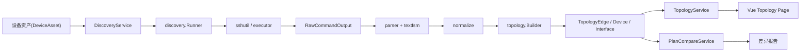

# NetWeaverGo LLDP 拓扑与邻居还原实施文档

## 1. 文档目的

本文基于 [lldp-plan.md](../lldp-plan.md) 的目标设计，结合 NetWeaverGo 当前仓库的真实实现，给出一份可直接落地的拓扑、邻居还原功能实施方案。

本文重点回答四件事：

1. 当前项目哪些能力可以直接复用。
2. `lldp-plan.md` 里的理想分层如何映射到现有代码。
3. LLDP 邻居还原、聚合归并、弱证据推断应如何实现。
4. 后端、数据库、Wails API、前端页面应如何分阶段落地。

---

## 2. 当前项目架构分析

### 2.1 现有后端骨架

当前项目已经具备一套成熟的桌面端执行框架：

- 入口在 `cmd/netweaver/main.go`，启动时初始化路径、日志、SQLite、运行时配置，并注册 Wails 服务。
- Wails 服务集中在 `internal/ui`，当前已有 `DeviceService`、`EngineService`、`TaskGroupService`、`QueryService`、`ExecutionHistoryService` 等。
- 并发执行核心在 `internal/engine`，已具备：
  - 设备级并发调度
  - 事件总线
  - 快照推送
  - 取消控制
  - 前端实时状态同步
- 单设备 SSH 执行能力在 `internal/executor` 和 `internal/sshutil`，已具备：
  - Shell 模式登录
  - 提示符识别
  - 分页处理
  - 错误检测
  - 原始字节流记录能力
- 存储层已使用 SQLite + GORM，初始化集中在 `internal/config/db.go`。

结论：传输层、并发框架、Wails 桥接、数据库基础设施已经存在，不需要从零实现。

### 2.2 现有前端骨架

当前前端基于 Vue 3 + Pinia + Vue Router，具备统一壳层：

- 顶层导航与布局在 `frontend/src/App.vue`
- 路由在 `frontend/src/router/index.ts`
- 后端调用统一收口在 `frontend/src/services/api.ts`
- 当前页面模型偏向“设备资产管理 + 批量执行 + 配置生成”

结论：拓扑能力应作为新的业务页加入现有导航，而不是单独再造一套前端入口。

### 2.3 当前架构对拓扑功能的直接复用点

下列模块可以直接作为拓扑功能底座：

| 现有模块 | 可复用职责 | 对拓扑功能的价值 |
| --- | --- | --- |
| `internal/sshutil` | SSH 建连、分页、字节流记录 | 直接作为采集传输层 |
| `internal/executor` | 单设备命令执行 | 可抽象出“设备采集会话” |
| `internal/engine` | 设备级并发调度 | 可驱动发现任务并发采集 |
| `internal/report` | 实时事件、快照、日志存储 | 可复用到发现任务进度展示 |
| `internal/config` | SQLite / GORM / 路径管理 | 可扩展拓扑领域表结构 |
| `internal/ui` | Wails 服务注册模型 | 可新增 Discovery / Topology / Compare 服务 |
| `frontend/src/services/api.ts` | 前后端 API 命名空间 | 可直接扩展拓扑 API |

### 2.4 当前缺口

仓库目前没有以下拓扑核心能力：

1. 厂商识别与设备画像字段
2. 专用采集命令模板和发现任务模型
3. CLI 结构化解析层
4. 标准化层
5. 拓扑推理层
6. 规划 Excel 导入与比对层
7. 拓扑图与链路证据展示页

这是本次实施的主范围。

---

## 3. 与 lldp-plan.md 的映射原则

`lldp-plan.md` 中建议的 `transport -> collector -> parser -> normalize -> topology -> compare -> storage -> presentation` 分层是对的，但当前仓库不适合机械照搬推荐目录。

更适合 NetWeaverGo 的落地方式是：

### 3.1 保留现有底座

- `transport` 映射到现有 `internal/sshutil`
- 调度能力继续由 `internal/engine` 和 `internal/ui/execution_manager.go` 提供
- 存储仍由 `internal/config` 统一管理和迁移
- Wails 服务仍放在 `internal/ui`

### 3.2 新增领域层

建议新增以下包：

```text
internal/discovery
internal/parser
internal/normalize
internal/topology
internal/plancompare
```

### 3.3 不复用“命令组”作为拓扑采集来源

拓扑采集命令必须由系统按厂商和设备类型控制，不能依赖用户维护的通用命令组，否则会出现：

- 命令不完整
- 输出格式不稳定
- 无法保证解析模板与命令严格对应

因此建议：

- 用户选择设备和任务参数
- 系统根据厂商 profile 自动下发发现命令
- 允许 UI 展示“将执行的命令预览”，但不允许随意编辑

---

## 4. 目标实施架构

## 4.1 目标模块划分

```text
/internal
  /discovery
    command_profile.go
    collector.go
    runner.go
    snapshot.go
    task.go

  /parser
    parser.go
    mapper.go
    registry.go
    template_loader.go
    /templates
      /huawei
        *.textfsm

  /normalize
    device.go
    interface.go
    lldp.go
    mac.go
    aggregate.go

  /topology
    builder.go
    identity.go
    lldp_matcher.go
    aggregate_resolver.go
    fdb_infer.go
    conflict.go
    view.go

  /plancompare
    importer.go
    matcher.go
    diff.go
    exporter.go

  /ui
    discovery_service.go
    topology_service.go
    plan_compare_service.go
```

### 4.2 数据流



### 4.3 执行阶段

建议把一次发现任务拆成 6 个明确阶段：

1. 设备筛选
2. SSH 采集
3. 原始输出入库
4. 结构化解析
5. 标准化与邻居还原
6. 拓扑建图与持久化

这样做的好处是任何一步失败都可追溯，且支持后续“重解析”“重建图”。

---

## 5. 数据模型设计

## 5.1 设备资产最小扩展

当前 `config.DeviceAsset` 只有连接字段，不足以支撑拓扑识别。建议先做最小扩展：

```go
type DeviceAsset struct {
    ID          uint
    IP          string
    Port        int
    Protocol    string
    Username    string
    Password    string
    Group       string
    Tags        []string

    Vendor      string // huawei / h3c / cisco / server / unknown
    Role        string // core / aggregation / access / firewall / server
    Site        string // 站点/机房
    DisplayName string // 用户维护的显示名称
}
```

原因：

- 发现命令集必须依赖 `Vendor`
- 拓扑分层展示会用到 `Role`
- 拓扑搜索、机房过滤会用到 `Site`
- Excel 规划表映射时 `DisplayName` 很重要

### 5.2 新增领域表

建议在当前 SQLite 中新增以下表，和 `lldp-plan.md` 保持一致，但命名遵循当前 GORM 风格。

#### 发现任务

```go
type DiscoveryTask struct {
    ID             string
    Name           string
    Status         string // pending/running/collecting/parsing/building/completed/failed/cancelled
    VendorScope    string
    DeviceCount    int
    SuccessCount   int
    FailedCount    int
    StartedAt      string
    FinishedAt     string
    ErrorMessage   string
}
```

#### 发现设备结果

```go
type DiscoveryDevice struct {
    ID             string
    TaskID         string
    DeviceAssetID  uint
    Hostname       string
    NormalizedName string
    MgmtIP         string
    Vendor         string
    Model          string
    Version        string
    SerialNumber   string
    ChassisID      string
    DeviceType     string
    Status         string
}
```

#### 接口、LLDP、FDB、ARP、聚合、边

按 `lldp-plan.md` 的模型落表：

- `topology_interfaces`
- `topology_lldp_neighbors`
- `topology_fdb_entries`
- `topology_arp_entries`
- `topology_aggregate_groups`
- `topology_aggregate_members`
- `topology_edges`
- `raw_command_outputs`
- `plan_files`
- `planned_links`
- `diff_reports`
- `diff_items`

建议为所有核心表显式增加 `task_id`，保证一次采集结果可完整回放。

### 5.3 原始输出存储策略

建议双写：

1. 数据库保留索引和摘要
2. 文件系统保留完整原始文本

推荐目录：

```text
<storageRoot>/topology/raw/<taskID>/<deviceIP>/<commandKey>.txt
<storageRoot>/topology/export/<taskID>/
<storageRoot>/plans/imports/
```

这样可以避免把大文本全部塞进 SQLite，同时支持界面打开原文。

---

## 6. 发现与邻居还原后端设计

## 6.1 发现任务不直接套用现有 Engine 语义

`internal/engine.Engine` 现在是“设备 + 命令列表”的执行器，偏向批量下发。拓扑发现可以复用其并发思想，但不应完全绑定现有“命令执行任务”概念。

建议做法：

- 新建 `internal/discovery.Runner`
- 内部复用 `engine` 的并发与事件推送模式
- 外部通过 `DiscoveryService` 暴露发现任务 API

建议核心接口：

```go
type Runner interface {
    Start(ctx context.Context, req StartDiscoveryRequest) (string, error)
    RetryFailed(ctx context.Context, taskID string) error
    Cancel(taskID string) error
}
```

## 6.2 厂商命令集

华为首版固定命令建议直接采用 `lldp-plan.md`：

- `display version`
- `display current-configuration | include sysname`
- `display esn`
- `display device`
- `display interface brief`
- `display interface`
- `display lldp neighbor verbose`
- `display mac-address`
- `display eth-trunk`
- `display arp all`

实现方式：

- `command_profile.go` 中定义 `VendorCommandProfile`
- 每条命令绑定唯一 `commandKey`
- 原始入库和模板解析都按 `commandKey` 驱动

示例：

```go
type CommandSpec struct {
    Command    string
    CommandKey string
    TimeoutSec int
}
```

## 6.3 解析层

解析层建议严格采用 `TextFSM` 思路，但对业务只暴露强类型结构：

```go
type CliParser interface {
    Parse(commandKey string, rawText string) ([]map[string]string, error)
}

type ResultMapper interface {
    ToDeviceInfo(rows []map[string]string) (*DeviceIdentity, error)
    ToInterfaces(rows []map[string]string) ([]InterfaceFact, error)
    ToLLDP(rows []map[string]string) ([]LLDPFact, error)
    ToFDB(rows []map[string]string) ([]FDBFact, error)
    ToARP(rows []map[string]string) ([]ARPFact, error)
    ToAggregate(rows []map[string]string) ([]AggregateFact, error)
}
```

关键点：

- 模板文件走 `embed`
- 模板注册表只认 `commandKey`
- 解析失败必须保留原文，并把状态标为 `parse_failed`
- 支持“重新套模板重解析”，不强依赖重新 SSH 采集

## 6.4 标准化层

标准化层必须在入图库前完成，不应把脏字段直接用于匹配。

至少实现：

- `NormalizeDeviceName`
- `NormalizeInterfaceName`
- `NormalizeMAC`
- `NormalizeLLDPRemotePort`
- `NormalizeAggregateName`

接口名归一化必须优先完成，否则 LLDP、聚合、规划表三方无法统一。

建议内置华为规则：

- `GigabitEthernet1/0/1 -> GE1/0/1`
- `10GE1/0/1 -> XGE1/0/1`
- `XGigabitEthernet1/0/1 -> XGE1/0/1`
- `Eth-Trunk10 -> Trunk10`

## 6.5 设备身份归并

同一设备可能同时以以下字段出现：

- 设备资产 IP
- LLDP 远端管理地址
- sysname
- chassis ID
- serial number

建议做独立身份解析器 `topology/identity.go`，优先级：

1. `SerialNumber`
2. `MgmtIP`
3. `ChassisID`
4. `NormalizedName`

如果命中多个候选但信息冲突，状态标记为 `identity_conflict`，不自动合并。

---

## 7. 邻居还原核心算法

## 7.1 输出目标

邻居还原最终输出不是单纯的 LLDP 原始行，而是“可展示、可比对、可追溯”的链路对象：

```go
type TopologyEdge struct {
    ID               string
    ADeviceID        string
    AIf              string
    BDeviceID        string
    BIf              string
    LogicalAIf       string
    LogicalBIf       string
    EdgeType         string
    Status           string
    Confidence       float64
    DiscoveryMethods []string
    Evidence         []EdgeEvidence
}
```

## 7.2 一级：双向 LLDP 确认链路

判定条件：

- A 的本地接口 `A:X` 发现远端 `B:Y`
- B 的本地接口 `B:Y` 反向发现远端 `A:X`

输出：

- `Status = confirmed`
- `Confidence = 1.0`
- `DiscoveryMethods = ["lldp_bidirectional"]`

这是默认主链路来源，任何弱证据不得覆盖它。

## 7.3 二级：单向 LLDP 半确认链路

判定条件：

- 仅一侧能通过 LLDP 指向另一侧
- 对端设备存在，但没有匹配到反向记录

输出：

- `Status = semi_confirmed`
- `Confidence = 0.75`
- `DiscoveryMethods = ["lldp_single_side"]`

适用场景：

- 对端未开启 LLDP
- 采集时对端失败
- 远端端口字段缺失

## 7.4 三级：聚合逻辑链路归并

当物理链路属于同一聚合组时，应先保留成员边，再生成逻辑边。

处理顺序：

1. 先计算成员口物理边
2. 查询本端 `ParentAggregate`
3. 查询对端 `ParentAggregate`
4. 若双方都属于聚合组，则额外生成逻辑边

展示策略：

- 默认展示逻辑边
- 成员边在 UI 中按需展开

输出：

- `EdgeType = logical_aggregate`
- `LogicalAIf/LogicalBIf` 填充 Trunk 口
- `Evidence` 中保留成员口列表

## 7.5 四级：FDB 辅助推断

FDB 只作为弱证据。

### 场景 A：服务器接入口推断

判定建议：

- 端口无 LLDP
- FDB 学到 1 到 2 个 MAC
- ARP 能定位到单个 IP
- 接口描述命中服务器关键字，或接口类型是接入口

输出：

- 新建被动节点 `server-inferred`
- `EdgeType = server_access`
- `Status = inferred`
- `Confidence = 0.55 ~ 0.70`

### 场景 B：交换设备间弱推断

判定建议：

- trunk 口无 LLDP
- 某端口承载的大量 MAC 可归属到另一台已知设备
- 无更高置信度候选

输出：

- `EdgeType = inferred`
- `Status = inferred`
- `Confidence = 0.40 ~ 0.60`

## 7.6 去重规则

边是无向的，必须统一键：

```text
min(A:if, B:if) + "|" + max(A:if, B:if)
```

逻辑边和成员边要分层去重：

- 成员边按物理接口去重
- 逻辑边按聚合接口去重
- 逻辑边不覆盖成员边，只作为额外视图层

## 7.7 冲突处理

以下情况标记冲突：

- 一个接口命中多个远端接口
- LLDP 与 FDB 指向不同对象
- 同一成员口归属多个聚合组
- 远端设备身份归并不唯一

冲突策略：

- 保留所有候选证据
- `Status = conflict`
- 不自动升级为 confirmed
- UI 高亮显示红色

## 7.8 证据链模型

每条边必须携带证据链，至少包含：

- 来源设备
- 来源接口
- 发现命令
- 摘要描述
- 原始输出引用

示例：

```go
type EdgeEvidence struct {
    Type      string
    DeviceID  string
    Interface string
    Command   string
    Summary   string
    RawRefID  string
}
```

这样前端可以直接展示“这条链路为什么成立”。

---

## 8. 拓扑视图与前端实施

## 8.1 新增页面

建议在当前导航中新增 3 个一级页面：

1. `Discovery` 发现任务
2. `Topology` 拓扑视图
3. `PlanCompare` 规划比对

对应新增：

```text
frontend/src/views/Discovery.vue
frontend/src/views/Topology.vue
frontend/src/views/PlanCompare.vue
```

并扩展：

- `frontend/src/router/index.ts`
- `frontend/src/App.vue`
- `frontend/src/services/api.ts`

## 8.2 发现任务页

页面能力：

- 选择设备范围
- 按厂商过滤
- 配置并发数和超时
- 启动发现
- 查看设备采集进度
- 查看失败原因
- 重试失败设备

实现建议：

- 复用现有 `TaskExecution` 的“设备状态卡片 + 快照刷新”模式
- 发现任务不需要命令日志终端式展示，改为阶段日志更合适

## 8.3 拓扑页

建议图形库：

- `cytoscape`
- 可选 `cytoscape-dagre`

拓扑页至少包含：

- 节点搜索
- 站点/角色过滤
- 链路状态过滤
- 逻辑图 / 物理展开切换
- 点击节点打开设备详情抽屉
- 点击边打开证据抽屉

默认展示规则：

- confirmed: 绿色实线
- semi_confirmed: 黄色实线
- inferred: 橙色虚线
- logical_aggregate: 蓝色粗线
- member_edge: 灰色细线
- conflict: 红色

## 8.4 设备详情抽屉

显示：

- 设备基础信息
- 发现状态
- 接口清单
- 聚合关系
- LLDP 邻居表
- 原始命令输出入口

## 8.5 边详情抽屉

显示：

- 两端设备和接口
- 逻辑口与成员口映射
- 状态与置信度
- 发现方式
- 证据链列表
- 与规划比对结果

---

## 9. Wails API 设计

建议新增三个服务，仍放在 `internal/ui`。

## 9.1 DiscoveryService

```go
type DiscoveryService struct {}

func (s *DiscoveryService) StartDiscovery(req StartDiscoveryRequest) (TaskStartResponse, error)
func (s *DiscoveryService) GetTaskStatus(taskID string) (*DiscoveryTaskView, error)
func (s *DiscoveryService) ListTasks() ([]DiscoveryTaskView, error)
func (s *DiscoveryService) RetryFailed(taskID string) error
func (s *DiscoveryService) CancelTask(taskID string) error
```

## 9.2 TopologyService

```go
type TopologyService struct {}

func (s *TopologyService) BuildTopology(taskID string) (*TopologyBuildResult, error)
func (s *TopologyService) GetTopologyGraph(taskID string) (*TopologyGraphView, error)
func (s *TopologyService) GetDeviceDetail(taskID string, deviceID string) (*TopologyDeviceDetailView, error)
func (s *TopologyService) GetEdgeDetail(taskID string, edgeID string) (*TopologyEdgeDetailView, error)
```

## 9.3 PlanCompareService

```go
type PlanCompareService struct {}

func (s *PlanCompareService) ImportPlanExcel(filePath string) (*PlanImportResult, error)
func (s *PlanCompareService) Compare(taskID string, planID string) (*CompareResult, error)
func (s *PlanCompareService) GetDiffReport(reportID string) (*DiffReportView, error)
func (s *PlanCompareService) ExportDiffReport(reportID string, format string) (string, error)
```

---

## 10. 与现有代码的集成策略

## 10.1 数据库迁移

在 `internal/config/db.go` 中新增 GORM 模型迁移：

- `DiscoveryTask`
- `DiscoveryDevice`
- `TopologyInterface`
- `LLDPNeighbor`
- `FDBEntry`
- `ARPEntry`
- `AggregateGroup`
- `AggregateMember`
- `TopologyEdge`
- `RawCommandOutput`
- `PlanFile`
- `PlannedLink`
- `DiffReport`
- `DiffItem`

同时补充索引：

- `task_id`
- `device_id`
- `mgmt_ip`
- `normalized_name`
- `status`

## 10.2 路径管理器扩展

在 `internal/config/paths.go` 中增加：

- `TopologyRawDir`
- `TopologyExportDir`
- `PlanImportDir`

使原始 CLI、导出图谱、导入规划文件都有固定落点。

## 10.3 运行时配置扩展

当前 `RuntimeConfig` 可继续扩展以下项：

- `discovery.workerCount`
- `discovery.perDeviceTimeout`
- `discovery.commandTimeout`
- `topology.maxInferenceCandidates`

这样可以避免把发现任务参数塞进全局设置字符串字段。

## 10.4 ExecutionHistory 的关系

建议不要把拓扑明细直接塞进现有 `ExecutionRecord`。

更合理的做法：

- `DiscoveryTask` 保存发现任务主记录
- `ExecutionRecord` 可选写入一条摘要历史，`RunnerSource = discovery_service`
- 详细设备、链路、原始输出全部走拓扑领域表

这样不会污染现有命令执行历史模型。

---

## 11. 分阶段实施建议

## Phase 1：采集与原始快照

交付目标：

- 设备资产增加 `Vendor/Role/Site/DisplayName`
- 新建 `DiscoveryService`
- 华为发现命令 profile
- 原始输出入库和文件落盘
- 发现任务进度页

完成标准：

- 可对选定华为设备批量采集
- 每台设备原始命令文本可回看

## Phase 2：解析与标准化

交付目标：

- 引入 `gotextfsm`
- 完成华为模板
- 结构化出设备、接口、LLDP、FDB、ARP、聚合
- 完成接口名、设备名、MAC 归一化

完成标准：

- 可从历史原始输出重跑解析
- 单台设备可展示结构化详情

## Phase 3：邻居还原与拓扑图

交付目标：

- 双向 LLDP、单向 LLDP、聚合归并
- FDB 弱推断
- 冲突标记
- 拓扑图页面和边详情抽屉

完成标准：

- 能输出 confirmed / semi_confirmed / inferred / conflict
- 聚合口可默认汇总并展开成员口

## Phase 4：规划表比对

交付目标：

- Excel 导入
- 规划链路标准化
- 实际与规划比对
- 差异报告导出

完成标准：

- 能识别缺失链路、意外链路、聚合不一致、接口不一致

---

## 12. 测试策略

## 12.1 单元测试

建议新增：

- `internal/parser/..._test.go`
- `internal/normalize/..._test.go`
- `internal/topology/..._test.go`
- `internal/plancompare/..._test.go`

重点覆盖：

- 接口名归一化
- 双向 LLDP 配对
- 聚合归并
- 冲突识别
- 边去重
- 规划表无向边匹配

## 12.2 Golden 测试数据

建议在仓库加入：

```text
testdata/huawei/raw/
testdata/huawei/parsed/
testdata/huawei/topology/
```

其中保存：

- 真实脱敏 CLI 输出
- 期望解析结果 JSON
- 期望拓扑边 JSON

这样后续厂商模板迭代时不会破坏已有解析。

## 12.3 集成测试

至少准备三组数据：

1. 双交换机直连
2. 交换机双上联聚合
3. 接服务器接入口 + 缺失 LLDP 场景

验收点：

- 双向 LLDP 应输出 confirmed
- 聚合成员应折叠成逻辑链路
- 无 LLDP 服务器口应被推断为 inferred，而不是 confirmed

---

## 13. 风险与约束

## 13.1 当前最大实现风险

1. 设备资产缺少厂商字段，导致命令 profile 无法稳定选择
2. 现有 `Engine` 语义偏“命令下发”，若强行复用会把发现任务设计搞乱
3. 原始 CLI 输出体量较大，不能只依赖 SQLite 文本字段
4. 接口命名不统一时，邻居还原和规划比对都会失真

## 13.2 设计约束

- 首版只做华为，优先保证模板和推理质量
- LLDP 是主证据，FDB/ARP 仅做辅助
- 冲突必须可见，不能为了“图更完整”而强行自动修正
- 发现、解析、建图、比对应可分阶段重跑

---

## 14. 结论

结合当前仓库，最优落地路径不是重建一个全新系统，而是在现有执行框架上补齐四层能力：

1. `discovery`：按厂商稳定采集原始数据
2. `parser + normalize`：把 CLI 文本变成统一事实模型
3. `topology`：把 LLDP / 聚合 / FDB / ARP 组装为可解释链路
4. `plancompare`：把实际链路和 Excel 规划做无向标准化比对

从工程顺序看，应先打通“采集 -> 原始入库 -> 解析 -> 双向 LLDP 建边”，再做“聚合归并 -> FDB 弱推断 -> Excel 比对”。这样可以最快形成可演示、可验证、可逐步扩展的拓扑与邻居还原能力。
