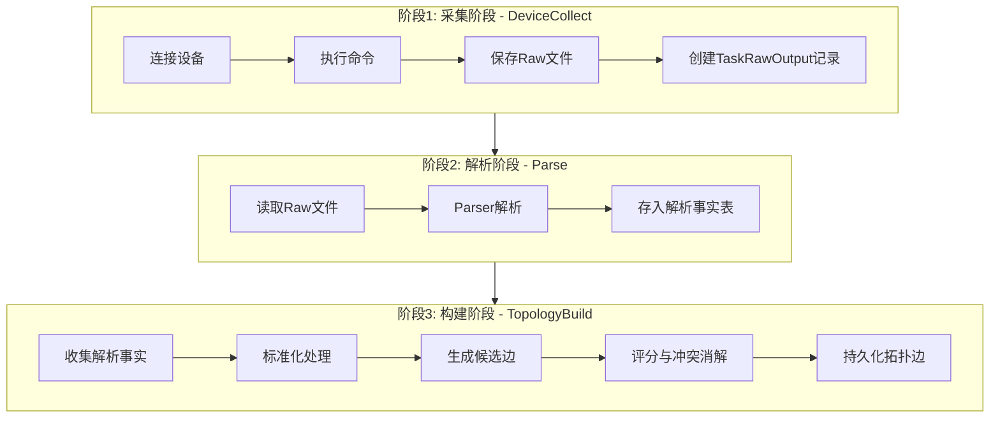
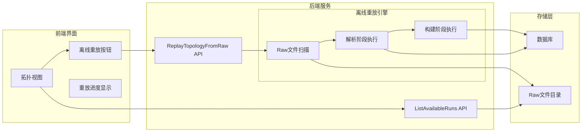
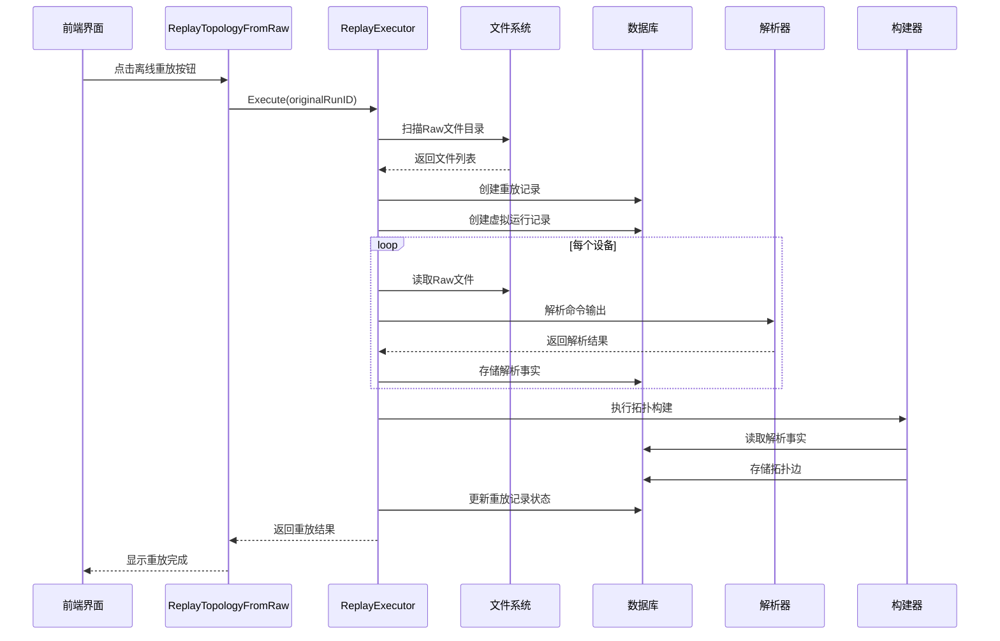

# 离线重放模式设计方案

## 1. 背景与目标

### 1.1 问题背景

当前拓扑还原功能的开发和调试高度依赖真实设备连接。每次调整解析逻辑或拓扑构建算法后，都需要重新连接设备执行采集任务，调试效率低下。

### 1.2 目标

实现**离线重放模式**，允许开发者直接基于历史采集的Raw文件进行解析和拓扑构建调试，无需重新连接设备。

### 1.3 核心价值

- **提升调试效率**：跳过采集阶段，直接测试解析和构建逻辑
- **支持迭代开发**：修改解析模板或构建算法后，可快速验证效果
- **问题复现**：基于历史数据复现和定位问题
- **版本对比**：对比不同解析器版本的处理效果

---

## 2. 现有架构分析

### 2.1 拓扑任务执行流程



### 2.2 关键数据存储

| 存储位置               | 说明             | 路径格式                                                   |
| ---------------------- | ---------------- | ---------------------------------------------------------- |
| Raw文件                | 设备命令原始输出 | `{TopologyRawDir}/{runID}/{deviceIP}/{commandKey}_raw.txt` |
| TaskRawOutput          | 命令输出索引     | 数据库表 `task_raw_outputs`                                |
| TaskParsedLLDPNeighbor | LLDP解析结果     | 数据库表 `task_parsed_lldp_neighbors`                      |
| TaskParsedFDBEntry     | FDB解析结果      | 数据库表 `task_parsed_fdb_entries`                         |
| TaskParsedARPEntry     | ARP解析结果      | 数据库表 `task_parsed_arp_entries`                         |
| TaskTopologyEdge       | 拓扑边           | 数据库表 `task_topology_edges`                             |

### 2.3 现有代码结构

```
internal/taskexec/
├── service.go              # 任务执行服务入口
├── topology_compiler.go    # 拓扑任务编译器（生成三阶段计划）
├── executor_impl.go        # 执行器实现（ParseExecutor, TopologyBuildExecutor）
├── topology_builder.go     # 拓扑构建核心逻辑
├── topology_query.go       # 拓扑查询服务
└── persistence.go          # 数据持久化

internal/parser/
├── manager.go              # 解析器管理器
├── composite_parser.go     # 组合解析器
└── mapper.go               # 解析结果映射

internal/config/
└── paths.go                # 路径管理（TopologyRawDir等）

frontend/src/views/
└── Topology.vue            # 拓扑视图前端
```

---

## 3. 方案设计

### 3.1 整体架构



### 3.2 核心设计原则

1. **最小侵入**：复用现有解析和构建逻辑，不修改核心算法
2. **数据隔离**：重放结果与原始运行记录分离，支持对比分析
3. **可追溯**：记录重放操作的完整日志和决策轨迹
4. **可取消**：支持中断长时间运行的重放任务

---

## 4. 分阶段实施计划

### 阶段一：后端核心能力（Phase 1）

**目标**：实现离线重放的核心API和执行逻辑

#### 4.1.1 新增数据模型

```go
// TopologyReplayRecord 重放记录
type TopologyReplayRecord struct {
    ID              uint       `gorm:"primaryKey;autoIncrement" json:"id"`
    OriginalRunID   string     `gorm:"index;not null" json:"originalRunId"` // 原始运行ID
    ReplayRunID     string     `gorm:"uniqueIndex;not null" json:"replayRunId"` // 重放运行ID
    Status          string     `json:"status"` // pending, running, completed, failed
    TriggerSource   string     `json:"triggerSource"` // manual, auto
    ParserVersion   string     `json:"parserVersion"` // 解析器版本标识
    BuilderVersion  string     `json:"builderVersion"` // 构建器版本标识
    StartedAt       *time.Time `json:"startedAt"`
    FinishedAt      *time.Time `json:"finishedAt"`
    ErrorMessage    string     `json:"errorMessage"`
    Statistics      string     `gorm:"type:text" json:"statistics"` // JSON序列化的统计信息
    CreatedAt       time.Time  `json:"createdAt"`
    UpdatedAt       time.Time  `json:"updatedAt"`
}

func (TopologyReplayRecord) TableName() string {
    return "topology_replay_records"
}
```

#### 4.1.2 新增服务方法

在 [`TaskExecutionService`](internal/taskexec/service.go) 中新增：

```go
// ReplayTopologyFromRaw 从Raw文件重放拓扑构建
// 跳过采集阶段，直接执行 Parse -> TopologyBuild
func (s *TaskExecutionService) ReplayTopologyFromRaw(ctx context.Context, originalRunID string, opts ReplayOptions) (*ReplayResult, error)

// ListReplayableRuns 列出可重放的运行记录
func (s *TaskExecutionService) ListReplayableRuns(limit int) ([]ReplayableRunInfo, error)

// GetReplayHistory 获取重放历史
func (s *TaskExecutionService) GetReplayHistory(originalRunID string) ([]TopologyReplayRecord, error)
```

#### 4.1.3 重放执行器实现

新建文件 `internal/taskexec/replay_executor.go`：

```go
// ReplayExecutor 离线重放执行器
type ReplayExecutor struct {
    db             *gorm.DB
    parserProvider parser.ParserProvider
    pathManager    *config.PathManager
}

// Execute 执行重放流程
func (e *ReplayExecutor) Execute(ctx context.Context, originalRunID string, opts ReplayOptions) (*ReplayResult, error) {
    // 1. 扫描Raw文件目录
    rawFiles, err := e.scanRawFiles(originalRunID)

    // 2. 创建虚拟运行记录
    replayRunID := e.createReplayRun(originalRunID)

    // 3. 执行解析阶段
    parseResult := e.executeParse(ctx, replayRunID, rawFiles)

    // 4. 执行构建阶段
    buildResult := e.executeBuild(ctx, replayRunID)

    // 5. 记录重放结果
    return e.finalize(replayRunID, parseResult, buildResult)
}
```

#### 4.1.4 Raw文件扫描逻辑

```go
// scanRawFiles 扫描指定运行ID的所有Raw文件
func (e *ReplayExecutor) scanRawFiles(runID string) ([]RawFileInfo, error) {
    rawDir := filepath.Join(e.pathManager.TopologyRawDir, runID)

    var files []RawFileInfo
    err := filepath.Walk(rawDir, func(path string, info os.FileInfo, err error) error {
        if strings.HasSuffix(path, "_raw.txt") {
            relPath, _ := filepath.Rel(rawDir, path)
            parts := strings.Split(relPath, string(filepath.Separator))
            if len(parts) >= 2 {
                files = append(files, RawFileInfo{
                    DeviceIP:   parts[0],
                    CommandKey: strings.TrimSuffix(parts[1], "_raw.txt"),
                    FilePath:   path,
                })
            }
        }
        return nil
    })
    return files, err
}
```

#### 4.1.5 数据库迁移

在 [`AutoMigrate`](internal/taskexec/persistence.go) 中添加：

```go
&TopologyReplayRecord{},
```

---

### 阶段二：前端界面集成（Phase 2）

**目标**：在拓扑视图界面新增离线重放功能入口

#### 4.2.1 界面布局调整

在 [`Topology.vue`](frontend/src/views/Topology.vue) 的工具栏区域新增按钮：

```vue
<div class="flex items-center gap-2">
  <!-- 现有的运行选择下拉框 -->
  <select v-model="selectedRunId" ...>
    ...
  </select>
  
  <!-- 新增：离线重放按钮 -->
  <button
    @click="openReplayDialog"
    :disabled="!selectedRunId"
    class="px-4 py-2 rounded-lg text-sm font-medium bg-accent text-white hover:bg-accent/90 disabled:opacity-50"
    title="从历史Raw文件重新解析构建拓扑"
  >
    <svg class="w-4 h-4 inline mr-1" ...>...</svg>
    离线重放
  </button>
  
  <!-- 现有的刷新按钮 -->
  <button @click="refreshGraph" ...>刷新图谱</button>
</div>
```

#### 4.2.2 重放对话框组件

新建 `frontend/src/components/topology/ReplayDialog.vue`：

```vue
<template>
  <div class="fixed inset-0 bg-black/50 flex items-center justify-center z-50">
    <div class="bg-bg-card border border-border rounded-xl p-6 w-[500px]">
      <h3 class="text-lg font-semibold text-text-primary mb-4">离线重放配置</h3>

      <!-- 重放选项 -->
      <div class="space-y-4">
        <div>
          <label class="text-sm text-text-secondary">原始运行ID</label>
          <div class="text-text-primary font-mono">{{ originalRunId }}</div>
        </div>

        <div>
          <label class="text-sm text-text-secondary">解析器版本</label>
          <select v-model="options.parserVersion" class="w-full mt-1 ...">
            <option value="current">当前版本</option>
            <option value="previous">上一版本（如果可用）</option>
          </select>
        </div>

        <div class="flex items-center gap-2">
          <input
            type="checkbox"
            v-model="options.clearExisting"
            id="clearExisting"
          />
          <label for="clearExisting" class="text-sm text-text-secondary">
            清除现有解析结果后重新构建
          </label>
        </div>
      </div>

      <!-- 进度显示 -->
      <div v-if="replaying" class="mt-4">
        <div class="text-sm text-text-secondary mb-2">
          {{ progressMessage }}
        </div>
        <div class="w-full bg-bg-panel rounded-full h-2">
          <div
            class="bg-accent h-2 rounded-full transition-all"
            :style="{ width: progress + '%' }"
          ></div>
        </div>
      </div>

      <!-- 操作按钮 -->
      <div class="flex justify-end gap-2 mt-6">
        <button @click="close" :disabled="replaying" class="...">取消</button>
        <button @click="startReplay" :disabled="replaying" class="...">
          {{ replaying ? "重放中..." : "开始重放" }}
        </button>
      </div>
    </div>
  </div>
</template>
```

#### 4.2.3 前端API调用

在 `frontend/src/composables/useTopologyReplay.ts` 中封装：

```typescript
export function useTopologyReplay() {
  const replayTopology = async (
    originalRunId: string,
    options: ReplayOptions,
  ): Promise<ReplayResult> => {
    return await window.go.main.TaskExecutionService.ReplayTopologyFromRaw(
      originalRunId,
      options,
    );
  };

  const listReplayableRuns = async (): Promise<ReplayableRunInfo[]> => {
    return await window.go.main.TaskExecutionService.ListReplayableRuns(50);
  };

  return { replayTopology, listReplayableRuns };
}
```

---

### 阶段三：增强功能（Phase 3）

**目标**：提供更丰富的调试和对比功能

#### 4.3.1 解析结果对比

新增API支持对比两次重放的解析结果差异：

```go
// CompareReplayResults 对比两次重放的解析结果
func (s *TaskExecutionService) CompareReplayResults(runID1, runID2 string) (*ParseResultDiff, error)
```

对比内容包括：

- LLDP邻居数量变化
- FDB条目变化
- ARP条目变化
- 接口信息变化

#### 4.3.2 拓扑边对比

新增API支持对比两次构建的拓扑边差异：

```go
// CompareTopologyEdges 对比两次构建的拓扑边
func (s *TaskExecutionService) CompareTopologyEdges(runID1, runID2 string) (*TopologyEdgeDiff, error)
```

对比结果展示：

- 新增的边
- 删除的边
- 状态变化的边
- 置信度变化的边

#### 4.3.3 决策轨迹查看

在拓扑边详情中展示完整的决策轨迹：

```vue
<div class="decision-trace">
  <h4>决策轨迹</h4>
  <div v-for="trace in edgeDetail.decisionTraces" :key="trace.id" class="trace-item">
    <span class="trace-type">{{ trace.decisionType }}</span>
    <span class="trace-result">{{ trace.decisionResult }}</span>
    <span class="trace-reason">{{ trace.decisionReason }}</span>
  </div>
</div>
```

#### 4.3.4 Raw文件预览

在设备详情中增加Raw文件预览功能：

```vue
<div class="raw-preview">
  <h4>原始命令输出</h4>
  <div class="tabs">
    <button v-for="cmd in rawCommands" :key="cmd" @click="selectedRaw = cmd">
      {{ cmd }}
    </button>
  </div>
  <pre class="raw-content">{{ rawContent }}</pre>
</div>
```

---

### 阶段四：测试与文档（Phase 4）

**目标**：完善测试覆盖和用户文档

#### 4.4.1 单元测试

新建 `internal/taskexec/replay_executor_test.go`：

```go
func TestReplayExecutor_ScanRawFiles(t *testing.T) {
    // 测试Raw文件扫描逻辑
}

func TestReplayExecutor_ExecuteParse(t *testing.T) {
    // 测试解析阶段执行
}

func TestReplayExecutor_ExecuteBuild(t *testing.T) {
    // 测试构建阶段执行
}

func TestReplayExecutor_FullReplay(t *testing.T) {
    // 端到端重放测试
}
```

#### 4.4.2 集成测试

```go
func TestReplayTopologyFromRaw_Integration(t *testing.T) {
    // 使用真实Raw文件进行集成测试
    // 验证完整重放流程
}
```

#### 4.4.3 用户文档

更新 `README.md` 和创建 `docs/offline_replay_guide.md`：

- 功能说明
- 使用步骤
- 常见问题
- 最佳实践

---

## 5. 技术细节

### 5.1 重放流程时序图



### 5.2 错误处理策略

| 错误类型      | 处理方式                          |
| ------------- | --------------------------------- |
| Raw文件不存在 | 返回错误，提示用户先执行采集      |
| 解析失败      | 记录错误日志，继续处理其他文件    |
| 构建失败      | 回滚事务，保留原始数据            |
| 用户取消      | 清理中间数据，标记状态为cancelled |

### 5.3 性能考虑

1. **并发解析**：多设备并行解析，默认并发数5
2. **增量构建**：支持只重新构建指定设备
3. **内存优化**：流式读取大文件，避免全量加载
4. **进度反馈**：实时推送解析和构建进度

---

## 6. 文件变更清单

### 6.1 新增文件

| 文件路径                                            | 说明               |
| --------------------------------------------------- | ------------------ |
| `internal/taskexec/replay_executor.go`              | 重放执行器核心逻辑 |
| `internal/taskexec/replay_models.go`                | 重放相关数据模型   |
| `frontend/src/components/topology/ReplayDialog.vue` | 重放对话框组件     |
| `frontend/src/composables/useTopologyReplay.ts`     | 重放功能封装       |

### 6.2 修改文件

| 文件路径                           | 修改内容             |
| ---------------------------------- | -------------------- |
| `internal/taskexec/service.go`     | 新增重放相关API方法  |
| `internal/taskexec/persistence.go` | 新增数据表迁移       |
| `frontend/src/views/Topology.vue`  | 新增离线重放按钮     |
| `frontend/src/types/topology.ts`   | 新增重放相关类型定义 |

---

## 7. 风险与缓解措施

| 风险             | 影响       | 缓解措施                     |
| ---------------- | ---------- | ---------------------------- |
| Raw文件格式变化  | 解析失败   | 版本兼容性检查，提供格式转换 |
| 数据库迁移失败   | 功能不可用 | 提供手动迁移脚本             |
| 大规模数据处理慢 | 用户体验差 | 异步处理，进度反馈           |
| 并发冲突         | 数据不一致 | 使用事务，乐观锁             |

---

## 8. 验收标准

### 阶段一验收标准

- [ ] 能够扫描指定运行ID的所有Raw文件
- [ ] 能够成功执行解析阶段
- [ ] 能够成功执行构建阶段
- [ ] 重放结果与原始结果一致（相同输入条件下）

### 阶段二验收标准

- [ ] 前端界面显示离线重放按钮
- [ ] 点击按钮弹出重放配置对话框
- [ ] 重放过程显示进度
- [ ] 重放完成后自动刷新拓扑图

### 阶段三验收标准

- [ ] 支持解析结果对比
- [ ] 支持拓扑边对比
- [ ] 支持决策轨迹查看
- [ ] 支持Raw文件预览

### 阶段四验收标准

- [ ] 单元测试覆盖率 > 80%
- [ ] 集成测试通过
- [ ] 用户文档完整

---

## 9. 后续扩展方向

1. **解析器版本管理**：支持多版本解析器并存，对比不同版本效果
2. **自动化回归测试**：基于重放功能实现解析器回归测试
3. **数据导入导出**：支持导入外部Raw文件进行离线分析
4. **性能基准测试**：基于重放功能进行性能基准测试
