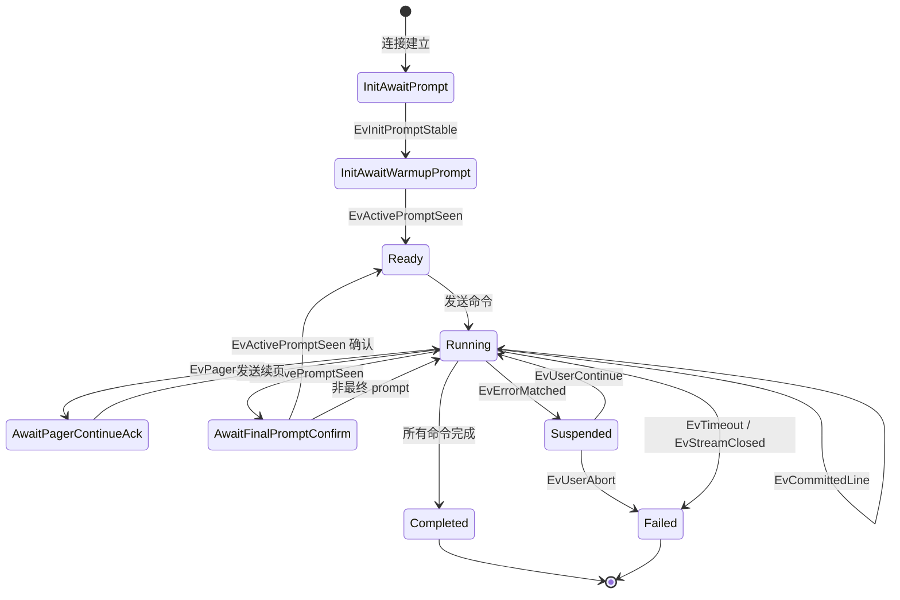

# 分页竞态修复 - 详细实施计划

> 基于 `pagination-race-fix-plan.md` 修复方案输出的分阶段实施计划
>
> **实施进度**：Phase 0-3 已完成，Phase 4-6 待实施

## 概述

本计划将修复方案拆分为 6 个阶段，每个阶段包含具体的任务清单、验收标准和依赖关系。

---

## Phase 0：止血与基线

**目标**：先把"明显错误"和"状态双写"停掉，不动大结构

### 任务清单

#### 0.1 修复 `UpdateTaskGroupStatus()` 赋值 Bug

**文件**：[`internal/config/task_group.go:102-117`](internal/config/task_group.go:102)

**问题**：`UpdateTaskGroupStatus()` 函数验证了状态但没有将 `status` 赋值到 `group.Status` 字段

**修改内容**：

```go
// 在 DB.Save(&group) 之前添加
group.Status = status
```

**验收标准**：

- [ ] 单元测试验证状态更新正确
- [ ] 调用后数据库中 `status` 字段正确更新

---

#### 0.2 补充基础不变量测试

**新建文件**：`internal/executor/session_invariants_test.go`

**测试场景**：

1. `pendingLines > 0` 时不可发送业务命令
2. 单命令最多完成一次
3. `Completed/Failed` 状态不可回退
4. 初始化未完成前不可发送第一条命令

**验收标准**：

- [ ] 所有不变量测试通过
- [ ] 测试覆盖关键状态迁移规则

---

#### 0.3 恢复当前失败的测试

**文件**：[`internal/executor/session_machine_test.go`](internal/executor/session_machine_test.go:1)

**任务**：

1. 运行 `go test ./internal/executor` 识别失败测试
2. 分析失败原因
3. 修复测试使其与当前真实行为一致（不改变行为，只修正测试预期）

**验收标准**：

- [ ] `go test ./internal/executor` 全绿
- [ ] 无跳过或禁用的测试

---

#### 0.4 建立提交前测试钩子

**任务**：

1. 确认 `go test ./internal/executor` 为提交前必跑命令
2. 可选：配置 pre-commit hook 或 CI 流程

**验收标准**：

- [ ] 测试命令文档化
- [ ] 提交前测试流程明确

---

#### 0.5 统一日志前缀

**文件**：[`internal/executor/session_machine.go`](internal/executor/session_machine.go:1)

**任务**：

1. 给状态迁移相关日志添加统一前缀 `[SessionMachine]`
2. 给关键决策点添加日志（状态进入、状态退出、动作触发）

**验收标准**：

- [ ] 日志可通过前缀过滤
- [ ] 状态迁移路径可追踪

---

#### 0.6 整理事故样本清单

**目录**：`testdata/regression/bug_fixes/`

**任务**：

1. 确认现有事故样本完整性
2. 为每个样本补充 README 说明
3. 建立样本索引文档

**验收标准**：

- [ ] 所有事故样本有对应测试用例
- [ ] 样本索引文档完整

---

### Phase 0 产出物

| 产出物           | 说明                                      |
| ---------------- | ----------------------------------------- |
| 绿色基础测试     | `go test ./internal/executor` 全绿        |
| 已知事故样本清单 | `testdata/regression/bug_fixes/` 目录完整 |
| 当前状态图文档   | 记录当前状态迁移逻辑                      |

---

## Phase 1：抽离纯状态迁移

**目标**：把状态迁移从 I/O 中剥出来，建立 Reducer 模式

**依赖**：Phase 0 完成

### 任务清单

#### 1.1 创建类型定义文件

**新建文件**：`internal/executor/session_types.go`

**内容**：

```go
// SessionState 新状态枚举
type SessionState int

const (
    StateInitAwaitPrompt SessionState = iota
    StateInitAwaitWarmupPrompt
    StateReady
    StateRunning
    StateAwaitPagerContinueAck
    StateAwaitFinalPromptConfirm
    StateSuspended
    StateCompleted
    StateFailed
)

// SessionEvent 协议事件
type SessionEvent interface {
    EventType() string
}

// 具体事件类型
type EvChunkProcessed struct { ... }
type EvCommittedLine struct { ... }
type EvActivePromptSeen struct { ... }
type EvPagerSeen struct { ... }
type EvErrorMatched struct { ... }
type EvTimeout struct { ... }
type EvUserContinue struct { ... }
type EvUserAbort struct { ... }
type EvStreamClosed struct { ... }
type EvInitPromptStable struct { ... }

// SessionAction 动作类型
type SessionAction interface {
    ActionType() string
}

// 具体动作类型
type ActSendWarmup struct { ... }
type ActSendCommand struct { ... }
type ActSendPagerContinue struct { ... }
type ActEmitCommandStart struct { ... }
type ActEmitCommandDone struct { ... }
type ActEmitDeviceError struct { ... }
type ActRequestSuspendDecision struct { ... }
type ActAbortSession struct { ... }
type ActResetReadTimeout struct { ... }
type ActFlushDetailLog struct { ... }
```

**验收标准**：

- [ ] 所有状态、事件、动作类型定义完整
- [ ] 类型有清晰的文档注释

---

#### 1.2 创建 Reducer 文件

**新建文件**：`internal/executor/session_reducer.go`

**核心接口**：

```go
// SessionReducer 纯函数式状态机
type SessionReducer struct {
    state  SessionState
    ctx    *SessionContext
}

// Reduce 状态迁移核心函数
// 输入：当前状态 + 事件
// 输出：新状态 + 动作列表
func (r *SessionReducer) Reduce(event SessionEvent) (SessionState, []SessionAction)
```

**验收标准**：

- [ ] Reducer 不依赖任何 I/O
- [ ] Reducer 可独立单元测试

---

#### 1.3 迁移状态判断逻辑

**任务**：

1. 将 `handleReady()` 中的判断逻辑迁移到 Reducer
2. 将 `handleCollecting()` 中的判断逻辑迁移到 Reducer
3. 保留原方法作为临时包装，调用 Reducer

**验收标准**：

- [ ] 状态判断逻辑集中在 Reducer
- [ ] 原 `session_machine.go` 代码量减少

---

#### 1.4 创建 Reducer 单元测试

**新建文件**：`internal/executor/session_reducer_test.go`

**测试场景**：

1. 初始化 prompt 到 warmup
2. warmup 后进入 ready
3. ready 在无 `pendingLines` 时发命令
4. ready 在有 `pendingLines` 时不发命令
5. running 遇到分页
6. running 遇到 prompt
7. running 遇到错误
8. suspended 收到 continue
9. suspended 收到 abort
10. completed/failed 忽略后续事件

**验收标准**：

- [ ] 所有测试场景通过
- [ ] 测试不依赖 SSH 或外部资源

---

#### 1.5 更新 SessionMachine.Feed() 方法

**任务**：

```go
func (m *SessionMachine) Feed(chunk []byte) []SessionAction {
    // 1. 收集 replayer 输出
    lines := m.replayer.Process(chunk)

    // 2. 转协议事件
    events := m.detector.Detect(lines)

    // 3. 调 reducer
    var actions []SessionAction
    for _, event := range events {
        newState, newActions := m.reducer.Reduce(event)
        m.state = newState
        actions = append(actions, newActions...)
    }

    // 4. 返回动作
    return actions
}
```

**验收标准**：

- [ ] Feed() 方法结构清晰
- [ ] 状态迁移逻辑可追踪

---

### Phase 1 产出物

| 产出物                    | 说明                     |
| ------------------------- | ------------------------ |
| `session_types.go`        | 状态、事件、动作类型定义 |
| `session_reducer.go`      | 纯状态迁移逻辑           |
| `session_reducer_test.go` | Reducer 单元测试         |
| 原 `session_machine.go`   | 大幅缩短                 |

---

## Phase 2：拆分 Detector 和 Driver

**目标**：把"看见了什么"和"要做什么"分开

**依赖**：Phase 1 完成

### 任务清单

#### 2.1 创建 Detector 文件

**新建文件**：`internal/executor/session_detector.go`

**核心职责**：

- 从 replayer 输出提取协议事件
- 检测 prompt / pager / error

**核心接口**：

```go
type SessionDetector struct {
    matcher *matcher.StreamMatcher
}

// Detect 从规范化行中提取协议事件
func (d *SessionDetector) Detect(lines []string, activeLine string) []SessionEvent
```

**验收标准**：

- [ ] Detector 只负责"看见了什么"
- [ ] Detector 不执行任何 I/O 操作

---

#### 2.2 创建 Driver 文件

**新建文件**：`internal/executor/session_driver.go`

**核心职责**：

- 执行动作
- 协调 client / logger / eventbus

**核心接口**：

```go
type SessionDriver struct {
    client   *sshutil.Client
    logger   *logger.Logger
    eventBus *EventBus
}

// Execute 执行单个动作
func (d *SessionDriver) Execute(action SessionAction) error

// ExecuteAll 执行动作列表
func (d *SessionDriver) ExecuteAll(actions []SessionAction) error
```

**验收标准**：

- [ ] Driver 只负责"要做什么"
- [ ] Driver 不参与状态决策

---

#### 2.3 重构 StreamEngine

**文件**：[`internal/executor/stream_engine.go`](internal/executor/stream_engine.go:1)

**任务**：

1. 删除直接协议判断代码
2. 改为调用 detector / reducer / driver
3. 只负责：读取数据、驱动计时器

**新结构**：

```go
func (e *StreamEngine) readLoop() {
    for {
        chunk := e.read()
        lines := e.replayer.Process(chunk)
        events := e.detector.Detect(lines)

        for _, event := range events {
            newState, actions := e.reducer.Reduce(event)
            e.state = newState
            e.driver.ExecuteAll(actions)
        }
    }
}
```

**验收标准**：

- [ ] `stream_engine.go` 不再包含协议判断逻辑
- [ ] 代码职责清晰

---

#### 2.4 创建 Detector 单元测试

**新建文件**：`internal/executor/session_detector_test.go`

**测试场景**：

1. 检测普通 prompt
2. 检测 pager (`--More--`)
3. 检测错误规则命中
4. 检测跨 chunk 的 prompt
5. 检测被覆盖的分页符

**验收标准**：

- [ ] 所有测试场景通过
- [ ] 测试使用 golden 文件对比

---

#### 2.5 创建 Driver 单元测试

**新建文件**：`internal/executor/session_driver_test.go`

**测试场景**：

1. 发送命令动作
2. 发送分页续页动作
3. 发送业务事件动作
4. 错误处理动作

**验收标准**：

- [ ] 使用 mock client 和 logger
- [ ] 所有测试场景通过

---

### Phase 2 产出物

| 产出物                      | 说明          |
| --------------------------- | ------------- |
| `session_detector.go`       | 协议事件检测  |
| `session_driver.go`         | 动作执行器    |
| `session_detector_test.go`  | Detector 测试 |
| `session_driver_test.go`    | Driver 测试   |
| 重构后的 `stream_engine.go` | 职责收窄      |

---

## Phase 3：去掉隐式状态

**目标**：删除 flag 驱动，用显式状态替代

**依赖**：Phase 2 完成

### 任务清单

#### 3.1 删除 `StateSendCommand` 状态

**文件**：[`internal/executor/session_state.go`](internal/executor/session_state.go:20)

**任务**：

1. 删除 `StateSendCommand` 常量
2. 发送命令改为动作，不是状态
3. 更新所有引用

**验收标准**：

- [ ] 状态枚举中无 `StateSendCommand`
- [ ] 发送命令由动作触发

---

#### 3.2 删除 `afterPager` flag

**文件**：[`internal/executor/session_machine.go:71`](internal/executor/session_machine.go:71)

**任务**：

1. 删除 `afterPager` 字段
2. 用 `StateAwaitPagerContinueAck` / `StateAwaitFinalPromptConfirm` 替代
3. 更新所有使用该 flag 的逻辑

**验收标准**：

- [ ] `SessionMachine` 结构体中无 `afterPager`
- [ ] 分页后状态由显式状态表达

---

#### 3.3 删除 `errorDecided` / `errorContinue` flag

**文件**：[`internal/executor/session_machine.go:64-68`](internal/executor/session_machine.go:64)

**任务**：

1. 删除 `errorDecided` 和 `errorContinue` 字段
2. 用 `StateSuspended` + `EvUserContinue` / `EvUserAbort` 替代
3. 更新错误处理流程

**验收标准**：

- [ ] `SessionMachine` 结构体中无 `errorDecided` / `errorContinue`
- [ ] 错误决策通过事件驱动

---

#### 3.4 删除 `current.PaginationPending`

**文件**：[`internal/executor/command_context.go`](internal/executor/command_context.go:8)

**任务**：

1. 删除 `PaginationPending` 字段
2. 分页状态由主状态机状态表达
3. 更新所有引用

**验收标准**：

- [ ] `CommandContext` 中无 `PaginationPending`
- [ ] 分页状态由 `SessionState` 表达

---

#### 3.5 删除 `StateHandlingPager` 状态

**文件**：[`internal/executor/session_state.go:28`](internal/executor/session_state.go:28)

**任务**：

1. 删除 `StateHandlingPager` 常量
2. 用 `StateAwaitPagerContinueAck` 替代
3. 更新所有引用

**验收标准**：

- [ ] 状态枚举中无 `StateHandlingPager`
- [ ] 分页处理由等待态表达

---

#### 3.6 删除 `StateHandlingError` 状态

**文件**：[`internal/executor/session_state.go:44`](internal/executor/session_state.go:44)

**任务**：

1. 删除 `StateHandlingError` 常量
2. 用 `StateSuspended` 替代
3. 更新所有引用

**验收标准**：

- [ ] 状态枚举中无 `StateHandlingError`
- [ ] 错误处理由挂起态表达

---

#### 3.7 更新状态迁移表文档

**任务**：

1. 绘制新的状态迁移图
2. 记录所有合法迁移路径
3. 标注每个状态的进入/退出条件

**验收标准**：

- [ ] 状态迁移图完整
- [ ] 迁移路径可验证

---

### Phase 3 产出物

| 产出物         | 说明                                                               |
| -------------- | ------------------------------------------------------------------ |
| 精简的状态枚举 | 9 个核心状态                                                       |
| 删除的 flag    | `afterPager`, `errorDecided`, `errorContinue`, `PaginationPending` |
| 状态迁移表文档 | 可验证的迁移规则                                                   |

---

## Phase 4：收拢引擎生命周期

**目标**：只保留一个生命周期所有者

**依赖**：Phase 3 完成

### 任务清单

#### 4.1 删除 UI 对 `EngineState` 的外部推进

**文件**：[`internal/ui/task_group_service.go:292`](internal/ui/task_group_service.go:292)

**任务**：

1. 删除手动推进 `Starting -> Running` 的代码
2. 让 `Engine` 自己管理生命周期

**验收标准**：

- [ ] `task_group_service.go` 不调用 `TransitionTo()`
- [ ] 引擎状态由 `Engine` 内部管理

---

#### 4.2 删除 `executionManager` 的状态推进

**文件**：[`internal/ui/execution_manager.go:513`](internal/ui/execution_manager.go:513)

**任务**：

1. 删除 `finishLifecycle()` 中的 `Closing -> Closed` 推进
2. 让 `Engine` 自己完成生命周期

**验收标准**：

- [ ] `execution_manager.go` 不调用 `TransitionTo()`
- [ ] 引擎生命周期路径唯一

---

#### 4.3 收窄 `Engine.TransitionTo()` 可见性

**文件**：[`internal/engine/engine.go:93`](internal/engine/engine.go:93)

**任务**：

1. 将 `TransitionTo()` 改为私有方法
2. 或删除外部调用接口

**验收标准**：

- [ ] `TransitionTo()` 不对 UI 层暴露
- [ ] 外部无法直接修改引擎状态

---

#### 4.4 重构复合任务执行

**文件**：[`internal/ui/task_group_service.go`](internal/ui/task_group_service.go:1)

**任务**：

1. 删除 `BeginCompositeExecutionWithMeta()` 中的伪 coordinator engine
2. 新建轻量 `ExecutionSession` 或 `CompositeExecution`

**新结构**：

```go
type ExecutionSession struct {
    ctx      context.Context
    cancel   context.CancelFunc
    tracker  *ProgressTracker
    forwarders []EventForwarder
}
```

**验收标准**：

- [ ] 复合任务不依赖空引擎壳
- [ ] `ExecutionSession` 只管理 session，不管理引擎状态

---

#### 4.5 更新 `EngineStateManager` 为私有实现

**文件**：[`internal/engine/engine_state.go`](internal/engine/engine_state.go:1)

**任务**：

1. 确认 `EngineStateManager` 只被 `Engine` 使用
2. 删除或私有化外部访问接口

**验收标准**：

- [ ] `EngineStateManager` 是 `Engine` 私有实现
- [ ] 外部无法直接操作状态管理器

---

### Phase 4 产出物

| 产出物             | 说明                           |
| ------------------ | ------------------------------ |
| 唯一生命周期所有者 | `Engine` 自己管理状态          |
| 删除的外部推进     | UI 层不再调用 `TransitionTo()` |
| `ExecutionSession` | 轻量级会话管理                 |

---

## Phase 5：统一运行态投影

**目标**：前端只消费一种运行时事实来源

**依赖**：Phase 4 完成

### 任务清单

#### 5.1 定义 `ExecutionSnapshot` 结构

**文件**：`internal/executor/execution_snapshot.go`

**内容**：

```go
type ExecutionSnapshot struct {
    DeviceID      string
    DeviceName    string
    Status        ExecutionStatus
    CurrentIndex  int
    TotalCommands int
    Results       []*CommandResult
    StartedAt     time.Time
    UpdatedAt     time.Time
    ErrorMessage  string
}
```

**验收标准**：

- [ ] `ExecutionSnapshot` 包含所有运行态信息
- [ ] 结构可序列化

---

#### 5.2 实现 `ExecutionSnapshot` 生成器

**任务**：

1. 从 `SessionMachine` / `ProgressTracker` 生成快照
2. 提供实时快照接口

**验收标准**：

- [ ] 快照生成逻辑正确
- [ ] 快照与实际状态一致

---

#### 5.3 降级 `TaskGroup.Status` 为持久化摘要

**文件**：[`internal/config/task_group.go`](internal/config/task_group.go:1)

**任务**：

1. `TaskGroup.Status` 只在启动前和结束后写入
2. 运行期状态从 `ExecutionSnapshot` 获取

**验收标准**：

- [ ] `TaskGroup.Status` 不作为运行时调度依据
- [ ] 运行态从快照获取

---

#### 5.4 更新前端 Store

**文件**：[`frontend/src/stores/engineStore.ts`](frontend/src/stores/engineStore.ts:1)

**任务**：

1. 优先使用 `ExecutionSnapshot`
2. 删除从多个接口推断状态的逻辑

**验收标准**：

- [ ] 前端状态来源统一
- [ ] 不从多个接口拼凑状态

---

#### 5.5 简化 `GetEngineState()` 接口

**任务**：

1. `GetEngineState()` 退化为简化只读信息
2. 必要时后续可删除

**验收标准**：

- [ ] 接口职责明确
- [ ] 不再作为主要状态来源

---

### Phase 5 产出物

| 产出物                    | 说明           |
| ------------------------- | -------------- |
| `ExecutionSnapshot`       | 统一运行态来源 |
| 简化的 `TaskGroup.Status` | 只做持久化摘要 |
| 更新的前端 Store          | 单一状态来源   |

---

## Phase 6：删除旧代码与文档补齐

**目标**：彻底收尾

**依赖**：Phase 5 完成

### 任务清单

#### 6.1 删除旧 handler 分支

**文件**：[`internal/executor/session_machine.go`](internal/executor/session_machine.go:1)

**任务**：

1. 删除旧的 `handleReady()`、`handleCollecting()` 等方法
2. 保留 Reducer 作为唯一状态迁移逻辑

**验收标准**：

- [ ] 无冗余的状态处理代码
- [ ] 所有状态迁移通过 Reducer

---

#### 6.2 删除无用状态和注释

**任务**：

1. 清理已删除状态的引用
2. 更新过时注释
3. 删除调试用临时代码

**验收标准**：

- [ ] 代码整洁
- [ ] 注释与代码一致

---

#### 6.3 更新设计文档

**任务**：

1. 更新架构文档
2. 更新状态迁移图
3. 更新 API 文档

**验收标准**：

- [ ] 文档与代码一致
- [ ] 新架构清晰说明

---

#### 6.4 建立长期 Regression Suite

**文件**：`internal/executor/session_golden_test.go`

**任务**：

1. 将事故样本转为 golden 测试
2. 建立持续回归机制

**测试场景**：

1. 分页符被覆盖
2. prompt 与分页跨 chunk
3. 初始化欢迎语 + 旧 prompt 残留
4. 错误命令后人工 continue
5. 错误命令后人工 abort
6. 超时后 continue
7. 超时后 abort

**验收标准**：

- [ ] 所有事故样本有对应测试
- [ ] 测试可持续运行

---

#### 6.5 运行完整测试套件

**命令**：

```powershell
go test -race ./internal/executor ./internal/engine ./internal/ui
```

**验收标准**：

- [ ] 所有测试通过
- [ ] 无竞态检测警告

---

### Phase 6 产出物

| 产出物           | 说明         |
| ---------------- | ------------ |
| 清理后的代码     | 无冗余代码   |
| 更新的文档       | 与代码一致   |
| Regression Suite | 长期回归测试 |

---

## 最终目录结构

```
internal/executor/
├── session_types.go          # 状态、事件、动作类型定义
├── session_reducer.go        # 纯状态迁移逻辑
├── session_detector.go       # 协议事件检测
├── session_driver.go         # 动作执行器
├── session_init.go           # 初始化流程
├── session_result.go         # 结果处理
├── executor.go               # 设备执行器门面（保留，职责收窄）
├── stream_engine.go          # driver 容器（重构）
├── initializer.go            # 初始化器（保留，输出标准化）
├── command_context.go        # 命令上下文（收缩为纯数据对象）
├── error_handler.go          # 错误处理（保留）
├── errors.go                 # 错误定义（保留）
├── session_reducer_test.go   # Reducer 测试
├── session_detector_test.go  # Detector 测试
├── session_driver_test.go    # Driver 测试
├── session_invariants_test.go # 不变量测试
├── session_golden_test.go    # Golden 回归测试
└── session_machine_test.go   # 原测试（更新）
```

---

## 验收标准总览

重构完成后，必须满足以下标准：

| 标准                           | 验证方式                      |
| ------------------------------ | ----------------------------- |
| `internal/executor` 测试全绿   | `go test ./internal/executor` |
| 分页事故日志可稳定回归         | Golden 测试通过               |
| 新命令不会进入旧分页现场       | 不变量测试通过                |
| 初始化残留不会污染首条业务命令 | Golden 测试通过               |
| 引擎生命周期没有外部双写       | 代码审查                      |
| UI 运行态只依赖一套事实源      | 代码审查                      |
| 无竞态警告                     | `go test -race` 通过          |

---

## 风险与缓解

| 风险                 | 缓解措施                             |
| -------------------- | ------------------------------------ |
| 重构过程中引入新 bug | 每阶段完成后运行完整测试套件         |
| 状态迁移遗漏         | 建立完整的状态迁移表，编写不变量测试 |
| 性能回退             | 关键路径添加性能基准测试             |
| 前端兼容性           | 保持 API 接口稳定，逐步迁移          |

---

## 附录：状态迁移图



---

## 附录：事件与动作对应表

| 事件                 | 可能触发的动作                         |
| -------------------- | -------------------------------------- |
| `EvInitPromptStable` | `ActSendWarmup`                        |
| `EvActivePromptSeen` | `ActSendCommand`, `ActEmitCommandDone` |
| `EvPagerSeen`        | `ActSendPagerContinue`                 |
| `EvErrorMatched`     | `ActRequestSuspendDecision`            |
| `EvTimeout`          | `ActAbortSession`                      |
| `EvUserContinue`     | `ActResetReadTimeout`                  |
| `EvUserAbort`        | `ActAbortSession`                      |
| `EvStreamClosed`     | `ActFlushDetailLog`                    |
