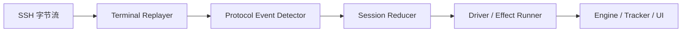

**总体方案**

这次重构不建议做“局部修补”，建议按“两条线并行收敛”的方式推进：

1. 重写会话执行状态机的实现形态，但保留状态机概念
2. 收拢引擎生命周期状态的所有权，删除外围重复控制

目标不是“让状态更多”，而是“让状态更少、更显式、更可验证”。

当前问题集中在这几处：

- 会话状态机过大，状态迁移和副作用耦合在一起。[session_machine.go](/D:/Document/Code/NetWeaverGo/internal/executor/session_machine.go#L25)
- 枚举状态与真实运行语义漂移，`StateSendCommand` 基本已经失真。[session_state.go](/D:/Document/Code/NetWeaverGo/internal/executor/session_state.go#L20)
- `StreamEngine` 同时承担 I/O、计时、状态驱动、错误交互、日志同步。[stream_engine.go](/D:/Document/Code/NetWeaverGo/internal/executor/stream_engine.go#L18)
- 引擎生命周期既由 `Engine` 自己推进，也被 UI 编排层手动推进。[engine_state.go](/D:/Document/Code/NetWeaverGo/internal/engine/engine_state.go#L40) [task_group_service.go](/D:/Document/Code/NetWeaverGo/internal/ui/task_group_service.go#L292) [execution_manager.go](/D:/Document/Code/NetWeaverGo/internal/ui/execution_manager.go#L513)
- 任务组状态持久化接口本身就有错误，传入的 `status` 没有落到模型字段上。[task_group.go](/D:/Document/Code/NetWeaverGo/internal/config/task_group.go#L102)

**重构原则**

- 单一状态所有者：每一层状态只能有一个写入者
- 显式事件驱动：状态迁移只能由事件触发，不能在 handler 里递归调用别的 handler
- 副作用外置：状态机只决定“下一步该做什么”，不直接做 I/O
- 可回归：每个事故日志都能变成稳定测试
- 先收敛模型，再修行为细节

**目标架构**

建议把执行链拆成 5 层。



各层职责如下：

- `Terminal Replayer`
  负责把 ANSI、回车覆盖、分页覆盖还原成规范化逻辑行。
  当前基础可保留，核心入口仍是 `terminal.Replayer`。

- `Protocol Event Detector`
  负责从“规范化行 + 活动行 + chunk 边界”中提取协议事件。
  例如：
  `PromptSeen`
  `PagerSeen`
  `LineCommitted`
  `ErrorMatched`
  `StreamEOF`

- `Session Reducer`
  纯函数式状态机。
  输入：当前状态 + 事件
  输出：新状态 + 动作列表

- `Driver / Effect Runner`
  负责执行动作。
  例如：
  发送命令
  发送空格
  发送预热空行
  挂起等待用户决策
  重置超时计时器
  写日志
  发业务事件

- `Engine / Tracker / UI`
  只消费设备级事件，不直接干预协议态迁移。

**会话状态机重构方案**

当前实现里真正的问题，不是状态数量，而是“状态 + flag + 条件分支”混在一起。

建议把会话层改成以下状态模型。

**新状态模型**

建议状态枚举只保留这些：

- `InitAwaitPrompt`
- `InitAwaitWarmupPrompt`
- `Ready`
- `Running`
- `AwaitPagerContinueAck`
- `AwaitFinalPromptConfirm`
- `Suspended`
- `Completed`
- `Failed`

说明：

- 删除 `StateSendCommand`
  发送命令不是状态，是动作。
- 删除 `StateHandlingPager`
  分页处理本质上是“发送续页动作后，等待输出继续到来”，更适合作为等待态。
- 删除 `StateHandlingError`
  错误不是普通运行流的一部分，它是挂起态。
- `afterPager` 不再作为独立 flag
  由 `AwaitPagerContinueAck` / `AwaitFinalPromptConfirm` 表达。
- `errorDecided` / `errorContinue` 不再保留
  用户选择通过事件进入 reducer。

**新上下文字段**

`SessionContext` 只保留真正的业务上下文：

- `queue`
- `nextIndex`
- `currentCmd`
- `pendingLines`
- `promptFingerprint`
- `lastChunkAt`
- `initResidualCleared`
- `results`

命令上下文里建议保留：

- `Index`
- `RawCommand`
- `Command`
- `StartedAt`
- `CompletedAt`
- `NormalizedLines`
- `PaginationCount`
- `PromptMatched`
- `ErrorMessage`
- `CustomTimeout`

建议删除或弱化：

- `PaginationPending`
  它应该由主状态表达，不该藏在命令上下文里。
- `EchoConsumed`
  如果后续没有明确使用价值，可以先保留但不参与控制流。

**新事件模型**

建议新增一个协议事件层，统一驱动 reducer：

- `EvChunkProcessed`
- `EvCommittedLine`
- `EvActivePromptSeen`
- `EvPagerSeen`
- `EvErrorMatched`
- `EvTimeout`
- `EvUserContinue`
- `EvUserAbort`
- `EvStreamClosed`
- `EvInitPromptStable`

实际实现上不一定要全做成单独 struct，但 reducer 入口必须统一成这种思路。

**新动作模型**

建议把动作定义成明确对象，而不是简单枚举：

- `ActSendWarmup`
- `ActSendCommand`
- `ActSendPagerContinue`
- `ActEmitCommandStart`
- `ActEmitCommandDone`
- `ActEmitDeviceError`
- `ActRequestSuspendDecision`
- `ActAbortSession`
- `ActResetReadTimeout`
- `ActFlushDetailLog`

这样 `StreamEngine` 不需要知道“为什么要发空格”，只负责执行动作。

**关键迁移规则**

以下规则建议写成显式不变量。

- `Ready` 下只要 `pendingLines` 非空，就绝不允许产生 `ActSendCommand`
- 一个命令在整个生命周期里只能完成一次
- `Completed` / `Failed` 之后不能再接受非终态事件
- 检测到分页后，下一步必须先产生 `ActSendPagerContinue`
- 分页续页后，必须重新回到 `Running` 或 `AwaitFinalPromptConfirm`，不能直接进入 `Ready`
- 挂起后只能由 `EvUserContinue` 或 `EvUserAbort` 离开 `Suspended`
- 初始化残留清理完成之前，不允许发送首条业务命令

**建议的文件拆分**

建议把当前 [session_machine.go](/D:/Document/Code/NetWeaverGo/internal/executor/session_machine.go#L25) 拆成这些文件：

- `internal/executor/session_types.go`
  放状态、事件、动作、上下文定义
- `internal/executor/session_reducer.go`
  纯状态迁移逻辑
- `internal/executor/session_detector.go`
  从 replayer 输出提取协议事件
- `internal/executor/session_driver.go`
  执行动作，协调 client / logger / eventbus
- `internal/executor/session_init.go`
  初始化流程
- `internal/executor/session_invariants_test.go`
  不变量测试
- `internal/executor/session_golden_test.go`
  用真实日志做回归测试

`stream_engine.go` 应该被收缩成“driver 容器”，不再直接写大量协议判断。

**引擎生命周期重构方案**

这一层比会话层简单，但现在有所有权混乱。

**目标**

- `EngineState` 只能由 `Engine` 自己写
- UI 编排层不再手动调用 `TransitionTo`
- “复合任务执行”不要再拿一个空 `Engine` 当协调器

**当前问题**

- `Engine` 内部自己会做 `Idle -> Starting -> Running -> Closing -> Closed`。[engine.go](/D:/Document/Code/NetWeaverGo/internal/engine/engine.go#L243)
- 复合任务模式下，UI 又在外部手动推一遍 `Starting -> Running`。[task_group_service.go](/D:/Document/Code/NetWeaverGo/internal/ui/task_group_service.go#L292)
- `managedExecution.finishLifecycle()` 结束时还会再补推 `Closing -> Closed`。[execution_manager.go](/D:/Document/Code/NetWeaverGo/internal/ui/execution_manager.go#L513)

这会导致：

- 状态转移责任分散
- 非法迁移难以定位
- 某些路径依赖“当前碰巧在某个状态”

**建议调整**

- `EngineStateManager` 保留，但只作为 `Engine` 私有实现
- `TransitionTo()` 不对 UI 层暴露
- `executionManager` 不再直接操控生命周期状态
- `BeginCompositeExecutionWithMeta()` 不再传 `engine.NewEngine(nil, nil, ...)` 作为 coordinator
- 新建一个轻量 `ExecutionSession` 或 `CompositeExecution`
  它只负责：
  `context`
  `tracker`
  `cancel`
  `frontend forwarders`
  不负责引擎状态迁移

**引擎层文件调整建议**

- 保留 [engine_state.go](/D:/Document/Code/NetWeaverGo/internal/engine/engine_state.go#L1)，但删除外部写接口暴露
- 在 [engine.go](/D:/Document/Code/NetWeaverGo/internal/engine/engine.go#L93) 删除或收窄 `Engine.TransitionTo()`
- 在 [execution_manager.go](/D:/Document/Code/NetWeaverGo/internal/ui/execution_manager.go#L358) 删除 `managedExecution.TransitionTo()`
- 在 [task_group_service.go](/D:/Document/Code/NetWeaverGo/internal/ui/task_group_service.go#L292) 去掉手动推进状态的代码

**任务组状态与执行历史重构方案**

任务组状态应当降级为“持久化摘要”，不是运行时调度依据。

**建议模型**

任务组数据库状态只保留：

- `pending`
- `running`
- `completed`
- `failed`

如果后续需要取消态，再加：

- `cancelled`

但不要把设备级、命令级、挂起级状态塞到任务组表。

执行期的细状态应全部来自：

- `ExecutionSnapshot`
- `ExecutionRecord`
- `ProgressTracker`

**必须先修的 bug**

[task_group.go](/D:/Document/Code/NetWeaverGo/internal/config/task_group.go#L102) 的 `UpdateTaskGroupStatus()` 现在没有执行 `group.Status = status`，这个要先修。

**建议边界**

- 任务组表记录“这次任务的最终摘要”
- 执行记录表记录“每次运行的事实”
- Tracker 负责运行中的投影状态
- UI 不从多个来源拼运行态

**测试重构方案**

这部分必须和代码重构同级推进，不然你会再次进入“修一个坏一个”。

**第一层：Reducer 单元测试**

目标是完全不依赖 SSH。

覆盖这些场景：

- 初始化 prompt 到 warmup
- warmup 后进入 ready
- ready 在无 pendingLines 时发命令
- ready 在有 pendingLines 时不发命令
- running 遇到分页
- running 遇到 prompt
- running 遇到错误
- suspended 收到 continue
- suspended 收到 abort
- completed/failed 忽略后续事件

**第二层：不变量测试**

建议单独写。

覆盖这些规则：

- `pendingLines > 0` 时不可发送业务命令
- 单命令最多一次完成
- 分页事件出现后，下一业务命令发送前必须先出现续页动作
- `Completed/Failed` 不可回退
- 初始化未完成前不可发送第一条命令

**第三层：Golden 回归测试**

把你现有事故日志直接转测试夹具。

优先做这些场景：

- 分页符被覆盖
- prompt 与分页跨 chunk
- 初始化欢迎语 + 旧 prompt 残留
- 错误命令后人工 continue
- 错误命令后人工 abort
- 超时后 continue
- 超时后 abort

你已经有相关文档和日志样本：

- [pagination-race-condition-analysis.md](/D:/Document/Code/NetWeaverGo/docs/pagination-race-condition-analysis.md)
- [pagination-race-fix-plan.md](/D:/Document/Code/NetWeaverGo/docs/pagination-race-fix-plan.md)

这些应该直接变成测试输入来源。

**第四层：集成测试**

建议做 fake SSH client，不用真实设备。

覆盖：

- chunk 分段随机化
- prompt / pager / error 混杂输入
- 取消时 channel 收尾
- 关闭时不丢终态事件

**第五层：并发与竞态测试**

必须纳入固定命令：

```powershell
go test -race ./internal/executor ./internal/engine ./internal/ui
```

当前你最需要防的是：

- 读协程与主事件循环的竞态
- event bus 关闭前后发送竞态
- suspend session 超时与用户响应竞态
- frontendBus / EventBus 收尾时序

**分阶段实施计划**

**Phase 0：止血与基线**

目标：先把“明显错误”和“状态双写”停掉，不动大结构。

- 修 `UpdateTaskGroupStatus()` 赋值 bug
- 在 `internal/executor` 补最基础不变量测试
- 把当前失败的测试恢复到和真实行为一致
- 给 `go test ./internal/executor` 设成提交前必跑
- 给关键日志打统一前缀，便于对照状态迁移

产出：

- 绿色基础测试
- 已知事故样本清单
- 当前状态图文档

**Phase 1：抽离纯状态迁移**

目标：把状态迁移从 I/O 中剥出来。

- 新建 `session_types.go`
- 新建 `session_reducer.go`
- 先不删除旧逻辑，只把 `handleReady`、`handleCollecting` 的判断迁到 reducer
- `SessionMachine.Feed()` 改成：
  收集 replayer 输出
  转协议事件
  调 reducer
  返回动作

产出：

- reducer 可单测
- 原 `session_machine.go` 大幅缩短

**Phase 2：拆分 detector 和 driver**

目标：把“看见了什么”和“要做什么”分开。

- 新建 `session_detector.go`
- 把 prompt / pager / error 的检测收敛在 detector
- `stream_engine.go` 只负责：
  读取数据
  调 detector / reducer
  执行动作
  驱动计时器

产出：

- detector 单测
- driver 单测
- 状态机不再直接调 client

**Phase 3：去掉隐式状态**

目标：删除 flag 驱动。

- 删除 `StateSendCommand`
- 删除 `afterPager`
- 删除 `errorDecided` / `errorContinue`
- 删除 `current.PaginationPending`
- 用显式状态替代它们

产出：

- 状态数减少
- 状态转移表可画出来
- 迁移点显著减少

**Phase 4：收拢引擎生命周期**

目标：只保留一个生命周期所有者。

- 删除 UI 对 `EngineState` 的外部推进
- 重构 `BeginCompositeExecutionWithMeta()`，不再依赖伪 coordinator engine
- `executionManager` 只管理 session，不管理引擎内部状态
- 明确“运行中态”来源只看 active session / tracker

产出：

- `Engine` 生命周期路径唯一
- 复合任务不再依赖空引擎壳

**Phase 5：统一运行态投影**

目标：前端只消费一种运行时事实来源。

- `ExecutionSnapshot` 作为唯一运行态来源
- `TaskGroup.Status` 只在启动前和结束后写入
- `GetEngineState()` 退化为简化只读信息，必要时后续可删除
- 前端 store 优先用 snapshot，不再从多个接口推断状态

产出：

- UI 状态来源收敛
- 排障时不用跨 3 套状态对比

**Phase 6：删除旧代码与文档补齐**

目标：彻底收尾。

- 删除旧 handler 分支
- 删除无用状态和注释
- 更新设计文档
- 为事故样本建立长期 regression suite

**建议的新目录结构**

建议最终 executor 目录演化成这样：

- `internal/executor/session_types.go`
- `internal/executor/session_reducer.go`
- `internal/executor/session_detector.go`
- `internal/executor/session_driver.go`
- `internal/executor/session_init.go`
- `internal/executor/session_result.go`
- `internal/executor/session_reducer_test.go`
- `internal/executor/session_invariants_test.go`
- `internal/executor/session_golden_test.go`

现有文件建议保留或缩小职责：

- [executor.go](/D:/Document/Code/NetWeaverGo/internal/executor/executor.go#L132)
  只保留设备执行器门面
- [stream_engine.go](/D:/Document/Code/NetWeaverGo/internal/executor/stream_engine.go#L18)
  改成 driver / runtime
- [initializer.go](/D:/Document/Code/NetWeaverGo/internal/executor/initializer.go#L15)
  保留，但输出改成更标准事件
- [command_context.go](/D:/Document/Code/NetWeaverGo/internal/executor/command_context.go#L8)
  收缩为纯数据对象

**第三方库建议**

当前阶段仍然不建议把第三方通用 FSM 库引入到会话层。

原因：

- 你最难的是协议事件提取，不是状态表定义
- 通用 FSM 库对 “chunk + prompt + pager + overwrite + timeout + user decision” 这种流式协议帮助有限
- 现在强行引入，只会把复杂度转移到 callback 和 guard 条件里

如果你非常想引入第三方库，我只建议用于“引擎生命周期层”，不建议用于“SSH 会话协议层”。

即便如此，也建议等 Phase 4 之后再决定。

**验收标准**

重构完成后，至少要满足这些标准：

- `internal/executor` 测试全绿
- 分页事故日志可稳定回归
- 新命令不会进入旧分页现场
- 初始化残留不会污染首条业务命令
- 引擎生命周期没有外部双写
- UI 运行态只依赖一套事实源
- `go test -race ./internal/executor ./internal/engine ./internal/ui` 通过

**投入预估**

按稳妥方式做，建议拆成 3 个迭代。

1. 第一个迭代  
   止血、测试基线、抽 reducer 框架

2. 第二个迭代  
   拆 detector / driver，迁完会话状态机

3. 第三个迭代  
   收拢 engine lifecycle，统一 UI 状态投影

如果你要继续推进，我建议下一步直接做两件事：

1. 先出一版“新会话状态图 + reducer 接口定义”
2. 然后我按这个方案给你落第一阶段代码骨架和测试框架
