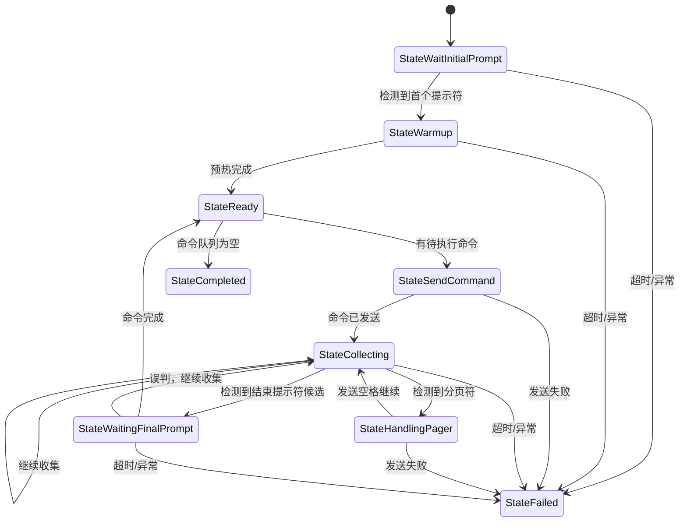

# 阶段二：统一会话状态机最终设计

## 1. 目标

把当前 `executor` 中基于 `streamBuffer` 和分支判断推进命令执行的方式，重构为一套统一的会话状态机与公共流处理内核。

本阶段只解决三件事：

1. 普通执行与同步执行共用一套输出处理主链路
2. 命令执行过程具有清晰状态
3. prompt / pager 判断建立在终端语义层输出上

---

## 2. 已确认的问题

当前代码中已确认的问题：

1. 分页命中后清空 `streamBuffer`，直接丢失上下文。
2. `ExecutePlaybook()` 与 `ExecuteCommandSync()` 有大量重复逻辑。
3. prompt / pager 判断建立在原始脏流上，而不是逻辑行上。
4. 现有执行器没有统一的命令边界模型，echo、正文、完成态并未被系统化建模。

需要修正一个表述：

- 当前代码中**并不存在**早期分析里那段显式 `waitingForEcho + HasPrefix` 逻辑。
- 真实问题不是“那段 echo 代码有 bug”，而是“命令边界和 echo 机制整体缺失或不成体系”。

---

## 3. 设计原则

1. 第一版状态机只保留最小闭环，不做 12~13 个细分状态。
2. 状态机由**单事件循环**推进，不依赖多 goroutine 共享状态。
3. 读 SSH 流只能有一个 reader goroutine。
4. `ExecutePlaybook()` 与 `ExecuteCommandSync()` 必须复用同一套流处理内核。
5. 本阶段允许直接替换旧执行逻辑，不维护长期双实现。

---

## 4. 状态定义

第一版状态集固定为：

```go
package executor

type SessionState int

const (
    StateWaitInitialPrompt SessionState = iota
    StateWarmup
    StateReady
    StateSendCommand
    StateCollecting
    StateHandlingPager
    StateWaitingFinalPrompt
    StateCompleted
    StateFailed
)
```

说明：

1. 不单独拆 `StateConnecting`，连接仍由 `Connect()` 负责。
2. 不单独拆 `StateWaitEcho`，第一版将 echo 归入 `StateCollecting` 内处理。
3. 不单独拆 `StateError` / `StateCancelled`，统一收敛为 `StateFailed`，后续再细化。

---

## 5. 状态流转



---

## 6. 核心模型

### 6.1 CommandContext

每条命令执行过程必须有独立上下文。

```go
package executor

import "time"

type CommandContext struct {
    Index           int
    Command         string
    RawCommand      string
    StartedAt       time.Time
    CompletedAt     time.Time
    RawBuffer       []byte
    NormalizedLines []string
    EchoConsumed    bool
    PaginationCount int
    PromptMatched   bool
    ErrorMessage    string
}
```

约束：

1. `RawBuffer` 只保留当前命令范围内的数据。
2. `NormalizedLines` 由 `terminal.Replayer` 产出。
3. `EchoConsumed` 第一版允许采用保守策略：
   - 如果首个逻辑行明显等于命令文本，则消费
   - 否则直接进入正文收集，不再卡在 echo 阶段

### 6.2 SessionMachine

```go
package executor

import "github.com/NetWeaverGo/core/internal/terminal"

type SessionMachine struct {
    state      SessionState
    replayer   *terminal.Replayer
    current    *CommandContext
    queue      []string
    nextIndex  int
    promptHint string
}

func NewSessionMachine(width int, commands []string) *SessionMachine
func (m *SessionMachine) State() SessionState
func (m *SessionMachine) Feed(chunk string) error
func (m *SessionMachine) ActiveLine() string
func (m *SessionMachine) CurrentCommand() *CommandContext
```

说明：

1. `SessionMachine` 不负责直接读 SSH，只负责消费读到的 `chunk`。
2. SSH 读取仍由 `executor` 中的 reader goroutine 完成。
3. `Feed()` 是单线程调用。

### 6.3 StreamEngine

为统一 `ExecutePlaybook()` 与 `ExecuteCommandSync()`，新增公共执行内核：

```go
package executor

type StreamEngine struct {
    machine *SessionMachine
    matcher *matcher.StreamMatcher
    client  *sshutil.SSHClient
}

func NewStreamEngine(client *sshutil.SSHClient, commands []string) *StreamEngine
func (e *StreamEngine) Run(ctx context.Context, mode RunMode) ([]CommandResult, error)
```

说明：

1. `mode=playbook` 时消费整队列
2. `mode=single` 时只消费一条命令并返回单结果

---

## 7. prompt / pager 判断规则

### 7.1 输入来源

prompt / pager 判断不再直接看原始 `streamBuffer`，只允许看：

1. 最新提交逻辑行
2. 当前活动行

即：

```text
SSH chunk -> terminal.Replayer -> logical lines / active line -> matcher
```

### 7.2 分页判断

分页判断规则：

1. 先看当前活动行是否命中 pager
2. 命中后进入 `StateHandlingPager`
3. 发送空格继续
4. 绝不清空当前命令上下文

### 7.3 prompt 判断

prompt 判断规则：

1. 只在 `StateWaitInitialPrompt`、`StateWarmup`、`StateCollecting`、`StateWaitingFinalPrompt` 中生效
2. 在 `StateCollecting` 中命中 prompt 只能视为“候选”，必须进入 `StateWaitingFinalPrompt` 二次确认

---

## 8. 对现有代码的落地方式

### 8.1 ExecutePlaybook

改造为：

1. 初始化 `StreamEngine`
2. 循环读取 chunk
3. 每个 chunk 调用 `engine.RunStep()` 或 `machine.Feed()`
4. 由状态机决定何时发命令、何时发空格、何时完成

### 8.2 ExecuteCommandSync

改造为：

1. 仍保留外部 API 不变
2. 内部复用同一套 `StreamEngine`
3. 返回当前命令的 `NormalizedText`

### 8.3 删除的旧逻辑

以下逻辑应在阶段二完成后删除：

1. 分页后 `streamBuffer = ""`
2. 通过原始 chunk 直接判断 prompt/pager
3. `ExecutePlaybook()` 和 `ExecuteCommandSync()` 中重复的 chunk 分割与推进逻辑

---

## 9. 实施步骤

1. 新建 `internal/executor/session_state.go`
2. 新建 `internal/executor/command_context.go`
3. 新建 `internal/executor/stream_engine.go`
4. 将 `ExecutePlaybook()` 改为走 `StreamEngine`
5. 将 `ExecuteCommandSync()` 改为走 `StreamEngine`
6. 删除旧的分页清空缓冲区逻辑

---

## 10. 测试要求

本阶段必须具备：

1. 状态转换单元测试
2. 分页场景集成测试
3. 单命令同步执行集成测试
4. 普通执行与同步执行输出一致性测试

最低验证项：

1. 进入首 prompt 后能稳定预热
2. 分页命中后自动发空格且不丢内容
3. 命令结束后能回到 `StateReady`
4. 同一原始样本在 playbook / sync 两条链路下产生一致 normalized 输出

---

## 11. 验收标准

满足以下条件即视为阶段完成：

1. `ExecutePlaybook()` 和 `ExecuteCommandSync()` 共享同一套流处理内核
2. 分页续页后无上下文丢失
3. prompt / pager 判断建立在终端语义层输出上
4. 当前命令边界清晰，可独立生成结果
5. 普通执行与同步执行的 normalized 输出一致
