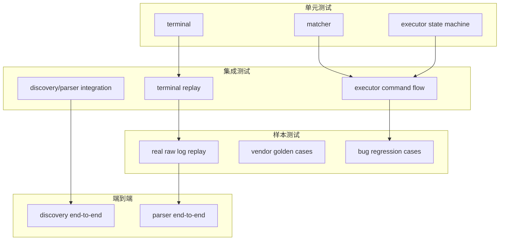

# 阶段六：长期回归与样本驱动测试体系最终设计

## 1. 目标

把“终端语义正确性”和“规范化输出正确性”纳入长期自动回归，防止后续迭代再次退化为字符串清洗模式。

本阶段只聚焦四条主链路：

1. `terminal`
2. `executor`
3. `discovery`
4. `parser`

`topology`、更大范围 E2E、复杂 CI 矩阵都不作为本阶段阻塞项。

---

## 2. 设计原则

1. 真实故障样本优先于覆盖率数字。
2. 每次修复回显问题都必须新增样本。
3. 单元测试、回放测试、集成测试分层清晰。
4. fuzz、benchmark 可以有，但不能压过真实样本回放测试。

---

## 3. 测试层次



---

## 4. 目录结构

建议测试数据结构收敛为：

```text
testdata/
  terminal/
    raw/
      huawei/
      h3c/
      cisco/
    expected/
      huawei/
      h3c/
      cisco/
  executor/
    sessions/
    transitions/
  discovery/
    full_sessions/
  parser/
    huawei/
    h3c/
    cisco/
  regression/
    bug_fixes/
```

不在本阶段强制引入大而全的目录层级。

---

## 5. 必须具备的测试

### 5.1 terminal 单元测试

覆盖：

1. `\r`
2. `\n`
3. `\b`
4. `ESC[nD`
5. `ESC[nC`
6. `ESC[K`
7. `ESC[2K`
8. 覆盖写分页样本

### 5.2 executor 状态机测试

覆盖：

1. 初始 prompt
2. 预热
3. 命令发送
4. 正文收集
5. 分页处理
6. 结束 prompt 确认
7. 超时失败

### 5.3 真实样本回放测试

必须使用真实 `raw.log` 或从真实日志提取的片段，验证：

1. `PHY: Physical` 不截断
2. 表头不破坏
3. prompt 不拼接
4. 分页续页不丢数据

### 5.4 discovery / parser 集成测试

验证：

1. discovery 落盘 `file_path` 为 normalized output
2. `raw_file_path` 存在
3. parser 能正确读取 `file_path`
4. TextFSM 解析稳定通过

---

## 6. Golden 样本策略

厂商样本至少包含：

### Huawei

1. `display interface brief`
2. `display ip interface brief`
3. `display lldp neighbor verbose`

### H3C

1. `display interface brief`
2. `display lldp neighbor-information verbose`

### Cisco

1. `show interface status`
2. `show lldp neighbors detail`

每个样本必须同时包含：

1. 原始输入
2. 期望 normalized 输出

---

## 7. Bug 样本策略

每个 bug 必须固化为回归目录中的一个 case。

例如：

```text
testdata/regression/bug_fixes/
  issue_001_pagination_truncation/
  issue_002_prompt_misalignment/
  issue_003_overwrite_corruption/
```

每个 case 最少包含：

1. 输入原始样本
2. 期望 normalized 输出
3. 一段简短说明

---

## 8. CI 要求

本阶段 CI 只要求保证以下测试稳定执行：

1. `internal/terminal/...`
2. `internal/executor/...`
3. `internal/discovery/...`
4. `internal/parser/...`

不要求一开始就做复杂矩阵化流水线。  
后续样本量扩大后，再考虑拆分 job。

---

## 9. 可选增强项

以下内容可做，但不作为本阶段完成条件：

1. fuzz 测试
2. benchmark
3. 更大规模 CI 矩阵
4. topology 端到端回归

这些增强项的优先级低于真实故障样本回放。

---

## 10. 实施步骤

1. 建立 `terminal` 单元测试
2. 建立 executor 状态机测试
3. 收集并整理真实故障样本
4. 建立多厂商 golden tests
5. 建立 discovery / parser 集成测试
6. 将核心测试接入 CI

---

## 11. 验收标准

满足以下条件即视为阶段完成：

1. 真实故障样本进入自动回归
2. terminal / executor / discovery / parser 四条主链路都有自动测试
3. 分页截断、提示符错位、覆盖写错乱都已有对应回归 case
4. parser 能稳定解析 normalized output
5. 后续改动能自动发现回归
