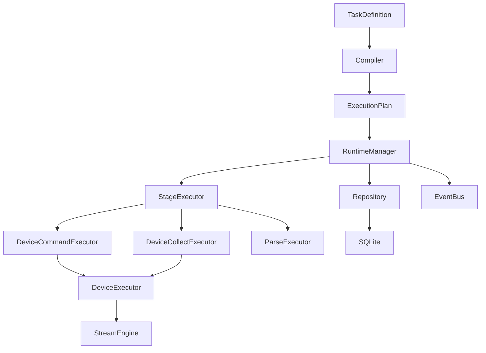
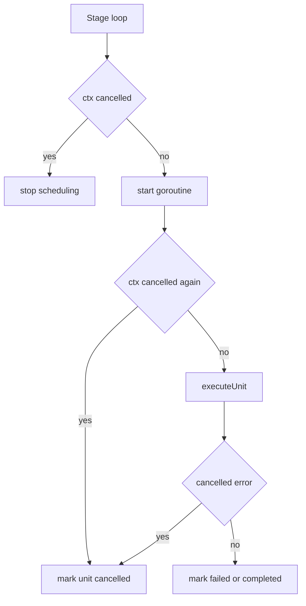

# NetWeaverGo 问题 #5 与 #8 详细修复方案

**文档日期**: 2026-03-26  
**适用基线**: 当前仓库代码基线  
**适用范围**: `TaskExec` 执行引擎、运行时状态流、持久化写入、取消传播链路

---

## 一、文档目的

本文档聚焦当前仍未完全收口的两个真实问题：

- **问题 #5**: 取消操作未完整传播到执行层
- **问题 #8**: 错误处理不一致，关键状态与辅助持久化存在静默吞错

目标不是针对个别函数打补丁，而是从整体执行架构出发，为后续实现提供统一、可执行、可验证的修复蓝图。

---

## 二、整体架构定位

当前任务执行主链路如下：

问题 #5 与 #8 都不是局部问题，而是贯穿这条链路的系统问题：

- **#5** 影响的是运行时取消语义是否能从 `RuntimeManager` 一直传播到 `StageExecutor`、`DeviceExecutor`、`ParseExecutor`
- **#8** 影响的是运行时状态、解析结果、产物索引、辅助记录是否能以一致策略落库并暴露错误

因此修复必须覆盖：

1. `RuntimeManager`
2. `executor_impl.go` 中的三个主要执行器
3. Repository / GORM 持久化写入点
4. 任务完成态、取消态、失败态聚合逻辑

---

## 三、问题 #5 详细修复方案

### 3.1 当前问题本质

当前系统已经有 `context` 传递，但取消语义没有形成统一的收敛协议。

现状表现为：

1. Stage 层只在启动 goroutine 前检查一次取消
2. 已经启动的 goroutine 没有统一的二次取消检查
3. `ParseExecutor` 内部未系统化处理中途取消
4. `cancelled`、`failed`、`completed` 的状态落库口径不一致
5. `run/stage/unit` 的终态可能出现语义错位

这会造成：

- 用户点击取消后，后台任务仍继续运行一段时间
- UI 显示已取消，但 unit 仍显示失败或成功
- Stage 汇总统计不能准确反映取消数量
- 拓扑任务在中途取消时，后续阶段仍可能被不恰当地推进或自然收尾

---

### 3.2 修复目标

为整个任务引擎建立统一的**取消收敛语义**：

1. **运行中任务可被可靠中止**
2. **已启动单元在合理边界尽快结束**
3. **未启动单元不再继续启动**
4. **所有取消路径都落成 `cancelled`，而不是混入 `failed`**
5. **run/stage/unit 聚合结果与事件流保持一致**

---

### 3.3 修复原则

#### 原则 1：取消不是异常失败

取消属于用户意图驱动的终止语义，必须和失败分开建模：

- 用户取消 -> `cancelled`
- 运行错误 -> `failed`
- 非取消但部分成功 -> `partial`

#### 原则 2：取消必须层层短路

取消检查不能只放在最外层，必须在以下边界统一设置：

- Stage 调度前
- goroutine 启动后
- 设备连接前
- 命令执行前后
- 解析执行前后
- 文件读取与事务写库前

#### 原则 3：取消优先于后续状态结算

如果上下文已经取消，则后续不再按普通失败/成功路径结算，而优先走取消分支。

---

### 3.4 具体改造方案

#### 方案 A：统一引入取消判定辅助函数

依托已有 [`ErrorHandler`](../internal/taskexec/error_handler.go) 与 [`IsContextCancelled`](../internal/taskexec/error_handler.go:80)，在执行器内统一使用：

- 执行前判定是否取消
- 执行出错后优先识别是否为取消导致
- 结束时统一写入取消状态

建议新增或统一使用如下 helper 语义：

- `checkCancelledBeforeStart`
- `finishUnitCancelled`
- `finishUnitFailed`
- `finishUnitCompleted`

这些 helper 不必全部独立暴露，但必须把取消路径从普通错误路径中剥离出来。

---

#### 方案 B：改造 [`DeviceCommandExecutor.Run`](../internal/taskexec/executor_impl.go)

当前问题：

- 只在 for 循环开头检查取消
- goroutine 内没有取消优先逻辑
- 汇总计数只有 success/failed，没有 cancelled

建议改造为：

1. 增加 `cancelledCount`
2. goroutine 启动后第一时间检查 `ctx.IsCancelled()`
3. 如果已取消，直接标记当前 unit 为 `cancelled`
4. `executeUnit` 返回错误时，先用 `IsContextCancelled` 判断是否属于取消
5. Stage 进度汇总中加入 `CancelledUnits`

建议结构：

---

#### 方案 C：改造 [`DeviceCollectExecutor.Run`](../internal/taskexec/executor_impl.go)

拓扑采集阶段是取消传播的关键路径，因为：

- 它会创建 `TaskRunDevice`
- 它会写原始输出与规范化输出
- 它会更新运行设备状态

建议：

1. 采集 goroutine 启动后立即二次检查取消
2. 若取消，则：
   - 当前 unit 标记为 `cancelled`
   - `TaskRunDevice.status` 标记为 `cancelled`
   - 不再写入后续 raw output / artifact
3. 在 `exec.Connect`、`exec.ExecutePlan` 返回后，先判定是否由于取消导致
4. 采集统计中加入 cancelled 计数

---

#### 方案 D：改造 [`ParseExecutor.Run`](../internal/taskexec/executor_impl.go)

Parse 是当前取消语义最薄弱的阶段之一。

建议在 [`executeParse`](../internal/taskexec/executor_impl.go:683) 中增加以下检查点：

1. Unit 启动前
2. 解析前
3. 调用 `parseAndSaveRunDevice` 前
4. 遍历原始输出时
5. 数据库事务前
6. 事务完成后状态更新前

取消后应：

- 当前 unit 写为 `cancelled`
- parse 状态不再按 `parse_failed` 处理
- Stage 汇总时将取消单元计入 `CancelledUnits`

---

#### 方案 E：调整 [`RuntimeManager.handleCancellation`](../internal/taskexec/runtime.go:582)

当前 `run` 级取消已经存在，但还不够完整。

建议增强：

1. `Run` 标记为 `cancelled`
2. 对未结束的 `Stage` 扫描并统一修正为：
   - 全部未开始 -> `cancelled`
   - 部分运行中 -> `partial` 或 `cancelled`，依据 unit 最终聚合规则决定
3. 对未结束 `Unit` 扫描并标记为 `cancelled`
4. 发射明确取消事件，而不只复用 finish 事件

若当前不增加新事件类型，至少要在 message 语义上清晰区分“完成”和“取消结束”。

---

### 3.5 推荐修改文件

- [`internal/taskexec/executor_impl.go`](../internal/taskexec/executor_impl.go)
- [`internal/taskexec/runtime.go`](../internal/taskexec/runtime.go)
- [`internal/taskexec/error_handler.go`](../internal/taskexec/error_handler.go)
- [`internal/taskexec/models.go`](../internal/taskexec/models.go)
- [`internal/taskexec/status.go`](../internal/taskexec/status.go)

---

### 3.6 验证用例

#### 用例 1：普通任务取消

- 启动多个设备命令执行
- 在部分设备正在执行时触发取消
- 期望：
  - 后续未启动设备不再启动
  - 已启动设备尽快结束
  - `TaskRun.status = cancelled`
  - 部分 `TaskRunUnit.status = cancelled`

#### 用例 2：拓扑采集阶段取消

- 在 `collect` 执行中取消
- 期望：
  - `TaskRunDevice.status` 存在 cancelled 结果
  - 取消后不继续写入后续 parse / topology 阶段产物

#### 用例 3：解析阶段取消

- 在 parse 读取 raw output 时取消
- 期望：
  - 当前解析单元终态为 cancelled
  - 不写入半成品解析状态为 failed

#### 用例 4：取消后聚合状态一致性

- 校验 `run`、`stage`、`unit` 三层状态与计数一致
- 校验 `CancelledUnits` 与前端快照一致

---

## 四、问题 #8 详细修复方案

### 4.1 当前问题本质

当前执行链路中存在大量 `_ = err` 静默吞错，问题不是单点代码风格，而是**运行态真相源失真**。

典型风险包括：

1. `UpdateUnit` 失败但任务继续执行，导致 UI 状态不真实
2. `TaskRawOutput` 写入失败但后续 parse 仍继续，导致链路断裂
3. `TaskArtifact` 写入失败但无日志，历史查询失真
4. `TaskRunDevice` 更新失败但用户无感知，拓扑结果溯源困难
5. 非关键错误与关键错误没有分级处理策略

---

### 4.2 修复目标

建立统一的**分级错误处理框架**：

1. 关键状态更新失败必须被感知
2. 关键数据写入失败必须影响执行结果
3. 非关键索引失败允许降级，但必须记录日志
4. 所有数据库/状态写入必须具备统一语义，而不是分散手写

---

### 4.3 错误分级模型

建议将错误分为四类：

| 级别 | 类型         | 示例                                             | 处理策略                         |
| ---- | ------------ | ------------------------------------------------ | -------------------------------- |
| L1   | 运行关键状态 | `UpdateRun` `UpdateStage` `UpdateUnit`           | 必须记录并向上返回，不能静默吞掉 |
| L2   | 关键业务数据 | `TaskRawOutput` `TaskParsed*` `TaskTopologyEdge` | 失败即中断当前单元或阶段         |
| L3   | 辅助索引数据 | `TaskArtifact` `TaskRunDevice` 辅助字段          | 允许降级，但必须日志化           |
| L4   | 可观测性数据 | 附加 message payload 元信息                      | 可降级，但需要可追踪             |

---

### 4.4 当前基础设施现状

目前已新增 [`ErrorHandler`](../internal/taskexec/error_handler.go)，这是后续治理的基础。

已有能力包括：

- [`UpdateUnitRequired`](../internal/taskexec/error_handler.go:40)
- [`UpdateStageBestEffort`](../internal/taskexec/error_handler.go:49)
- [`UpdateRunBestEffort`](../internal/taskexec/error_handler.go:56)
- [`DBBestEffort`](../internal/taskexec/error_handler.go:63)
- [`ArtifactBestEffort`](../internal/taskexec/error_handler.go:70)

下一步不是重新设计，而是把这些能力系统性接入执行链路。

---

### 4.5 具体改造方案

#### 方案 A：统一改造 `run/stage/unit` 状态更新

当前大量位置直接调用：

- `ctx.UpdateUnit`
- `ctx.UpdateStage`
- `ctx.UpdateRun`

建议替换策略：

1. **关键状态切换** 使用 `Required` 语义
   - 例如 unit 从 `pending -> running`
   - unit 从 `running -> failed/cancelled/completed`
   - stage 终态聚合
   - run 终态写入

2. **中间进度更新** 使用 `BestEffort` 语义
   - 例如阶段进度百分比
   - 中途完成计数更新

这样可以保证：

- 核心终态不能静默失败
- 高频进度更新不会因偶发失败直接打断业务主流程

---

#### 方案 B：统一改造 `TaskRunDevice` 写入策略

当前 [`ensureRunDevice`](../internal/taskexec/executor_impl.go:818) 与 [`updateRunDeviceStatus`](../internal/taskexec/executor_impl.go:840) 仍然直接忽略错误。

建议：

1. `ensureRunDevice` 属于 L3/L2 之间
   - 若设备记录是拓扑任务后续解析和展示的重要依赖，则失败应上浮为当前 unit 失败
   - 若只是展示增强信息，则允许降级但必须记录错误

2. `updateRunDeviceStatus` 至少应统一记录错误日志

推荐口径：

- `ensureRunDevice` 失败 -> 当前 `collect unit` 失败
- `updateRunDeviceStatus` 失败 -> 记录日志，不中断已完成业务

---

#### 方案 C：统一改造 `TaskRawOutput` 与解析状态写入

这一段是当前最关键的数据链路之一。

包括：

- [`createTaskRawOutput`](../internal/taskexec/executor_impl.go:855)
- parse 过程中的 `parse_status` 更新
- `TaskParsed*` 事务落库

建议：

1. `TaskRawOutput` 创建失败应直接视为当前采集单元失败
   - 因为后续 parse 依赖这个真相源
2. `parse_status` 更新属于关键辅助状态
   - 不能再静默吞掉
   - 至少必须日志化并附带 `runID/deviceIP/outputID`
3. `TaskParsed*` 事务保持原有“失败即返回错误”的强约束

---

#### 方案 D：统一改造 `TaskArtifact` 写入

当前三个 [`createArtifact`](../internal/taskexec/executor_impl.go:1301) 都是静默吞错。

建议：

1. 所有 artifact 创建统一走 `ArtifactBestEffort`
2. artifact 失败默认按 L3 处理
   - 不阻断主业务
   - 必须记录日志
3. 若某些 artifact 被前端或后续逻辑作为强依赖，则单独升级为 L2

当前建议先按 L3 实施。

---

#### 方案 E：统一改造 Parse 阶段细粒度错误处理

[`parseAndSaveRunDevice`](../internal/taskexec/executor_impl.go:883) 当前存在多个“继续处理但静默吞错”的点。

建议：

1. 对单条输出 `parse_status` 更新失败进行显式日志化
2. 引入上下文信息：
   - `runID`
   - `deviceIP`
   - `output.ID`
   - `commandKey`
3. 若关键输出读取失败达到一定阈值，可考虑把当前 parse unit 定义为失败，而不是继续完成

推荐实现口径：

- 单个命令解析失败 -> parse unit 可继续，最终可能 `partial`
- 关键基础输出全失败 -> parse unit 应 `failed`

这要求后续在 parse unit 聚合时引入更细粒度统计，而不只是“有错就 failed”。

---

### 4.6 推荐修改文件

- [`internal/taskexec/executor_impl.go`](../internal/taskexec/executor_impl.go)
- [`internal/taskexec/error_handler.go`](../internal/taskexec/error_handler.go)
- [`internal/taskexec/runtime.go`](../internal/taskexec/runtime.go)
- [`internal/taskexec/persistence.go`](../internal/taskexec/persistence.go)

---

### 4.7 验证用例

#### 用例 1：Unit 状态写入失败

- 模拟 `UpdateUnit` 返回错误
- 期望：
  - 错误被日志捕获
  - 关键状态更新失败可终止当前执行路径

#### 用例 2：Artifact 写入失败

- 模拟 `CreateArtifact` 失败
- 期望：
  - 主流程仍继续
  - 日志包含 `runID/stageID/unitID/artifactType`

#### 用例 3：TaskRawOutput 创建失败

- 模拟 `createTaskRawOutput` 失败
- 期望：
  - 当前 collect unit 失败
  - 后续 parse 不再误判为可继续

#### 用例 4：parse_status 更新失败

- 模拟 parse 状态更新异常
- 期望：
  - 错误不再被静默吞掉
  - 有明确日志与上下文

---

## 五、建议实施顺序

### 第一阶段：先收口问题 #8

原因：

- 如果错误处理框架不先统一，后续改取消传播时仍会继续产生大量隐性状态错乱
- 先把 `Required / BestEffort` 语义落稳，再改取消路径更安全

执行顺序：

1. 替换 `ctx.UpdateUnit/Stage/Run` 的关键写入
2. 改造 `TaskRunDevice` 写入
3. 改造 `TaskRawOutput` 与 `TaskArtifact` 写入
4. 补日志与测试

### 第二阶段：再收口问题 #5

执行顺序：

1. 给三个执行器补齐取消短路
2. 给 unit 终态增加 cancelled 路径
3. 调整 stage 聚合逻辑
4. 调整 run 取消后的最终状态对齐
5. 做普通任务与拓扑任务的取消测试

---

## 六、最终交付标准

当以下条件同时满足时，可认为 #5 与 #8 修复完成：

### #5 完成标准

- 用户取消后不再继续调度新 unit
- 已启动 unit 能在合理边界内收敛
- `run/stage/unit` 的取消状态一致
- UI 与数据库状态一致
- 拓扑任务取消后不会继续写入不应生成的后续结果

### #8 完成标准

- 关键状态更新不再静默吞错
- 关键业务写入失败可影响当前执行结果
- 非关键写入失败全部有日志
- 所有 `_ = err` 都经过明确分级处理，而不是随意忽略

---

## 七、结论

问题 #5 与 #8 的本质并不是两个孤立 bug，而是 `TaskExec` 运行时在**取消语义一致性**和**错误处理一致性**两个方面尚未完全形成架构闭环。

后续实现必须按以下顺序推进：

1. 先统一错误处理语义
2. 再统一取消传播语义
3. 最后补测试验证 `run/stage/unit/event/artifact` 全链路一致性

只有按这一路线整体治理，才能确保 `TaskExec` 从运行时调度、设备执行、解析入库到前端展示都维持同一套稳定、可诊断、可回收的执行模型。

---

**输出人**: Architect Mode  
**日期**: 2026-03-26
