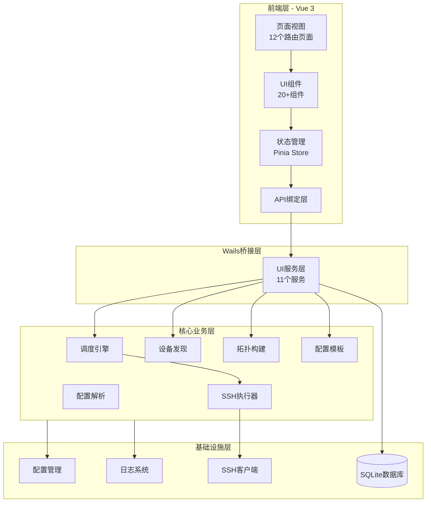
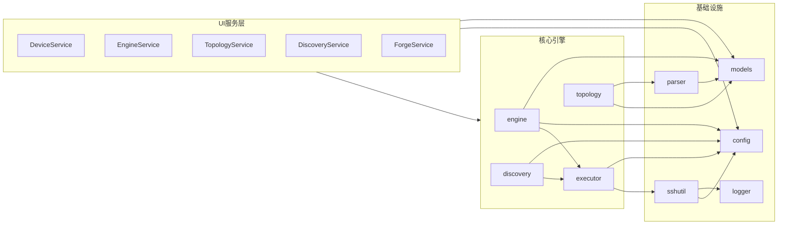

# NetWeaverGo 项目分析报告

> **报告版本**: v1.0  
> **分析日期**: 2026-03-20  
> **分析范围**: 架构设计、代码质量、安全漏洞、性能优化、历史兼容性

---

## 1. 执行摘要

### 1.1 项目概况

NetWeaverGo 是一个基于 Wails v3 构建的网络自动化巡检与配置管理桌面应用。项目采用前后端分离架构，后端使用 Go 语言实现核心业务逻辑，前端使用 Vue 3 + TypeScript 构建现代化用户界面。

### 1.2 关键发现

| 类别         | 发现数量 | 严重程度分布  |
| ------------ | -------- | ------------- |
| 架构问题     | 3        | 中等          |
| 安全风险     | 4        | 高(2) / 中(2) |
| 代码冗余     | 5        | 低            |
| 性能优化点   | 6        | 中(3) / 低(3) |
| 历史兼容代码 | 1组      | 待清理        |

---

## 2. 架构分析

### 2.1 整体架构评估



### 2.2 后端模块依赖关系



### 2.3 架构优势

| 优势           | 说明                                      |
| -------------- | ----------------------------------------- |
| 清晰的分层设计 | UI层、业务层、基础设施层职责明确          |
| 服务化架构     | 11个独立UI服务，便于维护和扩展            |
| 依赖注入模式   | Discovery/Topology 使用 Provider 接口解耦 |
| 统一配置管理   | PathManager 单例 + RuntimeConfig 集中管理 |

### 2.4 架构问题

#### 问题 A1: UI服务层与Config层耦合过紧

**现状**: UI服务层直接调用 `config` 包的函数，如 [`DeviceService.ListDevices()`](internal/ui/device_service.go:29) 直接调用 `config.LoadDeviceAssets()`。

**影响**:

- Config 包职责过重，既管理配置又处理业务逻辑
- 难以进行单元测试和模拟

**建议**: 引入 Repository 层，将数据访问逻辑从 Config 中剥离。

#### 问题 A2: Engine 状态管理复杂

**现状**: [`Engine`](internal/engine/engine.go:56) 结构体包含多个状态管理字段：

- `stateManager` - 状态机
- `ctx/cancel` - Context 控制
- `emitWg` - WaitGroup
- `fallback` - RingBuffer
- `closeOnce` - sync.Once

**影响**: 状态转换逻辑分散，维护成本高

**建议**: 考虑进一步封装状态管理，统一生命周期钩子。

#### 问题 A3: 前端路由未实现懒加载

**现状**: [`router/index.ts`](frontend/src/router/index.ts:1-80) 中所有页面组件都是静态导入。

```typescript
// 当前实现
import Dashboard from "../views/Dashboard.vue";
import Devices from "../views/Devices.vue";
// ... 所有页面静态导入
```

**影响**: 首屏加载时间增加，打包体积较大

**建议**: 改为动态导入实现路由懒加载：

```typescript
const Dashboard = () => import("../views/Dashboard.vue");
```

---

## 3. 代码冗余分析

### 3.1 重复代码检测

#### 冗余 R1: 密码处理逻辑重复

**位置**:

- [`internal/config/config.go:267-275`](internal/config/config.go:267) - 单设备更新
- [`internal/config/config.go:391-398`](internal/config/config.go:391) - 批量更新

**重复内容**: 密码保护逻辑（空密码保留原密码）

```go
// 单设备更新
if device.Password != "" {
    if device.Password != existing.Password {
        passwordUpdated = true
    }
    existing.Password = device.Password
}

// 批量更新 - 相同逻辑
if devices[i].Password == "" {
    devices[i].Password = old.Password
} else if devices[i].Password != old.Password {
    passwordUpdated = true
}
```

**建议**: 提取公共函数 `mergePassword(old, new string) (string, bool)`

#### 冗余 R2: Discovery Runner 重复的数据结构

**位置**: [`internal/discovery/runner.go:599-646`](internal/discovery/runner.go:599) 和 [`internal/discovery/runner.go:662-683`](internal/discovery/runner.go:662)

**重复内容**: 两个匿名结构体定义相同字段：

```go
// 第一处
struct {
    IP       string
    Username string
    Password string
    Vendor   string
}

// 第二处 - 完全相同
struct {
    IP       string
    Username string
    Password string
    Vendor   string
}
```

**建议**: 定义具名结构体或复用 [`models.DiscoveryDevice`](internal/models/discovery.go:160)

#### 冗余 R3: SSH 认证逻辑重复

**位置**: [`internal/sshutil/client.go:494-500`](internal/sshutil/client.go:494) 和 [`internal/sshutil/client.go:756-762`](internal/sshutil/client.go:756)

**重复内容**: SSH 认证方法配置完全相同：

```go
Auth: []ssh.AuthMethod{
    ssh.Password(cfg.Password),
    ssh.KeyboardInteractive(func(user, instruction string, questions []string, echos []bool) (answers []string, err error) {
        answers = make([]string, len(questions))
        for i, q := range questions {
            if strings.Contains(strings.ToLower(q), "password") {
                answers[i] = cfg.Password
            }
        }
        return answers, nil
    }),
}
```

**建议**: 提取为 `getAuthMethods(password string) []ssh.AuthMethod` 函数

#### 冗余 R4: 日志调试信息泄露密码

**位置**: [`internal/ui/device_service.go:39-41`](internal/ui/device_service.go:39)

```go
logger.Debug("DeviceService", "-", "GetDeviceByID: ID=%d, Password='%s'", id, device.Password)
resp := device.ToResponse()
logger.Debug("DeviceService", "-", "GetDeviceByID Response: Password='%s'", resp.Password)
```

**风险**: Debug 模式下密码明文输出到日志

**建议**: 移除密码日志输出或使用脱敏处理

#### 冗余 R5: 前端 API 类型定义重复

**位置**: [`frontend/src/services/api.ts`](frontend/src/services/api.ts) 与自动生成的 bindings

**现状**: 手动定义的 API 类型与 Wails 自动生成的 bindings 可能存在不一致

**建议**: 完全依赖自动生成的 bindings，移除手动类型定义

---

## 4. 安全漏洞分析

### 4.1 高风险问题

#### 安全 S1: 密码明文存储 [高风险]

**现状**: 根据 [`docs/crypto_removal_plan.md`](docs/crypto_removal_plan.md)，项目计划移除加密功能，密码将以明文存储在 SQLite 数据库中。

**风险等级**: 🔴 高

**影响范围**:

- [`internal/models/models.go:17`](internal/models/models.go:17) - DeviceAsset.Password 字段
- [`internal/models/discovery.go:161`](internal/models/discovery.go:161) - DiscoveryDevice.Password 字段

**风险评估**:

- 本地数据库文件被复制后可直接读取密码
- 备份文件中包含明文密码
- 日志文件可能意外记录密码

**缓解措施建议**:

1. 操作系统级别文件权限控制
2. 敏感字段日志脱敏
3. 考虑使用操作系统密钥库（Windows DPAPI / macOS Keychain）
4. 数据库文件加密（SQLCipher）

#### 安全 S2: SSH 主机密钥校验策略宽松 [高风险]

**现状**: [`internal/sshutil/client.go:72-75`](internal/sshutil/client.go:72) 支持 `insecure` 模式：

```go
const (
    hostKeyPolicyStrict    = "strict"
    hostKeyPolicyAcceptNew = "accept_new"
    hostKeyPolicyInsecure  = "insecure"  // 不安全模式
)
```

**风险等级**: 🔴 高

**影响**: `insecure` 模式下不验证主机身份，易受中间人攻击

**建议**:

- 添加明显警告
- 默认使用 `strict` 模式
- 添加安全审计日志

### 4.2 中等风险问题

#### 安全 S3: 日志敏感信息泄露 [中风险]

**现状**: [`internal/engine/engine.go:26-43`](internal/engine/engine.go:26) 定义了敏感信息脱敏正则，但仅处理配置输出，未覆盖所有场景。

**风险等级**: 🟡 中

**遗漏场景**:

- [`internal/ui/device_service.go:39`](internal/ui/device_service.go:39) - Debug 日志输出密码
- 错误消息中可能包含连接字符串

**建议**: 扩展脱敏规则，覆盖所有日志输出点

#### 安全 S4: 前端密码暴露 [中风险]

**现状**: [`internal/models/models.go:31-42`](internal/models/models.go:31) 定义了 `DeviceAssetResponse` 结构，专门用于返回密码给前端：

```go
type DeviceAssetResponse struct {
    DeviceAsset
    Password string `json:"password,omitempty"` // 密码返回给前端
}
```

**风险等级**: 🟡 中

**影响**:

- 密码传输到前端，可被浏览器开发者工具查看
- 前端 XSS 漏洞可能导致密码泄露

**建议**:

- 仅在编辑场景返回密码
- 考虑使用一次性令牌替代密码传输

### 4.3 安全检查清单

| 检查项       | 状态      | 说明                                |
| ------------ | --------- | ----------------------------------- |
| SQL 注入防护 | ✅ 安全   | 使用 GORM 参数化查询                |
| 命令注入防护 | ✅ 安全   | SSH 命令通过会话发送，非 shell 拼接 |
| 路径遍历防护 | ⚠️ 待验证 | 需检查文件操作路径校验              |
| XSS 防护     | ✅ 安全   | Vue 3 自动转义                      |
| CSRF 防护    | ✅ 安全   | Wails 本地应用无 CSRF 风险          |
| 输入验证     | ⚠️ 部分   | IP 格式验证需加强                   |

---

## 5. 性能优化分析

### 5.1 后端性能优化

#### 优化 P1: 数据库连接池配置

**现状**: [`internal/config/db.go:49-53`](internal/config/db.go:49)

```go
sqlDB.SetMaxOpenConns(10)
sqlDB.SetMaxIdleConns(5)
sqlDB.SetConnMaxLifetime(time.Hour)
sqlDB.SetConnMaxIdleTime(10 * time.Minute)
```

**分析**: SQLite 是单文件数据库，10 个连接对于桌面应用足够。但并发执行时可能成为瓶颈。

**建议**: 监控连接等待时间，必要时调整。

#### 优化 P2: 事件总线缓冲区大小

**现状**: [`internal/config/constants.go:47-50`](internal/config/constants.go:47)

```go
EventBufferSize = 1000
FallbackEventCapacity = 500
```

**分析**: 32 个并发设备，每个设备可能快速产生事件，1000 容量合理。

**建议**: 添加背压机制，防止内存溢出。

#### 优化 P3: 并发数硬编码

**现状**: [`internal/config/constants.go:41`](internal/config/constants.go:41)

```go
DefaultWorkerCount = 10
```

但 [`internal/engine/engine.go`](internal/engine/engine.go) 实际使用 `MaxWorkers=32` 硬编码。

**建议**: 统一使用配置常量，支持用户自定义。

### 5.2 前端性能优化

#### 优化 P4: 路由懒加载

**现状**: 所有路由组件静态导入

**建议**: 改为动态导入

```typescript
const routes = [
  {
    path: "/",
    name: "Dashboard",
    component: () => import("../views/Dashboard.vue"),
  },
  // ...
];
```

#### 优化 P5: 大列表虚拟滚动

**现状**: [`frontend/src/components/device/DeviceTable.vue`](frontend/src/components/device/DeviceTable.vue) 可能处理大量设备数据

**建议**: 对于超过 100 行的表格，使用虚拟滚动组件

#### 优化 P6: 状态订阅优化

**现状**: [`frontend/src/stores/engineStore.ts`](frontend/src/stores/engineStore.ts) 使用 computed 属性

**分析**: 当前实现合理，但需注意避免在 computed 中执行重计算

**建议**: 使用 `computed` + `shallowRef` 优化深层对象响应

---

## 6. 历史兼容性代码检查

### 6.1 已识别的兼容性代码

根据 [`docs/crypto_removal_plan.md`](docs/crypto_removal_plan.md)，以下代码需要清理：

| 文件                            | 待清理内容                           | 状态      |
| ------------------------------- | ------------------------------------ | --------- |
| `internal/config/crypto.go`     | 整个加密模块                         | 🗑️ 待删除 |
| `internal/config/db.go`         | `registerCredentialCallbacks()` 函数 | 🗑️ 待删除 |
| `internal/config/db.go`         | `devicePasswordContext` 结构体       | 🗑️ 待删除 |
| `internal/ui/device_service.go` | 密码脱敏处理逻辑                     | ✏️ 待简化 |
| `internal/ui/query_service.go`  | 密码脱敏处理逻辑                     | ✏️ 待简化 |

### 6.2 其他历史代码检查

| 检查项       | 结果                                  |
| ------------ | ------------------------------------- |
| 数据迁移逻辑 | ❌ 未发现                             |
| 废弃字段     | ❌ 未发现（仅发现 IPv6 废弃类型注释） |
| 版本兼容代码 | ❌ 未发现                             |
| 条件编译代码 | ❌ 未发现                             |

### 6.3 清理建议

项目明确声明为新建项目，无需兼容历史数据。建议按以下顺序执行清理：

1. **删除加密模块** - 直接删除 `internal/config/crypto.go`
2. **移除数据库回调** - 删除 `registerCredentialCallbacks()` 及相关代码
3. **简化服务层** - 移除密码加密/解密相关逻辑
4. **更新文档** - 移除加密相关说明

---

## 7. 改进建议汇总

### 7.1 高优先级（安全相关）

| 编号 | 建议                                     | 影响范围   |
| ---- | ---------------------------------------- | ---------- |
| S1   | 评估密码存储安全策略，考虑使用系统密钥库 | 全局       |
| S2   | 移除或警告 SSH insecure 模式             | sshutil    |
| S3   | 扩展日志脱敏规则                         | engine, ui |
| S4   | 限制前端密码返回场景                     | models, ui |

### 7.2 中优先级（架构优化）

| 编号  | 建议                   | 影响范围                   |
| ----- | ---------------------- | -------------------------- |
| A1    | 引入 Repository 层解耦 | config, ui                 |
| A3    | 实现路由懒加载         | frontend                   |
| R1-R3 | 重构重复代码           | config, discovery, sshutil |

### 7.3 低优先级（代码质量）

| 编号 | 建议             | 影响范围       |
| ---- | ---------------- | -------------- |
| R4   | 移除密码日志输出 | ui             |
| R5   | 统一前端类型定义 | frontend       |
| P3   | 并发数配置化     | engine, config |

---

## 8. 附录

### 8.1 文件统计

| 目录              | Go 文件数 | 代码行数（估算） |
| ----------------- | --------- | ---------------- |
| internal/config   | 7         | ~1,500           |
| internal/engine   | 4         | ~1,200           |
| internal/executor | 3         | ~800             |
| internal/ui       | 13        | ~2,000           |
| internal/parser   | 4         | ~1,000           |
| internal/sshutil  | 2         | ~1,000           |
| internal/models   | 4         | ~600             |
| **后端总计**      | **37+**   | **~8,000+**      |

| 目录        | Vue/TS 文件数 | 说明        |
| ----------- | ------------- | ----------- |
| views       | 12            | 页面组件    |
| components  | 20+           | UI 组件     |
| composables | 7             | 组合式函数  |
| stores      | 1             | Pinia Store |

### 8.2 依赖版本

| 依赖        | 版本     | 状态   |
| ----------- | -------- | ------ |
| Go          | 1.25.5   | 最新   |
| Wails v3    | alpha.74 | 开发版 |
| Vue         | 3.5.25   | 最新   |
| TypeScript  | 5.9.3    | 最新   |
| TailwindCSS | 4.2.1    | 最新   |

### 8.3 参考链接

- [Wails v3 文档](https://wails.io/docs/)
- [Vue 3 性能优化](https://vuejs.org/guide/best-practices/performance.html)
- [Go 安全编码实践](https://owasp.org/www-project-go-secure-coding-practices/)
