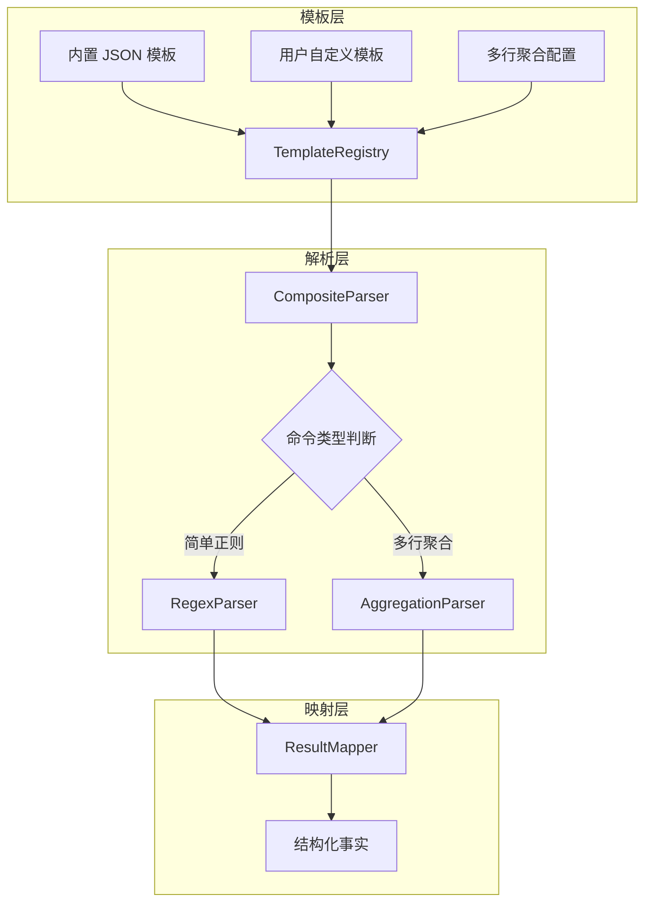

# TextFSM 迁移方案分析报告

## 1. 概述

本报告针对 `docs/regex_parser_migration_design.md` 设计文档进行分析，识别其中未彻底清除 TextFSM 的地方以及潜在的架构问题。

---

## 2. 未彻底清除 TextFSM 的地方

### 2.1 代码中的 TextFSM 引用遗漏

设计文档未提及以下需要修改的位置：

| 文件                                                                            | 行号    | 当前内容                                                                            | 问题说明                         |
| ------------------------------------------------------------------------------- | ------- | ----------------------------------------------------------------------------------- | -------------------------------- |
| [`internal/config/device_profile.go`](internal/config/device_profile.go:151)    | 151-152 | `// 统一使用 verbose 版本，确保与 LLDP TextFSM 模板字段...`                         | 注释中引用 TextFSM，需更新       |
| [`internal/taskexec/executor_impl.go`](internal/taskexec/executor_impl.go:1575) | 1575    | `"未解析到任何 LLDP 邻居事实，请重点检查 LLDP 采集命令输出与 TextFSM 模板是否匹配"` | 错误消息中引用 TextFSM，需更新   |
| [`README.md`](README.md:319)                                                    | 319-322 | `version.textfsm`, `lldp_neighbor.textfsm`                                          | 文档中引用 .textfsm 文件，需更新 |

### 2.2 go.mod 依赖清理

设计文档提到移除 `gotextfsm` 依赖，但未明确说明需要执行：

```bash
go mod tidy
```

以确保依赖完全清理。

---

## 3. 潜在架构问题

### 3.1 接口扩展破坏性变更

**问题**：设计文档扩展了 `CliParser` 接口：

```go
// 现有接口 - internal/parser/models.go:88-92
type CliParser interface {
    Parse(commandKey string, rawText string) ([]map[string]string, error)
}

// 设计文档扩展后的接口
type CliParser interface {
    Parse(commandKey string, rawText string) ([]map[string]string, error)
    LoadBuiltinTemplates(vendor string) error  // 新增
    AddTemplate(tpl *RegexTemplate) error      // 新增
}
```

**风险**：

- 现有 `TextFSMParser` 已实现 `LoadBuiltinTemplates` 方法，但未实现 `AddTemplate`
- 如果在迁移过程中先修改接口再替换实现，会导致编译错误
- 建议迁移顺序：先创建新实现 → 替换引用 → 修改接口 → 删除旧实现

**建议方案**：

```go
// 方案A：创建新接口，保持向后兼容
type CliParser interface {
    Parse(commandKey string, rawText string) ([]map[string]string, error)
}

type ExtensibleParser interface {
    CliParser
    LoadBuiltinTemplates(vendor string) error
    AddTemplate(tpl *RegexTemplate) error
}

// 方案B：使用接口组合
type TemplateLoader interface {
    LoadBuiltinTemplates(vendor string) error
}

type TemplateManager interface {
    AddTemplate(tpl *RegexTemplate) error
}
```

### 3.2 多行聚合处理器与 JSON 模板的冲突

**问题**：设计文档中存在两套并行机制：

1. **JSON 模板定义**（第 3 节）：
   - `lldp_neighbor`、`eth_trunk`、`eth_trunk_verbose`、`interface_detail` 都有 JSON 模板

2. **硬编码多行聚合处理器**（第 2.4 节）：
   - `MultilineParser` 硬编码了相同的 commandKey

**冲突点**：

```go
// composite_parser.go 中的优先级逻辑
func (p *CompositeParser) Parse(commandKey string, rawText string) ([]map[string]string, error) {
    // 优先使用多行聚合处理器
    if p.multiline.CanHandle(commandKey) {
        return p.multiline.Parse(commandKey, rawText)
    }
    // 使用正则解析器
    return p.regex.Parse(commandKey, rawText)
}
```

**后果**：

- JSON 模板中的 `lldp_neighbor`、`eth_trunk` 等配置**永远不会被使用**
- 用户无法通过修改 JSON 模板来自定义这些命令的解析逻辑
- 违反了"支持用户自定义正则模板"的设计目标

**建议方案**：

```go
// 方案A：移除硬编码，全部使用 JSON 模板
// 在 JSON 模板中增加 "aggregation" 字段描述多行聚合语义
type RegexTemplate struct {
    CommandKey   string            `json:"commandKey"`
    Pattern      string            `json:"pattern"`
    Multiline    bool              `json:"multiline"`
    Aggregation  *AggregationConfig `json:"aggregation,omitempty"` // 新增
    FieldMapping map[string]string `json:"fieldMapping,omitempty"`
}

type AggregationConfig struct {
    Type       string   `json:"type"`       // "filldown", "record", etc.
    GroupBy    []string `json:"groupBy"`    // 分组字段
    Filldown   []string `json:"filldown"`   // 需要填充的字段
}

// 方案B：将硬编码处理器注册为内置模板
func NewMultilineParser() *MultilineParser {
    return &MultilineParser{
        aggregators: map[string]AggregatorFunc{
            // 这些处理器作为内置实现，不可被用户覆盖
            // 但应该在文档中明确说明
        },
    }
}
```

### 3.3 用户自定义模板加载缺失

**问题**：设计文档描述了用户自定义模板的 CRUD API，但缺少运行时加载机制：

```go
// 设计文档中的服务创建
func NewParseTemplateService(db *gorm.DB, p *parser.CompositeParser) *ParseTemplateService

// 创建模板后添加到运行时
func (s *ParseTemplateService) CreateTemplate(req CreateParseTemplateRequest) error {
    // ...
    return s.parser.AddTemplate(&parser.RegexTemplate{...})
}
```

**缺失内容**：

1. 应用启动时如何加载已存在的用户模板？
2. 用户模板与内置模板的优先级如何处理？
3. 用户模板的厂商隔离如何实现？

**建议补充**：

```go
// internal/parser/composite_parser.go

// LoadUserTemplates 从数据库加载用户自定义模板
func (p *CompositeParser) LoadUserTemplates(db *gorm.DB) error {
    var templates []models.UserParseTemplate
    if err := db.Where("enabled = ?", true).Find(&templates).Error; err != nil {
        return err
    }

    for _, t := range templates {
        tpl := &RegexTemplate{
            CommandKey:   t.CommandKey,
            Pattern:      t.Pattern,
            Multiline:    t.Multiline,
            Description:  t.Description,
        }
        // 用户模板优先级高于内置模板
        if err := p.AddTemplate(tpl); err != nil {
            log.Warn("加载用户模板失败: %s - %v", t.CommandKey, err)
        }
    }
    return nil
}
```

### 3.4 模板热更新问题

**问题**：设计文档未考虑模板更新场景：

1. 用户修改模板后，如何通知运行时解析器更新？
2. 正在执行的任务是否受模板更新影响？
3. 模板更新是否需要版本控制？

**建议方案**：

```go
// internal/parser/regex_parser.go

// UpdateTemplate 更新已有模板
func (p *RegexParser) UpdateTemplate(tpl *RegexTemplate) error {
    flags := ""
    if tpl.Multiline {
        flags = "(?m)"
    }
    compiled, err := regexp.Compile(flags + tpl.Pattern)
    if err != nil {
        return fmt.Errorf("编译正则失败: %w", err)
    }

    p.mu.Lock()
    defer p.mu.Unlock()

    tpl.compiled = compiled
    p.templates[tpl.CommandKey] = tpl
    return nil
}

// RemoveTemplate 移除模板
func (p *RegexParser) RemoveTemplate(commandKey string) {
    p.mu.Lock()
    defer p.mu.Unlock()
    delete(p.templates, commandKey)
}
```

### 3.5 错误处理与调试支持不足

**问题**：设计文档中的错误处理较为简单：

```go
if !ok {
    return nil, fmt.Errorf("未找到命令键对应的正则模板: %s", commandKey)
}
```

**缺失内容**：

1. 正则匹配失败时的详细错误信息
2. 调试模式下输出匹配过程
3. 模板匹配覆盖率统计

**建议补充**：

```go
// internal/parser/regex_parser.go

type ParseOptions struct {
    Debug       bool   // 输出调试信息
    StrictMode  bool   // 严格模式，未匹配到任何结果时返回错误
}

type ParseResult struct {
    Rows         []map[string]string
    MatchCount   int      // 匹配到的记录数
    UnmatchedLen int      // 未匹配的文本长度
    DebugInfo    []string // 调试信息
}

func (p *RegexParser) ParseWithOptions(commandKey string, rawText string, opts ParseOptions) (*ParseResult, error) {
    // ...
}
```

---

## 4. 迁移执行计划问题

### 4.1 阶段顺序问题

设计文档的阶段二执行顺序存在风险：

| 序号 | 任务                | 风险                                        |
| ---- | ------------------- | ------------------------------------------- |
| 2.1  | 修改 ParseExecutor  | 此时 `CompositeParser` 尚未实现接口约束检查 |
| 2.4  | 删除 TextFSM 解析器 | 应在所有测试通过后执行                      |
| 2.5  | 删除 TextFSM 模板   | 应在所有测试通过后执行                      |

**建议调整**：

```
阶段二修正顺序：
2.1 创建 regex_parser.go（新文件）
2.2 创建 multiline.go（新文件）
2.3 创建 composite_parser.go（新文件）
2.4 创建内置模板 JSON 文件
2.5 编写单元测试，确保解析结果与 TextFSM 一致
2.6 修改 ParseExecutor，使用 NewCompositeParser()
2.7 运行集成测试，验证拓扑采集流程
2.8 【验证通过后】删除 textfsm.go
2.9 【验证通过后】删除 .textfsm 文件
2.10 【验证通过后】更新 go.mod
```

### 4.2 回滚机制缺失

设计文档未提供回滚方案。建议：

1. 使用 feature flag 控制新旧解析器切换
2. 保留 TextFSM 代码直到新解析器稳定运行
3. 提供配置项允许用户选择解析器类型

---

## 5. 测试覆盖问题

### 5.1 对比测试缺失

设计文档提到"对比测试"，但未提供具体方案：

**建议补充**：

```go
// internal/parser/comparison_test.go

func TestParserComparison(t *testing.T) {
    testCases := []struct {
        vendor     string
        commandKey string
        inputFile  string
    }{
        {"huawei", "version", "testdata/huawei/version.txt"},
        {"huawei", "lldp_neighbor", "testdata/huawei/lldp.txt"},
        // ... 覆盖所有 24 个模板
    }

    for _, tc := range testCases {
        t.Run(fmt.Sprintf("%s/%s", tc.vendor, tc.commandKey), func(t *testing.T) {
            rawText, _ := os.ReadFile(tc.inputFile)

            textfsmParser := NewTextFSMParser()
            textfsmParser.LoadBuiltinTemplates(tc.vendor)
            expected, _ := textfsmParser.Parse(tc.commandKey, string(rawText))

            regexParser := NewCompositeParser()
            regexParser.LoadBuiltinTemplates(tc.vendor)
            actual, _ := regexParser.Parse(tc.commandKey, string(rawText))

            // 深度比较结果
            assertResultsEqual(t, expected, actual)
        })
    }
}
```

### 5.2 边界条件测试缺失

设计文档未提及以下边界条件测试：

1. 空输入处理
2. 超长输入处理
3. 特殊字符处理（如正则元字符）
4. 多厂商模板混合加载
5. 并发解析安全性

---

## 6. 文档问题

### 6.1 README.md 更新遗漏

设计文档未提及需要更新 [`README.md`](README.md:319) 中的模板相关说明。

### 6.2 用户迁移指南缺失

对于已有用户，缺少以下内容：

1. TextFSM 模板到正则模板的映射说明
2. 正则语法快速入门
3. 常见问题 FAQ

---

## 7. 改进建议汇总

### 7.1 高优先级（必须修复）

| 问题                     | 建议                             |
| ------------------------ | -------------------------------- |
| 接口扩展破坏性变更       | 使用接口组合或分阶段迁移         |
| 多行聚合与 JSON 模板冲突 | 统一为一套机制，或明确优先级文档 |
| 用户模板加载缺失         | 补充 `LoadUserTemplates` 方法    |
| 迁移顺序风险             | 调整阶段二执行顺序，先创建后删除 |

### 7.2 中优先级（建议修复）

| 问题                | 建议                    |
| ------------------- | ----------------------- |
| 代码中 TextFSM 引用 | 更新注释和错误消息      |
| 模板热更新          | 补充 Update/Remove 方法 |
| 对比测试            | 补充完整的对比测试用例  |
| 回滚机制            | 添加 feature flag       |

### 7.3 低优先级（可选优化）

| 问题         | 建议                       |
| ------------ | -------------------------- |
| 错误处理增强 | 添加调试模式和详细错误信息 |
| 文档更新     | 更新 README 和用户指南     |
| 边界条件测试 | 补充边界条件测试用例       |

---

## 8. 架构优化建议

### 8.1 统一模板管理架构



### 8.2 推荐的文件结构

```
internal/parser/
├── models.go              # 接口定义
├── registry.go            # 模板注册中心（新增）
├── regex_parser.go        # 正则解析器
├── aggregation_parser.go  # 多行聚合解析器（重命名）
├── composite_parser.go    # 复合解析器
├── mapper.go              # 结果映射器
└── templates/
    ├── builtin/
    │   ├── huawei.json
    │   ├── h3c.json
    │   └── cisco.json
    └── schemas/           # JSON Schema（新增）
        └── template.schema.json
```

---

## 9. 结论

设计文档整体思路清晰，但在以下方面需要补充：

1. **彻底性**：遗漏了代码注释、错误消息、文档中的 TextFSM 引用
2. **架构一致性**：多行聚合处理器与 JSON 模板存在冲突
3. **完整性**：缺少用户模板加载、热更新、回滚机制
4. **安全性**：迁移顺序存在风险，应先创建后删除

建议在实施前补充上述内容，确保迁移过程平稳可控。
