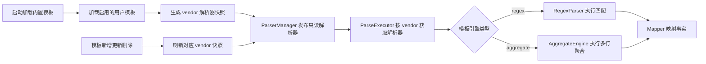

# TextFSM 到正则解析器迁移详细设计

## 1. 修订说明

本文档基于对 [`docs/regex_parser_migration_analysis.md`](docs/regex_parser_migration_analysis.md) 与 [`docs/an.md`](docs/an.md) 的复核结果重写迁移方案，并结合当前仓库现状统一修正设计偏差。

本次修订确认以下问题属实，且必须在迁移方案中直接处理：

- 当前仓库中仍存在 TextFSM 运行时代码、依赖、测试、文档、注释与错误提示残留
- 原方案一边声明保持 `CliParser` 不变，一边又扩展 `CliParser`，接口边界自相矛盾
- 原方案同时引入 JSON 模板与硬编码多行聚合处理器，两套机制对同一 `commandKey` 竞争，用户模板无法真正覆盖
- 原方案缺少应用启动期加载用户模板、运行时热更新、删除模板后的失效同步机制
- 原方案未覆盖唯一键冲突处理、运行期并发安全、全量对比测试与迁移顺序风险
- 原方案遗漏 [`README.md`](README.md) 、[`internal/config/device_profile.go`](internal/config/device_profile.go) 与 [`internal/taskexec/executor_impl.go`](internal/taskexec/executor_impl.go) 中的 TextFSM 文案清理

本修订版采用一套统一的解析器管理架构，避免局部补丁式修复。

---

## 2. 设计目标

### 2.1 总体目标

- 保持 `CliParser` 仅承担解析职责，不引入加载与管理职责
- 以单一模板机制覆盖单行正则解析与多行聚合解析
- 支持按厂商隔离的内置模板与用户模板覆盖
- 支持启动加载、运行期刷新、删除失效、并发安全
- 彻底移除 TextFSM 代码、依赖、模板文件、文档与提示语残留
- 保证拓扑采集、事实映射、前端模板管理、测试链路整体一致

### 2.2 非目标

- 本次迁移不保留 TextFSM 与正则解析器长期双栈运行
- 本次迁移不实现模板历史回滚系统，仅提供模板修订号与可重载能力

---

## 3. 影响范围

| 模块                                       | 变更类型   | 说明                                                 |
| ------------------------------------------ | ---------- | ---------------------------------------------------- |
| `internal/parser/models.go`                | 修改       | 保留 `CliParser` 原定义，新增模板规格与管理接口      |
| `internal/parser/regex_parser.go`          | 新增       | 纯正则解析引擎                                       |
| `internal/parser/aggregate_engine.go`      | 新增       | 基于模板配置的多行聚合引擎                           |
| `internal/parser/composite_parser.go`      | 新增       | vendor 级不可变组合解析器                            |
| `internal/parser/manager.go`               | 新增       | 模板装载、覆盖、重载、快照发布                       |
| `internal/parser/comparison_test.go`       | 新增       | 全量对比测试                                         |
| `internal/parser/golden_test.go`           | 修改       | 改为使用新管理器创建解析器                           |
| `internal/parser/textfsm.go`               | 删除       | 移除 TextFSM 解析器                                  |
| `internal/parser/templates/**/*.textfsm`   | 删除       | 移除全部 TextFSM 模板                                |
| `internal/parser/templates/builtin/*.json` | 新增或重写 | 改为统一模板 DSL                                     |
| `internal/taskexec/executor_impl.go`       | 修改       | 不再依赖 `*parser.TextFSMParser`，改依赖解析器提供者 |
| `internal/models/parse_template.go`        | 新增       | 用户模板模型                                         |
| `internal/ui/parse_template_service.go`    | 新增       | 模板 CRUD、测试、重载服务                            |
| `cmd/netweaver/main.go`                    | 修改       | 启动期注入模板管理器并完成引导                       |
| `internal/config/device_profile.go`        | 修改       | 清理 TextFSM 注释表达                                |
| `README.md`                                | 修改       | 更新解析架构与模板格式说明                           |
| `go.mod`                                   | 修改       | 移除 `github.com/sirikothe/gotextfsm`                |
| `go.sum`                                   | 修改       | 通过 `go mod tidy` 清理残留 checksum                 |

---

## 4. 总体架构

### 4.1 架构原则

1. `CliParser` 只负责 `Parse`
2. 模板加载、模板重载、模板覆盖由 `ParserManager` 统一负责
3. 多行聚合不再通过硬编码 `commandKey` 抢占解析流程，而是通过模板声明选择解析引擎
4. `ParseExecutor` 不共享可变模板实例，而是从管理器获取 vendor 级只读解析器快照
5. 用户模板与内置模板按 `vendor + commandKey` 覆盖，用户模板优先级高于内置模板

### 4.2 组件关系



### 4.3 核心接口边界

```go
// internal/parser/models.go

package parser

type CliParser interface {
    Parse(commandKey string, rawText string) ([]map[string]string, error)
}

type ParserProvider interface {
    GetParser(vendor string) (CliParser, error)
}

type ParserReloader interface {
    ReloadVendor(vendor string) error
}
```

修订要点：

- `CliParser` 保持当前仓库中的单一 `Parse` 方法，不做破坏性扩展
- 原方案中的 `LoadBuiltinTemplates` 与 `AddTemplate` 从解析器接口中移出，转移到管理器职责
- `var _ CliParser = (*CompositeParser)(nil)` 仍然成立，但前提是 `CompositeParser` 只实现 `Parse`

### 4.4 模板统一 DSL

```go
// internal/parser/models.go

type TemplateEngine string

const (
    EngineRegex     TemplateEngine = "regex"
    EngineAggregate TemplateEngine = "aggregate"
)

type RegexTemplate struct {
    Vendor       string             `json:"vendor,omitempty"`
    CommandKey   string             `json:"commandKey"`
    Engine       TemplateEngine     `json:"engine"`
    Pattern      string             `json:"pattern,omitempty"`
    Multiline    bool               `json:"multiline,omitempty"`
    Aggregation  *AggregationConfig `json:"aggregation,omitempty"`
    FieldMapping map[string]string  `json:"fieldMapping,omitempty"`
    Description  string             `json:"description,omitempty"`
}

type AggregationConfig struct {
    RecordStart  []string      `json:"recordStart,omitempty"`
    CaptureRules []CaptureRule `json:"captureRules,omitempty"`
    Filldown     []string      `json:"filldown,omitempty"`
    EmitWhen     []string      `json:"emitWhen,omitempty"`
}

type CaptureRule struct {
    Pattern string `json:"pattern"`
    Mode    string `json:"mode"`
}
```

说明：

- `engine=regex` 表示走纯正则解析
- `engine=aggregate` 表示走通用聚合引擎
- 多行场景不再依赖硬编码 `parseLLDPNeighbor` 一类专用入口，而由模板中的 `AggregationConfig` 描述记录起始、字段捕获、填充规则与输出时机
- 这样用户模板可以覆盖原本的 LLDP、接口详情、聚合口等复杂场景，不再被硬编码逻辑绕过

### 4.5 内置模板格式示例

以下只展示关键命令的修订格式，实际内置文件需覆盖当前全部 24 个命令模板。

```json
// internal/parser/templates/builtin/huawei.json
{
  "vendor": "huawei",
  "templates": {
    "version": {
      "commandKey": "version",
      "engine": "regex",
      "pattern": "^.*[Vv]ersion.*[Vv](?P<version>\\S+)|^Huawei\\s+(?P<model>[A-Za-z0-9\\-_\\/\\.]+)|^.*[Ss]erial\\s*[Nn]umber.*:\\s*(?P<serial_number>\\S+)|^<(?P<hostname>\\S+)>",
      "multiline": true,
      "description": "设备版本信息"
    },
    "lldp_neighbor": {
      "commandKey": "lldp_neighbor",
      "engine": "aggregate",
      "aggregation": {
        "recordStart": [
          "^\\s*\\[(?P<local_if>\\S+)\\]\\s*$",
          "^\\s*(?P<local_if>\\S+)\\s+has\\s+\\d+\\s+neighbor"
        ],
        "captureRules": [
          {
            "pattern": "System\\s+name\\s*:\\s*(?P<neighbor_name>.+)",
            "mode": "set"
          },
          {
            "pattern": "Port\\s+ID\\s*:\\s*(?P<neighbor_port>\\S+)",
            "mode": "set"
          },
          {
            "pattern": "Chassis\\s+ID\\s*:\\s*(?P<chassis_id>\\S+)",
            "mode": "set"
          },
          {
            "pattern": "Management\\s+address\\s*:\\s*(?P<mgmt_ip>\\S+)",
            "mode": "set"
          }
        ],
        "filldown": ["local_if"],
        "emitWhen": ["neighbor_name"]
      },
      "description": "LLDP 邻居多行聚合"
    },
    "interface_detail": {
      "commandKey": "interface_detail",
      "engine": "aggregate",
      "aggregation": {
        "recordStart": ["^(?P<interface>\\S+)\\s+current\\s+state"],
        "captureRules": [
          {
            "pattern": "^\\s*Description:\\s*(?P<description>.*)",
            "mode": "set"
          },
          {
            "pattern": "^\\s*Hardware\\s+address\\s+is\\s+(?P<mac>[0-9A-Fa-f:\\.-]+)",
            "mode": "set"
          },
          {
            "pattern": "^\\s*Internet\\s+Address\\s+is\\s+(?P<ip>\\d+\\.\\d+\\.\\d+\\.\\d+/\\d+)",
            "mode": "set"
          }
        ],
        "emitWhen": ["interface"]
      },
      "description": "接口详情多行聚合"
    }
  }
}
```

### 4.6 解析器实现分层

#### 4.6.1 `RegexParser`

职责：

- 只负责对单个已编译模板执行正则匹配
- 不负责模板加载、模板来源判断、模板覆盖逻辑
- 不暴露运行时可变模板注册接口

```go
// internal/parser/regex_parser.go

type RegexParser struct{}

func NewRegexParser() *RegexParser {
    return &RegexParser{}
}

func (p *RegexParser) ParseWithTemplate(tpl *CompiledTemplate, rawText string) ([]map[string]string, error) {
    // 基于已编译正则执行匹配
    return nil, nil
}
```

#### 4.6.2 `AggregateEngine`

职责：

- 读取 `AggregationConfig`
- 按 `recordStart` 切换记录上下文
- 按 `captureRules` 更新当前记录
- 按 `filldown` 填充字段
- 按 `emitWhen` 决定何时输出记录

```go
// internal/parser/aggregate_engine.go

type AggregateEngine struct{}

func NewAggregateEngine() *AggregateEngine {
    return &AggregateEngine{}
}

func (e *AggregateEngine) ParseWithTemplate(tpl *CompiledTemplate, rawText string) ([]map[string]string, error) {
    return nil, nil
}
```

#### 4.6.3 `CompositeParser`

职责：

- 作为 vendor 级只读解析器快照
- 内部只保存已编译模板
- `Parse` 时根据模板 `engine` 选择 `RegexParser` 或 `AggregateEngine`

```go
// internal/parser/composite_parser.go

type CompositeParser struct {
    vendor     string
    templates  map[string]*CompiledTemplate
    regex      *RegexParser
    aggregate  *AggregateEngine
}

var _ CliParser = (*CompositeParser)(nil)

func (p *CompositeParser) Parse(commandKey string, rawText string) ([]map[string]string, error) {
    tpl, ok := p.templates[commandKey]
    if !ok {
        return nil, fmt.Errorf("未找到模板: vendor=%s commandKey=%s", p.vendor, commandKey)
    }

    switch tpl.Engine {
    case EngineRegex:
        return p.regex.ParseWithTemplate(tpl, rawText)
    case EngineAggregate:
        return p.aggregate.ParseWithTemplate(tpl, rawText)
    default:
        return nil, fmt.Errorf("不支持的模板引擎: %s", tpl.Engine)
    }
}
```

### 4.7 模板管理器与并发模型

```go
// internal/parser/manager.go

type ParserManager struct {
    db        *gorm.DB
    mu        sync.RWMutex
    snapshots map[string]*CompositeParser
}

func NewParserManager(db *gorm.DB) *ParserManager {
    return &ParserManager{snapshots: make(map[string]*CompositeParser), db: db}
}

func (m *ParserManager) Bootstrap() error {
    for _, vendor := range []string{"huawei", "h3c", "cisco"} {
        if err := m.ReloadVendor(vendor); err != nil {
            return err
        }
    }
    return nil
}

func (m *ParserManager) GetParser(vendor string) (CliParser, error) {
    m.mu.RLock()
    parser := m.snapshots[vendor]
    m.mu.RUnlock()
    if parser == nil {
        return nil, fmt.Errorf("未加载厂商解析器: %s", vendor)
    }
    return parser, nil
}

func (m *ParserManager) ReloadVendor(vendor string) error {
    // 读取内置模板 + 读取 enabled 用户模板 + 覆盖合并 + 编译 + 原子替换快照
    return nil
}
```

并发策略：

- 不在共享解析器实例上执行 `LoadBuiltinTemplates` 或 `AddTemplate`
- 每次重载都构建新的 vendor 快照，完成后再一次性替换旧快照
- 运行中的解析任务继续使用获取时的旧快照，不受中途模板更新影响
- 新任务自动使用新快照，避免读写锁下半更新状态

这同时修复了原方案中的接口扩展风险、共享可变模板实例风险与热更新缺失问题。

---

## 5. 执行链路集成设计

### 5.1 `ParseExecutor` 改造

当前 [`internal/taskexec/executor_impl.go`](internal/taskexec/executor_impl.go) 中的 `ParseExecutor` 直接依赖 `*parser.TextFSMParser`，需要改为依赖 `ParserProvider`。

```go
// internal/taskexec/executor_impl.go

type ParseExecutor struct {
    db            *gorm.DB
    parserManager parser.ParserProvider
}

func NewParseExecutor(db *gorm.DB, provider parser.ParserProvider) *ParseExecutor {
    return &ParseExecutor{db: db, parserManager: provider}
}

func (e *ParseExecutor) parseAndSaveRunDevice(ctx RuntimeContext, deviceIP string, vendor string) error {
    parserEngine, err := e.parserManager.GetParser(vendor)
    if err != nil {
        return fmt.Errorf("get parser failed: %w", err)
    }

    // 之后仅使用 parserEngine.Parse
    return nil
}
```

改造收益：

- `ParseExecutor` 不再感知模板装载细节
- 并发解析时不会相互覆盖对方 vendor 模板
- 代码依赖真正落到稳定接口而不是具体实现

### 5.2 启动引导

```go
// cmd/netweaver/main.go

func main() {
    db := initDB()
    parserManager := parser.NewParserManager(db)
    if err := parserManager.Bootstrap(); err != nil {
        panic(err)
    }

    parseExecutor := taskexec.NewParseExecutor(db, parserManager)
    templateService := ui.NewParseTemplateService(db, parserManager)

    // 注册服务与其他组件
    _ = parseExecutor
    _ = templateService
}
```

要求：

- 应用启动时完成三大 vendor 的内置模板加载
- 启动时同时加载所有 `enabled = true` 的用户模板
- 如果某个 vendor 模板重载失败，必须阻止该 vendor 进入运行态并记录错误

---

## 6. 用户模板管理设计

### 6.1 数据模型

```go
// internal/models/parse_template.go

type UserParseTemplate struct {
    ID           uint      `gorm:"primaryKey" json:"id"`
    Vendor       string    `gorm:"column:vendor;not null;index;uniqueIndex:uk_vendor_command" json:"vendor"`
    CommandKey   string    `gorm:"column:command_key;not null;index;uniqueIndex:uk_vendor_command" json:"commandKey"`
    Engine       string    `gorm:"column:engine;not null" json:"engine"`
    Pattern      string    `gorm:"column:pattern;type:text" json:"pattern"`
    Multiline    bool      `gorm:"column:multiline;default:true" json:"multiline"`
    Aggregation  string    `gorm:"column:aggregation;type:text" json:"aggregation"`
    FieldMapping string    `gorm:"column:field_mapping;type:text" json:"fieldMapping"`
    Description  string    `gorm:"column:description" json:"description"`
    Enabled      bool      `gorm:"column:enabled;default:true" json:"enabled"`
    Revision     uint      `gorm:"column:revision;default:1" json:"revision"`
    CreatedAt    time.Time `gorm:"column:created_at" json:"createdAt"`
    UpdatedAt    time.Time `gorm:"column:updated_at" json:"updatedAt"`
}
```

说明：

- `vendor + command_key` 保持唯一，确保同一厂商同一命令仅有一个生效模板
- `engine` 与 `aggregation` 字段保证用户模板也能定义多行聚合规则
- `revision` 用于最小化版本控制与并发更新识别

### 6.2 数据库迁移

```sql
CREATE TABLE IF NOT EXISTS net_user_parse_templates (
    id INTEGER PRIMARY KEY AUTOINCREMENT,
    vendor TEXT NOT NULL,
    command_key TEXT NOT NULL,
    engine TEXT NOT NULL,
    pattern TEXT,
    multiline BOOLEAN DEFAULT 1,
    aggregation TEXT,
    field_mapping TEXT,
    description TEXT,
    enabled BOOLEAN DEFAULT 1,
    revision INTEGER DEFAULT 1,
    created_at TIMESTAMP DEFAULT CURRENT_TIMESTAMP,
    updated_at TIMESTAMP DEFAULT CURRENT_TIMESTAMP,
    UNIQUE(vendor, command_key)
);
```

### 6.3 服务接口

```go
// internal/ui/parse_template_service.go

type ParseTemplateService struct {
    db       *gorm.DB
    reloader parser.ParserReloader
}

func (s *ParseTemplateService) ListTemplates(vendor string) ([]UserParseTemplateVO, error)
func (s *ParseTemplateService) CreateTemplate(req SaveParseTemplateRequest) error
func (s *ParseTemplateService) UpdateTemplate(id uint, req SaveParseTemplateRequest) error
func (s *ParseTemplateService) DeleteTemplate(id uint) error
func (s *ParseTemplateService) TestTemplate(req TestParseTemplateRequest) (*TestParseTemplateResult, error)
```

服务规则：

1. 创建模板前校验 `engine`、`pattern`、`aggregation`
2. 创建时如果唯一键冲突，返回明确业务错误，不做静默覆盖
3. 更新模板后递增 `revision`
4. 创建、更新、删除成功后，调用 `ReloadVendor(vendor)` 刷新对应解析器快照
5. 删除模板后应恢复该命令的内置模板生效状态

### 6.4 模板测试策略

`TestTemplate` 不直接污染生产解析器快照，而是创建临时 parser snapshot 进行测试：

- 支持纯 regex 模板测试
- 支持 aggregate 模板测试
- 返回解析结果、命中条数、编译错误、配置错误

---

## 7. 文档、注释与错误提示清理

迁移不止于解析器代码，还必须同步清理以下外围内容：

1. 更新 [`README.md`](README.md) 中关于 TextFSM 架构、模板目录、解析流程的描述
2. 更新 [`internal/config/device_profile.go`](internal/config/device_profile.go) 中关于 LLDP 模板的注释，改为解析字段契约说明，不再提及 TextFSM
3. 更新 [`internal/taskexec/executor_impl.go`](internal/taskexec/executor_impl.go) 中 LLDP 解析失败提示，将 TextFSM 模板改为解析模板或当前厂商模板
4. 执行 `go mod tidy`，同步清理 [`go.mod`](go.mod) 与 `go.sum` 中的 `gotextfsm` 残留

建议统一后的错误提示如下：

```text
未解析到任何 LLDP 邻居事实，请重点检查 LLDP 采集命令输出与当前厂商解析模板是否匹配
```

---

## 8. 测试设计

### 8.1 测试分层

| 层级        | 文件                                 | 目标                             |
| ----------- | ------------------------------------ | -------------------------------- |
| 单元测试    | `internal/parser/*_test.go`          | 验证 regex 与 aggregate 引擎行为 |
| 对比测试    | `internal/parser/comparison_test.go` | 对全部 24 个模板执行新旧结果比对 |
| Golden 测试 | `internal/parser/golden_test.go`     | 验证关键事实映射结果             |
| 集成测试    | `internal/taskexec/*`                | 验证拓扑采集到解析落库全链路     |

### 8.2 必测场景

- Huawei、H3C、Cisco 全部命令键覆盖
- 空输入、无匹配输入、异常字符输入
- 多行聚合命令的 `filldown` 与记录切换
- 用户模板覆盖内置模板
- 删除用户模板后回退到内置模板
- 多 goroutine 并发解析时不同 vendor 不相互污染
- 模板重载前后，新旧任务使用不同快照但都可稳定执行

### 8.3 对比测试策略

迁移期间保留对比测试，直到新解析器验证完成后再删除 TextFSM 运行时代码。

```go
// internal/parser/comparison_test.go

func TestParserComparison(t *testing.T) {
    // 逐 vendor、逐 commandKey 对比 TextFSM 与新解析器输出
}
```

---

## 9. 迁移执行计划

### 9.1 阶段一：解析器基础设施

| 序号 | 任务                                | 文件                                       | 说明                                |
| ---- | ----------------------------------- | ------------------------------------------ | ----------------------------------- |
| 1.1  | 保持 `CliParser` 不变并补充管理接口 | `internal/parser/models.go`                | 拆分解析与管理职责                  |
| 1.2  | 实现统一模板 DSL                    | `internal/parser/models.go`                | 增加 `engine` 与 `aggregation` 结构 |
| 1.3  | 实现纯正则引擎                      | `internal/parser/regex_parser.go`          | 只处理已编译模板                    |
| 1.4  | 实现通用聚合引擎                    | `internal/parser/aggregate_engine.go`      | 用模板驱动多行场景                  |
| 1.5  | 实现组合解析器                      | `internal/parser/composite_parser.go`      | vendor 级只读快照                   |
| 1.6  | 实现模板管理器                      | `internal/parser/manager.go`               | 启动加载、覆盖合并、原子重载        |
| 1.7  | 重写内置模板 JSON                   | `internal/parser/templates/builtin/*.json` | 覆盖全部 24 个命令模板              |

### 9.2 阶段二：测试先行验证

| 序号 | 任务             | 文件                                 | 说明                         |
| ---- | ---------------- | ------------------------------------ | ---------------------------- |
| 2.1  | 新增对比测试     | `internal/parser/comparison_test.go` | 全量对比新旧解析结果         |
| 2.2  | 更新 Golden 测试 | `internal/parser/golden_test.go`     | 改为从管理器获取新解析器     |
| 2.3  | 补充边界测试     | `internal/parser/*_test.go`          | 覆盖空输入、聚合、并发、重载 |
| 2.4  | 运行项目测试集   | 根目录 `build.bat`                   | 通过统一构建脚本验证         |

### 9.3 阶段三：执行链路与用户模板接入

| 序号 | 任务                      | 文件                                    | 说明                                     |
| ---- | ------------------------- | --------------------------------------- | ---------------------------------------- |
| 3.1  | 改造 `ParseExecutor` 依赖 | `internal/taskexec/executor_impl.go`    | 改依赖 `ParserProvider`                  |
| 3.2  | 启动期注入模板管理器      | `cmd/netweaver/main.go`                 | 完成 `Bootstrap`                         |
| 3.3  | 新增用户模板模型          | `internal/models/parse_template.go`     | 支持 `engine`、`aggregation`、`revision` |
| 3.4  | 实现模板 CRUD 服务        | `internal/ui/parse_template_service.go` | 创建、更新、删除、测试、重载             |
| 3.5  | 实现前端模板管理界面      | `frontend/src/views/ParseTemplates.vue` | 对应服务能力                             |

### 9.4 阶段四：清理旧实现

| 序号 | 任务                  | 文件                                            | 说明                   |
| ---- | --------------------- | ----------------------------------------------- | ---------------------- |
| 4.1  | 删除 TextFSM 解析器   | `internal/parser/textfsm.go`                    | 在对比测试通过后执行   |
| 4.2  | 删除 `.textfsm` 模板  | `internal/parser/templates/**/*.textfsm`        | 在对比测试通过后执行   |
| 4.3  | 移除 `gotextfsm` 依赖 | `go.mod`                                        | 之后执行 `go mod tidy` |
| 4.4  | 清理 `go.sum`         | `go.sum`                                        | 去除依赖残留           |
| 4.5  | 删除 legacy 文件      | `internal/parser/service.go.474295111933871248` | 清理遗留物             |

### 9.5 阶段五：外围文档与提示语清理

| 序号 | 任务         | 文件                                    | 说明               |
| ---- | ------------ | --------------------------------------- | ------------------ |
| 5.1  | 更新架构文档 | `README.md`                             | 改为正则解析器架构 |
| 5.2  | 更新注释     | `internal/config/device_profile.go`     | 清理 TextFSM 文案  |
| 5.3  | 更新错误提示 | `internal/taskexec/executor_impl.go`    | 清理 TextFSM 文案  |
| 5.4  | 完成迁移文档 | `docs/regex_parser_migration_design.md` | 保持与实际实现一致 |

---

## 10. 风险与缓解

| 风险                            | 影响 | 缓解措施                                    |
| ------------------------------- | ---- | ------------------------------------------- |
| 新模板 DSL 无法覆盖原有复杂命令 | 高   | 在阶段二用 24 个模板对比测试证明可替代      |
| 多 vendor 并发解析互相污染      | 高   | 使用 vendor 级只读快照与 `ParserProvider`   |
| 用户模板错误导致运行时不可用    | 中   | 创建前校验，测试接口先验证，再重载快照      |
| 模板更新影响运行中任务          | 中   | 使用原子替换快照，旧任务继续使用旧实例      |
| 迁移后仍有 TextFSM 文案残留     | 中   | 将 `README`、注释、错误消息纳入明确迁移清单 |

---

## 11. 验收标准

### 11.1 功能验收

- 拓扑采集、接口解析、LLDP 邻居、聚合口、ARP、MAC 解析链路正常
- 用户可创建、更新、删除、测试自定义模板
- 用户模板可覆盖内置模板，删除后可恢复内置模板
- 多行聚合命令通过统一模板 DSL 解析，不再依赖硬编码命令分支

### 11.2 代码验收

- `CliParser` 保持单方法接口
- `ParseExecutor` 不再依赖 `*parser.TextFSMParser`
- 仓库中不再存在 `gotextfsm` 依赖与 `.textfsm` 模板
- `README`、错误提示、注释中不再出现过时 TextFSM 方案描述

### 11.3 测试验收

- 全量对比测试通过
- Golden 测试通过
- 构建脚本 `build.bat` 通过
- 聚合场景、并发场景、模板重载场景均有自动化测试覆盖

---

## 12. 问题处置结论

本次修订对分析文档中列出的问题的处理结论如下：

| 问题                            | 结论 | 方案处理                                                         |
| ------------------------------- | ---- | ---------------------------------------------------------------- |
| `CliParser` 扩展导致不兼容      | 属实 | 保持 `CliParser` 不变，引入 `ParserProvider` 与 `ParserReloader` |
| 多行聚合与 JSON 模板冲突        | 属实 | 改为统一模板 DSL，取消按 `commandKey` 硬编码抢占                 |
| 用户模板启动加载缺失            | 属实 | 增加 `ParserManager.Bootstrap` 与 `ReloadVendor`                 |
| 模板热更新与删除机制缺失        | 属实 | CRUD 成功后刷新 vendor 快照，删除后恢复内置模板                  |
| 运行期并发安全不足              | 属实 | 使用 vendor 级只读快照替代共享可变解析器                         |
| 唯一键冲突处理未定义            | 属实 | 创建时显式报错，更新走独立接口并维护 `revision`                  |
| 迁移顺序存在先删后验风险        | 属实 | 调整为先建新引擎与测试，再删旧实现                               |
| `README` 与代码注释提示遗漏清理 | 属实 | 纳入明确迁移清单                                                 |
| 缺少 `DeleteTemplate` 能力      | 属实 | 在服务层补齐删除与重载                                           |
| 缺少完整测试覆盖                | 属实 | 增加全量对比、边界、并发、重载测试                               |

至此，迁移方案已从局部替换升级为覆盖解析引擎、执行链路、模板管理、文档清理与测试验证的整体架构方案。
