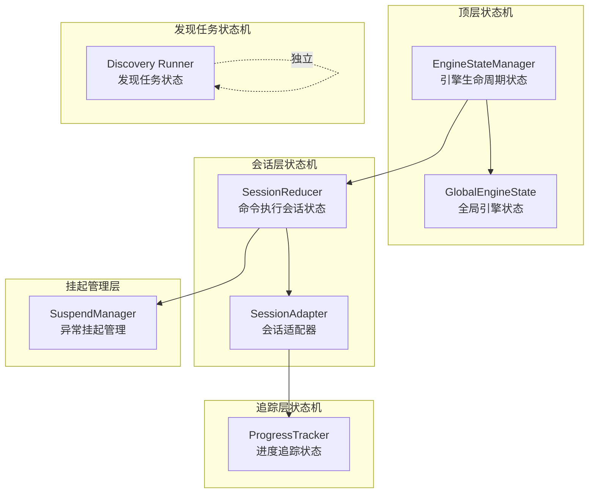
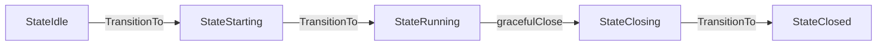
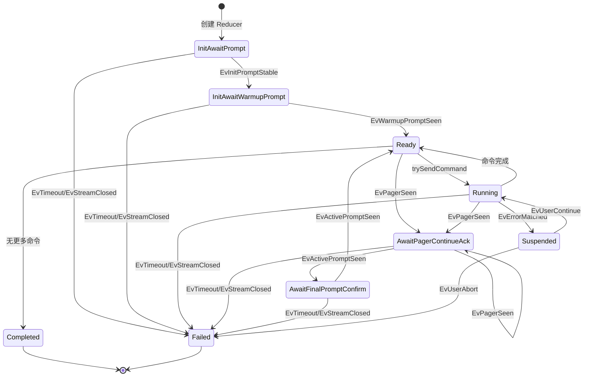
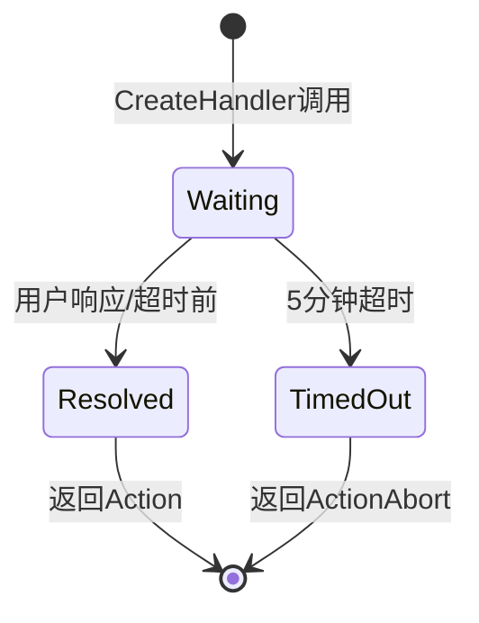
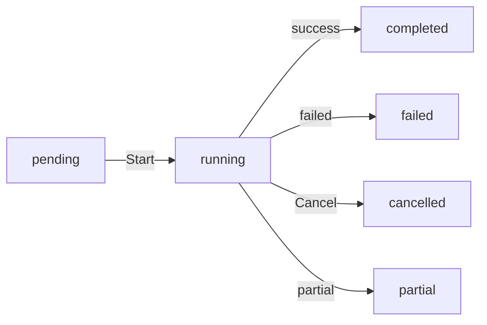
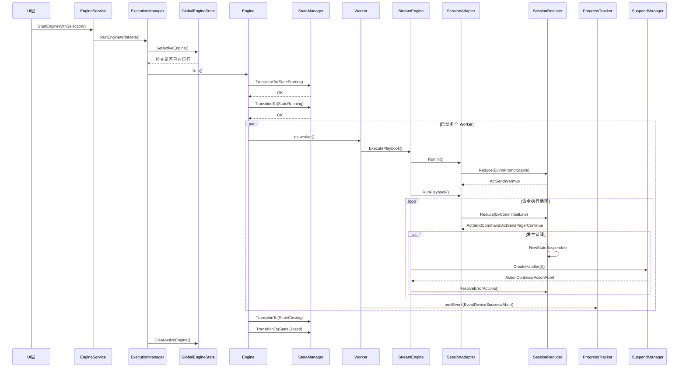

# NetWeaverGo 状态机架构最终分析报告

## 文档信息
- **生成时间**: 2026-03-23
- **分析范围**: 全项目状态机运行逻辑
- **分析目标**: 识别调用异常、卡死风险、异常调用节点
- **整合来源**: state-machine-analysis.md + state-machine-detailed-analysis.md

---

## 一、状态机总体架构

项目中共存在以下独立的状态机系统：



### 1.1 组件职责总览

| 组件 | 文件 | 职责 |
|------|------|------|
| [`EngineStateManager`](internal/engine/engine_state.go:11) | engine_state.go | 引擎生命周期状态管理 |
| [`GlobalEngineState`](internal/engine/global_state.go) | global_state.go | 全局引擎状态单例 |
| [`SessionReducer`](internal/executor/session_reducer.go:15) | session_reducer.go | 纯函数式会话状态机 |
| [`SessionAdapter`](internal/executor/session_adapter.go:13) | session_adapter.go | 统一封装 Replayer+Detector+Reducer |
| [`ProgressTracker`](internal/report/collector.go:62) | collector.go | 进度追踪状态管理 |
| [`SuspendManager`](internal/ui/suspend_manager.go:26) | suspend_manager.go | 异常挂起会话管理 |
| [`Discovery Runner`](internal/discovery/runner.go:57) | runner.go | 发现任务状态管理 |

---

## 二、EngineStateManager 引擎顶层状态机

### 2.1 状态定义

**文件位置**: [`internal/engine/engine_state.go:11-18`](internal/engine/engine_state.go:11)

```go
type EngineState int

const (
    StateIdle EngineState = iota      // 0 - 空闲
    StateStarting                      // 1 - 启动中
    StateRunning                       // 2 - 运行中
    StatePaused                        // 3 - 已暂停（预留但未实现）
    StateClosing                       // 4 - 关闭中
    StateClosed                        // 5 - 已关闭
)
```

### 2.2 状态转移矩阵

**文件位置**: [`internal/engine/engine_state.go:42-63`](internal/engine/engine_state.go:42)

```
当前状态        | 可转移目标状态
----------------|----------------------------------
StateIdle       | StateStarting, StateClosing
StateStarting   | StateRunning, StateClosing
StateRunning    | StatePaused, StateClosing
StatePaused     | StateRunning, StateClosing
StateClosing    | StateClosed
StateClosed     | (终态，无转移)
```

### 2.3 状态转换调用链



**调用位置详细追踪**:

| 调用点 | 文件位置 | 状态转换 | 条件/触发 |
|--------|----------|----------|-----------|
| Run()入口 | `engine.go:238` | Idle→Starting | Run()方法入口 |
| Run()初始化完成 | `engine.go:246` | Starting→Running | 初始化成功 |
| Run()正常结束 | `engine.go:329` | Running→Closing | wg.Wait()完成 |
| Run()最终状态 | `engine.go:349` | Closing→Closed | 通道关闭后 |

---

## 三、SessionReducer 会话命令执行状态机

### 3.1 状态定义

**文件位置**: [`internal/executor/session_types.go:18-45`](internal/executor/session_types.go:18)

```go
type NewSessionState int

const (
    NewStateInitAwaitPrompt         // 等待初始提示符
    NewStateInitAwaitWarmupPrompt   // 等待预热后提示符
    NewStateReady                   // 就绪状态
    NewStateRunning                 // 命令执行中
    NewStateAwaitPagerContinueAck   // 等待分页续页确认
    NewStateAwaitFinalPromptConfirm // 等待最终提示符确认
    NewStateSuspended               // 挂起状态
    NewStateCompleted               // 完成状态
    NewStateFailed                  // 失败状态
)
```

### 3.2 状态分类

```
┌─────────────────────────────────────────────────────────────┐
│                      状态分类                                │
├─────────────────────────────────────────────────────────────┤
│  初始化阶段:                                                 │
│    - NewStateInitAwaitPrompt                                │
│    - NewStateInitAwaitWarmupPrompt                          │
├─────────────────────────────────────────────────────────────┤
│  运行阶段:                                                   │
│    - NewStateReady                                          │
│    - NewStateRunning                                        │
│    - NewStateAwaitPagerContinueAck                          │
│    - NewStateAwaitFinalPromptConfirm                        │
├─────────────────────────────────────────────────────────────┤
│  挂起阶段:                                                   │
│    - NewStateSuspended                                      │
├─────────────────────────────────────────────────────────────┤
│  终态:                                                       │
│    - NewStateCompleted                                      │
│    - NewStateFailed                                         │
└─────────────────────────────────────────────────────────────┘
```

### 3.3 状态转移图



### 3.4 事件类型详解

| 事件类型 | 触发条件 | 携带数据 |
|----------|----------|----------|
| `EvInitPromptStable` | 初始化阶段检测到稳定提示符 | Prompt string |
| `EvWarmupPromptSeen` | 预热后检测到提示符 | Prompt string |
| `EvCommandPromptSeen` | 命令完成后检测到提示符 | Prompt string |
| `EvCommittedLine` | 行被提交（换行符） | Line string |
| `EvActivePromptSeen` | 活动行检测到提示符 | Prompt string |
| `EvPagerSeen` | 检测到分页符 | Line string |
| `EvErrorMatched` | 检测到错误规则命中 | Line, Rule |
| `EvTimeout` | 命令执行超时 | CommandIndex |
| `EvUserContinue` | 用户选择继续 | CommandIndex |
| `EvUserAbort` | 用户选择中止 | CommandIndex |
| `EvStreamClosed` | 流关闭 | - |

### 3.5 动作类型列表

| 动作类型 | 执行操作 |
|----------|----------|
| `ActSendWarmup` | 发送预热空行 |
| `ActSendCommand` | 发送命令 |
| `ActSendPagerContinue` | 发送分页续页（空格） |
| `ActEmitCommandStart` | 发送命令开始事件 |
| `ActEmitCommandDone` | 发送命令完成事件 |
| `ActEmitDeviceError` | 发送设备错误事件 |
| `ActRequestSuspendDecision` | 请求挂起决策 |
| `ActAbortSession` | 中止会话 |
| `ActResetReadTimeout` | 重置读取超时 |
| `ActFlushDetailLog` | 刷新详细日志 |
| `ActClearInitResiduals` | 清理初始化残留 |

---

## 四、ProgressTracker 进度追踪状态机

### 4.1 状态定义

**文件位置**: [`internal/report/collector.go:62-79`](internal/report/collector.go:62)

ProgressTracker 通过以下字段追踪状态：

```go
type ProgressTracker struct {
    status      map[string]*DeviceSummary  // 各设备状态
    finished    int                        // 已完成设备数
    total       int                        // 总设备数
    paused      bool                       // 是否暂停刷新
}
```

**设备状态值** (`DeviceSummary.Status`):
- `"Init"` - 初始化
- `"Running"` - 执行中
- `"Success"` - 成功完成
- `"Error"` - 错误（但非终态，引擎会继续）
- `"Aborted"` - 中止（终态）
- `"Warning"` - 警告/跳过
- `"Suspended"` - 挂起等待用户决策

---

## 五、SuspendManager 异常挂起状态机

### 5.1 状态定义

**文件位置**: [`internal/ui/suspend_manager.go:15-23`](internal/ui/suspend_manager.go:15)

```go
type SuspendSession struct {
    ID        string
    IP        string
    CreatedAt time.Time
    ActionCh  chan executor.ErrorAction
    timedOut  atomic.Bool  // 超时标记
    resolved  atomic.Bool  // 已响应标记
}
```

状态通过以下组合隐式定义：
- `timedOut == false && resolved == false` - 等待中
- `resolved == true` - 已决策
- `timedOut == true` - 已超时

### 5.2 状态转移图



---

## 六、Discovery Runner 发现任务状态机

### 6.1 状态定义

**任务状态** (数据库字段):
- `pending` - 待执行
- `running` - 执行中
- `completed` - 完成
- `failed` - 失败
- `cancelled` - 已取消
- `partial` - 部分成功

### 6.2 状态转换调用链



---

## 七、跨状态机交互调用链

### 7.1 完整执行流程调用链



---

## 八、风险点分析汇总

### 8.1 风险等级分类

| 等级 | 说明 | 数量 |
|------|------|------|
| 🔴 高 | 可能导致 panic 或严重功能故障 | 1 |
| 🟡 中 | 可能导致功能异常或阻塞 | 4 |
| 🟢 低 | 设计问题或轻微影响 | 4 |

### 8.2 高风险点

#### 🔴 风险1: SuspendManager Channel Panic

**位置**: [`internal/ui/suspend_manager.go:183-188`](internal/ui/suspend_manager.go:183)

**问题描述**:
- 超时后 `actionCh` 在 defer 中关闭
- 如果前端在超时后、关闭前响应，向已关闭 channel 发送会 panic

**时序问题**:
```
t=0:  超时触发，返回 ActionAbort
t=1:  执行 defer，关闭 actionCh
t=2:  前端收到超时事件，但用户已点击响应
t=3:  Resolve() 被调用，尝试向已关闭 channel 发送 -> panic!
```

**代码片段**:
```go
// suspend_manager.go:183-188
select {
case session.ActionCh <- errAction:
    // ...
default:
    logger.Warn("SuspendManager", session.IP, "挂起信号通道已满，会话可能已结束")
}
```

**修复建议**:
```go
defer func() {
    if r := recover(); r != nil {
        logger.Warn("SuspendManager", "-", "向已关闭channel发送被恢复: %v", r)
    }
}()
```

---

### 8.3 中风险点

#### 🟡 风险2: 防串台门禁可能导致命令发送阻塞

**位置**: [`internal/executor/session_reducer.go:280-285`](internal/executor/session_reducer.go:280)

**问题描述**:
- 如果设备输出持续产生行（如日志输出），`PendingLines` 始终非空
- 新命令永远不会被发送，导致"假死"状态

**代码片段**:
```go
// session_reducer.go:280-285
func (r *SessionReducer) trySendCommand() []SessionAction {
    if r.ctx.HasPendingLines() {
        logger.Debug("SessionReducer", "-", "防串台门禁：存在 %d 行未消费输出，禁止发送新命令", ...)
        return nil  // 不发送命令！
    }
    ...
}
```

**建议修复**: 添加超时机制或强制推进逻辑

---

#### 🟡 风险3: AwaitFinalPromptConfirm 状态卡死

**位置**: [`internal/executor/session_reducer.go:178-180`](internal/executor/session_reducer.go:178)

**问题描述**:
- 分页续页后进入 `AwaitFinalPromptConfirm` 状态
- 如果第二次提示符未到达（网络延迟/设备响应慢），状态永远卡在此状态

**代码片段**:
```go
// session_reducer.go:178-180
case NewStateAwaitFinalPromptConfirm:
    // 二次确认提示符，命令完成
    return r.completeCurrentCommand()
```

**建议修复**: 添加超时回退机制

---

#### 🟡 风险4: 分页循环无上限

**位置**: [`internal/executor/session_reducer.go:143-163`](internal/executor/session_reducer.go:143)

**问题描述**:
- 如果设备持续输出分页符，状态机会在循环中持续发送空格
- 没有分页次数上限检查

**代码片段**:
```go
// session_reducer.go:143-163
func (r *SessionReducer) handlePagerSeen(e EvPagerSeen) []SessionAction {
    switch r.state {
    case NewStateRunning, NewStateReady, NewStateAwaitFinalPromptConfirm:
        r.state = NewStateAwaitPagerContinueAck
        return []SessionAction{ActSendPagerContinue{}}
    
    case NewStateAwaitPagerContinueAck:
        return []SessionAction{ActSendPagerContinue{}}
    }
    return nil
}
```

**建议修复**:
```go
const MaxPaginationCount = 100

func (r *SessionReducer) handlePagerSeen(e EvPagerSeen) []SessionAction {
    if r.ctx.Current.PaginationCount > MaxPaginationCount {
        r.state = NewStateFailed
        return []SessionAction{ActAbortSession{Reason: "pagination_limit_exceeded"}}
    }
    // ...
}
```

---

#### 🟡 风险5: 挂起状态无超时机制

**位置**: [`internal/executor/session_reducer.go:186-209`](internal/executor/session_reducer.go:186)

**问题描述**:
- 当检测到严重错误时，状态机进入 `Suspended` 状态
- 需要 `SuspendManager` 外部响应才能继续
- 虽然 `SuspendManager` 有 5 分钟超时，但 Reducer 层面无感知

**建议修复**: 在 Reducer 中添加挂起超时状态追踪

---

### 8.4 低风险点

#### 🟢 风险6: StatePaused 状态未实现

**位置**: [`internal/engine/engine_state.go:15`](internal/engine/engine_state.go:15)

**问题描述**:
- 状态矩阵允许 Running→Paused 转移，但引擎层面无暂停/恢复实现
- 这是一个预留状态，实际不会触发

**建议**: 移除未使用的状态或实现暂停功能

---

#### 🟢 风险7: 提示符检测误判

**位置**: [`internal/matcher/matcher.go:192-242`](internal/matcher/matcher.go:192)

**问题描述**:
- 严格模式检测可能误判
- 华为格式 `<主机名>` 和普通文本 `<The current login time...>` 可能混淆

**现状**: 已有空格检查，但可能遗漏特殊情况

---

#### 🟢 风险8: 终态后事件处理

**位置**: [`internal/executor/session_reducer.go:52-55`](internal/executor/session_reducer.go:52)

**问题描述**:
- 终态后收到事件会被忽略
- 可能丢失重要信息

**现状**: 设计如此，终态不应处理事件

---

#### 🟢 风险9: Discovery 重试任务竞态

**位置**: [`internal/discovery/runner.go:239-291`](internal/discovery/runner.go:239)

**问题描述**:
- 重试任务复用原任务ID
- 如果此时有其他地方查询任务状态，可能看到不一致的状态

---

## 九、状态转换完整性检查

### 9.1 状态转换矩阵

| 当前状态 | EvInitPromptStable | EvWarmupPromptSeen | EvCommittedLine | EvPagerSeen | EvActivePromptSeen | EvErrorMatched | EvTimeout | EvUserContinue | EvUserAbort | EvStreamClosed |
|----------|-------------------|-------------------|-----------------|-------------|-------------------|----------------|-----------|----------------|-------------|----------------|
| InitAwaitPrompt | →InitAwaitWarmupPrompt | - | - | - | - | - | →Failed | - | - | →Failed |
| InitAwaitWarmupPrompt | - | →Ready | - | - | - | - | →Failed | - | - | →Failed |
| Ready | - | - | - | →AwaitPagerContinueAck | - | →Suspended | →Failed | - | - | →Failed |
| Running | - | - | 处理 | →AwaitPagerContinueAck | →Ready | →Suspended | →Failed | - | - | →Failed |
| AwaitPagerContinueAck | - | - | - | →AwaitPagerContinueAck | →AwaitFinalPromptConfirm | →Suspended | →Failed | - | - | →Failed |
| AwaitFinalPromptConfirm | - | - | - | →AwaitPagerContinueAck | →Ready | →Suspended | →Failed | - | - | →Failed |
| Suspended | - | - | - | - | - | - | - | →Running | →Failed | - |
| Completed | 忽略 | 忽略 | 忽略 | 忽略 | 忽略 | 忽略 | 忽略 | 忽略 | 忽略 | 忽略 |
| Failed | 忽略 | 忽略 | 忽略 | 忽略 | 忽略 | 忽略 | 忽略 | 忽略 | 忽略 | 忽略 |

### 9.2 未覆盖的状态转换

以下状态转换可能存在遗漏：

1. **Ready 状态收到 EvCommittedLine**: 当前返回 nil，可能导致行丢失
2. **Suspended 状态收到 EvStreamClosed**: 当前未处理，可能导致状态不一致
3. **AwaitPagerContinueAck 状态收到 EvErrorMatched**: 当前会进入 Suspended，但分页状态未清理

---

## 十、安全防护机制确认

### 10.1 已确认的安全点

| 安全点 | 位置 | 说明 |
|--------|------|------|
| closeOnce 保护 | `engine.go:327-353` | 确保多次调用 gracefulClose 不会导致通道重复关闭 panic |
| 终态检查 | `session_reducer.go:52-55` | 终态不处理任何事件，防止状态混乱 |
| 警告级别放行 | `session_reducer.go:193-196` | 警告级别错误直接放行，避免不必要的挂起 |
| 终态重复计数防护 | `collector.go:356-366` | 通过 finishedIPs map 防止重复计数 |
| 死锁设备兜底 | `engine.go:537-544` | 执行链路异常退出时补发 Abort 事件 |
| 上下文传播 | `runner.go:196-208` | 取消信号正确传递到下层 |

---

## 十一、改进建议

### 11.1 高优先级改进

1. **修复 SuspendManager 的 channel panic 风险**
   ```go
   // 在 Resolve 中添加 defer recover
   defer func() {
       if r := recover(); r != nil {
           logger.Warn("SuspendManager", "-", "向已关闭channel发送被恢复: %v", r)
       }
   }()
   ```

### 11.2 中优先级改进

1. **添加防串台门禁超时机制**
   ```go
   type SessionReducer struct {
       // ...
       cmdStartTime time.Time
       maxCmdDuration time.Duration
   }
   ```

2. **添加分页次数上限**
   ```go
   const MaxPaginationCount = 100
   ```

3. **完善状态转换日志**
   ```go
   func (r *SessionReducer) Reduce(event SessionEvent) []SessionAction {
       oldState := r.state
       // ... 状态转换
       logger.Debug("SessionReducer", "-", "状态转换: %s → %s (事件: %s)", 
           oldState, r.state, event.EventType())
   }
   ```

### 11.3 低优先级改进

1. **清理未使用的 StatePaused 状态**
2. **添加状态机健康检查接口**
3. **添加状态转换钩子机制**

---

## 十二、监控建议

建议添加以下监控点：

```go
// 1. 命令执行时间监控
if time.Since(cmdStartTime) > maxCmdDuration {
    logger.Warn("命令执行超时", ip, "cmd: %s", cmd)
}

// 2. 状态停留时间监控
if time.Since(stateEnterTime) > maxStateDuration {
    logger.Warn("状态停留过长", ip, "state: %s", state)
}

// 3. SuspendManager 会话生命周期监控
logger.Info("SuspendManager", ip, "会话创建到决策耗时: %v", decisionTime)
```

---

## 十三、总结

### 13.1 状态机设计总体评价

| 状态机 | 设计质量 | 主要问题 |
|--------|----------|----------|
| EngineStateManager | 良好 | StatePaused 未实现 |
| SessionReducer | 良好 | 防串台门禁可能阻塞 |
| ProgressTracker | 良好 | 无显式问题 |
| SuspendManager | **需改进** | channel panic 风险 |
| Discovery Runner | 良好 | 重试竞态 |

### 13.2 优点

- 纯函数式状态转换，易于测试
- 事件驱动架构，解耦良好
- 完整的错误处理和挂起机制
- 多层安全防护机制

### 13.3 潜在风险

- SuspendManager 存在 channel panic 风险（高）
- 防串台门禁可能导致命令不推进（中）
- 分页循环无上限检查（中）
- 部分状态转换未覆盖（低）

---

## 十四、附录: 关键代码路径速查

### 14.1 引擎状态机

| 功能 | 文件 | 行号 |
|------|------|------|
| 状态定义 | `internal/engine/engine_state.go` | 11-18 |
| 转移矩阵 | `internal/engine/engine_state.go` | 42-63 |
| 状态转换 | `internal/engine/engine_state.go` | 79-90 |
| Run()入口 | `internal/engine/engine.go` | 229-313 |
| 优雅关闭 | `internal/engine/engine.go` | 316-385 |

### 14.2 会话状态机

| 功能 | 文件 | 行号 |
|------|------|------|
| 状态定义 | `internal/executor/session_types.go` | 18-45 |
| Reducer主逻辑 | `internal/executor/session_reducer.go` | 48-95 |
| 事件处理器 | `internal/executor/session_reducer.go` | 100-373 |
| 会话适配器 | `internal/executor/session_adapter.go` | 13-206 |
| 事件检测器 | `internal/executor/session_detector.go` | 15-158 |

### 14.3 挂起管理

| 功能 | 文件 | 行号 |
|------|------|------|
| SuspendManager | `internal/ui/suspend_manager.go` | 26-204 |
| Handler创建 | `internal/ui/suspend_manager.go` | 59-132 |
| 响应处理 | `internal/ui/suspend_manager.go` | 136-189 |

### 14.4 进度追踪

| 功能 | 文件 | 行号 |
|------|------|------|
| ProgressTracker | `internal/report/collector.go` | 63-809 |
| 事件处理 | `internal/report/collector.go` | 164-236 |
| 终态防护 | `internal/report/collector.go` | 176-179 |

---

*报告结束*
