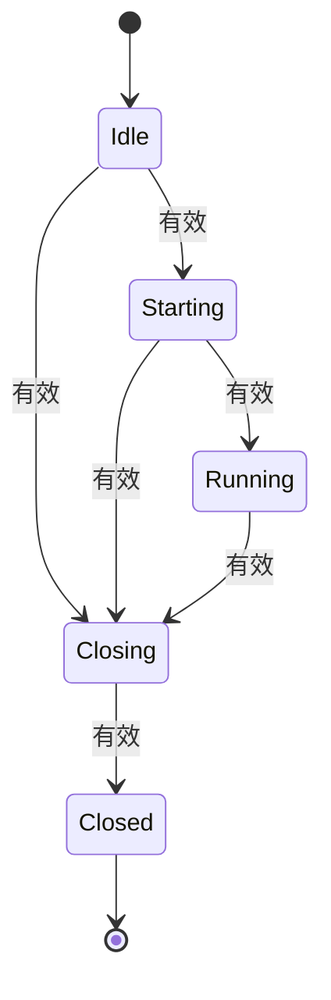
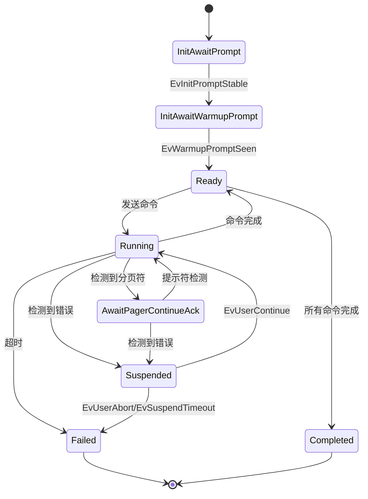

# 状态机逻辑分析与卡死风险评估报告

## 概述

本文档对 NetWeaverGo 项目中的状态机实现进行详细分析，识别潜在的逻辑问题和卡死风险。项目包含两个主要的状态机：

1. **引擎状态机** (`EngineStateManager`) - 管理全局引擎生命周期
2. **会话状态机** (`SessionReducer`) - 管理单个设备的命令执行会话

---

## 一、引擎状态机分析

### 1.1 状态定义与转移矩阵

**文件**: [`internal/engine/engine_state.go`](internal/engine/engine_state.go)

```
状态枚举:
- StateIdle (空闲)
- StateStarting (启动中)
- StateRunning (运行中)
- StateClosing (关闭中)
- StateClosed (已关闭)
```

**状态转移矩阵**:



### 1.2 发现的问题

#### 问题 1: 状态转移矩阵缺少从 Idle 直接到 Closing 的场景处理

**位置**: [`engine_state.go:39-55`](internal/engine/engine_state.go:39)

**问题描述**:
转移矩阵允许 `Idle -> Closing` 的转移，但在实际代码中，[`gracefulCloseWithCancel`](internal/engine/engine.go:326) 方法在 `closeOnce.Do()` 内部调用 `TransitionTo(StateClosing)`。如果引擎从未启动过（处于 Idle 状态），直接调用关闭方法会导致状态转移成功，但后续逻辑可能不一致。

**风险评估**: 低风险 - 代码中有 `closeOnce` 保护，不会重复关闭。

#### 问题 2: StateClosed 是终态但缺少重置机制

**位置**: [`engine_state.go:54`](internal/engine/engine_state.go:54)

**问题描述**:
`StateClosed` 状态定义为终态，不可转移到任何其他状态。但引擎实例是可复用的，如果需要重新启动已关闭的引擎，没有明确的状态重置方法。

**实际影响**: 查看 [`engine.go`](internal/engine/engine.go) 发现每次任务都会创建新的 `Engine` 实例（[`NewEngine`](internal/engine/engine.go:105)），因此这个问题不会导致卡死。

**风险评估**: 低风险 - 通过创建新实例规避。

---

## 二、会话状态机分析

### 2.1 状态定义

**文件**: [`internal/executor/session_types.go`](internal/executor/session_types.go)

```
状态枚举:
- NewStateInitAwaitPrompt (等待初始提示符)
- NewStateInitAwaitWarmupPrompt (等待预热后提示符)
- NewStateReady (就绪)
- NewStateRunning (命令执行中)
- NewStateAwaitPagerContinueAck (等待分页续页确认)
- NewStateAwaitFinalPromptConfirm (等待最终提示符确认)
- NewStateSuspended (挂起状态)
- NewStateCompleted (完成状态)
- NewStateFailed (失败状态)
```

### 2.2 状态转移图



### 2.3 发现的问题

#### 问题 1: NewStateAwaitFinalPromptConfirm 状态未使用

**位置**: [`session_types.go:36-37`](internal/executor/session_types.go:36)

**问题描述**:
定义了 `NewStateAwaitFinalPromptConfirm` 状态，但在 [`session_reducer.go`](internal/executor/session_reducer.go) 中：

- 只在 [`handleCommittedLine`](internal/executor/session_reducer.go:140) 和 [`handlePagerSeen`](internal/executor/session_reducer.go:150) 的 switch 语句中作为 case 分支出现
- 没有任何代码将状态转移**到** `NewStateAwaitFinalPromptConfirm`

**代码证据**:

```go
// session_reducer.go:139-145
switch r.state {
case NewStateRunning, NewStateAwaitPagerContinueAck, NewStateAwaitFinalPromptConfirm:
    return r.processPendingLines()
}
```

**风险评估**: 中风险 - 死代码可能导致维护困惑，但不影响运行时行为。

#### 问题 2: 分页状态转移可能导致状态不一致

**位置**: [`session_reducer.go:147-173`](internal/executor/session_reducer.go:147)

**问题描述**:
在 [`handlePagerSeen`](internal/executor/session_reducer.go:147) 中：

```go
case NewStateRunning, NewStateReady, NewStateAwaitFinalPromptConfirm:
    // ... 设置状态为 NewStateAwaitPagerContinueAck
    r.state = NewStateAwaitPagerContinueAck

case NewStateAwaitPagerContinueAck:
    // 已经在等待续页确认，记录新的分页符
    // ... 不改变状态
```

**潜在问题**:

- 在 `NewStateReady` 状态下检测到分页符会转移到 `NewStateAwaitPagerContinueAck`，但 `Ready` 状态意味着没有命令在执行，此时出现分页符可能是异常情况。
- 没有处理 `NewStateSuspended` 状态下的分页符事件。

**风险评估**: 低风险 - 实际运行中 `Ready` 状态下不太可能出现分页符。

#### 问题 3: processPendingLines 中的状态覆盖风险

**位置**: [`session_reducer.go:351-402`](internal/executor/session_reducer.go:351)

**问题描述**:
[`processPendingLines`](internal/executor/session_reducer.go:351) 方法会修改状态：

```go
func (r *SessionReducer) processPendingLines() []SessionAction {
    for r.ctx.HasPendingLines() {
        // ... 处理行
        if r.matcher.IsPromptStrict(line) {
            return r.completeCurrentCommand() // 这会设置状态为 Ready
        }
    }
    return actions
}
```

当在 `NewStateAwaitPagerContinueAck` 状态调用此方法时，如果检测到提示符，会调用 [`completeCurrentCommand`](internal/executor/session_reducer.go:341) 将状态设置为 `NewStateReady`，这是正确的。但如果同时检测到错误，状态会被设置为 `NewStateSuspended`，可能导致状态混乱。

**风险评估**: 低风险 - 逻辑正确，但代码路径复杂。

---

## 三、卡死风险分析

### 3.1 引擎层面卡死风险

#### 风险 1: RunBackup 中的信号量获取阻塞

**位置**: [`engine.go:426`](internal/engine/engine.go:426)

```go
for _, dev := range e.Devices {
    wg.Add(1)
    sem <- struct{}{}  // 阻塞获取信号量
    go func(device models.DeviceAsset) {
        defer func() { <-sem }()
        // ...
    }(dev)
}
```

**问题**: 与 [`Run`](internal/engine/engine.go:268) 方法不同，[`RunBackup`](internal/engine/engine.go:388) 中的信号量获取没有 Context 感知：

```go
// Run 方法有 Context 感知:
select {
case sem <- struct{}{}:
    // 获取成功
case <-e.ctx.Done():
    wg.Done()
    continue
}

// RunBackup 方法无 Context 感知:
sem <- struct{}{}  // 可能永久阻塞
```

**卡死场景**: 如果所有 worker 都阻塞在挂起状态（等待用户决策），而用户不响应，新的设备任务会阻塞在信号量获取上。

**风险评估**: **高风险** - 可能导致整个引擎卡死。

**建议修复**:

```go
select {
case sem <- struct{}{}:
    // 获取成功
case <-e.ctx.Done():
    wg.Done()
    logger.Debug("Engine", "-", "Context 已取消，跳过设备")
    continue
}
```

#### 风险 2: emitEvent 的 TOCTOU 已修复

**位置**: [`engine.go:148-192`](internal/engine/engine.go:148)

**现状**: 代码已正确处理 TOCTOU 问题：

```go
func (e *Engine) emitEvent(ev report.ExecutorEvent) {
    e.emitWg.Add(1)  // 先占位
    defer e.emitWg.Done()

    // 再检查 Context
    if e.ctx == nil {
        e.fallback.Push(ev)
        return
    }
    // ...
}
```

**风险评估**: 无风险 - 已正确修复。

### 3.2 会话层面卡死风险

#### 风险 1: 挂起状态无超时保护（已修复）

**位置**: [`suspend_manager.go:120`](internal/ui/suspend_manager.go:120)

**现状**: 挂起管理器有 5 分钟超时保护：

```go
case <-time.After(5 * time.Minute):
    session.timedOut.Store(true)
    // ... 发送超时事件
    return executor.ActionAbortTimeout
```

**风险评估**: 无风险 - 有超时保护。

#### 风险 2: StreamEngine 主循环中的通道阻塞

**位置**: [`stream_engine.go:183-313`](internal/executor/stream_engine.go:183)

**潜在问题**: 主事件循环中的 `readCh` 读取：

```go
case res, ok := <-readCh:
    // 处理读取结果
```

如果后台读取协程 panic 或意外退出，`readCh` 会被关闭，主循环会正确处理。但如果读取协程永远不发送数据也不退出（例如 SSH 连接挂起），主循环会阻塞在 `select` 上。

**缓解措施**: 有超时计时器保护：

```go
case <-timer.C:
    // 超时处理
```

**风险评估**: 低风险 - 有超时保护。

#### 风险 3: 初始化阶段的死循环风险

**位置**: [`stream_engine.go:601-666`](internal/executor/stream_engine.go:601)

**问题描述**: [`waitAndClearInitResidual`](internal/executor/stream_engine.go:601) 方法有一个循环等待初始化完成：

```go
for time.Now().Before(deadline) {
    // ... 读取数据
    // ... 处理状态机
    if e.initResidualCleared() {
        return nil
    }
}
```

**潜在问题**: 如果状态机永远无法进入 `Ready` 状态，循环会一直运行直到超时。

**缓解措施**: 有超时保护（`deadline`），超时后会清理残留并返回错误。

**风险评估**: 低风险 - 有超时保护。

### 3.3 状态机交互卡死风险

#### 风险 1: SuspendManager 与 SessionReducer 的交互

**场景描述**:

1. `SessionReducer` 进入 `NewStateSuspended` 状态
2. 返回 `ActRequestSuspendDecision` 动作
3. `StreamEngine` 调用 `SuspendHandler` 等待用户决策
4. `SuspendManager` 等待前端响应或超时

**潜在问题**: 如果前端响应丢失或延迟，`SuspendManager` 会等待 5 分钟后超时。

**风险评估**: 低风险 - 有超时保护。

#### 风险 2: 多设备并发挂起的资源耗尽

**场景描述**:

1. 多个设备同时触发错误
2. 每个设备都会创建一个 `SuspendSession`
3. 所有设备都等待用户决策

**潜在问题**: 如果用户不响应，所有设备都会阻塞 5 分钟。

**缓解措施**: `SuspendManager` 有会话清理逻辑：

```go
// 清理该 IP 的旧会话
if oldSessionID, exists := m.sessionsByIP[ip]; exists {
    // ... 终止旧会话
}
```

**风险评估**: 中风险 - 可能导致大量资源占用，但不会卡死。

---

## 四、状态机完整性检查

### 4.1 引擎状态机完整性

| 检查项       | 状态 | 说明                     |
| ------------ | ---- | ------------------------ |
| 所有状态可达 | ✅   | 所有状态都有可达路径     |
| 无孤立状态   | ✅   | 所有定义的状态都被使用   |
| 终态正确     | ✅   | `StateClosed` 是唯一终态 |
| 转移完整     | ✅   | 所有必要转移都已定义     |

### 4.2 会话状态机完整性

| 检查项       | 状态 | 说明                                           |
| ------------ | ---- | ---------------------------------------------- |
| 所有状态可达 | ⚠️   | `NewStateAwaitFinalPromptConfirm` 未被使用     |
| 无孤立状态   | ⚠️   | `NewStateAwaitFinalPromptConfirm` 是死代码     |
| 终态正确     | ✅   | `NewStateCompleted` 和 `NewStateFailed` 是终态 |
| 转移完整     | ⚠️   | 部分状态缺少错误处理转移                       |

---

## 五、建议修复清单

### 高优先级

1. **修复 RunBackup 中的信号量获取阻塞**
   - 文件: [`engine.go:426`](internal/engine/engine.go:426)
   - 添加 Context 感知的信号量获取

### 中优先级

2. **移除或实现 NewStateAwaitFinalPromptConfirm**
   - 文件: [`session_types.go:36-37`](internal/executor/session_types.go:36)
   - 如果不需要此状态，应移除以避免维护困惑

3. **添加分页符在异常状态下的处理**
   - 文件: [`session_reducer.go:147-173`](internal/executor/session_reducer.go:147)
   - 考虑 `NewStateSuspended` 状态下的分页符处理

### 低优先级

4. **添加状态机不变量断言**
   - 在关键状态转移处添加断言检查
   - 便于调试和问题定位

5. **完善状态转移日志**
   - 记录所有状态转移的详细信息
   - 便于问题排查

---

## 六、总结

### 整体评估

项目的状态机实现整体质量较高，主要优点：

1. **清晰的状态定义**: 状态枚举明确，语义清晰
2. **完善的超时保护**: 大部分阻塞操作都有超时保护
3. **正确处理并发**: 使用 `sync.Once`、`sync.WaitGroup` 等同步原语
4. **TOCTOU 问题已修复**: `emitEvent` 正确处理了竞态条件

### 主要风险

| 风险                 | 严重程度 | 状态     |
| -------------------- | -------- | -------- |
| RunBackup 信号量阻塞 | 高       | 需修复   |
| 死代码状态           | 中       | 建议清理 |
| 多设备并发挂起       | 中       | 可接受   |

### 建议行动

1. 立即修复 `RunBackup` 中的信号量获取问题
2. 清理 `NewStateAwaitFinalPromptConfirm` 死代码
3. 添加更多的状态转移日志便于调试
