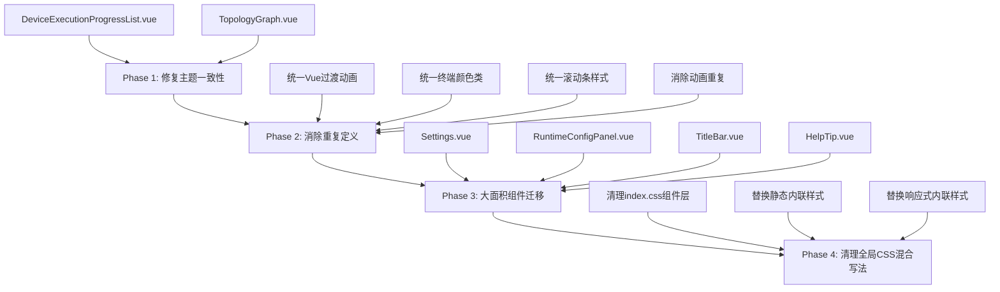

# Tailwind CSS 迁移修复方案

> **文档版本**: v1.0  
> **创建日期**: 2026-04-21  
> **关联文档**: [tailwind-migration-audit.md](./tailwind-migration-audit.md)

---

## 一、迁移策略总览

本方案采用**分阶段、渐进式**迁移策略，优先修复影响主题一致性的关键问题，再逐步消除重复定义，最后完成大面积组件迁移。



---

## 二、Phase 1: 修复主题一致性问题

### 2.1 重构 DeviceExecutionProgressList.vue

**问题**: 该组件大量使用硬编码颜色值，导致暗黑模式切换时颜色不跟随变化。

**文件**: [`frontend/src/components/task/DeviceExecutionProgressList.vue`](frontend/src/components/task/DeviceExecutionProgressList.vue:158)

**修改方案**:

#### Step 1: 将 `<style scoped>` 改为 `lang="postcss"`

```vue
<!-- 修改前 -->
<style scoped>
.device-progress-list {
  display: flex;
  flex-direction: column;
  gap: 12px;
}
<!-- ... -->

<!-- 修改后 -->
<style scoped lang="postcss">
@reference "../../styles/index.css";

.device-progress-list {
  @apply flex flex-col gap-3;
}
```

#### Step 2: 替换硬编码颜色为语义化变量

| 原硬编码值 | 语义化变量 | 用途 |
|-----------|-----------|------|
| `#8b949e` | `var(--color-text-muted)` | 弱化文字 |
| `#e6edf3` | `var(--color-text-primary)` | 主文字 |
| `#58a6ff` | `var(--color-accent-primary)` | 主强调色 |
| `#3fb950` | `var(--color-success)` | 成功状态 |
| `#f85149` | `var(--color-error)` | 错误状态 |
| `#d29922` | `var(--color-warning)` | 警告状态 |
| `#161b22` | `var(--color-bg-secondary)` | 次背景 |
| `#21262d` | `var(--color-bg-tertiary)` | 第三背景 |
| `#2d333b` | `var(--color-border-default)` | 默认边框 |

#### Step 3: 完整重构后的样式代码

```postcss
<style scoped lang="postcss">
@reference "../../styles/index.css";

/* 容器 */
.device-progress-list {
  @apply flex flex-col gap-3;
}

/* 加载/空状态 */
.loading-state,
.empty-state {
  @apply flex flex-col items-center justify-center p-10 text-text-muted;
}

.empty-state svg {
  @apply mb-3 opacity-50;
}

.empty-state p {
  @apply m-0 text-sm;
}

/* 加载动画 */
.spinner {
  @apply w-8 h-8 mb-3 rounded-full;
  border: 3px solid var(--color-border-default);
  border-top-color: var(--color-accent-primary);
  animation: spin 1s linear infinite;
}

@keyframes spin {
  to {
    transform: rotate(360deg);
  }
}

/* 设备列表容器 */
.devices-container {
  @apply flex flex-col gap-2 max-h-[400px] overflow-y-auto;
}

/* 设备卡片 */
.device-card {
  @apply p-3 bg-bg-secondary border border-border rounded-lg cursor-pointer;
  @apply transition-all duration-200;
}

.device-card:hover {
  @apply border-accent bg-bg-tertiary;
}

.device-card.selected {
  @apply border-accent;
  background: var(--color-accent-bg);
  box-shadow: 0 0 0 2px var(--color-accent-glow);
}

/* 设备头部 */
.device-header {
  @apply flex justify-between items-center mb-2;
}

.device-info {
  @apply flex items-center gap-2;
}

.device-ip {
  @apply font-semibold text-text-primary font-mono;
}

/* 状态徽章 */
.device-status-badge {
  @apply px-2 py-0.5 rounded text-[11px] font-medium;
}

.device-status-badge.status-pending {
  background: var(--color-bg-hover);
  @apply text-text-muted;
}

.device-status-badge.status-running {
  background: var(--color-accent-bg);
  @apply text-accent;
}

.device-status-badge.status-completed {
  background: var(--color-success-bg);
  @apply text-success;
}

.device-status-badge.status-failed,
.device-status-badge.status-cancelled {
  background: var(--color-error-bg);
  @apply text-error;
}

.device-status-badge.status-partial {
  background: var(--color-warning-bg);
  @apply text-warning;
}

/* 进度文本 */
.device-progress-text {
  @apply text-xs text-text-secondary font-mono;
}

/* 进度条容器 */
.progress-bar-container {
  @apply h-1.5 bg-bg-tertiary rounded overflow-hidden mb-2;
}

/* 进度条 */
.progress-bar {
  @apply h-full rounded transition-[width] duration-300;
}

.progress-bar.status-pending {
  @apply bg-text-muted;
}

.progress-bar.status-running {
  @apply bg-accent;
}

.progress-bar.status-completed {
  @apply bg-success;
}

.progress-bar.status-failed,
.progress-bar.status-cancelled {
  @apply bg-error;
}

.progress-bar.status-partial {
  @apply bg-warning;
}

/* 错误信息 */
.device-error {
  @apply flex items-center gap-1.5 p-2 rounded mt-2 text-xs text-error;
  background: var(--color-error-bg);
}

/* 时间信息 */
.device-time-info {
  @apply flex gap-4 mt-2 text-[11px] text-text-secondary;
}
</style>
```

---

### 2.2 修复 TopologyGraph.vue 非标准变量

**问题**: 使用了未定义的 `--bg-panel` 变量。

**文件**: [`frontend/src/components/topology/TopologyGraph.vue`](frontend/src/components/topology/TopologyGraph.vue:354)

**修改方案**:

```vue
<!-- 修改前 -->
<style scoped>
.topology-graph-container {
  position: relative;
  width: 100%;
  height: 100%;
  min-height: 500px;
  background: var(--bg-panel);
  border-radius: 0.5rem;
}

.cy-container {
  width: 100%;
  height: 100%;
  min-height: 500px;
}
</style>

<!-- 修改后 -->
<style scoped lang="postcss">
@reference "../../styles/index.css";

.topology-graph-container {
  @apply relative w-full h-full min-h-[500px] bg-bg-panel rounded-lg;
}

.cy-container {
  @apply w-full h-full min-h-[500px];
}
</style>
```

---

## 三、Phase 2: 消除重复定义

### 3.1 统一 Vue 过渡动画

**目标**: 将分散在13个组件中的51处过渡动画定义统一到全局 [`_animations.css`](frontend/src/styles/utilities/_animations.css:287)。

#### Step 1: 确认全局过渡动画已定义

[`_animations.css`](frontend/src/styles/utilities/_animations.css:287) 已包含以下过渡类（第287-355行）：

- `modal-enter-active` / `modal-leave-active` / `modal-enter-from` / `modal-leave-to`
- `fade-enter-active` / `fade-leave-active` / `fade-enter-from` / `fade-leave-to`
- `slide-enter-active` / `slide-leave-active` / `slide-enter-from` / `slide-leave-to`
- `toast-enter-active` / `toast-leave-active` / `toast-enter-from` / `toast-leave-to`
- `drawer-enter-active` / `drawer-leave-active` / `drawer-enter-from` / `drawer-leave-to`

#### Step 2: 添加缺失的过渡动画

在 [`_animations.css`](frontend/src/styles/utilities/_animations.css:355) 末尾添加：

```postcss
/* algo-modal 过渡 - 用于 Settings.vue */
.algo-modal-enter-active,
.algo-modal-leave-active {
  transition: opacity 0.2s ease;
}

.algo-modal-enter-from,
.algo-modal-leave-to {
  opacity: 0;
}
```

#### Step 3: 删除组件内重复的过渡定义

以下组件需删除 `<style scoped>` 中的过渡动画定义：

| 组件 | 删除内容 |
|------|----------|
| [`Commands.vue`](frontend/src/views/Commands.vue:834) | `.modal-*` 和 `.toast-*` 类 |
| [`TaskExecution.vue`](frontend/src/views/TaskExecution.vue:2001) | `.modal-*` 和 `.toast-*` 类 |
| [`Tasks.vue`](frontend/src/views/Tasks.vue:1119) | `.modal-*` 和 `.toast-*` 类 |
| [`GlobalToast.vue`](frontend/src/components/common/GlobalToast.vue:58) | `.toast-*` 类 |
| [`TopologyDeviceDetailModal.vue`](frontend/src/components/topology/TopologyDeviceDetailModal.vue:198) | `.modal-*` 类 |
| [`TopologyEdgeDetailModal.vue`](frontend/src/components/topology/TopologyEdgeDetailModal.vue:237) | `.modal-*` 类 |
| [`TaskDetailModal.vue`](frontend/src/components/task/TaskDetailModal.vue:313) | `.modal-*` 类 |
| [`TaskEditModal.vue`](frontend/src/components/task/TaskEditModal.vue:1329) | `.modal-*` 类 |
| [`IPv4Calc.vue`](frontend/src/components/network/IPv4Calc.vue:599) | `.fade-*` 类 |
| [`IPv6Calc.vue`](frontend/src/components/network/IPv6Calc.vue:487) | `.fade-*` 类 |
| [`NetworkCalc.vue`](frontend/src/views/Tools/NetworkCalc.vue:48) | `.fade-*` 类 |
| [`CommandGroupSelector.vue`](frontend/src/components/task/CommandGroupSelector.vue:173) | `.slide-*` 类 |
| [`DeviceSelector.vue`](frontend/src/components/task/DeviceSelector.vue:348) | `.slide-*` 类 |
| [`CommandEditor.vue`](frontend/src/components/task/CommandEditor.vue:267) | `.slide-*` 类 |
| [`Settings.vue`](frontend/src/views/Settings.vue:1096) | `.algo-modal-*` 类 |

---

### 3.2 统一终端颜色类

**目标**: 将 `.bg-terminal-bg` 和 `.text-terminal-text` 移入全局组件层。

#### Step 1: 在 [`index.css`](frontend/src/styles/index.css:720) 的 `@layer components` 末尾添加

```postcss
/* ===== 终端颜色 ===== */

.bg-terminal-bg {
  background-color: var(--color-terminal-bg);
}

.text-terminal-text {
  color: var(--color-terminal-text);
}
```

#### Step 2: 删除组件内重复定义

| 组件 | 删除内容 |
|------|----------|
| [`Commands.vue`](frontend/src/views/Commands.vue:859) | `.bg-terminal-bg` 和 `.text-terminal-text` |
| [`CommandEditor.vue`](frontend/src/components/task/CommandEditor.vue:288) | `.bg-terminal-bg` 和 `.text-terminal-text` |
| [`TaskDetailModal.vue`](frontend/src/components/task/TaskDetailModal.vue:323) | `.bg-terminal-bg` 和 `.text-terminal-text` |
| [`TaskEditModal.vue`](frontend/src/components/task/TaskEditModal.vue:1339) | `.bg-terminal-bg` 和 `.text-terminal-text` |

---

### 3.3 统一滚动条样式

**目标**: 删除组件内硬编码的滚动条样式，使用全局 `.scrollbar-custom`。

#### Step 1: 确认全局滚动条样式

[`_scrollbar.css`](frontend/src/styles/utilities/_scrollbar.css:27) 已定义 `.scrollbar-custom` 类。

#### Step 2: 修改组件使用全局类

**TopologyDeviceDetailModal.vue**:

```vue
<!-- 修改前 -->
<div class="... custom-scrollbar-style">
  ...
</div>

<style scoped>
.scrollbar-custom::-webkit-scrollbar {
  width: 6px;
}
/* ... 硬编码颜色 ... */
</style>

<!-- 修改后 -->
<div class="... scrollbar-custom">
  ...
</div>

<!-- 删除 <style scoped> 中的滚动条样式 -->
```

**TopologyEdgeDetailModal.vue**: 同样处理。

---

### 3.4 消除动画和工具类重复

#### RouteLoading.vue

**修改前**:
```vue
<style scoped>
.route-loading-container {
  display: flex;
  align-items: center;
  justify-content: center;
  min-height: 200px;
  width: 100%;
}

.route-loading-spinner {
  width: 2rem;
  height: 2rem;
  border: 2px solid var(--accent, #3b82f6);
  border-top-color: transparent;
  border-radius: 50%;
  animation: spin 0.8s linear infinite;
}

@keyframes spin {
  to {
    transform: rotate(360deg);
  }
}
</style>
```

**修改后**:
```vue
<style scoped lang="postcss">
@reference "../../styles/index.css";

.route-loading-container {
  @apply flex items-center justify-center min-h-[200px] w-full;
}

.route-loading-spinner {
  @apply w-8 h-8 rounded-full;
  border: 2px solid var(--color-accent-primary);
  border-top-color: transparent;
  @apply animate-spin;
}
</style>
```

#### BatchPing.vue

**修改前**:
```vue
<style scoped>
.glass {
  backdrop-filter: blur(10px);
}

.shadow-card {
  box-shadow: 0 4px 6px -1px rgba(0, 0, 0, 0.1), 0 2px 4px -1px rgba(0, 0, 0, 0.06);
}

.ping-animation {
  animation: bounce 0.5s ease-in-out infinite;
}

@keyframes bounce {
  0%, 100% { transform: translateY(0); }
  50% { transform: translateY(-3px); }
}
</style>
```

**修改后**:
```vue
<style scoped lang="postcss">
@reference "../../styles/index.css";

/* 使用全局 glass-panel 或直接在模板中使用 backdrop-blur-[10px] */
.ping-animation {
  animation: bounce 0.5s ease-in-out infinite;
}

@keyframes bounce {
  0%, 100% { transform: translateY(0); }
  50% { transform: translateY(-3px); }
}
</style>
```

**模板修改**:
```vue
<!-- 修改前 -->
<div class="glass shadow-card">

<!-- 修改后 -->
<div class="backdrop-blur-[10px] shadow-lg">
```

#### ThemeSwitch.vue

**问题**: 使用了自定义悬停旋转动画。

**修改方案**: 删除 `<style scoped>` 中的动画，直接在模板中使用 Tailwind 类：

```vue
<!-- 修改前 -->
<button class="...">
  <svg class="..."></svg>
</button>

<style scoped>
button svg { transition: transform 0.3s ease; }
button:hover svg { transform: rotate(15deg); }
</style>

<!-- 修改后 -->
<button class="... group">
  <svg class="... transition-transform duration-300 group-hover:rotate-[15deg]"></svg>
</button>
<!-- 完全删除 <style scoped> -->
```

#### Commands.vue

**问题**: 重复定义了 Tailwind 已有的 `.line-clamp-1` 和 `.line-clamp-2` 类。

**修改方案**: 直接从 `<style scoped>` 中删除 `.line-clamp-1` 和 `.line-clamp-2` 的定义，无需修改模板，因为模板中已经使用了这些类名。

#### CommandEditor.vue

**问题**: 定义了 `.command-editor { display: inline-flex; }`。

**修改方案**: 删除该类的定义，并在模板的根节点直接添加 `inline-flex` 类。

```vue
<!-- 修改前 -->
<div class="command-editor">

<!-- 修改后 -->
<div class="inline-flex">
```

---

## 四、Phase 3: 大面积组件迁移

### 4.1 迁移 Settings.vue

**文件**: [`frontend/src/views/Settings.vue`](frontend/src/views/Settings.vue:731)

**修改方案**: 将 `<style scoped>` 改为 `lang="postcss"`，使用 `@apply` 重构所有自定义类。

#### 核心类重构示例

```postcss
<style scoped lang="postcss">
@reference "../styles/index.css";

/* 页面容器 */
.settings-page {
  @apply flex flex-col gap-5 max-w-[1400px] mx-auto pb-4;
}

/* 页面头部 */
.settings-page-header {
  @apply flex items-end justify-between gap-4 pt-1 pl-1;
}

.settings-page-title {
  @apply text-[1.35rem] font-bold tracking-tight text-text-primary;
}

.settings-page-subtitle {
  @apply text-[0.82rem] text-text-muted;
}

.settings-page-badge {
  @apply px-2.5 py-1.5 rounded-full border border-border bg-bg-secondary;
  @apply text-text-secondary text-[0.72rem] tracking-wide uppercase;
}

/* 加载状态 */
.settings-loading {
  @apply min-h-[220px] border border-border rounded-xl bg-bg-secondary;
  @apply flex items-center justify-center;
}

/* 内容区域 */
.settings-content {
  @apply flex flex-col gap-5;
}

/* 网格布局 */
.global-settings-panels-flow {
  @apply grid gap-4;
  grid-template-columns: repeat(auto-fit, minmax(330px, 1fr));
}

.settings-auto-grid {
  @apply grid gap-3.5 items-start;
  grid-template-columns: repeat(auto-fit, minmax(220px, 1fr));
}

.settings-auto-grid > * {
  @apply min-w-0;
}

/* 卡片 */
.settings-card {
  @apply w-full overflow-visible rounded-xl border border-border bg-bg-secondary;
  @apply shadow-sm transition-shadow duration-200 transition-colors;
}

.settings-card:hover {
  @apply shadow-md border-border-focus;
}

/* 表单元素 */
.settings-panel-card :is(input:not([type="checkbox"]):not([type="radio"]), select) {
  @apply w-full min-h-[2.35rem] rounded-xl border border-border bg-bg-primary;
  @apply px-3.5 transition-colors duration-200;
}

.settings-panel-card :is(input:not([type="checkbox"]):not([type="radio"]), select):focus {
  @apply border-accent;
  box-shadow: 0 0 0 3px var(--color-accent-bg);
}

.settings-panel-card :is(label) {
  @apply text-[0.76rem] font-semibold text-text-secondary;
}

.settings-label {
  @apply inline-flex items-center gap-1.5 text-[0.76rem] font-semibold text-text-secondary;
}

/* 算法配置区域 */
.algo-custom-summary {
  @apply border border-border rounded-xl p-3.5 flex flex-col gap-3;
  background: color-mix(in srgb, var(--color-bg-secondary) 70%, transparent);
}

.algo-summary-grid {
  @apply grid gap-2.5;
  grid-template-columns: repeat(auto-fit, minmax(180px, 1fr));
}

.algo-summary-item {
  @apply border border-border rounded-[0.65rem] p-2 px-2.5 bg-bg-primary;
}

.algo-summary-title {
  @apply text-[0.74rem] text-text-secondary leading-tight;
}

.algo-summary-count {
  @apply mt-1 text-[0.72rem] text-text-muted;
}

.algo-open-modal-btn {
  @apply self-start border border-accent rounded-[0.65rem];
  @apply text-[0.78rem] font-semibold px-2 py-1.5;
  @apply transition-colors duration-200;
  background: color-mix(in srgb, var(--color-accent) 14%, transparent);
  @apply text-accent;
}

.algo-open-modal-btn:hover {
  background: color-mix(in srgb, var(--color-accent) 24%, transparent);
}

/* 算法区块 */
.algo-section {
  @apply border border-border rounded-xl p-3;
  background: color-mix(in srgb, var(--color-bg-secondary) 70%, transparent);
}

.algo-toolbar {
  @apply flex gap-2 items-center;
}

.algo-search-input {
  @apply flex-1 min-h-8 rounded-[0.65rem] border border-border bg-bg-primary;
  @apply text-text-primary px-2.5 py-1.5 text-sm;
}

.algo-action-btn {
  @apply border border-border bg-bg-secondary text-text-secondary;
  @apply rounded-[0.6rem] text-[0.75rem] px-2 py-1;
  @apply transition-colors duration-200;
}

.algo-action-btn:hover {
  @apply border-border-focus text-text-primary;
}

.algo-count-line {
  @apply text-[0.72rem] text-text-muted;
}

.algo-options-list {
  @apply max-h-44 overflow-y-auto border border-border rounded-[0.65rem] bg-bg-primary;
}

.algo-option-item {
  @apply flex items-center gap-2 px-2.5 py-1.5 cursor-pointer;
  border-bottom: 1px solid color-mix(in srgb, var(--color-border-default) 70%, transparent);
}

.algo-option-item:last-child {
  border-bottom: none;
}

.algo-option-item:hover {
  background: color-mix(in srgb, var(--color-accent) 7%, transparent);
}

.algo-option-checkbox {
  @apply w-3.5 h-3.5 flex-shrink-0;
  accent-color: var(--color-accent);
}

.algo-option-name {
  @apply flex-1 min-w-0 text-[0.78rem] text-text-primary font-mono;
  @apply break-all;
}

.algo-badge {
  @apply text-[0.65rem] rounded-full px-1.5 py-0.5 leading-tight;
}

.algo-badge-secure {
  background: color-mix(in srgb, var(--color-success) 15%, transparent);
  @apply text-success;
}

.algo-badge-insecure {
  background: color-mix(in srgb, var(--color-warning) 20%, transparent);
  @apply text-warning;
}

.algo-badge-legacy {
  background: color-mix(in srgb, var(--color-info) 18%, transparent);
  @apply text-info;
}

.algo-empty {
  @apply p-3 text-center text-[0.75rem] text-text-muted;
}

/* 算法模态框 */
.algo-modal-overlay {
  @apply fixed inset-0 z-[1300] flex items-center justify-center;
  @apply bg-black/55 p-4;
}

.algo-modal-panel {
  @apply w-[min(1120px,96vw)] max-h-[88vh] flex flex-col;
}

.algo-modal-panel:hover {
  @apply shadow-2xl border-border;
}

.algo-modal-header {
  @apply flex items-center justify-between gap-4 px-4 py-4;
  @apply border-b border-border;
}

.algo-modal-title {
  @apply text-[0.95rem] font-bold text-text-primary;
}

.algo-modal-subtitle {
  @apply mt-1 text-[0.75rem] text-text-muted;
}

.algo-modal-close {
  @apply border border-border bg-bg-primary text-text-secondary;
  @apply rounded-[0.6rem] text-[0.75rem] px-2 py-1;
  @apply transition-colors duration-200;
}

.algo-modal-close:hover {
  @apply text-text-primary border-border-focus;
}

.algo-modal-body {
  @apply overflow-y-auto p-4;
}

.algo-modal-grid {
  @apply grid gap-3;
  grid-template-columns: repeat(2, minmax(0, 1fr));
}

.algo-modal-body .algo-options-list {
  @apply max-h-60;
}

/* 操作按钮区域 */
.settings-actions {
  @apply sticky bottom-0 z-[5] flex justify-end gap-3 p-3;
  @apply border border-border rounded-xl;
  background: color-mix(in srgb, var(--color-bg-primary) 84%, transparent);
  @apply backdrop-blur-sm;
}

.runtime-panel-wrap {
  @apply border-t border-border pt-4;
}

/* 响应式 */
@media (max-width: 960px) {
  .settings-page-header {
    @apply flex-col items-start;
  }

  .global-settings-panels-flow {
    grid-template-columns: 1fr;
  }

  .settings-actions {
    @apply static flex-wrap justify-start;
  }

  .algo-modal-grid {
    grid-template-columns: 1fr;
  }
}
</style>
```

---

### 4.2 迁移 RuntimeConfigPanel.vue

**文件**: [`frontend/src/components/settings/RuntimeConfigPanel.vue`](frontend/src/components/settings/RuntimeConfigPanel.vue:761)

**修改方案**: 与 Settings.vue 类似，使用 `lang="postcss"` + `@apply` 重构。

```postcss
<style scoped lang="postcss">
@reference "../../styles/index.css";

.runtime-config-panel {
  @apply w-full max-w-none;
}

.runtime-shell {
  @apply flex flex-col gap-4 max-w-[1400px] mx-auto;
}

.runtime-header {
  @apply flex items-center gap-2;
}

.runtime-title {
  @apply text-base font-bold tracking-tight text-text-primary;
}

.runtime-subtitle {
  @apply text-[0.78rem] text-text-muted m-0;
}

.runtime-settings-panels-flow {
  @apply grid gap-4 mb-2;
  grid-template-columns: repeat(auto-fit, minmax(330px, 1fr));
}

.settings-auto-grid {
  @apply grid gap-3.5 items-start;
  grid-template-columns: repeat(auto-fit, minmax(220px, 1fr));
}

.settings-auto-grid > * {
  @apply min-w-0;
}

.settings-panel-card {
  @apply w-full;
}

.runtime-card {
  @apply w-full overflow-visible rounded-xl border border-border bg-bg-secondary;
  @apply shadow-sm transition-shadow duration-200 transition-colors;
}

.runtime-card:hover {
  @apply shadow-md border-border-focus;
}

.settings-panel-card :is(input:not([type="checkbox"]):not([type="radio"]), select) {
  @apply w-full min-h-[2.35rem] rounded-xl border border-border bg-bg-primary;
  @apply px-3.5 transition-colors duration-200;
}

.settings-panel-card :is(input:not([type="checkbox"]):not([type="radio"]), select):focus {
  @apply border-accent;
  box-shadow: 0 0 0 3px var(--color-accent-bg);
}

.settings-panel-card :is(label) {
  @apply text-[0.76rem] font-semibold text-text-secondary;
}

.settings-label {
  @apply inline-flex items-center gap-1.5 text-[0.76rem] font-semibold text-text-secondary;
}

.settings-panel-card :is(p.text-xs) {
  @apply leading-relaxed;
}

.runtime-actions {
  @apply sticky bottom-0 z-[5] flex justify-end gap-3 p-3;
  @apply border border-border rounded-xl;
  background: color-mix(in srgb, var(--color-bg-primary) 84%, transparent);
  @apply backdrop-blur-sm;
}

@media (max-width: 960px) {
  .runtime-settings-panels-flow {
    grid-template-columns: 1fr;
  }

  .runtime-actions {
    @apply static flex-wrap justify-start;
  }
}
</style>
```

---

### 4.3 迁移 TitleBar.vue

**文件**: [`frontend/src/components/common/TitleBar.vue`](frontend/src/components/common/TitleBar.vue:220)

```postcss
<style scoped lang="postcss">
@reference "../../styles/index.css";

.titlebar {
  @apply flex items-center justify-between h-8 pl-3;
  @apply bg-bg-secondary border-b border-border-muted;
  @apply select-none shrink-0 cursor-default;
}

.titlebar-left {
  @apply flex items-center gap-2;
}

.titlebar-logo {
  @apply flex items-center justify-center w-5 h-5 rounded;
  @apply bg-accent text-white;
}

.titlebar-logo svg {
  @apply w-3 h-3;
}

.titlebar-title {
  @apply text-xs font-medium text-text-secondary tracking-wide;
}

.titlebar-controls {
  @apply flex items-stretch h-full;
  --wails-draggable: no-drag;
}

.titlebar-btn {
  @apply flex items-center justify-center w-[46px] h-full p-0;
  @apply border-none bg-transparent text-text-secondary;
  @apply cursor-pointer transition-colors duration-150;
}

.titlebar-btn svg {
  @apply w-4 h-4;
}

.titlebar-btn:hover {
  @apply bg-bg-hover text-text-primary;
}

.titlebar-btn-close:hover {
  @apply bg-[#e81123] text-white;
}
</style>
```

---

### 4.4 迁移 HelpTip.vue

**文件**: [`frontend/src/components/common/HelpTip.vue`](frontend/src/components/common/HelpTip.vue:14)

**注意**: 该组件包含伪元素 `::after`，部分样式需保留原始 CSS。

```postcss
<style scoped lang="postcss">
@reference "../../styles/index.css";

.help-tip {
  @apply relative inline-flex items-center justify-center align-middle;
  @apply cursor-help outline-none z-[120];
}

.help-tip-icon {
  @apply w-4 h-4 rounded-full border border-border bg-bg-panel;
  @apply text-text-muted text-[11px] leading-none font-bold;
  @apply inline-flex items-center justify-center;
  @apply transition-colors duration-200;
}

.help-tip-bubble {
  @apply absolute left-0 w-max max-w-[260px] p-2 px-2.5;
  @apply rounded-[10px] border border-border bg-bg-primary;
  @apply text-text-primary text-xs leading-relaxed;
  @apply whitespace-normal opacity-0 pointer-events-none z-[200];
  @apply transition-opacity duration-200;
  bottom: calc(100% + 10px);
  transform: translateY(4px);
  box-shadow: 0 10px 24px rgba(0, 0, 0, 0.15);
}

/* 伪元素 - 需保留原始 CSS */
.help-tip-bubble::after {
  content: "";
  position: absolute;
  left: 8px;
  top: 100%;
  border: 6px solid transparent;
  border-top-color: var(--color-bg-primary);
}

.help-tip:hover .help-tip-icon,
.help-tip:focus-visible .help-tip-icon {
  @apply border-accent text-accent;
}

.help-tip:hover .help-tip-bubble,
.help-tip:focus-visible .help-tip-bubble {
  @apply opacity-100;
  transform: translateY(0);
}
</style>
```

---

## 五、Phase 4: 清理全局 CSS 混合写法

### 5.1 清理 index.css 组件层

**文件**: [`frontend/src/styles/index.css`](frontend/src/styles/index.css:141)

**修改方案**: 将所有原始 CSS 属性转为 `@apply` 或 Tailwind 任意值语法。

#### 需要修改的位置

| 行号 | 原代码 | 修改后 |
|------|--------|--------|
| 186 | `box-shadow: 0 0 15px rgba(34, 197, 94, 0.4);` | `@apply shadow-[0_0_15px_rgba(34,197,94,0.4)];` |
| 197-198 | `backdrop-filter: blur(4px);` | `@apply backdrop-blur-[4px];` |
| 211 | `transform: scale(0.95); opacity: 0;` | `@apply scale-95 opacity-0;` |
| 228-229 | `backdrop-filter: blur(20px);` | `@apply backdrop-blur-[20px];` |
| 253 | `max-height: calc(90vh - 140px);` | `@apply max-h-[calc(90vh-140px)];` |
| 276-279 | `backdrop-filter` + `box-shadow` | `@apply backdrop-blur-[12px];` + shadow 令牌 |
| 288-289 | `backdrop-filter: blur(12px);` | `@apply backdrop-blur-[12px];` |
| 312 | `box-shadow: 0 0 0 3px var(--color-accent-bg);` | `@apply shadow-[0_0_0_3px_var(--color-accent-bg)];` |
| 359 | `transform: translateY(-10px); opacity: 0;` | `@apply -translate-y-[10px] opacity-0;` |
| 500-501 | `backdrop-filter: blur(4px);` | `@apply backdrop-blur-[4px];` |
| 514-515 | `backdrop-filter: blur(4px);` | `@apply backdrop-blur-[4px];` |
| 577 | `border-bottom: none;` | `@apply border-b-0;` |
| 626 | `transform: translateX(4px);` | `@apply translate-x-1;` |
| 711 | `grid-template-columns: repeat(auto-fit, minmax(200px, 1fr));` | `@apply grid-cols-[repeat(auto-fit,minmax(200px,1fr))];` |

---

### 5.2 替换静态内联样式

#### Commands.vue (行328)

```vue
<!-- 修改前 -->
<div class="..." style="width: 700px; height: 600px;">

<!-- 修改后 -->
<div class="... w-[700px] h-[600px]">
```

#### ExecutionRecordDetail.vue (行78)

```vue
<!-- 修改前 -->
<div class="grid gap-3" style="grid-template-columns: repeat(auto-fit, minmax(100px, 1fr));">

<!-- 修改后 -->
<div class="grid gap-3 grid-cols-[repeat(auto-fit,minmax(100px,1fr))]">
```

#### VariablesPanel.vue (行107)

```vue
<!-- 修改前 -->
<input class="..." style="width: 150px">

<!-- 修改后 -->
<input class="... w-[150px]">
```

---

### 5.3 替换响应式内联样式

**文件**: [`frontend/src/views/Tools/ConfigForge.vue`](frontend/src/views/Tools/ConfigForge.vue:266)

**修改方案**: 将 `windowWidth` 判断改为 Tailwind 响应式前缀。

```vue
<!-- 修改前 -->
<TemplateEditor
  v-model="templateText"
  :style="{
    width: windowWidth < 768 ? '100%' : 'auto',
  }"
/>

<VariablesPanel
  v-model:ipBindingEnabled="ipBindingEnabled"
  :style="{
    width: windowWidth < 768 ? '100%' : 'auto',
  }"
/>

<OutputPreview
  :is-copied="isCopied"
  :style="{
    width: windowWidth < 768 ? '100%' : 'auto',
  }"
/>

<!-- 修改后 -->
<TemplateEditor
  v-model="templateText"
  class="w-full md:w-auto"
/>

<VariablesPanel
  v-model:ipBindingEnabled="ipBindingEnabled"
  class="w-full md:w-auto"
/>

<OutputPreview
  :is-copied="isCopied"
  class="w-full md:w-auto"
/>
```

**同时删除** `<script>` 中的 `windowWidth` 响应式变量和 `onResize` 事件监听（如果仅用于此目的）。

---

## 六、迁移验证清单

完成迁移后，请按以下清单验证：

### 功能验证

- [ ] 暗黑模式切换正常，所有组件颜色跟随变化
- [ ] 所有模态框过渡动画正常
- [ ] Toast 通知动画正常
- [ ] 抽屉组件动画正常
- [ ] 滚动条样式在暗黑模式下正常显示
- [ ] 终端/代码块背景色正确

### 构建验证

- [ ] `npm run build` 无错误
- [ ] 无 Tailwind CSS 警告
- [ ] 无未使用的 CSS 类警告

### 视觉验证

- [ ] Settings 页面布局正常
- [ ] RuntimeConfig 面板布局正常
- [ ] TitleBar 样式正常
- [ ] HelpTip 提示气泡位置正确
- [ ] DeviceExecutionProgressList 状态颜色正确

---

## 七、附录：迁移命令速查

```bash
# 查找所有含 style 块的 Vue 组件
grep -r "<style" frontend/src --include="*.vue" | wc -l

# 查找硬编码颜色值
grep -rE "#[0-9a-fA-F]{6}|#[0-9a-fA-F]{3}" frontend/src --include="*.vue" | grep -v "node_modules"

# 查找 backdrop-filter 硬编码
grep -r "backdrop-filter:" frontend/src --include="*.vue" --include="*.css"

# 构建验证
cd frontend && npm run build
```

---

## 八、风险与回滚

### 风险点

1. **伪元素样式**: HelpTip.vue 的 `::after` 伪元素无法用 Tailwind 实现，需保留原始 CSS
2. **CSS 函数**: `color-mix()` 等 CSS 函数需保留原始写法
3. **动态样式**: 进度条宽度等动态计算的样式需保留 `:style` 绑定

### 回滚方案

每个 Phase 完成后创建 Git 提交，如出现问题可快速回滚：

```bash
# 回滚到指定 Phase
git revert <commit-hash>
```

---

**文档结束**
