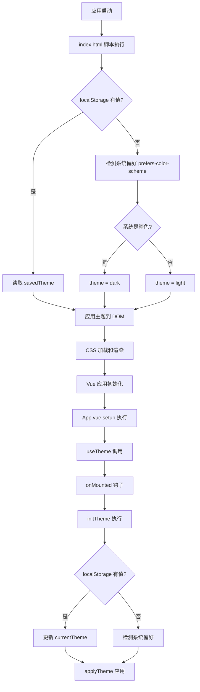
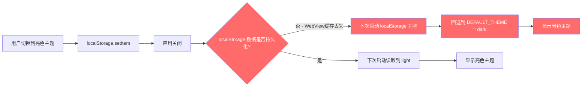
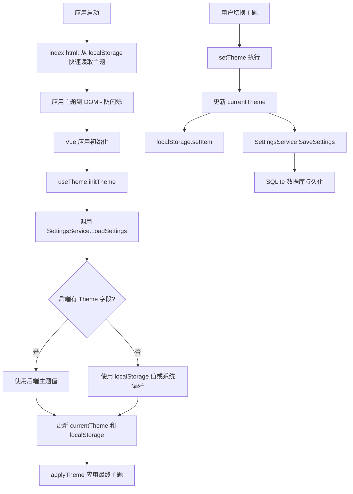

# 主题初始化问题分析报告

## 问题描述

用户反馈：应用启动时默认是黑色主题，无论上次启动是否保存为白色主题。

## 代码架构分析

### 1. 主题初始化流程



### 2. 关键代码位置

| 文件 | 行号 | 功能 |
|------|------|------|
| [`frontend/index.html`](frontend/index.html:10) | 10-32 | 早期主题初始化脚本 |
| [`frontend/src/types/theme.ts`](frontend/src/types/theme.ts:61) | 61 | `DEFAULT_THEME = 'dark'` 默认主题定义 |
| [`frontend/src/composables/useTheme.ts`](frontend/src/composables/useTheme.ts:22) | 22 | `currentTheme` 初始值设置 |
| [`frontend/src/composables/useTheme.ts`](frontend/src/composables/useTheme.ts:72) | 72-89 | `initTheme()` 初始化逻辑 |
| [`frontend/src/composables/useTheme.ts`](frontend/src/composables/useTheme.ts:138) | 138-150 | `onMounted` 生命周期调用 |
| [`frontend/src/styles/themes/_variables.css`](frontend/src/styles/themes/_variables.css:18) | 18-131 | 明亮主题 CSS 变量定义 |
| [`frontend/src/styles/themes/_variables.css`](frontend/src/styles/themes/_variables.css:133) | 133-247 | 暗色主题 CSS 变量定义 |

### 3. 当前架构特点

本项目是一个 **Wails v3** 桌面应用，具有以下特点：

- **前端框架**：Vue 3 + TypeScript + Tailwind CSS v4
- **后端框架**：Go + Wails v3
- **数据持久化**：SQLite 数据库（通过 GORM）
- **前后端通信**：Wails 绑定机制（自动生成 TypeScript 绑定）

## 问题根因分析

### 根因一：Wails WebView 的 localStorage 持久化问题 ⭐ 主要原因

本项目是一个 Wails 应用，Wails 使用 WebView 渲染前端界面。在 Wails 环境中，localStorage 的持久化存在以下问题：

1. **WebView 数据目录不确定性**：Wails WebView 的 localStorage 数据存储位置取决于操作系统和 WebView 版本，可能与应用数据目录不一致。

2. **应用更新时数据丢失**：某些情况下，应用更新或重新安装会导致 WebView 缓存被清理。

3. **localStorage 写入时机**：在 Wails 环境中，localStorage 的写入可能是异步的，如果在写入完成前应用关闭，数据可能丢失。

### 根因二：后端缺少主题持久化字段

查看 [`internal/models/models.go`](internal/models/models.go:112) 中的 `GlobalSettings` 结构体：

```go
type GlobalSettings struct {
    ID             uint   `json:"id" gorm:"primaryKey"`
    ConnectTimeout string `json:"connectTimeout"`
    CommandTimeout string `json:"commandTimeout"`
    StorageRoot    string `json:"storageRoot"`
    ErrorMode      string `json:"errorMode"`
    Debug          bool   `json:"debug"`
    Verbose        bool   `json:"verbose"`
    // ... 其他字段
    // ❌ 缺少 Theme 字段
}
```

**问题**：主题设置完全依赖前端 localStorage，后端数据库中没有对应的持久化字段。其他设置（如超时、调试开关等）都通过 `SettingsService` 持久化到 SQLite 数据库，唯独主题设置被遗漏。

### 根因三：默认主题值设置

在 [`frontend/src/types/theme.ts:61`](frontend/src/types/theme.ts:61) 中：

```typescript
export const DEFAULT_THEME: ThemeName = 'dark'
```

这个默认值本身不是问题，因为 `initTheme()` 会正确读取 localStorage。但如果 localStorage 读取失败，就会回退到这个默认值 `'dark'`。

### 根因四：系统偏好检测逻辑

在 [`frontend/index.html:21`](frontend/index.html:21) 和 [`frontend/src/composables/useTheme.ts:81`](frontend/src/composables/useTheme.ts:81) 中：

```javascript
var prefersDark = window.matchMedia('(prefers-color-scheme: dark)').matches;
```

如果用户的操作系统设置为暗色模式，且 localStorage 读取失败，应用会自动选择暗色主题。

### 根因五：窗口背景色硬编码为暗色

在 [`cmd/netweaver/main.go:126`](cmd/netweaver/main.go:126) 中：

```go
BackgroundColour: application.NewRGB(15, 17, 23),
```

窗口背景色被硬编码为暗色（`#0f1117`），这意味着即使前端主题初始化为亮色，在 WebView 加载完成前用户也会看到暗色背景闪烁。

## 问题链路总结



## 解决方案

### 方案一：后端持久化主题设置（推荐）⭐

将主题偏好存储在 Go 后端的 SQLite 数据库中，与 `GlobalSettings` 统一管理，彻底摆脱对 localStorage 的依赖。

#### 实现步骤

**步骤 1：修改后端模型**

在 [`internal/models/models.go`](internal/models/models.go:112) 的 `GlobalSettings` 结构体中添加 `Theme` 字段：

```go
type GlobalSettings struct {
    // ... 现有字段
    Theme string `json:"theme"` // 主题设置: "light" | "dark" | "system"
}
```

**步骤 2：更新默认设置**

在 [`internal/config/settings.go`](internal/config/settings.go:12) 的 `DefaultSettings()` 函数中添加默认主题：

```go
func DefaultSettings() models.GlobalSettings {
    return models.GlobalSettings{
        // ... 现有字段
        Theme: "system", // 默认跟随系统
    }
}
```

**步骤 3：前端 useTheme 改造**

修改 [`frontend/src/composables/useTheme.ts`](frontend/src/composables/useTheme.ts) 的初始化逻辑：

- `initTheme()` 改为异步方法
- 优先从后端 `SettingsService.LoadSettings()` 获取主题
- localStorage 作为快速缓存（避免闪烁），后端数据作为权威来源
- `setTheme()` 同时写入 localStorage 和后端

**步骤 4：修改 index.html 早期初始化脚本**

[`frontend/index.html`](frontend/index.html:10) 的脚本保持不变，仍然从 localStorage 快速读取以防止闪烁。但 Vue 应用初始化后会从后端校验并修正主题。

**步骤 5：修改窗口背景色**

在 [`cmd/netweaver/main.go`](cmd/netweaver/main.go:126) 中，将窗口背景色改为可配置或使用中性色：

```go
// 根据保存的主题设置窗口背景色
settings, _, _ := config.LoadSettings()
var bgR, bgG, bgB uint8
if settings.Theme == "light" {
    bgR, bgG, bgB = 248, 250, 252 // --color-bg-primary light
} else {
    bgR, bgG, bgB = 15, 17, 23   // --color-bg-primary dark
}
BackgroundColour: application.NewRGB(bgR, bgG, bgB),
```

#### 数据流设计



### 方案二：使用 RuntimeSetting 表存储主题

利用已有的 [`RuntimeSetting`](internal/models/models.go:197) 表（category + key/value 结构）存储主题设置，无需修改 `GlobalSettings` 模型。

#### 实现步骤

**步骤 1：在 SettingsService 中添加主题相关方法**

```go
func (s *SettingsService) GetTheme() string {
    // 从 runtime_settings 表读取 category=ui, key=theme
}

func (s *SettingsService) SetTheme(theme string) error {
    // 写入 runtime_settings 表 category=ui, key=theme
}
```

**步骤 2：前端调用**

在 `useTheme.ts` 中通过 Wails 绑定调用后端方法。

**步骤 3：其余步骤同方案一**

### 方案对比

| 维度 | 方案一：GlobalSettings 扩展 | 方案二：RuntimeSetting 表 |
|------|---------------------------|--------------------------|
| 数据一致性 | 与其他设置统一管理 | 独立存储，需额外管理 |
| 前端改造量 | 中等（需修改 useTheme） | 中等（需修改 useTheme） |
| 后端改造量 | 小（加一个字段） | 小（加两个方法） |
| 数据库迁移 | 需要 AutoMigrate | 无需迁移 |
| 窗口背景色同步 | 可直接读取 | 需额外查询 |
| 推荐度 | ⭐⭐⭐ | ⭐⭐ |

## 推荐方案

**推荐采用方案一**，理由如下：

1. **数据一致性**：主题设置与其他应用设置统一管理，前端 Settings 页面可以统一展示
2. **可靠性**：SQLite 数据库比 WebView localStorage 更可靠，不受 WebView 缓存清理影响
3. **窗口背景色同步**：可以在 Go 端直接读取主题设置来设置窗口初始背景色，避免暗色闪烁
4. **可维护性**：减少前端存储逻辑的复杂性，单一数据源
5. **架构一致性**：与项目现有的设置管理模式保持一致

## 相关代码引用

- 主题类型定义：[`frontend/src/types/theme.ts`](frontend/src/types/theme.ts)
- 主题管理 Hook：[`frontend/src/composables/useTheme.ts`](frontend/src/composables/useTheme.ts)
- 早期初始化脚本：[`frontend/index.html`](frontend/index.html)
- CSS 主题变量：[`frontend/src/styles/themes/_variables.css`](frontend/src/styles/themes/_variables.css)
- 后端设置模型：[`internal/models/models.go`](internal/models/models.go)
- 后端设置服务：[`internal/ui/settings_service.go`](internal/ui/settings_service.go)
- 后端默认设置：[`internal/config/settings.go`](internal/config/settings.go)
- 窗口创建代码：[`cmd/netweaver/main.go`](cmd/netweaver/main.go)
- Wails 配置：[`wails.json`](wails.json)
