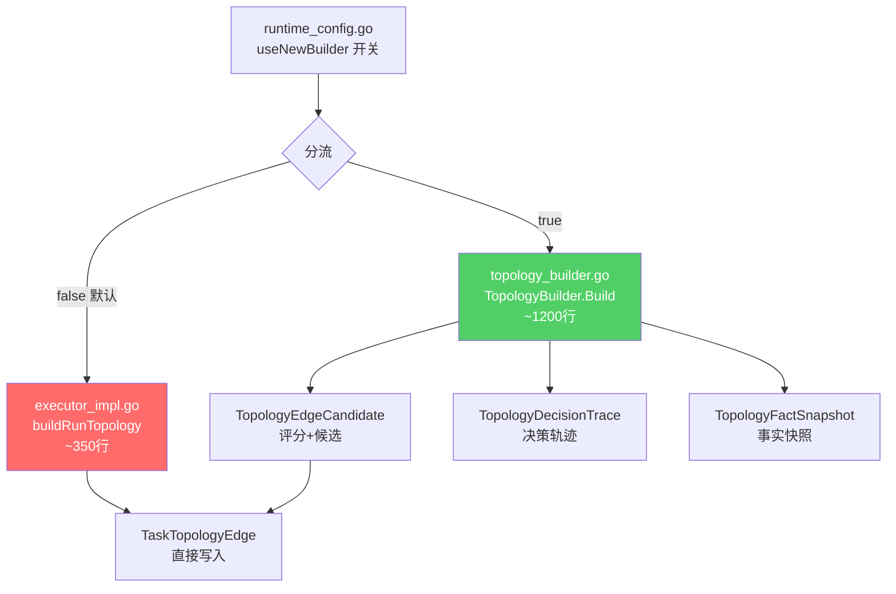
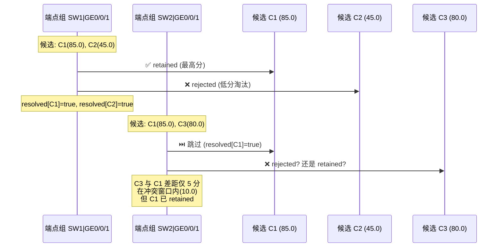
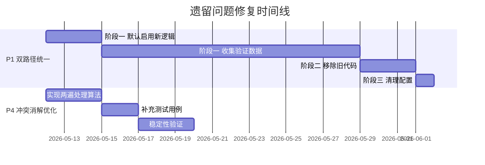

# 拓扑还原模块遗留问题分析报告

> 文档版本: v1.0  
> 日期: 2026-05-06  
> 状态: 待实施

---

## 概述

在对拓扑还原模块进行全面代码审查后，10 项识别问题中已有 8 项完成修复（详见代码提交记录）。本文档针对剩余 2 项尚未修复的架构级问题进行深入分析，提供问题复现路径、影响范围评估、以及分阶段实施方案。

---

## 问题一：新旧双路径构建逻辑并行（P1）

### 1.1 问题描述

系统中同时存在两套拓扑构建逻辑，通过运行时配置 `useNewBuilder`（默认 `false`）进行分流：

```
executor_impl.go:917
    ├─ useNewBuilder == true  → BuildTopologyWithNewLogic() → topology_builder.go
    └─ useNewBuilder == false → buildRunTopology()          → executor_impl.go:1250-1636
```

两套逻辑在 **评分体系**、**候选管理**、**冲突消解策略** 上存在显著差异，导致：

- 同一数据集在不同配置下可能产生不同的拓扑结构
- 维护成本倍增（每次修改需同步两套代码）
- 新功能（候选轨迹/决策追踪）只在新逻辑中可用

### 1.2 差异对照

| 维度 | 旧逻辑 (executor_impl.go) | 新逻辑 (topology_builder.go) |
|------|---------------------------|-------------------------------|
| **入口函数** | `buildRunTopology()` L1250 | `TopologyBuilder.Build()` L26 |
| **代码行数** | ~350 行（内联在 executor 中） | ~1200 行（独立文件） |
| **LLDP 单边基础分** | 置信度 `0.75` | 分值 `75.0` (wLLDPBaseSingleSide) |
| **LLDP 双向确认** | 直接置 `Confidence=1.0` | 加分 `+25.0` (wLLDPBidirectionalBonus) |
| **FDB device 加分** | `+25.0` | `+30.0` (wFDBDeviceBonus) |
| **FDB endpoint 加分** | `+15.0` (server) / `+8.0` (terminal) | `+10.0` (wFDBEndpointBonus) 统一 |
| **FDB remoteIP 加分** | `+15.0` | `+5.0` (wFDBRemoteIPBonus) |
| **冲突窗口** | 硬编码 `10.0` | 可配置 `ConflictWindow` |
| **ChassisID 匹配** | 线性扫描 O(N) | 预计算索引 O(1) |
| **候选/决策轨迹** | ❌ 不支持 | ✅ 完整持久化 |
| **事实快照** | ❌ 不支持 | ✅ 哈希+快照 |
| **端点分类** | server / terminal（IP 前缀区分） | endpoint / unknown（统一） |

### 1.3 影响范围



**受影响的文件：**

| 文件 | 影响方式 |
|------|---------|
| `executor_impl.go` L905-936 | 分流调度逻辑 |
| `executor_impl.go` L1250-1636 | 待移除的旧构建逻辑 |
| `executor_impl.go` L1638-1810 | 旧逻辑辅助函数（部分与新逻辑共用） |
| `config/runtime_config.go` | `useNewBuilder` 配置定义 |
| `persistence.go` | 级联删除需同步（已修复） |

**待移除的旧逻辑函数清单：**

| 函数 | 所在行 | 说明 |
|------|--------|------|
| `buildRunTopology()` | L1250-1636 | 旧构建主函数 |
| `resolveEdgeConflicts()` | L1705-1768 | 旧冲突消解（新逻辑有独立实现） |
| `scoreEdgeCandidate()` | L1786-1810 | 旧边评分（新逻辑使用 `ScoreBreakdown`） |
| `scoreFDBCandidate()` | L1812-1830 | 旧 FDB 评分（新逻辑使用 `scoreFDBARPCandidate`） |
| `markEdgeConflict()` | L1770-1784 | 旧冲突标记（新逻辑内联处理） |
| `findEdgeKeyByDevicePairAndLocalEndpoint()` | L1846-1860 | 旧边查找 |

### 1.4 实施方案

#### 阶段一：验证阶段（1 个版本周期）

1. 将 `useNewBuilder` 默认值从 `false` 改为 `true`
2. 保留旧逻辑代码，但在入口处添加废弃日志警告
3. 在生产环境中运行新逻辑，收集对比数据
4. 添加新旧逻辑一致性对比测试

```go
// config/runtime_config.go
cfg.Topology.UseNewBuilder = true // 默认启用新逻辑
```

```go
// executor_impl.go - 旧路径入口添加废弃警告
} else {
    logger.Warn("TaskExec", ctx.RunID(), 
        "DEPRECATED: using legacy topology builder, will be removed in v2.x")
    result, err = e.buildRunTopology(ctx.RunID())
}
```

#### 阶段二：清理阶段（下一个版本周期）

1. 移除 `useNewBuilder` 配置项及相关 Resolve 函数
2. 删除 `executor_impl.go` 中的旧构建逻辑（约 350 行）
3. 删除仅被旧逻辑引用的辅助函数
4. 简化 `TopologyBuildExecutor.Run()` 中的分流逻辑为直接调用

```diff
 // executor_impl.go 阶段二最终形态
 func (e *TopologyBuildExecutor) Run(ctx RuntimeContext, stage *StagePlan) error {
     // ...
-    if config.ResolveTopologyUseNewBuilder() {
-        // ...新逻辑调用
-    } else {
-        result, err = e.buildRunTopology(ctx.RunID())
-    }
+    output, err := BuildTopologyWithNewLogic(e.db, ctx.RunID())
+    if err != nil { /* ... */ }
+    result = convertBuildOutput(output)
     // ...
 }
```

#### 阶段三：配置清理

1. 从 `RuntimeConfig.Topology` 中移除 `UseNewBuilder` 字段
2. 从 `RuntimeSetting` 数据库表中清除 `topology.useNewBuilder` 记录
3. 更新前端设置页面

### 1.5 风险评估

| 风险项 | 等级 | 缓解措施 |
|--------|------|---------|
| 新逻辑评分差异导致拓扑结果变化 | 中 | 阶段一收集对比数据后再决定推进 |
| 旧数据与新逻辑格式不兼容 | 低 | `endpoint:` 前缀已向后兼容 `server:`/`terminal:` |
| 移除旧函数影响其他模块 | 低 | `resolveEdgeConflicts` 等仅被旧逻辑调用 |

---

## 问题二：冲突消解贪心策略竞争条件（P4）

### 2.1 问题描述

当前 `resolveCandidatesGlobal()` 使用基于端点的贪心策略进行冲突消解。每条候选边 `A|port_x <-> B|port_y` 同时出现在 **A端点组** 和 **B端点组** 中。当两个端点组的处理顺序不同时，同一条候选可能被不同组赋予矛盾的状态。

### 2.2 问题复现场景

考虑以下拓扑候选：

```
候选 C1: SW1|GE0/0/1 <-> SW2|GE0/0/1  (分数 85.0, LLDP)
候选 C2: SW1|GE0/0/1 <-> SW3|GE0/0/1  (分数 45.0, FDB)
候选 C3: SW2|GE0/0/1 <-> SW4|GE0/0/1  (分数 80.0, LLDP)
```

**当前处理流程：**



**竞争条件的关键点：**

1. **Go 的 map 遍历顺序不确定** — `for endpoint, g := range groups` 每次执行的端点组处理顺序可能不同
2. **`resolved` 保护不完整** — 当 C1 在 G1 组被标记为 `retained` 后，G2 组中发现 C1 和 C3 在冲突窗口内，但 C1 已锁定为 `retained`，此时 C3 可能被错误地标记为 `rejected`
3. **状态不可回退** — 一旦候选被标记为 `retained`，即使后续发现它在另一端点组中存在冲突，也无法将其回退为 `conflict`

### 2.3 具体影响分析

| 场景 | 发生概率 | 影响 |
|------|---------|------|
| 简单二设备互联 | 无影响 | 每个端点只有一个候选 |
| 三设备星形拓扑 | 低 | 中心设备的同一端口可能有多个 FDB 候选 |
| 多设备 LAG 聚合 | 中 | 聚合后逻辑端口合并，增加冲突概率 |
| 交换机级联 + 服务器接入混合 | 中高 | 同端口同时有 LLDP 和 FDB 候选，处理顺序影响结果 |
| 100+ 设备全网拓扑 | 高 | 候选数量激增，竞争条件触发概率显著上升 |

### 2.4 当前代码的保护机制

代码中已有一定程度的保护，但不完整：

```go
// topology_builder.go L956
resolved := make(map[string]bool)

// L1009 - 冲突标记时跳过已处理的候选
if !resolved[c.CandidateID] {
    c.Status = "conflict"
    resolved[c.CandidateID] = true
}

// L1023 - 保留标记时跳过已处理的候选
if !resolved[g.candidates[0].CandidateID] {
    g.candidates[0].Status = "retained"
    resolved[g.candidates[0].CandidateID] = true
}
```

**保护缺陷**：`resolved` 只防止**重复赋值**，但不防止**矛盾赋值**。即：

- C1 在 G1 中被赋 `retained`，`resolved[C1]=true`
- G2 处理时因 `resolved[C1]=true` 跳过 C1，但 C1 实际上与 G2 中的其他候选存在冲突
- G2 中的其他候选可能因 C1 已锁定而被错误淘汰

### 2.5 解决方案

#### 方案 A：两遍处理（推荐）

**原理**：将冲突消解拆分为"检测"和"决策"两个阶段，第一遍识别所有冲突组，第二遍用全局视角进行最终决策。

```
第一遍（检测）：
  遍历所有端点组，记录每个候选参与的冲突端点列表
  
第二遍（决策）：
  对每个候选，综合其在所有关联端点组中的竞争情况进行最终裁决
```

**伪代码：**

```go
func resolveCandidatesGlobal(candidates, config) {
    // 第一遍：标记所有冲突关系
    conflictGraph := buildConflictGraph(candidates) // candidate -> []conflicting_candidates
    
    // 第二遍：全局决策
    for _, c := range sortByScoreDesc(candidates) {
        if decided[c.ID] { continue }
        
        // 检查该候选的所有端点是否已被其他高分候选占据
        if allEndpointsFree(c, occupiedEndpoints) {
            c.Status = "retained"
            occupiedEndpoints.Mark(c.AEndpoint)
            occupiedEndpoints.Mark(c.BEndpoint)
            decided[c.ID] = true
            
            // 淘汰所有与此候选冲突的低分候选
            for _, rival := range conflictGraph[c.ID] {
                if !decided[rival.ID] {
                    rival.Status = "rejected"
                    decided[rival.ID] = true
                }
            }
        } else {
            // 端点已被占据，标记为 rejected
            c.Status = "rejected"
            decided[c.ID] = true
        }
    }
}
```

**优点**：
- 按全局评分排序处理，避免端点组处理顺序依赖
- 每个物理端口最多对应一条最终边（端点排他约束）
- 实现复杂度可控

**缺点**：
- 需要全量排序，时间复杂度 O(N log N)
- 全局贪心仍非最优解（但在实际场景中足够好）

#### 方案 B：加权二部图匹配（高级方案）

**原理**：将拓扑候选建模为二部图最大权匹配问题，使用匈牙利算法或 KM 算法求解全局最优。

```
左节点: 所有 A 端端点 (device|interface)
右节点: 所有 B 端端点 (device|interface)
边权重: 候选评分
目标:   最大化总匹配权重，且每个端点最多匹配一条边
```

**优点**：
- 理论最优解
- 消除所有竞争条件

**缺点**：
- 实现复杂度高（KM 算法 O(N³)）
- 拓扑候选不完全符合二部图模型（A/B 端可能来自同一设备集合）
- 过度工程化，收益有限

#### 方案选择建议

> [!TIP]
> **推荐方案 A（两遍处理）**，理由：
> 1. 实现复杂度可控，约 80 行代码变更
> 2. 消除 map 遍历顺序导致的不确定性
> 3. 端点排他约束保证每个物理端口最多一条边
> 4. 性能可接受（排序 + 线性扫描，O(N log N)）

### 2.6 实施步骤

1. **新增辅助结构**：`endpointOccupancy` map，记录已被占据的端点
2. **重写 `resolveCandidatesGlobal`**：
   - 按 `TotalScore` 全局降序排序所有候选
   - 逐一检查候选的两个端点是否可用
   - 可用则标记 `retained` 并锁定端点
   - 不可用则与占据者比较分数，决定 `rejected` 或 `conflict`
3. **保留决策轨迹**：每次决策生成 `TopologyDecisionTrace` 记录
4. **补充测试用例**：
   - 三路冲突测试（3 条候选竞争同一端口）
   - 级联冲突测试（A-B 和 B-C 同端口冲突传播）
   - 大规模随机数据稳定性测试（多次执行结果一致）

### 2.7 测试验证标准

```go
// 预期新增的测试用例
func TestResolveCandidatesGlobal_ThreeWayConflict(t *testing.T)
// 3条候选竞争 SW1|GE0/0/1，最高分保留，其余 rejected

func TestResolveCandidatesGlobal_CascadeConflict(t *testing.T)
// C1: SW1|GE0/0/1 <-> SW2|GE0/0/1 (85分)
// C2: SW2|GE0/0/1 <-> SW3|GE0/0/1 (80分)
// C1 保留后锁定 SW2|GE0/0/1，C2 因端点被占据而 rejected

func TestResolveCandidatesGlobal_DeterministicOrder(t *testing.T)
// 同一数据集执行 100 次，结果完全一致
```

---

## 优先级与时间线建议



| 问题 | 优先级 | 预计工作量 | 建议启动时间 |
|------|--------|-----------|------------|
| P1 双路径统一 | 高 | 阶段一: 0.5天; 阶段二: 1天 | 下一个开发周期 |
| P4 冲突消解优化 | 中 | 实现: 1天; 测试: 1天 | 可与 P1 阶段一并行 |
