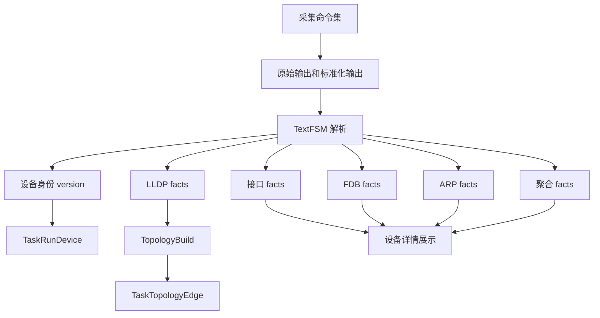
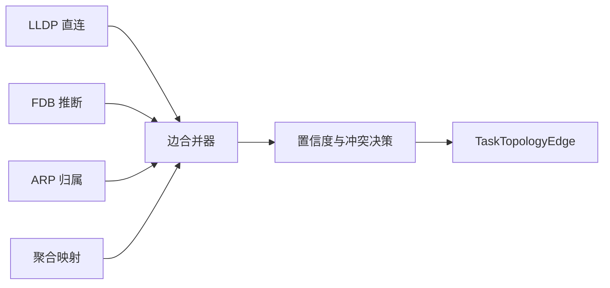

# 拓扑还原采集架构与业务流程分析报告

## 1. 结论摘要

当前拓扑还原链路的真实架构是 `采集 -> 解析 -> 持久化 -> 构图 -> 查询展示`，主干流程定义在 [`internal/taskexec/doc.go`](internal/taskexec/doc.go:5)、[`internal/taskexec/topology_compiler.go`](internal/taskexec/topology_compiler.go:34)、[`internal/taskexec/executor_impl.go`](internal/taskexec/executor_impl.go:961) 与 [`internal/taskexec/executor_impl.go`](internal/taskexec/executor_impl.go:1294)。

从结果上看，系统**采集了很多信息**，包括版本、主机名、序列号、设备板卡、接口、LLDP、MAC 表、ARP、聚合口等；解析阶段也把其中大部分数据落到了运行期表中，定义见 [`TaskParsedInterface`](internal/taskexec/topology_models.go:57)、[`TaskParsedLLDPNeighbor`](internal/taskexec/topology_models.go:79)、[`TaskParsedFDBEntry`](internal/taskexec/topology_models.go:100)、[`TaskParsedARPEntry`](internal/taskexec/topology_models.go:119)、[`TaskParsedAggregateGroup`](internal/taskexec/topology_models.go:138)、[`TaskParsedAggregateMember`](internal/taskexec/topology_models.go:155)。

但**最终构图阶段只读取了 LLDP**，见 [`buildRunTopology`](internal/taskexec/executor_impl.go:1294)。因此现在的事实是：

- LLDP 是当前唯一进入 `TaskTopologyEdge` 的拓扑证据来源，见 [`internal/taskexec/executor_impl.go`](internal/taskexec/executor_impl.go:1301)
- FDB、ARP、聚合、接口信息目前主要停留在 解析结果存储 和 设备详情展示 两个层面，见 [`internal/taskexec/topology_query.go`](internal/taskexec/topology_query.go:148)
- 运行时配置里虽然已经存在 FDB 推断阈值 [`MaxInferenceCandidates`](internal/config/runtime_config.go:55)，但当前构图逻辑根本没有消费这项配置，说明设计上预留了“多源推断”，实现上却没有落地

所以你看到的现象不是“采集没成功”，而是**整体架构只把 LLDP 这条证据链真正接通到了构图阶段，其他采集数据都停在半路**。

---

## 2. 功能架构总览

### 2.1 任务编译层

拓扑任务被编译成三阶段执行计划，见 [`TopologyTaskCompiler.Compile`](internal/taskexec/topology_compiler.go:24)：

1. 设备采集
2. 信息解析
3. 拓扑构建

核心定义在 [`internal/taskexec/topology_compiler.go`](internal/taskexec/topology_compiler.go:34)。

### 2.2 运行时执行层

系统文档已经明确拓扑任务执行链路：

- [`DeviceCollectExecutor`](internal/taskexec/doc.go:24) 负责采集
- [`ParseExecutor`](internal/taskexec/doc.go:25) 负责解析
- [`TopologyBuildExecutor`](internal/taskexec/doc.go:26) 负责构图

也就是：

---

## 3. 采集阶段到底采集了什么

### 3.1 编译器声明的采集项

编译器层面，拓扑采集步骤声明了 10 类命令键，见 [`buildCollectSteps`](internal/taskexec/topology_compiler.go:150)：

- `version`
- `sysname`
- `esn`
- `device_info`
- `interface_brief`
- `interface_detail`
- `lldp_neighbor`
- `mac_address`
- `arp_all`
- `eth_trunk`

这说明从设计意图上，系统并不是只想采 LLDP，而是要采一整套设备画像和二三层邻接数据。

### 3.2 实际执行的命令来源

真正执行时，采集器并**不是按 [`buildCollectSteps`](internal/taskexec/topology_compiler.go:150) 里的步骤内容逐条执行命令**，而是直接读取设备画像中的 [`profile.Commands`](internal/taskexec/executor_impl.go:556)，在 [`executeCollect`](internal/taskexec/executor_impl.go:427) 里构造执行计划。

关键代码见：

- 画像装载 [`config.GetDeviceProfile`](internal/taskexec/executor_impl.go:481)
- 执行计划构造 [`commands := make([]executor.PlannedCommand...`](internal/taskexec/executor_impl.go:556)
- 命令计划日志 [`拓扑采集命令计划`](internal/taskexec/executor_impl.go:571)

这意味着：

- 编译器里的 command key 列表更像是“任务步骤声明”
- 真正的命令文本和最终执行集合来自设备画像 [`internal/config/device_profile.go`](internal/config/device_profile.go:147)
- 架构上已经出现一层“声明”和“实际执行”分离

### 3.3 各厂商实际采集内容

例如华为画像当前采集：

- [`display version`](internal/config/device_profile.go:148)
- [`display current-configuration | include sysname`](internal/config/device_profile.go:149)
- [`display device esn`](internal/config/device_profile.go:150)
- [`display lldp neighbor`](internal/config/device_profile.go:152)
- [`display interface brief`](internal/config/device_profile.go:153)
- [`display interface`](internal/config/device_profile.go:154)
- [`display mac-address`](internal/config/device_profile.go:155)
- [`display eth-trunk`](internal/config/device_profile.go:156)
- [`display arp`](internal/config/device_profile.go:157)
- [`display device`](internal/config/device_profile.go:158)

因此，从采集层看，系统确实收集了远超 LLDP 的信息。

---

## 4. 采集结果落到了哪里

采集成功后，每条命令结果都会形成 [`TaskRawOutput`](internal/taskexec/topology_models.go:34) 记录，里面同时保存：

- 原始输出路径 [`RawFilePath`](internal/taskexec/topology_models.go:41)
- 标准化输出路径 [`ParseFilePath`](internal/taskexec/topology_models.go:42)
- 解析状态 [`ParseStatus`](internal/taskexec/topology_models.go:44)

持久化位置在 [`internal/taskexec/executor_impl.go`](internal/taskexec/executor_impl.go:946)，而采集阶段会同时创建：

- raw artifact，见 [`createArtifact`](internal/taskexec/executor_impl.go:662)
- normalized artifact，见 [`createArtifact`](internal/taskexec/executor_impl.go:663)

这里说明一个关键事实：

**数据并没有丢在采集阶段，而是非常完整地进入了运行期存储。**

---

## 5. 解析阶段实际做了什么

解析入口在 [`ParseExecutor.parseAndSaveRunDevice`](internal/taskexec/executor_impl.go:961)。

### 5.1 解析输入

解析器读取的不是原始输出，而是 [`TaskRawOutput.ParseFilePath`](internal/taskexec/executor_impl.go:1003) 指向的标准化文本，再调用 [`parserEngine.Parse`](internal/taskexec/executor_impl.go:1020) 做 TextFSM 解析。

### 5.2 已经接入解析映射的命令

当前 [`switch output.CommandKey`](internal/taskexec/executor_impl.go:1030) 中真正做映射的只有这些：

- [`version -> ToDeviceInfo`](internal/taskexec/executor_impl.go:1031)
- [`interface_brief`, `interface_detail` -> ToInterfaces](internal/taskexec/executor_impl.go:1061)
- [`lldp_neighbor -> ToLLDP`](internal/taskexec/executor_impl.go:1069)
- [`mac_address -> ToFDB`](internal/taskexec/executor_impl.go:1082)
- [`arp_all -> ToARP`](internal/taskexec/executor_impl.go:1095)
- [`eth_trunk`, `eth_trunk_verbose` -> ToAggregate`](internal/taskexec/executor_impl.go:1108)

### 5.3 没有接入解析映射的命令

下面这些采集项虽然被执行了，但没有进入任何 `case`：

- `sysname`
- `esn`
- `device_info`

也就是说：

- 这些命令的输出会被保存进 [`TaskRawOutput`](internal/taskexec/topology_models.go:34)
- 解析器会跑 [`parserEngine.Parse`](internal/taskexec/executor_impl.go:1020)
- 但后续没有映射落地逻辑
- 最终不会进入任何解析事实表，也不会参与构图

这是第一类“采了但没用上”的数据。

### 5.4 已解析并落表的数据

解析成功后，系统会写入：

- [`TaskParsedInterface`](internal/taskexec/executor_impl.go:1185)
- [`TaskParsedLLDPNeighbor`](internal/taskexec/executor_impl.go:1205)
- [`TaskParsedFDBEntry`](internal/taskexec/executor_impl.go:1224)
- [`TaskParsedARPEntry`](internal/taskexec/executor_impl.go:1241)
- [`TaskParsedAggregateGroup`](internal/taskexec/executor_impl.go:1258)
- [`TaskParsedAggregateMember`](internal/taskexec/executor_impl.go:1272)

这说明 FDB、ARP、聚合、接口这些数据**已经不是完全没用**，而是已经被解析并入库，只是后续没有进入构图闭环。

---

## 6. 构图阶段为什么最终只用了 LLDP

问题的核心在 [`TopologyBuildExecutor.buildRunTopology`](internal/taskexec/executor_impl.go:1294)。

### 6.1 构图入口只读取 LLDP

构图一开始就只查询了 [`TaskParsedLLDPNeighbor`](internal/taskexec/executor_impl.go:1301)：

- 没有读取 [`TaskParsedFDBEntry`](internal/taskexec/topology_models.go:100)
- 没有读取 [`TaskParsedARPEntry`](internal/taskexec/topology_models.go:119)
- 没有读取 [`TaskParsedAggregateGroup`](internal/taskexec/topology_models.go:138)
- 没有读取 [`TaskParsedAggregateMember`](internal/taskexec/topology_models.go:155)
- 没有读取 [`TaskParsedInterface`](internal/taskexec/topology_models.go:57)

因此，当前构图器的真实算法可以概括为：

换句话说，其他采集信息即便已经成功解析入库，也没有任何代码路径把它们变成边。

### 6.2 构图证据类型只有 LLDP

每条边的证据 [`EdgeEvidence`](internal/taskexec/topology_models.go:195) 在当前实现中固定写成：

- [`Type: lldp`](internal/taskexec/executor_impl.go:1365)
- [`Source: lldp`](internal/taskexec/executor_impl.go:1366)
- [`DiscoveryMethods: lldp_single_side`](internal/taskexec/executor_impl.go:1396)
- 如果双向命中则升级为 [`lldp_bidirectional`](internal/taskexec/executor_impl.go:1380)

这证明当前状态机虽然支持 `confirmed`、`semi_confirmed`、`inferred`、`conflict` 等状态，见 [`internal/models/topology.go`](internal/models/topology.go:28)，但实际只实现了 LLDP 单边和双边确认，根本没有实现 FDB/ARP 推断与冲突检测流程。

### 6.3 已经预留了多源推断接口，但没接完

有几个非常明显的“设计已预留、实现未落地”信号：

1. 运行时配置中存在 [`MaxInferenceCandidates`](internal/config/runtime_config.go:55)
2. 默认常量说明它用于 FDB 推断，见 [`DefaultTopologyMaxInferenceCandidates`](internal/config/constants.go:55)
3. 边模型中存在 [`LogicalAIf`](internal/taskexec/topology_models.go:180) 与 [`LogicalBIf`](internal/taskexec/topology_models.go:181)
4. 前端和规划比对也能识别逻辑接口，见 [`internal/taskexec/topology_query.go`](internal/taskexec/topology_query.go:98) 与 [`internal/plancompare/service.go`](internal/plancompare/service.go:857)

这套模型说明原始设计目标显然不是“只靠 LLDP”，而是至少想支持：

- 物理直连接口
- 聚合后的逻辑接口映射
- FDB/ARP 的间接推断
- 冲突和不确定性管理

但当前 [`buildRunTopology`](internal/taskexec/executor_impl.go:1294) 根本没读取这些输入，所以只剩 LLDP 真正生效。

---

## 7. 其他采集数据当前分别处于什么状态

### 7.1 `version`

用途：

- 通过 [`ToDeviceInfo`](internal/taskexec/executor_impl.go:1032) 提取 vendor、model、serial、version、hostname、mgmtIP、chassisID
- 回填到 [`TaskRunDevice`](internal/taskexec/executor_impl.go:1147)

实际价值：

- 用于设备身份画像
- 为 LLDP 邻居名映射设备提供 [`NormalizedName`](internal/taskexec/topology_models.go:22)
- 用于前端节点标签展示 [`internal/taskexec/topology_query.go`](internal/taskexec/topology_query.go:76)

结论：

`version` 已经真正用上了，但它的作用是**支撑设备识别**，不是直接构边。

### 7.2 `sysname`、`esn`、`device_info`

用途现状：

- 已采集
- 已存 raw 和 normalized
- 没有进入 [`switch output.CommandKey`](internal/taskexec/executor_impl.go:1030) 的有效映射分支

结论：

这是最典型的“采了但完全没进入业务逻辑”的数据。

### 7.3 `interface_brief`、`interface_detail`

用途现状：

- 已解析为 [`TaskParsedInterface`](internal/taskexec/topology_models.go:57)
- 可在设备详情 API [`GetTopologyDeviceDetail`](internal/taskexec/topology_query.go:148) 中返回
- 没有被 [`buildRunTopology`](internal/taskexec/executor_impl.go:1294) 使用

理论上可承担的职责：

- 接口规范化和名称校验
- 端口 up/down 过滤
- 逻辑口与物理口关系映射
- 聚合成员反查

结论：

当前只用于“展示”和“存档”，没有进入构图判定。

### 7.4 `mac_address`

用途现状：

- 已解析为 [`TaskParsedFDBEntry`](internal/taskexec/topology_models.go:100)
- 可在 [`GetTopologyDeviceDetail`](internal/taskexec/topology_query.go:199) 中返回
- 没有在构图阶段读取

理论上可承担的职责：

- 在缺失 LLDP 时，通过 FDB 聚集情况推断交换机间二层邻接
- 与 ARP 联动，推断网关、服务器、终端归属
- 配合聚合口与接口状态减少歧义

结论：

当前属于**数据已经采到且入库，但算法完全未消费**。

### 7.5 `arp_all`

用途现状：

- 已解析为 [`TaskParsedARPEntry`](internal/taskexec/topology_models.go:119)
- 可在 [`GetTopologyDeviceDetail`](internal/taskexec/topology_query.go:212) 中返回
- 构图阶段未使用

理论上可承担的职责：

- 将 IP 和 MAC 对齐
- 为 FDB 命中的 MAC 提供三层身份
- 帮助把 unknown 远端提升为已知设备或服务器节点

结论：

当前也只是“被采集和展示”，没有进入拓扑边推理。

### 7.6 `eth_trunk`

用途现状：

- 已解析为 [`TaskParsedAggregateGroup`](internal/taskexec/topology_models.go:138) 与 [`TaskParsedAggregateMember`](internal/taskexec/topology_models.go:155)
- 可在 [`GetTopologyDeviceDetail`](internal/taskexec/topology_query.go:225) 中返回
- 但构图阶段没有把物理成员口折叠到逻辑聚合口，也没有填充 [`LogicalAIf`](internal/taskexec/topology_models.go:180)、[`LogicalBIf`](internal/taskexec/topology_models.go:181)

结论：

聚合信息目前只停留在详情展示层，没有接入边归并与逻辑链路识别。

---

## 8. 为什么会形成 只剩 LLDP 生效 的局面

### 8.1 第一层原因：构图器只实现了 LLDP 分支

最直接的技术原因就是 [`buildRunTopology`](internal/taskexec/executor_impl.go:1294) 只读取了 [`TaskParsedLLDPNeighbor`](internal/taskexec/executor_impl.go:1301)。

### 8.2 第二层原因：系统处于 半完成 架构状态

从模型和配置看，系统明显已经为多源拓扑推理准备了这些能力：

- 推断阈值配置 [`MaxInferenceCandidates`](internal/config/runtime_config.go:55)
- 逻辑接口字段 [`LogicalAIf`](internal/taskexec/topology_models.go:180)
- 多状态边模型 `confirmed`、`semi_confirmed`、`inferred`、`conflict`
- 多类解析事实表 FDB、ARP、Aggregate、Interface

但这些能力只完成了：

- 采集
- 解析
- 存储
- 查询详情

没有完成：

- 多源证据融合
- 边推断
- 聚合链路折叠
- 冲突消解
- 置信度归因

因此它不是“采很多信息却故意不用”，而是**架构设计到位了，业务闭环只接通了 LLDP 这一条主链路**。

### 8.3 第三层原因：设备身份采集也有重复和断层

比如华为同时采：

- [`version`](internal/config/device_profile.go:148)
- [`sysname`](internal/config/device_profile.go:149)
- [`esn`](internal/config/device_profile.go:150)
- [`device_info`](internal/config/device_profile.go:158)

但解析阶段真正会落到设备身份上的只有 [`version -> ToDeviceInfo`](internal/taskexec/executor_impl.go:1031)。

这说明采集集已经扩充了，但解析编排没有同步收口，形成“命令增加了，业务链没补齐”的问题。

---

## 9. 当前业务流程的真实落点

可以把现在的业务闭环总结成下面这张图：

其中真正影响拓扑图边结果的只有：

- `version` 提供设备身份辅助映射
- `lldp_neighbor` 提供构边证据

其他数据全部没有进入 `TaskTopologyEdge`。

---

## 10. 回答你的核心问题

### 10.1 为什么采集了很多信息，但是都没用上

严格说不是完全没用，而是分成三类：

#### 第一类：真正进入拓扑构建

- `lldp_neighbor`
- `version` 的一部分身份信息

#### 第二类：进入了解析和详情展示，但没进入构图

- `interface_brief`
- `interface_detail`
- `mac_address`
- `arp_all`
- `eth_trunk`

#### 第三类：连解析映射都没真正接入

- `sysname`
- `esn`
- `device_info`

所以你感觉“采了很多都没用上”，本质上是因为**系统把大量数据只用作了存档和详情展示，没有接入拓扑构图主流程**。

### 10.2 为什么最终只用上了 LLDP

因为当前唯一把 `解析事实 -> 构图边` 这条链真正写完的，就是 [`lldp_neighbor`](internal/taskexec/executor_impl.go:1069) 到 [`TaskParsedLLDPNeighbor`](internal/taskexec/executor_impl.go:1205) 再到 [`buildRunTopology`](internal/taskexec/executor_impl.go:1301) 这条路径。

其他数据虽然存在，但缺少下游算法消费代码。

---

## 11. 架构层面的根因判断

当前拓扑还原不是单点 bug，而是一个**全局架构未闭环**的问题：

1. 采集层已经面向多源证据设计
2. 解析层已经支持多类事实持久化
3. 模型层已经预留逻辑接口和推断配置
4. 但构图层仍然停留在 LLDP-only 版本

也就是说，问题不在某个函数的小 bug，而在于：

**拓扑推理引擎的设计目标是多证据融合，但实际交付版本只实现了 LLDP 直连构图。**

---

## 12. 后续改造建议

如果后续要把这些采集数据真正用起来，建议按架构顺序推进，而不是局部打补丁。

### 12.1 第一阶段：补齐设备身份收口

把 [`sysname`](internal/config/device_profile.go:149)、[`esn`](internal/config/device_profile.go:150)、[`device_info`](internal/config/device_profile.go:158) 纳入 [`ParseExecutor`](internal/taskexec/executor_impl.go:1030) 的统一身份汇总流程，避免重复采集却不落地。

### 12.2 第二阶段：补齐聚合口语义

利用 [`TaskParsedAggregateGroup`](internal/taskexec/topology_models.go:138) 与 [`TaskParsedAggregateMember`](internal/taskexec/topology_models.go:155) 计算逻辑接口映射，填充 [`LogicalAIf`](internal/taskexec/topology_models.go:180) 与 [`LogicalBIf`](internal/taskexec/topology_models.go:181)。

### 12.3 第三阶段：实现 FDB + ARP 推断链

基于：

- [`TaskParsedFDBEntry`](internal/taskexec/topology_models.go:100)
- [`TaskParsedARPEntry`](internal/taskexec/topology_models.go:119)
- [`TaskParsedInterface`](internal/taskexec/topology_models.go:57)
- [`MaxInferenceCandidates`](internal/config/runtime_config.go:55)

补齐以下能力：

- 非 LLDP 场景的二层邻接推断
- 服务器或终端节点识别
- unknown 远端收敛
- inferred / conflict 状态落地

### 12.4 第四阶段：构图器升级为多证据融合

把 [`buildRunTopology`](internal/taskexec/executor_impl.go:1294) 从 LLDP-only 改造成多阶段融合：

---

## 13. 最终判断

一句话总结：

**现在不是采集系统只会 LLDP，而是整个拓扑还原架构里，只有 LLDP 这条证据链真正贯通到了构图层；FDB、ARP、聚合、接口、sysname、esn、device_info 这些数据要么只被存档和展示，要么甚至还没接入解析汇总，所以最终拓扑边只能依赖 LLDP。**
