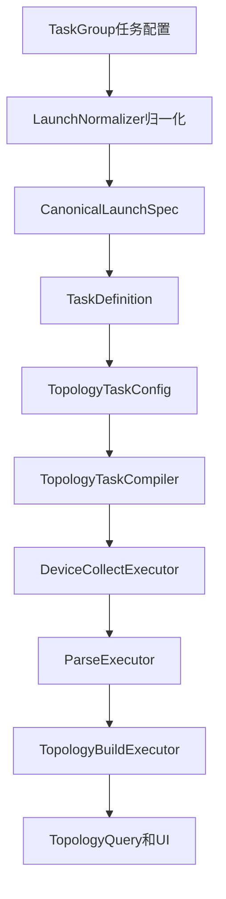
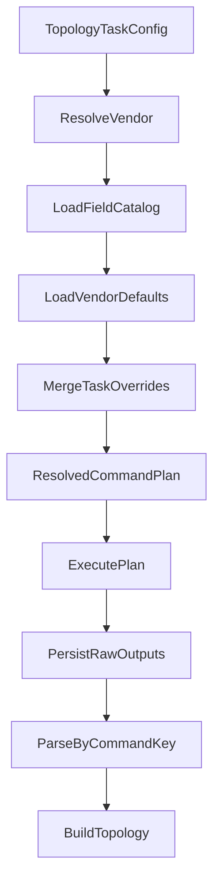

# 拓扑还原采集命令可配置化规划设计书

## 1. 文档结论

基于当前项目的新架构，原设计文档的核心方向仍然合理，但需要按现有的统一任务编排链路重新落位。保留的核心结论是：

1. 拓扑采集必须坚持 固定字段键、可配置命令文本 的设计原则
2. 解析与构图必须继续绑定稳定字段键，而不能绑定用户输入命令文本
3. 厂商默认命令映射 与 任务级临时覆盖 的双层模型是合理的

但原文存在 4 个需要修正的关键点：

1. 没有对齐当前以 [`models.TaskGroup`](internal/models/models.go:161) → [`LaunchNormalizer.normalizeTopology()`](internal/taskexec/launch_service.go:232) → [`TaskExecutionService.CreateTaskDefinitionFromLaunchSpec()`](internal/taskexec/launch_service.go:365) 为核心的任务配置链路
2. 没有区分 配置持久化 与 运行期证据持久化 两套边界，当前这两部分分别由 [`autoMigrateAll()`](internal/config/db.go:78) 与 [`taskexec.AutoMigrate()`](internal/taskexec/persistence.go:281) 管理
3. 没有明确说明 [`TopologyTaskConfig.Vendor`](internal/taskexec/config_models.go:45) 在现状下并未真正参与 [`DeviceCollectExecutor.executeCollect()`](internal/taskexec/executor_impl.go:427) 的命令解析优先级
4. 没有覆盖当前前后端入口，尤其是 [`frontend/src/views/Tasks.vue`](frontend/src/views/Tasks.vue:166)、[`frontend/src/components/task/TaskEditModal.vue`](frontend/src/components/task/TaskEditModal.vue:22)、[`TaskExecutionUIService`](internal/ui/taskexec_ui_service.go:12) 与 [`frontend/src/services/api.ts`](frontend/src/services/api.ts:148)

因此，本次修订后的正式结论是：

- 原方案方向正确，但必须按 TaskGroup 持久化、LaunchSpec 归一化、TaskConfig 运行时下发、Runtime 留痕、UI Service 暴露接口 这条真实主链路重构
- 任务级命令覆盖能力不能只加在 [`TopologyTaskConfig`](internal/taskexec/config_models.go:38)，必须同时落到 [`models.TaskGroup`](internal/models/models.go:161) 与 [`CanonicalTopology`](internal/taskexec/launch_service.go:62)
- 厂商默认命令配置属于 配置域，不属于 [`taskexec`](internal/taskexec) 运行期事实域
- 当前项目是新建项目，本次设计无需保留复杂历史兼容路径，直接按目标结构落地更合适

---

## 2. 当前架构现状

### 2.1 真实配置与执行主链路



当前代码中的真实主链路如下：

- 任务持久化根对象是 [`models.TaskGroup`](internal/models/models.go:161)
- 拓扑任务归一化入口是 [`LaunchNormalizer.normalizeTopology()`](internal/taskexec/launch_service.go:232)
- 运行前配置装配入口是 [`TaskExecutionService.CreateTaskDefinitionFromLaunchSpec()`](internal/taskexec/launch_service.go:365)
- 运行期拓扑配置对象是 [`TopologyTaskConfig`](internal/taskexec/config_models.go:38)
- 编译器固定生成拓扑采集阶段与字段步骤，见 [`TopologyTaskCompiler.buildCollectStage()`](internal/taskexec/topology_compiler.go:62) 与 [`TopologyTaskCompiler.buildCollectSteps()`](internal/taskexec/topology_compiler.go:151)
- 真实命令计划在执行器中构建，见 [`DeviceCollectExecutor.executeCollect()`](internal/taskexec/executor_impl.go:427)
- 当前执行器直接使用 [`DeviceProfile.Commands`](internal/config/device_profile.go:147) 组装命令，见 [`DeviceCollectExecutor.executeCollect()`](internal/taskexec/executor_impl.go:555)
- 原始输出与解析索引持久化在 [`TaskRawOutput`](internal/taskexec/topology_models.go:35)
- 解析阶段仍按 [`output.CommandKey`](internal/taskexec/executor_impl.go:1033) 分发
- 拓扑查询与展示由 [`TaskExecutionService.GetTopologyGraph()`](internal/taskexec/topology_query.go:40)、[`TaskExecutionService.GetTopologyEdgeDetail()`](internal/taskexec/topology_query.go:132)、[`TaskExecutionService.GetTopologyDeviceDetail()`](internal/taskexec/topology_query.go:154) 提供

### 2.2 当前前端入口

当前前端入口已经与旧设计阶段不同，需明确对齐：

- 创建拓扑任务入口是 [`frontend/src/views/Tasks.vue`](frontend/src/views/Tasks.vue:166)
- 编辑拓扑任务入口是 [`frontend/src/components/task/TaskEditModal.vue`](frontend/src/components/task/TaskEditModal.vue:22)
- 前端任务执行 API 聚合在 [`frontend/src/services/api.ts`](frontend/src/services/api.ts:148)
- Wails 运行时拓扑查询接口暴露在 [`TaskExecutionUIService`](internal/ui/taskexec_ui_service.go:12)

现状下，前端仅支持：

- 选择拓扑厂商
- 选择是否自动构图
- 查看运行结果

尚不支持：

- 厂商默认采集命令维护
- 任务级字段覆盖编辑
- 运行详情中展示命令来源与字段启停

### 2.3 当前持久化边界

当前项目已经明显分成两套持久化职责：

#### 配置域持久化

由 [`autoMigrateAll()`](internal/config/db.go:78) 管理，负责基础配置与主数据，例如：

- [`models.DeviceAsset`](internal/models/models.go:11)
- [`models.CommandGroup`](internal/models/models.go:141)
- [`models.TaskGroup`](internal/models/models.go:161)
- [`models.RuntimeSetting`](internal/models/models.go:191)

#### 运行期持久化

由 [`taskexec.AutoMigrate()`](internal/taskexec/persistence.go:281) 管理，负责运行证据与事实，例如：

- [`TaskRunDevice`](internal/taskexec/topology_models.go:5)
- [`TaskRawOutput`](internal/taskexec/topology_models.go:35)
- 各类解析事实表，见 [`internal/taskexec/topology_models.go`](internal/taskexec/topology_models.go)
- [`TaskTopologyEdge`](internal/taskexec/topology_models.go:172)

这意味着：

- 厂商默认命令配置表应放在 配置域
- 任务运行中解析出的最终命令与来源留痕应放在 运行期域
- 两者不能混放，否则会破坏当前架构已经形成的职责边界

### 2.4 当前架构的关键缺口

#### 缺口一：任务级覆盖没有持久化链路

原设计只计划改 [`TopologyTaskConfig`](internal/taskexec/config_models.go:38)，但当前任务在真正启动前的持久化根是 [`models.TaskGroup`](internal/models/models.go:161)。

因此如果只改运行期配置对象，会导致：

- 创建任务时能传覆盖值，但任务编辑页无法稳定回显
- 任务组保存后重新打开时丢失字段覆盖配置
- [`LaunchNormalizer.normalizeTopology()`](internal/taskexec/launch_service.go:232) 无法把配置带入运行时

结论：任务级覆盖必须贯穿以下 3 层：

1. [`models.TaskGroup`](internal/models/models.go:161)
2. [`CanonicalTopology`](internal/taskexec/launch_service.go:62)
3. [`TopologyTaskConfig`](internal/taskexec/config_models.go:38)

#### 缺口二：厂商选择字段没有进入运行期命令解析优先级

当前 UI 提供了拓扑厂商选项，配置会被写入 [`TopologyTaskConfig.Vendor`](internal/taskexec/config_models.go:45)，但 [`DeviceCollectExecutor.executeCollect()`](internal/taskexec/executor_impl.go:427) 当前读取的是设备资产中的 `device.Vendor`，并直接调用 [`config.GetDeviceProfile()`](internal/config/device_profile.go:240)。

也就是说，现状存在一个架构不一致：

- 任务配置层有 Vendor
- 运行执行层没有真正消费这个 Vendor 作为命令解析优先级输入

结论：修订后的方案必须显式定义 Vendor 决策优先级，避免 `TaskGroup` 配了厂商但执行器忽略。

#### 缺口三：当前支持厂商列表来源不适合配置中心

当前 [`TaskExecutionService.GetSupportedTopologyVendors()`](internal/taskexec/topology_query.go:14) 是从设备资产中动态抽取厂商值，失败时才回退 `huawei`、`h3c`、`cisco`。

这适合任务创建页，但不适合 厂商默认命令配置中心，因为配置中心应面向 系统支持厂商，而不是 当前资产里出现过的厂商。

结论：后续应拆分两个概念：

- 可选拓扑厂商目录：来自系统支持能力
- 当前资产中出现的厂商：来自设备库存

#### 缺口四：运行期查询接口只负责结果查询，不适合承载配置管理

[`TaskExecutionUIService`](internal/ui/taskexec_ui_service.go:12) 当前暴露的是：

- 快照查询
- 运行订阅
- 拓扑图查询
- 厂商列表查询

它本质是 Runtime Query Service，而不是 Configuration Service。

结论：厂商默认命令配置、字段目录查询、任务字段计划预览，应该由新的配置服务暴露，而不是继续塞进 [`TaskExecutionUIService`](internal/ui/taskexec_ui_service.go:12)。

---

## 3. 对原规划的合理性复核

### 3.1 保留结论

以下结论继续保留，并作为正式实施前提：

| 结论                 | 判断 | 说明                                                                                                                                                                         |
| -------------------- | ---- | ---------------------------------------------------------------------------------------------------------------------------------------------------------------------------- |
| 固定字段目录         | 合理 | 与 [`TopologyTaskCompiler.buildCollectSteps()`](internal/taskexec/topology_compiler.go:151) 和 [`output.CommandKey`](internal/taskexec/executor_impl.go:1033) 的稳定契约一致 |
| 命令文本可配置       | 合理 | 命令应从字段语义中解耦，解析仍只面向字段键                                                                                                                                   |
| 厂商默认 + 任务覆盖  | 合理 | 适配长期维护与单次任务调优两种场景                                                                                                                                           |
| 原始输出按字段键落盘 | 合理 | 与 [`result.CommandKey+"_raw.txt"`](internal/taskexec/executor_impl.go:632) 的稳定命名一致                                                                                   |
| 解析失败不阻断框架   | 合理 | 符合当前 [`TaskRawOutput.ParseStatus`](internal/taskexec/topology_models.go:44) 的运行模型                                                                                   |

### 3.2 必须修正的结论

#### 修正一：任务级覆盖的根对象不是运行时配置，而是任务组

原文将重心放在 [`TopologyTaskConfig`](internal/taskexec/config_models.go:38)，这在当前架构下不完整。

正式结论调整为：

- 任务级字段覆盖的持久化根对象应是 [`models.TaskGroup`](internal/models/models.go:161)
- [`CanonicalTopology`](internal/taskexec/launch_service.go:62) 负责归一化与下发
- [`TopologyTaskConfig`](internal/taskexec/config_models.go:38) 只是运行时载体

#### 修正二：厂商默认命令配置属于配置域，不属于运行时域

原文建议新增独立配置表，这个方向对，但必须明确表的归属：

- 模型定义应落在 [`internal/models`](internal/models)
- 迁移入口应挂入 [`autoMigrateAll()`](internal/config/db.go:78)
- 不能挂到 [`taskexec.AutoMigrate()`](internal/taskexec/persistence.go:281)

#### 修正三：Vendor 解析必须成为正式决策链，而不是隐式依赖资产 Vendor

原文没有把 Vendor 决策写完整。修订后必须明确：

- 任务层显式 Vendor 需要参与命令解析
- 设备资产 Vendor 只是候选来源之一
- Profile fallback 仅用于兜底

#### 修正四：迁移策略无需复杂兼容分阶段

项目当前是新建项目，不需要为了历史包袱保留复杂双栈兼容。

正式结论调整为：

- 可以直接引入目标数据结构
- 内置 [`DeviceProfile.Commands`](internal/config/device_profile.go:147) 仅作为系统种子和最终兜底
- 不需要长期保留旧模型与新模型并存的复杂逻辑

---

## 4. 修订后的正式目标架构

### 4.1 设计原则

#### 原则一：字段目录固定

系统维护固定拓扑字段目录，首版建议继续使用当前编译器隐含的字段集合：

- `version`
- `sysname`
- `esn`
- `device_info`
- `interface_brief`
- `interface_detail`
- `lldp_neighbor`
- `mac_address`
- `arp_all`
- `eth_trunk`

该集合必须从 [`TopologyTaskCompiler.buildCollectSteps()`](internal/taskexec/topology_compiler.go:151) 中抽离为统一元数据，而不是继续写死在函数体内部。

#### 原则二：配置域与运行时域分离

- 字段目录、厂商默认命令、任务组中的覆盖配置 属于配置域
- 原始输出、解析事实、拓扑边、运行日志 属于运行时域

#### 原则三：解析契约只认字段键

- 解析模板绑定 `CommandKey`
- 构图证据链绑定 `CommandKey`
- 原始输出文件名绑定 `CommandKey`
- 用户可改命令文本，但不能改字段语义

#### 原则四：任务组是可编辑配置的唯一根对象

所有在 创建任务页 与 编辑任务页 可修改的拓扑配置，都必须最终可落回 [`models.TaskGroup`](internal/models/models.go:161)。

#### 原则五：执行器只消费一个统一解析结果

执行器不直接拼接多层来源，而是调用统一解析服务拿到最终命令计划，再执行。

### 4.2 目标领域对象

#### 4.2.1 固定字段目录对象

```go
TopologyFieldSpec {
  FieldKey       string
  Name           string
  Phase          string
  Required       bool
  ParserBinding  string
  DefaultEnabled bool
  Description    string
}
```

建议放在拓扑配置域，而不是继续隐含在 [`TopologyTaskCompiler.buildCollectSteps()`](internal/taskexec/topology_compiler.go:151) 或 [`DeviceProfile.Commands`](internal/config/device_profile.go:147) 中。

#### 4.2.2 厂商默认命令映射对象

```go
TopologyVendorFieldCommand {
  Vendor      string
  FieldKey    string
  Command     string
  TimeoutSec  int
  Enabled     bool
  Notes       string
  UpdatedAt   time.Time
}
```

说明：

- 每个厂商对每个字段一条记录
- 这是配置域对象
- 应定义在 [`internal/models`](internal/models) 并由 [`autoMigrateAll()`](internal/config/db.go:78) 管理

#### 4.2.3 任务级字段覆盖对象

```go
TopologyTaskFieldOverride {
  FieldKey    string
  Command     string
  TimeoutSec  int
  Enabled     *bool
}
```

说明：

- 这是任务组中的 JSON 配置项
- 需要同时出现在 [`models.TaskGroup`](internal/models/models.go:161)、[`CanonicalTopology`](internal/taskexec/launch_service.go:62)、[`TopologyTaskConfig`](internal/taskexec/config_models.go:38)
- 只保存变更项，不保存整套默认值

#### 4.2.4 统一解析结果对象

```go
ResolvedTopologyCommand {
  FieldKey       string
  DisplayName    string
  Command        string
  TimeoutSec     int
  Enabled        bool
  CommandSource  string
  ParserBinding  string
  ResolvedVendor string
  VendorSource   string
}
```

说明：

- 执行器只消费该结构
- 前端任务预览页也可以复用该结构
- 运行时落库留痕也应以该结构为事实来源

### 4.3 Vendor 决策正式规则

修订后必须显式定义 Vendor 决策优先级：

```text
任务显式 Vendor > 设备资产 Vendor > Profile 探测回退 > 系统默认 Vendor
```

具体含义：

1. 如果 [`TopologyTaskConfig.Vendor`](internal/taskexec/config_models.go:45) 非空，则视为本次任务显式指定厂商
2. 否则使用设备资产中的 `device.Vendor`
3. 若资产 Vendor 为空或不可信，可使用 [`DetectVendorFromOutput()`](internal/config/device_profile.go:264) 做回退探测
4. 最终仍无有效结果时再回退到系统默认画像

这个规则要同时决定两件事：

- 使用哪个设备画像处理连接特征与初始化命令
- 使用哪个厂商默认命令映射解析字段命令

也就是说，Vendor 不能只影响命令文本而不影响连接行为。

### 4.4 持久化设计

#### 4.4.1 配置域新增表

建议新增表：

```text
topology_vendor_field_commands
```

建议字段：

- `id`
- `vendor`
- `field_key`
- `command`
- `timeout_sec`
- `enabled`
- `notes`
- `created_at`
- `updated_at`

唯一索引建议：

- `vendor + field_key`

该表的模型定义应位于 [`internal/models`](internal/models)，并由 [`autoMigrateAll()`](internal/config/db.go:78) 纳入迁移。

#### 4.4.2 任务组新增 JSON 字段

建议在 [`models.TaskGroup`](internal/models/models.go:161) 中增加：

```go
TopologyFieldOverrides []TopologyTaskFieldOverride `json:"topologyFieldOverrides" gorm:"serializer:json"`
```

原因：

- 当前创建页与编辑页都是围绕 TaskGroup 工作
- 如果不把覆盖配置落回 TaskGroup，任务编辑与回显链路会断裂

#### 4.4.3 运行时留痕增强

建议扩展 [`TaskRawOutput`](internal/taskexec/topology_models.go:35)：

```go
TaskRawOutput {
  ...
  CommandSource  string
  ResolvedVendor string
  VendorSource   string
  FieldEnabled   bool
}
```

说明：

- `CommandSource` 用于标记 `builtin_seed`、`vendor_default`、`task_override`
- `ResolvedVendor` 表示本次字段命令决策最终落到哪个厂商
- `VendorSource` 表示厂商来源是 task、inventory、detect、default
- `FieldEnabled` 便于运行详情展示哪些字段被关闭

#### 4.4.4 运行产物建议增加字段计划快照

建议额外保存一个执行期字段计划产物，例如：

```text
topology_collection_plan.json
```

作为 [`TaskArtifact`](internal/taskexec/models.go:174) 的一个扩展产物，用于：

- 运行后追溯最终命令来源
- 前端运行详情直接展示
- 调试覆盖规则与厂商解析问题

### 4.5 服务边界设计

#### 配置服务

建议新增独立配置服务，例如：

- `TopologyCommandConfigService`

职责：

- 获取固定字段目录
- 获取指定厂商默认命令映射
- 保存指定厂商默认命令映射
- 重置厂商默认命令为系统种子值
- 预览某厂商最终字段计划

该服务不应混入 [`TaskExecutionUIService`](internal/ui/taskexec_ui_service.go:12)。

#### 运行时解析服务

建议新增统一命令解析器，例如：

- `TopologyCommandResolver`

输入：

- 字段目录
- 任务显式 Vendor
- 设备资产 Vendor
- 厂商默认命令配置
- 任务级字段覆盖
- 内置种子命令

输出：

- `ResolvedTopologyCommand` 列表

#### 执行器

[`DeviceCollectExecutor.executeCollect()`](internal/taskexec/executor_impl.go:427) 的职责应改为：

1. 加载设备资产
2. 解析最终 Vendor
3. 读取字段目录与厂商默认配置
4. 合并任务覆盖得到最终命令计划
5. 执行计划
6. 留痕与产物保存

执行器不再直接把 [`DeviceProfile.Commands`](internal/config/device_profile.go:147) 当成唯一命令源。

---

## 5. 具体改造设计

### 5.1 模型改造

#### 5.1.1 改造 [`models.TaskGroup`](internal/models/models.go:161)

新增任务级覆盖字段：

```go
TaskGroup {
  ...
  TopologyVendor         string
  AutoBuildTopology      bool
  TopologyFieldOverrides []TopologyTaskFieldOverride
}
```

这是本次架构改造中最关键的一项，因为它决定了创建页与编辑页是否有真实落盘位置。

#### 5.1.2 改造 [`CanonicalTopology`](internal/taskexec/launch_service.go:62)

新增：

```go
CanonicalTopology {
  DeviceIDs       []uint
  DeviceIPs       []string
  Vendor          string
  FieldOverrides  []TopologyTaskFieldOverride
}
```

[`LaunchNormalizer.normalizeTopology()`](internal/taskexec/launch_service.go:232) 负责把 TaskGroup 中的字段覆盖归一化后注入。

#### 5.1.3 改造 [`TopologyTaskConfig`](internal/taskexec/config_models.go:38)

新增：

```go
TopologyTaskConfig {
  ...
  Vendor         string
  FieldOverrides []TopologyTaskFieldOverride
}
```

[`TaskExecutionService.CreateTaskDefinitionFromLaunchSpec()`](internal/taskexec/launch_service.go:365) 负责把 [`CanonicalTopology`](internal/taskexec/launch_service.go:62) 中的数据传入运行时配置。

#### 5.1.4 保留 [`DeviceProfile`](internal/config/device_profile.go:82) 的职责边界

修订后的职责定义：

- 保留 PTY、Prompt、Pager、Init 这类连接与交互画像能力
- `Commands` 仅作为系统内置种子与最终兜底
- 不再作为拓扑采集命令的主配置源

### 5.2 编译层改造

[`TopologyTaskCompiler.buildCollectSteps()`](internal/taskexec/topology_compiler.go:151) 当前写死字段列表，这一方向本身没有错，因为编译器本来就应只描述 字段语义步骤。

修订后的要求不是让编译器直接携带命令文本，而是：

- 把字段数组抽成统一字段目录
- Step 仍只携带 `CommandKey`
- 编译器仍不负责拼装最终命令文本

因此编译层的目标职责定义为：

- 声明本任务需要哪些固定字段
- 不负责字段到命令的最终映射

### 5.3 执行层改造

当前 [`DeviceCollectExecutor.executeCollect()`](internal/taskexec/executor_impl.go:555) 的问题，是直接遍历 [`profile.Commands`](internal/config/device_profile.go:147) 来构建命令计划。

修订后的正式执行链路如下：



执行器内建议步骤：

1. 从运行时配置读取任务显式 Vendor
2. 从资产读取设备 Vendor
3. 计算最终 `ResolvedVendor`
4. 用 `ResolvedVendor` 取得连接画像与命令默认值
5. 按字段目录逐个合并任务覆盖
6. 生成 `ResolvedTopologyCommand` 列表
7. 过滤 `Enabled=false` 项
8. 构建 [`executor.PlannedCommand`](internal/taskexec/executor.go:38)
9. 执行并写入 [`TaskRawOutput`](internal/taskexec/topology_models.go:35)

### 5.4 解析层与构图层要求

当前解析与构图链路已经是正确方向，应继续保持：

- 解析按 [`output.CommandKey`](internal/taskexec/executor_impl.go:1033) 分发
- 事实表记录 `CommandKey` 与 `RawRefID`
- 构图证据链继续从事实表读取 `CommandKey`
- [`TaskExecutionService.GetTopologyDeviceDetail()`](internal/taskexec/topology_query.go:154) 与 [`TaskExecutionService.GetTopologyGraph()`](internal/taskexec/topology_query.go:40) 不需要因为命令可配置化而改变语义

也就是说，本次改造不应动摇解析和构图的稳定契约。

---

## 6. 前端设计修订

### 6.1 创建页改造

当前 [`frontend/src/views/Tasks.vue`](frontend/src/views/Tasks.vue:166) 只有厂商与自动构图选项。

修订后应新增 字段级采集计划 面板，能力包括：

- 根据 Vendor 加载默认字段计划
- 行级编辑 `command`
- 行级编辑 `timeoutSec`
- 行级编辑 `enabled`
- 展示来源标签
- 展示关键字段告警

### 6.2 编辑页改造

当前 [`frontend/src/components/task/TaskEditModal.vue`](frontend/src/components/task/TaskEditModal.vue:22) 文案仍写着 拓扑任务采集命令固定不可修改。

修订后应调整为：

- 未启动任务可编辑字段覆盖配置
- 已启动或已有运行记录的任务仅可查看
- 厂商默认命令可跳转到配置中心维护

### 6.3 API 设计修订

当前前端 API 聚合入口位于 [`frontend/src/services/api.ts`](frontend/src/services/api.ts:148)，但没有拓扑命令配置 API。

修订后建议新增一个新的 API 命名空间，例如：

- `TopologyCommandConfigAPI`

建议接口：

- 获取字段目录
- 获取厂商默认命令配置
- 保存厂商默认命令配置
- 重置厂商默认命令配置
- 预览任务字段计划

### 6.4 Vendor 列表展示修订

需要区分两个列表：

#### 任务创建页 Vendor 列表

可以继续复用 [`TaskExecutionService.GetSupportedTopologyVendors()`](internal/taskexec/topology_query.go:14) 的能力，但建议升级为 资产厂商列表 与 系统支持厂商列表 的并集。

#### 配置中心 Vendor 列表

必须直接来自系统支持能力，不能只来自资产库存。

---

## 7. 校验策略

### 7.1 厂商默认命令配置校验

- `fieldKey` 必须属于固定字段目录
- 启用字段的 `command` 不能为空
- `timeoutSec` 必须大于 0
- 同一 `vendor + fieldKey` 不允许重复

### 7.2 任务组保存校验

- `TopologyFieldOverrides` 中的字段必须属于固定字段目录
- 若显式启用某字段，则命令不能为空
- 若禁用关键字段，应给出风险提示
- 若所有关键拓扑字段都被关闭，应阻止保存

### 7.3 执行前校验

在 [`DeviceCollectExecutor.executeCollect()`](internal/taskexec/executor_impl.go:427) 中，最终命令计划生成后仍需再次校验：

- 至少存在一条启用命令
- 关键字段缺失时写任务级警告
- 空命令字段不得进入执行计划

### 7.4 解析失败策略

若用户自定义命令文本与模板不兼容，则：

- 原始输出照常落盘
- [`TaskRawOutput.ParseStatus`](internal/taskexec/topology_models.go:44) 记为 `parse_failed`
- 错误信息写入 `ParseError`
- 前端运行详情显示 模板不兼容或命令语义不匹配

---

## 8. 迁移与初始化策略

### 8.1 总体原则

项目为新建项目，本次不采用复杂兼容双轨策略，直接落目标结构。

### 8.2 初始化策略

系统初始化时：

1. 从 [`DeviceProfile.Commands`](internal/config/device_profile.go:147) 生成内置种子数据
2. 若 [`topology_vendor_field_commands`](internal/models) 为空，则将种子写入配置表
3. 后续运行默认读配置表
4. 仅在配置表缺失或异常时，才回退到内置种子

### 8.3 回退策略

保留最小兜底能力：

- 配置表读取失败时，回退到 [`GetDeviceProfile()`](internal/config/device_profile.go:240) 的内置命令集合
- 运行日志与 [`TaskRawOutput`](internal/taskexec/topology_models.go:35) 中明确标记 `CommandSource=builtin_seed`

---

## 9. 推荐代码落点

### 9.1 后端

- 固定字段目录：建议新增 `internal/config/topology_fields.go` 或独立拓扑配置模块
- 厂商默认命令模型：[`internal/models`](internal/models)
- 配置迁移：[`autoMigrateAll()`](internal/config/db.go:78)
- 任务组持久化字段：[`models.TaskGroup`](internal/models/models.go:161)
- 归一化透传：[`LaunchNormalizer.normalizeTopology()`](internal/taskexec/launch_service.go:232)
- 运行时配置透传：[`TaskExecutionService.CreateTaskDefinitionFromLaunchSpec()`](internal/taskexec/launch_service.go:365)
- 执行期命令解析：[`DeviceCollectExecutor.executeCollect()`](internal/taskexec/executor_impl.go:427)
- 运行期留痕：[`TaskRawOutput`](internal/taskexec/topology_models.go:35)

### 9.2 前端

- 创建页：[`frontend/src/views/Tasks.vue`](frontend/src/views/Tasks.vue:166)
- 编辑页：[`frontend/src/components/task/TaskEditModal.vue`](frontend/src/components/task/TaskEditModal.vue:22)
- API 聚合：[`frontend/src/services/api.ts`](frontend/src/services/api.ts:148)
- 运行时类型：[`frontend/src/types/taskexec.ts`](frontend/src/types/taskexec.ts:1)
- 新增配置中心页面：建议放入 [`frontend/src/views`](frontend/src/views)

---

## 10. 分阶段实施清单

### 阶段一：配置域建模

- 抽取固定字段目录
- 新增厂商默认命令配置模型与表
- 为 [`models.TaskGroup`](internal/models/models.go:161) 增加任务级字段覆盖 JSON 字段
- 提供种子初始化逻辑

### 阶段二：任务链路透传

- 为 [`CanonicalTopology`](internal/taskexec/launch_service.go:62) 增加字段覆盖
- 为 [`TopologyTaskConfig`](internal/taskexec/config_models.go:38) 增加字段覆盖
- 修正 Vendor 解析优先级

### 阶段三：执行器接入

- 新增 `TopologyCommandResolver`
- 改造 [`DeviceCollectExecutor.executeCollect()`](internal/taskexec/executor_impl.go:427)
- 增强 [`TaskRawOutput`](internal/taskexec/topology_models.go:35) 留痕字段
- 输出字段计划快照产物

### 阶段四：前端接入

- 改造 [`frontend/src/views/Tasks.vue`](frontend/src/views/Tasks.vue:166)
- 改造 [`frontend/src/components/task/TaskEditModal.vue`](frontend/src/components/task/TaskEditModal.vue:22)
- 新增厂商默认命令配置页面
- 新增对应 API 命名空间

### 阶段五：验证与收敛

- 补齐解析优先级测试
- 补齐任务组回显测试
- 补齐运行期留痕测试
- 验证拓扑查询展示与错误提示闭环

---

## 11. 最终方案结论

修订后的最终方案如下：

1. 原方案的 核心设计方向 正确，必须保留 固定字段键、可配置命令文本、解析契约稳定 三个原则
2. 任务级字段覆盖能力必须从 [`models.TaskGroup`](internal/models/models.go:161) 开始建模，而不是只修改 [`TopologyTaskConfig`](internal/taskexec/config_models.go:38)
3. 厂商默认命令配置属于配置域，应定义在 [`internal/models`](internal/models) 并接入 [`autoMigrateAll()`](internal/config/db.go:78)
4. [`DeviceProfile.Commands`](internal/config/device_profile.go:147) 在目标架构中只保留为内置种子与兜底，不再作为主命令源
5. 执行器必须引入统一的 Vendor 决策与命令解析服务，修复当前 [`TopologyTaskConfig.Vendor`](internal/taskexec/config_models.go:45) 未真正生效的问题
6. 解析层、事实层、构图层继续坚持基于 `CommandKey` 工作，不因命令可配置化而改变
7. 前端必须同时补齐 创建页、编辑页、配置中心、运行详情 四个入口，不能只在单一页面做局部打补丁

该版本已经按当前项目真实架构重新校准，可直接作为后续实现阶段的正式设计基线。
