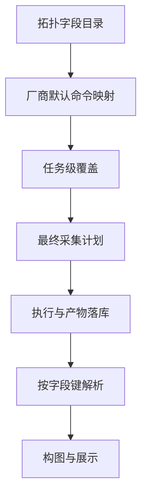
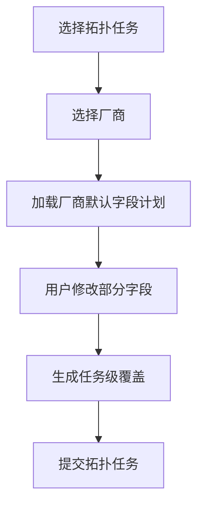

# 拓扑还原采集命令可配置化规划设计书

## 1. 背景与目标

当前拓扑采集链路的真实执行入口并不在编译器步骤声明，而是在设备画像中的命令列表：[`TopologyTaskCompiler.buildCollectSteps`](internal/taskexec/topology_compiler.go:151) 只声明采集字段键，而 [`DeviceCollectExecutor.executeCollect`](internal/taskexec/executor_impl.go:427) 实际通过 [`config.GetDeviceProfile`](internal/taskexec/executor_impl.go:481) 读取 [`DeviceProfile.Commands`](internal/config/device_profile.go:90) 构建执行计划。

这导致当前架构存在三个问题：

1. 拓扑采集字段与命令文本强绑定在厂商画像中，用户无法输入自定义命令
2. 拓扑任务界面明确写死了 采集命令固定不可修改 的交互约束，见 [`frontend/src/components/task/TaskEditModal.vue`](frontend/src/components/task/TaskEditModal.vue:22)
3. 拓扑任务创建页仅能选择厂商与是否自动构图，无法表达字段级命令覆盖，见 [`frontend/src/views/Tasks.vue`](frontend/src/views/Tasks.vue:166)

本次规划目标是将 拓扑还原所需采集字段 与 厂商命令映射 解耦，形成 字段固定、命令可配置、任务可覆盖、解析契约稳定 的整体方案。

### 1.1 目标

- 固定拓扑采集字段目录，不允许用户临时新增字段类型
- 支持厂商级默认命令映射，作为长期维护配置
- 支持任务级临时覆盖，作为单次任务执行覆盖层
- 保持解析链路仍以字段键驱动，而不是以命令文本驱动
- 保持原始输出、解析输出、证据链、构图链路可追溯
- 方案要适配整体拓扑架构，而不是只改某个函数

### 1.2 非目标

- 不在本次方案中开放用户自定义新增解析字段
- 不在本次方案中改造 TextFSM 模板体系为动态模板平台
- 不在本次方案中调整拓扑构图算法主逻辑，只保证采集命令来源可配置化

---

## 2. 现状架构分析

### 2.1 当前真实链路


当前关键链路如下：

- 任务配置定义见 [`TopologyTaskConfig`](internal/taskexec/config_models.go:38)
- 采集阶段编译见 [`TopologyTaskCompiler.Compile`](internal/taskexec/topology_compiler.go:24)
- 采集命令来源见 [`DeviceProfile.Commands`](internal/config/device_profile.go:90)
- 实际执行见 [`DeviceCollectExecutor.executeCollect`](internal/taskexec/executor_impl.go:427)
- 原始输出索引见 [`TaskRawOutput`](internal/taskexec/topology_models.go:35)
- 解析分发基于 [`switch output.CommandKey`](internal/taskexec/executor_impl.go:1030)
- 构图读取 LLDP、FDB、ARP、聚合事实见 [`TopologyBuildExecutor.buildRunTopology`](internal/taskexec/executor_impl.go:1274)

### 2.2 当前问题归纳

#### 问题一：字段语义与命令文本未解耦

当前 [`CommandSpec`](internal/config/device_profile.go:76) 同时承担 命令文本、命令键、超时 三种职责，但命令键集合并没有被抽象为拓扑字段目录，导致：

- 用户只能改整套画像，不能只改某个字段的命令
- 编译器、执行器、解析器对字段集合没有统一元数据源
- 前端无法基于字段能力动态渲染配置表单

#### 问题二：配置层级单一

当前只有厂商画像默认值，没有任务级覆盖层：

- 设备画像层写死在 [`internal/config/device_profile.go`](internal/config/device_profile.go)
- 任务配置 [`TopologyTaskConfig`](internal/taskexec/config_models.go:38) 没有命令覆盖字段
- 前端创建页和编辑页都没有字段级输入入口

#### 问题三：命令可改但解析契约不能乱

解析阶段是按照字段键分发，而不是按命令文本分发，见 [`switch output.CommandKey`](internal/taskexec/executor_impl.go:1030)。

这说明命令可配置化的正确方向不是让用户自由定义解析键，而是：

- 系统固定字段键，例如 `lldp_neighbor`、`mac_address`、`arp_all`
- 用户只改这个字段对应的命令文本
- 执行结果继续以原字段键入库和解析

这是本次方案的核心设计原则。

---

## 3. 设计原则

### 3.1 字段目录固定

系统维护统一拓扑采集字段目录，建议首批字段为：

- `version`
- `sysname`
- `esn`
- `device_info`
- `interface_brief`
- `interface_detail`
- `lldp_neighbor`
- `mac_address`
- `arp_all`
- `eth_trunk`

其中字段来源与当前编译器声明保持一致，见 [`buildCollectSteps`](internal/taskexec/topology_compiler.go:154)。

### 3.2 命令文本可配置

每个字段对每个厂商都允许配置：

- 实际采集命令
- 超时时间
- 是否启用
- 采集说明或备注

### 3.3 解析契约稳定

解析器、事实表、构图器仍然面向字段键，不面向用户输入命令文本。

换句话说：

- 字段键决定解析模板与落表行为
- 命令文本只决定如何拿到对应输出
- 原始输出仍落到以字段键命名的产物路径中，例如 [`result.CommandKey+"_raw.txt"`](internal/taskexec/executor_impl.go:632)

### 3.4 双层配置优先级

采用两层覆盖模型：

1. 厂商默认命令映射
2. 任务级临时覆盖

最终执行优先级：

`任务级覆盖 > 厂商默认配置 > 系统内置字段默认值`

### 3.5 失败可观测

必须保证用户能看出：

- 某字段是否启用
- 最终执行命令是什么
- 该命令来源于默认配置还是任务覆盖
- 该命令的输出是否被成功解析

---

## 4. 总体方案设计

### 4.1 核心设计思路

把当前设备画像中的命令列表重构为三层抽象：

1. 拓扑字段目录层
2. 厂商默认映射层
3. 任务级覆盖层



### 4.2 新的领域对象划分

#### 4.2.1 字段目录对象

建议引入拓扑字段元数据对象，用于定义系统支持哪些字段。

建议模型：

```go
TopologyFieldSpec {
  FieldKey       string
  Name           string
  Phase          string
  Required       bool
  ParserBinding  string
  DefaultEnabled bool
  Description    string
}
```

建议说明：

- `FieldKey`：固定字段键，例如 `lldp_neighbor`
- `Name`：界面显示名称
- `Phase`：归属阶段，例如 identity、interface、neighbor、forwarding
- `Required`：是否为拓扑构图强相关字段
- `ParserBinding`：解析绑定键，默认与 `FieldKey` 相同
- `DefaultEnabled`：该字段默认是否启用
- `Description`：用户提示信息

建议将字段目录放在拓扑域，而不是直接继续写死在 [`internal/config/device_profile.go`](internal/config/device_profile.go:117)。

#### 4.2.2 厂商默认命令映射对象

建议引入厂商拓扑命令映射对象：

```go
TopologyVendorCommandSetting {
  Vendor      string
  FieldKey    string
  Command     string
  TimeoutSec  int
  Enabled     bool
  Notes       string
  UpdatedAt   time.Time
}
```

含义：

- 每个厂商对每个字段有一条独立配置
- 替代当前画像中一维数组式的 [`Commands []CommandSpec`](internal/config/device_profile.go:90)
- 更适合前端按表格方式维护

#### 4.2.3 任务级覆盖对象

建议在拓扑任务配置中增加字段级覆盖：

```go
TopologyTaskFieldOverride {
  FieldKey    string
  Command     string
  TimeoutSec  int
  Enabled     *bool
}
```

说明：

- 只存本次任务需要覆盖的项，不重复存整套默认配置
- `Enabled` 建议用可空语义，表示是否显式覆盖启停状态
- 若字段未覆盖，则继续使用厂商默认映射

---

## 5. 数据模型设计

### 5.1 后端配置模型改造

#### 5.1.1 改造 [`TopologyTaskConfig`](internal/taskexec/config_models.go:38)

建议新增如下字段：

```go
TopologyTaskConfig {
  DeviceIDs             []uint
  DeviceIPs             []string
  GroupNames            []string
  Vendor                string
  MaxWorkers            int
  TimeoutSec            int
  AutoBuildTopology     bool
  EnableRawLog          bool
  FieldOverrides        []TopologyTaskFieldOverride
}
```

新增 `FieldOverrides` 后，拓扑任务就具备了任务级临时命令覆盖能力。

#### 5.1.2 设备画像模型演进建议

当前 [`DeviceProfile`](internal/config/device_profile.go:83) 中的 [`Commands`](internal/config/device_profile.go:90) 不建议直接删除，而建议分阶段演进：

第一阶段：兼容保留

- 继续保留 [`Commands`](internal/config/device_profile.go:90) 作为系统内置兜底来源
- 新增 Topology 专用默认命令配置读取入口
- 若新配置缺失，则回退到老画像命令列表

第二阶段：职责收敛

- 将拓扑采集命令全部迁出画像静态常量
- 画像只保留 PTY、Prompt、Pager、Init 等设备连接特征
- 拓扑命令由专门的配置服务提供

这是更符合整体架构边界的方向。

### 5.2 持久化模型设计

建议新增独立配置表，而不是把厂商默认命令仍写死在代码里。

建议表一：拓扑厂商字段命令配置表

```text
net_topology_vendor_field_commands
```

建议字段：

- `id`
- `vendor`
- `field_key`
- `command`
- `timeout_sec`
- `enabled`
- `notes`
- `created_at`
- `updated_at`

唯一索引建议：

- `vendor + field_key`

建议表二：可选审计表

如后续需要历史审计，再增加：

```text
net_topology_vendor_field_command_history
```

但首版不是必须。

### 5.3 运行期留痕增强

当前 [`TaskRawOutput`](internal/taskexec/topology_models.go:35) 已记录：

- `CommandKey`
- `Command`
- `RawFilePath`
- `ParseFilePath`
- `ParseStatus`

建议进一步增强留痕信息：

```go
TaskRawOutput {
  ...
  CommandSource string
  FieldEnabled  bool
}
```

其中：

- `CommandSource`：`system_default`、`vendor_default`、`task_override`
- `FieldEnabled`：执行时该字段是否处于启用状态

这样在问题追溯时，可以明确知道某条输出到底是谁决定执行的。

---

## 6. 配置解析与优先级设计

### 6.1 最终命令决策流程

建议新增一个统一决策服务，例如：

- `ResolveTopologyCollectionPlan`
- 或 `BuildTopologyCollectionCommands`

输入：

- 目标厂商
- 系统字段目录
- 厂商默认命令映射
- 任务级字段覆盖
- 系统兜底画像命令

输出：

- 最终采集字段计划列表

建议输出模型：

```go
ResolvedTopologyCommand {
  FieldKey       string
  DisplayName    string
  Command        string
  TimeoutSec     int
  Enabled        bool
  CommandSource  string
  ParserBinding  string
}
```

### 6.2 决策规则

对每个固定字段执行如下流程：

1. 读取字段目录，确定字段是否存在
2. 读取厂商默认配置
3. 读取任务级覆盖
4. 合并生成最终命令
5. 若最终 `Enabled=false`，则不进入执行计划
6. 若最终 `Command` 为空，则按规则处理

### 6.3 空命令处理规则

建议区分三类：

#### 场景一：非必选字段为空

- 允许保存
- 执行时跳过
- 前端提示 该字段未配置，将不采集

#### 场景二：关键字段为空

例如 `lldp_neighbor`、`interface_brief`、`mac_address`、`arp_all` 等关键字段为空时：

- 厂商默认配置保存阶段即给出校验告警
- 任务创建阶段若用户关闭或清空关键字段，需要二次确认
- 允许执行，但任务摘要中需要明确提示 可能影响拓扑还原完整性

#### 场景三：任务覆盖为空字符串

任务级覆盖若把命令清空，建议解释为：

- 若同时 `Enabled=false`，表示显式关闭字段
- 若仅命令为空但未关闭，不允许保存

这样能减少歧义。

### 6.4 优先级规则

| 层级 | 来源                 | 说明         |
| ---- | -------------------- | ------------ |
| P1   | 任务级覆盖           | 单次任务生效 |
| P2   | 厂商默认命令映射     | 长期维护配置 |
| P3   | 系统内置默认画像命令 | 兜底保障     |

建议最终决策时同时记录每个字段的 `CommandSource`。

---

## 7. 执行链路改造设计

### 7.1 编译层改造

当前 [`TopologyTaskCompiler.buildCollectSteps`](internal/taskexec/topology_compiler.go:151) 是写死字段键数组。

规划建议：

- 编译器不再自行维护写死数组
- 改为读取统一字段目录
- Stage Step 仍以字段键作为步骤标识
- Step 中只描述字段，不携带最终命令文本

建议职责边界：

- 编译器：决定采集哪些字段类别
- 执行器：结合设备厂商与任务覆盖决策最终命令文本

这样可以保持运行时对设备厂商的动态适配能力。

### 7.2 执行器改造

当前 [`DeviceCollectExecutor.executeCollect`](internal/taskexec/executor_impl.go:555) 直接遍历 [`profile.Commands`](internal/config/device_profile.go:90) 构建执行命令。

规划建议：

1. 获取设备厂商画像用于连接特征，不再直接拿画像命令当最终命令源
2. 读取任务配置中的 `FieldOverrides`
3. 读取厂商默认映射
4. 调用统一命令决策服务，生成最终命令计划
5. 写入扩展日志，记录每个字段最终命令及来源
6. 再构建 [`executor.PlannedCommand`](internal/taskexec/executor_impl.go:564)

建议新增日志：

- 拓扑采集字段决策
- 字段命令覆盖命中
- 字段被禁用跳过
- 关键字段缺失告警

### 7.3 原始输出落盘策略

当前原始输出路径以 [`result.CommandKey+"_raw.txt"`](internal/taskexec/executor_impl.go:632) 命名，这个策略应保留。

原因：

- 字段键稳定，命令文本不稳定
- 命令文本可能包含空格、管道、特殊字符，不适合作为路径名
- 同一字段不同厂商命令不同，但语义仍然相同

因此建议：

- 路径命名继续基于字段键
- 数据库存储具体执行命令文本，见 [`TaskRawOutput.Command`](internal/taskexec/topology_models.go:40)
- 前端展示时显示 字段键 + 实际执行命令 + 来源

---

## 8. 解析契约设计

### 8.1 契约核心

解析阶段继续以 [`output.CommandKey`](internal/taskexec/executor_impl.go:1030) 为分发依据，不改为按命令文本匹配。

这是必须坚持的原则，否则会导致：

- TextFSM 模板选择逻辑失稳
- 相同字段不同命令无法共用解析通道
- 前后端都无法可靠理解采集语义

### 8.2 字段与解析器绑定关系

建议把字段目录中的 `ParserBinding` 显式化：

| 字段键             | 解析绑定           | 说明                               |
| ------------------ | ------------------ | ---------------------------------- |
| `version`          | `version`          | 设备版本解析                       |
| `sysname`          | `sysname`          | 当前可先仅采集留痕，后续再完善落表 |
| `esn`              | `esn`              | 当前可先仅采集留痕，后续再完善落表 |
| `device_info`      | `device_info`      | 当前可先仅采集留痕，后续再完善落表 |
| `interface_brief`  | `interface_brief`  | 接口摘要                           |
| `interface_detail` | `interface_detail` | 接口详情                           |
| `lldp_neighbor`    | `lldp_neighbor`    | LLDP 邻居                          |
| `mac_address`      | `mac_address`      | FDB 表                             |
| `arp_all`          | `arp_all`          | ARP 表                             |
| `eth_trunk`        | `eth_trunk`        | 聚合口                             |

### 8.3 解析失败处理

若用户自定义命令与模板不匹配，属于可预期失败，应强化提示但不阻断框架：

- 原始输出照常落盘
- `ParseStatus` 标记为 `parse_failed`
- 错误信息写入 [`TaskRawOutput.ParseError`](internal/taskexec/topology_models.go:45)
- 运行详情页显示 字段配置可能与模板不匹配

建议增加一条面向用户的判定规则：

- 系统允许用户自定义命令
- 但要求输出语义与该字段解析模板兼容
- 这是配置责任边界，而不是系统自动兜底识别自由文本

---

## 9. 前端交互设计

### 9.1 设计目标

前端要同时支持两类操作：

1. 维护厂商默认命令映射
2. 在创建拓扑任务时做本次覆盖

### 9.2 厂商默认命令维护界面

建议新增 拓扑采集配置 页面，或并入设置中心。

展示形式建议为 二维表格：

- 行：固定字段目录
- 列：命令、超时、是否启用、说明、解析提示

建议字段展示：

| 字段 | 说明 | 是否关键 | 命令 | 超时 | 启用 | 备注 |
| ---- | ---- | -------- | ---- | ---- | ---- | ---- |

交互要求：

- 切换厂商时加载该厂商所有字段配置
- 未配置项显示系统兜底值
- 关键字段关闭时显示黄色告警
- 支持一键恢复厂商默认内置值

### 9.3 拓扑任务创建页改造

当前 [`frontend/src/views/Tasks.vue`](frontend/src/views/Tasks.vue:166) 的拓扑参数区只有厂商与自动构图。

建议新增 字段级采集计划 面板：

- 默认展示根据所选厂商加载的字段计划
- 每一行可编辑 命令、超时、是否启用
- 每一行显示来源标签：默认 或 本次覆盖
- 支持 仅查看默认值 与 展开编辑 两种模式

建议交互结构：



### 9.4 拓扑任务编辑页改造

当前编辑页明确提示拓扑任务命令固定不可修改，见 [`frontend/src/components/task/TaskEditModal.vue`](frontend/src/components/task/TaskEditModal.vue:22)。

建议改为：

- 支持查看当前任务绑定的字段计划
- 支持编辑未运行任务的任务级覆盖
- 已运行任务仅允许查看，不建议修改

文案建议从 固定不可修改 调整为：

- 厂商默认命令可在配置中心维护
- 当前任务可查看或覆盖字段命令
- 已开始运行的任务不允许改命令

### 9.5 运行详情展示增强

建议在任务执行详情与设备详情中增加以下展示：

- 字段键
- 实际执行命令
- 命令来源
- 解析状态
- 失败原因

这样用户能快速判断是：

- 命令没执行成功
- 命令执行成功但模板不匹配
- 字段被关闭，未参与采集

---

## 10. 后端接口规划

### 10.1 建议新增接口

#### 厂商默认命令配置接口

- 获取指定厂商拓扑采集字段配置
- 保存指定厂商拓扑采集字段配置
- 重置指定厂商为系统默认配置
- 获取系统支持的拓扑字段目录

#### 拓扑任务辅助接口

- 根据厂商获取本次任务可编辑的字段计划预览
- 返回字段说明、关键性、默认命令、超时、启用状态

### 10.2 返回结构建议

建议前端拿到的是 已展平的字段计划，而不是自行拼装多层配置。

例如：

```json
[
  {
    "fieldKey": "lldp_neighbor",
    "name": "LLDP 邻居",
    "required": true,
    "enabled": true,
    "command": "display lldp neighbor",
    "timeoutSec": 60,
    "commandSource": "vendor_default",
    "description": "用于发现直连邻居"
  }
]
```

这样前端开发成本最低，也最适合统一校验。

---

## 11. 校验策略设计

### 11.1 保存厂商默认命令时的校验

- 字段键必须属于系统固定目录
- 启用字段的命令不能为空
- 超时必须大于零
- 同一厂商字段不能重复

### 11.2 创建任务时的校验

- 覆盖字段必须属于固定目录
- 若显式启用字段，则命令不能为空
- 若禁用关键字段，给出风险提示但允许提交
- 若全部关键拓扑字段都被禁用，阻止提交

建议关键字段集合首版定义为：

- `lldp_neighbor`
- `interface_brief`
- `mac_address`
- `arp_all`
- `eth_trunk`

### 11.3 执行前校验

执行器在生成最终命令计划前再次校验：

- 至少存在一条启用命令
- 若关键字段全部缺失，写入任务级告警
- 若字段存在但命令为空，跳过并写告警日志

---

## 12. 迁移与兼容策略

项目当前为新建项目，本次方案无需为了历史包袱做复杂兼容，但仍建议采用平滑演进路径。

### 12.1 初始化策略

系统首次启动或迁移时：

- 读取现有 [`DeviceProfile.Commands`](internal/config/device_profile.go:147)
- 将其灌入新的厂商默认命令配置表
- 作为各厂商首版默认数据

### 12.2 过渡期回退策略

在新配置服务未读到厂商字段映射时：

- 回退到 [`GetDeviceProfile`](internal/config/device_profile.go:241) 提供的旧命令列表
- 但执行日志中明确标记 `system_default`

### 12.3 最终收敛策略

待新配置稳定后：

- 旧画像中的 [`Commands`](internal/config/device_profile.go:90) 仅保留最小兜底
- 主逻辑统一迁移到拓扑命令配置服务

---

## 13. 风险分析与控制

### 13.1 主要风险

#### 风险一：用户自定义命令与模板不兼容

影响：

- 采集成功但解析失败
- 构图结果为空或不完整

控制措施：

- 每个字段在界面显示模板兼容提示
- 运行详情展示 `parse_failed`
- 为厂商默认值提供一键恢复

#### 风险二：关键字段被关闭导致拓扑严重缺失

影响：

- 链路还原不完整
- 设备只有节点没有边

控制措施：

- 关键字段在 UI 特殊标识
- 禁用关键字段时二次确认
- 任务摘要显示关键字段关闭告警

#### 风险三：配置层级过多导致用户困惑

影响：

- 不理解默认值与覆盖值差异

控制措施：

- 每条字段展示来源标签
- 提供 恢复默认 按钮
- 任务级界面默认只展示变更项，支持展开查看全部

#### 风险四：执行日志不可追溯

影响：

- 无法判断本次到底执行了什么

控制措施：

- 在 [`TaskRawOutput`](internal/taskexec/topology_models.go:35) 增加命令来源留痕
- 日志中打印最终字段计划
- 前端运行详情展示实际命令文本

---

## 14. 测试策略

### 14.1 单元测试

重点覆盖：

1. 字段目录加载测试
2. 厂商默认命令解析测试
3. 任务覆盖优先级测试
4. 空命令与禁用逻辑测试
5. 最终命令计划构建测试
6. 回退到系统默认画像测试

### 14.2 集成测试

重点覆盖：

1. 创建拓扑任务并带任务级覆盖
2. 执行器生成最终命令计划
3. 原始输出按字段键落盘
4. 解析仍按字段键生效
5. 关键字段禁用后的构图退化行为

### 14.3 前端测试

重点覆盖：

1. 厂商默认字段计划加载
2. 任务创建页字段覆盖编辑
3. 来源标签展示
4. 关键字段关闭告警
5. 运行详情的字段执行信息展示

---

## 15. 分阶段实施步骤

### 阶段一：领域与配置建模

- 建立固定拓扑字段目录
- 建立厂商默认命令配置表与服务
- 为任务配置增加字段覆盖结构
- 提供字段计划解析服务

### 阶段二：执行链路接入

- 改造采集执行器，从字段计划服务获取命令
- 增强运行日志与原始输出留痕
- 保证解析链路继续使用固定字段键

### 阶段三：前端配置与任务创建接入

- 增加厂商默认命令维护页面
- 改造拓扑任务创建页，支持任务级覆盖
- 改造任务编辑页与运行详情页展示

### 阶段四：测试与收敛

- 完成单元与集成测试
- 验证厂商默认数据初始化
- 收敛旧画像中拓扑命令职责

---

## 16. 推荐的代码落点

### 16.1 后端建议落点

- 字段目录定义：`internal/taskexec` 或新增拓扑配置域
- 厂商默认命令配置服务：`internal/config` 下新增拓扑命令配置模块
- 任务字段覆盖模型：[`internal/taskexec/config_models.go`](internal/taskexec/config_models.go:38)
- 执行期命令解析：[`internal/taskexec/executor_impl.go`](internal/taskexec/executor_impl.go:427)
- 运行期留痕：[`internal/taskexec/topology_models.go`](internal/taskexec/topology_models.go:35)

### 16.2 前端建议落点

- 拓扑任务创建页改造：[`frontend/src/views/Tasks.vue`](frontend/src/views/Tasks.vue:166)
- 拓扑任务编辑页改造：[`frontend/src/components/task/TaskEditModal.vue`](frontend/src/components/task/TaskEditModal.vue:182)
- 类型定义扩展：[`frontend/src/types/taskexec.ts`](frontend/src/types/taskexec.ts:1)
- 若新增设置页，可放入 `frontend/src/views` 或 `frontend/src/components` 下的配置模块

---

## 17. 最终方案结论

本次规划的核心结论如下：

1. 拓扑采集字段目录固定，禁止任务侧自由新增字段类型
2. 命令文本从字段语义中解耦，用户只配置字段对应命令
3. 采用 厂商默认命令映射 + 任务级临时覆盖 的双层模型
4. 执行器不再直接依赖 [`DeviceProfile.Commands`](internal/config/device_profile.go:90) 作为唯一命令来源
5. 解析器与构图器继续基于稳定字段键运行，确保架构闭环不被破坏
6. 原始输出、执行日志、运行详情必须完整展示 最终命令 与 来源，实现全链路可追溯

该方案兼顾了整体项目架构、配置演进、执行链路、前端交互、测试策略与后续收敛路径，适合作为拓扑还原采集命令可配置化的正式实施蓝图。
