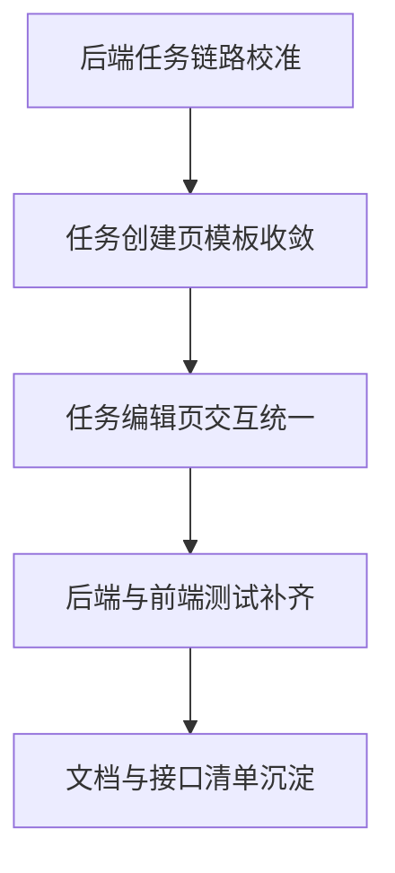

# 拓扑命令定制化实施进度报告

## 1. 目标与范围

本报告用于同步拓扑命令定制化改造的当前实施状态，覆盖后端配置与运行链路、前端配置中心、任务创建页与任务编辑页、测试与文档沉淀。

基线设计文档：[`topology_command_customization_design.md`](docs/topology_command_customization_design.md)

---

## 2. 当前进度总览

| 序号 | 工作项                | 状态           | 说明                                                               |
| ---- | --------------------- | -------------- | ------------------------------------------------------------------ |
| 1    | 设计基线对齐          | ✅ Completed   | 已完成目标链路与边界确认                                           |
| 2    | 后端链路扫描          | ✅ Completed   | 模型、Resolver、执行器、UI Service 已完成核对                      |
| 3    | 前端现状扫描          | ✅ Completed   | 创建页、编辑页、配置中心能力覆盖已核对                             |
| 4    | 范围确认              | ✅ Completed   | 明确按全量实施推进                                                 |
| 5    | 后端配置域服务完善    | ✅ Completed   | 厂商默认命令查询/保存/重置与字段校验已完成                         |
| 6    | 后端运行期闭环完善    | ✅ Completed   | 字段计划留痕、来源字段一致性、查询透出已完成                       |
| 7    | 后端任务链路校准      | ⏳ Pending     | TaskGroup → LaunchSpec → TaskConfig 覆盖透传与厂商决策一致性待完成 |
| 8    | 前端 API 与类型收敛   | ✅ Completed   | 拓扑命令配置/预览 API 命名空间与 DTO 已完成                        |
| 9    | 前端配置中心页面+路由 | 🔄 In Progress | 页面核心交互已就绪，待与整体任务链路联调后收口                     |
| 10   | 前端任务创建页改造    | ⏳ Pending     | 脚本逻辑已具备，模板侧覆盖编辑与预览区需落地收敛                   |
| 11   | 前端任务编辑页收敛    | ⏳ Pending     | 需统一可编辑/只读策略与文案交互一致性                              |
| 12   | 测试补齐              | ⏳ Pending     | 后端与前端关键路径测试待补齐                                       |
| 13   | 构建回归              | ✅ Completed   | 已通过 [`build.bat`](build.bat) 完成一次构建验证                   |
| 14   | 文档沉淀              | 🔄 In Progress | 本进度文档已新增，接口清单与最终交付基线待补充                     |

---

## 3. 已落地能力与证据

### 3.1 前端配置中心与导航链路

- 路由已接入拓扑命令配置页：[`TopologyCommandConfig`](frontend/src/router/index.ts:80)
- 侧边栏菜单已接入入口：[`menuItems`](frontend/src/App.vue:119)
- 页面已具备厂商切换、保存、重置、单行撤销、脏检查与校验：[`saveVendor()`](frontend/src/views/TopologyCommandConfig.vue:285)

### 3.2 前端 API 与类型层

- 配置中心 API 命名空间：[`TopologyCommandConfigAPI`](frontend/src/services/api.ts:181)
- 任务级命令预览 API 命名空间：[`TopologyCommandAPI`](frontend/src/services/api.ts:198)
- 类型导出已覆盖预览与配置 DTO：[`TopologyCommandPreviewView`](frontend/src/services/api.ts:363)

### 3.3 任务创建页当前状态

- 已存在拓扑覆盖与预览脚本能力：[`loadTopologyPreview()`](frontend/src/views/Tasks.vue:833)
- 已存在覆盖编辑处理函数：[`onTopologyCommandInput()`](frontend/src/views/Tasks.vue:800)
- 当前主要缺口在模板未完整呈现“字段覆盖 + 预览卡片 + 风险提示”区域

### 3.4 任务编辑页当前状态

- 编辑弹窗已有较完整拓扑覆盖编辑区域：[`v-else-if="isTopologyTaskValue"`](frontend/src/components/task/TaskEditModal.vue:348)
- 已具备刷新预览、恢复继承、字段级启停/命令/超时编辑能力：[`loadTopologyPreview()`](frontend/src/components/task/TaskEditModal.vue:1111)

---

## 4. 当前关键差距

1. 后端任务链路透传一致性仍需最终校准，避免创建/编辑/执行三段配置语义漂移
2. 创建页模板与脚本存在能力不对齐，导致预览与覆盖能力未完整可视化
3. 编辑页需与创建页在交互文案、风险提示、状态约束上统一
4. 自动化测试与回归用例尚未覆盖本轮新增能力

---

## 5. 后续执行计划

### 阶段 A 后端任务链路校准

- 对齐 [`TaskGroupService`](internal/ui/task_group_service.go) 入参与出参语义
- 校准 [`CreateTaskDefinitionFromLaunchSpec`](internal/taskexec/launch_service.go:367) 的覆盖透传
- 校准 [`Compile`](internal/taskexec/topology_compiler.go:24) 厂商决策与覆盖优先级

### 阶段 B 创建页改造收口

- 在 [`Tasks.vue`](frontend/src/views/Tasks.vue) 落地字段覆盖编辑区
- 落地预览状态块、未刷新变更提示、字段级有效性提示
- 保证创建弹窗前置校验与预览状态一致

### 阶段 C 编辑页一致性收口

- 统一 [`TaskEditModal.vue`](frontend/src/components/task/TaskEditModal.vue) 与创建页交互语义
- 统一只读/可编辑状态控制与提示文案
- 统一恢复继承、刷新预览、覆盖统计行为

### 阶段 D 测试补齐

- 后端：Resolver 优先级、配置服务校验、TaskGroup 回显、运行留痕
- 前端：配置中心保存/重置、创建页覆盖校验、编辑页回显一致性

### 阶段 E 文档沉淀

- 在 [`docs`](docs) 增补接口清单、状态机说明、验收清单
- 固化最终交付基线与回归入口

---

## 6. 验收口径

1. 配置中心、创建页、编辑页对同一拓扑字段的展示与保存语义一致
2. 任务创建后执行链路读取到的厂商与覆盖项与 UI 输入一致
3. 运行产物可追溯字段来源与覆盖来源
4. 构建与核心回归通过，文档可独立指导后续维护
