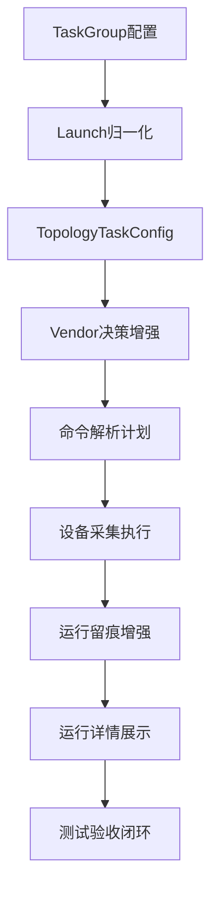

# 拓扑还原采集命令可配置化补充实施方案

## 1. 文档目的

本文档基于既有设计基线 [`docs/topology_command_customization_design.md`](docs/topology_command_customization_design.md) 与当前代码落地现状，给出补充实施方案，用于完成最终实施闭环。

当前结论不是推翻已实现能力，而是在已落地主链路上完成收口：

- 保持配置域与运行时域边界不变
- 保持字段键稳定契约不变
- 补齐 Vendor 决策、运行留痕、校验规则、运行详情展示、测试闭环

---

## 2. 当前完成度与差距归纳

### 2.1 已完成能力

以下能力已在主干链路落地：

- 配置域模型与迁移：[`TopologyVendorFieldCommand`](internal/models/topology_command.go:25)、[`autoMigrateAll()`](internal/config/db.go:78)
- 任务组持久化根对象透传：[`TaskGroup`](internal/models/models.go:162) 中的 [`TopologyFieldOverrides`](internal/models/models.go:172)
- 归一化与运行时配置透传：[`LaunchNormalizer.normalizeTopology()`](internal/taskexec/launch_service.go:233)、[`CreateTaskDefinitionFromLaunchSpec()`](internal/taskexec/launch_service.go:367)
- 统一命令解析器接入执行器：[`TopologyCommandResolver.Resolve()`](internal/taskexec/topology_command_resolver.go:117)、[`DeviceCollectExecutor.executeCollect()`](internal/taskexec/executor_impl.go:451)
- 运行留痕与计划快照：[`TaskRawOutput`](internal/taskexec/topology_models.go:35)、[`persistCollectionPlanArtifact()`](internal/taskexec/executor_impl.go:1027)
- 前端入口：[`Tasks.vue`](frontend/src/views/Tasks.vue:170)、[`TaskEditModal.vue`](frontend/src/components/task/TaskEditModal.vue:348)、[`TopologyCommandConfig.vue`](frontend/src/views/TopologyCommandConfig.vue:1)

### 2.2 待补齐差距

1. Vendor 决策链未完整覆盖设计中的探测回退分支，当前仅有 task > inventory > fallback，见 [`resolveVendor()`](internal/taskexec/topology_command_resolver.go:211)
2. 运行留痕缺少字段启停事实，[`TaskRawOutput`](internal/taskexec/topology_models.go:35) 尚无 `FieldEnabled`
3. 任务组保存校验过弱，[`validateTaskGroup()`](internal/config/task_group.go:114) 仅校验名称
4. 运行详情页面未形成命令来源与字段启停展示闭环，且仍有历史文案偏差，见 [`TaskExecution.vue`](frontend/src/views/TaskExecution.vue:445)
5. 测试覆盖未形成设计要求的优先级规则与留痕闭环

---

## 3. 补充实施目标

### 3.1 总体目标

在不改变现有主架构分层的前提下，完成以下收敛：

- Vendor 决策规则与设计一致
- 命令解析与执行留痕可审计
- 任务保存、执行前、运行后校验链闭环
- 创建页、编辑页、运行详情、配置中心信息一致
- 核心链路具备稳定自动化测试覆盖

### 3.2 边界约束

- 配置域对象继续归属 [`internal/models`](internal/models)
- 配置迁移继续由 [`autoMigrateAll()`](internal/config/db.go:78) 承担
- 运行期事实继续由 [`taskexec.AutoMigrate()`](internal/taskexec/persistence.go:280) 管理
- 不采用历史兼容双轨逻辑，直接收敛到目标结构

---

## 4. 补充目标架构

说明：

- D 关注 Vendor 决策完整性
- G 关注运行事实可追溯性
- H 关注 UI 可观测性
- I 关注可回归性

---

## 5. 详细补充实施项

### 5.1 Vendor 决策链补齐

#### 目标

将 Vendor 解析从当前三段式收敛为设计要求的正式决策链，并输出稳定来源标记。

#### 改造点

- 在 [`TopologyCommandResolver`](internal/taskexec/topology_command_resolver.go:53) 中扩展来源枚举，保留现有 source 并新增 detect source
- 在 [`resolveVendor()`](internal/taskexec/topology_command_resolver.go:211) 上游增加探测入口，明确 task、inventory、detect、fallback 的判定顺序
- 在 [`ResolvedTopologyCommand`](internal/taskexec/topology_command_resolver.go:31) 与计划快照文档中统一输出 vendor source

#### 验收

- 任务显式 vendor 场景：来源稳定为 task
- 资产 vendor 场景：来源稳定为 inventory
- 探测回退场景：来源稳定为 detect
- 最终兜底场景：来源稳定为 fallback

---

### 5.2 运行留痕事实增强

#### 目标

让运行期证据满足命令来源、厂商来源、字段启停全量可追溯。

#### 改造点

- 扩展 [`TaskRawOutput`](internal/taskexec/topology_models.go:35) 增加 `FieldEnabled`
- 在 [`createTaskRawOutput()`](internal/taskexec/executor_impl.go:993) 写入字段启停事实
- 在 [`persistCollectionPlanArtifact()`](internal/taskexec/executor_impl.go:1027) 保证计划快照与数据库事实对齐

#### 验收

- 任意字段可从数据库和计划快照双向追溯启停状态
- 运行复盘可解释为何字段未执行

---

### 5.3 任务保存与执行前校验闭环

#### 目标

让任务配置在落库前即满足字段合法性和关键字段策略，避免把错误推迟到运行期。

#### 改造点

- 增强 [`validateTaskGroup()`](internal/config/task_group.go:114)
  - 字段键必须属于固定字段目录
  - 启用字段命令不能为空
  - 超时时间必须大于 0
  - 关键字段全部禁用时阻止保存
- 在运行前继续保留执行级防线，结合 [`executeCollect()`](internal/taskexec/executor_impl.go:451) 的命令计划校验

#### 验收

- 错误覆盖配置在保存阶段即可拦截
- 运行阶段仅处理动态环境异常，不承担配置合法性主校验

---

### 5.4 前端运行详情与文案一致性收敛

#### 目标

实现创建、编辑、执行详情、配置中心四入口信息一致。

#### 改造点

- 修正文案与功能一致性：[`TaskExecution.vue`](frontend/src/views/TaskExecution.vue:445) 的历史提示改为可覆盖编辑语义
- 在运行详情视图增加命令来源、厂商来源、字段启停的展示区块，消费 [`getRunArtifacts`](frontend/src/services/api.ts:173) 与运行事实
- 与创建编辑页保持同一字段语义：[`Tasks.vue`](frontend/src/views/Tasks.vue:231)、[`TaskEditModal.vue`](frontend/src/components/task/TaskEditModal.vue:553)

#### 验收

- 用户可在运行详情看到字段执行与来源证据
- 页面间不会出现规则冲突或互相否定文案

---

### 5.5 测试与回归基线补齐

#### 目标

构建可回归的最小完备测试集，覆盖补充实施新增规则。

#### 测试分层

- 解析器规则测试：覆盖 vendor source 决策分支
- 任务配置校验测试：覆盖字段键合法性、关键字段策略
- 执行留痕测试：覆盖 `CommandSource`、`VendorSource`、`FieldEnabled`、计划快照产物
- UI 服务测试：覆盖配置服务查询、保存、重置、预览

#### 关联基线

- 现有链路测试参考 [`launch_service_test.go`](internal/taskexec/launch_service_test.go:39)
- 新增测试应聚焦规则收口而非重复路径

---

## 6. 分阶段最终实施清单

### 阶段 A 规则收口

- 补齐 Vendor 探测回退分支
- 统一 vendor source 常量与输出

### 阶段 B 事实收口

- 扩展运行事实模型
- 完成留痕写入与快照对齐

### 阶段 C 校验收口

- 强化任务保存校验
- 保持执行前二次防线

### 阶段 D 展示收口

- 修正文案
- 接入运行详情证据展示

### 阶段 E 测试收口

- 补齐规则测试
- 补齐留痕测试
- 补齐服务端到端测试

---

## 7. 最终验收标准

达到以下条件后，判定实施完成：

1. 设计要求的 Vendor 决策链全部可观察、可验证
2. 运行留痕具备字段级启停与来源证据
3. 任务保存校验覆盖关键规则
4. 四大前端入口信息一致
5. 自动化测试能稳定覆盖新增规则并可回归

---

## 8. 执行顺序建议

按以下顺序推进，避免返工：

1. 先完成后端规则与模型收口
2. 再完成前端运行详情与文案一致性
3. 最后一次性补齐测试并跑全量回归

该顺序可确保前端不依赖未稳定的数据结构，测试也不会因中间结构变更反复重写。

---

## 9. 结论

在现有实现基础上，项目已具备可用主链路；本补充方案用于完成最终实施收口。执行完本文档所有阶段后，即可将“部分完成”升级为“完成实施”，并形成可持续演进的拓扑命令可配置化体系。
