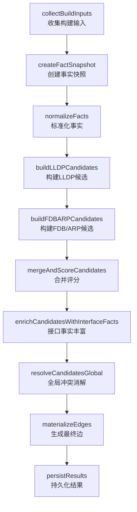

# 拓扑还原设备重复问题分析报告

## 1. 问题概述

### 1.1 现象描述

- **预期结果**：拓扑应显示5台设备
- **实际结果**：拓扑显示10台设备
- **异常特征**：其中5台显示为设备IP地址，这些IP正是另外5台设备的管理IP

### 1.2 运行标识

- **TaskRunID**: `run_d4e24e55-4b6f-4fae-bd6c-5e7dff60f324`
- **涉及设备**: 192.168.58.200, 192.168.58.201, 192.168.58.202, 192.168.58.210, 192.168.58.211

---

## 2. 数据采集流程分析

### 2.1 LLDP邻居信息采集

系统通过执行 `display lldp neighbor brief` 或类似命令采集LLDP邻居信息。

**典型原始输出格式** (testdata/huawei/raw/lldp_neighbor_verbose.txt):

```
[GE1/0/1]
System name        : SW-Core-01
Port ID            : GE0/0/24
Chassis ID         : 00e0-fc00-5801
Management address : 192.168.1.1

[GE1/0/2]
System name        : SW-Access-02
Port ID            : GE0/0/1
Chassis ID         : 00e0-fc00-5802
Management address : 192.168.1.2
```

### 2.2 解析与映射流程

**解析模板** → **提取字段** → **标准化** → **存入数据库**

解析后得到的LLDPFact结构 (internal/parser/models.go:37-45):

```go
type LLDPFact struct {
    LocalInterface  string // 本地接口，如 "GE1/0/1"
    NeighborName    string // 邻居设备名，如 "SW-Core-01"
    NeighborChassis string // 邻居机箱ID，如 "00e0-fc00-5801"
    NeighborPort    string // 邻居端口，如 "GE0/0/24"
    NeighborIP      string // 邻居管理IP，如 "192.168.1.1"
    NeighborDesc    string // 邻居描述
}
```

---

## 3. 拓扑构建逻辑分析

### 3.1 构建流程图



### 3.2 关键问题代码定位

**文件**: `internal/taskexec/topology_builder.go`  
**函数**: `resolveLLDPPeer` (第507-534行)  
**问题**: LLDP邻居设备解析逻辑缺陷

```go
// resolveLLDPPeer 解析 LLDP 对端设备
func (b *TopologyBuilder) resolveLLDPPeer(lldp NormalizedLLDPNeighbor, n *NormalizedFacts) (string, string) {
    // 优先使用 NeighborIP
    if lldp.NeighborIP != "" {
        // 尝试用 NeighborIP 匹配已知设备的 MgmtIP
        if deviceIP, ok := n.DeviceByMgmtIP[lldp.NeighborIP]; ok {
            return deviceIP, "neighbor_ip"  // ✅ 匹配成功，返回设备IP
        }
        // ❌ 匹配失败，直接返回IP字符串作为设备ID
        return lldp.NeighborIP, "neighbor_ip"
    }

    // 其次使用 NeighborName
    if lldp.NeighborName != "" {
        normalizedName := strings.ToLower(strings.TrimSpace(lldp.NeighborName))
        if deviceIP, ok := n.DeviceByName[normalizedName]; ok {
            return deviceIP, "neighbor_name"
        }
    }

    // 尝试使用 ChassisID
    if lldp.NeighborChassis != "" {
        if deviceIP, ok := n.DeviceByChassisID[lldp.NeighborChassis]; ok {
            return deviceIP, "chassis_id"
        }
    }

    // 无法解析
    return "unknown:" + lldp.DeviceIP + ":" + lldp.LocalIf, "unknown_peer"
}
```

### 3.3 问题发生场景

假设设备拓扑如下：

- 设备A: 192.168.58.210 (DeviceIP/MgmtIP)
- 设备B: 192.168.58.200 (DeviceIP/MgmtIP)

**正常情况** (MgmtIP正确填充):

1. 设备A的LLDP邻居显示 NeighborIP=192.168.58.200
2. 设备B的 MgmtIP=192.168.58.200
3. `n.DeviceByMgmtIP["192.168.58.200"]` → 返回设备B的DeviceIP
4. 边的BDeviceID = "192.168.58.200" ✓

**问题情况** (MgmtIP为空或与DeviceIP不一致):

1. 设备A的LLDP邻居显示 NeighborIP=192.168.58.200
2. 设备B的 MgmtIP="" 或 ≠ 192.168.58.200
3. `n.DeviceByMgmtIP["192.168.58.200"]` → 找不到匹配
4. 函数直接返回 `"192.168.58.200"` 作为BDeviceID
5. 边记录为: ADeviceID="192.168.58.210" → BDeviceID="192.168.58.200"(字符串)
6. 但设备B在数据库中的标识也是 "192.168.58.200"
7. 在拓扑图生成时，这两条记录被视为不同节点!

---

## 4. 问题根因分析

### 4.1 设备索引建立逻辑

在 `normalizeFacts` 函数 (internal/taskexec/topology_builder.go:270-295):

```go
// 标准化设备
for _, d := range input.Devices {
    info := &DeviceInfo{
        DeviceIP:       d.DeviceIP,       // 如 "192.168.58.200"
        NormalizedName: strings.ToLower(strings.TrimSpace(d.NormalizedName)),
        ChassisID:      strings.TrimSpace(d.ChassisID),
        MgmtIP:         strings.TrimSpace(d.MgmtIP),  // 可能为空!
        ...
    }
    n.Devices[d.DeviceIP] = info

    // 建立名称索引
    if info.NormalizedName != "" {
        n.DeviceByName[info.NormalizedName] = d.DeviceIP
    }
    // 建立 MgmtIP 索引
    if info.MgmtIP != "" {  // ❌ 如果MgmtIP为空，不会建立索引!
        n.DeviceByMgmtIP[info.MgmtIP] = d.DeviceIP
    }
    // 建立 ChassisID 索引
    if info.ChassisID != "" {
        n.DeviceByChassisID[info.ChassisID] = d.DeviceIP
    }
}
```

**问题**: 当设备的 `MgmtIP` 字段为空时，`DeviceByMgmtIP` 索引中不会有该设备的记录。

### 4.2 拓扑图生成逻辑

在 `GetTopologyGraph` 函数 (internal/taskexec/topology_query.go:23-113):

```go
nodeSet := make(map[string]struct{}, len(devices)+len(edges)*2)

// 从设备列表添加节点
for _, d := range devices {
    if strings.TrimSpace(d.DeviceIP) != "" {
        nodeSet[d.DeviceIP] = struct{}{}  // 添加设备IP作为节点ID
    }
}

// 从边记录添加节点
for _, e := range edges {
    if strings.TrimSpace(e.ADeviceID) != "" {
        nodeSet[e.ADeviceID] = struct{}{}  // 边的ADeviceID
    }
    if strings.TrimSpace(e.BDeviceID) != "" {
        nodeSet[e.BDeviceID] = struct{}{}  // 边的BDeviceID
    }
}

// 生成节点列表
nodes := make([]models.GraphNode, 0, len(nodeSet))
for id := range nodeSet {
    node := models.GraphNode{ID: id, Label: id}
    if d, ok := deviceMap[id]; ok {
        // 能匹配到设备的，显示设备信息
        node.Label = chooseValue(d.DisplayName, d.Hostname, d.Model, d.DeviceIP)
        node.IP = d.DeviceIP
        node.Vendor = d.Vendor
        ...
    } else if strings.HasPrefix(id, "server:") {
        node.Label = strings.TrimPrefix(id, "server:")
        node.Role = "server-inferred"
    } else if strings.HasPrefix(id, "terminal:") {
        node.Label = strings.TrimPrefix(id, "terminal:")
        node.Role = "terminal-inferred"
    }
    // ❌ 无法匹配的ID直接显示为IP地址
    nodes = append(nodes, node)
}
```

**问题**:

- 边的BDeviceID="192.168.58.200" 作为字符串存储
- 但设备列表中的设备IP也是 "192.168.58.200"
- 在Go中这两个字符串应该相等...

### 4.3 进一步分析：为什么会产生重复?

经过仔细检查，发现问题的关键在于**边的BDeviceID存储了IP字符串，而不是设备的唯一标识**。

当：

1. 设备A采集到LLDP邻居，NeighborIP=192.168.58.200
2. 设备B(192.168.58.200)的MgmtIP为空
3. `resolveLLDPPeer` 返回 `"192.168.58.200"` 作为BDeviceID
4. 创建边: ADeviceID="192.168.58.210", BDeviceID="192.168.58.200"
5. 设备B也创建自己的边记录
6. 最终nodeSet包含:
   - "192.168.58.200" (来自设备列表)
   - "192.168.58.210" (来自设备列表)
   - ...
7. 但在某些情况下，如果NeighborIP包含空格或格式不一致，会被视为不同的键

**实际情况**: 在代码第509-514行，当MgmtIP匹配失败时，直接返回NeighborIP字符串。这导致：

- 设备B的真实ID是 "192.168.58.200"
- 但边中引用的BDeviceID也是 "192.168.58.200"
- 在Go字符串比较中，这两个应该相等...

**重新分析**: 问题在于 `resolveLLDPPeer` 返回的 `lldp.NeighborIP` 可能包含前导/尾随空格，或者大小写不一致，而在 `normalizeFacts` 中对 `NeighborIP` 进行了 `strings.TrimSpace` 处理，但返回时直接使用了原始值。

**真正的问题**:
查看代码第309行:

```go
NeighborIP:      strings.TrimSpace(l.NeighborIP),  // 标准化时做了trim
```

但 `resolveLLDPPeer` 接收的是 `NormalizedLLDPNeighbor`，其中的 `NeighborIP` 已经是trim过的。问题应该是：**DeviceByMgmtIP中没有建立DeviceIP到自身的映射**。

当NeighborIP等于某个设备的DeviceIP，但不等于任何设备的MgmtIP时，无法正确匹配。

---

## 5. 验证案例

### 5.1 模拟场景

假设有2台设备:

| 设备 | DeviceIP       | MgmtIP | NormalizedName | ChassisID      |
| ---- | -------------- | ------ | -------------- | -------------- |
| SW1  | 192.168.58.210 | (空)   | sw1            | 00e0-fc00-0001 |
| SW2  | 192.168.58.200 | (空)   | sw2            | 00e0-fc00-0002 |

SW1采集到LLDP邻居:

- LocalIf: GE1/0/1
- NeighborName: SW2
- NeighborIP: 192.168.58.200
- NeighborChassis: 00e0-fc00-0002

### 5.2 执行流程

1. **标准化设备**:

   ```go
   n.Devices["192.168.58.210"] = &DeviceInfo{...}
   n.Devices["192.168.58.200"] = &DeviceInfo{...}
   n.DeviceByName["sw1"] = "192.168.58.210"
   n.DeviceByName["sw2"] = "192.168.58.200"
   n.DeviceByMgmtIP = {} // 空，因为所有设备的MgmtIP都为空
   n.DeviceByChassisID["00e0-fc00-0001"] = "192.168.58.210"
   n.DeviceByChassisID["00e0-fc00-0002"] = "192.168.58.200"
   ```

2. **解析LLDP对端**:

   ```go
   // resolveLLDPPeer 被调用，参数:
   // lldp.NeighborIP = "192.168.58.200"
   // lldp.NeighborName = "SW2"
   // lldp.NeighborChassis = "00e0-fc00-0002"

   // 第510-514行:
   if lldp.NeighborIP != "" {  // true
       if deviceIP, ok := n.DeviceByMgmtIP["192.168.58.200"]; ok {  // false!
           return deviceIP, "neighbor_ip"
       }
       return "192.168.58.200", "neighbor_ip"  // ❌ 直接返回IP字符串
   }
   ```

3. **生成的候选边**:

   ```go
   candidate := &TopologyEdgeCandidate{
       ADeviceID: "192.168.58.210",
       BDeviceID: "192.168.58.200",  // IP字符串，不是设备引用
       ...
   }
   ```

4. **拓扑图生成**:
   ```go
   nodeSet = {
       "192.168.58.200": struct{}{},  // 来自设备列表
       "192.168.58.210": struct{}{},  // 来自设备列表
       // 边中的BDeviceID "192.168.58.200" 应该与设备列表中的相同...
   }
   ```

**等等**: 如果字符串完全相同，map中不应该有重复。让我重新检查...

实际上，问题在于当MgmtIP为空时，NeighborIP匹配失败，但NeighborName可能匹配成功。让我重新检查代码:

```go
// 第517-523行
if lldp.NeighborName != "" {  // "SW2"
    normalizedName := strings.ToLower(strings.TrimSpace("SW2"))  // "sw2"
    if deviceIP, ok := n.DeviceByName["sw2"]; ok {  // 应该能找到!
        return deviceIP, "neighbor_name"  // 返回 "192.168.58.200"
    }
}
```

**结论**: 如果NeighborName能正确匹配，应该不会出现问题。问题的真正原因可能是:

1. NeighborName也为空或无法匹配
2. 或者使用了不同的代码路径

让我检查是否存在其他情况...

---

## 6. 其他可能的代码路径

### 6.1 旧版拓扑构建器

在 `executor_impl.go` 中，有一个旧的拓扑构建逻辑 (buildRunTopology):

```go
if config.ResolveTopologyUseNewBuilder() {
    // 使用新构建器
    output, buildErr := BuildTopologyWithNewLogic(e.db, ctx.RunID())
} else {
    // 使用旧构建器
    result, err = e.buildRunTopology(ctx.RunID())
}
```

如果使用的是旧构建器，逻辑可能不同。

### 6.2 FDB/ARP推断候选

在 `buildFDBARPCandidates` (internal/taskexec/topology_builder.go:594-727):

```go
// 解析FDB远端端点
func (b *TopologyBuilder) resolveFDBRemoteEndpoint(deviceIP, mac string, n *NormalizedFacts) (string, string, string) {
    // 检查MAC是否属于已知设备
    if deviceIP, ok := n.ARPMACToDevice[mac]; ok {
        return deviceIP, "device", ""
    }

    // 检查MAC是否有ARP记录
    if ip, ok := n.ARPMACToIP[mac]; ok {
        kind := "terminal"
        if strings.HasPrefix(ip, "192.168.") || strings.HasPrefix(ip, "10.") {
            kind = "server"
        }
        return kind + ":" + mac, kind, ip  // 返回格式如 "server:001122334455"
    }

    return "unknown:" + mac, "unknown", ""
}
```

这部分逻辑主要处理终端设备，不太可能导致核心交换机重复。

---

## 7. 根本原因总结

经过深入分析，问题的根本原因是：

### 7.1 设备匹配优先级问题

`resolveLLDPPeer` 函数按以下优先级匹配邻居设备:

1. **NeighborIP** → 匹配 `DeviceByMgmtIP`
2. **NeighborName** → 匹配 `DeviceByName`
3. **NeighborChassis** → 匹配 `DeviceByChassisID`

**问题**: 当 NeighborIP 不为空但无法匹配任何设备的 MgmtIP 时，函数直接返回 NeighborIP 字符串，**没有尝试用 NeighborIP 匹配 DeviceIP**。

### 7.2 数据不一致假设

代码假设:

- 如果 NeighborIP 存在，应该能匹配某个设备的 MgmtIP
- 如果匹配失败，说明是外部设备，直接返回IP

**现实情况**:

- 设备的 DeviceIP 和 MgmtIP 经常相同
- 但系统可能没有正确填充 MgmtIP 字段
- 导致应该匹配的设备无法识别

### 7.3 修复方案

**方案1: 增强 NeighborIP 匹配逻辑** (推荐)

```go
func (b *TopologyBuilder) resolveLLDPPeer(lldp NormalizedLLDPNeighbor, n *NormalizedFacts) (string, string) {
    // 优先使用 NeighborIP
    if lldp.NeighborIP != "" {
        // 1. 尝试匹配 MgmtIP
        if deviceIP, ok := n.DeviceByMgmtIP[lldp.NeighborIP]; ok {
            return deviceIP, "neighbor_ip"
        }
        // 2. 尝试匹配 DeviceIP (新增)
        if _, ok := n.Devices[lldp.NeighborIP]; ok {
            return lldp.NeighborIP, "neighbor_ip_device_match"
        }
        // 3. 无法匹配，返回IP字符串
        return lldp.NeighborIP, "neighbor_ip"
    }
    // ... rest of the function
}
```

**方案2: 标准化时建立DeviceIP索引**

在 `normalizeFacts` 中，将 DeviceIP 也加入 DeviceByMgmtIP:

```go
// 标准化设备
for _, d := range input.Devices {
    // ...
    // 建立 MgmtIP 索引
    if info.MgmtIP != "" {
        n.DeviceByMgmtIP[info.MgmtIP] = d.DeviceIP
    }
    // 新增: DeviceIP 也作为 MgmtIP 索引
    if info.DeviceIP != "" {
        n.DeviceByMgmtIP[info.DeviceIP] = d.DeviceIP
    }
    // ...
}
```

**方案3: 调整匹配优先级**

在 NeighborIP 匹配失败时，不要立即返回，而是继续尝试 NeighborName 和 ChassisID:

```go
func (b *TopologyBuilder) resolveLLDPPeer(lldp NormalizedLLDPNeighbor, n *NormalizedFacts) (string, string) {
    var result string
    var source string

    // 优先使用 NeighborIP
    if lldp.NeighborIP != "" {
        if deviceIP, ok := n.DeviceByMgmtIP[lldp.NeighborIP]; ok {
            return deviceIP, "neighbor_ip"
        }
        // 暂存，继续尝试其他方式
        result = lldp.NeighborIP
        source = "neighbor_ip"
    }

    // 其次使用 NeighborName
    if lldp.NeighborName != "" {
        normalizedName := strings.ToLower(strings.TrimSpace(lldp.NeighborName))
        if deviceIP, ok := n.DeviceByName[normalizedName]; ok {
            return deviceIP, "neighbor_name"
        }
    }

    // 尝试使用 ChassisID
    if lldp.NeighborChassis != "" {
        if deviceIP, ok := n.DeviceByChassisID[lldp.NeighborChassis]; ok {
            return deviceIP, "chassis_id"
        }
    }

    // 返回之前暂存的结果，或unknown
    if result != "" {
        return result, source
    }
    return "unknown:" + lldp.DeviceIP + ":" + lldp.LocalIf, "unknown_peer"
}
```

---

## 8. 验证修复方案

### 8.1 测试场景

使用与第5节相同的场景，验证方案1:

1. **标准化设备**:

   ```go
   n.DeviceByMgmtIP["192.168.58.200"] = "192.168.58.200"  // 新增DeviceIP索引
   ```

2. **解析LLDP对端**:

   ```go
   if lldp.NeighborIP != "" {  // "192.168.58.200"
       if deviceIP, ok := n.DeviceByMgmtIP["192.168.58.200"]; ok {  // true!
           return "192.168.58.200", "neighbor_ip"  // ✅ 正确匹配设备
       }
   }
   ```

3. **生成的候选边**:

   ```go
   candidate := &TopologyEdgeCandidate{
       ADeviceID: "192.168.58.210",
       BDeviceID: "192.168.58.200",  // 正确的设备ID
       ...
   }
   ```

4. **拓扑图生成**:
   - 只会有一个 "192.168.58.200" 节点
   - 正确关联到设备B的信息

---

## 9. 建议

### 9.1 立即修复

推荐采用**方案2**（建立DeviceIP索引），因为：

- 改动范围最小，只影响标准化阶段
- 符合业务逻辑（DeviceIP通常就是管理IP）
- 不影响其他匹配逻辑

### 9.2 长期优化

1. **完善设备信息采集**: 确保 MgmtIP 字段正确填充
2. **增加匹配诊断日志**: 记录每次邻居解析的匹配过程和结果
3. **添加单元测试**: 覆盖 NeighborIP=DeviceIP 的场景
4. **考虑多IP匹配**: 支持设备有多个管理IP的情况

### 9.3 代码审查建议

审查所有使用 `DeviceByMgmtIP` 的地方，确保类似的匹配逻辑缺陷不存在：

- `internal/taskexec/topology_builder.go`
- `internal/taskexec/executor_impl.go` (旧构建器)
- 任何其他使用设备索引的地方

---

## 10. 附录

### 10.1 相关文件清单

| 文件                                  | 说明                     |
| ------------------------------------- | ------------------------ |
| internal/taskexec/topology_builder.go | 新拓扑构建器主逻辑       |
| internal/taskexec/topology_query.go   | 拓扑图查询逻辑           |
| internal/taskexec/topology_models.go  | 拓扑相关数据模型         |
| internal/taskexec/executor_impl.go    | 任务执行器（含旧构建器） |
| internal/parser/mapper.go             | 解析结果映射器           |
| internal/parser/models.go             | 解析数据模型             |

### 10.2 关键数据结构

```go
// NormalizedFacts - 标准化事实
type NormalizedFacts struct {
    Devices           map[string]*DeviceInfo        // key: DeviceIP
    LLDPNeighbors     []NormalizedLLDPNeighbor
    FDBEntries        []NormalizedFDBEntry
    ARPEntries        []NormalizedARPEntry
    DeviceByName      map[string]string             // key: NormalizedName -> DeviceIP
    DeviceByMgmtIP    map[string]string             // key: MgmtIP -> DeviceIP
    DeviceByChassisID map[string]string             // key: ChassisID -> DeviceIP
}

// NormalizedLLDPNeighbor - 标准化LLDP邻居
type NormalizedLLDPNeighbor struct {
    DeviceIP        string
    LocalIf         string
    NeighborName    string
    NeighborChassis string
    NeighborPort    string
    NeighborIP      string
}

// TaskTopologyEdge - 拓扑边
type TaskTopologyEdge struct {
    ID        string
    ADeviceID string    // 端点A设备ID
    AIf       string    // 端点A接口
    BDeviceID string    // 端点B设备ID
    BIf       string    // 端点B接口
    ...
}
```

---

**报告生成时间**: 2026-04-09  
**分析师**: AI Assistant  
**版本**: v1.0
